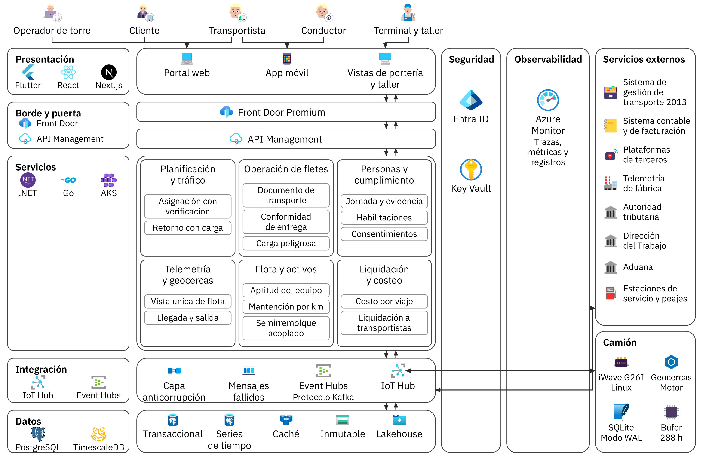
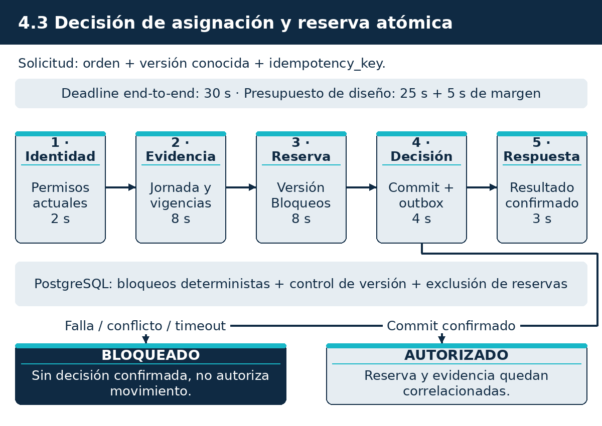
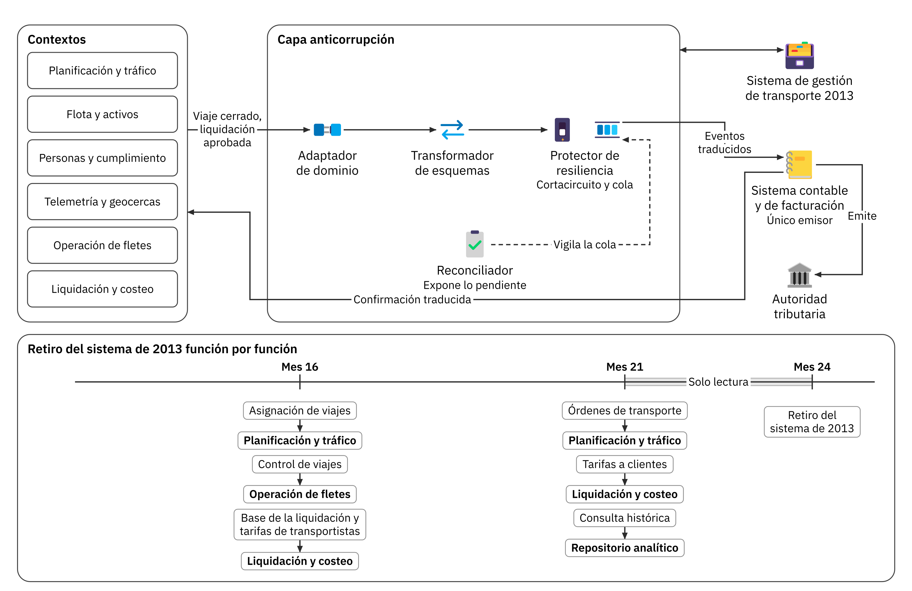
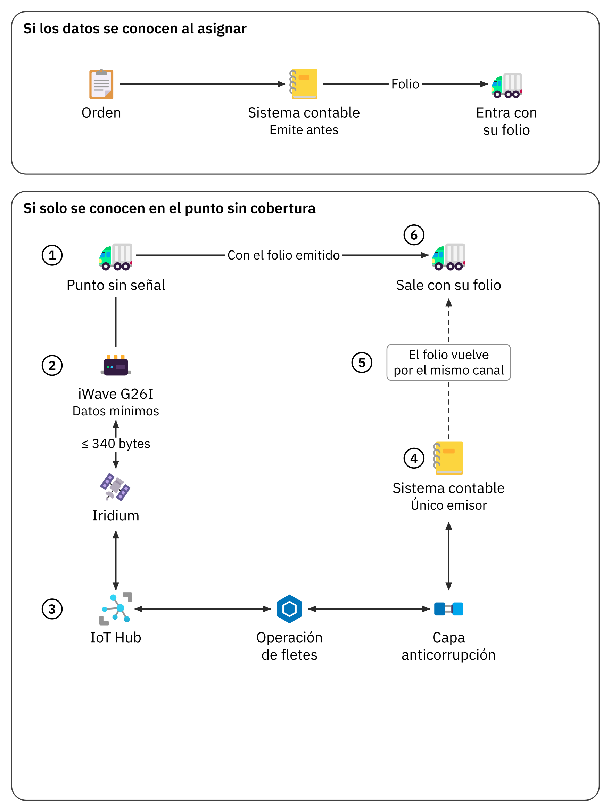
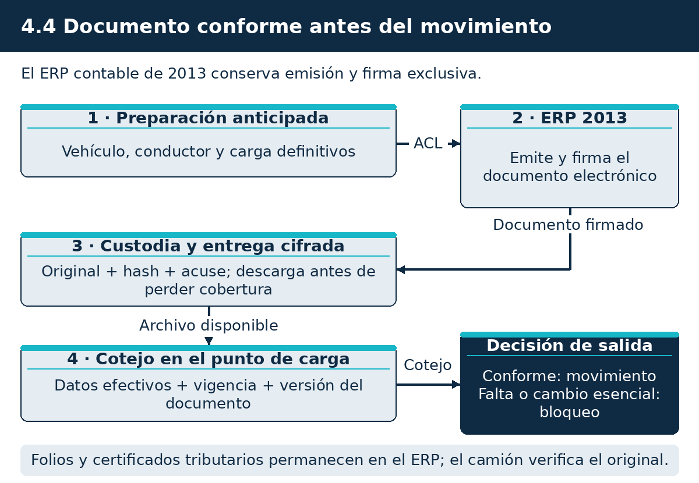
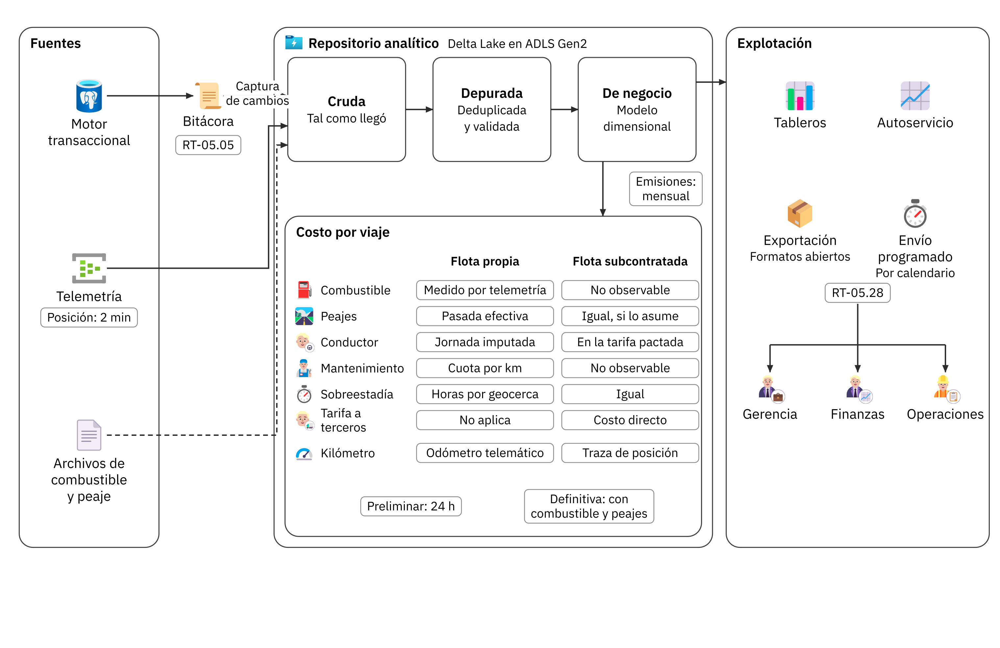
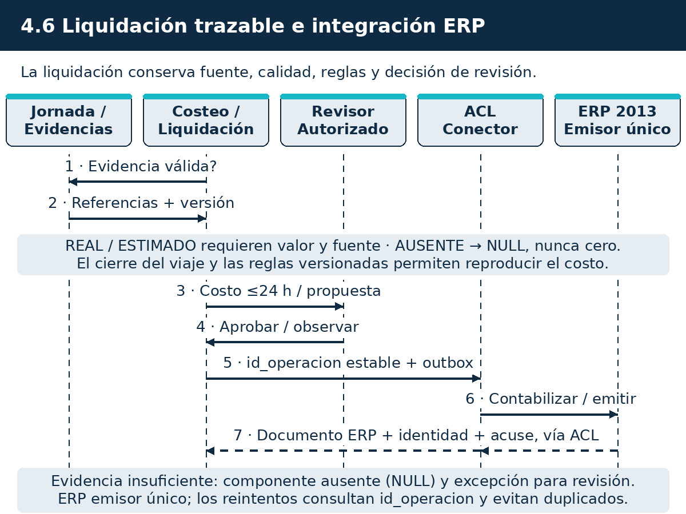

# Subdocumento 4.1. Arquitectura lógica de la solución

audIT, Empresa N.º 10. Licitación TFEP-01/2026, Caso 10 Transporte de Carga. Oferta Técnica, Sobre N.º 2. Informe Preparatorio 2. Archivo AUDIT-Subdocumento4.pdf. Anexos: Formulario T-11 en el archivo AUDIT-Formulario-T-11.pdf.

## Resolución de observaciones del Informe 1

El FEP01, Artículo 46, p. 28 pide resolver en cada informe las observaciones de la instancia anterior, con trazabilidad entre observación, respuesta y sección modificada. La tabla reúne las observaciones del Informe 1 que corresponden a este documento y la sección donde se resuelve cada una.

**Resolución de las observaciones del Informe 1, conforme a FEP01, Artículo 46, p. 28**

| N.º | Observación | Respuesta | Sección modificada |
|---|---|---|---|
| 03 | El Anexo A del Subdocumento 4 no es el Formulario T-11, es una tabla de emplazamiento sin cantidades ni configuración. | Se acepta. Existe una fuente formal del T-11 con fichas de componentes, cantidades y configuración. La respuesta de almacenamiento y reconexión se reconcilia con S4; disponer del archivo no acredita por sí solo conformidad de todas las fichas. | S4, formularios/T-11.tex; dimensionamiento de S4. |
| 53 | Diagrama de las 8 capas no muestra interfaces ni explica qué contiene cada capa ni cómo se conectan. | Se acepta. Se acoge la observación. La respuesta de trabajo propone la siguiente medida, cuya implementación no se acredita en este lote: «Se rediseña el diagrama de arquitectura lógica en capas con interfaces explícitas (REST, gRPC, Kafka, CDC Debezium) y descripción técnica componente a componente.». Su cierre requiere examen de la fuente y de la evidencia correspondiente; no se declara realizada esa revisión para capítulos ajenos al lote S1/S2/S9 y al cálculo de S4. | Sección 4.1.2 (Figura 4.1). |
| 54 | Componentes representados solo como íconos genéricos (terminal de torre y pantalla de terreno sin especificar). | Se acepta. Se acoge la observación. La respuesta de trabajo propone la siguiente medida, cuya implementación no se acredita en este lote: «Se individualiza cada componente: sistema operativo, software ejecutado, protocolos de enlace, roles de usuario y hardware de soporte.». Su cierre requiere examen de la fuente y de la evidencia correspondiente; no se declara realizada esa revisión para capítulos ajenos al lote S1/S2/S9 y al cálculo de S4. | Sección 4.1.2. |
| 55 | No hay matriz de requerimiento a componente; ningún RF del Subdocumento 3 se ubica en un componente. | Se acepta. T-12 asigna contexto y paquete EDT a cada uno de los 42 requerimientos, cotejados con S3. T-17 vincula esa matriz con casos y variantes verificables. No se acredita aquí la correspondencia física completa de cada componente de S4, que requiere revisión propia. | T-12, campo componente; S3 3.2.8 y 3.4.7; T-17, matriz de trazabilidad. S4 pendiente de examen integral. |
| 56 | No se mencionan los principios SOLID, la referencia se reduce a ISO 42010 y los ambientes SDLC están ausentes. | Se acepta. Se acoge la observación. La respuesta de trabajo propone la siguiente medida, cuya implementación no se acredita en este lote: «Se fundamenta el diseño bajo principios SOLID, se estructura la vista lógica bajo ISO/IEC/IEEE 42010 y se documentan formalmente los ambientes del SDLC (Dev, QA, Staging, Producción, DR).». Su cierre requiere examen de la fuente y de la evidencia correspondiente; no se declara realizada esa revisión para capítulos ajenos al lote S1/S2/S9 y al cálculo de S4. | Sección 4.1.1 y Sección 4.1.6. |
| 57 | Diagrama de secuencia de asignación bloqueante huérfano y faltan secuencias de reconexión, emisión y liquidación. | Se acepta. Se acoge la observación. La respuesta de trabajo propone la siguiente medida, cuya implementación no se acredita en este lote: «Se vincula el diagrama al texto analítico y se agregan las secuencias de reconexión masiva tras 288 h de sombra, emisión sin cobertura y liquidación a 148 transportistas.». Su cierre requiere examen de la fuente y de la evidencia correspondiente; no se declara realizada esa revisión para capítulos ajenos al lote S1/S2/S9 y al cálculo de S4. | Sección 4.1.8. |
| 58 | Frameworks y tecnologías viven solo en las figuras; el texto no las decide ni las justifica técnicamente. | Se acepta. Se acoge la observación. La respuesta de trabajo propone la siguiente medida, cuya implementación no se acredita en este lote: «Se justifica la adopción de cada tecnología (C++/Go en borde, .NET Core/Node.js en backend, PostgreSQL/TimescaleDB) evaluando rendimiento, soporte y compatibilidad.». Su cierre requiere examen de la fuente y de la evidencia correspondiente; no se declara realizada esa revisión para capítulos ajenos al lote S1/S2/S9 y al cálculo de S4. | Sección 4.1.7. |
| 59 | El modelo táctico DDD no trae límites de contexto (*Bounded Contexts*) ni eventos de dominio. | Se acepta. Se acoge la observación. La respuesta de trabajo propone la siguiente medida, cuya implementación no se acredita en este lote: «Se formaliza el diseño táctico DDD con especificación rigurosa de Bounded Contexts, agregados, comandos de negocio y eventos de dominio transmitidos por Kafka.». Su cierre requiere examen de la fuente y de la evidencia correspondiente; no se declara realizada esa revisión para capítulos ajenos al lote S1/S2/S9 y al cálculo de S4. | Sección 4.1.5. |
| 60 | Estrangulamiento del sistema 2013 sin ADR ni comparación de alternativas ni fundamento económico. | Se acepta. Se acoge la observación. La respuesta de trabajo propone la siguiente medida, cuya implementación no se acredita en este lote: «Se formaliza el ADR-01 evaluando alternativas (Big Bang, Retiro total vs Strangler Fig) con justificación técnica de riesgos y preservación de continuidad operacional.». Su cierre requiere examen de la fuente y de la evidencia correspondiente; no se declara realizada esa revisión para capítulos ajenos al lote S1/S2/S9 y al cálculo de S4. | Sección 4.1.5 (ADR-01). |
| 61 | El descarte de la banda ancha satelital queda registrado pero no aparece como ADR formal. | Se acepta. Se acoge la observación. La respuesta de trabajo propone la siguiente medida, cuya implementación no se acredita en este lote: «Se documenta el ADR-02 justificando el descarte de terminales satelitales de alta velocidad frente al computador de borde con buffer local eMMC de 8 GB y persistencia offline.». Su cierre requiere examen de la fuente y de la evidencia correspondiente; no se declara realizada esa revisión para capítulos ajenos al lote S1/S2/S9 y al cálculo de S4. | Sección 4.1.5 (ADR-02). |
| 62 | Se afirma que el estilo arquitectónico se justifica con la volumetría sin justificarlo ni comparar estilos. | Se acepta. Se acoge la observación. La respuesta de trabajo propone la siguiente medida, cuya implementación no se acredita en este lote: «Se realiza análisis comparativo de estilos (Monolito, Microservicios, Event-Driven, SOA), fundamentando la adopción del estilo híbrido Event-Driven según la volumetría del Caso 10.». Su cierre requiere examen de la fuente y de la evidencia correspondiente; no se declara realizada esa revisión para capítulos ajenos al lote S1/S2/S9 y al cálculo de S4. | Sección 4.1.3. |
| 63 | El stack tecnológico no ha sido validado formalmente. | Se acepta. Se acoge la observación. La respuesta de trabajo propone la siguiente medida, cuya implementación no se acredita en este lote: «Se presenta la matriz del stack tecnológico validando versiones estables LTS, fechas de fin de soporte (EOL) del fabricante y pruebas de concepto de laboratorio.». Su cierre requiere examen de la fuente y de la evidencia correspondiente; no se declara realizada esa revisión para capítulos ajenos al lote S1/S2/S9 y al cálculo de S4. | Sección 4.1.7. |
| 64 | Falta diagrama de arquitectura física; la figura 1.8 son íconos y cajas sin SKU, vNets, subredes ni enlaces. | Se acepta. Se acoge la observación. La respuesta de trabajo propone la siguiente medida, cuya implementación no se acredita en este lote: «Se incorpora el diagrama de arquitectura física exhaustivo con servicios Azure, SKUs exactos, topología vNet/subredes, enlaces redundantes y dimensionamiento de ancho de banda.». Su cierre requiere examen de la fuente y de la evidencia correspondiente; no se declara realizada esa revisión para capítulos ajenos al lote S1/S2/S9 y al cálculo de S4. | Sección 4.2.1 (Figura 4.2). |
| 65 | Contradicciones en componentes Azure (Data Explorer vs Timescale/Cosmos, Kafka vs Event Hubs). | Se acepta. Se acoge la observación. La respuesta de trabajo propone la siguiente medida, cuya implementación no se acredita en este lote: «Se unifica y congela la arquitectura: Apache Kafka en clúster Strimzi sobre AKS, TimescaleDB para telemetría de series temporales y PostgreSQL para datos transaccionales.». Su cierre requiere examen de la fuente y de la evidencia correspondiente; no se declara realizada esa revisión para capítulos ajenos al lote S1/S2/S9 y al cálculo de S4. | S4 §4.2.8 y S5 §5.5. |
| 66 | La sala de servidores de 26 m² se compara ítem por ítem pero falta plano, carga eléctrica y balance térmico. | Se acepta. Se acoge la observación. La respuesta de trabajo propone la siguiente medida, cuya implementación no se acredita en este lote: «Se incorpora memoria técnica con plano de distribución en planta, consumo eléctrico estimado (kW) y balance térmico de disipación (BTU/h) de la sala técnica de Curimón S.A.». Su cierre requiere examen de la fuente y de la evidencia correspondiente; no se declara realizada esa revisión para capítulos ajenos al lote S1/S2/S9 y al cálculo de S4. | Sección 4.2.6. |
| 67 | Ningún diagrama físico se cita desde el texto analítico. | Se acepta. Se acoge la observación. La respuesta de trabajo propone la siguiente medida, cuya implementación no se acredita en este lote: «Se referencian y recorren en profundidad todos los diagramas de arquitectura física desde el texto analítico del documento.». Su cierre requiere examen de la fuente y de la evidencia correspondiente; no se declara realizada esa revisión para capítulos ajenos al lote S1/S2/S9 y al cálculo de S4. | Subdocumento 4 completo. |
| 68 | La sección 1.2.8 promete declarar cada producto con versión, fin de soporte y parches y no declara ninguno. | Se acepta. Se acoge la observación. La respuesta de trabajo propone la siguiente medida, cuya implementación no se acredita en este lote: «Se formaliza la matriz completa de hardware y software base con versión, ciclo de vida, soporte oficial y plan de actualización y parches de seguridad.». Su cierre requiere examen de la fuente y de la evidencia correspondiente; no se declara realizada esa revisión para capítulos ajenos al lote S1/S2/S9 y al cálculo de S4. | Sección 4.2.8. |
| 70 | Sin cantidades, el parque oscila entre 374 y «según adhesión» y no se explicita el no reemplazo de terceros. | Se acepta. Se acoge la observación. La respuesta de trabajo propone la siguiente medida, cuya implementación no se acredita en este lote: «Se congelan las cantidades del parque: 374 camiones (148 propios retrofiteados con audIT EdgeHub v2.4, 192 terceros homologados por API y 34 terceros sin GPS equipados por audIT con pinzas CANclick).». Su cierre requiere examen de la fuente y de la evidencia correspondiente; no se declara realizada esa revisión para capítulos ajenos al lote S1/S2/S9 y al cálculo de S4. | Sección 4.2.2 y Anexo A. |
| 71 | Se afirma que hay 18 componentes en la región primaria y la tabla suma 20; la matriz cubre 14 de 34. | Se acepta. Se acoge la observación. La respuesta de trabajo propone la siguiente medida, cuya implementación no se acredita en este lote: «Se corrigen los conteos de componentes cloud y se cuadra al 100 % la matriz de infraestructura y servicios de la región primaria.». Su cierre requiere examen de la fuente y de la evidencia correspondiente; no se declara realizada esa revisión para capítulos ajenos al lote S1/S2/S9 y al cálculo de S4. | Sección 4.2.4 y Anexo A. |
| 72 | La región secundaria no tiene nombre y el Artículo 16.3 exige declararla formalmente. | Se acepta. Se acoge la observación. La respuesta de trabajo propone la siguiente medida, cuya implementación no se acredita en este lote: «Se formaliza a Brazil South (São Paulo) como la región secundaria de contingencia y réplica de datos de audIT SpA, en estricto cumplimiento del Art. 16.3.». Su cierre requiere examen de la fuente y de la evidencia correspondiente; no se declara realizada esa revisión para capítulos ajenos al lote S1/S2/S9 y al cálculo de S4. | S4 §4.2.5 y S5 §5.9. |
| 73 | Los 8 GB del dispositivo embarcado no tienen cálculo; la derivación da 10 MB y 288 h dan cerca de 40 MB. | Se acepta. Se deriva el perfil de 72 h: 4.104 posiciones, 1.800 muestras de motor, 45 eventos y cinco documentos, 777.656 bytes sin fotos y 3.237.656 con ocho fotos. La ampliación propuesta 288 h suma 12.950.624 bytes brutos; overhead físico y reserva elevan el presupuesto a 38.851.872 bytes y se asignan 64 MiB. Sistemas A/B, arranque, diagnóstico y maestros llevan el total a 2.400 MiB (2,52 GB decimales). Capacidad útil, ocupación e integridad se verifican en HIL, sin presuponer compresión o equiparar cierre vial con desconexión. | S4, capacidad de almacenamiento y dimensionamiento; T-11; T-17 CP-HW-03. |
| 74 | La sincronización en 20 min por camión se repite como requisito y no se dimensiona ante reconexión masiva. | Se acepta. El perfil simultáneo usa 300 camiones, 1.786.200 registros y 971.296.800 bytes con fotos. Se calculan 6,48 Mbit/s útiles mínimos; con 25 % de transporte y 20 % de reserva temporal, 10,12 Mbit/s. Dos unidades S1 permiten estimar admisión de 71.400 paquetes en 11,9 min; no demuestra transferencia/persistencia. CP-PERF-02 mide confirmación completa y conciliación por camión en hasta veinte minutos. | S4, dimensionamiento y figura de reconexión; T-11; T-17 CP-PERF-02. |
| 75 | Ausentes eventos/segundo, TPS peak de asignación, volumen anual, datos a migrar y ancho de banda. | Se acepta. El perfil de carga mantiene hipótesis explícitas y no confunde concurrencia con viajes diarios. T-17 coteja con T-12 los 42 requisitos y separa ensayo de 72 h de ampliación propuesta de 288 h. La cantidad histórica a migrar y la medición operacional siguen sujetas al levantamiento; no se afirma disponer de 480.000 registros. | S2, supuestos; S3/T-12; T-17 CP-PERF-01, CP-PERF-02 y CP-HW-03. Volumetría integral de S4 pendiente. |
| 77 | El equipo de TI de 9 personas no se menciona y el RT-03.05 se cita sin listar los servicios administrados. | Se acepta. Se acoge la observación. La respuesta de trabajo propone la siguiente medida, cuya implementación no se acredita en este lote: «Se modela la interacción operativa con el equipo de TI de 9 personas de Curimón S.A. y se detallan los servicios administrados provistos por audIT SpA bajo RT-03.05.». Su cierre requiere examen de la fuente y de la evidencia correspondiente; no se declara realizada esa revisión para capítulos ajenos al lote S1/S2/S9 y al cálculo de S4. | Sección 4.2.8. |
| 78 | Se tratan los 3 proveedores GPS y 34 camiones sin equipo pero no se dice qué se instala ni cómo conviven. | Se acepta. Se acoge la observación. La respuesta de trabajo propone la siguiente medida, cuya implementación no se acredita en este lote: «Se especifica la arquitectura de coexistencia: capa de integración API (ACL) para Wialon/Wisetrack, e instalación de audIT EdgeHub v2.4 con pinzas CANclick en los 34 tractos desprovistos.». Su cierre requiere examen de la fuente y de la evidencia correspondiente; no se declara realizada esa revisión para capítulos ajenos al lote S1/S2/S9 y al cálculo de S4. | Sección 4.2.2. |
| 79 | La recuperación ante desastres y continuidad se separan con argumento sísmico sin justificar factibilidad. | Se acepta. Se acoge la observación. La respuesta de trabajo propone la siguiente medida, cuya implementación no se acredita en este lote: «Se fundamenta la factibilidad técnica y latencia ($<50\text{ ms}$) del enlace hacia Brazil South, garantizando el cumplimiento estricto del RTO $\le 4\text{ h} y RPO \le 15\text{ min}$.». Su cierre requiere examen de la fuente y de la evidencia correspondiente; no se declara realizada esa revisión para capítulos ajenos al lote S1/S2/S9 y al cálculo de S4. | Sección 4.2.5. |
| 80 | Los respaldos aparecen en una sola fila y no hay modelo Zero Trust explícito ni superficie de exposición. | Se acepta. Se acoge la observación. La respuesta de trabajo propone la siguiente medida, cuya implementación no se acredita en este lote: «Se diseña la arquitectura de ciberseguridad: modelo Zero Trust, microsegmentación de subredes, Azure Bastion, WAF y almacenamiento inmutable WORM.». Su cierre requiere examen de la fuente y de la evidencia correspondiente; no se declara realizada esa revisión para capítulos ajenos al lote S1/S2/S9 y al cálculo de S4. | Sección 4.2.7. |

## 4 Introducción a la Arquitectura Lógica y Física de la Solución

Este capítulo describe cómo se construye la Plataforma Digital de Misión Crítica para Transporte de Carga: con qué piezas de software se organiza
la solución y en qué equipos, sitios y regiones de nube corre cada una. La sección 4.1 presenta la
arquitectura lógica, sus ocho capas, sus seis contextos delimitados y sus decisiones registradas, y la
4.1.1 las tecnologías de software. La sección 4.2 ubica cada componente en la nube, en San Bernardo,
en los cuatro terminales regionales y en los camiones, declara los enlaces y los puntos únicos de
falla, y dimensiona la ingesta de datos y la reconexión masiva. La sección 4.3 declara los dos
centros de datos: Azure Chile Central como región primaria, con la sala de San Bernardo como sitio de
continuidad, y Azure Brazil South como región secundaria.

El capítulo parte del esquema de solución del Subdocumento 3 y del catálogo de requerimientos de su
Formulario T-12. Se apoya en el modelo de datos del Subdocumento 5, que define dónde reside cada dato
y cómo se respalda. Los riesgos que abre la infraestructura, como el apagado de las redes 2G y 3G o el
retraso de una réplica, se tratan en el Subdocumento 8, y el ritmo de instalación a bordo en el plan
de trabajo del Subdocumento 7. La innovación tecnológica del Subdocumento 13 usa el Bluetooth del
equipo a bordo que se especifica aquí. Lo que el mandante compra, con cantidades y características, se
detalla en el Formulario T-11, que acompaña este capítulo como archivo propio
(`AUDIT-Formulario-T-11.pdf`), conforme al Comunicado 10, sección 1.

## 4.1 Arquitectura lógica

El Capítulo 5 del Caso resume el problema en una frase. El sistema de gestión de transporte de 2013
conoce el viaje que la compañía encargó y no conoce el viaje que efectivamente ocurrió
(Caso, capítulo 5, p. 13). El dato existe repartido en tres plataformas de posicionamiento, en una
telemetría que nadie descarga, en una liquidación de combustible que llega con cuarenta días de
atraso y en papeles que viajan en la cabina, y nunca se junta. Esa dispersión no se corrige
configurando el sistema existente, porque nace de cómo está construido.

### 4.1.1 Especificaciones Tecnologías de Software a utilizar

Cada producto ofertado se declara con su versión, su fecha de fin de soporte del fabricante y su plan
de actualización para los 56 meses del contrato. FEP02, RT-03.05, p. 8 obliga a privilegiar servicios
administrados sobre autoadministrados cuando ello reduzca el riesgo operacional y a justificar cada
excepción. El estilo arquitectónico se justifica con la volumetría del caso y no con la tendencia del
mercado, tal como advierte el numeral 2.3 de las Bases Técnicas Transversales. En la Tabla 4.1
se especifica la matriz tecnológica oficial seleccionada para la solución.

**Tabla 4.1.** Tecnologías de software, versiones y soporte ofertado a 56 meses

| Componente | Producto y versión | Fin de soporte | Plan a 56 meses y justificación |
|---|---|---|---|
| Aplicación móvil de conductores | Flutter 3.x (Dart) | Soporte LTS continuo | Compilación nativa Android e iOS con interfaz ergonómica de alto contraste (Caso, RT-13.08, p. 32) y almacenamiento local SQLite |
| Portales web y torre de control | React 18+ / Next.js | Soporte LTS continuo | Arquitectura web modular responsiva con renderizado híbrido y accesibilidad WCAG 2.2 AA (FEP01, Artículo 4.3, p. 5) |
| Servicios backend y APIs | .NET 8 LTS / Go 1.22+ | Noviembre 2026 / LTS | Microservicios contenerizados de alto rendimiento sobre Linux en imágenes sin herramientas sobrantes |
| Orquestación y cómputo | AKS 1.30+ | Soporte N-2 continuo | Servicio administrado PaaS con actualizaciones programadas fuera de horario punta |
| Motor transaccional | PostgreSQL 16 Flexible | Noviembre 2028 | Motor relacional con alta disponibilidad zonal y extensión geoespacial PostGIS |
| Series temporales y eventos | TimescaleDB 2.15 / Event Hubs | Mayo 2029 | Particionamiento por rango temporal y compresión columnar para el flujo de telemetría |
| Caché distribuida | Azure Cache for Redis 7.2 | Octubre 2028 | Almacenamiento en memoria con persistencia continua para geocercas y sesiones activas |
| Persistencia a bordo | SQLite 3 con modo WAL | Soporte activo LTS | Motor embebido industrial sobre memoria flash de 8 GB con protección contra cortes de energía |
| Lakehouse analítico | Delta Lake en ADLS Gen2 | Soporte activo continuo | Tablas con soporte ACID y aislamiento estricto respecto de la base transaccional |
| Gestión de identidad | Microsoft Entra ID / Key Vault | Servicio administrado | Autenticación OAuth 2.0 y custodia criptográfica con certificación FIPS 140-2 Nivel 3 |

*Fuente: Ciclos de vida oficiales de soporte (LTS) de los fabricantes.*

La matriz de la Tabla 4.1 prioriza servicios administrados y plataformas con soporte de largo plazo garantizado, asegurando estabilidad operativa y ausencia de obsolescencia tecnológica durante la vigencia del contrato.

### 4.1.2 Punto de partida

Los rasgos del sistema de 2013 que explican esa dispersión y la respuesta que da esta arquitectura a
cada uno se resumen en la Tabla 4.2.

**Tabla 4.2.** Rasgos del sistema de 2013 y respuesta de esta arquitectura

| Rasgo | Efecto que produce hoy | Respuesta de esta arquitectura |
|---|---|---|
| Base única compartida por tráfico, facturación y contabilidad | La consulta de gestión compite con la operación de la torre por el mismo motor | Separación del almacenamiento transaccional y del analítico, obligatoria por RT-05.05 |
| Integración con el sistema contable por consultas y tablas compartidas | Todo cambio contable alcanza el núcleo operacional sin traducción | Capa anticorrupción, obligatoria por RT-05.20 |
| Ausencia de costo por kilómetro por ruta | Tres de los ocho contratos principales se sirven bajo costo, el peor a menos catorce por ciento sostenido durante cuatro años (Caso, numeral 7.3, p. 15) | Costo por viaje en doble versión, preliminar y consolidada |
| Puerto de telemetría de fábrica inactivo | La lectura del motor de 61 tractocamiones no se aprovecha por temor a la garantía | Acoplamiento sin contacto sobre el arnés original |
| Módulos operativos acoplados entre sí | El sistema no distingue el viaje encargado del viaje ocurrido | Seis contextos delimitados, cada uno con sus propios datos |

*Fuente: Bases Técnicas del Caso, capítulos 5 y 7.*

Cada rasgo de la tabla tiene una respuesta estructural propia. Ninguna se resuelve configurando el
sistema existente.

### 4.1.3 Las ocho capas

La solución se organiza en las ocho capas del modelo de referencia, cuya existencia es obligatoria
conforme al FEP02, numeral 2.1, p. 6. RT-02.01 exige el diagrama que identifica cada capa, sus
componentes y las interfaces entre ellas, y la descripción se ajusta a ISO/IEC/IEEE 42010
(ISO, 2022). La Tabla 4.3 resume el contenido de cada capa.

**Tabla 4.3.** Las ocho capas y su contenido en esta solución

| Capa | Contenido |
|---|---|
| Presentación | Portal web para 84 clientes y 148 transportistas, aplicación móvil, terminales de torre y taller, pantallas de terreno operables con guantes |
| Borde y exposición | Distribución de contenidos, cortafuegos de aplicación, balanceo y terminación de cifrado. Único punto de entrada público |
| Puerta de enlace | Autenticación, autorización, cuotas, límites de tasa, versionado semántico y catálogo de servicios |
| Servicios de negocio | Seis contextos delimitados con límites explícitos, sin estado y desplegables de forma independiente |
| Integración y eventos | Bus de telemetría, bus transaccional, cola de mensajes fallidos, reintento y deduplicación |
| Datos | Persistencia políglota. Transaccional, series de tiempo, documental inmutable y analítica separadas |
| Seguridad | Identidad, autorización, gestión de secretos, cifrado y auditoría. Transversal a todas las capas |
| Observabilidad | Métricas, registros y trazas correlacionadas, sin puntos ciegos entre nube y terreno |

*Fuente: Bases Técnicas Transversales, numeral 2.1, y elaboración propia.*

Ninguna interfaz accede directamente a la base de datos. Una petición desciende atravesando las seis
capas de la pila y la respuesta asciende por el mismo camino. Seguridad y observabilidad no ocupan un
lugar en esa pila, la atraviesan entera. Los componentes declarados en cada capa se listan en la
Tabla 4.4.

**Tabla 4.4.** Componentes declarados por capa

| Capa | Componentes |
|---|---|
| Presentación | Portal web con representación en servidor, aplicación móvil en los cuatro perfiles que exige RT-17.01 del Caso, conductor, torre, terminal y taller, y transportista subcontratado, y vistas de portería y de taller de alto contraste |
| Borde y exposición | Distribución de contenidos con presencia global, cortafuegos de aplicación y protección volumétrica en las capas de red, transporte y aplicación |
| Puerta de enlace | Gestión de interfaces con identidad federada, certificado mutuo entre máquinas, límites de tasa por perfil y catálogo publicado |
| Servicios de negocio | Contenedores orquestados sobre nodos repartidos en tres zonas de disponibilidad, con un despliegue independiente por contexto delimitado |
| Integración y eventos | Flujo de telemetría para la ingesta masiva, bus transaccional con orden garantizado dentro de la partición y cola de mensajes fallidos, y capa anticorrupción frente al sistema contable |
| Datos | Motor relacional multizona, base de series de tiempo, caché en memoria, almacenamiento inmutable y repositorio analítico. El diseño detallado es materia del Subdocumento 5 |
| Seguridad | Bóveda de claves en módulo criptográfico, identidad federada con control por rol y por atributo, y bitácora que permite reconstruir quién, qué, cuándo y con qué valores anteriores, según RT-05.03 |
| Observabilidad | Instrumentación única con trazas, métricas y registros correlacionados por el identificador común que RT-05.19 exige a toda integración |

*Fuente: elaboración propia.*

La Figura 4.1 dibuja las ocho capas con sus componentes.

*Figura 4.1. Las ocho capas obligatorias del numeral 2.1 transversal, con sus componentes e interfaces, conforme a RT-02.01*

Fuente: Elaboración propia.

La figura muestra la pila de seis capas y las dos capas transversales. Las capas de servicios y de
datos existen además a bordo del camión, en versión reducida, para operar sin enlace.

### 4.1.4 Los seis contextos delimitados

RT-02.02 rechaza toda arquitectura monolítica que no permita desplegar de forma independiente sus
componentes críticos. Los servicios de negocio se organizan en seis contextos, cada uno con su propio
lenguaje y sus propios datos. Un contexto no consulta la base de datos de otro, le pregunta. La
Tabla 4.5 declara qué decide cada uno.

**Tabla 4.5.** Contextos delimitados y la decisión que sostiene cada uno

| Contexto | Qué decide |
|---|---|
| Planificación y tráfico | Qué carga hay que mover y hacia dónde |
| Flota y activos | Si el equipo puede salir hoy |
| Personas y cumplimiento | Si la persona puede conducir hoy |
| Telemetría y geocercas | Dónde está el camión y cuándo llegó |
| Operación de fletes | El viaje que realmente ocurrió |
| Liquidación y costeo | Cuánto costó y a quién se paga |

*Fuente: elaboración propia.*

El sistema de gestión de 2013 mezcla los seis, y esa es la razón de fondo por la que conoce el viaje
que se encargó y no conoce el viaje que ocurrió. La Figura 4.2 muestra los seis contextos
y los sistemas con los que conviven.

*Figura 4.2. Contextos delimitados del dominio y sistemas con los que convive la solución*

Fuente: Elaboración propia.

En la figura, cada contexto tiene su propio lenguaje y sus propios datos. Planificación y tráfico puede bloquear un
viaje sin conocer por dentro a Personas y cumplimiento ni a Flota y activos, porque les pregunta.

### 4.1.5 Convivencia con lo que ya existe

RT-05.20 obliga a aislar mediante una capa anticorrupción las integraciones con sistemas heredados o
de terceros, de modo que un cambio en el sistema externo no propague su modelo al núcleo. Esa capa
sustituye los módulos operativos de 2013, tráfico, despacho, tarifas y liquidación, y encapsula el
sistema contable, que se conserva como único emisor de documentos tributarios.

### 4.1.6 Registro de decisiones de arquitectura

RT-02.04 y el FEP01, Artículo 19, p. 14 convierten el registro de decisiones en entregable contractual, con la
alternativa escogida, las descartadas y el criterio de selección. Se registran cuatro decisiones
estructurales de la arquitectura lógica en la Tabla 4.6.

**Tabla 4.6.** Decisiones de arquitectura lógica registradas (ADR 01 a 04)

| ADR | Fecha | Contexto | Decisión | Alternativa descartada | Criterio y consecuencias |
|---|---|---|---|---|---|
| ADR-01 | 2026-08-14 | Ráfagas masivas de telemetría concurrente con la operación de despacho | Contenedores orquestados en AKS con microservicios desacoplados | Monolito modular con escalado vertical | Aislamiento estricto de fallas. La ingesta masiva no degrada el despacho |
| ADR-02 | 2026-08-18 | Asignación de viaje dispara geocercas, alertas, costeo y notificación | Arquitectura dirigida por eventos con Azure Event Hubs / Kafka | Cadena síncrona de llamadas HTTP REST | Desacoplamiento temporal. Despacho confirma en sub-2s sin esperar procesos derivados |
| ADR-03 | 2026-08-22 | Finanzas requiere costeo consolidado sin afectar latencia transaccional | Captura de datos en cambio (CDC) y Lakehouse Delta Lake | Consultas analíticas sobre réplica de lectura transaccional | RT-05.05 prohíbe degradar OLTP. Aislamiento total de analítica pesada |
| ADR-04 | 2026-08-27 | Seguridad federada para clientes, transportistas y ERP 2013 | Autenticación mTLS, OAuth 2.0 y Entra ID federado | Tokens estáticos o API keys compartidas en URL | RT-05.18 prohíbe credenciales en URI. Rotación automática y Zero Trust |

*Fuente: elaboración propia.*

Estas cuatro son las decisiones estructurales de la capa lógica. El registro completo es entregable
contractual y se actualiza durante toda la ejecución, según ordena el mismo RT-02.04.

### 4.1.7 Degradación, escalamiento y puntos únicos de falla

Tres requisitos obligatorios de la misma sección exigen declaraciones que conviene no dejar
implícitas. RT-02.09 obliga a degradar de forma elegante, de modo que la caída de un componente no
crítico deje la solución operando en modo reducido y avisando de la degradación, y nunca falle de
forma total. La aplicación de esa regla en esta operación es directa. Si el repositorio analítico no
responde, la torre sigue despachando. Si el sistema contable no responde, la operación sigue y la
emisión tributaria se encola. Si el enlace satelital no está disponible, el registro sigue
acumulándose a bordo.

RT-02.10 exige que las capas de aplicación e integración escalen horizontalmente de forma automática,
con umbrales, límites superiores y costo asociado declarados en la oferta. Los umbrales y los límites
se declaran en esta sección. El costo asociado se remite al Sobre N.º 3, porque el FEP01, Artículo 50.2, p. 29
excluye toda cifra de precio de la Oferta Técnica.

RT-02.11 evalúa como observación grave omitir la declaración de los puntos únicos de falla que
subsistan. Esta oferta declara dos en la capa lógica, que se listan en la Tabla 4.7.

**Tabla 4.7.** Puntos únicos de falla declarados en la capa lógica

| Punto | Por qué subsiste | Por qué es aceptable |
|---|---|---|
| El sistema contable de 2013 como emisor único de documentos tributarios | La restricción 8 lo fija y no es negociable | La capa anticorrupción aísla su indisponibilidad. La operación no se detiene y la emisión se recupera al restablecerse |
| El dispositivo a bordo de cada camión | Hay uno por unidad y solo puede intervenirse cuando el camión pasa por un terminal, según RT-06.01 del Caso | La falla afecta a una unidad y no a la flota. Se mitiga con repuestos precargados y con el procedimiento supletorio de la sección 4.3.2 |

*Fuente: elaboración propia sobre el Caso, capítulo 10 y RT-06.01.*

Los puntos únicos de falla de la infraestructura física se analizan en la sección 4.2.7.

### 4.1.8 Resiliencia

Los servicios de negocio son sin estado, con el estado de sesión y de proceso en almacenes externos de
alta disponibilidad. Los patrones de RT-02.08 son obligatorios y esta oferta los adopta. Tiempos
límite explícitos en toda llamada remota, cortacircuitos y mamparos para aislar fallas de
integraciones externas, y reintento exponencial con variación aleatoria. La escritura es idempotente
con ventana de deduplicación dimensionada para tolerar la desconexión prolongada en ruta.

El estado de sesión y el estado de proceso residen en almacenes externos de alta disponibilidad, como
exige RT-02.05. Allí viven las sesiones concurrentes de los 22 operadores de la torre, las credenciales
activas y las geocercas de los 1.400 puntos distintos de carga y descarga que declara el
Caso, numeral 14.1, p. 29. Cualquier instancia puede destruirse y reemplazarse sin pérdida de
transacciones en curso. Los parámetros de la Tabla 4.8 son de diseño de audIT y se ajustan
con la medición de la Etapa 1.

**Tabla 4.8.** Parámetros de los patrones de resiliencia

| Patrón | Parámetro declarado |
|---|---|
| Cortacircuito | Se abre al superarse la mitad de las llamadas fallidas en una ventana deslizante de diez peticiones, permanece abierto 30 segundos y admite tres llamadas de prueba antes de restablecer el tráfico |
| Mamparo | La verificación bloqueante del despacho tiene su propio conjunto de hilos y de conexiones. La saturación de la consulta de liquidaciones o de reportes no le quita capacidad |
| Tiempo de espera | Validación en memoria, 800 milisegundos. Consulta transaccional del despacho, 5 segundos. Llamada al sistema contable a través de la capa anticorrupción, 10 segundos. Emisión del documento electrónico de transporte, 90 segundos, que es el techo que fija RT-09.01 del Caso |
| Reintento | Tres intentos sobre operaciones idempotentes, con retroceso exponencial y variación aleatoria. La variación evita que cientos de unidades que recuperan cobertura a la vez reintenten sincronizadas |
| Límite de tasa | Declarado por perfil en la puerta de enlace, según se detalla en la gobernanza de interfaces |

*Fuente: elaboración propia sobre RT-02.08 y RT-09.01 del Caso.*

Los tiempos de espera escalonan desde la validación en memoria hasta el techo de 90 segundos del Caso,
de modo que ninguna llamada lenta consume el presupuesto de la verificación bloqueante.

### 4.1.9 Verificación bloqueante del despacho

Caso, RT-09.01, p. 32 fija en 30 segundos el tope para asignar un viaje con verificación de jornada,
habilitaciones y aptitud del equipo. El servicio evalúa en paralelo las tres invariantes de la
Tabla 4.9, y ninguna admite excepción automática.

**Tabla 4.9.** Invariantes de la verificación bloqueante

| Invariante | Qué comprueba | Fundamento |
|---|---|---|
| Conductor | Horas conducidas en el día, continuidad sin descanso y acumulado del período | Artículo 25 bis del Código del Trabajo (Ministerio del Trabajo, 2003) |
| Tractocamión | Revisión técnica aprobada, seguro obligatorio vigente y permiso de circulación al día | Numeral 4.4 del Caso |
| Semirremolque y carga peligrosa | Curso vigente del conductor y correspondencia entre la documentación y lo efectivamente cargado | Decreto Supremo N.º 298 (Ministerio de Transportes, 1995) |

*Fuente: elaboración propia sobre la normativa citada.*

La secuencia bloquea la clave de idempotencia, evalúa las tres invariantes en paralelo, persiste en
una única transacción y responde. El presupuesto de tiempo de cada paso se reparte en la
Tabla 4.10.

**Tabla 4.10.** Reparto del presupuesto de 30 segundos

| Paso | Presupuesto | Dónde se resuelve |
|---|---|---|
| Validación del contrato de entrada y bloqueo de la clave de idempotencia | 10 milisegundos | Puerta de enlace y caché en memoria |
| Evaluación paralela de las tres invariantes | 450 milisegundos | Caché en memoria, con respaldo en el motor transaccional |
| Persistencia atómica del viaje asignado | 200 milisegundos | Motor transaccional, aislamiento serializable |
| Publicación de los efectos derivados | Fuera del camino bloqueante | Bus transaccional |
| Total comprometido | Por debajo de 2 segundos | Frente al techo de 30 segundos de RT-09.01 del Caso |

*Fuente: elaboración propia.*

Ante rechazo el sistema responde en menos de un segundo con un documento de error estructurado que
nombra la invariante incumplida, de modo que el operador sepa qué falta y no reintente a ciegas. Los
campos de ese documento se listan en la Tabla 4.11.

**Tabla 4.11.** Contenido del documento de error ante un despacho rechazado

| Campo | Contenido |
|---|---|
| Tipo | Identificador estable de la causal, resoluble a su documentación |
| Título | Enunciado breve de la invariante incumplida |
| Estado | Código que distingue el rechazo por regla de negocio del error técnico |
| Detalle | Valor medido y umbral aplicado, para que el operador sepa cuánto falta |
| Instancia | Identificador del viaje y del intento de asignación, correlacionable con la bitácora |

*Fuente: elaboración propia.*

El presupuesto se cumple con holgura porque la evaluación ocurre sobre datos en memoria. Esa holgura es
deliberada. RT-09.03 obliga a soportar tres veces la volumetría inicial sin rediseño, y un margen
estrecho hoy sería un rediseño mañana. La Figura 4.3 muestra los patrones de resiliencia
y el flujo de la asignación bloqueante.

*Figura 4.3. Patrones de resiliencia y flujo de la asignación bloqueante*

Fuente: Elaboración propia.

La figura sigue la asignación desde la puerta de enlace hasta la persistencia, con los mamparos y
cortacircuitos que la separan de las integraciones externas.

El detalle paso a paso de los mensajes y validaciones concurrentes de la asignación se ilustra en la Figura 4.4.

*Figura 4.4. Diagrama de secuencia de la verificación bloqueante del despacho*

Fuente: Elaboración propia.

Como ilustra la Figura 4.4, la transacción ejecuta la validación paralela de jornada, tracto y rampla, persistiendo de manera atómica con aislamiento serializable en PostgreSQL y emitiendo el token de despacho únicamente tras confirmar la invariante.

### 4.1.10 Idempotencia y ventana de deduplicación

RT-02.06 exige escrituras idempotentes. Cada operación lleva una clave única que se retiene durante
siete días, plazo dimensionado para cubrir las 72 horas de desconexión más el margen de los cierres
prolongados del paso fronterizo. La clave se bloquea en el almacén en memoria y se respalda con una
restricción de unicidad duradera en el motor transaccional, de modo que un reintento tras la
reconexión masiva no duplica un viaje ni un documento.

La ventana opera en dos niveles con propósitos distintos. El nivel en memoria resuelve la concurrencia
inmediata. Si la clave ya está tomada y la operación sigue en curso, la petición se rechaza como
conflicto. Si ya se completó, se devuelve la respuesta guardada en lugar de repetir la escritura. El
nivel duradero resuelve el caso que importa aquí, el mensaje que llega desde el búfer de un camión
después de días sin cobertura, cuando la clave ya expiró en memoria. La restricción de unicidad lo
descarta sin importar cuánto tiempo pasó. RT-02.07 exige además deduplicación en el consumidor y orden
garantizado dentro de la partición, y ambos se aplican al flujo de telemetría.

### 4.1.11 Gobernanza de interfaces y contratos

FEP02, RT-05.16, p. 12 obliga a documentar los servicios síncronos en OpenAPI 3.1 y los flujos dirigidos
por eventos en AsyncAPI 2.6 o superior, y exige que esa documentación se genere desde el código y se
mantenga actualizada de forma automática. La consecuencia práctica es que no se admite discrepancia
entre el contrato publicado y la implementación viva, porque el contrato no se escribe aparte.
A modo representativo, el servicio síncrono de verificación bloqueante pre-despacho expone el contrato
`POST /api/v1/despacho/validar` documentado bajo OpenAPI 3.1, recibiendo en su esquema JSON
los identificadores del viaje (`viajeId`), conductor (`conductorRut`), tracto
(`patenteTracto`), rampla (`patenteRampla`) y carga (`codigoSUSPEL`), retornando el
veredicto (`autorizado`), latencia de validación (`latenciaMs`) y la bitácora auditable de
factores. En paralelo, el evento asíncrono de notificación de salida se formaliza bajo AsyncAPI 2.6
en el canal de eventos de operaciones, transportando payloads en formato CloudEvents con firma HMAC-SHA256.

RT-05.17 obliga a versionar semánticamente los contratos, con compatibilidad hacia atrás y política de
obsolescencia con preaviso mínimo de seis meses. RT-05.18 fija el mecanismo de autenticación entre
sistemas y prohíbe la clave estática en la ruta de la dirección web. RT-05.19 exige registrar la
transacción de entrada y la de salida de toda integración con un identificador de correlación común,
que es lo que permite seguir una operación de negocio a través de todos los sistemas que toca. Ese
identificador es el mismo que usa la capa de observabilidad.

RT-05.21 obliga a declarar, por cada integración, el modo, el volumen esperado, la ventana de
disponibilidad de la contraparte y el comportamiento de la solución cuando esa contraparte no
responde. Esa declaración se entrega en la Tabla 4.12.

**Tabla 4.12.** Declaración por integración conforme a RT-05.21

| Contraparte | Modo | Volumen esperado | Ventana de la contraparte | Si no responde |
|---|---|---|---|---|
| Sistema contable y de facturación | Asíncrono | Documentos y asientos de 96.000 viajes al año | Horario administrativo, sin compromiso 24x7 | Cortacircuito y encolado. La operación no se detiene |
| Plataformas de posicionamiento de terceros | Asíncrono | Posición de los camiones de terceros con dispositivo | No declarada por el Caso | Última posición conocida con su antigüedad visible, nunca una posición sin fecha |
| Telemetría de fábrica | Asíncrono | 61 tractocamiones, solo lectura | Sujeta a la autorización de cada fabricante | El viaje se registra igual con el dispositivo a bordo |
| Red de estaciones de servicio | Por lotes | 74.000 abastecimientos al año | Mensual, con hasta 40 días de desfase | El costo se emite preliminar y se marca como pendiente |
| Concesionarias de peaje | Por lotes | 620.000 pasadas al año | Mensual | Peaje estimado por la traza, marcado como estimado |
| Autoridad tributaria | Síncrono | 128.000 documentos al año | Según disponibilidad del servicio | Emisión de contingencia y envío diferido |
| Clientes y autoridad aduanera | Ambos | Según contrato y cruce | Variable | Reintento con retroceso y aviso a la torre |

*Fuente: Caso, numeral 14.1, p. 29, y elaboración propia.*

Los volúmenes de esta tabla provienen del Caso, numeral 14.1, p. 29. La ventana de disponibilidad de las
plataformas de terceros y de la autoridad tributaria no está declarada en las bases y se consulta al
mandante. RT-05.22 exige además carga y descarga masiva en formatos abiertos, con validación previa,
informe de errores por registro y procesamiento parcial. Esa capacidad es la que sostiene la migración
de las cerca de 6.000 vigencias y la ingesta mensual de combustible y peajes. La
Figura 4.5 dibuja el mapa de integraciones.

*Figura 4.5. Mapa de integraciones. Sistemas internos, fuentes de terreno y contrapartes externas*

Fuente: Elaboración propia.

El sistema contable y de facturación heredado de 2013 se preserva íntegramente como único emisor tributario legal, integrándose a través de la Capa Anticorrupción (ACL), mientras que las funciones operacionales de tráfico, despacho y liquidación se desacoplan gradualmente mediante el patrón Estrangulador (Strangler Fig).

### 4.1.12 Convivencia con el sistema contable heredado

La capa anticorrupción sustituye los módulos operativos de 2013, tráfico, despacho, tarifas y
liquidación, y encapsula el sistema contable, que se conserva como único emisor de documentos
tributarios. El aislamiento es bidireccional. Un cambio en el sistema externo no propaga su modelo al
núcleo, y el núcleo no escribe directamente sobre el legado.

RT-02.14 valora la aplicación documentada de patrones de arquitectura evolutiva que permitan
sustituir un componente sin reescribir la solución, y nombra tres. Esta oferta aplica los tres. La capa
anticorrupción frente al sistema heredado, el estrangulamiento progresivo con que los módulos
operativos de 2013 se van sustituyendo función por función en lugar de en un corte único, y la
abstracción de proveedores, que es lo que permite declarar la estrategia de reversibilidad que exige
RT-03.07. Las piezas de la capa se listan en la Tabla 4.13.

**Tabla 4.13.** Piezas de la capa anticorrupción

| Pieza | Función |
|---|---|
| Adaptador de dominio | Traduce el evento de negocio, viaje cerrado o liquidación aprobada, a la estructura plana que el sistema contable espera |
| Transformador de esquemas | Homologa formatos en ambos sentidos, de modo que las convenciones de 2013 no lleguen al modelo nuevo |
| Protector de resiliencia | Cortacircuito y cola de mensajes fallidos. Si el sistema contable no responde, las transacciones se acumulan y la operación 24x7 continúa |
| Reconciliador | Verifica que todo evento encolado terminó registrado, y expone el pendiente en lugar de dejarlo silencioso |

*Fuente: elaboración propia.*

La Figura 4.6 muestra la integración con el sistema contable a través de esa capa.

*Figura 4.6. Integración con el sistema contable heredado a través de la capa anticorrupción*

Fuente: Elaboración propia.

El sistema contable queda detrás de la capa y solo recibe eventos ya traducidos.

### 4.1.13 Emisión del documento de transporte bajo Restricción 8

La Restricción 8 de las Bases Técnicas (Caso, capítulo 10, p. 24) impone una regla absoluta: el sistema contable y de facturación existente de Curimón es el único emisor fiscal del documento tributario de transporte (DET). Ningún computador embarcado ni servidor de terminal de audIT emite documentos tributarios. El requerimiento RF-014 exige que el DET esté válidamente timbrado por el Servicio de Impuestos Internos (SII) antes de que el camión inicie el movimiento en la vía pública; de lo contrario, el despacho se bloquea determinísticamente.

La Figura 4.7 muestra los dos caminos de emisión del documento de transporte conforme a la Restricción 8: la emisión anticipada desde la orden cuando los datos se conocen al programar el despacho, y la emisión interactiva por enlace satelital cuando la carga solo se conoce en faenas remotas sin cobertura.

*Figura 4.7. Mecanismo de emisión del documento de transporte en puntos sin cobertura: emisión anticipada y vía enlace satelital Iridium*

Fuente: Elaboración propia.

En ambos caminos se garantiza que el computador a bordo jamás custodie certificados de firma digital ni folios locales. En el camino satelital, el iWave G26I compacta una microtrama binaria de hasta 340 bytes hacia la constelación Iridium SBD, la cual ingresa por IoT Hub y la capa anticorrupción hacia el sistema contable corporativo, retornando el timbre fiscal comprimido antes de autorizar la salida legal del recinto. Complementariamente, la secuencia de interacción temporal y comprobación de pre-movimiento se formaliza en la Figura 4.8.

*Figura 4.8. Secuencia de emisión del DET bajo Restricción 8 y comprobación antes del movimiento*

Fuente: Elaboración propia.

Esta doble verificación garantiza trazabilidad fiscal completa ante el SII y cero detenciones de flota en faenas mineras o agrícolas desconectadas.

### 4.1.14 Fuentes con desfase y telemetría del vehículo

Dos integraciones no entregan datos en el momento en que ocurren y la arquitectura las trata como
tales. El consumo de combustible llega con hasta 40 días de desfase (Caso, numeral 7.3, p. 15), y los
peajes se liquidan mensualmente. Ambas se ingieren por lotes desde un depósito seguro, con validación
sintáctica y verificación de totales, y ambas quedan detrás de un adaptador, de modo que el día en que
una de esas contrapartes publique una interfaz en línea baste conectar el adaptador nuevo sin tocar el
modelo de costeo.

Ingerir el archivo no basta. Cada carga de combustible se cruza contra la posición del camión en ese
instante y cada pasada de peaje contra la traza del viaje. Ese cruce es lo que convierte un archivo de
cobros en costo imputable a un viaje, y es también lo que deja a la vista la carga que se registró en
una estación por la que el camión no pasó. Son 74.000 abastecimientos y 620.000 pasadas de peaje al año
según el Caso, numeral 14.1, p. 29, volumen que no admite revisión manual.

Un tercer frente es la posición de la flota de terceros. El Caso declara 340 de 374 camiones con
dispositivo repartidos en tres plataformas distintas (Caso, numeral 14.1, p. 29), dos de ellas con acceso
de solo consulta y una que ni siquiera permite exportar (Caso, numeral 16.1, p. 34). Unificar esa vista es
obligación de esta oferta y reemplazar esos equipos está excluido (Caso, capítulo 11, p. 24). Lo que se
entrega es la vista unificada y el estándar de homologación contra el cual clasificar cada equipo, no
un inventario de un parque que el Caso no describe.

La telemetría de fábrica de los 61 tractocamiones se lee por acoplamiento sin contacto sobre la
interfaz del vehículo, en modo de solo lectura y sujeta a la autorización de cada fabricante que exige
RT-17.06 del Caso. Esa elección no es de conveniencia técnica. La restricción 6 prohíbe que el
equipamiento a bordo afecte la garantía del vehículo o interfiera con sus sistemas de seguridad, y el
Capítulo 11 excluye intervenir la electrónica de fábrica. Una conexión que no corta ni empalma el arnés
original es lo que permite cumplir ambas. Los parámetros que se leen se listan en la
Tabla 4.14.

**Tabla 4.14.** Parámetros leídos de la telemetría de fábrica

| Parámetro | Para qué se usa |
|---|---|
| Consumo instantáneo y acumulado | Componente medido del costo por kilómetro de la flota propia |
| Nivel de estanque | Contraste con el abastecimiento facturado por la red de estaciones |
| Revoluciones y aceleraciones bruscas | Conducción eficiente y explicación de la dispersión de rendimiento de 19 por ciento entre camiones del mismo modelo y ruta |
| Odómetro del vehículo | Kilómetro efectivo del viaje, denominador del costo |
| Horas de funcionamiento y de ralentí | Consumo que no produce kilómetro |
| Uso de freno de servicio y freno motor | Insumo del mantenimiento por condición |

*Fuente: elaboración propia sobre el Caso, criterio 18.*

Todos son parámetros de lectura. Ninguno escribe sobre el bus del vehículo, y esa restricción es de
diseño y no de configuración.

### 4.1.15 Capa analítica y costo real por kilómetro

La segregación entre lo transaccional y lo analítico se resuelve por captura de cambios hacia un
repositorio organizado en capas sucesivas de refinamiento, desde el dato crudo hasta el modelo
dimensional que consume la gerencia. La replicación lee la bitácora del motor transaccional y no
consulta sus tablas, que es la única forma de cumplir RT-05.05 sin que la analítica toque la operación.
Las capas del repositorio se describen en la Tabla 4.15.

**Tabla 4.15.** Capas del repositorio analítico

| Capa | Qué contiene | Qué garantiza |
|---|---|---|
| Cruda | El registro tal como llegó, replicación transaccional, posición telemática y archivos mensuales de combustible y peaje | Reproceso completo sin volver a la fuente y trazabilidad del origen de cada indicador |
| Depurada | Deduplicación, validación de coordenadas, corrección de marcas de tiempo y cruce de la telemetría con el tramo de la orden | Un mismo hecho con una sola representación |
| De negocio | Modelo dimensional con el hecho de costo por viaje y por tramo, y las dimensiones de ruta, cliente, tracto, conductor, régimen de propiedad y tiempo | Consulta de gerencia sin conocimiento del modelo transaccional |

*Fuente: elaboración propia.*

La Figura 4.9 muestra la capa analítica y la explotación del costo por kilómetro.

*Figura 4.9. Capa analítica por niveles de refinamiento y explotación del costo por kilómetro*

Fuente: Elaboración propia.

El costo por kilómetro se calcula distinto según el régimen de propiedad del equipo. Para la flota
propia se compone de combustible medido por telemetría, peajes efectivamente transitados, neumáticos,
mantenimiento, jornada del conductor y depreciación. Para la flota subcontratada el mandante solo
conoce la tarifa pactada y los anticipos de combustible, de modo que el resto se imputa. Esa diferencia
hay que declararla, porque comparar flota propia con flota de terceros sin declararla es comparar cosas
distintas, y esa comparación gobierna la decisión de crecer con una u otra. La Tabla 4.16
muestra el origen de cada componente.

**Tabla 4.16.** Componentes del costo por viaje y su origen

| Componente | Flota propia | Flota subcontratada |
|---|---|---|
| Combustible | Medido por telemetría y valorizado con la liquidación mensual | No observable. La compañía solo conoce el anticipo que otorga |
| Peajes | Pasada efectiva cruzada con la traza | Igual, cuando el peaje lo asume la compañía |
| Conductor | Jornada imputada al tramo | Incluida en la tarifa pactada, no descomponible |
| Mantenimiento y neumáticos | Cuota por kilómetro sobre la orden de taller y la posición de neumático | No observable |
| Sobreestadía | Horas de espera acreditadas por geocerca | Igual |
| Tarifa a terceros | No aplica | Costo directo contractual |
| Denominador | Kilómetro del odómetro telemático | Kilómetro de la traza de posición |

*Fuente: elaboración propia.*

El mecanismo es dual y no es una elección de diseño, es lo que el propio Caso fija.
Caso, RT-05.29, p. 32 exige el costo consolidado de un viaje en no más de 24 horas tras su cierre, con los
componentes que a esa fecha estén disponibles y con indicación explícita de los que aún no lo están. Se
emite entonces una versión preliminar dentro de esas 24 horas, marcada como tal y enumerando qué falta,
y una versión definitiva cuando llegan el combustible y los peajes. La primera no se sobrescribe. Ambas
coexisten, y la desviación entre una y otra mide la calidad de la estimación. Sin ese doble paso el
costo por viaje se convierte en un cierre contable tardío, que es exactamente la condición que permitió
servir tres contratos bajo costo, el peor durante cuatro años.

El mismo RT-05.29 fija el resto de las latencias analíticas, y conviene tenerlas juntas porque
gobiernan el diseño de la capa. La Tabla 4.17 las reúne.

**Tabla 4.17.** Latencias de la capa analítica fijadas por RT-05.29 del Caso

| Dato | Latencia máxima |
|---|---|
| Posición de un camión con cobertura | 2 minutos |
| Jornada acumulada de un conductor | Tiempo real, disponible en el momento de asignar |
| Tiempo de llegada y de salida en un punto de cliente | Registrado en el momento del evento |
| Costo consolidado de un viaje | 24 horas tras su cierre, con indicación de los componentes pendientes |
| Emisiones | Consolidación mensual |

*Fuente: Caso, RT-05.29, p. 32.*

La jornada acumulada es la fila que condiciona la arquitectura. Exigirla en tiempo real en el momento
de asignar significa que no puede leerse del repositorio analítico, y por eso vive en la caché en
memoria que evalúa la invariante del despacho.

### 4.1.16 Explotación analítica y autoservicio

RT-05.25 obliga a proveer tableros operacionales y de gestión sobre los indicadores que el Caso define.
RT-05.26 exige poder filtrar por período y por dimensión propia del caso y profundizar desde el
indicador agregado hasta la transacción de origen. Esa navegación termina en el viaje individual con su
traza, su documento de transporte y su respaldo de entrega, y no en un subtotal.

RT-05.27 obliga a que el cliente construya sus propios informes sin intervención del adjudicatario,
mediante una herramienta de autoservicio con modelo semántico documentado. El modelo semántico se
entrega validado con la gerencia de administración y finanzas, con las métricas nombradas y definidas
una sola vez, de modo que margen por ruta signifique lo mismo en todos los tableros. RT-05.28 exige que
todo informe sea exportable en formatos abiertos y programable para envío automático por calendario.

RT-05.30 valora la analítica predictiva con el modelo, sus variables, su métrica de desempeño y su plan
de reentrenamiento documentados. Es un requisito deseable y esta oferta lo aborda en el
Subdocumento 13.

### 4.1.17 Secuencia de liquidación y costeo por viaje

El proceso de consolidación de costos operacionales y liquidación formal a transportistas se representa en la Figura 4.10.

*Figura 4.10. Secuencia de estimación de costo por viaje, conciliación de insumos y liquidación ERP*

Fuente: Elaboración propia.

Como ilustra la Figura 4.10, al finalizar el viaje el contexto de Liquidación emite la versión preliminar v1 en menos de 24 horas (Caso, RT-05.29, p. 31), incorporando versiones incrementales auditadas (v2 a vn) a medida que ingresan las cartolas de combustible y telepeaje TAG, hasta consolidar la liquidación mensual definitiva en el sistema contable.

### 4.1.18 Modelo táctico del dominio

RT-02.13 exige presentar el modelo de dominio del negocio con las entidades principales, sus relaciones
y los eventos de negocio que las modifican. El modelo táctico de la Figura 4.11 lo entrega
organizado por contexto delimitado, de modo que cada agregado quede bajo el contexto que lo posee.

*Figura 4.11. Modelo táctico del dominio. Agregados, entidades y servicios por contexto*

Fuente: Elaboración propia.

Cada agregado de la figura pertenece a un solo contexto delimitado.

### 4.1.19 Inventario de componentes lógicos

El FEP01, Artículo 16.2, p. 11 obliga a justificar el emplazamiento componente por componente. El inventario lógico
de la Tabla 4.18 clasifica cada componente por capa, latencia exigida, criticidad operacional
y volumen. Es el insumo directo de la decisión de emplazamiento, que la sección 4.2.3 resume y el
Formulario T-11 detalla componente por componente.

**Tabla 4.18.** Inventario de componentes lógicos

| Componente | Capa | Latencia | Criticidad | Volumen |
|---|---|---|---|---|
| Distribución de contenidos y cortafuegos | Borde | 50 ms | Crítica | Todo el tráfico web entrante |
| Puerta de enlace | Borde | 30 ms | Crítica | Toda petición de portal, aplicación e integración |
| Despacho y asignación | Negocio | 500 ms | Máxima, bloqueante | 96.000 viajes al año |
| Flota y activos | Negocio | 1 s | Alta | 374 tractocamiones y 210 semirremolques |
| Personas y cumplimiento | Negocio | 500 ms | Máxima | 454 conductores y cerca de 6.000 vigencias |
| Gestión documental | Negocio | 2 s | Alta | 128.000 documentos de transporte al año |
| Tarifas y liquidación | Negocio | 3 s | Media alta | 148 transportistas y 84 clientes |
| Bus de telemetría | Eventos | 100 ms | Crítica | Ingesta continua con peak de reconexión masiva |
| Bus transaccional | Eventos | 200 ms | Crítica | Eventos de negocio del ciclo del viaje |
| Capa anticorrupción | Integración | 500 ms | Alta | Asientos y documentos tributarios |
| Motor transaccional | Datos | 15 ms | Máxima | 96.000 viajes al año, particionado |
| Series de tiempo | Datos | 20 ms | Alta | Cerca de 120 millones de registros al año |
| Caché en memoria | Datos | 5 ms | Crítica | Geocercas de 1.400 puntos, sesiones y vigencias |
| Almacenamiento inmutable | Datos | 1 s | Alta | Conformidades, certificados y siniestros |
| Repositorio analítico | Analítica | Segundos | Media | Retención de RT-05.10 del Caso |
| Capa semántica y tableros | Analítica | 2 s | Media | Gerencia, finanzas y operaciones |
| Búfer a bordo | Terreno | Inmediata | Máxima | 182 equipos audIT, con la capacidad derivada en la sección 4.2.2 |
| Ingesta de plataformas de terceros | Integración | 500 ms | Alta | Tres plataformas existentes |
| Aplicación móvil | Presentación | 1 s | Media alta | Cuatro perfiles de RT-17.01 del Caso |
| Lector de portería y terminal | Terreno | 2 s | Alta | Cinco terminales y dos talleres |
| Sistema contable y de facturación | Heredado | No aplica | Externa | Contabilidad y documentos tributarios |

*Fuente: elaboración propia sobre el numeral 9.1 transversal y el Caso, numeral 14.1 y RT-09.01.*

Las latencias de esta tabla son objetivos de diseño de audIT derivados de los umbrales del numeral 9.1
transversal y de RT-09.01 del Caso, salvo las que esos requisitos fijan de manera expresa. La fila del
búfer a bordo se actualizó a la población de equipos que define la sección 4.2.1.

### 4.1.20 Concurrencia y volumen declarados

Caso, RT-09.02, p. 32 no fija un número. Ordena derivarlo de la volumetría del numeral 14.1 y declararlo
conforme al numeral 14.2, considerando de manera expresa la reconexión simultánea de unidades al salir
de zonas de sombra. La derivación de la concurrencia está en la Tabla 4.19.

**Tabla 4.19.** Concurrencia derivada de la volumetría del Caso

| Población | En hora punta | Base de la derivación |
|---|---|---|
| Personal interno con acceso a sistemas | 50 a 80 | Torre de 22 personas en turno, despacho de terminal, finanzas, facturación y taller, sobre los 336 con acceso del numeral 14.1 |
| Conductores en aplicación móvil | 100 a 150 | Accesos breves de inicio y cierre de turno sobre 454 conductores |
| Transportistas subcontratados en portal | 30 a 50 | Consulta de viajes y de liquidación sobre 148 |
| Clientes en seguimiento | 50 a 100 | Sesiones de seguimiento sobre 84 clientes activos |
| Suma aritmética de los rangos | 230 a 380 | Extremo inferior y superior de las cuatro filas |
| Concurrencia de dimensionamiento | 380 | Se dimensiona sobre el extremo superior real (380 usuarios), y la prueba de carga de RT-09.06 se ejecuta sobre 1,5 veces ese valor (570 usuarios concurrentes) |

*Fuente: elaboración propia sobre el Caso, numeral 14.1, p. 29.*

El volumen anual de telemetría se deriva en la Tabla 4.20.

**Tabla 4.20.** Volumen anual de telemetría derivado

| Magnitud | Valor | Derivación |
|---|---|---|
| Kilómetros recorridos al año | 41.000.000 | Numeral 14.1, dato del Caso |
| Horas de marcha al año | Cerca de 745.000 | Kilómetros sobre la velocidad comercial del supuesto S-01 |
| Registros de posición en marcha | Cerca de 89 millones al año | Muestreo de 30 segundos sobre las horas de marcha |
| Registros de posición en detención | Cerca de 30 millones al año | Muestreo de 5 minutos sobre el resto de las horas del año |
| Volumen de posición en crudo | Cerca de 8 GB al año | 64 bytes por registro, supuesto S-03 |
| Volumen de telemetría de motor en crudo | Cerca de 7 GB al año | 160 bytes por muestra, una por minuto en marcha |
| Volumen almacenado | 30 a 40 GB al año | Con índices y tablas de estado sobre los dos anteriores |

*Fuente: elaboración propia sobre el Caso, numeral 14.1, y los supuestos de la sección 4.2.9.*

Caso, RT-05.10, p. 31 fija dos años en línea para las series de posición y telemetría, con política de
agregación declarada para el resto. Ese requisito es el que dimensiona la capa caliente. Conviene dejar
constancia de que el mismo código, en las Bases Técnicas Transversales, corresponde a una materia
distinta y de carácter deseable, y que esta oferta se rige por el texto del Caso.
