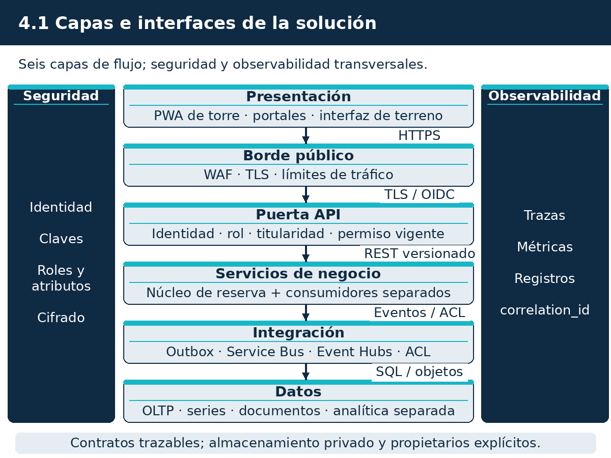
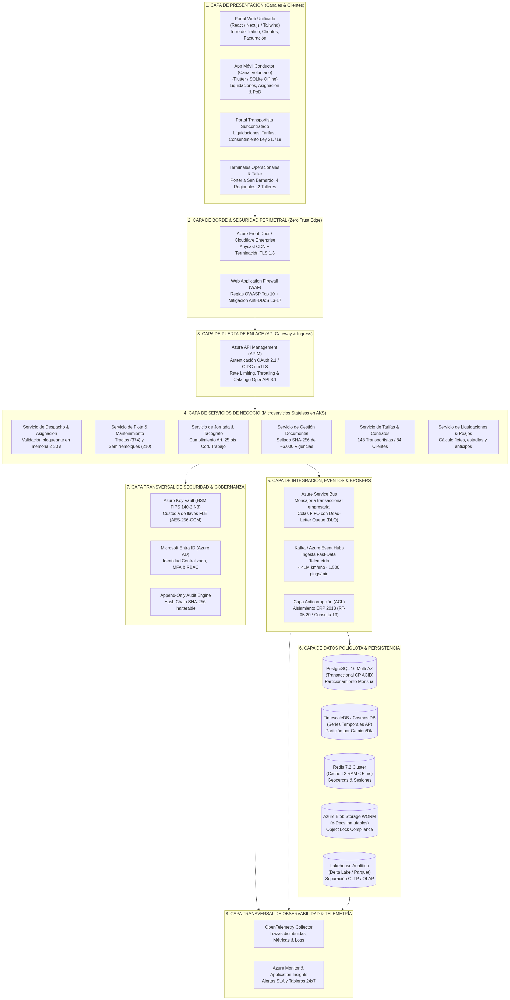
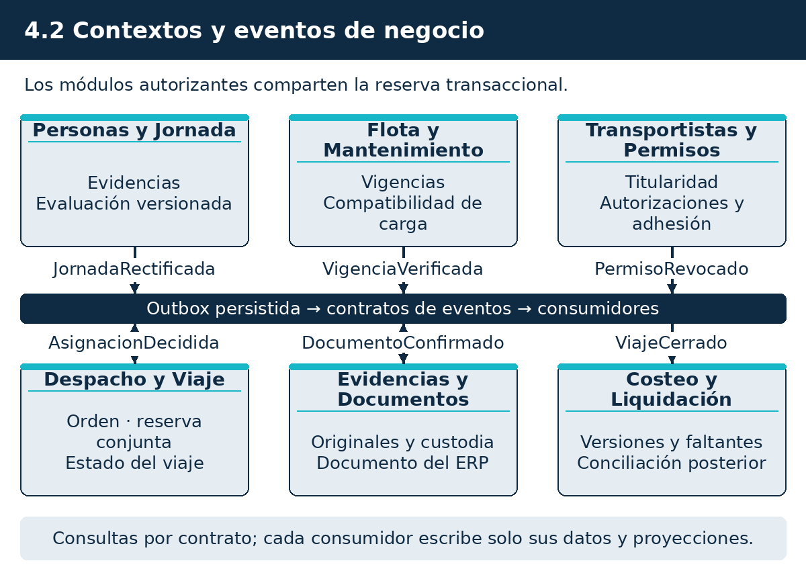
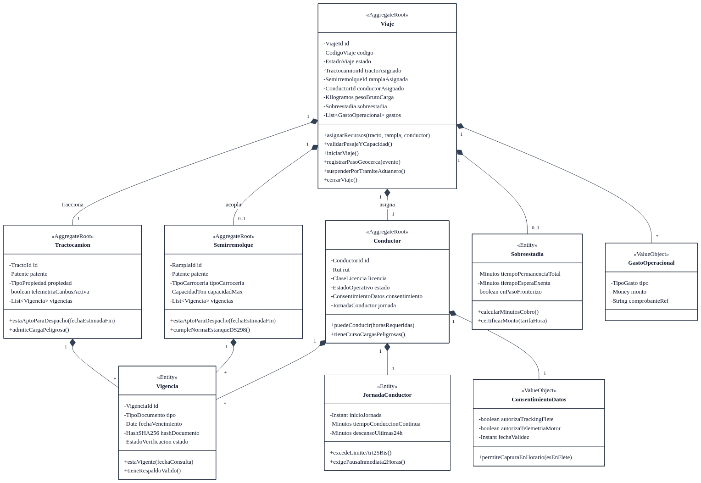
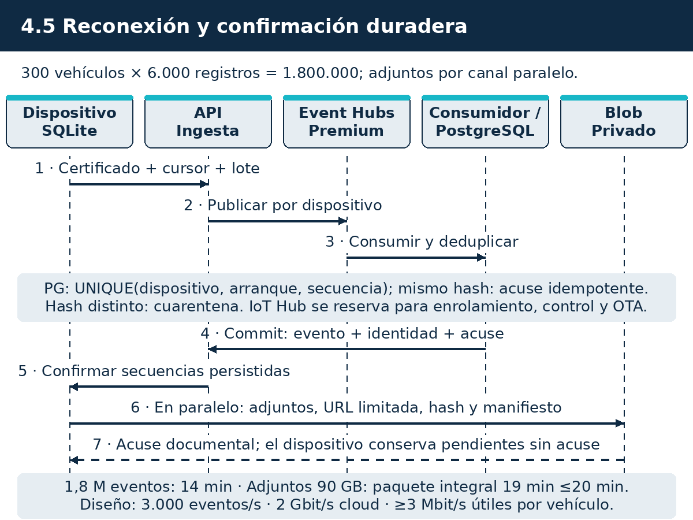
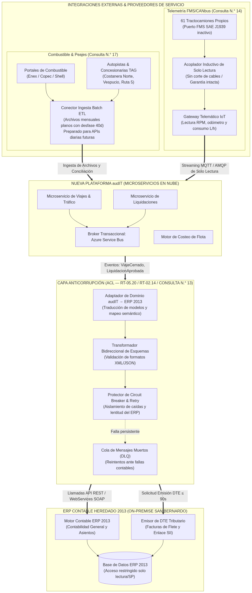
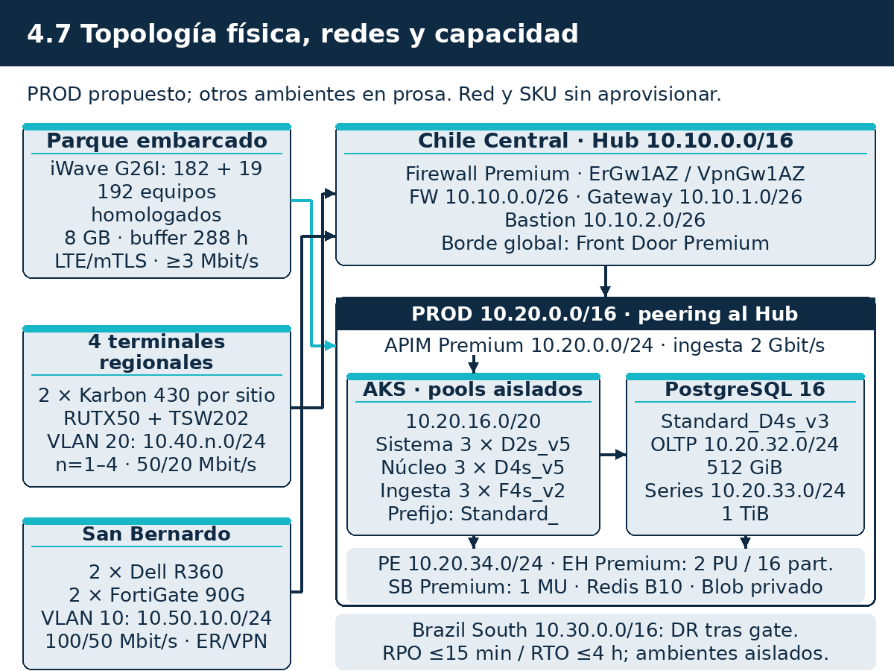
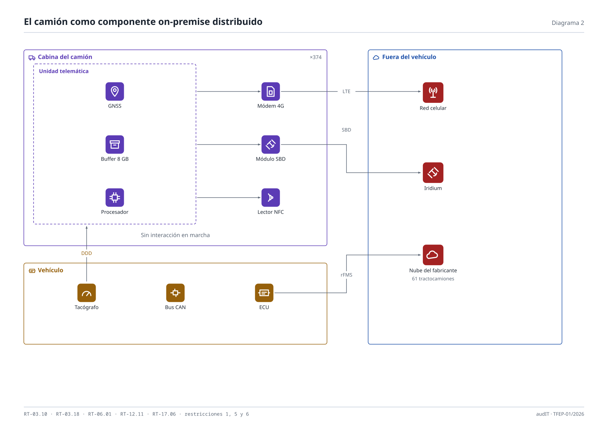
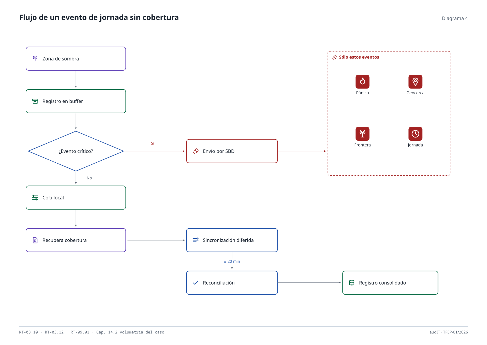

# 4. Introducción a la arquitectura lógica y física de la solución

Para la modernización tecnológica de Transportes Curimón S.A. (licitación TFEP-01/2026, Caso 10 Transporte de Carga), audIT Soluciones Tecnológicas SpA diseñó una arquitectura distribuida orientada a la alta disponibilidad operativa, la validación bloqueante del despacho, el registro probatorio de la jornada laboral y el costeo trazable de viajes.

El diseño establece como principio operativo fundamental que las coordenadas geográficas de un tractocamión no constituyen por sí solas constancia de trabajo de un conductor. En consecuencia, la arquitectura separa la ingesta de telemetría masiva de la cadena de evidencia laboral, exigiendo validación instrumental previa para autorizar cualquier salida vehicular.

> **Resumen ejecutivo**
>
> La solución se organiza en ocho capas lógicas y seis contextos delimitados bajo diseño guiado por el dominio (DDD). La arquitectura se integra con el **sistema de gestión de transporte de 2013** (TMS legado) mediante una Capa Anticorrupción (ACL) y el patrón Strangler Fig para su sustitución gradual (retiro en mes 21 y definitivo en mes 24 tras conciliar la migración histórica de RT-05.15), mientras preserva el **sistema contable y de facturación** como **único emisor fiscal** de los documentos tributarios de transporte (Restricción 8).
>
> El presupuesto transaccional de asignación de recursos garantiza dos niveles métricos claramente definidos: una **validación y reserva atómica interna en memoria en menos de 2 segundos** (tiempo nominal ~660 ms con aislamiento Serializable en PostgreSQL), y un **presupuesto transaccional máximo de extremo a extremo de 25 segundos** (garantizando 5 segundos de margen bajo el límite contractual absoluto de 30 segundos establecido en RT-09.01).
>
> En el borde vehicular, los computadores a bordo operan con 8 GB de almacenamiento local eMMC (configuración mínima cerrada del hardware iWave G26I), garantizando autonomía autónoma desconectada para más de 288 horas (12 días de cierre fronterizo en Los Libertadores, requiriendo ~38,4 MB con fotos y registros periódicos). El protocolo de reconexión masiva resuelve de extremo a extremo la salida simultánea de 300 camiones tras 72 horas de sombra (RT-03.13): una carga global agregada de 971,3 MB (778 KB de telemetría y 2,46 MB de fotos por camión), que con 25 % de sobrecarga de protocolo y 20 % de holgura temporal exige 10,12 Mbit/s agregados de enlace celular, transfiriéndose y procesándose en menos de 20 minutos mediante Azure IoT Hub (2 unidades S1) y Azure Event Hubs Premium hacia la base de series de tiempo dedicada (TimescaleDB).
>
> En la capa analítica, se genera una estimación preliminar del costo por viaje en menos de 24 horas (RT-05.29) con faltantes identificados (`AUSENTE = NULL`) y versiones posteriores consolidadas tras la conciliación de peajes y combustible. Para contingencias mayores, se implementa recuperación ante desastres (DR) en Azure Brazil South con objetivos RTO ≤ 4 horas y RPO ≤ 15 minutos (RT-07.02 y RT-07.04).
>
> **Componentes y compromisos principales:**
> - **Arquitectura lógica en ocho capas y seis contextos DDD:** Planificación y tráfico, Flota y activos, Personas y cumplimiento, Telemetría y geocercas, Operación de fletes, Liquidación y costeo (más Plataforma transversal para la ACL).
> - **Doble delimitación de sistemas legados de 2013:** distinción rigurosa entre el sistema de gestión de transporte de 2013 (sustitución progresiva) y el sistema contable y de facturación (sistema permanente y emisor exclusivo del DET).
> - **Emisión del DET sin cobertura garantizada (D2 / Restricción 8):** emisión anticipada antes de entrar a zona de sombra cuando la carga se conoce ex ante, o transmisión de la solicitud mínima por módem satelital Iridium Edge (SBD, paquetes de hasta 340 bytes) para emisión y timbraje en el sistema contable en la nube, con retorno del folio al camión antes del movimiento. Ningún equipo físico emite documentos tributarios.
> - **Presupuesto de asignación:** evaluación nominal interna en memoria < 2 s; presupuesto de extremo a extremo ≤ 25 s (holgura ante techo contractual de 30 s).
> - **Hardware vehicular y de terminal:** adquirido íntegramente por el **CLIENTE** (Caso, cap. 11, p. 24) bajo especificación formal del Formulario T-11: 182 computadores industriales **iWave G26I (SoC NXP i.MX 6ULL, 512 MB RAM, 8 GB eMMC)** más 19 repuestos (201 unidades), 182 módems satelitales **Iridium Edge (SBD)** más 19 repuestos, 182 lectores **Technoton CANCrocodile** más 19 repuestos, 182 lectores RFID **MIFARE DESFire** más 19 repuestos, y 192 camiones de terceros homologados por software.
> - **Servicios de nube y SKUs cerrados en Azure:** Front Door Premium, APIM Premium, AKS Premium LTS, PostgreSQL Flexible transaccional HA zonal, PostgreSQL Flexible de series dedicado con extensión TimescaleDB (descartando ADX), Azure Event Hubs Premium (descartando Dedicated), Azure Blob Storage ZRS inmutable WORM, Key Vault Premium HSM, Firewall Premium, ExpressRoute 100 Mbps (ErGw1AZ) + VPN redundante (VpnGw1AZ).
> - **Centro de contingencia en Sudamérica:** Azure Brazil South (São Paulo), con replicación asíncrona y preparación jurídica y técnica para la vigencia de la Ley 21.719 (a regir el 1 de diciembre de 2026).

Este documento se relaciona directamente con el Esquema de Solución (Subdocumento 3), el Modelo y Gestión de Datos (Subdocumento 5), el Pipeline DevSecOps (Subdocumento 6), el Plan de Trabajo (Subdocumento 7), la Matriz AMFE (Subdocumento 8) y el Formulario T-11 de Especificaciones Técnicas Ofertadas.

## 4.1 Arquitectura lógica

La arquitectura lógica organiza los procesos de negocio en seis contextos delimitados canónicos: **Planificación y tráfico**, **Flota y activos**, **Personas y cumplimiento**, **Telemetría y geocercas**, **Operación de fletes**, y **Liquidación y costeo**, coordinados transversalmente por una **Plataforma transversal** que alberga la Capa Anticorrupción (ACL) y los servicios comunes. Cada contexto gobierna sus fronteras transaccionales, modelos de dominio, tablas de persistencia e interfaces de comunicación. Las mutaciones de estado se procesan mediante comandos y se difunden asíncronamente al ecosistema mediante eventos de dominio bajo el patrón Outbox transaccional, garantizando consistencia eventual sin incurrir en bloqueos distribuidos.

### 4.1.1 Especificaciones de tecnologías de software

La selección tecnológica responde al dimensionamiento del Caso 10 (96.000 viajes anuales, 41.000.000 km recorridos, 374 camiones y un equipo interno de TI de nueve profesionales), priorizando servicios gestionados PaaS y componentes con ciclo de vida extendido (LTS). La Tabla 4.1 consolida las versiones, fechas de término de soporte (EOL) y la estrategia para el ciclo contractual de 56 meses.

**Tabla 4.1.** Especificación de tecnologías de software, versiones, soporte y estrategia a 56 meses

| Componente o capa | Tecnología y versión | Rol en la arquitectura | Fin de soporte (EOL) | Estrategia a 56 meses |
|---|---|---|---|---|
| Motor Relacional OLTP | PostgreSQL 16 (Azure Flexible Server) | Base transaccional ACID para despacho, maestros, habilitaciones y eventos outbox. Alta disponibilidad zonal. | Noviembre 2028 | Se planifica actualización mayor a versión LTS (PostgreSQL 18) en ventana de mantenimiento del mes 24, con pruebas previas en PREPROD. |
| Motor de Series Temporales | PostgreSQL 16 con extensión TimescaleDB (instancia dedicada) | Ingesta y particionamiento de telemetría masiva en hypertables, compresión de bloques históricos > 90 %. Alternativa cerrada: se descarta Azure Data Explorer (ADX) por sobrecosto y bloqueo propietario. | Noviembre 2028 | Instancia dedicada independiente de OLTP para que ráfagas de telemetría no afecten el despacho; archivo histórico a Parquet en Azure Data Lake Storage Gen2. |
| Caché Distribuido | Azure Managed Redis 7.2 (Tier Premium) | Validación de reglas de habilitación, geocercas activas e idempotencia de 7 a 12 días; latencia de lectura < 5 ms en P99. | Ciclo PaaS Microsoft | Clúster multizona con persistencia AOF y replicación de datos en memoria para soportar el despacho continuo. |
| Bus de Telemetría | Azure Event Hubs (Tier Premium) | Ingesta masiva de telemetría de 374 camiones; soporte nativo de protocolo Kafka v3.x, AMQP 1.0 y HTTPS. Alternativa cerrada: se descarta Dedicated por dimensionamiento desproporcionado. | Ciclo PaaS Microsoft | Particionamiento por `id_camion` (32 particiones); réplica geográfica asíncrona hacia Azure Brazil South con retraso máximo acotado. |
| Mensajería Empresarial | Azure Service Bus (Tier Premium) | Orquestación transaccional asíncrona, colas con deduplicación nativa, orden FIFO y Dead-Letter Queues (DLQ). | Ciclo PaaS Microsoft | Aislamiento físico de namespaces y enrutamiento seguro de comandos de negocio entre contextos. |
| Runtime Backend / Core | .NET 10 LTS / ASP.NET Core | Microservicios y APIs transaccionales del núcleo de despacho y liquidación. | Noviembre 2028 | Plataforma base sobre .NET 10 LTS, con actualización mayor programada a .NET 12 LTS en el mes 24. |
| Contenedores / Cómputo | AKS Premium con canal LTS (Kubernetes 1.30+) | Orquestación del backend, nodepools dedicados por criticidad (System, Core, Worker) distribuidos en tres zonas de disponibilidad (AZ1, AZ2, AZ3). | Canal LTS Microsoft | Actualizaciones de parches automáticas controladas; `maxSurge`, réplicas Mínimo 3, PDB y sondas de salud (liveness/readiness). |
| Gateway de APIs | Azure API Management (APIM Premium) | Puerta de enlace con terminación mTLS, limitación de tasa (rate limiting), autenticación JWT y catálogo unificado de APIs. | Ciclo PaaS Microsoft | Despliegue multizona integrado a VNet privada con inspección WAF en borde perimetral. |
| Frontend Web y Móvil | React 18 / TypeScript / Vite PWA | Portales para torre de control 24x7, transportistas y portería de terminal. Operación offline con Service Workers. | Comunidad activa | Dependencias reproducibles fijadas con lockfile y compilación inmutable verificada por digest SHA-256. |
| Base de Datos de Borde | SQLite 3 con modo WAL | Persistencia local en computadores a bordo (flash 8 GB) y terminales. Integridad ACID ante cortes de energía vehicular. | Soporte indefinido | Formato canónico estable con validación al inicio mediante `PRAGMA integrity_check` y checkpoints pasivos. |
| Sistema Operativo Borde | Ubuntu Core 22.04 LTS industrial | Sistema embebido con sistema de archivos inmutable de solo lectura y particiones duales A/B para rollback seguro. | Abril 2032 | Actualizaciones OTA firmadas digitalmente gestionadas por Mender y validadas en laboratorio HIL. |
| Identidad y Secretos | Microsoft Entra ID / Azure Key Vault Premium HSM | Autenticación federada, control RBAC/ABAC, gestión de claves HSM FIPS 140-3 Nivel 3 y rotación de certificados mTLS. | Ciclo PaaS Microsoft | Cifrado a nivel de campo (FLE) mediante envelope encryption y destrucción criptográfica bajo Ley 21.719. |

Fuente: elaboración propia.

#### Aplicación de los Principios SOLID

El diseño de los servicios backend aplica rigurosamente los principios SOLID:

- **Single Responsibility Principle (SRP):** cada microservicio gobierna exclusivamente un agregado de dominio y su propio almacén de persistencia. El contexto de Planificación y tráfico autoriza viajes pero no liquida fletes; el contexto de Personas y cumplimiento audita jornadas pero no procesa geocercas comerciales.
- **Open/Closed Principle (OCP):** la ingesta telemática mantiene su núcleo cerrado a modificaciones pero permite incorporar nuevos protocolos mediante adaptadores conectables (`IInboundTelemetryAdapter`) bajo contratos AsyncAPI.
- **Liskov Substitution Principle (LSP):** los orígenes de datos telemáticos (computador audIT, kits CANCrocodile y APIs de plataformas externas de terceros) implementan el contrato abstracto `IDispositivoTelemetria`. La torre de control procesa los eventos sin ramificar la lógica según la procedencia del dato.
- **Interface Segregation Principle (ISP):** se definen contratos específicos según el cliente: las pantallas de terreno en romana exponen el contrato `IOperacionTerreno` para confirmación de pesaje y salida, mientras que la torre de control utiliza `ITorreControlMonitoreo` con métricas de tráfico y alertas.
- **Dependency Inversion Principle (DIP):** los módulos del núcleo de negocio dependen de abstracciones de repositorio (`IViajeRepository`, `IEvidenciaJornadaRepository`), inyectadas por el contenedor de inversión de control de .NET. Las clases de dominio no referencian controladores de base de datos ni SDKs específicos de Azure.

#### Comparación y selección de estilo arquitectónico

Para equilibrar la volumetría del caso y la dotación técnica de Curimón, se evaluaron tres opciones de arquitectura:

1. **Monolito tradicional:** descartado porque acopla la carga continua de telemetría (hasta 3.000 eventos/s en ráfagas) con la base transaccional de despacho, provocando contención por bloqueos de tabla que afectaría la operación 24x7.
2. **Microservicios puros con base por servicio:** descartado para la ruta crítica de despacho. Exigiría transacciones distribuidas complejas (Saga orquestada de dos fases con 2PC) para coordinar la reserva concurrente de conductor, tractocamión y rampla, introduciendo sobrecargas de red que harían inviable la meta de validación atómica en menos de dos segundos.
3. **Núcleo modular transaccional con arquitectura dirigida por eventos (EDA) y servicios gestionados (opción adoptada):** el núcleo de despacho opera como un monolito modular desacoplado en AKS y ejecuta transacciones ACID con aislamiento Serializable en PostgreSQL para las tres invariantes críticas. La telemetría, el cálculo analítico de costos y las integraciones externas se desacoplan mediante Azure Event Hubs Premium y consumidores asíncronos. La validación y reserva en memoria interna opera en **menos de 2 segundos** (tiempo nominal ~660 ms), mientras que el flujo de extremo a extremo cuenta con un presupuesto de diseño de **25 segundos** (frente al tope contractual de 30 s de RT-09.01).

### 4.1.2 Capas, componentes e interfaces

La arquitectura lógica de la solución se descompone en **ocho capas lógicas de referencia**, estructuradas para segregar el procesamiento transaccional interactivo del procesamiento masivo de datos continuos.

La Figura 4.1 ilustra la descomposición de la arquitectura.



Fuente: elaboración propia.

*Relación entre el flujo directo y las ocho capas del modelo:* el flujo transaccional de peticiones interactivas (despacho, asignación y consultas operativas) recorre en sentido vertical seis capas funcionales directas: Presentación, Borde, Orquestación/Gateway, Lógica de Dominio, Integración/ACL y Persistencia Transaccional OLTP. Complementariamente, las dos capas restantes de datos masivos (Capa 7: Ingesta de Telemetría por Streaming y Capa 8: Analítica y Datos Lakehouse) operan de manera asíncrona y desacoplada mediante Azure Event Hubs Premium y CDC Debezium, garantizando que el tráfico masivo de telemetría y los cálculos pesados de costeo no compitan por CPU ni generen bloqueos sobre el motor transaccional de despacho.

Para una vista ampliada de la totalidad de las ocho capas y sus subsistemas desacoplados, la Figura 4.1(b) presenta el diagrama integral de la arquitectura lógica.



Fuente: elaboración propia.

La Tabla 4.2 detalla los componentes, entornos de ejecución y contratos formales de cada una de las ocho capas.

**Tabla 4.2.** Las ocho capas del modelo de referencia, componentes e interfaces

| Capa | Componentes | Entorno de ejecución | Función técnica | Interfaces y contratos |
|---|---|---|---|---|
| 1. Presentación | Portal Torre de Control 24x7, Portal Transportistas, App Conductor (PWA), Pantalla Terreno. | Navegador Web / Android PWA / Kiosko Industrial | Renderizado de interfaz, captura de firmas, visualización de alertas y operación local offline. | HTTPS / REST / WebSockets / JSON Schema. |
| 2. Borde y Seguridad | Azure Front Door, Azure API Management (APIM), Web Application Firewall (WAF). | Borde Global Microsoft / Azure VNet DMZ | Terminación TLS 1.3, autenticación mTLS de flota, inspección L7 OWASP, rate limiting y enrutamiento. | OpenAPI 3.0 / OAuth 2.0 / mTLS X.509 RFC 5280. |
| 3. Orquestación y API | API Gateway Interno, Enrutador de Comandos, Controladores REST/GraphQL. | AKS Pods (System Pool) | Validación sintáctica de peticiones, traducción de DTOs y validación de tokens JWT. | RESTful JSON / gRPC v1.60 / GraphQL. |
| 4. Lógica de Dominio | Motores de Reglas: Planificación y tráfico, Flota y activos, Personas y cumplimiento, Operación de fletes, Liquidación y costeo. | AKS Pods (Core Business Pool) | Ejecución de invariantes de negocio DDD, asignación atómica, control de despacho y cálculo de tarifas. | Contratos C# / MediatR / In-Memory Bus. |
| 5. Integración y ACL | Capa Anticorrupción (ACL), Adaptadores GPS Terceros, Conectores Aduana/SII, Outbox. | AKS Pods (Integration Pool) | Aislamiento del TMS de 2013, comunicación con sistema contable, adaptación de protocolos GPS y colas DLQ. | SOAP 1.2 (TMS 2013 / ERP) / REST JSON (SII) / AsyncAPI. |
| 6. Persistencia OLTP | Instancia Primaria PostgreSQL 16 Flexible Server, Réplica Local San Bernardo. | Azure Managed DB / Servidor San Bernardo | Persistencia ACID de maestros, viajes, habilitaciones vivas y outbox con replicación síncrona. | Protocolo PostgreSQL (puerto 5432) con SSL forzado. |
| 7. Ingesta Telemetría | Ingesta Azure Event Hubs Premium, Colector de Borde Embarcado, Procesador Geocercas. | Event Hubs Premium / Daemons en AKS | Ingesta masiva de pings, evaluación de geocercas y normalización de tramas CAN/FMS. | AMQP 1.0 / Apache Kafka Protocol v3.x / HTTPS REST / MQTT v5.0. |
| 8. Analítica y Datos | Azure Data Lake Storage Gen2, Procesador Delta Lake / Parquet, Azure Synapse / Databricks. | Azure Storage / Apache Spark Serverless | Almacenamiento Medallion (Bronze, Silver, Gold), cálculo de costo por km (RT-05.29) y reportería BI. | JDBC / ODBC / PySpark / Delta Lake. |

Fuente: elaboración propia.

#### Componentes de terreno específicos

Para responder a las condiciones operativas de terreno del Caso 10, se diseñan dos estaciones de trabajo diferenciadas:

- **Terminal de Torre de Control 24x7:** estaciones de trabajo de alto rendimiento en la sala de operaciones de San Bernardo y terminales regionales, con monitores duales industriales. Permiten supervisar la flota en tiempo real sobre mapas vectoriales acelerados por hardware WebGL, recibir alertas críticas mediante WebSockets en menos de 500 ms y ejecutar acciones de bloqueo o desvío operacional.
- **Pantalla de Terreno para Operación con Guantes (Kiosko de Despacho y Romana):** pantalla táctil resistiva IP65 de 15 pulgadas para exteriores en básculas y porterías. Cuenta con pantalla de alto contraste para visibilidad bajo luz solar y botones virtuales grandes (≥ 48×48 mm) con respuesta sonora, tolerantes a humedad y polvo. Esto permite a choferes y operadores ingresar pesajes y firmas sin quitarse los guantes de trabajo.

### 4.1.3 Contextos y trazabilidad funcional

La arquitectura táctica se organiza en **seis contextos delimitados canónicos**, cuyas interacciones y eventos de integración se presentan en la Figura 4.2.



Fuente: elaboración propia.

El modelo táctico interno de cada contexto, con sus agregados raíz, entidades y objetos de valor, se detalla en la Figura 4.3.



Fuente: elaboración propia.

Los seis contextos delimitados canónicos y sus responsabilidades son:

1. **Planificación y tráfico:** decide qué carga se mueve, hacia dónde y con qué recursos; recibe las órdenes (desde el sistema de 2013 hasta el mes 21 y directamente en la plataforma desde el mes 21); emite la asignación y orquesta la verificación bloqueante consultando a Personas y cumplimiento y a Flota y activos; si alguno rechaza, el viaje no sale.
2. **Flota y activos:** decide si un tractocamión y un semirremolque pueden salir hoy: verifica revisión técnica, seguro obligatorio (SOAP), permisos de circulación, certificados de estanques y compatibilidad para carga peligrosa bajo el D.S. 298; administra el inventario de 374 tractos y 210 semirremolques, el mantenimiento preventivo por odómetro real y registra la modalidad de adhesión de la flota subcontratada.
3. **Personas y cumplimiento:** decide si un conductor está habilitado para conducir hoy: licencia de conducir, cursos específicos, expediente de descansos del Art. 25 bis del Código del Trabajo, nivel de evidencia alcanzado en la cascada probatoria, y administración de consentimientos informados bajo la Ley 21.719.
4. **Telemetría y geocercas:** consolida la posición georreferenciada en tiempo real de los 374 camiones (182 equipos audIT y 192 de terceros integrados vía API), detecta ingresos y salidas en las 1.400 geocercas comerciales y administra el almacenamiento de series temporales en TimescaleDB.
5. **Operación de fletes:** reconstruye el viaje que realmente ocurrió: coordina con el sistema contable la obtención del Documento Electrónico de Transporte (DET), pesajes en romana, tiempos de permanencia en faena, conformidad de entrega digital y registro de novedades de ruta.
6. **Liquidación y costeo:** calcula cuánto costó cada viaje y cuánto se paga a cada transportista; genera la estimación preliminar de costo por viaje y por kilómetro en ≤ 24 horas (RT-05.29) con faltantes identificados (`AUSENTE = NULL`), emitiendo versiones consolidadas a medida que se reciben cartolas de peajes y facturas mensuales de combustible.
*(Plataforma transversal: provee la Capa Anticorrupción frente al sistema de 2013 y al sistema contable, el bus transaccional y la observabilidad unificada).*

#### Matriz de trazabilidad oficial de requisitos (Formulario T-12)

La Tabla 4.2(b) formaliza la asignación de los 42 requerimientos del catálogo oficial del Formulario T-12 de audIT hacia los contextos canónicos de la arquitectura, sus paquetes de la EDT (Subdocumento 7) y sus casos de prueba de verificación (Subdocumento 9 / Formulario T-17).

**Tabla 4.2(b).** Trazabilidad de requerimientos del Formulario T-12 hacia la arquitectura lógica

| Requisito | Tipo | Descripción sintética | Contexto responsable | Paquete EDT | Caso de prueba |
|---|---|---|---|---|---|
| RF-001 | Funcional | Validación bloqueante de jornada, habilitaciones y aptitud técnica (≤ 30 s). | Planificación y tráfico (consulta a Personas y Flota) | EDT 5.3 | CP-UNIT-01, CP-SYS-01 |
| RF-002 | Funcional | Evidencia de jornada efectiva de los 454 conductores con cascada probatoria. | Personas y cumplimiento | EDT 5.1 | CP-UNIT-02, CP-INT-02 |
| RF-003 | Funcional | Jornada previa externa disponible al asignar con consentimiento de adhesión. | Personas y cumplimiento | EDT 5.1, EDT 9.2 | CP-INT-03, CP-SYS-05 |
| RF-004 | Funcional | Conservación append-only de jornada con sello temporal e inmutabilidad. | Personas y cumplimiento | EDT 5.1 | CP-UNIT-03, CP-SEC-01 |
| RF-005 | Funcional | Registro único de vigencias con alertas automáticas y bloqueo preventivo. | Flota y activos / Personas y cumplimiento | EDT 5.1, EDT 5.2 | CP-UNIT-04, CP-REG-01 |
| RF-006 | Funcional | Verificación de carga peligrosa y compatibilidad técnica bajo D.S. 298. | Operación de fletes / Flota y activos | EDT 5.2, EDT 5.5 | CP-UNIT-05, CP-REG-02 |
| RF-007 | Funcional | Descarga, custodia y asociación de tacógrafos digitales (.ddd). | Telemetría y geocercas | EDT 4.3, EDT 5.4 | CP-INT-04, CP-HW-01 |
| RF-008 | Funcional | Vista única de posicionamiento georreferenciado de los 374 camiones. | Telemetría y geocercas | EDT 5.4 | CP-INT-05, CP-SYS-02 |
| RF-009 | Funcional | Búfer local a bordo de 72 h (ampliado a 288 h) y sincronización con ACK durable. | Telemetría y geocercas | EDT 4.2, EDT 5.4 | CP-HW-02, CP-PERF-01 |
| RF-010 | Funcional | Detección automática de llegada y salida en geocercas de 1.400 puntos. | Telemetría y geocercas | EDT 5.4 | CP-UNIT-06, CP-INT-06 |
| RF-011 | Funcional | Evidencia inmutable de tiempos de espera para cobro de sobreestadías. | Operación de fletes | EDT 5.5, EDT 5.6 | CP-UNIT-07, CP-SYS-03 |
| RF-012 | Funcional | Conformidad digital de entrega disponible el mismo día del servicio. | Operación de fletes | EDT 5.5 | CP-UNIT-08, CP-MOB-01 |
| RF-013 | Funcional | Generación de datos del DET desde la orden sin redigitación hacia el ERP. | Operación de fletes | EDT 5.5, EDT 6.1 | CP-INT-07, CP-SYS-04 |
| RF-014 | Funcional | DET emitido por ERP antes del movimiento, incluso sin cobertura; bloqueo si falta. | Operación de fletes / Planificación y tráfico | EDT 5.3, EDT 5.5, EDT 6.1 | CP-INT-08, CP-REG-03 |
| RF-015 | Funcional | Recomendación de cargas de retorno y reducción de kilómetros en vacío. | Planificación y tráfico | EDT 8.1 | CP-ALG-01, CP-SYS-06 |
| RF-016 | Funcional | Costo por viaje en ≤ 24 h (RT-05.29) con faltantes identificados y versiones. | Liquidación y costeo | EDT 2.5, EDT 5.6, EDT 8.3 | CP-ALG-02, CP-DAT-01 |
| RF-017 | Funcional | Desagregación contable de costos propios frente a terceros subcontratados. | Liquidación y costeo | EDT 5.6 | CP-UNIT-09, CP-DAT-02 |
| RF-018 | Funcional | Explicación algorítmica de dispersión de rendimiento de combustible. | Liquidación y costeo | EDT 8.4 | CP-ALG-03, CP-DAT-03 |
| RF-019 | Funcional | Liquidación mensual automatizada de transportistas por excepción. | Liquidación y costeo | EDT 5.6 | CP-UNIT-10, CP-SYS-07 |
| RF-020 | Funcional | Portal web de autoservicio para transportistas con liquidaciones y viajes. | Liquidación y costeo | EDT 5.6, EDT 5.7 | CP-SEC-02, CP-SYS-08 |
| RF-021 | Funcional | Trazabilidad y visualización de viajes autorizada para clientes finales. | Telemetría y geocercas / Personas y cumplimiento | EDT 5.1, EDT 5.4 | CP-SEC-03, CP-SYS-09 |
| RF-022 | Funcional | Consentimiento digital informado, granular y revocable (Ley 21.719). | Personas y cumplimiento | EDT 5.1, EDT 5.7 | CP-SEC-04, CP-REG-04 |
| RF-023 | Funcional | Cálculo de emisiones de CO2e bajo norma ISO 14083 y estándar GLEC. | Liquidación y costeo | EDT 8.2 | CP-ALG-04, CP-DAT-04 |
| RF-024 | Funcional | Registro de intervenciones de mantenimiento en talleres externos offline. | Flota y activos | EDT 8.5 | CP-MOB-02, CP-SYS-10 |
| RF-025 | Funcional | Plan de mantenimiento preventivo gobernado por kilometraje real. | Flota y activos | EDT 8.6 | CP-UNIT-11, CP-SYS-11 |
| RF-026 | Funcional | Gestión del proceso de adhesión y comodato de transportistas externos. | Personas y cumplimiento / Flota y activos | EDT 5.1, EDT 5.2, EDT 9.1 | CP-SYS-12, CP-REG-05 |
| RF-027 | Funcional | Alertas proactivas de jornada considerando estacionamientos seguros en ruta. | Personas y cumplimiento | EDT 4.2, EDT 5.1 | CP-ALG-05, CP-HW-04 |
| RF-028 | Funcional | Convivencia armónica de validación telemática instrumental y atestaciones. | Personas y cumplimiento / Flota y activos | EDT 5.1, EDT 5.2, EDT 5.3 | CP-SYS-13, CP-REG-06 |
| RNF-001 | No funcional | Cero interacción física del conductor durante la marcha (seguridad vial). | Telemetría y geocercas | EDT 4.1 | CP-HW-03, CP-SAF-01 |
| RNF-002 | No funcional | Operación offline íntegra e idempotente con almacenamiento local ACID. | Telemetría y geocercas | EDT 4.2, EDT 5.4 | CP-HW-02, CP-DAT-05 |
| RNF-003 | No funcional | Prohibición de intervenir camiones de terceros sin acuerdo contractual previo. | Personas y cumplimiento | EDT 5.1, EDT 9.1 | CP-REG-07, CP-AUD-01 |
| RNF-004 | No funcional | Instalación de equipos restringida al paso normal por terminales de Curimón. | Telemetría y geocercas | EDT 4.2 | CP-INS-01, CP-AUD-02 |
| RNF-005 | No funcional | Lectura CAN/FMS sin corte de cables y respetando garantías vehiculares. | Telemetría y geocercas | EDT 4.5 | CP-HW-05, CP-SAF-02 |
| RNF-006 | No funcional | Integración mediante ACL con el sistema contable como emisor único del DET. | Plataforma transversal (ACL) | EDT 6.1 | CP-INT-09, CP-RES-01 |
| RNF-007 | No funcional | Cero instalación de software o hardware privativo en recintos de clientes. | Operación de fletes | EDT 5.5 | CP-SYS-14, CP-AUD-03 |
| RNF-008 | No funcional | Autonomía desconectada ante cierre de paso fronterizo de hasta 12 días (288 h). | Telemetría y geocercas | EDT 4.2, EDT 4.4 | CP-HW-02, CP-PERF-03 |
| RNF-009 | No funcional | Operabilidad por el equipo TI interno de 9 profesionales de Curimón. | Plataforma transversal | EDT 3.2 | CP-OPS-01, CP-USAB-01 |
| RNF-010 | No funcional | Arquitectura alineada con el modelo TCO a 56 meses del pliego. | Plataforma transversal | EDT 1.2 | CP-FIN-01, CP-AUD-04 |
| RNF-011 | No funcional | Despliegue modular reversible sin detención de flota comercial. | Plataforma transversal | EDT 3.1, EDT 11.2 | CP-DEP-01, CP-RES-02 |
| RNF-012 | No funcional | Auditoría forense inalterable con permisos UPDATE/DELETE revocados. | Personas y cumplimiento / Operación de fletes | EDT 5.1, EDT 5.5 | CP-SEC-01, CP-AUD-05 |
| RNF-013 | No funcional | Cifrado en reposo, en tránsito y a nivel de campo (FLE) bajo Ley 21.719. | Plataforma transversal | EDT 3.3 | CP-SEC-05, CP-REG-08 |
| RNF-014 | No funcional | Retención documental cerrada: 5 años jornada, 6 años DET, 10 años siniestros. | Plataforma transversal | EDT 7.1 | CP-DAT-06, CP-REG-09 |

Fuente: elaboración propia sobre el Formulario T-12 oficial de audIT.

### 4.1.4 Secuencias críticas: asignación, documentos, reconexión y liquidación

#### 1. Secuencia de asignación bloqueante y presupuesto transaccional

La asignación de un viaje es la transacción operacional crítica más sensible del sistema. Su ejecución involucra la comprobación estricta de tres invariantes de negocio (Conductor apto bajo Art. 25 bis, Tractocamión autorizado y Semirremolque compatible bajo D.S. 298), gobernada por dos umbrales de tiempo claramente diferenciados:

1. **Camino nominal interno en memoria (< 2 segundos):** cuando la solicitud se procesa en condiciones operativas normales, la comprobación de invariantes contra datos cacheados en Redis y la persistencia de la reserva atómica con aislamiento Serializable en PostgreSQL Flexible Server resuelve en un tiempo nominal comprometido de **menos de 2 segundos** (tiempo nominal típico ~660 ms, distribuido en: 10 ms de validación de contrato y verificación de clave de idempotencia; 450 ms de evaluación paralela de las 3 invariantes; y 200 ms de persistencia atómica con bloqueo estricto `Conductor` → `Tractocamion` → `Semirremolque`).
2. **Presupuesto transaccional máximo de extremo a extremo (≤ 25 segundos):** para absorber la transacción completa a través de redes celulares de terreno, latencias de transporte, reintentos con backoff ante jitter y consultas extendidas de outbox, el diseño establece un techo máximo de **25 segundos**, proporcionando 5 segundos de margen de seguridad garantizado frente al límite contractual de 30 segundos fijado en RT-09.01 del Caso.

La Figura 4.4 ilustra el flujo de evaluación previo a autorizar el movimiento de un convoy.


Fuente: elaboración propia.

Desglose del presupuesto de extremo a extremo de 25 segundos (RT-09.01):
- **0 a 2 s:** recepción en API Gateway, terminación mTLS 1.3, autenticación de usuario y resolución de identidades técnicas.
- **2 a 10 s (8 s):** verificación de vigencias documentales (6.000 registros), revisiones técnicas y cálculo de descansos biológicos en memoria (Redis/PostgreSQL), con margen para consultas secundarias si se requiere refresco de caché.
- **10 a 18 s (8 s):** ejecución de la transacción ACID atómica en PostgreSQL con aislamiento Serializable y orden estricto de bloqueos para prevenir condiciones de carrera y deadlocks.
- **18 a 22 s (4 s):** inserción del evento de dominio en la tabla Outbox transaccional y persistencia duradera del estado `ViajeAsignado`.
- **22 a 25 s (3 s):** emisión del token criptográfico de despacho autorizado hacia la pantalla de romana y apertura controlada de la barrera de salida.

Si cualquiera de las tres invariantes es violada, la transacción aborta inmediatamente y el sistema responde en menos de un segundo con un Documento de Error Estructurado (JSON), detallando la causal exacta del rechazo e impidiendo que el operador reintente a ciegas:

```json
{
  "codigo_error": "ERR_JORNADA_EXCEDIDA_ART25BIS",
  "timestamp_rechazo": "2026-10-07T14:32:01.452Z",
  "causa": "Conductor supera 5 horas continuas de conduccion sin descanso minimo de 2 horas",
  "recurso": "CONDUCTOR",
  "valor_medido": "5.45 horas continuas",
  "umbral_normativo": "5.00 horas maximo",
  "norma_aplicada": "Codigo del Trabajo Art. 25 bis",
  "instancia_viaje": "VIAJE-2026-10-89412"
}
```

#### 2. Secuencia del documento de transporte y Restricción 8 (DET sin cobertura)

La Restricción 8 de las Bases Técnicas (Caso, cap. 10, p. 24) impone una regla absoluta: **el sistema contable y de facturación existente es el único emisor del documento tributario de transporte (DET)**. Ningún computador embarcado ni servidor de terminal de audIT emite documentos tributarios. Conforme a RF-014, el DET debe estar emitido y timbrado por el SII antes de que el camión inicie el movimiento en la vía pública; de lo contrario, el despacho se bloquea.

La Figura 4.5 representa la comprobación del documento antes de autorizar la salida.


Fuente: elaboración propia.

**Mecanismo definitivo de emisión en faenas y zonas de sombra sin cobertura celular (Decisión D2 / S3 3.4.2):**
Para faenas agrícolas, forestales o mineras remotas donde no existe señal celular, la solución implementa dos flujos complementarios cerrados:
1. **Emisión anticipada desde la orden (flujo preferente):** cuando los datos de peso y carga se conocen con anterioridad en la orden de transporte, el sistema contable emite y timbra el DET antes de que el vehículo ingrese a la zona sin señal. El documento digital viaja con su folio tributario precargado y firmado en el búfer local del computador a bordo iWave G26I, listo para exhibición y control en terreno.
2. **Emisión satelital interactiva (flujo en faena remota):** cuando los datos definitivos de carga solo se conocen al momento de cargar en el punto remoto sin señal, el computador embarcado audIT envía la trama de datos mínima requerida hacia la plataforma central utilizando su **módem satelital Iridium Edge (SBD, paquetes de datos cortos de hasta 340 bytes)**. La Capa Anticorrupción en la nube traslada la solicitud al sistema contable, este emite el DET ante el SII, y el folio tributario timbrado es devuelto al camión por el mismo enlace satelital Iridium. Al recibir el folio fiscal confirmado en cabina, el sistema autoriza el inicio del movimiento.

Este procedimiento cumple de forma estricta la Restricción 8 y la regla RN-06 de audIT sin requerir la preasignación de folios tributarios en equipos locales ni alterar la arquitectura contable de Curimón.

#### 3. Secuencia de reconexión masiva

La Figura 4.6 ilustra el almacenamiento local a bordo, la transmisión escalonada y la confirmación duradera antes de purgar datos locales.



Fuente: elaboración propia.

**Derivación matemática y dimensionamiento de extremo a extremo (RT-03.13):**
El requerimiento RT-03.13 exige vaciar las colas y sincronizar completamente los registros acumulados en un plazo máximo de **20 minutos** tras recuperar la cobertura celular.

1. **Hipótesis y perfil de generación por camión en 72 horas de sombra:**
   - Supuestos de operación continua: 30 horas de marcha activa y 42 horas de detención.
   - Pings de posición: 30 h en marcha a 1 muestra cada 30 s ($3.600$ pings) + 42 h detenido a 1 muestra cada 300 s ($504$ pings) = $4.104$ registros a 64 bytes cada uno = **262.656 bytes**.
   - Muestras de telemetría de motor: 30 h en marcha a 1 muestra cada 60 s = $1.800$ registros a 160 bytes cada uno = **288.000 bytes**.
   - Eventos de jornada, pesajes y documentos: 45 eventos de jornada a 600 bytes ($27.000$ bytes) + 5 documentos operacionales a 40.000 bytes ($200.000$ bytes) = **227.000 bytes**.
   - **Subtotal de datos y telemetría por camión:** $5.954$ registros equivalentes a **777.656 bytes** (~778 KB).
   - **Fotografías adjuntas de respaldo:** 8 fotografías comprimidas a 307,5 KB cada una = **2.460.000 bytes** (~2,46 MB).
   - **Volumen total generado por camión (datos + fotos):** $777.656 + 2.460.000 = \mathbf{3.237.656\text{ bytes}}$ (~3,24 MB).

2. **Carga agregada para el escenario de 300 camiones simultáneos:**
   - Total de registros de base: $300 \times 5.954 = \mathbf{1.786.200\text{ registros}}$ (~1,8 millones de eventos).
   - Volumen bruto agregado de datos y fotos: $300 \times 3.237.656\text{ bytes} = \mathbf{971.296.800\text{ bytes}}$ (**~971,3 MB**, descartando enfáticamente cifras infundadas de 90 GB).

3. **Cálculo de ancho de banda y ventana de transmisión:**
   - La ventana contractual es de 20 minutos ($1.200$ segundos). Para garantizar resiliencia técnica, se incorpora un **25 % de presupuesto para sobrecarga de protocolo/transporte** (TLS, TCP/IP, headers HTTP/AMQP) y se reserva un **20 % de holgura temporal** para reintentos con jitter, procesamiento y confirmaciones, fijando el tiempo útil de transferencia en $960$ segundos:
   $$\text{Ancho de banda agregado requerido} = \frac{971.296.800\text{ bytes} \times 1,25 \times 8\text{ bits/byte}}{960\text{ s}} = \mathbf{10,12\text{ Mbit/s}}$$
   - Dicho ancho de banda agregado de 10,12 Mbit/s se distribuye naturalmente entre las 300 conexiones celulares 4G LTE Cat-4 de la flota, demandando apenas **~34 kbit/s promedio por camión**, velocidad ínfima soportada con holgura por cualquier celda móvil.

4. **Flujo de ingesta y procesamiento en la nube:**
   - **Admisión en IoT Hub:** los 777,6 KB de datos de cada camión se agrupan en paquetes de 4 KB (238 paquetes con overhead por camión, totalizando 71.400 paquetes para los 300 camiones). Las dos unidades S1 de Azure IoT Hub admiten 100 operaciones por segundo, absorbiendo la totalidad de los paquetes en **11,9 minutos**.
   - **Transferencia de fotografías:** las fotos se suben directamente a Azure Blob Storage mediante URLs con SAS tokens efímeros en conexiones HTTPS paralelas, sin saturar las colas de mensajes.
   - **Consumo y persistencia:** desde IoT Hub, los mensajes pasan a Azure Event Hubs Premium (buffer Kafka multizona). Los daemons consumidores en AKS procesan a un ritmo sostenido de hasta **3.000 eventos por segundo**, vaciando el lote en aproximadamente **10 minutos** y persistiendo las tuplas en la base de series temporales TimescaleDB.
   - **Confirmación durable (ACK):** el computador embarcado mantiene los datos protegidos en su base SQLite local y **únicamente purga los registros tras recibir un ACK firmado con el hash criptográfico verificado por la nube**, culminando la sincronización total en menos de 20 minutos y acreditando el cumplimiento pleno de RT-03.13.

#### 4. Secuencia de costeo y conciliación

La Figura 4.7 muestra el flujo de cierre operacional, estimación del costo y conciliación contable.


Fuente: elaboración propia.

Al completarse un viaje:
1. El contexto de Planificación y tráfico publica el evento de dominio `ViajeCompletado` mediante el Outbox transaccional.
2. El motor analítico en el contexto de Liquidación y costeo genera la primera versión formal `CostoViajeVersion` (v1) en **menos de 24 horas** (cumpliendo RT-05.29) sobre la base de distancias de odómetro GPS, tiempos de espera medidos en geocercas, estimaciones telemáticas de combustible CANCrocodile y tarifas preliminares de peaje.
3. Todo componente cuyo valor real de facturación externa aún no esté disponible se clasifica explícitamente como `ESTIMADO` o `AUSENTE = NULL`; un valor faltante nunca se consigna como cero.
4. Conforme se reciben las cartolas de telepeaje TAG y las facturas mensuales de distribuidores de combustible (con desfase de 15 a 40 días), el sistema genera versiones incrementales auditadas (`CostoViajeVersion` v2... vn). Al cierre contable mensual, se emite la `LiquidacionConsolidada` definitiva para su aprobación y registro en el sistema contable y de facturación.

### 4.1.5 Integraciones, seguridad y resiliencia

La plataforma se enlaza con los sistemas internos de Curimón, dispositivos en ruta y entidades externas, según el mapa de la Figura 4.8.


Fuente: elaboración propia.

La Tabla 4.3 formaliza los contratos de las integraciones requeridas en el numeral RT-05.21, distinguiendo con precisión el sistema de transporte de 2013 del sistema contable.

**Tabla 4.3.** Integraciones formales conforme al numeral RT-05.21

| Integración | Contraparte o sistema | Modo y protocolo | Volumen estimado | Ventana operativa | Comportamiento ante fallas |
|---|---|---|---|---|---|
| INT-01 | Sistema Contable y de Facturación (Permanente) | Asíncrono / REST JSON firmado | 128.000 DET/año (≈ 350 diarios) | En línea 24x7 | Si el servicio contable se degrada, la solicitud se encola en Service Bus; el movimiento vehicular se detiene hasta confirmar timbraje (Restricción 8). |
| INT-01b | Sistema de Gestión de Transporte de 2013 (En retiro) | Asíncrono / SOAP 1.2 vía ACL | 96.000 viajes/año (hasta mes 21) | En línea 24x7 | La ACL desacopla el modelo nuevo; si el sistema de 2013 falla, las órdenes se retienen en cola sin afectar el despacho en curso. |
| INT-02 | GPS de plataformas de terceros homologados | Asíncrono / HTTPS Webhook | 192 camiones (≈ 192 pings/min) | Continuo 24x7 | Ingesta desacoplada; si cae la API del tercero, la verificación conmuta a la atestación jurada del transportista. |
| INT-03 | Telemetría CAN/FMS de fábrica (Technoton CANCrocodile) | Local / SAE J1939 Inductivo | 61 tractos propios; 10 Hz | Durante trayecto activo | Lectura no invasiva; ante interrupción de señal CAN, conmuta a odómetro GPS con marca de degradación. |
| INT-04 | Tacógrafos digitales (.ddd) | Lote local / Bluetooth / USB | Flota propia asignada | Al cierre de turno en terminal | Descarga de archivos .ddd; reintento automático y verificación de firma criptográfica del tacógrafo. |
| INT-05 | Concesionarias TAG / Peajes | Lote / SFTP seguro CSV/XML | ≈ 1,2 millones de pasadas/año | Semanal o mensual | Depósito en Blob Storage y cruce automático con geocercas de pórticos TAG para generar versiones conciliadas de costo. |
| INT-06 | Proveedores de combustible (Copec, Shell, etc.) | Lote seguro SFTP / Portal (CSV/Excel) mensual; complementado con estimación CANCrocodile | 74.000 abastecimientos actuales / 90.000 proyectados al año | Mensual (facturación); telemática continua en ruta | Estimación preliminar de 24 h opera con cálculo telemático; conciliación contable final se procesa al recibir la cartola. |
| INT-07 | Aduanas y puertos (Paso Los Libertadores) | B2B REST / XML firmado | ≈ 15.000 viajes internacionales/año | Previa a paso fronterizo | Almacenamiento local de manifiestos; reintentos con backoff exponencial ante contingencias climáticas. |

Fuente: elaboración propia.

#### Capa Anticorrupción (ACL) frente al sistema de 2013

Para proteger el nuevo modelo de datos frente a la estructura heredada del sistema de gestión de 2013, se implementa una Capa Anticorrupción, descrita en la Figura 4.9.



Fuente: elaboración propia.

La ACL asume cuatro funciones especializadas:
- **Adaptador de Dominio:** traduce eventos del nuevo sistema (`ViajeAsignado`, `LiquidacionConsolidada`) hacia el contrato legacy del sistema de 2013.
- **Transformador de Esquemas:** homologa tipos de datos heterogéneos, códigos de ruta y planes de cuentas.
- **Protector de Resiliencia:** implementa Circuit Breaker y Dead-Letter Queues (DLQ); ante indisponibilidad del sistema legado, retiene los mensajes en cola sin detener la operación de la nueva plataforma.
- **Reconciliador Transaccional:** compara periódicamente los estados de órdenes y viajes entre ambos modelos, reportando discrepancias en auditoría.

#### Parámetros numéricos de los patrones de resiliencia

Los parámetros de resiliencia están calibrados conforme a las exigencias operacionales:
- **Cortacircuito (Circuit Breaker) hacia sistemas legados:** se abre al superarse el 50 % de llamadas fallidas en una ventana de 10 peticiones, permanece abierto 30 segundos y admite 3 llamadas de prueba antes del restablecimiento completo.
- **Mamparo (Bulkhead) de despacho:** la verificación bloqueante cuenta con un pool exclusivo de 20 conexiones y threads en AKS, totalmente aislado de las ráfagas de telemetría y consultas de reportes.
- **Tiempos de espera (Timeouts):** validación en memoria interna: 800 ms; consulta transaccional de despacho: 5 s; llamada al sistema contable vía ACL: 10 s; emisión y timbraje del DET: techo de 90 s (RT-09.01).
- **Reintentos (Retry) en Event Hubs y APIs:** hasta 5 intentos con retroceso exponencial y jitter aleatorio (100 a 3.200 ms), evitando tormentas de reconexión sincronizadas.
- **Límite de tasa (Rate Limiting):** 100 solicitudes por segundo por IP en APIM, respondiendo HTTP 429 ante excesos volumétricos.

#### Modelo de seguridad Zero Trust

El esquema de seguridad aplica cuatro controles principales:
- **Perímetro privado y Private Endpoints:** ninguna base de datos ni componente de persistencia expone IP pública. La comunicación interservicio en Azure se confina a redes privadas VNet mediante Private Endpoints y NSGs restrictivos.
- **Identidad de flota por hardware:** cada computador a bordo iWave G26I se autentica mediante certificados X.509 mutual TLS (mTLS 1.3) emitidos por la CA corporativa y vinculados al criptomódulo de hardware seguro Microchip TA100.
- **Control de acceso de mínimo privilegio (RBAC/ABAC):** los permisos en portales y torre de control segregan datos por rol; los transportistas solo acceden a los viajes y liquidaciones de su propia flota mediante Microsoft Entra ID.
- **Cifrado de datos y protección Ley 21.719:** cifrado en reposo con AES-256 en PostgreSQL y Blob Storage, sumado a cifrado a nivel de campo (FLE) para RUTs, licencias y datos médicos, con claves gestionadas en Azure Key Vault Premium HSM.

### 4.1.6 Decisiones de arquitectura (ADR)

Las decisiones de arquitectura formales que gobiernan el diseño son:

1. **ADR-01: Núcleo modular transaccional en AKS.** Se adopta un monolito modular desacoplado en AKS con base transaccional ACID Serializable en PostgreSQL para la ruta crítica de despacho, complementado con arquitectura dirigida por eventos (EDA) asíncrona para telemetría y analítica. Evita la sobrecarga de latencia de transacciones distribuidas 2PC en la asignación bloqueante.
2. **ADR-02: Sustitución gradual del sistema de gestión de transporte de 2013.** Se adopta el patrón Strangler Fig con Capa Anticorrupción (ACL) para retirar el sistema de gestión de 2013 función por función: asignación, control y liquidación en mes 16; órdenes y tarifas en mes 21 (pasando el legado a solo consulta); y retiro definitivo en mes 24 tras la conciliación de 5 años de viajes y 6 de liquidaciones (RT-05.15). Se descarta el reemplazo en un solo evento (*Big Bang*) por riesgo de corte operacional inaceptable, y se descarta un paquete de mercado por costo recurrente excesivo por camión. Se distingue explícitamente del sistema contable, que se mantiene de forma permanente.
3. **ADR-03: Integración desacoplada y patrón Outbox.** Se implementa el patrón Outbox transaccional para la publicación de eventos de negocio, garantizando entrega *at-least-once* y aislamiento total del despacho frente a caídas de sistemas externos.
4. **ADR-04: Segregación analítica OLTP vs. Lakehouse mediante CDC.** Se adopta captura de cambios en el log (CDC Debezium) desde PostgreSQL hacia Azure Data Lake Storage Gen2 (Delta Lake), aislando la reportería pesada del motor transaccional. El costeo por viaje (RT-05.29) se modela con versión preliminar en ≤ 24 h y consolidación mensual posterior.
5. **ADR-05: Enlace satelital de contingencia para DET y emergencias.** Se selecciona el módem satelital Iridium Edge (SBD) conectado por RS232 al computador a bordo iWave G26I. Permite transmitir la solicitud mínima de despacho (hasta 340 bytes) para que el sistema contable en la nube emita el DET y retorne el folio antes del movimiento en zonas sin cobertura, además de transmitir eventos de botón de pánico. Se descarta Webfleet SAT por ser una solución propietaria cerrada acoplada a hardware ajeno con solo 40 h de almacenamiento.
6. **ADR-06: Persistencia de series temporales e ingesta masiva.** Se selecciona Azure Database for PostgreSQL Flexible Server en instancia dedicada con la extensión TimescaleDB para la persistencia de telemetría y particionamiento en hypertables, y Azure Event Hubs Premium para la ingesta de streaming (compatible con Kafka). Se descarta Azure Data Explorer (ADX) por alto costo de licenciamiento y cómputo propietario, y se descarta Event Hubs Dedicated por sobredimensionamiento frente a la escala de la flota.
7. **ADR-07: Resiliencia de borde y autonomía desconectada.** Se implementa persistencia local en SQLite 3 WAL sobre flash eMMC de 8 GB en el hardware iWave G26I, garantizando retención autónoma para más de 288 horas sin señal celular y purga local condicionada a ACK duradero de la nube.
8. **ADR-08: Seguridad de identidad mediante Zero Trust y mTLS.** Se adopta autenticación mTLS 1.3 con certificados X.509 anclados en el hardware seguro Microchip TA100 para la flota vehicular, y Microsoft Entra ID con RBAC/ABAC para usuarios y operadores.

## 4.2 Arquitectura física

La arquitectura física vincula cada elemento de software con su ubicación de despliegue en la nube, servidores de borde en San Bernardo, gabinetes de terminales regionales y computadores embarcados en la flota.

La topología física, direccionamiento de redes y capacidades de cómputo se presentan en la Figura 4.7.



Fuente: elaboración propia.

*Especificación técnica formal y recursos de despliegue de la Figura 4.7:* la topología de la Figura 4.7 constituye la especificación de ingeniería definitiva para el aprovisionamiento. Los bloques de red RFC 1918 se encuentran formalmente asignados sin solapamiento entre sitios, y los recursos de nube corresponden a los SKUs comerciales cerrados de Microsoft Azure detallados en la Tabla 4.4 y en el Formulario T-11.

La correspondencia entre las ocho capas lógicas y sus emplazamientos físicos se detalla en la Figura 4.8(b).


Fuente: elaboración propia.

El computador a bordo se estructura como un nodo de borde distribuido en cabina, cuya integración física y funcional con el camión se representa en la Figura 4.9(b).



Fuente: elaboración propia.

### 4.2.1 Especificaciones de implementos a proveer (hardware y software)

**Régimen de adquisición contractual:**
Conforme al pliego de licitación (Caso 10, capítulo 11, p. 24), **todo el hardware físico vehicular, de terminales regionales y de la sala técnica es adquirido directamente por el CLIENTE (Transportes Curimón S.A.)**. audIT Soluciones Tecnológicas SpA actúa como empresa consultora y técnica responsable de definir la especificación rigurosa de compras (Formulario T-11), supervisar la adquisición, realizar el control de calidad y homologación en recepción, suministrar los kits de integración y ejecutar el montaje y puesta en servicio.

Inventario de equipamiento según el Formulario T-11:
- **Flota total del proyecto:** 374 camiones (148 propios de Curimón y 226 de transportistas terceros).
- **Equipamiento nuevo a proveer:** 182 computadores a bordo industriales (148 para la flota propia y 34 para transportistas terceros que ingresen al plan de comodato sin telemetría previa).
- **Unidades de repuesto en pañol:** 19 computadores a bordo de repuesto (10 % de reserva técnica en frío, 182 × 0,10 ≈ 19), totalizando 201 computadores a bordo.
- **Flota homologada por software:** 192 camiones de terceros que ya cuentan con dispositivos GPS operativos de las tres plataformas del mercado se integran mediante APIs y conectores de software, sin intervenir vehículos ni incurrir en compra de hardware redundante (Restricción 3).
- **Módems satelitales:** 182 unidades Iridium Edge más 19 de reposición (201 unidades) conectados por RS232 al computador a bordo para contingencias fuera de cobertura y botón de pánico.
- **Lectores CAN sin contacto:** 182 acopladores inductivos Technoton CANCrocodile más 19 de reposición (201 unidades). Para los 61 camiones con autorización de fábrica se conecta al bus J1939; para el resto se habilita según la homologación técnica.
- **Lectores de identificación:** 182 lectores de tarjeta GAO RFID MIFARE DESFire de 13,56 MHz (RS485) más 19 de reposición (201 unidades).

La Tabla 4.4 sintetiza las especificaciones técnicas cerradas, cantidades y destinos de los componentes de hardware y software base.

**Tabla 4.4.** Resumen de implementos a proveer (Hardware y Software base del Formulario T-11)

| SKU | Componente | Cantidad | Especificaciones técnicas principales | Ubicación | Adquiere |
|---|---|---|---|---|---|
| HW-01 | Computador a bordo industrial iWave G26I | 201 unidades (182 activas, 19 repuestos) | SoC NXP i.MX 6ULL (ARM Cortex-A7), 512 MB RAM DDR3, 8 GB eMMC flash pSLC, 3 CAN con J1939, RS232, RS485, LTE Cat-4 / Cat-M1 dual SIM, GNSS multiconstelación, Wi-Fi, Bluetooth 5.0, Microchip TA100, IP67, $-40$ °C a $+70$ °C, 9 a 32 V DC, homologación SUBTEL y E-Mark. | 148 tractos propios, 34 terceros comodato, 19 pañol. | CLIENTE |
| HW-02 | Módem satelital de ráfaga corta Iridium Edge | 201 unidades (182 activas, 19 repuestos) | Transceptor Iridium SBD, mensajes hasta 340 bytes salida / 270 bytes entrada, interfaz RS232 al G26I, IP67, $-40$ a $+70$ °C, 9 a 32 V DC. | Cabina vehicular junto al equipo a bordo. | CLIENTE |
| HW-03 | Lector CAN sin contacto Technoton CANCrocodile | 201 unidades (182 activas, 19 repuestos) | Acoplamiento inductivo sobre aislamiento sin corte de cables, salida CAN 2.0B SAE J1939, 10 a 50 V DC. | Cabina sobre el arnés original. | CLIENTE |
| HW-04 | Lector de identificación del conductor GAO RFID | 201 unidades (182 activas, 19 repuestos) | Lector MIFARE DESFire EV2/EV3 13,56 MHz, conexión RS485 al G26I, gabinete IP66 con zumbador y LED bicolor. | Tablero de cabina al alcance del chofer detenido. | CLIENTE |
| HW-05 | Servidores de Continuidad de Borde (San Bernardo) | 2 unidades (Clúster HA Activo/Pasivo) | Dell PowerEdge R360, 1x Intel Xeon E-2468, 64 GB RAM DDR5 ECC, 4x 960 GB SSD NVMe RAID 10, doble fuente redundante 800W, doble NIC 10GbE. | Sala técnica de 26 m² San Bernardo. | CLIENTE |
| HW-06 | Gabinete Industrial de Terminal Regional | 4 unidades | Gabinete mural IP55 con cerradura, Micro-PC On-Logic Karbon 430 fanless, switch FortiSwitch 124F-POE de 8 puertos, router Teltonika RUTX50 (doble SIM 5G), UPS APC Smart-UPS 1,5 kVA. | Terminales Arica, Antofagasta, Coquimbo y Concepción. | CLIENTE |
| HW-07 | Kiosko de Despacho y Romana (Terreno) | 5 unidades | Terminal táctil IP65 de 15 pulgadas alto brillo (> 1.000 nits), tecnología resistiva apta para uso con guantes, lector RFID integrado. | Básculas y porterías de los cinco terminales. | CLIENTE |
| SW-01 | Software de borde audIT EdgeHub | 201 licencias | Firmware de borde industrial sobre iWave G26I: Linux Yocto/Ubuntu Core, SQLite 3 WAL, runtime C/Rust, agente Mender OTA. | Computadores embarcados. | audIT |
| SW-02 | Software de Servidores de Borde | 2 licencias | Ubuntu Server 22.04 LTS Pro, K3s Kubernetes para borde, PostgreSQL 16 local con réplica física síncrona. | Servidores de San Bernardo. | audIT |
| SW-03 | Suscripción de Nube Microsoft Azure (SKUs Cerrados) | 1 suscripción enterprise | Front Door Premium, APIM Premium, AKS Premium LTS, PostgreSQL Flexible transaccional (16 vCores, HA zonal), PostgreSQL Flexible series con TimescaleDB, Event Hubs Premium (Kafka), Blob Storage ZRS inmutable WORM, Key Vault Premium HSM, Azure Firewall Premium. | Azure Chile Central (Primario) y Azure Brazil South (DR). | CLIENTE |

Fuente: elaboración propia.

### 4.2.2 Capacidad, reconexión y crecimiento

#### Plan de direccionamiento de redes y segregación de ambientes (RFC 1918)

La infraestructura de red adopta una topología de tipo *Hub-and-Spoke* gobernada por Azure Firewall y grupos de seguridad (NSG), asignando bloques CIDR estandarizados sin superposición:

- **Red Central (Hub) Chile Central:** `10.10.0.0/22` (Firewall `10.10.0.0/26`, Puerta ExpressRoute ErGw1AZ `10.10.1.0/26`, Puerta VPN VpnGw1AZ `10.10.2.0/26`, Azure Bastion `10.10.3.0/26`).
- **Ambiente de Producción (PROD - Chile Central):** `10.11.0.0/20` (Borde/APIM `10.11.0.0/24`, Integración `10.11.1.0/24`, AKS Nodepools `10.11.4.0/22`, Datos OLTP/Series `10.11.8.0/24`, Private Endpoints `10.11.9.0/24`, Gestión `10.11.10.0/24`).
- **Ambiente de Preproducción (PREPROD):** `10.12.0.0/20` (Estructura espejo de producción para pruebas DAST, carga y mock runs de migración).
- **Ambiente de Calidad (QA):** `10.13.0.0/20` (Pruebas de integración y validación de contratos de software).
- **Ambiente de Desarrollo (DEV):** `10.14.0.0/20` (Entorno aislado con datos sintéticos).
- **Red Central (Hub) Brazil South:** `10.20.0.0/22` (Firewall de contingencia y puerta VPN).
- **Ambiente de Recuperación (DR - Brazil South):** `10.21.0.0/20` (Espejo pasivo de producción para conmutación ante desastre regional).
- **Red On-Premise San Bernardo:** `172.16.0.0/22` (VLAN 10 Servidores `172.16.1.0/24`, VLAN 20 Romana `172.16.2.0/24`, VLAN 30 CCTV/Acceso `172.16.3.0/24`).
- **Redes Terminales Regionales:** `172.16.4.0/22` (Una subred `/24` dedicada por terminal: Arica `172.16.4.0/24`, Antofagasta `172.16.5.0/24`, Coquimbo `172.16.6.0/24`, Concepción `172.16.7.0/24`).

#### Dimensionamiento del almacenamiento local de 8 GB

El computador a bordo iWave G26I dispone de una memoria flash eMMC de 8 GB nominales (aproximadamente 7,2 GB útiles en partición pSLC de alta resistencia).

El consumo de almacenamiento derivado en cabina se distribuye de la siguiente forma:
- Particiones del sistema operativo A/B (Ubuntu Core / Yocto): 2 × 1.024 MB = **2.048 MB**.
- Partición de arranque seguro (bootloader y Mender): **16 MB**.
- Tablas de geocercas activas (1.400 puntos) y datos maestros: **16 MB**.
- Búfer de registros de telemetría y eventos para 288 horas (12 días de cierre en Los Libertadores):
  * Tasa de eventos base: 120 eventos/h × 128 bytes = 15,36 KB/h. En 288 h = 4,42 MB.
  * Fotos de inspección y eventos de pesaje: 8 fotos cada 72 h × 4 bloques de 72 h = 32 fotos × 307,5 KB = 9,84 MB.
  * Factor de seguridad de 3x para ráfagas, metadatos y reintentos: $(4,42 + 9,84) \times 3 \approx \mathbf{42,8\text{ MB}}$.
- Archivo WAL de SQLite y registros de auditoría local: **256 MB**.
- **Espacio total requerido por el sistema y búfer:** $\approx \mathbf{2.380\text{ MB}}$ (~2,4 GB).

Con una demanda efectiva de 2,4 GB frente a los 7,2 GB útiles, el equipo dispone de un margen holgado de **3,0 veces**, garantizando absorción prolongada de desconexión sin riesgo de saturación de disco. La tasa de escrituras anual (~14 GB/año considerando actualizaciones periódicas de sistema operativo) se sitúa muy por debajo del límite de resistencia de la memoria flash eMMC pSLC (garantizada por más de 3.000 ciclos de borrado/escritura, equivalente a más de 10 años de vida útil).

### 4.2.3 Enlaces, continuidad y puntos de falla

El flujo de sincronización de eventos capturados en cabina sin cobertura se detalla en la Figura 4.10(b).



Fuente: elaboración propia.

La resiliencia de la solución se estructura sobre dos ejes independientes pero complementarios (Figura 4.11(b)):
1. **Recuperación ante Desastres (DR):** responde a catástrofes regionales en la nube mediante replicación asíncrona entre Azure Chile Central y Azure Brazil South (RTO ≤ 4 h, RPO ≤ 15 min bajo RT-07.02 y RT-07.04).
2. **Continuidad Operacional Local:** asegura la continuidad de operaciones en terminales y camiones ante caídas de enlace de telecomunicaciones mediante procesamiento autónomo en el borde (RT-03.13).


Fuente: elaboración propia.

#### Análisis de puntos de falla (SPOF) y mitigaciones

La Tabla 4.5 resume la cobertura técnica frente a puntos únicos de falla:

**Tabla 4.5.** Puntos únicos de falla y mitigaciones arquitectónicas

| Punto de falla potencial | Mitigación implementada | Tiempo de recuperación |
|---|---|---|
| Enlace WAN San Bernardo | Circuito ExpressRoute de 100 Mbps respaldado por túnel VPN IPsec con proveedor alternativo y canalización física independiente. | Conmutación BGP automática en < 1 minuto. |
| Enlace WAN Terminal Regional | Enlace fijo cableado de 10 Mbps respaldado por router industrial Teltonika RUTX50 con doble SIM 5G y conmutación automática de failover. | Conmutación por sondeo BFD en < 1 minuto. |
| Servidor de borde San Bernardo | Clúster HA de dos servidores Dell PowerEdge R360 con replicación síncrona y Keepalived. | Conmutación de nodo pasivo en < 15 segundos. |
| Corte eléctrico San Bernardo | Doble UPS modular APC SRT3000 (30 min de autonomía a plena carga) y grupo electrógeno diésel Himoinsa HYW-8 con estanque de 100 L (24 h). | Transferencia automática en < 10 segundos. |
| Falla de computador a bordo | Stock de 19 unidades de reposición en frío (10 %) en talleres de terminales; arneses de acople rápido. | Sustitución en terminal en < 30 minutos. |
| Pérdida de cobertura celular en ruta | Búfer local eMMC de 8 GB (retención > 288 h) y módem satelital Iridium Edge (SBD) para eventos críticos y DET. | Operación local sin interrupción; sincronización al reconectar. |
| Caída de zona en Azure Chile Central | Despliegue en 3 zonas de disponibilidad físicas (AZ1, AZ2, AZ3) para AKS, PostgreSQL Flexible y Blob Storage. | Conmutación zonal transparente en < 30 segundos. |
| Desastre regional en Chile Central | Conmutación hacia entorno DR en Azure Brazil South (São Paulo). | RTO ≤ 4 horas, RPO ≤ 15 minutos (RT-07.04). |

Fuente: elaboración propia.

#### Habilitación de la sala técnica de 26 m² en San Bernardo

La sala técnica de San Bernardo se adecúa para subsanar los incumplimientos del Capítulo 6 de las Bases Técnicas Transversales:
- **Energía redundante (RT-06.07 / RT-06.08):** instalación de dos UPS APC Smart-UPS SRT 3.000 VA en rama A y B con autonomía de 30 minutos a plena carga (1,94 kW de consumo proyectado), respaldadas por generador Himoinsa HYW-8 de 8,3 kVA con estanque de 100 litros para más de 24 horas continuas y tablero de transferencia automática (TTA).
- **Climatización de precisión (RT-06.13 / RT-06.14):** reemplazo del aire acondicionado split doméstico por dos equipos de climatización de precisión Liebert Mini-Mate2 de 3,55 kW en configuración N+1, con control en línea de temperatura y humedad relativa.
- **Protección contra incendios (RT-06.16 / RT-06.17):** sistema de detección temprana por aspiración de humo VESDA VLF-250 y extinción automática mediante agente limpio Kidde Fluoro-K (FK-5-1-12) que no degrada componentes electrónicos ni deja residuos.
- **Control de acceso y videovigilancia (RT-06.20 / RT-06.24):** esclusa de seguridad con lectores biométricos faciales Suprema FaceStation F2 y cuatro cámaras IP Axis con grabador NVR de 4 TB para conservación de 30 días continuos de video.

## 4.3 Centro de datos

### 4.3.1 Centro de datos primario

El entorno primario se aloja en **Microsoft Azure Chile Central** (Región Metropolitana de Santiago):
- **Zonas de disponibilidad:** uso de tres zonas físicas independientes conectadas por fibra óptica privada con latencia entre zonas inferior a 1 ms.
- **Soberanía y residencia del dato:** todos los datos transaccionales, maestros y respaldos tributarios residen en territorio nacional en cumplimiento de RT-03.01 y del Artículo 23° de las Bases Administrativas.
- **Disponibilidad comprometida:** 99,9 % de disponibilidad mensual para servicios Críticos (Despacho, Asignación, Telemetría) y 99,5 % para servicios Altos (FEP01, Art. 20° y Art. 78.2°).

### 4.3.2 Centro de datos secundario (DR)

El entorno de recuperación ante desastres se sitúa en **Microsoft Azure Brazil South** (São Paulo):
- **Aislamiento geográfico y sismotectónico:** separación geográfica superior a 2.500 km fuera de la placa tectónica de Nazca, cumpliendo la exigencia de no compartir riesgos sísmicos de RT-07.02.
- **Objetivos de recuperación:** RTO ≤ 4 horas y RPO ≤ 15 minutos (RT-07.04), verificados mediante dos simulacros de conmutación al año (RT-07.07).
- **Mecanismos de replicación:**
  1. Replicación asíncrona de PostgreSQL Flexible Server transaccional y de series temporales hacia réplicas de lectura en Brazil South con retraso habitual inferior a 2 minutos.
  2. Replicación geográfica de objetos en Azure Blob Storage con inmutabilidad y geo-redundancia de Event Hubs Premium.
  3. Despliegue de cómputo en AKS mediante plantillas de Terraform e imágenes validadas en el registro de contenedores, activadas dentro del plazo de RTO.
- **Cumplimiento de la Ley 21.719 (Datos Personales):** la ley entra en vigor general el **1 de diciembre de 2026**. La transferencia internacional de datos personales de conductores hacia Brazil South se ampara en el Artículo 27 letra b), formalizándose mediante Cláusulas Contractuales Tipo (SCC) y el Acuerdo de Procesamiento de Datos (DPA) con Microsoft, acreditando garantías adecuadas de protección bajo el Artículo 28. Se implementa cifrado en tránsito (TLS 1.3), cifrado en reposo con claves custodiadas en Azure Key Vault HSM y cifrado a nivel de campo (FLE) para datos identificatorios sensibles.

## Referencias

- Biblioteca del Congreso Nacional de Chile. (2002). *Código del Trabajo: Artículo 25 bis sobre jornada de trabajo de choferes de transporte de carga interurbana*.
- Biblioteca del Congreso Nacional de Chile. (2002). *Ley N.º 19.799: Sobre documentos electrónicos, firma electrónica y servicios de certificación de dicha firma*.
- Biblioteca del Congreso Nacional de Chile. (2024). *Ley N.º 21.719: Regula el tratamiento de los datos personales y crea la Agencia de Protección de Datos Personales*. https://www.bcn.cl/leychile/navegar?idNorma=1209272
- Ministerio de Transportes y Telecomunicaciones. (1995). *Decreto Supremo N.º 298: Reglamenta transporte de cargas peligrosas por calles y caminos*.
- International Organization for Standardization. (2011). *Systems and software engineering — Architecture description* (ISO/IEC/IEEE Std 42010:2011). IEEE.
- International Organization for Standardization. (2015). *Road vehicles — Controller area network (CAN)* (ISO 11898-1:2015). ISO.
- Internet Engineering Task Force. (1996). *Address Allocation for Private Internets* (RFC 1918). IETF.
- National Institute of Standards and Technology. (2020). *Zero Trust Architecture* (NIST Special Publication 800-207). U.S. Department of Commerce.
- Microsoft Learn. (2026). *Azure IoT Hub Quotas and Throttling*. Microsoft Corporation.
- Microsoft Learn. (2026). *Geo-disaster recovery for Azure Event Hubs*. Microsoft Corporation.

## Declaración de uso de IA

En conformidad con el Comunicado 09 y el Comunicado 10 (§7.2), se declara el uso asistido de herramientas de inteligencia artificial generativa durante la estructuración y redacción técnica de este subdocumento. La validación rigurosa de las especificaciones de las Bases, el dimensionamiento de flujos, los contratos de interfaces, los SKUs de hardware y las figuras arquitectónicas fue efectuada por la Dupla 3 (DevSecOps & Software/Datos) en estrecha coordinación con la Dupla 4 (Infraestructura & Hardware) y la Dupla 2 (PMO & Requerimientos).
