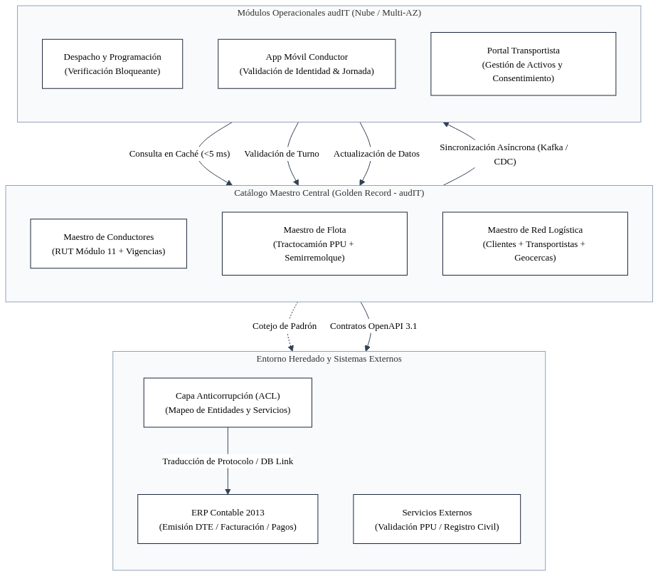
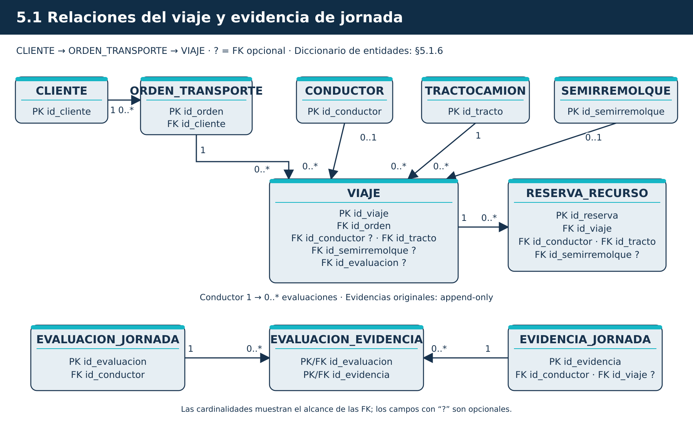
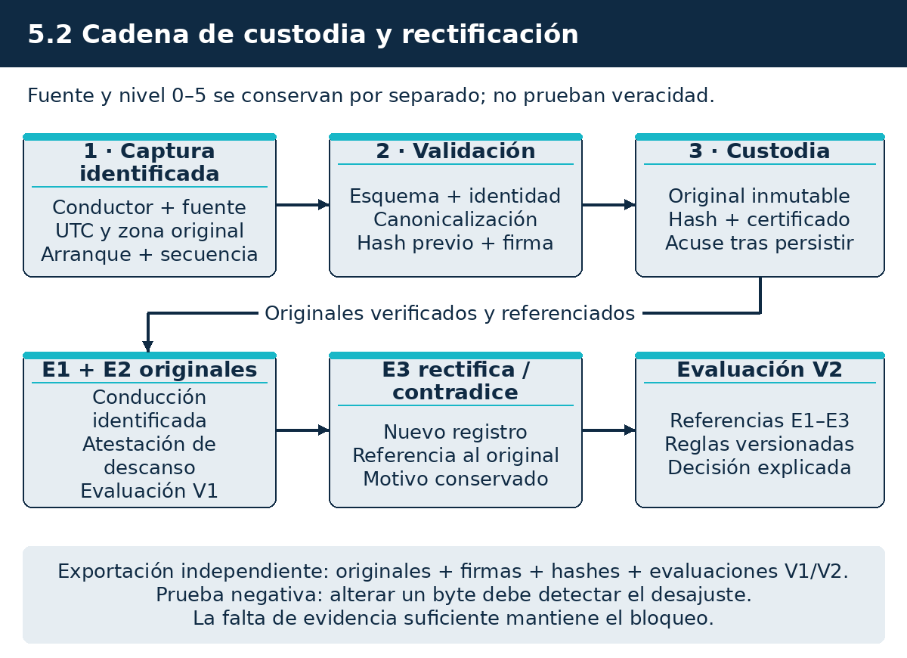
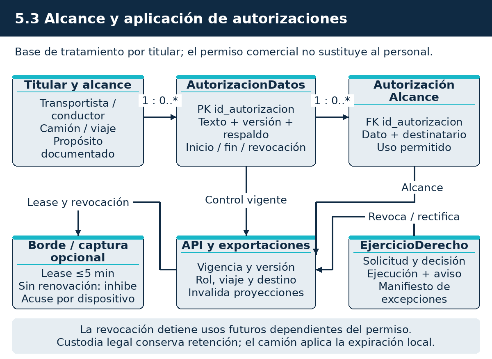
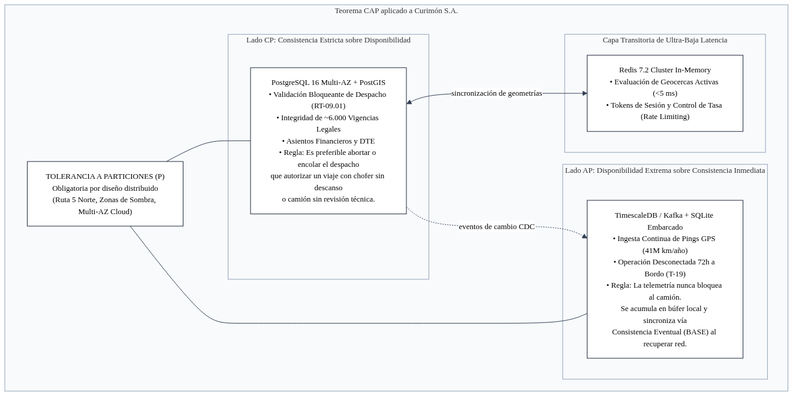
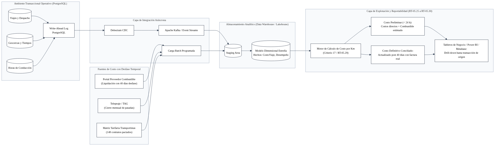
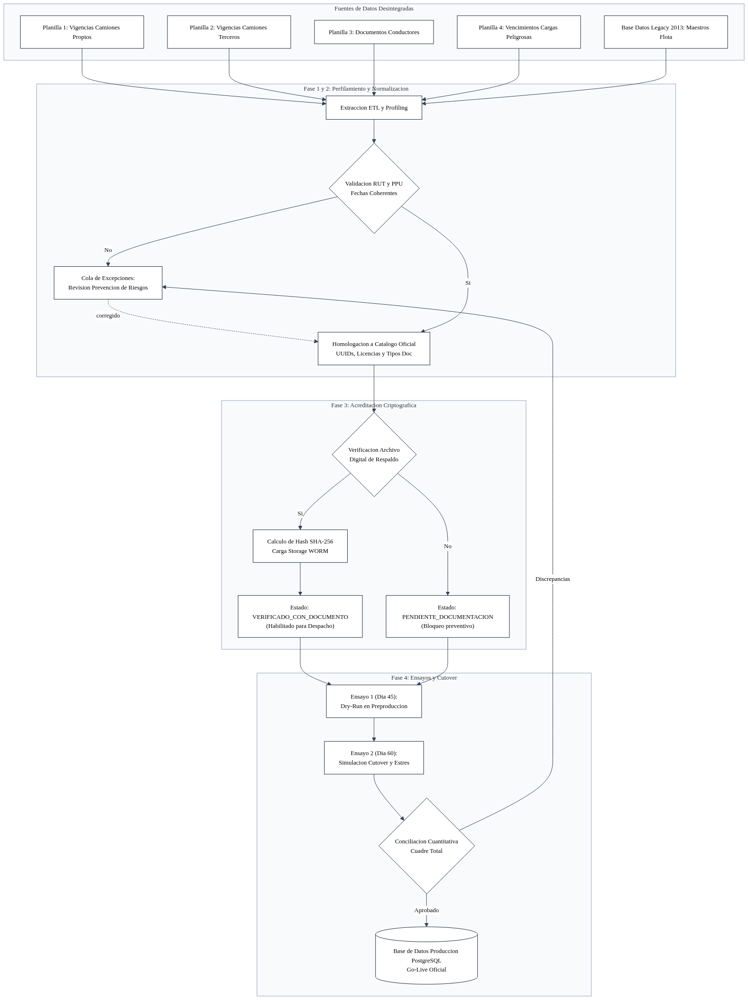
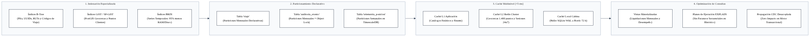

# 5. Introducción al modelo y gestión de datos

Para el proyecto de modernización de Transportes Curimón S.A. (licitación TFEP-01/2026, Caso 10 Transporte de Carga), audIT Soluciones Tecnológicas SpA propone una arquitectura de datos gobernada bajo diseño guiado por el dominio (DDD), persistencia políglota y gestión de datos maestros (MDM) con registro maestro único (*Golden Record*).

La solución desacopla de raíz la ingesta continua de telemetría correspondiente a 41.000.000 km anuales (numeral 14.1 del Caso) del motor relacional de despacho. La validación atómica interna de despacho en memoria se ejecuta en menos de dos segundos (camino nominal ~660 ms), mientras que el presupuesto transaccional de extremo a extremo cuenta con un techo de diseño de 25 segundos (RT-09.01). La integridad histórica de las aproximadamente 6.000 vigencias documentales se certifica mediante hash SHA-256 encadenado y custodia WORM inmutable, con un marco técnico y normativo estricto bajo la Ley 21.719 (que entra en vigor el 1 de diciembre de 2026).

> **Resumen ejecutivo**
>
> El modelo de datos articula la relación operativa entre viajes, conductores, tractocamiones, semirremolques, vigencias documentales y registros de jornada laboral. Los datos de jornada capturan su procedencia instrumental en una cascada de seis niveles probatorios, grado de evidencia y sello criptográfico para respaldar decisiones de despacho ante fiscalizaciones de la Dirección del Trabajo o tribunales de justicia.
>
> La arquitectura separa la persistencia transaccional (OLTP) de la explotación analítica (Lakehouse), permitiendo calcular una estimación preliminar del costo de cada viaje en ≤ 24 horas (RT-05.29) con faltantes identificados (`AUSENTE = NULL`), complementada con versiones posteriores consolidadas tras la conciliación de peajes y combustible.
>
> La contingencia y recuperación ante desastres (DR) se ubica en Azure Brazil South (São Paulo), manteniendo bases de datos cifradas en tránsito (TLS 1.3), en reposo (AES-256) y a nivel de campo (FLE) para datos personales sensibles bajo custodia en Azure Key Vault HSM, amparada en las garantías del Artículo 28 y la vía de transferencia internacional del Artículo 27 letra b) de la Ley 21.719.
>
> **Entregables y compromisos principales:**
> - **Modelo táctico DDD en seis dominios canónicos:** Planificación y tráfico, Flota y activos, Personas y cumplimiento, Telemetría y geocercas, Operación de fletes, Liquidación y costeo (más Plataforma transversal).
> - **Separación de sistemas legados de 2013:** distinción entre el sistema de gestión de transporte de 2013 (migración y sustitución) y el sistema contable y de facturación (conservado como único emisor fiscal del DET según Restricción 8).
> - **Entidad formal `EVIDENCIA_JORNADA`:** cascada probatoria de seis niveles instrumentales, hash encadenado SHA-256 de solo adición (*append-only*), permisos `UPDATE`/`DELETE` revocados en el motor SQL y custodia inmutable WORM en Azure Blob Storage.
> - **Matriz de retención legal y RTO cerrada por tipo de dato:** plazos legales vinculantes (5 años jornada, 6 años DET, 10 años siniestros) y protocolo riguroso ante eventos de la Ley 21.719 (revocación de consentimiento, cese de captura y solicitudes de supresión frente a deberes legales de conservación).
> - **Gobierno de datos maestros (MDM) e ISO/IEC 25012:** linaje de cambios, claves canónicas normalizadas (RUT Módulo 11 cifrado con índice ciego y PPU oficial) y conciliación documental individualizada.
> - **Persistencia políglota bajo Teorema CAP:** PostgreSQL 16 Flexible Server (CP) para el núcleo transaccional, instancia dedicada con extensión TimescaleDB (AP) para series temporales y telemetría (descartando ADX), Azure Event Hubs Premium para streaming de eventos y SQLite 3 WAL para computadores embarcados en cabina y gabinetes de terminales.
> - **Segregación OLTP versus Lakehouse mediante CDC:** ingesta asíncrona mediante Debezium hacia Azure Data Lake Storage Gen2 (Delta Lake con arquitectura Medallion) para blindar el motor transaccional ante consultas analíticas pesadas.
> - **Plan de migración histórica en cuatro fases:** saneamiento de 480.000 viajes (5 años), 10.656 liquidaciones (6 años) y cerca de 6.000 vigencias, con dos ensayos previos (*Mock Runs*) y ventanas de corte de 4 horas por terminal.
> - **Soberanía y portabilidad de datos (RT-05.06):** exportación completa en formatos abiertos (Parquet, JSON, SQL, PDF/A) en autoservicio desde la consola de Curimón, sin costos adicionales ni intervención técnica obligatoria de audIT.

Este documento se relaciona directamente con la Arquitectura Lógica y Física (Subdocumento 4), el Esquema de Solución (Subdocumento 3), las Metodologías y DevSecOps (Subdocumento 6), el Plan de Trabajo (Subdocumento 7) y la Matriz AMFE (Subdocumento 8).

## 5.1 Modelo de datos

El modelo de datos define los dominios de información, límites transaccionales y entidades operacionales de Curimón, sustituyendo la base monolítica del sistema de transporte de 2013 por un modelo guiado por el dominio (DDD).

### 5.1.1 Dominios de información y modelo conceptual

La información del negocio se organiza en seis dominios funcionales canónicos y un dominio transversal:

1. **Planificación y tráfico:** gobierna las entidades `OrdenTransporte`, `Viaje` y `ReservaRecurso`. Controla los estados del ciclo de vida del viaje (`Programado`, `Asignado`, `EnTransito`, `EnDestino`, `Completado`, `Cancelado`). La transición al estado `Asignado` exige la concurrencia atómica de conductor habilitado, tractocamión apto y semirremolque compatible.
2. **Flota y activos:** administra `Tractocamion`, `Semirremolque`, `VigenciaHabilitacion`, `IntervencionMantenimiento` y `Adhesion`. Gobierna las especificaciones técnicas vehiculares, compatibilidad de quinta rueda, certificaciones de estanques para cargas peligrosas bajo D.S. 298 y planes de mantenimiento preventivo por kilometraje real.
3. **Personas y cumplimiento:** administra `Conductor`, `EvidenciaJornada`, `EvaluacionJornada` y `ConsentimientoDatos`. Mantiene el historial laboral y calcula los descansos biológicos y límites de conducción continua conforme al Art. 25 bis del Código del Trabajo, administrando consentimientos bajo la Ley 21.719.
4. **Telemetría y geocercas:** administra `Geocerca`, `EventoTelemetria`, `AlertaRuta` y `SesionConexion`. Procesa el posicionamiento continuo de los 374 camiones, eventos de paradas no autorizadas y cruces de polígonos geoespaciales.
5. **Operación de fletes:** administra `DocumentoRespaldo`, `DocumentoTransporte` (DET), `ConformidadEntrega`, `Permanencia` (tiempos de espera en romana/faena) y `Siniestro`. Mantiene el registro probatorio de guías, pesajes y atestaciones de carga.
6. **Liquidación y costeo:** administra `ComponenteCosto`, `CostoViajeVersion` y `LiquidacionTransportista`. Genera la versión preliminar de costo por viaje y por kilómetro en ≤ 24 horas (RT-05.29) con faltantes identificados (`AUSENTE = NULL`), emitiendo versiones consolidadas posteriores tras el cierre mensual de peajes y combustible.
*(Plataforma transversal: provee la entidad `AuditoriaEvento`, trazabilidad de Capa Anticorrupción y gobernanza de claves criptográficas).*

### 5.1.2 Gestión de datos maestros (MDM) y registro maestro único

Para eliminar duplicidades, registros huérfanos y discrepancias entre terminales, se implementa una arquitectura de datos maestros con registro único (*Golden Record*), ilustrada en la Figura 5.2.



Fuente: elaboración propia.

- **Claves canónicas e identificadores oficiales:** los registros maestros se anclan en identificadores oficiales del ordenamiento chileno. El Rol Único Tributario (RUT), validado con algoritmo Módulo 11, identifica unívocamente a personas y empresas. Las relaciones operacionales internas emplean identificadores técnicos inmutables UUIDv4; el RUT se almacena cifrado (FLE) y se consulta mediante un índice ciego criptográfico (*blind index* con HMAC-SHA256 y sal secreta), mientras que la Placa Patente Única (PPU) se normaliza como clave natural única de tractocamiones y semirremolques.
- **Enriquecimiento y validación previa:** todo registro nuevo o modificado se contrasta en línea con fuentes oficiales (RUT ante SII y antecedentes registrales ante el Registro Civil) antes de consolidar el registro maestro en producción.
- **Linaje y trazabilidad inmutable:** cada alteración a datos maestros genera un evento en la tabla `auditoria_evento` con el identificador del usuario actuante, marca de tiempo UTC y valores anterior y nuevo en formato JSONB.

### 5.1.3 Diagrama entidad-relación (ERD) de dominios críticos

La Figura 5.1 presenta el diagrama entidad-relación de los dominios críticos de despacho, recursos vehiculares, jornada laboral y cadena de custodia.



Fuente: elaboración propia.

Reglas estructurales y de cardinalidad:
- **Separación física de tractocamión y semirremolque:** las entidades `TRACTOCAMION` (374 unidades) y `SEMIRREMOLQUE` (210 unidades) operan en tablas independientes sin claves foráneas polimórficas. La entidad `VIAJE` relaciona independientemente ambos activos (`id_tracto` e `id_semirremolque`), permitiendo viajes sin semirremolque (movimientos de cabezal solo) o asignaciones dinámicas en faena. La compatibilidad técnica (quinta rueda, capacidad de carga y certificaciones D.S. 298) se valida en el motor de reglas antes de persistir la asignación.
- **Cardinalidad 1:N Conductor a Evidencia de Jornada:** cada conductor mantiene una serie histórica secuencial de eventos en `EVIDENCIA_JORNADA`. Cada registro pertenece a un único conductor y describe su estado en un instante temporal preciso.
- **Integridad referencial estricta en habilitaciones:** la tabla `VIGENCIA_HABILITACION` modela claves foráneas explícitas hacia `id_conductor`, `id_tracto` e `id_semirremolque`, gobernadas por una restricción `CHECK` que garantiza exclusividad del sujeto:

```sql
CONSTRAINT chk_recurso_exclusivo CHECK (
    (id_conductor IS NOT NULL AND id_tracto IS NULL AND id_semirremolque IS NULL) OR
    (id_conductor IS NULL AND id_tracto IS NOT NULL AND id_semirremolque IS NULL) OR
    (id_conductor IS NULL AND id_tracto IS NULL AND id_semirremolque IS NOT NULL)
)
```

### 5.1.4 Modelo de evidencia de jornada y cadena de custodia

Para atender la observación sobre validez probatoria de jornada (Capítulo 19 del Caso), se define la entidad `EVIDENCIA_JORNADA` y su mecanismo de preservación para revisiones de la Dirección del Trabajo o tribunales laborales.

#### Cascada probatoria de seis niveles de evidencia

La procedencia de cada registro de jornada se clasifica según la siguiente escala de seis niveles:

1. **Nivel 1 — `INST_TACO`:** tacógrafo digital homologado; lectura instrumental directa de archivos .ddd y validación de firma digital del fabricante. Veredicto: asignación automática.
2. **Nivel 2 — `INST_EDGE`:** identificación física en cabina mediante tarjeta MIFARE DESFire sobre el lector conectado al computador a bordo iWave G26I. Veredicto: asignación automática.
3. **Nivel 3 — `INST_CAN`:** telemetría telemática del bus CAN/FMS autorizada mediante lector sin contacto Technoton CANCrocodile (SAE J1939). Veredicto: asignación automática.
4. **Nivel 4 — `EXT_GPS`:** plataforma de posicionamiento GPS de terceros homologada contrastada con sesión activa de conductor; veredicto: asignación con trazabilidad técnica.
5. **Nivel 5 — `PORT_TER`:** marcación de acceso biométrico en romana o portería de terminal; acredita reposo en patio o permanencia.
6. **Nivel 6 — `DECL_JUR`:** atestación electrónica firmada del transportista subcontratado (Ley 19.799); evidencia supletoria con asignación marcada y responsabilidad contractual registrada.
*(Nivel 0 — Registro voluntario del conductor: beneficio operativo complementario; nunca constituye requisito habilitante ni veredicto de asignación).*

Fuente: elaboración propia sobre el Caso, numeral 4.3 y restricciones del Capítulo 10.

*Nota de rigor probatorio y legal:* La jerarquía anterior define la prioridad y fidelidad técnica instrumental de los datos para la autorización automática de despachos y auditorías de ingeniería. La apreciación o mérito probatorio judicial definitivo de estos antecedentes ante los Tribunales de Justicia o la Dirección del Trabajo queda reservada a las reglas de la sana crítica y a la valoración privativa de los magistrados conforme a la legislación procesal y laboral chilena.

#### Especificación técnica de `EVIDENCIA_JORNADA`

Los atributos, claves foráneas, restricciones y validaciones de `EVIDENCIA_JORNADA` están definidos en el DDL canónico de §5.1.6. El diseño contempla identificador UUID, marcas de tiempo UTC de captura en cabina y de inserción en servidor, nivel en cascada probatoria, odómetro, velocidad, identificador de equipo, firma digital, hash encadenado SHA-256 y vínculo a rectificaciones.

#### Cadena de custodia forense append-only

La Figura 5.3 ilustra el mecanismo de encadenamiento criptográfico e inmutabilidad de la evidencia de jornada.



Fuente: elaboración propia.

- **Encadenamiento criptográfico (*Hash Chain*):** cada registro genera su hash criptográfico SHA-256 incorporando los datos del evento actual junto con el hash del evento inmediatamente precedente del mismo conductor. Cualquier intento de alteración retrospectiva rompe la secuencia matemática de la cadena.
- **Régimen estricto de solo adición (*Append-Only*):** los privilegios de `UPDATE`, `DELETE` y `TRUNCATE` sobre `EVIDENCIA_JORNADA` se revocan a nivel de rol de base de datos (RT-16.07). Cualquier ajuste operacional derivado de auditoría laboral se inserta como un nuevo evento rectificatorio vinculado a la tupla original mediante `evidencia_rectificada_id`.
- **Almacenamiento inmutable WORM:** periódicamente, los bloques históricos de eventos de jornada y documentos digitalizados se transfieren a Azure Blob Storage configurado con retención WORM (*Write Once, Read Many*) con bloqueo legal contra eliminación, garantizando inalterabilidad probatoria.

### 5.1.5 Soberanía de datos y cumplimiento de la Ley 21.719

El tratamiento de datos personales de conductores y transportistas externos se somete a los principios de licitud, finalidad, proporcionalidad y responsabilidad de la Ley 21.719 (a regir desde el 1 de diciembre de 2026), según el esquema de la Figura 5.4.



Fuente: elaboración propia.

**Distinción y aplicación de los tres eventos de datos bajo la Ley 21.719:**

1. **Revocación del consentimiento:**
   - Aplica a conductores externos y transportistas sobre tratamientos basados en consentimiento voluntario (ej. visibilidad en portal de clientes finales o expedientes comerciales de terceros).
   - *Efecto técnico y jurídico:* cesa inmediatamente el tratamiento prospectivo de los datos para la finalidad revocada; la aplicación móvil desactiva la captura de métricas voluntarias y el lease de telemetría de esa finalidad no se renueva.
   - *Límite legal:* la revocación no tiene efectos retroactivos ni extingue los datos ya recolectados durante la vigencia del consentimiento previo que sirvan de sustento a obligaciones laborales, fiscales o contractuales legítimas.
2. **Cese de captura:**
   - Evento operacional automático ejecutado en el borde vehicular. Ocurre inmediatamente al completarse el viaje asignado a Curimón o por expiración del lease temporal (máximo 5 minutos sin renovación).
   - Adicionalmente, cuando un vehículo subcontratado realiza viajes particulares o para otros mandantes, el conductor activa el **modo de privacidad en el firmware del iWave G26I**, interrumpiendo físicamente la transmisión de coordenadas GPS y telemetría hacia la nube de Curimón.
3. **Solicitudes de supresión (derecho de cancelación) frente a retención legal obligatoria:**
   - Cuando un titular ejerce su derecho de supresión de datos personales, el sistema evalúa la presencia de deberes legales de conservación:
   - *Prevalencia de la retención legal:* conforme a las normas de orden público laboral, tributario y comercial, la solicitud de eliminación **no destruye de forma inmediata los registros que forman parte de la jornada laboral auditada (retención de 5 años bajo Código del Trabajo), de documentos tributarios/DET (retención de 6 años bajo Código Tributario) o antecedentes de siniestros (retención de 10 años bajo Código de Comercio)**.
   - *Bloqueo operativo:* dichos datos se someten a bloqueo estricto; se desvinculan de las interfaces operativas diarias y quedan reservados en almacenamiento inmutable exclusivamente para fiscalizaciones de la Dirección del Trabajo, del SII o requerimientos judiciales.
   - *Destrucción criptográfica segura (Crypto-Shredding):* transcurrido el plazo legal de retención obligatoria (o ante datos personales no sujetos a excepciones de retención), se ejecuta la supresión definitiva mediante destrucción criptográfica bajo el estándar **NIST SP 800-88 Rev. 1**, eliminando de forma irreversible la clave de descifrado específica resguardada en Azure Key Vault HSM. Sin la clave, los datos cifrados con AES-256 quedan irrecuperables sin romper la continuidad de los hashes de auditoría encadenados.

### 5.1.6 Diccionario canónico de entidades centrales

El DDL canónico para PostgreSQL 16 consolida las entidades centrales del modelo relacional transaccional:

```sql
CREATE TABLE transportista (
    id_transportista UUID PRIMARY KEY DEFAULT gen_random_uuid(),
    rut_cifrado BYTEA NOT NULL,
    rut_blind_index VARCHAR(64) NOT NULL,
    razon_social VARCHAR(150) NOT NULL,
    tipo_persona VARCHAR(10) NOT NULL CHECK (tipo_persona IN ('NATURAL','JURIDICA')),
    estado_adhesion VARCHAR(20) NOT NULL CHECK (estado_adhesion IN ('ACTIVO','SUSPENDIDO','EN_PROCESO','INACTIVO'))
);

CREATE TABLE conductor (
    id_conductor UUID PRIMARY KEY DEFAULT gen_random_uuid(),
    id_transportista UUID NOT NULL REFERENCES transportista(id_transportista),
    rut_cifrado BYTEA NOT NULL,
    rut_blind_index VARCHAR(64) NOT NULL,
    nombres VARCHAR(100) NOT NULL,
    apellidos VARCHAR(100) NOT NULL,
    tipo_contrato VARCHAR(20) NOT NULL CHECK (tipo_contrato IN ('PROPIO_INDEFINIDO','PROPIO_PLAZO','SUBCONTRATADO')),
    estado_operacional VARCHAR(20) NOT NULL CHECK (estado_operacional IN ('HABILITADO','BLOQUEADO_JORNADA','BLOQUEADO_DOCUMENTAL','DESCANSO'))
);

CREATE TABLE tractocamion (
    id_tracto UUID PRIMARY KEY DEFAULT gen_random_uuid(),
    ppu VARCHAR(8) NOT NULL UNIQUE,
    id_transportista UUID NOT NULL REFERENCES transportista(id_transportista),
    marca VARCHAR(50) NOT NULL,
    modelo VARCHAR(50) NOT NULL,
    anio_fabricacion SMALLINT NOT NULL,
    tipo_propiedad VARCHAR(20) NOT NULL CHECK (tipo_propiedad IN ('PROPIO','TERCERO_COMODATO','TERCERO_HOMOLOGADO')),
    telemetria_fabrica BOOLEAN NOT NULL DEFAULT FALSE,
    estado_operacional VARCHAR(20) NOT NULL CHECK (estado_operacional IN ('HABILITADO','EN_MANTENCION','BLOQUEADO_DOCUMENTAL','BAJA'))
);

CREATE TABLE semirremolque (
    id_semirremolque UUID PRIMARY KEY DEFAULT gen_random_uuid(),
    ppu VARCHAR(8) NOT NULL UNIQUE,
    id_transportista UUID NOT NULL REFERENCES transportista(id_transportista),
    tipo_carroceria VARCHAR(30) NOT NULL CHECK (tipo_carroceria IN ('PLANA','FURGON','FRIGORIFICO','CISTERNA','TOLVA')),
    certificacion_ds298 BOOLEAN NOT NULL DEFAULT FALSE,
    estado_operacional VARCHAR(20) NOT NULL CHECK (estado_operacional IN ('HABILITADO','EN_MANTENCION','BLOQUEADO_DOCUMENTAL','BAJA'))
);

CREATE TABLE cliente (
    id_cliente UUID PRIMARY KEY DEFAULT gen_random_uuid(),
    rut_cifrado BYTEA NOT NULL,
    rut_blind_index VARCHAR(64) NOT NULL,
    razon_social VARCHAR(150) NOT NULL,
    estado VARCHAR(20) NOT NULL CHECK (estado IN ('ACTIVO','INACTIVO'))
);

CREATE TABLE orden_transporte (
    id_orden UUID PRIMARY KEY DEFAULT gen_random_uuid(),
    id_cliente UUID NOT NULL REFERENCES cliente(id_cliente),
    numero_pedido VARCHAR(40) NOT NULL UNIQUE,
    fecha_solicitud TIMESTAMPTZ NOT NULL,
    origen_descripcion TEXT NOT NULL,
    destino_descripcion TEXT NOT NULL,
    tipo_carga VARCHAR(30) NOT NULL,
    es_carga_peligrosa BOOLEAN NOT NULL DEFAULT FALSE
);

CREATE TABLE viaje (
    id_viaje UUID PRIMARY KEY DEFAULT gen_random_uuid(),
    codigo_despacho VARCHAR(20) NOT NULL UNIQUE,
    id_orden UUID NOT NULL REFERENCES orden_transporte(id_orden),
    id_conductor UUID REFERENCES conductor(id_conductor),
    id_tracto UUID NOT NULL REFERENCES tractocamion(id_tracto),
    id_semirremolque UUID REFERENCES semirremolque(id_semirremolque),
    estado_viaje VARCHAR(20) NOT NULL CHECK (estado_viaje IN ('PROGRAMADO','ASIGNADO','EN_TRANSITO','EN_DESTINO','COMPLETADO','CANCELADO')),
    timestamp_asignacion TIMESTAMPTZ,
    timestamp_salida TIMESTAMPTZ,
    timestamp_cierre TIMESTAMPTZ,
    km_totales_recorridos NUMERIC(8,2) CHECK (km_totales_recorridos >= 0)
);

CREATE TABLE evidencia_jornada (
    id_evidencia UUID PRIMARY KEY DEFAULT gen_random_uuid(),
    id_conductor UUID NOT NULL REFERENCES conductor(id_conductor),
    id_viaje UUID REFERENCES viaje(id_viaje),
    id_tracto UUID REFERENCES tractocamion(id_tracto),
    id_semirremolque UUID REFERENCES semirremolque(id_semirremolque),
    id_empleador UUID NOT NULL REFERENCES transportista(id_transportista),
    tipo_evento VARCHAR(20) NOT NULL CHECK (tipo_evento IN ('CONDUCCION','DESCANSO_CABINA','ESPERA_CLIENTE','RELEVO','PAUSA')),
    fuente_origen VARCHAR(10) NOT NULL CHECK (fuente_origen IN ('INST_TACO','INST_EDGE','INST_CAN','EXT_GPS','PORT_TER','DECL_JUR')),
    nivel_cascada SMALLINT NOT NULL CHECK (nivel_cascada BETWEEN 1 AND 6),
    timestamp_captura TIMESTAMPTZ NOT NULL,
    timestamp_servidor TIMESTAMPTZ NOT NULL DEFAULT clock_timestamp(),
    latitud NUMERIC(10,7) CHECK (latitud BETWEEN -90 AND 90),
    longitud NUMERIC(10,7) CHECK (longitud BETWEEN -180 AND 180),
    odometro_km NUMERIC(10,2) CHECK (odometro_km >= 0),
    velocidad_kmh NUMERIC(5,2) CHECK (velocidad_kmh >= 0),
    identificador_equipo VARCHAR(64) NOT NULL,
    hash_previo_sha256 CHAR(64) NOT NULL,
    hash_registro_sha256 CHAR(64) NOT NULL,
    firma_digital BYTEA,
    estado_verificacion VARCHAR(20) NOT NULL CHECK (estado_verificacion IN ('VERIFICADO','OBJETADO_DT','RECTIFICADO','CONDICIONAL')),
    evidencia_rectificada_id UUID REFERENCES evidencia_jornada(id_evidencia),
    observacion_auditoria TEXT
);

CREATE TABLE vigencia_habilitacion (
    id_vigencia UUID PRIMARY KEY DEFAULT gen_random_uuid(),
    id_conductor UUID REFERENCES conductor(id_conductor),
    id_tracto UUID REFERENCES tractocamion(id_tracto),
    id_semirremolque UUID REFERENCES semirremolque(id_semirremolque),
    tipo_documento VARCHAR(40) NOT NULL,
    fecha_vencimiento DATE NOT NULL,
    hash_archivo_sha256 CHAR(64) NOT NULL,
    uri_custodia_worm TEXT NOT NULL,
    estado_validacion VARCHAR(20) NOT NULL CHECK (estado_validacion IN ('VIGENTE','POR_VENCER','VENCIDO','CUARENTENA')),
    CONSTRAINT chk_recurso_exclusivo CHECK (
        (id_conductor IS NOT NULL AND id_tracto IS NULL AND id_semirremolque IS NULL) OR
        (id_conductor IS NULL AND id_tracto IS NOT NULL AND id_semirremolque IS NULL) OR
        (id_conductor IS NULL AND id_tracto IS NULL AND id_semirremolque IS NOT NULL)
    )
);

CREATE TABLE reserva_recurso (
    id_reserva UUID PRIMARY KEY DEFAULT gen_random_uuid(),
    id_viaje UUID NOT NULL REFERENCES viaje(id_viaje),
    id_conductor UUID NOT NULL REFERENCES conductor(id_conductor),
    id_tracto UUID NOT NULL REFERENCES tractocamion(id_tracto),
    id_semirremolque UUID REFERENCES semirremolque(id_semirremolque),
    timestamp_reserva TIMESTAMPTZ NOT NULL DEFAULT clock_timestamp(),
    estado_bloqueo VARCHAR(20) NOT NULL CHECK (estado_bloqueo IN ('ACTIVO','LIBERADO','EXPIRADO'))
);
```

## 5.2 Gestión de datos

### 5.2.1 Persistencia políglota y teorema CAP

La arquitectura aplica persistencia políglota según las demandas transaccionales, analíticas y de borde, como se resume en la Figura 5.5 y en la Tabla 5.0.



Fuente: elaboración propia.

**Tabla 5.0.** Persistencia políglota y clasificación CAP

| Capa / Dominio | Clasificación CAP | Motor Tecnológico | Justificación Técnica y Operacional |
|---|---|---|---|
| Transaccional y Maestros | Sistema CP | PostgreSQL 16 Flexible Server | Consistencia estricta (ACID) y aislamiento Serializable para despacho, vigencias y outbox. Es preferible encolar una petición que autorizar un conductor fatigado. |
| Telemetría y Streaming | Sistema AP | PostgreSQL Flexible dedicado con TimescaleDB / Azure Event Hubs Premium | Disponibilidad extrema y consistencia eventual (BASE) para absorber 120 millones de eventos anuales. Alternativa cerrada: se descarta ADX por sobrecosto y bloqueo tecnológico. |
| Búfer Embarcado en Cabina | Persistencia Local ACID | SQLite 3 embebido con modo WAL | Persistencia local en memoria flash eMMC de 8 GB, garantizando retención autónoma para más de 288 horas sin señal celular y sincronización duradera. |
| Caché de Baja Latencia | Memoria Distribuida | Azure Managed Redis 7.2 | Validación en memoria de invariantes de despacho, geocercas activas (1.400 puntos) y control de idempotencia con latencia < 5 ms en P99. |
| Documentos y Evidencias | Inmutable WORM | Azure Blob Storage (ZRS Inmutable) | Custodia inalterable de DETs, firmas, fotos y actas con retención legal bloqueada contra administradores. |

### 5.2.2 Segregación arquitectónica OLTP versus analítica (Lakehouse)

Para evitar la contención por bloqueos que afecta al sistema de 2013, se segrega físicamente la base transaccional de producción respecto del procesamiento analítico, según se esquematiza en la Figura 5.6.



Fuente: elaboración propia.

1. **Captura de Cambios (CDC asíncrono):** el motor PostgreSQL de despacho no atiende reportes analíticos. Un conector Debezium lee las mutaciones directamente desde el Write-Ahead Log (WAL) transaccional sin recargar la CPU del motor y las transmite hacia Azure Event Hubs Premium.
2. **Arquitectura Medallion en Azure Data Lake Storage Gen2:**
   - **Capa Bronze:** ingesta de eventos crudos en formato Parquet desde telemetría y CDC.
   - **Capa Silver:** limpieza de datos, normalización de viajes, validación de tipos y deduplicación en Delta Lake.
   - **Capa Gold:** tablas agregadas y dimensiones para reportería de control de gestión y liquidaciones.
3. **Estimación preliminar de costo por viaje en ≤ 24 horas (RT-05.29):** sobre la capa Silver, el motor calcula la versión preliminar `CostoViajeVersion` (v1) en menos de 24 horas desde el cierre operacional del viaje, integrando odómetros, tiempos de permanencia, peajes estimados y consumo telemático CANCrocodile. Todo componente externo pendiente de liquidación se registra explícitamente como `AUSENTE = NULL`, emitiendo versiones consolidadas posteriores tras el cuadre de cartolas de TAG y facturas de distribuidores de combustible.

### 5.2.3 Políticas de gobernanza, calidad y retención histórica

#### Métricas de calidad de datos bajo ISO/IEC 25012

La calidad del dato se gobierna bajo el estándar internacional ISO/IEC 25012, con las metas comprometidas en la Tabla 5.1.

**Tabla 5.1.** Metas de calidad de datos conforme a ISO/IEC 25012

| Dimensión ISO 25012 | Definición operativa | Meta de diseño | Mecanismo de control y verificación |
|---|---|---|---|
| Exactitud sintáctica | Coherencia formal de RUTs, patentes PPU y números de serie. | 100 % de cumplimiento | Validación algorítmica de RUT Módulo 11 y regex de patentes vehiculares al ingreso. |
| Completitud | Integridad de atributos obligatorios en viajes y jornada. | ≥ 99,8 % de campos poblados | Restricciones `NOT NULL` en DDL SQL y rechazo automático de payloads incompletos en API. |
| Consistencia temporal | Cronología e instantes de captura normalizados. | 100 % en tiempo UTC | Marcas de tiempo ISO 8601 en UTC con sincronización horaria por satélite GNSS y NTP. |
| Trazabilidad / Linaje | Registro de autor, fecha y causa de cada mutación. | 100 % de transacciones auditadas | Disparadores que alimentan la tabla inmutable `auditoria_evento` con hashes SHA-256. |
| Disponibilidad de acceso | Tiempo de respuesta en consultas de maestros y habilitaciones. | P99 < 5 ms en Redis; ≤ 2 s en OLTP | Índices GiST, BRIN y B-Tree junto a clúster Redis redundante. |

Fuente: elaboración propia.

#### Matriz de respaldo, retención legal y RTO/RPO

Para asegurar RTO ≤ 4 horas y RPO ≤ 15 minutos (RT-07.04), se implementa la estrategia de respaldo 3-2-1-1-0. La Tabla 5.2 establece la **matriz formal y cerrada de retención legal y objetivos de recuperación por dominio de datos**.

**Tabla 5.2.** Matriz cerrada de retención legal, repositorio y RTO/RPO por dominio

| Dominio de Datos | Plazo de Retención Legal | Fundamento Normativo | Estrategia de Respaldo y Repositorio | RTO Objetivo | RPO Objetivo |
|---|---|---|---|---|---|
| Jornada de conducción y evidencia probatoria | 5 años | Código del Trabajo, Art. 25 bis; FEP03 RT-05.10 | WAL streaming continuo + backup diario; WORM mensual en Azure Blob | ≤ 2 horas | ≤ 15 minutos |
| DET y antecedentes tributarios del viaje | 6 años | Código Tributario, Art. 17; normativa SII | WAL streaming continuo + backup diario; WORM mensual en Azure Blob | ≤ 2 horas | ≤ 15 minutos |
| Antecedentes de siniestros y peritajes | 10 años | Código de Comercio (prescripción de acciones de transporte) | Backup diario consolidado + custodia inmutable WORM en Azure Blob Storage | ≤ 4 horas | ≤ 15 minutos |
| Habilitaciones de conductores y flota | Vigencia del documento + 5 años histórico | FEP03 RT-05.10 y normativa MTT | Snapshot diario en PostgreSQL transaccional + copia inmutable en Blob Storage | ≤ 2 horas | ≤ 15 minutos |
| Registros de transporte de carga peligrosa | 5 años | Decreto Supremo N.º 298 del MTT | Backup diario + WORM mensual en Azure Blob Storage | ≤ 2 horas | ≤ 15 minutos |
| Tiempos en recintos de clientes y sobreestadías | 3 años | Código de Comercio (prescripción mercantil de cobro de fletes) | Backup diario en PostgreSQL + réplica analítica en Delta Lake | ≤ 4 horas | ≤ 15 minutos |
| Liquidaciones de fletes y transportistas | 6 años | Código de Comercio y Código Tributario (auditoría contable) | Backup diario transaccional + cierres mensuales auditados en WORM | ≤ 2 horas | ≤ 15 minutos |
| Series de telemetría y posicionamiento GPS | 2 años en línea (histórico a Parquet) | FEP02 RT-05.10 y dimensionamiento técnico | Hypertables en TimescaleDB; micro-batching a Delta Lake Parquet mensual | ≤ 4 horas | ≤ 15 minutos |

Fuente: elaboración propia sobre la normativa legal citada y las Bases Técnicas de la licitación.

### 5.2.4 Residencia, protección y recuperación ante desastres

- **Centro de datos primario:** Microsoft Azure Chile Central (Santiago). Todos los datos operacionales, registros de jornada y antecedentes tributarios residen en Chile, cumpliendo el requerimiento RT-03.01 y el Artículo 23° de las Bases Administrativas.
- **Centro de datos secundario (DR):** Microsoft Azure Brazil South (São Paulo), ofreciendo separación geográfica sismotectónica superior a 2.500 km (RT-07.02).
- **Cumplimiento de la Ley 21.719 en la transferencia internacional:** la transferencia hacia Brazil South se sustenta en el Artículo 27 letra b) de la Ley 21.719 (norma vigente desde el 01/12/2026), amparada en Cláusulas Contractuales Tipo y el DPA con Microsoft, acreditando garantías adecuadas de protección bajo el Artículo 28. Cifrado AES-256 en reposo, mTLS 1.3 en tránsito y cifrado de campo (FLE) con claves en Key Vault HSM aseguran confidencialidad e integridad técnica.

### 5.2.5 Reversibilidad en autoservicio

En cumplimiento de RT-05.06:
- Curimón puede exportar en cualquier momento la totalidad de sus bases operacionales, telemetría histórica, documentos tributarios y expedientes de jornada.
- Las descargas se generan en formatos abiertos estándares: volcados SQL para estructuras relacionales, archivos Parquet y JSON para telemetría masiva, y PDF/A para documentos digitalizados.
- La exportación se realiza en modalidad de autoservicio desde la consola administrativa de Curimón, sin costos de licenciamiento adicionales ni intervención técnica obligatoria de audIT.

## 5.3 Estrategia de migración

La migración histórica transfiere, depura y concilia los datos desde las cuatro planillas Excel aisladas y el sistema de gestión de transporte de 2013 hacia la nueva plataforma sin detener las faenas 24x7. El proceso se estructura en cuatro fases, representadas en la Figura 5.7.



Fuente: elaboración propia.

El alcance cuantitativo de migración del Caso 10 comprende:
- 374 tractocamiones (148 propios y 226 de terceros) conciliados contra el padrón oficial del Registro Civil.
- 210 semirremolques propios normalizados por tipo de carrocería y habilitación D.S. 298.
- 454 conductores (196 propios y 258 externos) con RUT validado con Módulo 11 y licencias digitalizadas.
- 148 transportistas con contratos marco de transporte y acuerdos de comodato.
- 84 clientes y 1.400 geocercas comerciales georreferenciadas.
- Cerca de 6.000 vigencias de habilitación auditadas individualmente (RT-05.15).
- 5 años de histórico de viajes operacionales (~480.000 viajes).
- 6 años de liquidaciones históricas (~10.656 liquidaciones) cuadradas al peso contra los libros contables.

**Fases de ejecución de la migración:**
- **Fase 1: Extracción y perfilamiento (días 1 a 15):** volcado de datos legados a un entorno seguro de staging y análisis con scripts de calidad ISO 25012 para detectar inconsistencias, RUTs erróneos y fechas caducadas.
- **Fase 2: Homologación y depuración documental (días 16 a 35):** estandarización de esquemas al modelo DDD. Verificación documental individualizada de las 6.000 vigencias: los registros con respaldo digital válido se certifican con hash SHA-256; aquellos que carecen de soporte se aíslan en cuarentena para su regularización formal, impidiendo que habiliten salidas en falso a producción.
- **Fase 3: Ensayos de migración (días 36 a 50):** ejecución de dos ensayos completos en seco (*Mock Run 1* y *Mock Run 2*) en PREPROD (RT-05.13) para cronometrar ventanas de carga y validar las reglas de negocio.
- **Fase 4: Corte y conciliación final (días 51 a 65):** ventana de corte de 4 horas por terminal durante horario nocturno (01:00 a 05:00 AM). Firma del acta formal de conciliación técnica y cuadre financiero al peso entre las jefaturas de Curimón y audIT (RT-05.14).

## 5.4 Estrategia de desempeño

La Figura 5.8 presenta las tácticas implementadas para absorber la concurrencia de la flota y garantizar la meta de validación en memoria interna en menos de 2 segundos.



Fuente: elaboración propia.

Tácticas de optimización aplicadas:
1. **Indexación especializada:**
   - **Índices geoespaciales GiST y SP-GiST (PostGIS):** optimizan la evaluación de las 1.400 geocercas comerciales mediante `ST_Contains()`, resolviendo intersecciones en menos de 5 ms.
   - **Índices BRIN (Block Range Indexes):** aplicados sobre marcas temporales en tablas masivas de telemetría y auditoría cronológica. Reducen drásticamente la huella en memoria RAM respecto de índices B-Tree tradicionales al agrupar metadatos por rangos de bloques de disco.
   - **Índices B-Tree:** reservados para claves foráneas y búsquedas exactas por índice ciego de RUT.
2. **Particionamiento horizontal declarativo:** la tabla `viaje` se particiona mensualmente por rango de fechas, concentrando el 90 % de las consultas transaccionales en la partición activa (*partition pruning*). En telemetría, TimescaleDB gestiona automáticamente particiones temporales (*hypertables*), facilitando la compresión y el archivo en frío sin bloqueos de tabla.
3. **Caché distribuida de baja latencia en Redis 7.2:** mantiene en memoria RAM las sesiones activas, geocercas y registros de habilitaciones vigentes, permitiendo resolver las invariantes de asignación en sub-milisegundos.
4. **Vistas materializadas concurrentes:** pre-agregaciones para reportería de flota y liquidaciones actualizadas en segundo plano mediante `REFRESH MATERIALIZED VIEW CONCURRENTLY`, desacoplando el tráfico analítico del flujo de despacho en romana.

#### Dimensionamiento de los datos de jornada

Considerando la dotación total de 454 conductores y una tasa promedio de 12 eventos de jornada diarios por chofer (inicios de turno, pausas, descansos biológicos, esperas en faena y relevos):

$$\text{Eventos diarios} = 454 \text{ conductores} \times 12 \text{ eventos} \approx 5.448 \text{ eventos/día}$$
$$\text{Eventos anuales} = 5.448 \times 365 \approx 1{,}99 \text{ millones de eventos/año}$$
$$\text{Volumen en cinco años} = 1{,}99 \times 5 \approx 9{,}94 \text{ millones de eventos}$$

Con un tamaño promedio de 512 bytes por registro de evento de jornada serializado, los 9,94 millones de eventos representan aproximadamente **5,1 GB decimales** de datos lógicos. Sumando índices GiST/BRIN, tablas de auditoría y réplicas, la demanda transaccional de jornada se proyecta en aproximadamente 18 GB en el motor transaccional, dimensionamiento ágil y plenamente eficiente que garantiza tiempos de respuesta estables durante los 56 meses del contrato.

## Referencias

- Biblioteca del Congreso Nacional de Chile. (2002). *Código del Trabajo: Artículo 25 bis sobre jornada de trabajo de choferes de transporte de carga interurbana*.
- Biblioteca del Congreso Nacional de Chile. (2024). *Ley N.º 21.719: Regula el tratamiento de los datos personales y crea la Agencia de Protección de Datos Personales*. https://www.bcn.cl/leychile/navegar?idNorma=1209272
- International Organization for Standardization. (2008). *Software engineering — Software product Quality Requirements and Evaluation (SQuaRE) — Data quality model* (ISO/IEC 25012:2008). ISO.
- National Institute of Standards and Technology. (2014). *Guidelines for Media Sanitization* (NIST Special Publication 800-88, Revision 1). U.S. Department of Commerce. https://doi.org/10.6028/NIST.SP.800-88r1
- PostgreSQL Global Development Group. (2026). *PostgreSQL 16 Documentation: Partitioning and GiST/BRIN Indexes*.

## Declaración de uso de IA

En conformidad con el Comunicado 09 y el Comunicado 10 (§7.2), se declara el uso asistido de herramientas de inteligencia artificial generativa durante la estructuración técnica del modelo de datos. La verificación del DDL SQL, las reglas de normalización, las fórmulas matemáticas de dimensionamiento, la matriz de retención y la conformidad con la Ley 21.719 fueron realizadas y aprobadas por la Dupla 3 (DevSecOps & Software/Datos) en coordinación con los equipos técnicos de audIT.
