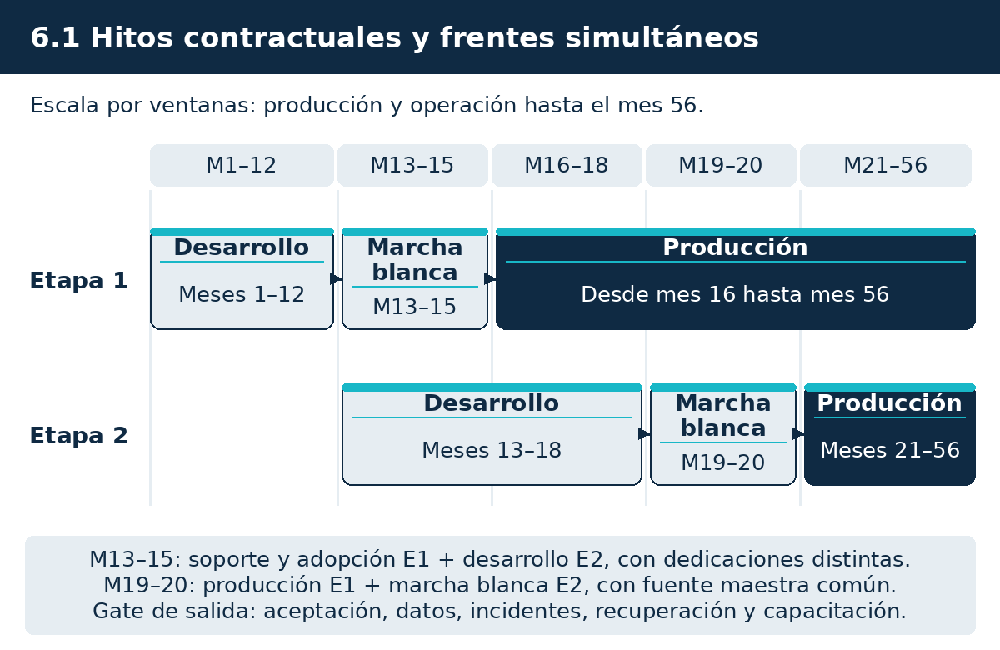
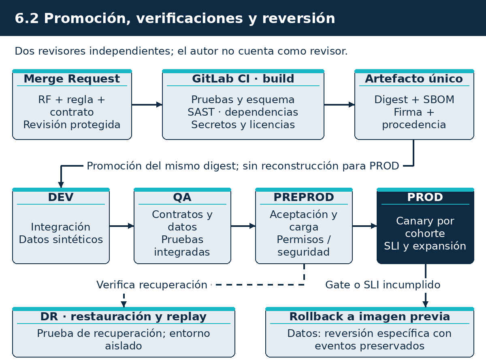

# Subdocumento 6. Metodologías

audIT, Empresa N.º 10. Licitación TFEP-01/2026, Caso 10 Transporte de Carga. Oferta Técnica, Sobre N.º 2. Informe Preparatorio 2. Archivo AUDIT-Subdocumento6.pdf. Anexos: Formulario T-9 en el archivo AUDIT-Formulario-T-9.pdf, Formulario T-10 en el archivo AUDIT-Formulario-T-10.pdf.

## 6 Metodologías

> **Resumen de apertura.**
>
> El presente subdocumento formaliza el marco metodológico integrado de audIT para la dirección, construcción, aseguramiento y despliegue del sistema de gestión operacional y logística de Transportes Curimón S.A. Se establece un modelo de gestión híbrido que conjuga la previsibilidad y rigor de control del estándar PMBOK con la flexibilidad iterativa de Scrum y la eficiencia operativa de Kanban, asegurando el cumplimiento estricto del cronograma de 56 meses y los **42** requerimientos del contrato (Caso, numeral 17.1, p. 38). Asimismo, se institucionaliza una práctica de ingeniería DevSecOps unificada en GitLab CI Enterprise con certificación de procedencia SLSA Nivel 3 y puertas de calidad automáticas.
>
> **Qué recibe Transportes Curimón S.A.**
> - Marco de gobernanza estructurado en cinco comités mandantes con cadencias quincenales y mensuales (FEP01, Artículo 71, p. 37).
> - Procedimiento formal de control de cambios con análisis de impacto multidimensional y tope contractual del 20 % (FEP01, Artículo 72, p. 38).
> - Pipeline integral DevSecOps automatizado con análisis estático (SAST), escaneo de contenedores (Trivy) y pruebas dinámicas (DAST).
> - Cadena de suministro de software protegida mediante firmas criptográficas Cosign y atestaciones SBOM CycloneDX (FEP01, Artículo 4.3, p. 5).
> - Matrices estandarizadas de criterios de salida para Definición de Preparado (DoR) y Definición de Terminado (DoD).

La naturaleza multidimensional de la licitación TFEP-01/2026 exige articular actividades de distinta naturaleza: adquisiciones masivas de equipamiento de telemetría vehicular, obras civiles menores en terminales, configuraciones de infraestructura cloud de misión crítica, e ingeniería de software para componentes transaccionales, móviles y analíticos. Un enfoque metodológico homogéneo resultaría insuficiente. Por ello, la estrategia metodológica de audIT se articula como el núcleo operativo que conecta los requerimientos del Formulario T-12 con el Plan de Trabajo del Capítulo 7, el Plan de Riesgos del Capítulo 8 y el Sistema de Calidad del Capítulo 9.

## 6.1 Metodología de gestión del proyecto

La gestión del proyecto adopta las directrices de la guía PMBOK ((Project Management Institute, 2021)), adaptada específicamente a las restricciones operativas y contractuales del transporte de carga por carretera y la logística interurbana (FEP01, Artículo 4.3, p. 5, FEP02, RT-19.01, p. 33). Este marco garantiza trazabilidad absoluta sobre la línea base de alcance, tiempo y costo, articulando la relación contractual con Transportes Curimón S.A. mediante canales formales de rendición de cuentas.

### 6.1.1 Marco híbrido de gestión: PMBOK y enfoques ágiles

La administración del contrato se fundamenta en un modelo de ciclo de vida híbrido, el cual combina procesos predictivos para los compromisos contractuales vinculantes con ciclos adaptativos para la construcción de los módulos de software. La justificación de este enfoque dual se resume en los siguientes ejes operativos:
- **Capa Predictiva (PMBOK 7):** Aplica a la gestión de la Ruta Crítica contractual del Artículo 17°, la entrega de hitos del Formulario E-25, la logística de abastecimiento e instalación física del hardware vehicular en el parque de **374** (Caso, numeral 14.1, p. 29) camiones, las adecuaciones de salas técnicas y la obtención de recepciones provisorias y definitivas.
- **Capa Adaptativa (Scrum):** Aplica al diseño y programación de los módulos aplicativos (torre de control, despacho, portal de transportistas, aplicación de conductores y analítica). Se estructura en iteraciones cortas (sprints de 2 semanas) con entregables potencialmente desplegables, lo que permite retroalimentación temprana de las contrapartes operativas de Curimón sin comprometer los plazos mayores de entrega.
- **Capa de Flujo Continuo (Kanban):** Aplica a la atención de incidencias en etapa de marcha blanca (60 días para Etapa 1 y 60 días para Etapa 2, FEP01, Artículo 17.3, p. 12), gestión de parches de seguridad y solicitudes de servicio menores durante los 36 meses de operación continuada.

**Decisión D-01. Adopción de marco de gestión híbrido predictivo-ágil**

| Se decide | Se descarta | Criterio | Fuente |
|---|---|---|---|
| Implementar gobernanza predictiva PMBOK para control contractual e hitos combinada con Scrum en iteraciones de dos semanas para software | Enfoque puramente predictivo tipo cascada y enfoque puramente ágil sin línea base | El transporte crítico exige certidumbre contractual de plazos de implantación junto con flexibilidad en diseño de interfaces y analítica | FEP01, Artículo 4.3, p. 5, FEP02, RT-19.01, p. 33 |

La articulación temporal del marco de gestión y su integración con los hitos contractuales de la licitación se ilustra en la Figura 6.1.

*Figura 6.1. Gobernanza temporal del proyecto y articulación de fases, etapas y marchas blancas*

Fuente: Elaboración propia.

Como se desprende de la Figura 6.1, la sincronización entre los sprints ágiles de dos semanas y los hitos contractuales garantiza visibilidad continua para Transportes Curimón sin comprometer los plazos mayores de implantación.

### 6.1.2 Gobernanza de interesados y plan de comunicaciones

La gestión eficaz de los grupos de interés resulta determinante debido a la dispersión geográfica de las faenas y la multiplicidad de actores involucrados en la cadena logística. Se identifican y clasifican los siguientes actores clave:
- **Patrocinador Ejecutivo y Dirección de Transporte Curimón:** Enfocados en retorno de inversión, continuidad operacional del negocio y cumplimiento de contratos de flete minero, vitivinícola y retail.
- **Supervisores de Tráfico y Operadores de Torre de Control:** Usuarios intensivos de la plataforma, orientados a la visibilidad en tiempo real, alertas de desvío y cumplimiento de itinerarios.
- **Conductores de Flota Propia y Terceros:** **454** (Caso, numeral 14.1, p. 29) conductores que interactúan directamente con la aplicación móvil y los sensores de cabina, priorizando la ergonomía, simplicidad y registro certero de jornadas laborales conforme al Artículo 25 bis del Código del Trabajo.
- **Transportistas Terceros y Dueños de Camiones:** Propietarios de los 226 camiones subcontratados, interesados en la liquidación expedita de servicios y visibilidad telemática homologada.
- **Organismos Fiscalizadores (Dirección del Trabajo, MTT, SEC):** Entidades que auditan la legalidad del transporte, pesos por eje, transporte de sustancias peligrosas y registros de jornada.

Conforme a la exigencia técnica de las bases (Caso, RT-19.05, p. 33), audIT implementará desde el primer mes del contrato un **Espacio Colaborativo Digital** unificado en la nube de acceso seguro 24/7 para el equipo del proyecto y la contraparte técnica de Curimón. Este repositorio centralizado alojará la documentación formal, especificaciones de diseño, minutas firmadas, registro vivo de riesgos conforme a la norma ISO 31000 ((ISO, 2018), FEP02, RT-19.04, p. 33) y el catálogo de solicitudes de cambio.

### 6.1.3 Gestión de adquisiciones e integración contractual

La gestión de adquisiciones se estructura para mitigar riesgos de desabastecimiento en la cadena de suministros tecnológicos que pudieran afectar la Ruta Crítica:
- **Adquisición Temprana de Componentes Vehiculares:** Compra y resguardo inicial de los 148 computadores de a bordo industriales, 34 interfaces inductivas CANclick para terceros y antenas satelitales auxiliares durante los meses 1 y 2 de la Etapa 1, neutralizando fluctuaciones de comercio exterior y plazos de internación aduanera.
- **Acuerdos de Nivel de Servicio con Nube Pública:** Contratación bajo régimen Enterprise Agreement con Microsoft Azure para la provisión garantizada de capacidad de cómputo en la región principal Chile Central y zona secundaria Brazil South, asegurando el SLA contractual de 99,5 % (FEP01, Artículo 78, p. 40).
- **Conectividad Celular Multicarrier:** Contratos de conectividad telemática con SIM card industriales en modalidad APN privada sobre redes de telecomunicaciones de cobertura nacional, con conmutación automática entre operadores para minimizar zonas de silencio.

### 6.1.4 Comités de gobernanza, cadencias y mecanismos de decisión

El control directivo y operacional del contrato se estructura en estricto apego al marco de gobernanza mandatado por las bases de licitación (FEP01, Artículo 71, p. 37). La interacción formal entre audIT y Transportes Curimón S.A. se canaliza a través de las cinco instancias que se detallan en la Tabla 6.1.4.

**Tabla 6.1.** Instancias formales de gobernanza, participantes y cadencias

| Instancia | Frecuencia | Participantes obligatorios | Propósito y alcance decisional |
|---|---|---|---|
| Comité Ejecutivo | Mensual | Patrocinador de Curimón, Gerencia de audIT, Administrador del Contrato. | Dirección estratégica, resolución de bloqueos contractuales, aprobación de modificaciones de alcance y evaluación de riesgos mayores. |
| Comité de Proyecto | Quincenal | Contraparte Técnica de Curimón, Jefe de Proyecto de audIT. | Seguimiento riguroso de la Carta Gantt, estado de paquetes de trabajo EDT, control de hitos y acuerdos de ejecución técnica. |
| Comité de Arquitectura | Mensual | Arquitecto de Solución, Oficial de Ciberseguridad, referentes de TI de Curimón. | Aprobación formal de decisiones técnicas (ADR), control de deuda técnica, revisión de estándares de interoperabilidad y seguridad. |
| Comité de Operación | Mensual (desde M13) | Líder de Operación, Jefatura de Mesa de Ayuda, Contraparte Técnica de Curimón. | Verificación del cumplimiento de acuerdos SLA, gestión de problemas recurrentes, indicadores de marcha blanca y mejora continua. |
| Reunión de Seguimiento | Semanal | Equipos de ingeniería y especialistas de ambas partes. | Coordinación táctica operativa, revisión de impedimentos inmediatos y compromisos semanales de avance. |

Las instancias descritas en la Tabla 6.1.4 garantizan que toda discrepancia técnica u operativa se resuelva en el nivel adecuado con plazos acotados, evitando que imprevistos de ingeniería escalen indebidamente a controversias contractuales. El escalamiento operacional transita de forma expedita desde la Reunión Semanal al Comité de Proyecto ante desviaciones operativas, elevándose al Comité Ejecutivo exclusivamente cuando existe impacto en el alcance, presupuesto o nivel de servicio convenido.

Cuando surge una contingencia o solicitud de cambio que modifique el alcance o los plazos acordados, esta debe tramitarse obligatoriamente mediante el procedimiento de control de cambios regido por el Artículo 72° de las Bases Administrativas (FEP01, Artículo 72, p. 38). La secuencia de este proceso se detalla en la Tabla 6.1.4.

**Tabla 6.2.** Procedimiento formal de gestión y control de cambios contractuales

| Paso | Acción requerida | Responsable formal | Criterio y resultado verificable |
|---|---|---|---|
| 1. Registro | Solicitud Formal de Cambio (RFC) en espacio colaborativo. | Parte solicitante (Curimón o audIT). | Formulario normalizado con descripción técnica, justificación operativa y urgencia asignada. |
| 2. Análisis | Evaluación técnica y multidimensional de impactos. | Jefe de Proyecto y Arquitecto de Solución. | Informe de impacto en alcance, cronograma de Ruta Crítica, matriz de riesgos y disponibilidad. |
| 3. Revisión | Dictamen técnico del Comité de Arquitectura. | Contraparte Técnica y Líder Técnico de audIT. | Validación de viabilidad arquitectónica, compatibilidad con microservicios y seguridad. |
| 4. Decisión | Aprobación o rechazo formal en acta. | Comité Ejecutivo (unanimidad de representantes). | Aprobación expresa previa a cualquier ejecución física o lógica. Límite acumulado del 20 %. |
| 5. Ejecución | Actualización de línea base y despliegue controlado. | Equipos de ingeniería y PMO. | Incorporación a sprint de desarrollo o ventana de mantenimiento programada. |

Conforme se establece en la Tabla 6.1.4, la ejecución de cualquier alteración sin la debida aprobación previa en acta del Comité Ejecutivo carecerá de validez contractual y no dará derecho a indemnización (FEP01, Artículo 72.5, p. 38). Si se suscitaren controversias no resueltas en sede del Comité Ejecutivo en un plazo de treinta días corridos, operarán los mecanismos de mediación y arbitraje de derecho ante el Centro de Arbitraje y Mediación de Santiago (FEP01, Artículo 87, p. 45).

> **Compromiso C-01.** audIT formalizará las decisiones y acuerdos de cada sesión de comité en un plazo máximo de veinticuatro horas hábiles en el espacio colaborativo digital.
>
> Métrica: Emisión de minuta formal y registro en espacio digital en menos de 24 horas hábiles tras cada sesión de comité. Se verifica en: Registro de auditoría del repositorio colaborativo. Fuente: FEP01, Artículo 71, p. 37, FEP02, RT-19.05, p. 33.

## 6.2 Metodología de desarrollo de software

El desarrollo de la solución tecnológica se estructura bajo un ciclo de vida evolutivo basado en ingeniería de software guiada por el dominio (Domain-Driven Design, DDD) y prácticas DevSecOps. Se garantiza la prevención sistemática de deuda técnica y un tiempo de salida al mercado optimizado para los frentes operativos del transporte.

### 6.2.1 Ciclo de vida adaptado y evolución arquitectónica

Para conciliar la alta disponibilidad exigida con la continua evolución logística de Transportes Curimón, el desarrollo de software se organiza en torno a los límites de contexto definidos en el Subdocumento 4.1. Este diseño modular desacopla los servicios transaccionales de telemetría de las interfaces de usuario y los algoritmos analíticos.
- **Gestión Evolutiva de Requerimientos:** Cada uno de los 42 requerimientos del Formulario T-12 se desglosa en Historias de Usuario documentadas en el repositorio colaborativo. Cada historia incluye criterios de aceptación redactados en formato estructurado (Gherkin: Dado, Cuando, Entonces), sirviendo de especificación viva ejecutable.
- **Diseño de Interfaces API-First:** Todo intercambio de datos entre módulos internos y con sistemas legados del cliente se realiza mediante contratos formales: especificación OpenAPI 3.1 para servicios síncronos REST y especificación AsyncAPI 2.6 para eventos telemáticos sobre Apache Kafka (FEP01, Artículo 4.3, p. 5).
- **Prevención y Mitigación de Deuda Técnica:** Cada sprint de construcción reserva un 15 % de la capacidad de desarrollo para refactorización, optimización de consultas en base de datos y actualización de librerías base. Se prohíbe la acumulación de advertencias de compilación y se somete el código a inspección estática continua.

### 6.2.2 Ecosistema DevSecOps unificado en GitLab CI Enterprise

audIT descarta configuraciones fragmentadas o herramientas dispersas, adoptando como estándar corporativo exclusivo la plataforma **GitLab CI Enterprise** para la orquestación íntegra del ciclo DevSecOps (FEP01, Artículo 4.3, p. 5).

**Decisión D-02. Ecosistema integral DevSecOps sobre GitLab CI Enterprise**

| Se decide | Se descarta | Criterio | Fuente |
|---|---|---|---|
| Unificar todo el control de versiones, pipeline de CI/CD, escaneo SAST, gestión de artefactos y políticas de despliegue en GitLab CI Enterprise | Arquitecturas mixtas compuestas por herramientas independientes (Jenkins, SonarQube standalone sin integración nativa, scripts de despliegue aislados) | Reducir vectores de falla, garantizar trazabilidad auditable de la cadena de suministro de software y automatizar la aplicación de políticas SLSA Nivel 3 | FEP01, Artículo 4.3, p. 5 |

El pipeline de entrega continua se ejecuta automáticamente ante cada evento de integración en el repositorio, transitando obligatoriamente por seis fases de validación, ilustradas en la Figura 6.2.

*Figura 6.2. Fases y puertas de calidad del pipeline DevSecOps unificado*

Fuente: Elaboración propia.

Como se representa en la Figura 6.2, ninguna versión de software puede alcanzar el ambiente de producción sin superar secuencialmente las seis etapas del pipeline. En la Tabla 6.2.2 se definen los umbrales bloqueantes parametrizados para garantizar la integridad y seguridad del software.

**Tabla 6.3.** Umbrales y políticas de calidad bloqueantes en el pipeline DevSecOps

| Fase del Pipeline | Herramienta ejecutora | Métrica evaluada | Umbral bloqueante de paso a producción |
|---|---|---|---|
| 1. Pruebas | GitLab Runner / PyTest | Cobertura de código | $Mayor o igual al 80 %$ de cobertura de ramas (branch coverage). Cero pruebas unitarias fallidas. |
| 2. Análisis estático | SonarQube Enterprise | Calidad y seguridad | Quality Gate ``A'' en mantenibilidad, deuda técnica menor al 5 %, cero vulnerabilidades críticas o altas. |
| 3. Contenedores | Trivy Container Scanner | Vulnerabilidades CVE | Cero vulnerabilidades críticas o altas en dependencias y capas base (imágenes Distroless / Alpine). |
| 4. Cadena de valor | Cosign / Syft (Anchore) | Integridad de artefactos | Generación mandatoria de SBOM en formato CycloneDX. Firma criptográfica con clave corporativa HSM. |
| 5. Infraestructura | HashiCorp Terraform | Drift y seguridad IaC | Ejecución de `tfsec` y `checkov`. Cero configuraciones inseguras en templates de Azure. |
| 6. Análisis dinámico | OWASP ZAP | Vulnerabilidades web | Cobertura OWASP ASVS 4.0 Nivel 2 (FEP01, Artículo 4.3, p. 5). Cero hallazgos en Top 10 web y API. |

Los parámetros descritos en la Tabla 6.2.2 actúan como barreras determinísticas automatizadas. La detección de un solo fallo en cualquiera de estos umbrales aborta inmediatamente el pipeline de despliegue, notificando al equipo responsable a través de los canales de ingeniería sin intervención manual.

### 6.2.3 Infraestructura como código y gestión de configuración

Toda la infraestructura cloud alojada en Microsoft Azure se gestiona bajo el paradigma de Infraestructura como Código (IaC) mediante scripts de Terraform versionados en Git (FEP02, RT-10.02, p. 24). Se implementa un modelo de entornos rigurosamente aislados:
- **Segregación de Ambientes:** Suscripciones independientes de Azure para Desarrollo, Pruebas/Staging y Producción, impidiendo cualquier cruce accidental de accesos o datos operacionales.
- **Aprovisionamiento Inmutable:** Los servidores y clusters de Azure Kubernetes Service (AKS) no admiten modificaciones manuales en caliente vía consola. Cualquier cambio de configuración o escalamiento debe registrarse como código, someterse a revisión por pares y desplegarse mediante pipeline.
- **Gestión Centralizada de Secretos:** Ninguna credencial, clave privada o cadena de conexión se almacena en el código fuente. Se utiliza Azure Key Vault integrado con identidades administradas (Managed Identities) y rotación programada automática.

### 6.2.4 Ceremonias técnicas, artefactos y criterios de salida

El trabajo colaborativo del equipo de desarrollo se organiza en torno a un flujo de trabajo de control de versiones GitFlow adaptado. Las ramas principales son:
- **Rama `main`:** Refleja exclusivamente el código en producción verificado. Es una rama protegida que requiere firma criptográfica de commits y aprobación de dos líderes técnicos.
- **Rama `develop`:** Rama de integración continua donde convergen las nuevas funcionalidades validadas mediante pruebas unitarias.
- **Ramas temáticas (`feature/*`, `bugfix/*`, `hotfix/*`):** Ramas de trabajo de corta duración, sujetas obligatoriamente a revisión por pares (Peer Review) mediante Merge Requests.

Para garantizar un estándar riguroso de completitud en cada entrega de software, se establecen las matrices de Definition of Ready (DoR) y Definition of Done (DoD) que se detallan en la Tabla 6.2.4.

**Tabla 6.4.** Criterios formales de salida: Definición de Preparado y Definición de Terminado

| Nivel de control | Artefacto / Fase evaluada | Criterios de aceptación obligatorios |
|---|---|---|
| Definición de Preparado (DoR) | Historia de Usuario / Requerimiento funcional | Requerimiento trazado unívocamente al Formulario T-12. Criterios de aceptación definidos en Gherkin. Dependencias técnicas resueltas. Mockups de interfaz aprobados. |
| Revisión por Pares | Merge Request (MR) en GitLab | Aprobación obligatoria de al menos un revisor senior. Verificación de adherencia a guías de estilo, comentarios arquitectónicos y ausencia de duplicidad de código. |
| Definición de Terminado (DoD) | Incremento de Software / Release Candidate | Código fusionado en rama objetivo. Cobertura $Mayor o igual al 80 %$. Quality Gate SonarQube superado. Contenedor firmado con Cosign y registrado en Azure Container Registry con SBOM. Documentación OpenAPI actualizada. Despliegue exitoso en staging sin regresiones operativas. |

La aplicación de los criterios de la Tabla 6.2.4 asegura que cada módulo tecnológico entregado a Transportes Curimón cumpla con los estándares industriales de mantenibilidad, solidez arquitectónica y ciberseguridad exigidos por las bases.

> **Compromiso C-02.** audIT mantendrá un tiempo de despliegue continuo en ambiente de pruebas inferior a quince minutos para incrementos de software validados.
>
> Métrica: Despliegue automatizado en staging en menos de 15 minutos tras aprobación de Merge Request. Se verifica en: Métricas de ejecución del pipeline en GitLab CI Enterprise. Fuente: FEP01, Artículo 4.3, p. 5, FEP02, RT-10.02, p. 24.

## Referencias

ISO. (2018). *ISO 31000:2018. Risk management -- Guidelines*.

Project Management Institute. (2021). *A Guide to the Project Management Body of Knowledge (PMBOK Guide) and The Standard for Project Management* (7th).

Transportes Curimón S.A. (2026). *Bases administrativas para la preparación de la propuesta: Licitación Pública Internacional N.º TFEP-01/2026* (Documento FEP01).

Transportes Curimón S.A. (2026). *Bases técnicas del Caso 10, Transporte de Carga: Licitación Pública Internacional N.º TFEP-01/2026* (Documento FEP03).

Transportes Curimón S.A. (2026). *Bases técnicas transversales para la preparación de la propuesta: Licitación Pública Internacional N.º TFEP-01/2026* (Documento FEP02).

## Declaración de uso de IA

Conforme al Comunicado 10, sección 7.2, cada sección de este subdocumento y cada formulario asociado declara la herramienta de inteligencia artificial generativa usada, su finalidad, el nivel de uso en texto y en diagramas según la escala oficial de esa sección, y quién revisó y qué verificó. Esta declaración se consolida en el Formulario A-6.

| Sección | Herramienta | Finalidad del uso | Nivel en texto | Nivel en diagramas | Revisión humana (quién y qué verificó) |
|---|---|---|---|---|---|
| Introducción | Claude Opus 5.5 en Claude Code | Ajuste estilístico de redacción introductoria | Bajo | Ninguno | Carlos Jesús Abarza Suazo, Director de Auditoría y Aseguramiento Tecnológico: Verificación de consistencia con Caso 10 y FEP01 |
| 6.1 Metodología de gestión del proyecto | Claude Opus 5.5 en Claude Code | Estructuración del marco híbrido PMBOK/ágil, comités y control de cambios | Medio | Bajo | Carlos Jesús Abarza Suazo, Director de Auditoría y Aseguramiento Tecnológico: Validación de Art. 71, Art. 72 y cadencias de gobernanza |
| 6.2 Metodología de desarrollo de software | Claude Opus 5.5 en Claude Code | Diseño de pipeline DevSecOps en GitLab CI Enterprise y políticas de calidad | Medio | Bajo | Carlos Jesús Abarza Suazo, Director de Auditoría y Aseguramiento Tecnológico: Validación de SLSA 3, Quality Gates y DoD/DoR |
| Formularios T-9 y T-10 | Claude Opus 5.5 en Claude Code | Mapeo formal de exigencias administrativas y de ingeniería hacia secciones del documento | Alto | Ninguno | Carlos Jesús Abarza Suazo, Director de Auditoría y Aseguramiento Tecnológico: Auditoría de cumplimiento FEP01 |
