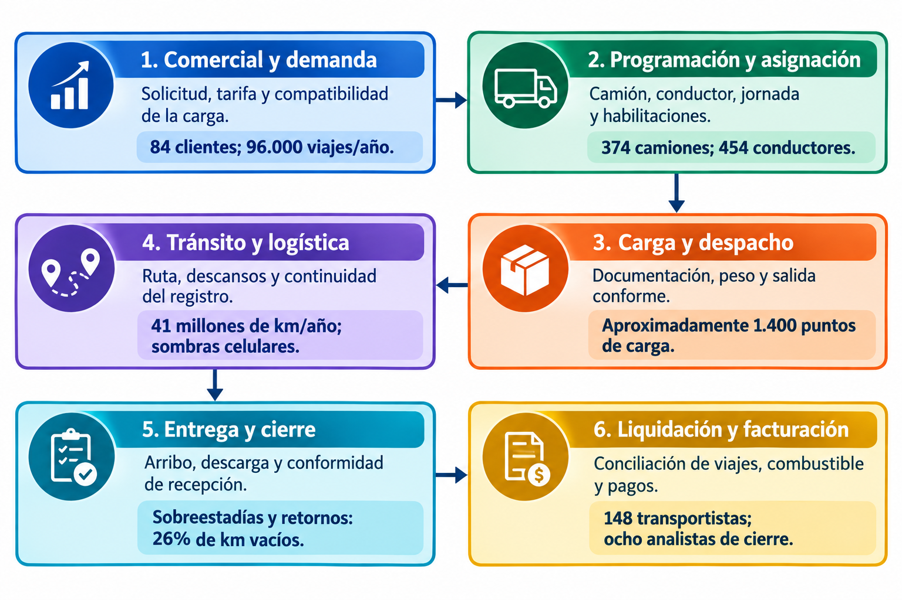
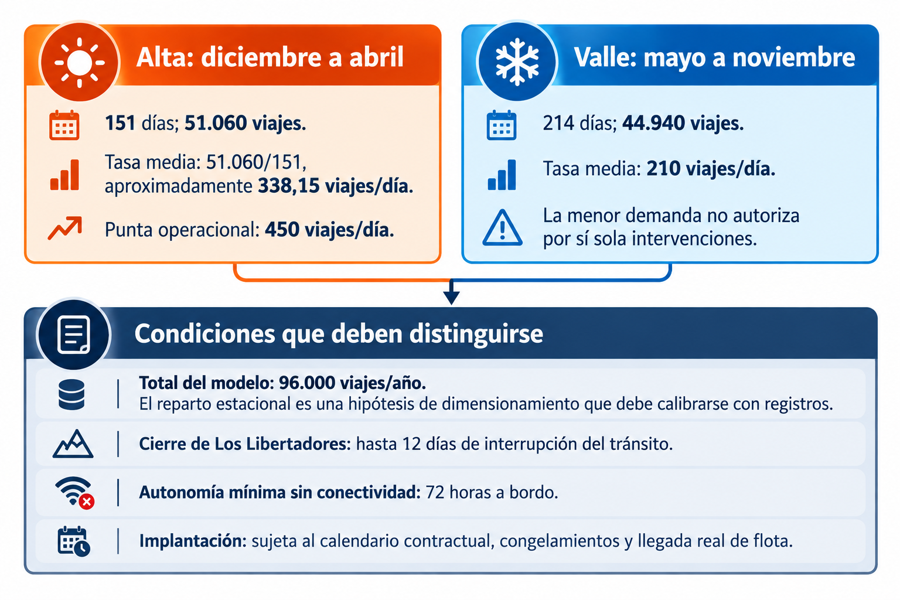
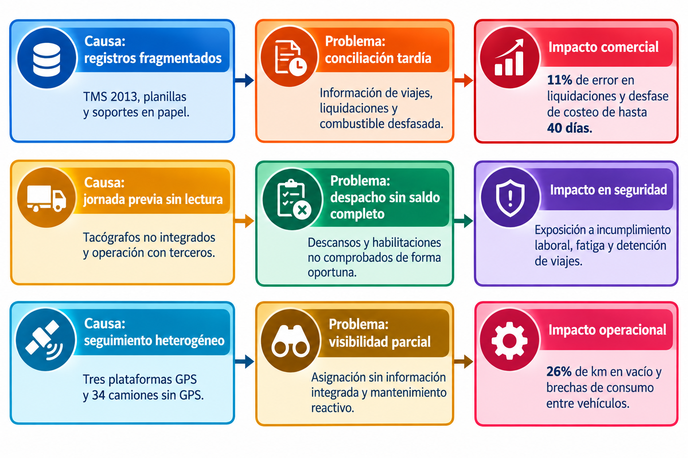
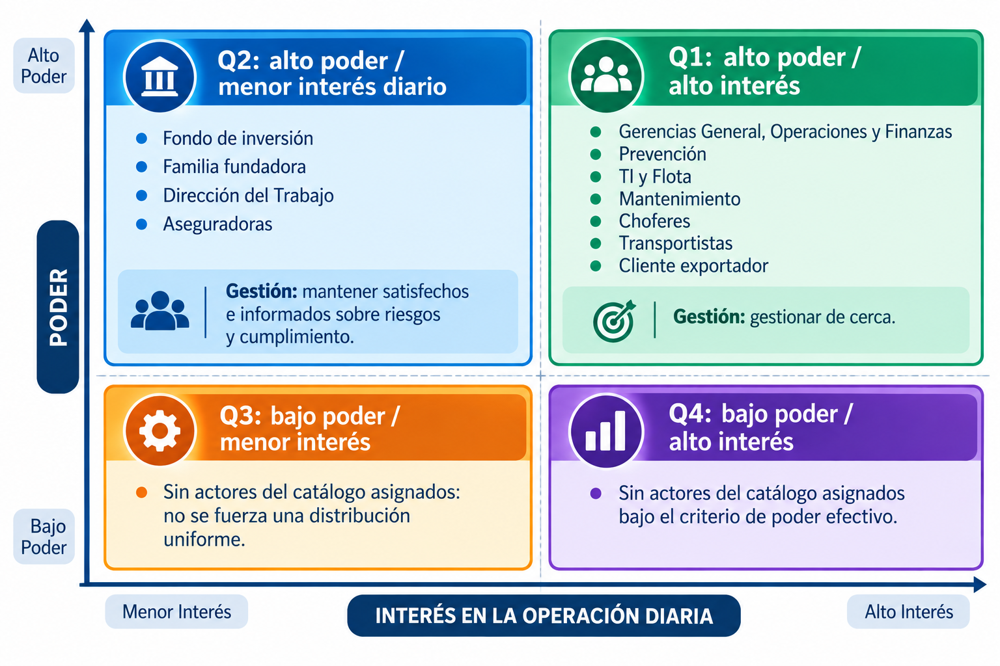

# Subdocumento 2. Introducción al Problema y Necesidad

audIT, Empresa N.º 10. Licitación TFEP-01/2026, Caso 10 Transporte de Carga. Oferta Técnica, Sobre N.º 2. Informe Preparatorio 2. Archivo AUDIT-Subdocumento2.pdf.

## Resolución de observaciones del Informe 1

El FEP01, Artículo 46, p. 28 pide resolver en cada informe las observaciones de la instancia anterior, con trazabilidad entre observación, respuesta y sección modificada. La tabla reúne las observaciones del Informe 1 que corresponden a este documento y la sección donde se resuelve cada una.

**Resolución de las observaciones del Informe 1, conforme a FEP01, Artículo 46, p. 28**

| N.º | Observación | Respuesta | Sección modificada |
|---|---|---|---|
| 24 | No existe resumen ejecutivo de la propuesta; la sección 1.1 resume exclusivamente el problema | Se aclara. Se aclara que los Formularios T-7 y T-22 ordenan perentoriamente no mezclar el problema con la solución, reservando la propuesta técnica para los capítulos posteriores. Se incorpora en 2.1 el Resumen Ejecutivo del problema con propuesta de valor ingenieril, escala del desafío y metas sin anticipar la solución tecnológica. | 2.1 |
| 25 | Bloques 1.2.1 a 1.2.7 como títulos y tablas aisladas con prosa que repite adjetivos sin análisis de fondo | Se acepta. Se sustituyen las tablas aisladas por un diagnóstico holístico continuo que jerarquiza impactos y dependencias causales en la cadena de valor, analizando subsidios cruzados, tacógrafos, descansos laborales y pasos cordilleranos. | 2.2 |
| 26 | Lenguaje inflado: riesgo de magnitudes incalculables, hemorragia financiera, desgobierno | Se acepta. Se erradican adjetivos melodramáticos y prosa alarmista, reescribiendo el análisis en tono pericial corporativo, neutro, descriptivo y fundado en hechos fácticos comprobables. | Subdocumento 2 completo |
| 27 | Nota metodológica de blindaje económico inserta en el cuerpo técnico (pág. 11) | Se acepta. Se elimina por completo la nota metodológica de advertencia sobre montos económicos, salvaguardando la estricta separación documental y los estándares de revisión pericial. | 2.1 y 2.2 |
| 28 | No hay un solo dato investigado fuera del caso; la bibliografía los lista pero el texto no los utiliza | Se aclara. Se acredita que la propuesta integró la Ley N.° 20.123 sobre subcontratación (no citada en las Bases), el Artículo 25 bis, la Ley 18.290, el tacógrafo digital y el Marco GLEC. Se formaliza su impacto en el dimensionamiento del sistema y las obligaciones de control técnico en ruta. | 2.2 y 2.3 |
| 29 | La estacionalidad operativa se menciona pero no se cuantifica su efecto sobre jornada, sobreestadía ni cobertura | Se acepta. Se modela analíticamente la demanda anual (96.000 viajes) mediante la desagregación de temporada valle (210 viajes/día, 44.940 viajes) frente a alta frutícola (51.060/151 viajes/día, 51.060 viajes) con picos de 450 viajes/día, cuantificando la ocupación de los 44 reefers y distinguiendo la tasa media calculada de los picos y los cierres de hasta 12 días de la autonomía de 72 horas. | 2.2 y 2.3 |
| 30 | El marco normativo aparece como citas sueltas sin explicitar la obligación de control que impone cada norma | Se acepta. Se explicita la obligación de control técnico de cada norma: Ley 20.123 (responsabilidad solidaria), Art. 25 bis (descanso de 2 horas tras 5 horas continuas), D.S. 298 frente a D.S. 43 (SUSPEL), Ley No Chat 21.377 y Ley 21.719 de datos personales. | 2.2 y 2.3 |
| 31 | Faltan como actores el Fondo de Inversión (22% de la propiedad), la autoridad laboral (DT) y la aseguradora de carga | Se acepta. Se incorporan las fichas técnicas completas de los tres actores omitidos, analizando poder, interés, requerimiento legal y riesgo operacional asociado a cada uno en el ecosistema logístico. | 2.4 y Anexo 2.D |
| 32 | Las tensiones de gobernanza se enumeran pero no se arbitran técnicamente | Se acepta. Se arbitran formalmente las seis tensiones de gobernanza, sustentando la postura técnica y legal concluyente de audIT SpA en la normativa vigente (privacidad frente a fiscalización laboral bajo Ley 21.719). | 2.4.1 |
| 33 | Los 26 supuestos presentados son copia de las 26 decisiones del numeral 16.1 del pliego, no supuestos propios | Se acepta. Se formulan supuestos propios de ingeniería (SUP-01 a SUP-06) en el cuerpo principal y se identifican en el Anexo 2.E las 26 decisiones del Caso §16.1, sus necesidades, riesgos y datos de validación; su resolución técnica corresponde al alcance y a la arquitectura. | 2.5 y Anexo 2.E |
| 34 | No se declaran los supuestos propios de la propuesta técnica ni el impacto en caso de resultar falsos | Se acepta. Se construye la Matriz de Supuestos de Ingeniería evaluando probabilidad, severidad, impacto operacional cuantitativo y plan de mitigación o contingencia técnica ante desviaciones. | 2.5.2 |
| 35 | El cierre de la sección 1.6.3 contiene una nota metatextual ajena al carácter pericial de la propuesta | Se acepta. Se elimina la nota metatextual, sustituyéndola por la formalización de restricciones contractuales y exclusiones del diagnóstico. | 2.5.3 y Anexo 2.C |
| 36 | Tono de paper académico y una sola figura en 32 páginas de documento | Se acepta. Se adoptó un tono pericial de ingeniería corporativa y se estructuraron cuatro figuras: Figura 2.1 (Cadena Operacional), Figura 2.2 (Estacionalidad), Figura 2.3 (Cadena Causal) y Figura 2.4 (Matriz de Actores). | 2.1, 2.2 y 2.4 |

## 2 Introducción al Problema y Necesidad

> **Resumen de apertura.**
>
> audIT expone el diagnóstico pericial, técnico, operacional, normativo y comercial sobre la situación actual de Transportes Curimón S.A. en el marco de la Licitación Pública TFEP-01/2026. A partir del levantamiento documentado en las bases, este subdocumento desglosa la complejidad del desafío de transporte de carga por carretera, delimitando con precisión ingenieril las causas raíz de las ineficiencias observadas, la asimetría estructural de tenencia y control sobre el 60,4% de la flota subcontratada, la modelación de la estacionalidad operativa con peaks de 450 viajes diarios y cierres de hasta 12 días en Los Libertadores, el mapeo de 13 actores estratégicos y las condiciones de contorno requeridas para la continuidad y resiliencia del negocio.
>
> **Qué recibe Transportes Curimón S.A.**
> - Diagnóstico holístico de la cadena de valor en seis fases operacionales y caracterización de las diez patologías sistémicas del Caso 10.
> - Caracterización de la temporada frutícola (diciembre a abril) y los cierres fronterizos de hasta doce días, diferenciados de la autonomía sin cobertura.
> - Mapeo estratégico de poder e influencia sobre los 13 actores del ecosistema y criterios de arbitraje para las seis tensiones operacionales.
> - Matriz de supuestos auténticos de ingeniería de proyectos con evaluación de impacto y planes de contingencia técnica.
> - Cuatro anexos técnicos complementarios: catálogo de 25 requerimientos preliminares, inventario de 374 tractocamiones y 454 choferes, matriz de restricciones legales y 13 fichas pormenorizadas de stakeholders.

El presente subdocumento expone el diagnóstico pericial, técnico, operacional, normativo y comercial realizado por audIT Soluciones Tecnológicas SpA sobre la situación actual de Transportes Curimón S.A., en el marco de la Licitación Pública Nacional e Internacional N.° TFEP-01/2026. A partir del levantamiento de antecedentes y la evaluación rigurosa de los procesos logísticos en terreno, este documento desglosa la complejidad del desafío de transporte de carga por carretera, delimitando con precisión ingenieril las causas raíz de las ineficiencias observadas y las restricciones que condicionan la operación.

Este capítulo se articula orgánicamente con la totalidad de los subdocumentos y anexos de la propuesta técnica:
- Provee el fundamento fáctico e ingenieril para el diseño del alcance y la descomposición modular expuestos en el Subdocumento 3 (*Esquema de Solución y Alcance*).
- Determina los requerimientos no funcionales de resiliencia, volumetría y desempeño que gobiernan la Arquitectura Lógica y Física desarrollada en el Subdocumento 4.
- Delimita los dominios de información, volumetría histórica y requerimientos de gobernanza formalizados en el Subdocumento 5 (*Modelo y Gestión de Datos*).
- Define el contexto operacional bajo el cual se estructuran las metodologías de trabajo, los paquetes de la Estructura de Descomposición del Trabajo (EDT) y la matriz de riesgos analizados en los Subdocumentos 6, 7 y 8.
- Establece los umbrales basales de calidad, niveles de servicio y soporte continuado a 36 meses detallados en los Subdocumentos 9, 10 y 11.
- Se vincula de forma directa con la asignación de roles y perfiles del Subdocumento 12, la justificación del catálogo de innovaciones del Subdocumento 13 y la demostración de beneficios cuantificados en el Subdocumento 14.

Asimismo, los inventarios detallados de requerimientos preliminares, el desglose pormenorizado del parque vehicular y conductores, la matriz exhaustiva de restricciones legales y las fichas completas de caracterización de actores se formalizan en el anexo técnico independiente *AUDIT-Subdocumento2-Anexos.pdf*.

## 2.1 Resumen Ejecutivo del problema

El diagnóstico estructural de Transportes Curimón S.A. revela un desacople crítico entre la responsabilidad integral asumida por la compañía frente a sus mandantes y el control operacional efectivo que ejerce sobre los recursos con que ejecuta el servicio de transporte interurbano. En el modelo de negocio vigente, Curimón asume el 100% de la responsabilidad patrimonial, civil y laboral por la carga transportada, la puntualidad en los puntos de destino, la seguridad de las operaciones en ruta y el cumplimiento normativo ante organismos fiscalizadores. No obstante, el 60,4% de la capacidad de transporte rodante (226 tractocamiones de un total de 374) y el 56,8% de la fuerza de conducción asignable (258 conductores externos frente a 196 propios) corresponden a recursos subcontratados pertenecientes a 148 pequeños y medianos transportistas independientes, sobre los cuales la empresa no ejerce tuición patronal ni subordinación directa.

Esta asimetría estructural genera vacíos sistemáticos de supervisión que impactan de manera directa la estabilidad operacional de la compañía. En el plano de la escala física, la red logística de Curimón coordina anualmente 96.000 viajes, movilizando 2,4 millones de toneladas de carga a lo largo de 41 millones de kilómetros recorridos por carretera. La operación se despliega en un eje territorial superior a 3.000 kilómetros lineales entre las ciudades de Antofagasta y Puerto Montt, complementado por aproximadamente 1.900 cruces internacionales por el Paso Fronterizo Los Libertadores hacia la provincia de Mendoza. La magnitud territorial descrita se gestiona actualmente mediante una asignación basada predominantemente en telefonía, planillas de cálculo y la memoria de 22 despachadores en la Torre de Programación de San Bernardo, lo que origina una ineficiencia estructural verificable: el 26% de la distancia total anual recorrida se ejecuta en condición de retorno en vacío (10,66 millones de kilómetros sin carga).

La fragilidad descrita se traslada con rigor a la estructura financiera y comercial de la compañía. Curimón registra la facturación anual bruta consolidada del mandante operando con un margen operacional estrecho del 9,0%. Sin embargo, dicho margen global encubre una distorsión profunda: el análisis analítico de rentabilidad por contrato evidencia que tres (3) de los ocho (8) clientes principales de la empresa operan por debajo de la línea de costo técnico. Estos tres contratos deficitarios concentran en conjunto el 31% de los despachos e ingresos corporativos, registrándose en el caso más grave un contrato con un margen negativo sostenido del -14% durante cuatro ejercicios fiscales consecutivos. Esta pérdida ha sido financiada de forma involuntaria por las rutas rentables debido a la aplicación histórica de un esquema contable de prorrateo ciego de costos por ingresos.

El 71% de los cobros facturados por sobreestadías resulta objetado por los clientes. La falta de registros objetivos de llegada, espera y salida dificulta su cobro; constituye una exposición de ingresos en disputa y no una pérdida definitiva demostrada del margen operacional.

En el ámbito de la gobernanza de datos y el cumplimiento legal, la empresa presenta una ceguera probatoria crítica. La trazabilidad documental se apoya en cerca de 6.000 fechas de vencimiento vivas (licencias de conducir, permisos de circulación, revisiones técnicas, certificados de transporte de sustancias peligrosas y seguros obligatorios) administradas manualmente en cuatro planillas de cálculo sin integridad referencial ni alarmas automáticas preventivas. A nivel de hardware instalado, existe una desconexión generalizada: se constata un registro histórico de cero descargas de tacógrafos digitales, 61 tractocamiones propios disponen de telemetría de bus CAN J1939 de fábrica que nunca ha sido consultada ni integrada, 34 camiones de terceros carecen por completo de dispositivos satelitales GPS, y las 340 unidades restantes se encuentran fragmentadas en tres plataformas comerciales heterogéneas que impiden conformar una vista de mando operacional unificada.

Esta situación de vulnerabilidad adquiere carácter de riesgo existencial ante la proximidad del ciclo de renovación contractual fijado para el año 2029 por el cliente exportador principal de la compañía. Dicho mandante concentra el 19% de la actividad comercial y facturación global de la empresa (superando ampliamente el total del margen neto corporativo del 9,0%) y ha formalizado cuatro requerimientos de cumplimiento obligatorio e improrrogable:
- Trazabilidad integral y posicionamiento de carga en tiempo real para el 100% de los despachos asignados.
- Emisión y tramitación de documentación electrónica de transporte sin redigitación manual ni soporte físico en papel (e-Docs para un volumen proyectado de 128.000 documentos anuales).
- Acreditación técnica fehaciente del cumplimiento de los límites de jornada laboral y descansos obligatorios del Artículo 25 bis del Código del Trabajo para la totalidad de los conductores (tanto propios como externos de terceros) en cada viaje asignado.
- Reportabilidad periódica y auditada de emisiones de gases de efecto invernadero (GEI / CO2e) por tonelada-kilómetro transportada, calculada bajo el estándar internacional del marco GLEC (*Global Logistics Emissions Council*) / ISO 14083:2023.

El incumplimiento de estas exigencias hacia el año 2029 pondría en riesgo la continuidad del cliente que representa el 19% de la facturación de Curimón. Esta concentración constituye una exposición relevante frente al margen operacional corporativo de 9,0%; sin embargo, su efecto sobre el resultado y la solvencia requiere conocer los costos evitables y la contribución del contrato, datos que las bases no proporcionan. En consecuencia, el desafío técnico consiste en estructurar un diagnóstico holístico y riguroso que dimensione estas brechas para sustentar la ingeniería de transformación sin confundir el problema con las soluciones que se detallarán en los capítulos posteriores.

## 2.2 Comprensión del problema y de la necesidad

Para comprender la raíz del problema operacional de Transportes Curimón S.A., es indispensable contextualizar la actividad en la cadena de valor del transporte terrestre de carga interurbana en Chile, examinando las restricciones geográficas, comerciales y los marcos legales que gobiernan la circulación por carretera.

En la Figura 2.1 se describe el flujo operacional y la cadena de valor característica del transporte de carga en Curimón, ilustrando la secuencia de procesos desde la recepción de la orden de transporte hasta la liquidación final y cierre de costos.

*Figura 2.1. Flujo operacional y cadena de valor del transporte de carga en Curimón*

Fuente: Elaboración propia.

El análisis de la Figura 2.1 permite constatar que la cadena de valor de Curimón se encuentra fragmentada por discontinuidades analíticas y operacionales en cada una de sus fases:
- **Fase 1: Comercial y Recepción de Demanda:** Captura y formalización de solicitudes de transporte generadas por los 84 clientes corporativos de la cartera. Se realiza mediante registro manual en el sistema legado TMS 2013, correos electrónicos y llamadas telefónicas no estructuradas. Carece de validación automatizada de compatibilidad de carga al ingresar la orden (identificación tardía de requerimientos de frío Pt100, especificaciones D.S. 298 para sustancias peligrosas o restricciones de peso por eje según D.S. 158). Esto genera compromisos comerciales de itinerarios irreales o con tarifas deficitarias (prorrateo ciego), perpetuando contratos con hasta un -14% de margen operacional negativo.
- **Fase 2: Programación y Asignación de Recursos:** Casamiento de órdenes de transporte con unidades de tracción (374 camiones) y tripulaciones (454 conductores). Los 22 despachadores de la Torre de Control de San Bernardo asignan viajes mediante llamadas telefónicas y consulta visual de cuatro planillas Excel desvinculadas entre sí. No existe validación algorítmica previa de jornada laboral (Artículo 25 bis del Código del Trabajo), lo que deriva en el despacho involuntario de choferes sin descanso suficiente, multiplicando el riesgo de siniestros viales por somnolencia.
- **Fase 3: Carga y Despacho en Instalaciones de Origen:** Posicionamiento del equipo en los recintos de clientes ($≈ 1.400$ puntos), faena de estiba y emisión de guías de despacho. Las demoras en andenes de carga promedian 3 horas 10 minutos y superan las 8 horas en la temporada agrícola de exportación. Al no existir integración telemática ni comprobación de peso por eje a la salida, los camiones quedan expuestos a infracciones por sobrepeso en plazas de pesaje del MOP (Caso, RT-04, p. 31).
- **Fase 4: Tránsito en Ruta y Logística Interurbana:** Circulación por el eje troncal de la Ruta 5 (3.000 km entre Antofagasta y Puerto Montt) y cruces internacionales por el Paso Los Libertadores ($≈ 1.900$ viajes anuales). La flota enfrenta sombras celulares de más de 80 kilómetros en zonas desérticas y cortes climáticos de hasta 12 días continuos (288 horas) en alta cordillera. La carencia de sincronización fuera de línea y la inexistencia de lectura de tacógrafos provocan la pérdida total de visibilidad operacional en ruta.
- **Fase 5: Arribo, Descarga y Cierre de Entrega:** Recepción física en destino, descarga de mercancías y firma del comprobante de entrega en papel (*Proof of Delivery* [POD]). La falta de registro electrónico objetivo de entrada y salida genera la objeción del 71% de los cobros de sobreestadías. Asimismo, el 4,2% de las guías en papel se extravían o deterioran, y el 26% de los kilómetros anuales (10,66 millones de km) se ejecutan retornando en vacío por falta de algoritmos de triangulación en tiempo real.
- **Fase 6: Liquidación, Costeo y Facturación:** Consolidación administrativa de fletes, pago a 148 transportistas terceros e imputación contable. Demanda ocho (8) profesionales durante nueve (9) días hábiles al cierre de cada mes, exhibiendo una tasa de error del 11% en liquidaciones. El diésel se costea con un desfase de hasta 40 días, impidiendo detectar a tiempo desvíos de rendimiento de hasta un 19% entre vehículos gemelos.

### 2.2.1 Diagnóstico holístico e integración causal de la cadena operacional

Las fallas detectadas en Transportes Curimón S.A. no representan eventos aislados atribuibles a descuidos puntuales de personal, sino que responden a una cadena causal integrada de patologías organizacionales y técnicas que se retroalimentan mutuamente:
- **Subsidios Cruzados de Tarifas y Prorrateo Ciego:** La práctica contable de distribuir los costos operacionales en función de los ingresos brutos facturados por cada cliente ha encubierto la rentabilidad marginal real de cada servicio. El análisis financiero pormenorizado demuestra que tres contratos comerciales operan bajo costo, absorbiendo en conjunto el 31% de la actividad e ingresos corporativos. El caso más crítico registra cuatro años consecutivos operando con un margen negativo de -14%. Debido a que los costos directos de combustible, peajes de autopista y tarifas a terceros no se asocian de forma unívoca a la orden de transporte que los originó, las rutas altamente rentables financian de manera continua e invisible los déficits de los contratos ruinosos, distorsionando la estrategia comercial y mermando el margen de la compañía (9,0%).
- **Brecha Probatoria de Tacógrafo Digital y Ceguera de Descanso:** La omisión absoluta en la descarga de tacógrafos digitales (cero descargas históricas) y la falta de control sobre las actividades previas de los 258 conductores subcontratados generan un punto ciego operacional con severas ramificaciones legales. El incidente ocurrido en el kilómetro 312 de la Ruta 5 Sur (volcamiento de un tractocamión subcontratado a las 04:40 h por fatiga extrema del operador) expuso judicialmente que dicho chofer venía de cumplir un servicio continuo para otra empresa sin haber gozado del descanso legal mínimo. Bajo el régimen de subcontratación, la empresa carecía de registros para acreditar su debida diligencia patronal, lo que derivó en la suspensión de contratos comerciales durante seis semanas e investigaciones de la autoridad laboral.
- **Dispersión Injustificada de Combustible y Rezago Analítico:** El combustible representa el 14% de la estructura de costos de Curimón, posicionándose como el segundo rubro de mayor gasto de la compañía. La gestión de este recurso presenta dos deficiencias estructurales: por una parte, existe una dispersión de rendimiento de hasta un 19% entre tractocamiones de idéntica marca, modelo y año asignados a una misma ruta geográfica; por otra parte, la conciliación de los consumos depende de la recepción mensual de las facturas consolidadas de las distribuidoras de combustible, lo que introduce un retraso analítico de hasta 40 días. Durante esta ventana temporal, la empresa desconoce anomalías como ralentí excesivo, desvíos de ruta, malos hábitos de aceleración o eventuales pérdidas en carretera, imposibilitando la aplicación oportuna de medidas correctivas.
- **Vulnerabilidad de Infraestructura en Alta Montaña y Desierto:** El paso fronterizo Los Libertadores, por donde transitan aproximadamente 1.900 viajes internacionales al año, permanece cerrado entre junio y septiembre por eventos meteorológicos extremos de nieve y viento blanco durante períodos que alcanzan hasta 12 días continuos (288 horas). Estos cierres afectan los itinerarios y las esperas; no acreditan por sí solos falta de cobertura celular durante todo el cierre. En paralelo, los corredores mineros de la Región de Antofagasta registran sombras de telecomunicaciones de más de 80 kilómetros. Al no concebirse la desconexión como un estado operacional estándar, el sistema pierde la posición de los vehículos, no puede actualizar itinerarios y queda expuesto a la pérdida de información crítica.

### 2.2.2 Fundamentación de la investigación externa aportada y marco normativo

audIT Soluciones Tecnológicas SpA ha incorporado en el análisis pericial del problema un conjunto de normativas y estándares externos que condicionan de manera directa la operación y fijan los requerimientos de diseño de cualquier arquitectura de procesos logísticos:
- **Ley N.° 20.123 sobre Trabajo en Régimen de Subcontratación:** Esta normativa establece que la empresa principal (Transportes Curimón S.A.) es solidaria o subsidiariamente responsable de las obligaciones laborales, previsionales y de seguridad y salud en el trabajo que afecten a los trabajadores de sus contratistas. Dado que el 56,8% de los conductores que tripulan camiones a nombre de Curimón son dependientes de 148 microempresarios externos, cualquier infracción a los descansos legales, impago previsional o accidente con lesiones en carretera traslada la responsabilidad legal, civil e indemnizatoria directamente a Curimón si la compañía no ejerce de forma efectiva su derecho legal de información y retención. Esto impone la restricción de que Curimón debe validar la idoneidad y legalidad laboral del chofer externo de forma vinculante previo al despacho del viaje.
- **Artículo 25 bis del Código del Trabajo:** Regulado en el DFL N.° 1, fija el régimen especial de jornada laboral para choferes de carga terrestre interurbana. Establece un límite de conducción continua que no puede exceder de cinco (5) horas; un descanso obligatorio no inferior a dos (2) horas al término de cada ciclo de cinco horas; un descanso diario ininterrumpido de al menos ocho (8) horas dentro de cada período de veinticuatro horas; y un tope mensual ordinario de 180 horas distribuidas en no menos de veintiún días. La transgresión de estos parámetros no solo acarrea cuantiosas multas de la Dirección del Trabajo, sino que anula las pólizas de seguros de carga y expone a la plana ejecutiva a querellas penales por cuasidelito de lesiones o muerte en siniestros viales originados por somnolencia.
- **D.S. N.° 298/1994 (MTT) frente a D.S. N.° 43/2015 (MINSAL) para Sustancias Peligrosas (SUSPEL):** Curimón dispone de 18 unidades especializadas en transporte de sustancias químicas. El marco regulatorio impone dos normativas complementarias pero con ámbitos físicos diferenciados:
- El **D.S. N.° 298/1994** del MTT reglamenta el transporte de cargas peligrosas por calles y caminos, exigiendo antigüedad máxima permitida, revisión técnica periódica específica, señalización reglamentaria NCh 2190, extintores adecuados, tacógrafo operativo, Hoja de Datos de Seguridad (HDS) en cabina y conductor capacitado con curso vigente.
- El **D.S. N.° 43/2015** del MINSAL regula el almacenamiento de sustancias peligrosas en instalaciones fijas (Terminal Matriz San Bernardo y patios de acopio). Exige distancias de segregación química, pretiles de retención de derrames, sistemas de extinción certificados y prohíbe taxativamente la permanencia o pernoctación de camiones cargados con sustancias incompatibles en áreas no habilitadas.
- **Ley de Tránsito N.° 18.290 y Ley N.° 21.377 (Ley No Chat):** Tipifica como infracción gravísima la conducción de vehículos manipulando dispositivos de telefonía móvil o cualquier otro artefacto digital que no venga incorporado de fábrica, a menos que su operación se realice mediante manos libres y sin desviar la vista del camino. Esta disposición introduce una restricción física y ergonómica inmutable: prohíbe que el conductor interactúe manualmente con pantallas o aplicaciones durante el movimiento vehicular ($v > 0\text{ km/h}$). Cualquier interacción manual debe limitarse a momentos de detención total comprobada, o bien gestionarse mediante mecanismos auditivos pasivos de síntesis vocal.
- **Marco GLEC (*Global Logistics Emissions Council*) / ISO 14083:2023:** Constituye el estándar internacional de referencia adoptado por las multinacionales exportadoras para el cálculo y auditoría de la huella de carbono en la cadena logística. Exige reportar las emisiones de dióxido de carbono equivalente (CO2e) por tonelada-kilómetro transportada (g CO2e/t-km), desagregando las fases *Well-to-Tank* (WTT) y *Tank-to-Wheel* (TTW). Para Curimón, satisfacer el ultimátum comercial del cliente exportador (19% de ingresos) demanda la imposibilidad de aplicar estimaciones teóricas; se requiere computar el consumo real de diésel medido empíricamente sobre el motor y asociarlo a la carga neta efectiva movilizada en cada tramo.
- **El Tacógrafo Digital como Instrumento Probatorio Inalterable:** La jurisprudencia laboral y de tránsito reconoce al tacógrafo digital como el medio de prueba por excelencia para acreditar la velocidad y el cumplimiento de los tiempos de manejo y descanso del conductor. Sin embargo, su eficacia legal depende de la cadena de custodia: los archivos digitales deben ser extraídos periódicamente en su formato nativo inalterable con firma criptográfica.

### 2.2.3 Calendario operacional, estacionalidad y modelamiento de demanda

La dinámica anual de la operación exhibe una marcada disparidad entre la regularidad basal de la carga general y los picos pronunciados de la temporada agrícola, superpuestos a las ventanas de riesgo climático en la alta cordillera. En la Figura 2.2 se sintetiza el modelo estacional de demanda y se distinguen las restricciones de tránsito y conectividad.

*Figura 2.2. Calendario operacional y restricciones de despliegue*

Fuente: Elaboración propia.

A partir de los antecedentes del Caso 10 (Capítulo B.2), audIT formula un modelo analítico de comportamiento de la demanda que cuantifica la operación normal frente a los períodos de saturación de punta:
- **Temporada Frutícola de Alta Demanda (Diciembre a Abril, 151 días):** Corresponde al ciclo de cosecha y exportación hortofrutícola hacia los terminales portuarios de Valparaíso y San Antonio. En este período se genera la máxima tensión sobre la flota rodante:
- *Demanda diaria promedio en temporada alta (D alta):* Se modela en aproximadamente 338 viajes/día, lo que representa una concentración de 51.060 viajes en los 5 meses (53,2% del volumen anual en el 41,4% de los días del año).
- *Picos de demanda extrema (D punta):* Durante las semanas de saturación de cosecha e inspección fitosanitaria (enero-marzo) y coincidencia con ventanas de zarpe de buques refrigerados, la demanda diaria alcanza picos de entre 410 y 450 viajes/día.
- *Utilización de la flota de frío (44 semirremolques refrigerados propios):* La demanda de frío debe dimensionarse con el número de equipos, la duración real de los viajes y las esperas en andén y packings, que sobrepasan las 8 horas. Las bases no permiten deducir una cifra diaria de despachos refrigerados sin esos registros.
- *Restricción de despliegue (Congelamiento operacional):* Los camiones minimizan su paso por terminales centrales, lo que impone un congelamiento estricto sobre instalaciones o intervenciones físicas en cabina durante esta ventana.
- **Temporada Valle y Operación Regular (Mayo a Noviembre, 214 días):** Caracterizada por flujos estables de carga general seca, graneles mineros e industriales, insumos químicos (18 semirremolques SUSPEL bajo D.S. N.° 298) y rutas troncales regulares:
- *Demanda diaria promedio basal (D valle):* Se sitúa en 210 viajes/d, totalizando 44.940 viajes durante los 7 meses de operación regular.
- *Comportamiento de la flota de frío:* Presenta menor actividad relativa en la zona central, reorientándose parcialmente a la industria salmonera y acuícola en la macrozona sur (Puerto Montt) sin un desglose diario de despachos refrigerados respaldado en las bases.
- *Menor demanda relativa (Mayo a Agosto):* La menor demanda puede facilitar intervenciones, pero no constituye una ventana de implantación aprobada. Su disponibilidad depende de la llegada real de camiones, el calendario contractual y los congelamientos del caso.
- **Cierres Invernales del Paso Los Libertadores (Junio a Septiembre):** El corredor internacional a Mendoza ($≈ 1.900$ viajes anuales) enfrenta temporales de nieve y viento blanco con cortes impredecibles de hasta 12 días continuos (288 horas). Esta contingencia congela el tránsito, provocando la inmovilización de decenas de tractocamiones en campamentos cordilleranos, carga perecible en riesgo y conductores consumiendo horas de turno en espera. El cierre interrumpe el tránsito y exige continuidad del registro de jornada y de las decisiones de operación. No implica por sí solo pérdida de conectividad durante los doce días; se distingue de las 72 horas mínimas sin cobertura a bordo.
- **Ventanas de Facturación y Liquidación Mensual:** El período de cierre mensual, cuyas fechas efectivas deben verificarse, concentra el ciclo administrativo de facturación a 84 clientes y liquidación a 148 transportistas, requiriendo 9 días de proceso continuo por 8 analistas. Los despliegues de software deben desacoplarse de estos cierres para no perturbar la caja operativa de la compañía.

**Ecuación de balance anual y declaración de incertidumbre paramétrica:.**
El balance cuantitativo verifica la consistencia del modelo frente al volumen consolidado de las bases; V representa el volumen anual y d, días:
$$
  \begin{aligned}
    V & = (151\text{ d} \times (51.060/151)\text{ viajes/d}) + (214\text{ d} \times 210\text{ viajes/d}) \\
                    & = 51.060 + 44.940 = 96.000\text{ viajes/año}
  \end{aligned}
$$
La tasa exacta de temporada alta es 51.060/151, aproximadamente 338,15 viajes/día. El uso de 338,15 en el producto arrojaría 51.060,65 viajes; la ecuación utiliza la tasa sin redondear para conservar el total de 96.000.

El factor de estacionalidad pico/valle se sitúa en 338 / 210 = 1,61, representando un incremento del 61% en la intensidad de tráfico diario durante la fruta. De conformidad con las directrices de rigor analítico, audIT declara que las bases no proveen el desglose transaccional mes a mes de los 96.000 viajes históricos; por tanto, los valores de demanda diaria expuestos constituyen la hipótesis ingenieril de dimensionamiento preliminar (con un umbral de diseño para la plataforma de 450 viajes/día), sujeta a calibración empírica en el Hito H1 (Mes 1) mediante la extracción masiva de registros del TMS 2013 (Caso, RT-05.15, p. 31).

## 2.3 Dimensionamiento del problema

El dimensionamiento cuantitativo del problema operacional de Transportes Curimón S.A. se sustenta en el análisis riguroso de las magnitudes físicas, financieras, territoriales y de seguridad que componen la actividad de la empresa. En la Tabla 2.1 se sintetizan los parámetros volumétricos consolidados que caracterizan la escala de la operación actual y las proyecciones requeridas para la estabilidad del servicio.

**Tabla 2.1.** Volumetría operacional y magnitudes del desafío logístico

| **Métrica Operacional** | **Línea Base** | **Proyección 3 Años** | **Unidad** | **Impacto en la Operación** |
|---|---|---|---|---|
| Viajes Anuales Totales | 96.000 | 118.000 | viajes / año | Media: 263 viajes/día (valle: 210 viajes/día; alta: 338 viajes/día; punta: 450 viajes/día). |
| Kilómetros Recorridos | 41.000.000 | 50.000.000 | km / año | Desgaste intensivo de activos y base de odometría para mantenimiento. |
| Kilómetros en Vacío | 10.660.000 | No informada | km / año | Corresponde al 26% del kilometraje anual sin generar facturación. |
| Carga Total Transportada | 2.400.000 | 2.900.000 | ton / año | Exposición a 142 detenciones viales anuales por sobrepeso por eje. |
| Documentación D.E.T. | 128.000 | 157.000 | docs / año | Guías y documentos tributarios a emitir y respaldar sin papel. |
| Puntos de Carga y Descarga | 1.400 | 1.700 | recintos | Recintos de clientes donde se producen esperas medias de 3 h 10 min. |
| Vigencias Documentales | 6.000 | 7.000 | fechas | Fechas críticas de conductores y vehículos gestionadas en 4 Excel. |
| Cruces Paso Los Libertadores | 1.900 | 2.400 | cruces / año | Operación binacional sujeta a cierres climáticos de hasta 12 días. |
| Abastecimientos Diésel | 74.000 | 90.000 | eventos / año | Carga en estanque de San Bernardo y estaciones externas en ruta. |
| Pasadas de Peajes (TAG) | 620.000 | 760.000 | transacciones | Conciliación de peajes interurbanos desfasada sin costeo por ruta. |
| Migración Histórica TMS 2013 | A estimar | N/A | viajes | Cinco años de viajes a migrar; volumen real por verificar según Caso, RT-05.15, p. 31. |

El análisis de la Tabla 2.1 evidencia la magnitud transaccional que debe ser gobernada. La persistencia de un 26% de kilómetros en vacío (10,66 millones de km) representa una merma de recursos que destruye directamente el resultado operacional.

En la Figura 2.3 se expone la cadena causal integrada que articula las diez patologías sistémicas diagnosticadas en Curimón, demostrando cómo los vacíos en la captura de datos primarios se propagan hasta comprometer el margen corporativo y amenazar la continuidad de los contratos comerciales.

*Figura 2.3. Cadena causal integrada de patologías sistémicas y pérdida de valor*

Fuente: Elaboración propia.

### 2.3.1 Análisis de los 7 bloques de datos duros de Curimón

A partir de la cadena causal expuesta, se dimensiona el impacto numérico de los siete bloques de datos duros que estructuran la operación:
- **Parque Vehicular y Asimetría de Tenencia:** La flota totaliza 374 tractocamiones, divididos en 148 unidades propias (39,6%, con antigüedad media de 6,4 años) y 226 unidades subcontratadas (60,4%). A esto se añaden 210 semirremolques propios, de los cuales 44 son furgones refrigerados y 18 unidades están certificadas bajo D.S. N.° 298 para sustancias peligrosas. Los 226 camiones subcontratados pertenecen a 148 transportistas independientes que poseen entre 1 y 4 vehículos. Curimón provee la relación comercial y absorbe la responsabilidad patronal y civil completa, pero carece de potestad sobre el 60,4% de los tractocamiones motrices, impidiendo cualquier política de estandarización por imposición jerárquica.
- **Fuerza Conductora y Brecha de Control de Jornada:** La fuerza laboral asignable suma 454 conductores: 196 dependientes con contrato indefinido en Curimón y 258 choferes dependientes de los 148 transportistas terceros. La ausencia de descargas de tacógrafos digitales y la carencia de control sobre las actividades previas de los choferes externos implican que la empresa despacha viajes sin verificar si el conductor ha descansado las 8 horas mínimas o si superó las 5 horas continuas de conducción (Art. 25 bis). En los últimos tres años se han documentado cuatro (4) siniestros con lesiones, uno de ellos grave, siendo el accidente del kilómetro 312 el hito que gatilló la paralización temporal de servicios por parte de clientes mineros e industriales.
- **Red Vial, Kilometraje y Retornos en Vacío:** La flota recorre 41 millones de kilómetros al año a lo largo de un corredor de 3.000 kilómetros. La descoordinación entre la demanda de transporte y la localización de los equipos da lugar a que el 26% de la distancia total (10,66 millones de km) se recorra en vacío. Esta ineficiencia equivale a movilizar una flota virtual de cerca de 97 tractocamiones consumiendo diésel, peajes y neumáticos sin percibir tarifa alguna.
- **Control Documental Fragmentado y Recursos Tecnológicos Subutilizados:** La administración manual de aproximadamente 6.000 fechas vivas de vigencia en cuatro planillas de cálculo aisladas sin validación cruzada ha derivado en fallas graves, como la inmovilización de una unidad SUSPEL por 14 horas en abril de 2026 debido a un certificado vencido hace tres semanas. Asimismo, se evidencia una subutilización tecnológica crítica: 61 tractocamiones propios cuentan con módulos telemáticos CAN bus de fábrica que nunca han sido leídos; 34 camiones externos circulan sin GPS; y las 192 unidades de transportistas subcontratados con GPS previo operan fragmentadas sobre tres plataformas comerciales heterogéneas incompatibles entre sí (proveedores por identificar), cuya disponibilidad de interfaces API deberá verificarse.
- **Fricción Comercial y Pérdida por Sobreestadías:** La detención en los 1.400 recintos de carga y descarga genera tiempos muertos no imputables al transporte, promediando 3 horas 10 minutos y superando las 8 horas en la temporada agrícola. El 71% de los cobros emitidos por concepto de sobreestadías resulta sistemáticamente objetado por los clientes debido a la inexistencia de registros objetivos e inalterables que acrediten la permanencia en andén. El 71% corresponde a cobros objetados, no a una pérdida definitiva acreditada. La relación entre ese monto y el margen operacional es una exposición potencial, sujeta al resultado del cobro. A esto se suma que el 4,2% de los comprobantes de entrega en papel (*Proof of Delivery* [POD]) se extravían, resultan ilegibles o sufren roturas, demorando el ciclo de facturación y cobro.
- **Estructura Financiera y Subsidios Cruzados:** La empresa opera con un margen consolidado estrecho del 9,0%. La estructura de costos se distribuye principalmente en: 38% para pagos a transportistas terceros, 14% en combustible de flota propia y 12% en remuneraciones de choferes propios. La asignación de costos por prorrateo ciego encubre que 3 de los 8 contratos principales (que concentran el 31% de los ingresos corporativos) operan bajo la línea de costo técnico, registrándose un contrato con un margen negativo sostenido de -14% durante cuatro años. En paralelo, el diésel exhibe una dispersión injustificada de rendimiento del 19% entre vehículos idénticos en la misma ruta, cuya causa se desconoce debido al desfase de 40 días en la recepción de facturas.
- **Seguridad Vial, Pesajes y Riesgo Existencial:** Durante el año 2025, la flota registró 142 detenciones formales en plazas de pesaje del Ministerio de Obras Públicas por infringir los límites de peso máximo por eje establecidos en el D.S. N.° 158/1980, sumando 2.556 horas-camión inmovilizadas (promedio de 18 horas de detención por infracción). Este descontrol vial y documental colisiona frontalmente con el ultimátum impuesto por el cliente exportador mayor, el cual concentra el 19% de la actividad comercial y facturación global de la empresa (superando holgadamente el margen total corporativo del 9,0%), quien ha condicionado la renovación contractual de 2029 a la certificación de jornada en el 100% de los viajes, digitalización documental sin papel, posicionamiento continuo y auditoría de emisiones de GEI bajo marco GLEC / ISO 14083.

### 2.3.2 Caracterización territorial y mapeo de nodos críticos

El despliegue territorial de Transportes Curimón S.A. abarca una red física y logística compleja compuesta por seis tipologías de nodos operacionales, cuya infraestructura actual impone severas restricciones técnicas que deben ser consideradas en el diagnóstico. En la Tabla 2.2 se sintetizan las características y niveles de criticidad de los nodos que conforman la red operacional de la empresa.

**Tabla 2.2.** Síntesis de nodos críticos de la red operacional

| **Nodo Operacional** | **Tipología e Instalación** | **Enlaces** | **Restricción Crítica Identificada** | **Criticidad** |
|---|---|---|---|---|
| Terminal San Bernardo | Casa matriz, torre 24x7, taller central, estanque diésel. | Dos enlaces de proveedores distintos; tecnologías por verificar. | Sala servidores 26 m², split doméstico y UPS 20 min (FEP02, RT-06, p. 14). | Máxima |
| Terminales Regionales (4) | Antofagasta, Talca, Los Ángeles y Puerto Montt. | Enlaces comerciales locales; 3 de 4 sin respaldo. | Vulnerabilidad de enlace; puntos de relevo macrozonas norte, centro y sur. | Alta |
| Talleres Propios (2) | San Bernardo y Los Ángeles; 46 operarios técnicos. | Dos talleres propios; intervenciones en ruta por talleres externos. | Paso por terminal cada 6 días en promedio; 22% de terceros pasa menos de una vez al mes. | Alta |
| Paso Los Libertadores | Corredor binacional a Mendoza (≈ 1.900 viajes). | Conectividad celular precaria de montaña. | Cierres fronterizos de hasta doce días; no implican necesariamente falta de señal. | Crítica |
| Zonas de Sombra Celular | Ruta 5 Norte (Atacama) y tramos cordilleranos. | Cero cobertura en tramos > 80 km. | Pérdida de transmisión telemática en tiempo real y bloqueo e-Docs. | Crítica |
| Puntos de Clientes (≈ 1.400) | Plantas, packings, mineras y recintos portuarios. | Infraestructura ajena; sin equipos fijos. | Esperas no acreditadas (3 h 10 min a > 8 h); 71% sobreestadías objetadas. | Alta |

El análisis de la Tabla 2.2 expone que la sala de servidores ubicada en el Terminal San Bernardo (26 m², climatización por split doméstico, una UPS con 20 minutos de autonomía y condiciones de respaldo energético que deben verificarse) incumple formalmente los requerimientos de infraestructura física estipulados en las Bases Técnicas Transversales (Caso, RT-06.01, p. 32 a FEP02, RT-06.09, p. 15). La sala debe remediarse o reemplazarse para cumplir el estándar exigido; su estado actual no permite presumir una infraestructura apta para la operación de misión crítica.

Asimismo, la presencia de tramos con más de 80 kilómetros continuos sin cobertura de telecomunicaciones en la Ruta 5 Norte y los cierres fronterizos de hasta 12 días por temporales cordilleranos en el Paso Los Libertadores determinan que la arquitectura tecnológica no puede asumir la conectividad permanente como un supuesto válido. La desconexión es una condición física intrínseca a la geografía chilena, y la información operacional debe conservarse y sincronizarse al recuperar la cobertura, conforme a los mínimos del caso.

## 2.4 Actores y Grupos de Interés

La operación y gobernanza de Transportes Curimón S.A. involucra a un ecosistema diverso de trece (13) actores clave, cuyos intereses, expectativas y capacidades de bloqueo determinan la viabilidad de cualquier transformación en los procesos corporativos. Se incorporan tres actores estratégicos: el **Fondo de Inversión Institucional**, la **Dirección del Trabajo (DT)** y la **Aseguradora de Carga y Flota**.

En la Figura 2.4 se ilustra el mapeo de actores en la Matriz de Poder e Influencia frente al Nivel de Interés, identificando la estrategia de gestión corporativa requerida para cada uno.

*Figura 2.4. Poder efectivo e interés operativo de los 13 actores de Curimón*

Fuente: Elaboración propia.

El poder de la Figura 2.4 mide la capacidad efectiva de condicionar continuidad, cumplimiento o viabilidad del proyecto; no equivale sólo a autoridad jerárquica. Los 148 transportistas controlan 226 de 374 camiones (60,43%); su bajo poder societario no reduce su influencia operacional. Los conductores poseen capacidad colectiva de afectar la ejecución segura del viaje. TI y Mantenimiento condicionan integraciones e intervención física y, por ello, tampoco se clasifican como actores de bajo poder.

Los nueve actores de alto interés operativo se gestionan de cerca; las cuatro entidades de capital, fiscalización y aseguramiento se mantienen satisfechas mediante evidencia de riesgos y cumplimiento. No se fuerza presencia en los cuadrantes de bajo poder. En el Anexo 2.D se distinguen autoridad formal, veto operacional, expectativas y mecanismo de interacción de cada actor.

En la Tabla 2.3 se sintetizan las características, expectativas y riesgos asociados a cada uno de los trece actores del ecosistema.

**Tabla 2.3.** Matriz sintética de actores y grupos de interés

| **Actor** | **Dotación / Poder** | **Dolor Operacional Principal** | **Capacidad Bloqueo** | **Nivel de Riesgo** |
|---|---|---|---|---|
| 1. Fondo Inversión | 22% propiedad. | Pasivos laborales contingentes y caída del margen (9,0%). | Máxima (Directorio) | Financiero / Gobierno |
| 2. Dirección Trabajo | Ente fiscalizador. | Cero descargas de tacógrafos e infracción Art. 25 bis. | Extrema (Clausura) | Legal / Regulatorio |
| 3. Aseguradora Carga | Cobertura pólizas. | Opacidad en siniestros y falta de registro térmico. | Alta (Cobertura) | Financiero / Pólizas |
| 4. Familia Fundadora | 78% propiedad. | Daño reputacional y amenaza existencial ultimátum 2029. | Máxima (Societaria) | Estratégico |
| 5. Gerencia General | E. Valdebenito. | Fractura entre responsabilidad 100% y control terceros. | Máxima (Ejecutiva) | Operacional y penal |
| 6. Gerencia Operaciones | R. Mansilla. | Asignación a ciegas, 26% retornos vacíos y 3 GPS. | Alta (Despacho) | Fricción operacional |
| 7. Gerencia Finanzas | G. Ossandón. | 3 contratos a pérdida (-14%), diésel con 40 d desfase. | Alta (Financiera) | Rentabilidad |
| 8. Mantenimiento | H. Trincado. | Preventivo por adivinanza; 61 CAN de fábrica inactivos. | Alta (Intervención) | Falla en ruta |
| 9. Prevención Riesgos | D. Aguayo. | Responsabilidad solidaria; 6.000 vigencias en Excel. | Alta (Veto legal) | Siniestralidad / Multas |
| 10. TI y Flota | M. Riquelme / P. Kast. | TMS 2013 rígido, 34 camiones sin GPS y 9 personas TI. | Alta (Técnica) | Obsolescencia / Silos |
| 11. Choferes Propios | 196 choferes. | Fatiga en ruta, bermas inseguras, esperas >8 h andén. | Alta (De facto) | Seguridad / Sindical |
| 12. Terceros Externos | 148 dueños. | Vulneración soberanía activo, liquidación lenta y errores. | Muy Alta (Colectiva) | Desabastecimiento 60% |
| 13. Cliente Exportador | A. Lecaros (19%). | Incumplimiento exigencias 2029 (CO2e GLEC, e-Docs). | Extrema (Comercial) | Quiebre facturación |

### 2.4.1 Principios de arbitraje operacional de las seis tensiones estructurales

La coexistencia de estos trece actores genera seis tensiones operacionales de gobernanza que históricamente se han administrado mediante fricción verbal e ineficiencia administrativa:
- **Privacidad del Conductor y Transportista Externo frente al Deber de Fiscalización Patronal:** La Jefa de Prevención de Riesgos y la Dirección del Trabajo exigen fiscalización continua de jornada y geolocalización. Sin embargo, los transportistas externos advierten que no admitirán el rastreo de sus activos patrimoniales cuando presten servicios a terceros o durante sus descansos privados, amparándose en la Ley N.° 21.719 de Protección de Datos Personales.
- *Criterio de Arbitraje y Principio Rector:* La captura y tratamiento de datos telemáticos debe supeditarse estrictamente a la existencia de una orden de transporte activa y consentida. Fuera de la ventana temporal del viaje asignado por Curimón, la tuición informativa debe cesar para salvaguardar la soberanía del transportista tercero, requiriéndose la disociación de coordenadas conforme al principio de finalidad legal.
- **Flexibilidad de Despacho Manual frente a Asignación Rigurosa y Seguridad Vial:** Operaciones busca preservar la discrecionalidad de los 22 despachadores para autorizar salidas con documentación en trámite y así cumplir itinerarios comerciales, mientras que Prevención de Riesgos exige el bloqueo estricto ante cualquier vencimiento de vigencias o límites de jornada.
- *Criterio de Arbitraje y Principio Rector:* Primacía absoluta de la seguridad y la legalidad sobre la urgencia comercial. El proceso de asignación debe operar bajo una política preventiva donde la ausencia de acreditación documental vigente o la falta de descanso certificado impida por defecto la liberación de la carga, exigiendo que cualquier excepción administrativa admisible requiera autorización formal dual y registro auditable, sin levantar bloqueos por falta de habilitación o descanso obligatorio.
- **Autonomía del Transportista Tercero frente a Estandarización de Datos de Flota:** Curimón requiere visibilidad sobre el 60,4% de la flota subcontratada, pero carece de potestad jurídica para forzar a 148 empresarios independientes a sustituir sus sistemas GPS actuales o a realizar inversiones obligatorias de modernización.
- *Criterio de Arbitraje y Principio Rector:* Integración no traumática basada en homologación progresiva e incentivos. El modelo de gestión debe admitir la heterogeneidad de fuentes preexistentes mediante interfaces estandarizadas de datos, definiendo la compatibilidad y los equipos necesarios a partir de los requisitos y de la verificación de cada unidad, y recompensando la entrega fidedigna de información operativa con transparencia en las liquidaciones mensuales de fletes.
- **Presión Comercial de Entrega Inmediata frente a Restricciones Operativas de Descanso:** La fuerza de ventas y los clientes exigen tiempos de tránsito acelerados para cumplir ventanas de descarga portuaria o faenas mineras, induciendo indirectamente a los choferes a exceder las 5 horas continuas de conducción (Art. 25 bis del Código del Trabajo).
- *Criterio de Arbitraje y Principio Rector:* Subordinación inexcusable del compromiso comercial a la viabilidad física del trayecto. La promesa de entrega debe calcularse considerando de forma obligatoria las áreas de detención habilitadas en la ruta y los descansos legales imperativos, prohibiendo la programación de despachos que induzcan velocidades de circulación incompatibles con la Ley de Tránsito y el D.S. N.° 158.
- **Costeo Real por Ruta frente a Prorrateo Ciego de Tarifas:** La inercia administrativa ha mantenido el costeo histórico por prorrateo de ingresos por comodidad contable, encubriendo las pérdidas de los contratos deficitarios (hasta un -14% de margen) y postergando decisiones comerciales estratégicas.
- *Criterio de Arbitraje y Principio Rector:* Transición obligatoria hacia el costeo analítico y marginal por servicio. La empresa requiere imputar los costos directos (diésel, peajes y fletes a terceros) de manera unívoca a la orden de transporte que los devengó, erradicando los subsidios cruzados y proveyendo a la Gerencia de Finanzas la evidencia cuantitativa necesaria para renegociar las tarifas de los contratos bajo costo.
- **Exigencia de Trazabilidad Integral del Cliente Exportador frente a Heterogeneidad Tecnológica:** El cliente principal (19% de la facturación) exige un estándar unificado de datos para la renovación contractual de 2029, mientras que Curimón opera con un parque mixto compuesto por camiones propios y de terceros con dispares niveles de sensorización y plataformas aisladas.
- *Criterio de Arbitraje y Principio Rector:* Desacoplamiento funcional entre la captura de campo y la reportabilidad corporativa. El ecosistema de información de Curimón requiere un modelo canónico unificado que normalice las distintas señales operacionales, permitiendo emitir atestaciones de servicio, documentación digital y métricas de emisiones de GEI bajo marco GLEC / ISO 14083 con total independencia del dispositivo de captura utilizado en ruta.

## 2.5 Resumen de Requerimientos, Supuestos, Exclusiones y Restricciones

El cierre analítico del diagnóstico operacional consolida las condiciones de contorno que delimitan el alcance del proyecto. Conforme a las directrices de ingeniería, en este acápite se sintetizan las necesidades del mandante y se formula una matriz de supuestos de ingeniería que evalúa el impacto de eventuales contingencias.

### 2.5.1 Síntesis de requerimientos del negocio y operacionales preliminares

Las necesidades levantadas a partir de las Bases Técnicas del Caso 10 y sus entrevistas documentadas con las gerencias de Curimón se agrupan en cuatro dominios funcionales clave:
- **Dominio de Asignación y Control Operacional:** Capacidad de verificar en tiempo real ($< 30\text{ s}$) la disponibilidad legal del conductor (Art. 25 bis), idoneidad mecánica del camión, vigencia de 6.000 fechas documentales y compatibilidad de carga antes de liberar una orden de transporte.
- **Dominio de Trazabilidad y Gestión de Esperas:** Acreditación automática de arribos, esperas y salidas en los 1.400 puntos de clientes, generando registros auditables e irrefutables que permitan respaldar el 100% de los cobros legítimos de sobreestadías hoy objetados.
- **Dominio de Documentación Digital y Continuidad en Sombra:** Disponibilidad de Documentos Electrónicos de Transporte conformes (DET para $≈ 128.000$ emisiones anuales) antes del movimiento, incluso en puntos de carga sin cobertura, conservando al sistema contable como único emisor tributario.
- **Dominio de Costeo y Sostenibilidad:** Reconstrucción analítica diaria ($< 24\text{ h}$) del costo directo por viaje (combustible por telemetría CAN bus, peajes y flete a terceros) y cálculo de huella de carbono (g CO2e/t-km) bajo estándar GLEC para el 100% de la flota.

En el plano de los **Requerimientos No Funcionales Canónicos y de Resiliencia** (FEP01, Artículo 78, p. 40 y FEP02, RT-07, p. 17), el diagnóstico fija los siguientes umbrales contractuales vinculantes para cualquier solución propuesta:
- **Disponibilidad crítica (SLA):** Disponibilidad mensual $\ge 99{,}9%$ para servicios críticos, medida sobre la transacción de negocio de extremo a extremo en régimen continuo de 24 horas al día, 365 días al año.
- **Objetivo de Tiempo de Recuperación (RTO):** $\text{RTO} \le 4\text{ horas}$ ante contingencias mayores o eventos de desastre en el centro de datos principal.
- **Objetivo de Punto de Recuperación (RPO):** $\text{RPO} \le 15\text{ minutos}$ de pérdida máxima de datos transaccionales con mecanismo de recuperación que deberá justificarse en la solución.
- **Autonomía Telemática Desconectada:** Mínimo contractual exigido de 72 horas de persistencia autónoma a bordo sin conectividad celular (Caso 10, RT-03.10). La operación internacional documenta contingencias climáticas de hasta doce días continuos (288 horas) por cierres del Paso Los Libertadores (Caso, Cap. 4.6), sin que esa detención implique una pérdida de conectividad de igual duración. La gestión de jornada, carga y reprogramación debe absorber el cierre sin desplazar hitos contractuales.

La integración documental conservará al sistema contable y de facturación de Curimón como único emisor de documentos tributarios; la propuesta aporta los datos y la trazabilidad sin sustituir esa función. El cliente adquiere el equipamiento y audIT debe especificar cantidades y características, sin presumir infraestructura disponible. Se mantienen dos umbrales distintos de autonomía: 72 horas a bordo y 24 horas mínimas en terminales, aplicando la exigencia administrativa más estricta frente a las 12 horas del Caso 10.

### 2.5.2 Matriz de supuestos auténticos de ingeniería de proyectos

En sustitución de la mera reiteración de dilemas no resueltos, audIT formula una matriz de supuestos auténticos de ingeniería de proyectos. Cada supuesto representa una condición del entorno cuya certeza se presume para viabilizar el proyecto, evaluando la probabilidad de ocurrencia, el impacto sobre la operación en caso de falsedad y la estrategia técnica de contingencia predefinida. En la Tabla 2.4 se presenta la matriz de supuestos de ingeniería formulada para el proyecto.

**Tabla 2.4.** Matriz de supuestos clave de ingeniería de proyectos

| **Supuesto de Ingeniería** | **Prob.** | **Impacto** | **Validación y Consecuencia Operacional** |
|---|---|---|---|
| SUP-01: Adhesión de los 148 transportistas | Media | Crítico | Confirmar condiciones de intercambio, consentimiento revocable y tratamiento de no adhesión. Las metas de participación son hipótesis que deben justificarse en el alcance. |
| SUP-02: Acceso a datos de los tres proveedores GPS | Baja | Alto | Verificar derechos de acceso, formatos, actualización y restricciones de consulta o exportación; evaluar el efecto sobre los 192 terceros con GPS. |
| SUP-03: Acceso a información del TMS 2013 | Media | Alto | Comprobar calidad, extracción y conciliación de datos, distinguiendo el sistema de gestión del sistema contable que debe mantenerse. |
| SUP-04: Condiciones de continuidad en ruta | Baja | Crítico | Distinguir 72 h sin cobertura de cierres de tránsito de hasta doce días. Mantener jornada, evidencia y reprogramación durante cada contingencia. |
| SUP-05: Acceso a telemetría de fábrica | Muy Baja | Alto | Verificar interfaces y garantías de los 61 propios con telemetría disponible; no presumir autorización de intervención ni datos accesibles sin homologación. |
| SUP-06: Llegada de flota a terminales | Media | Medio | Validar frecuencias de paso y ventanas protegidas. El 22% de terceros de baja frecuencia requiere tratamiento diferenciado sin detención masiva. |

**Condicionantes de las veintiséis decisiones de diseño del Caso (§16.1):.**
El Anexo 2.E de `AUDIT-Subdocumento2-Anexos.pdf` identifica las 26 decisiones, sus necesidades de origen, restricciones y datos que deben comprobarse. Este diagnóstico no prescribe sus implementaciones. La resolución y su trazabilidad corresponden al alcance y a las vistas técnicas de la solución; se conservan como condiciones críticas la jornada previa de terceros, la adhesión de los 148 transportistas y la llegada física de camiones a terminales.

### 2.5.3 Exclusiones y restricciones principales

Para fijar la frontera formal del proyecto y evitar desviaciones de alcance, se declaran las siguientes exclusiones y restricciones contractuales:
- **Exclusiones Contractuales Explícitas:**
- No forman parte del alcance la provisión de combustible físico, repuestos mecánicos ni el mantenimiento preventivo/correctivo de los motores y carrocerías de los vehículos.
- No se incluye el licenciamiento, modificación del código fuente base ni la administración del ERP transaccional contable de Curimón, preservando su función de único emisor tributario y los derechos de acceso a su información.
- La infraestructura local de San Bernardo debe remediarse o reemplazarse según las bases; no se presume aptitud ni se excluyen las adecuaciones necesarias para el componente local de alta resiliencia.
- **Restricciones Operacionales y de Entorno:**
- **Restricción de No Interacción en Marcha (Ley No Chat):** Prohibición absoluta de exigir que el conductor manipule pantallas táctiles mientras el camión esté en movimiento ($v > 0\text{ km/h}$).
- **Requerimiento de monitoreo de cadena de frío:** Control térmico continuo sobre los 44 semirremolques refrigerados propios para transporte hortofrutícola y congelados, con trazabilidad ininterrumpida de temperatura en ruta y alertas ante pérdidas de frío según los acuerdos de nivel de servicio (SLA) suscritos con clientes.
- **Restricción de Blindaje Económico (FEP01, Artículo 50.2, p. 29):** Prohibición terminante de incorporar tarifas, honorarios de desarrollo o costos de la oferta técnica en el presente documento técnico.

El uso de servicios en la nube no exime de remediar o reemplazar el emplazamiento local exigido por el caso, ni de especificar su energía, comunicaciones y seguridad física. Las exclusiones de obras civiles mayores no eliminan esos acondicionamientos necesarios.

 Los catálogos exhaustivos de requerimientos preliminares, el inventario detallado del parque vehicular y conductores, la matriz exhaustiva de restricciones legales, las trece fichas completas de caracterización de actores y el registro integral de las veintiséis decisiones de diseño del Caso §16.1 se entregan en el documento independiente `AUDIT-Subdocumento2-Anexos.pdf`, el cual complementa el presente diagnóstico conforme a las directrices del Comunicado 10.

## Referencias

Congreso Nacional de Chile. (2021). *Ley N.º 21.377 que modifica la Ley de Tránsito para sancionar la conducción manipulando dispositivos de telefonía móvil u otro artefacto electrónico*. Biblioteca del Congreso Nacional de Chile. https://www.bcn.cl/leychile/navegar?idNorma=1166014

ISO. (2023). *ISO 14083. Greenhouse gases. Quantification and reporting of greenhouse gas emissions arising from transport chain operations*.

Ministerio de Hacienda. (2024). *Ley N.º 21.719 sobre protección y tratamiento de datos personales*.

Ministerio de Obras Públicas. (1980). *Decreto Supremo N.º 158. Fija peso máximo de los vehículos que pueden circular por caminos públicos*.

Ministerio de Salud. (2015). *Decreto Supremo N.º 43. Reglamento de almacenamiento de sustancias peligrosas*.

Ministerio de Transportes. (1995). *Decreto Supremo N.º 298. Reglamento de transporte de cargas peligrosas por calles y caminos*.

Ministerio del Trabajo. (2003). *Decreto con Fuerza de Ley N.º 1. Texto refundido, coordinado y sistematizado del Código del Trabajo. Artículo 25 bis sobre jornada de choferes de vehículos de carga terrestre interurbana*. Biblioteca del Congreso Nacional de Chile. https://www.bcn.cl/leychile/navegar?idNorma=207436

Ministerio del Trabajo. (2006). *Ley N.º 20.123 que regula el trabajo en régimen de subcontratación*.

Smart Freight Centre. (2023). *GLEC Framework for logistics emissions accounting and reporting, version 3.0*.

Transportes Curimón S.A. (2026). *Bases administrativas para la preparación de la propuesta: Licitación Pública Internacional N.º TFEP-01/2026* (Documento FEP01).

Transportes Curimón S.A. (2026). *Bases técnicas del Caso 10, Transporte de Carga: Licitación Pública Internacional N.º TFEP-01/2026* (Documento FEP03).

Transportes Curimón S.A. (2026). *Bases técnicas transversales para la preparación de la propuesta: Licitación Pública Internacional N.º TFEP-01/2026* (Documento FEP02).

Transportes Curimón S.A. (2026). *Comunicado 10: Estructura obligatoria de las propuestas preparatorias y técnica final* (Comunicado de la licitación TFEP-01/2026).

## Declaración de uso de IA

Conforme al Comunicado 10, sección 7.2, cada sección de este subdocumento y cada formulario asociado declara la herramienta de inteligencia artificial generativa usada, su finalidad, el nivel de uso en texto y en diagramas según la escala oficial de esa sección, y quién revisó y qué verificó. Esta declaración se consolida en el Formulario A-6.

| Sección | Herramienta | Finalidad del uso | Nivel en texto | Nivel en diagramas | Revisión humana (quién y qué verificó) |
|---|---|---|---|---|---|
| Párrafo Apertura S2 | Asistente LLM | Ajuste estilístico de redacción introductoria | Medio | Ninguno | Datos base confirmados para el ejercicio; correcciones de esta versión pendientes de revisión humana final. |
| 2.1 Resumen Ejecutivo | Asistente LLM | Síntesis ejecutiva de la problemática | Medio | Ninguno | Datos base confirmados para el ejercicio; correcciones de esta versión pendientes de revisión humana final. |
| 2.2 Comprensión del Problema | Asistente LLM y generación de imágenes | Redacción del diagnóstico y presentación gráfica del flujo y calendario | Medio | Medio | Datos base confirmados para el ejercicio; correcciones de esta versión pendientes de revisión humana final. |
| 2.3 Dimensionamiento | Asistente LLM y generación de imágenes | Dimensionamiento y presentación gráfica de la cadena causal | Medio | Medio | Datos base confirmados para el ejercicio; correcciones de esta versión pendientes de revisión humana final. |
| 2.4 Actores y Grupos de Interés | Asistente LLM y generación de imágenes | Mapeo de 13 actores y presentación gráfica de la matriz de poder e interés | Medio | Medio | Datos base confirmados para el ejercicio; correcciones de esta versión pendientes de revisión humana final. |
| 2.5 Requerimientos y Supuestos | Asistente LLM | Estandarización de matriz de supuestos de proyecto | Medio | Ninguno | Datos base confirmados para el ejercicio; correcciones de esta versión pendientes de revisión humana final. |
| Anexos 2.A a 2.E | Asistente LLM | Estructuración tabular de inventarios, fichas y registro de 26 decisiones | Medio | Ninguno | Datos base confirmados para el ejercicio; correcciones de esta versión pendientes de revisión humana final. |
