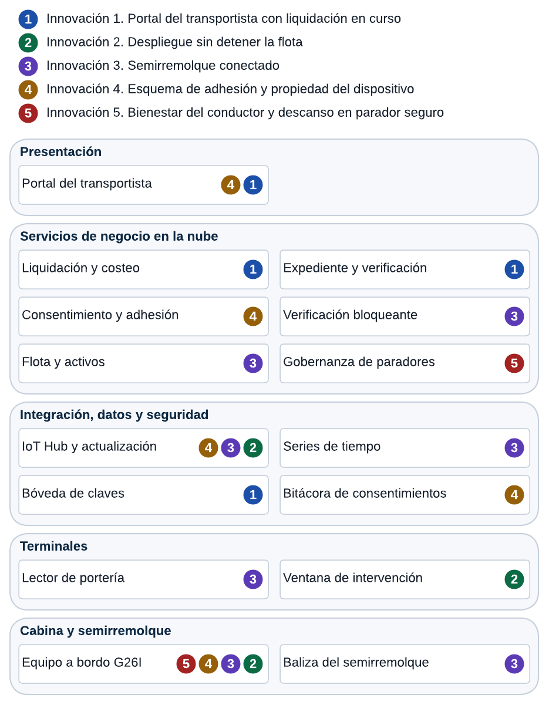

# Subdocumento 13. Innovaciones

audIT, Empresa N.º 10. Licitación TFEP-01/2026, Caso 10 Transporte de Carga. Oferta Técnica, Sobre N.º 2. Informe Preparatorio 2. Archivo AUDIT-Subdocumento13.pdf. Anexos: Formulario T-19 en el archivo AUDIT-Formulario-T-19.pdf.

## Resolución de observaciones del Informe 1

El FEP01, Artículo 46, p. 28 pide resolver en cada informe las observaciones de la instancia anterior, con trazabilidad entre observación, respuesta y sección modificada. La tabla reúne las observaciones del Informe 1 que corresponden a este documento y la sección donde se resuelve cada una.

**Resolución de las observaciones del Informe 1, conforme a FEP01, Artículo 46, p. 28**

| N.º | Observación | Respuesta | Sección modificada |
|---|---|---|---|
| 88 | La innovación tipo 3 es el RT-03.10, el RT-03.13, los criterios 8 y 9 y la decisión 4, una funcionalidad exigida presentada como innovación, que el Artículo 30 excluye | Se acepta. La innovación 3 pasa a ser el semirremolque conectado, que ninguna exigencia de las bases pide. La operación sin cobertura queda como alcance base en la sección 4.2.2 del Subdocumento 4 | 13.3 |
| 89 | La innovación tipo 2 es el método que imponen las restricciones del Capítulo 6 y el numeral 13.3 | Se acepta. **[Información requerida por dupla 3: reformulación o reemplazo de la innovación 2]** | 13.2 |
| 90 | Las fichas T-19 con los siete elementos del Artículo 29 se difieren a la propuesta final, aunque el Informe 1 las incluye | Se acepta. Las cinco fichas van en el Formulario T-19, en archivo propio | Formulario T-19 |
| 91 | Los tipos 2 y 3 no traen madurez, impacto económico ni riesgo de adopción, el tipo 5 no trae riesgo y el tipo 1 solo declara inversión incremental | Se acepta. Cada sección se ordena por los siete elementos del Artículo 29, y la innovación 3 los declara completos. La innovación 1 declara su costo operacional, que es el certificado de firma del emisor y la operación del servicio de verificación, y su contingencia, que es emitir el expediente automáticamente cada mes. **[Información requerida por dupla 3: madurez, impacto y riesgo de la innovación 2]** | 13.1 a 13.5 y Formulario T-19 |
| 92 | En la tabla del tipo 3 las líneas base están inventadas y la meta está redactada al revés respecto del RT-03.13 | Se acepta. La nueva innovación 3 declara como línea base lo que el sistema actual no registra, sin cifras ajenas al Caso, y mide sus metas con datos de la propia solución | 13.3 |
| 93 | El tipo 5 usa cifras que nadie midió, la línea base NASA-TLX, el 22 % de adherencia, el 1,2 % de ahorro y el costo por evento | Se acepta. Se retiran las cuatro cifras. La carga NASA-TLX y la adherencia pasan a línea base medida en la Etapa 1, y el efecto en combustible se mide en la misma etapa | 13.5 |
| 94 | Las 280 horas de desarrollo declaradas son información de esfuerzo dentro de la Oferta Técnica, contra el Artículo 50.2 | Se acepta. Se retiran | 13.5 |
| 95 | El tipo 4 cuantifica un recupero anual en pesos | Se acepta. Se retiran los montos. El recupero se valoriza en la Oferta Económica y no se compromete como ingreso | 13.4 |
| 96 | El producto propio audIT EdgeHub se invoca sin definirlo en ningún subdocumento | Se acepta. audIT EdgeHub es el software de borde de audIT y se define en el Subdocumento 1. La innovación 5 lo nombra como el software del equipo a bordo que especifica la sección 4.2.2 del Subdocumento 4 | 13.5 |
| 97 | No hay trazabilidad con el flujo de caja para ninguna innovación, y la tipo 4 debía reflejarse en la estructura de costos | Se acepta. La innovación 3 se refleja como inversión en equipamiento en la Etapa 1 y como costo de reposición en la operación. La 1 aparece como una partida de desarrollo en la Etapa 1 y una de operación mensual, sin ingresos atribuidos. La 4 se refleja en la estructura de costos con el diseño y la validación jurídica del anexo, la campaña en los cinco terminales y la consola de consentimiento, y en la operación con la conectividad, el soporte y la reposición de los equipos en comodato. La 5 se registra como desarrollo de software de borde y talleres ergonómicos, y como servicio de actualización y soporte de la cartografía de paradores. **[Información requerida por dupla 3: partida de la innovación 2]** | 13.1 a 13.5 |
| 98 | Declarar investigación adicional requerida en cada ficha equivale a declarar que la innovación no está diseñada | Se aclara. Las bases ordenan que «si alguna requiere investigación adicional, debe declararse» (FEP01, Formulario T-22, p. 68), y audIT usó esa figura sin reemplazar el diseño. En este informe cada pendiente queda dentro del elemento del Artículo 29 al que pertenece | 13.1 a 13.5 |
| 99 | El punto 1.6 sobre estado de elaboración y responsables es organización interna, ininteligible para el mandante | Se acepta. Se eliminan la sección y los nombres | Subdocumento 13 completo |
| 100 | Cita al autor de las bases como fuente bibliográfica, tabla partida entre páginas y cero figuras | Se acepta. Las bases se citan por documento, numeral y página. El capítulo trae dos figuras citadas antes y explicadas después | Subdocumento 13 completo |

## 13 Introducción a las Innovaciones

Este capítulo presenta la cartera de cinco innovaciones que exige el FEP01, Artículo 28, p. 19, una por cada tipo
y en el orden que fija el Comunicado 10, sección 8. Cada una responde a un problema medido del Caso.
El FEP01, Artículo 30.2, p. 20 valora la pertinencia por sobre la novedad, y el Caso, capítulo 19, p. 44 pide
innovaciones pertinentes al transporte de carga y a los problemas de esta compañía, y no un catálogo de
tecnologías de moda. Ninguna de las cinco es una funcionalidad que las bases ya exigen, que es la
exclusión que declara el FEP01, Artículo 30, p. 20.

Las cinco comparten una estrategia: convierten en un dato medido algo que hoy se declara, se anota en
papel o se conoce tarde. La innovación 1, Expediente
verificable del transportista, responde a que el transportista no puede probar ante terceros lo que el
sistema ya sabe de él, y vive en el portal del transportista y en el servicio de verificación. La 2,
Despliegue sin detener la flota, parte de que la intervención a bordo solo ocurre cuando el camión pasa
por un terminal, y usa la actualización remota y los terminales. La 3, Semirremolque conectado, le dice
al sistema qué semirremolque va enganchado y cuánto recorre, desde el equipo a bordo, la portería y la
verificación bloqueante. La 4, Esquema de adhesión y propiedad del dispositivo, atiende a los dueños de
camión que no aceptan un equipo que delate cuándo trabajan para otros, con consentimiento y adhesión.
La 5, Bienestar del conductor y descanso en parador seguro, hace que la alerta de jornada llegue donde
sí hay dónde detenerse, desde el equipo a bordo y la gobernanza de paradores. Los cinco problemas salen
del Caso, numerales 2.3, 4.4, 4.11 y 16.1, pp. 7, 10, 12 y 35 y del (Caso, capítulo 10, p. 23).

Cuatro de las cinco usan el equipo a bordo que especifica el Formulario T-11, y dos usan el portal del
transportista. La Figura 13.1 ubica cada innovación en las capas de la arquitectura.

*Figura 13.1. Cartera de innovaciones sobre las capas de la arquitectura, con los componentes que usa cada una*

Fuente: Elaboración propia.

En la figura, el equipo a bordo concentra las innovaciones 2, 3, 4 y 5, y el portal del transportista
las innovaciones 1 y 4. Esa concentración permite montar el valor nuevo sobre componentes que la
arquitectura ya necesita, sin agregar dispositivos al tractocamión.

Cada sección declara los siete elementos del FEP01, Artículo 29, p. 19: el problema, la tecnología, la madurez, el
diseño de la incorporación con su lugar en la arquitectura (FEP02, RT-26.01, p. 44), sus paquetes de la
estructura de descomposición del trabajo y su mes del cronograma (FEP02, RT-26.02, p. 44), el impacto
económico, el indicador y el riesgo de adopción. Los montos no aparecen en esta oferta técnica, porque
el FEP01, Artículo 50.2, p. 29 lo prohíbe, y la valorización va en el Entregable 2 de la Oferta Económica, como
dispone el FEP01, Artículo 30.1, p. 20. Al menos una innovación es verificable en la marcha blanca, como valora
FEP02, RT-26.08, p. 45: la innovación 4 mide sus primeros anexos firmados desde el mes tres, y la 3 y
la 5 miden su indicador antes del mes 16.

El capítulo se apoya en el esquema de solución del Subdocumento 3, en la arquitectura del
Subdocumento 4, en el plan de trabajo del Subdocumento 7, que ubica los paquetes de cada innovación, y
en el plan de riesgos del Subdocumento 8. La innovación 1 usa además los registros de jornada, vigencias y
hoja de vida que produce la Etapa 1. La 4 es contractual antes que técnica, y de su resultado depende cuántos de los 34
camiones de terceros sin equipo llegan a intervenirse. Las fichas completas van en el Formulario T-19, que acompaña
este capítulo como archivo propio (`AUDIT-Formulario-T-19.pdf`), conforme al
Comunicado 10, sección 1.

## 13.1 Innovación 1 — Producto o servicio

La innovación 1 es de producto o servicio, según el FEP01, Artículo 28, p. 19. Su nombre es Expediente verificable
del transportista: un documento que el dueño del camión descarga del portal y presenta a cualquier
tercero, con la jornada acreditada de sus conductores, la vigencia de sus habilitaciones y la hoja de
vida de sus equipos, y que ese tercero puede verificar sin acceso al sistema del mandante.

**Problema u oportunidad.**  Los 148 transportistas subcontratados operan 226 camiones y emplean
258 conductores (Caso, numeral 14.1, p. 29), y muchos trabajan también para otros clientes
(Caso, numeral 4.3, p. 9). Cada uno de esos clientes, la autoridad y la aseguradora le piden lo mismo que
le pide Curimón: que acredite la jornada de sus conductores y la vigencia de sus documentos. Hoy no
puede, porque nadie lleva ese registro. Desde la Etapa 1, la solución de audIT produce exactamente esa
evidencia para los viajes que el transportista hace para Curimón, pero la evidencia queda dentro del
sistema del mandante. La oportunidad es devolvérsela a su titular en una forma que tenga valor fuera
de Curimón, y convertir así un dato que el transportista entrega en un activo que recibe. Esa es la
contraprestación que menos cuesta al mandante y que más pesa en la decisión de adherir.

**Tecnología que la sustenta.**  Documento electrónico firmado por el mandante con firma
electrónica avanzada (Congreso Nacional de Chile, 2002), que contiene sólo datos del propio transportista, y un
servicio público de verificación que recibe el código del documento y responde si es auténtico y si
sigue vigente, sin revelar su contenido. Como alternativa de formato se evalúa la credencial
verificable, que alcanzó el estado de recomendación en mayo de 2025 (World Wide Web Consortium, 2025). La jornada
de cada conductor sólo entra al expediente con el consentimiento de ese conductor, porque es un dato
personal que la Ley 21.719 protege (Ministerio de Hacienda, 2024).

**Delimitación frente a las bases.**  Los criterios 21 y 29 del Caso obligan a que el
transportista vea sus viajes y su liquidación en curso dentro del portal del mandante (Caso, capítulo
18, pp. 42 y 43). Eso es alcance base del Subdocumento 3 (requerimientos RF-020 y RF-022) y no se presenta
como innovación. Lo que agrega esta ficha es que la evidencia salga del portal con valor probatorio ante
un tercero que no tiene cuenta en él. Ninguna exigencia de las bases lo pide. Tampoco cae en la
exclusión del Capítulo 11 sobre administrar la contabilidad de los transportistas (Caso, capítulo
11, p. 24), porque no administra nada: entrega a su titular una evidencia ya producida.

**Nivel de madurez.**  Se califica con la escala de niveles de madurez tecnológica de uno a nueve
(International Organization for Standardization, 2013). La firma electrónica avanzada con verificación en línea está en nivel nueve, en
operación regulada en Chile desde 2002 (Congreso Nacional de Chile, 2002), y es el formato comprometido. La
credencial verificable se ubica entre siete y ocho por su adopción todavía acotada en el transporte
nacional, y sólo se adopta si los destinatarios reales la aceptan.

**Diseño de la incorporación.**  El servicio de emisión vive en el contexto Personas y
cumplimiento, que ya guarda la jornada con su nivel de evidencia, y consulta a Flota y activos por la
hoja de vida de los camiones. El servicio de verificación es el único componente público sin
autenticación, detrás de la misma puerta de enlace, y no expone datos. La firma la entrega la bóveda de
claves de la capa de seguridad. El portal del transportista agrega el botón de emisión y la gestión del
consentimiento de cada conductor. En la EDT es el paquete 12.1, que usa los paquetes 5.1 y 5.7. En el
mes 4 se entrevista a destinatarios reales (dos clientes de transportistas, una aseguradora y la
autoridad laboral) y se fija el formato. La construcción ocurre dentro de la Etapa 1, entre los meses 8
y 10, y el expediente está disponible para la cohorte inicial de adherentes en la marcha blanca.

**Impacto económico.**  La inversión es el desarrollo de dos servicios pequeños sobre datos que la
Etapa 1 ya produce, y el costo operacional es el certificado de firma del emisor y la operación del
servicio de verificación. El beneficio para el mandante es indirecto y está en la adhesión: el
expediente es un incentivo que no requiere pagar al transportista, y cada transportista adherido amplía
la jornada acreditada y la evidencia de espera que sostiene los cobros. En el flujo de caja de la Oferta
Económica, la innovación aparece como una partida de desarrollo en la Etapa 1 y una partida de
operación mensual, sin ingresos atribuidos.

**Indicador de verificación.**  La Tabla 13.1 fija los dos indicadores. Ambos parten
de cero porque el expediente no existe hoy.

**Tabla 13.1.** Indicadores de la innovación 1

| Indicador | Línea base | Meta | Medición |
|---|---|---|---|
| Transportistas adheridos que emitieron al menos un expediente | No existe | 50 % de los adheridos | Mes 21 |
| Verificaciones de expedientes respondidas en no más de 5 segundos | No existe | 99 % | Mensual desde el mes 16 |

*Fuente: elaboración propia. Datos del registro de emisiones y del servicio de verificación.*

Las dos metas se miden con datos que la propia solución registra. La primera mide si el transportista lo
valora, que es el riesgo de esta innovación, y la segunda si el tercero puede usarlo.

**Riesgo de adopción.**  Que el transportista no perciba utilidad y no lo emita, con probabilidad
media e impacto medio, mitigado con la primera emisión asistida en el terminal durante el enrolamiento.
Que los destinatarios no acepten el documento como prueba, con probabilidad media e impacto alto,
mitigado con las entrevistas del mes 4, antes de construir. Que un conductor no consienta incluir su
jornada, mitigado mostrando en el expediente la jornada de los conductores que sí consintieron. Si la
adopción es baja, la contingencia es emitir el expediente automáticamente cada mes a los
transportistas que lo pidan, sin acción de su parte.

## 13.2 Innovación 2 — Proceso

La innovación 2 es de proceso, según el FEP01, Artículo 28, p. 19. Su nombre es Despliegue sin detener la flota.

**[Información requerida por dupla 3: reformular o reemplazar esta innovación, porque la observación 89 la considera el
método que imponen las restricciones del capítulo 10 y el numeral 13.3 del Caso. El plan del equipo la
reemplaza por un gemelo digital de la flota. Si se mantiene, alinear los equipos con el Formulario
T-11, que especifica lectores CAN sin contacto en los 182 equipos y no acopladores en 61 camiones]**

**Problema u oportunidad.**  Un camión detenido no produce (Caso, capítulo 10, restricción 10, p. 24),
la intervención física en cabina solo puede realizarse cuando la unidad ingresa a un terminal, y ese
paso ocurre en promedio cada seis días mientras que el 22 por ciento de la flota subcontratada ingresa
menos de una vez al mes (Caso, numeral 2.3, p. 7). La innovación transforma el despliegue de hardware: deja
de ser un proyecto de detención masiva que paraliza la operación comercial y pasa a ser un proceso
continuo, no intrusivo, que aprovecha las ventanas naturales de estadía en terminal mediante kits
modulares preconfigurados de sustitución rápida.

**Tecnología que la sustenta.**  Gestión centralizada y aprovisionamiento remoto del parque
telemático mediante Azure IoT Hub Device Update y Device Twins, configuración precargada en fábrica y
kits de reemplazo con arneses estandarizados de acople rápido por familia de tractocamión (Scania,
Volvo, Mercedes-Benz, Freightliner). Anticipación de llegada a terminal a partir de la posición de la
propia flota, de modo que el equipo técnico en terreno disponga del kit específico en el andén antes de
que el camión ingrese a patio.

**Delimitación frente a las bases.**  El alcance comprende el despliegue directo de los
dispositivos provistos por el mandante en las 148 unidades propias y en las 34 unidades sin equipo
cuyos dueños suscriban el convenio de comodato de la innovación 4. No interviene físicamente los 192
camiones de terceros que ya cuentan con dispositivos telemáticos preexistentes, los cuales se integran
de manera lógica mediante adaptadores de interoperabilidad sin alterar su hardware privado, respetando la restricción 3 (Caso, capítulo 10, p. 23). La
delimitación frente a las bases radica en que el Caso exige disponer de stock de reemplazo, pero no
resuelve el método operativo para instalar sin detener el flete comercial ni define la logística de
intervención en tránsito.

**Diseño de la incorporación.**  La intervención se ejecuta en los cinco terminales operativos
(San Bernardo, Antofagasta, Talca, Los Ángeles y Puerto Montt) durante las ventanas de relevo de
conductor o pausas de carga y descarga, con un procedimiento estandarizado cronometrado en 30 minutos o
menos por vehículo. Tras el montaje, el dispositivo ejecuta una rutina automatizada de autodiagnóstico
y enrolamiento (autenticación mutua por certificado, enlace celular, fijación GNSS y lectura de bus CAN) que valida la
correcta operación en la barrera de salida sin requerir instrumentación adicional en patio. En la EDT
es el paquete 12.2, que se ejecuta con los paquetes 4.1, firmware con operación de 72 horas y
actualización en terminal (meses 4 a 9), y 4.2, montaje camión por camión de los 182 equipos (meses 6 a
10 y 16 a 18). El levantamiento de las familias de conectores y la distribución de cabina de los
tractocamiones propios se consolida en el piloto cronometrado de los primeros 10 camiones, en el mes 6.

**Indicador de verificación.**  Cero horas de lucro cesante o inmovilización de flota
comercialmente activa atribuible a la instalación. Ritmo sostenido de intervención de 35 a 45
tractocamiones mensuales distribuidos en la red de terminales, alcanzando el 100 % de la flota propia
(148 unidades) al cierre del mes 8. Reducción del tiempo medio de sustitución en terreno a menos de
30 minutos por camión.

**[Información requerida por dupla 3: nivel de madurez con su escala y fuente, impacto económico y riesgo de adopción con
mitigación y contingencia (observación 91)]**

## 13.3 Innovación 3 — Tecnológica o de arquitectura

La innovación 3 es de tipo tecnológico o de arquitectura, según el FEP01, Artículo 28, p. 19. Su nombre es
Semirremolque conectado: una baliza Bluetooth en cada semirremolque propio permite que el sistema sepa
qué semirremolque va realmente enganchado, cuántos kilómetros recorre y en qué condición viaja la carga
refrigerada.

**Problema u oportunidad.**  La compañía tiene 210 semirremolques propios de cinco tipos: rampla
plana, furgón seco, furgón refrigerado, tolva y portacontenedores (Caso, numeral 2.2, p. 6). En tres años
llegan a 245 (Caso, numeral 14.1, p. 29). De ellos, 44 son equipos refrigerados que concentran su
actividad entre diciembre y abril (Caso, numeral 2.2, p. 6). La revisión técnica rige para los 210
semirremolques (Caso, capítulo 12, p. 25) y es una de las vigencias que la verificación bloqueante
comprueba antes de asignar un viaje (Caso, numeral 4.4, p. 10). Las bases piden esa comprobación, pero no
dicen cómo sabe el sistema qué semirremolque va enganchado, y con una declaración del despachador el
requisito se cumple. Si la declaración es errónea, la verificación aprueba la vigencia de un
semirremolque que no es el que sale.

El mantenimiento tiene el mismo vacío. El taller atiende 148 tractocamiones y 210 semirremolques con
un plan preventivo por kilometraje, y el kilometraje se lee del odómetro cuando el camión pasa por el
taller (Caso, capítulo 8, p. 19). Cuando un semirremolque cambia de tractocamión, el odómetro del camión
deja de reflejar su recorrido. El criterio 26 pide que el mantenimiento preventivo se gatille con
kilometraje real y no con una estimación (Caso, capítulo 18, p. 43).

**Tecnología que la sustenta.**  Balizas Bluetooth de baja energía Teltonika EYE Sensor BTSMP1,
con identificador, temperatura, humedad, acelerómetro y sensor magnético de puerta, protección IP67,
operación de −20 a +60 °C y batería de cinco años o más con una emisión cada 10 segundos
(Teltonika Telematics, 2026). La baliza se fija en el chasis delantero, a la sombra y sin cables. La lee
el iWave G26I, que ya trae Bluetooth 5.0 (iWave Global, 2026), y un lector Minew G1 en la portería de
cada terminal (Minew, 2023). El equipo a bordo infiere el acople cuando la señal de la baliza es
fuerte y estable y su acelerómetro se mueve junto con el camión, práctica que el fabricante describe
para el seguimiento de remolques (Teltonika Telematics, 2026). El lector de portería registra el
semirremolque que sale aunque lo tire un camión sin equipo audIT.

**Delimitación frente a las bases.**  El seguimiento de remolques con balizas ya se vende en el
mercado, así que la innovación no está en la baliza. Está en tres usos que cambian decisiones del caso.
La verificación bloqueante comprueba el semirremolque que efectivamente sale y no el declarado. El
kilometraje de cada semirremolque sale de su tiempo acoplado sobre la traza del tractocamión, lo que
extiende a los semirremolques el kilometraje real que el criterio 26 pide y que la solución base mide
solo en el camión. Y los 44 equipos refrigerados registran temperatura y apertura de puerta durante el
viaje. Ninguno de los catorce asuntos que la arquitectura debe resolver (Caso, numeral 17.4, p. 39) ni
ninguna de las decisiones pendientes (Caso, numeral 16.1, p. 34) pide identificar el semirremolque
acoplado ni medir la condición de la carga, de modo que la innovación no cae en la exclusión del
FEP01, Artículo 30, p. 20.

**Nivel de madurez.**  Escala de niveles de madurez tecnológica de uno a nueve
(International Organization for Standardization, 2013). Las balizas y su lectura por Bluetooth están en nivel 9, porque son productos
comerciales en operación (Teltonika Telematics, 2026; Minew, 2023). La inferencia del acople y su uso dentro
de la verificación bloqueante parten en nivel 6 y llegan a nivel 7 cuando se demuestran en la operación
durante la marcha blanca, como pide FEP02, RT-26.03, p. 44.

**Diseño de la incorporación.**  La Figura 13.2 muestra dónde se inserta la
innovación en la arquitectura.

*Figura 13.2. Semirremolque conectado: la baliza, sus dos lectores y los tres servicios de negocio que usan el acople*

Fuente: Elaboración propia.

La baliza vive en el semirremolque y no agrega nada al tractocamión. En la capa de borde, el G26I y el
lector de portería la leen por Bluetooth y envían el evento a IoT Hub, el primero por la red celular y
el segundo por la red del terminal. En la capa de integración, Event Hubs distribuye el evento a tres
servicios. El contexto Flota y activos usa el identificador del semirremolque acoplado en la
verificación bloqueante y suma sus kilómetros para el plan preventivo. El contexto Telemetría y
geocercas guarda la temperatura y la apertura de puerta en la base de series de tiempo. La innovación
consume el flujo de telemetría de IoT Hub y expone a la verificación bloqueante el identificador del
semirremolque acoplado, sin interfaces nuevas hacia terceros (secciones 4.1 y 4.2). El Formulario T-11
declara el equipo: 210 balizas más 21 de reposición, 35 más por el crecimiento a 245 semirremolques y
cinco lectores de portería.

En la EDT es el paquete 12.3. Las balizas y los lectores de portería se instalan con el paquete 4.2,
cuando cada semirremolque pasa por un terminal y en los mismos meses del montaje a bordo, 6 a 10 y 16
a 18. Así ninguna instalación cae en la temporada de diciembre a abril, en que la operación no admite
intervenciones (Caso, numeral 13.2, p. 27), y los 44 refrigerados se intervienen fuera de su temporada. El
paquete 5.2, Flota y activos, integra la baliza a la ficha del semirremolque. La verificación con el
semirremolque medido se activa en la marcha blanca, y su primera medición ocurre antes del mes 16.

**Impacto económico.**  La inversión es el equipamiento que compra el mandante, conforme al
Caso, capítulo 11, p. 24: las balizas y los lectores de portería del Formulario T-11, más la
integración en los tres servicios de negocio. En costo operacional agrega la reposición de balizas al
término de su batería y un tráfico celular menor, porque el evento de acople viaja en los mensajes que
el G26I ya envía. El beneficio tiene tres partes: impedir la salida de un semirremolque con la
revisión técnica vencida, programar la mantención de los semirremolques con kilometraje medido en lugar
de estimado, y respaldar ante el cliente la condición de la carga refrigerada. El flujo de caja de la
Oferta Económica refleja la innovación como inversión en equipamiento en la Etapa 1 y como costo de
reposición durante la operación.

**Indicador de verificación.**  La Tabla 13.2 fija los indicadores. La primera línea
base sale del Caso, y las otras dos se miden en la Etapa 1 porque el Caso no las entrega.

**Tabla 13.2.** Indicadores de la innovación 3

| Indicador | Línea base | Meta | Momento de medición |
|---|---|---|---|
| Asignaciones con semirremolque propio verificado por medición | No se verifica al asignar | 95 % o más | Marcha blanca, antes del mes 16 |
| Semirremolques propios con kilometraje medido | Línea base a medir en la Etapa 1 | 100 % de los que tienen baliza | Tercer mes de operación |
| Viajes refrigerados con registro continuo de temperatura | Línea base a medir en la Etapa 1 | 100 % | Primera temporada de diciembre a abril |

*Fuente: elaboración propia sobre el Caso, numerales 2.2 y 4.4, pp. 6 y 10, y capítulo 18, p. 43.*

La primera meta no llega al 100 % porque un semirremolque propio tirado por un camión sin equipo
audIT solo se lee en la portería. Los tres indicadores se miden con datos que la propia solución
produce, de modo que su verificación no depende de terceros.

**Riesgo de adopción.**  Cada riesgo se declara con su probabilidad, su impacto, la mitigación y
la contingencia, como pide FEP02, RT-26.04, p. 44. El mayor es el acople falso con la baliza de un
semirremolque vecino en el patio, de probabilidad media e impacto alto, porque afecta a la verificación
bloqueante. Se mitiga exigiendo señal estable y movimiento conjunto en los primeros minutos de marcha.
Si aun así falla, la verificación vuelve a la declaración con la lectura de portería como control, sin
detener la operación. La suplantación del identificador de la baliza tiene probabilidad baja e impacto
alto: el acople ya exige movimiento conjunto y la lectura de portería, y en contingencia se trata como
dato complementario y no como única prueba. La temperatura bajo −20 °C en el paso cordillerano tiene
probabilidad baja e impacto medio. Se mitiga montando la baliza a la sombra del chasis y probándola en
el invierno de 2027, que coincide con el inicio del montaje en los meses 6 y 7. Si no resiste, los
semirremolques que cruzan llevan un modelo de mayor rango térmico. Una batería que dure menos de lo
declarado tiene probabilidad e impacto bajos: la baliza emite cada 10 segundos e informa su nivel, y se
repone desde la reserva del 10 % del Formulario T-11 (Teltonika Telematics, 2026).

**[Información requerida por dupla 3: incluir la baliza como entrada en el modelado de amenazas de la sección 4.1
(RT-26.07)]**

## 13.4 Innovación 4 — Modelo de negocio o de contratación

La innovación 4 es de modelo de negocio o de contratación, según el FEP01, Artículo 28, p. 19. Su nombre es
Esquema de adhesión y propiedad del dispositivo, y responde a lo que el Caso, capítulo 19, p. 44 pide
para este tipo: hacerse cargo de la relación con los transportistas subcontratados.

**Problema u oportunidad.**  Las dos primeras preguntas que hace un dueño de camión son de quién
es el equipo, quién lo paga y qué pasa con él si deja de trabajar con la compañía, y si el aparato va a
delatar cuándo trabaja para la competencia. Son 148 dueños de 226 camiones (Caso, numeral 14.1, p. 29) que
no dependen de la compañía, y sin su acuerdo nada de lo que dependa de ellos se despliega
(Caso, capítulo 10, restricción 2, p. 23). La innovación separa la propiedad del equipo de la propiedad del
dato, le entrega la segunda al dueño del camión y financia el incentivo con un ingreso que hoy se pierde.

**Tecnología que la sustenta.**  Ventana de transmisión aplicada en el firmware del equipo a bordo
y no en la configuración del servidor: el equipo sólo emite posición mientras existe un viaje asignado
por Curimón, y fuera de ella no transmite. El dueño del camión puede auditar esa regla desde su consola
de permisos, que le muestra cada acceso a la localización de sus camiones. Comodato del equipo con
retiro sin costo. Y reparto con el transportista de la espera recuperada que su propia evidencia permite
cobrar.

**Delimitación frente a las bases.**  El plan de adhesión es alcance base: el criterio 27 del Caso
lo exige y el Subdocumento 3 lo desarrolla (sección ?). Tampoco es innovación quién
compra el equipo, porque el Capítulo 11 lo resuelve (Caso, capítulo 11, p. 24). Lo que el Caso deja abierto
es la decisión 5 del Caso, numeral 16.1, p. 34, sobre el equipo en un camión ajeno, y la restricción 2, que
obliga a conseguir por contrato, incentivo o diseño lo que dependa de terceros. Esta innovación es el
mecanismo que hace viable el plan, y agrega tres cosas que las bases no piden: la ventana de transmisión
gobernada en el firmware, que convierte una promesa de privacidad en una propiedad verificable por el
dueño, el comodato con retiro sin costo, y el financiamiento del incentivo con el recupero de la espera,
de modo que la adhesión no compita con el margen operacional del 9 % (Caso, numeral 2.3, p. 7).

**Nivel de madurez.**  Los componentes técnicos se califican con la escala de niveles de madurez
tecnológica (International Organization for Standardization, 2013). El control de transmisión por ventana está en nivel ocho, porque la
gestión remota de configuración de equipos conectados es tecnología productiva y lo propio es la regla
que la gobierna. El registro de consentimiento granular y revocable está en nivel ocho y su exigencia es
legal (Ministerio de Hacienda, 2024). El componente contractual no se califica en esa escala. El comodato de
equipamiento es una figura de uso corriente, y el reparto del recupero sobre evidencia aportada por el
proveedor tiene poco precedente documentado en el transporte nacional.

**Diseño de la incorporación.**  La ventana se aplica en el equipo a bordo y en su búfer local, que
fuera de ella no guarda posición. La plataforma envía a cada equipo la ventana desde la asignación del
viaje. El contexto Personas y cumplimiento registra el consentimiento y su revocación, el contexto Flota
y activos registra la adhesión de cada camión y su modalidad, y Liquidación y costeo calcula la parte
de la espera recuperada que corresponde a cada transportista según la regla RN-08 del Formulario T-12.
En la EDT es el paquete 12.4, que usa los paquetes 9.1 y 9.2 de la adhesión, 4.1 del firmware y 5.7 del
portal. El anexo se valida jurídicamente en los meses 2 y 3, la cohorte inicial firma entre los meses 6
y 9, la ventana y la consola se construyen en la Etapa 1 entre los meses 6 y 10, y el resultado se mide
en la marcha blanca. La proporción de la espera recuperada que va al transportista se fija en el anexo y
la aprueba el Comité Ejecutivo en el mes 2, antes de la primera conversación con los transportistas.

**Impacto económico.**  El equipo lo compra el mandante, y audIT especifica la cantidad sobre las
poblaciones del Caso y no sobre la adhesión (sección ?). Las partidas propias son
el diseño y la validación jurídica del anexo, la campaña en los cinco terminales y la consola de
consentimiento, todas valorizadas en la Oferta Económica. En el costo operacional aumentan la
conectividad, el soporte y la reposición de los equipos en comodato, y disminuye el costo de gestionar
las objeciones de cobro. El recupero parte de una base del Caso: los clientes objetaron el 71 % de lo
facturado en 2025 por tiempos de espera, porque la hora de llegada se anota en papel (Caso, numeral
4.7, p. 11). Ese recupero financia el incentivo, se valoriza en la Oferta Económica y no se compromete
como ingreso.

**Indicador de verificación.**  La Tabla 13.3 fija los indicadores. El primero mide la
propiedad que el dueño del camión necesita creer, y los otros dos si el mecanismo funciona.

**Tabla 13.3.** Indicadores de la innovación 4

| Indicador | Línea base | Meta | Medición |
|---|---|---|---|
| Posiciones transmitidas fuera de la ventana de un viaje asignado | No existe | Cero | Auditoría mensual desde el mes 13 |
| Transportistas adheridos que reciben parte de la espera recuperada | No existe | 100 % con cobro respaldado | Cada liquidación desde el mes 16 |
| Consentimientos revocados sobre los otorgados | No existe | Menos de 10 % | Mensual desde el mes 13 |

*Fuente: elaboración propia. Datos del registro de transmisiones, de la liquidación y del registro de consentimientos.*

Las tres metas se miden desde la marcha blanca con datos de la propia solución. La adhesión de 104
transportistas en el mes 16 y 134 en el mes 21 es el resultado que esta innovación sostiene, pero su
meta pertenece al criterio 27 del alcance base y se mide allí.

**Riesgo de adopción.**  Que la adhesión no alcance el 70 % en la Etapa 1, con probabilidad media e
impacto alto, mitigado empezando la conversación en el mes 2 y mostrando el beneficio antes de pedir el
equipo. La contingencia son las tres medidas del Subdocumento 3 si en el mes 9 la adhesión no llega al
40 %. Que el transportista desconfíe de la ventana, mitigado haciéndola auditable por él mismo. Que los
clientes no acepten la evidencia telemática para el cobro y desaparezca la fuente del incentivo, con la
contingencia de financiarlo con el ahorro de la liquidación automática, que no depende del cliente. Y
que el anexo no resista revisión jurídica, con probabilidad baja e impacto alto, mitigado validándolo
antes de construir.

## 13.5 Innovación 5 — Experiencia de usuario, sostenibilidad o impacto social

La innovación 5 es de experiencia de usuario, sostenibilidad o impacto social, según el FEP01, Artículo 28, p. 19.
Su nombre es Bienestar del conductor y descanso en parador seguro.

**Problema u oportunidad.**  Una alerta que avisa al conductor cuando su cuota de cinco horas
continuas está por agotarse (Ministerio del Trabajo, 2003), entregada en medio de una cuesta sin
bermas o en un tramo desértico sin paraderos habilitados para combinaciones de 18,6 metros y 45
toneladas, no soluciona nada: lo fuerza a detenerse en bermas peligrosas o a seguir rodando en
infracción. La innovación abandona el temporizador pasivo e implementa un sistema sociotécnico de
acompañamiento predictivo del descanso, que cruza la cinemática del camión con la curva biológica de
alerta circadiana y un catálogo georreferenciado y calificado de paradores de carga pesada.

**Tecnología que la sustenta.**  Motor predictivo que corre sobre audIT EdgeHub, el software
de borde de audIT que define el Subdocumento 1 (sección ?), instalado en el equipo a bordo de la sección 4.2.2 (Caso, RT-06.01, p. 32). Evalúa en tiempo real el tiempo de conducción acumulado, la
topografía del tramo siguiente y la ventana de mínima alerta circadiana (*Window of Circadian
Low*, de 02:00 a 06:00 h). Catálogo georreferenciado local en SQLite, en modo de registro anticipado de escritura, sobre la
memoria flash industrial de 8 GB del equipo, especificada para las condiciones reales de uso que pide
FEP02, RT-08.11, p. 19. El catálogo califica
capacidad geométrica de estacionamiento, servicios de higiene, duchas, agua potable y seguridad
perimetral. Enclavamiento cinético estricto de pantalla ante cualquier movimiento del vehículo, con
velocidad sobre 0 km/h o freno de mano liberado, conforme a la Ley N.º 21.377 (Congreso Nacional de Chile, 2021).
Las sugerencias llegan por síntesis de voz local en español por el altavoz del vehículo, que es el
canal de la alerta de jornada (Caso, RT-16.21, p. 33), sin exigir desviar la mirada ni admitir
interacción táctil en marcha (Caso, RT-13.08, p. 33). En modo detenido, interfaz ergonómica para guantes gruesos, con botones
de 60 × 60 mm o más e iluminación ámbar de alto contraste.

**Delimitación frente a las bases.**  El cálculo reactivo de distancia al lugar seguro de
detención (Caso, RT-09.01, p. 32), la autenticación sin manipulación (Caso, RT-12.11, p. 32), la interfaz
para guantes sin interacción en marcha (Caso, RT-13.08, p. 33) y la resiliencia desconectada de 72 horas
(Caso, RT-17.01, p. 33) constituyen el alcance base comprometido y no se presentan como
innovación. Lo que agrega esta ficha son tres elementos. La anticipación predictiva circadiana, que
sugiere pausas preventivas antes de que el conductor ingrese a tramos críticos sin infraestructura o
enfrente el valle biológico de microsueño de madrugada. En esa franja, a las 04:40, ocurrió el
accidente del 14 de febrero de 2026, con un conductor que no había completado su descanso
(Caso, capítulo 1, p. 4). La ontología, gobernanza y sincronización por actualización remota en terminales de un catálogo calificado para
camiones de 45 toneladas con servicios dignos de descanso. Y un modelo social y ergonómico no punitivo
para los 258 conductores externos subcontratados (Caso, numeral 2.3, p. 6), conforme a las restricciones 1
y 2 (Caso, capítulo 10, p. 23) y a la Ley N.º 20.123 (Ministerio del Trabajo, 2006), que transforma una herramienta de control patronal en
un asistente de seguridad y bienestar.

**Nivel de madurez.**  Escala de madurez tecnológica de uno a nueve (International Organization for Standardization, 2013). El
hardware telemático de borde, el almacenamiento local, la síntesis de voz local y el enclavamiento
cinético están en nivel ocho, con componentes comerciales de uso maduro en flotas pesadas. El modelo
predictivo circadiano y la ontología de paradores adaptada a la red vial chilena se sitúan en nivel
seis (TRL 6, validación en entorno de simulación y laboratorio con series temporales históricas de ruta), comprometiendo
su escalamiento a nivel siete (TRL 7) mediante la prueba piloto operacional con conductores reales durante la marcha blanca del mes 16,
apoyados en estándares de ergonomía vehicular (International Organization for Standardization, 2017; International Organization for Standardization, 2019), en investigación sobre fatiga en
el transporte de carga (National Academies of Sciences, Engineering, and Medicine, 2016) y en la normativa vial y laboral nacional
(Congreso Nacional de Chile, 2021; Ministerio del Trabajo, 2003).

**Diseño de la incorporación.**  Se articula en la capa de borde (motor predictivo a bordo,
catálogo local y síntesis de voz), en la capa de servicios (servicio de gobernanza de paradores y
seguridad vial en la torre de control) y en la de presentación (portal para consulta pasiva). En la
EDT es el paquete 12.5, que se ejecuta con los paquetes 4.1, firmware a bordo (meses 4 a 9), y 5.1,
contexto Personas y cumplimiento (meses 6 a 10). La validación con conductores reales ocurre en la
marcha blanca de los meses 13 a 15. El beneficio es verificable antes
del mes 16, como valora FEP02, RT-26.08, p. 45. La validación de los paradores y sus atributos se
consolida durante la campaña de cobertura de la Etapa 1, y la calibración de la ventana circadiana con
los turnos reales se ajusta en los talleres de diseño ergonómico del mes cuatro.

**Impacto económico.**  La inversión requerida es incremental sobre el software de borde y los
talleres ergonómicos participativos, mientras que el levantamiento del catálogo se absorbe dentro del
recorrido de la campaña de medición de cobertura que exige el Caso, RT-03.24, p. 31, sin costo
logístico adicional. En costo operacional
reduce la búsqueda errática de estacionamiento en ruta, con un efecto en combustible que se mide en la
Etapa 1. El beneficio central radica en la mitigación del riesgo de siniestros graves por microsueño y
en la supresión de multas por la Ley N.º 21.377 y el artículo 25 bis.

En el flujo de caja de la Oferta Económica, la innovación se registra en la partida CAPEX de desarrollo de software de borde y talleres ergonómicos, y en OPEX bajo la línea de servicios de actualización y soporte de cartografía segura.

**Indicador de verificación.**  Línea base cero de alertas con parador calificado garantizado,
con meta de 98 % o más de efectividad en ruta nacional, medida mensualmente en la marcha blanca. Cero
eventos de interacción táctil con el vehículo en movimiento, sobre 0 km/h, con meta de 100 % de
bloqueo cinético.
Carga cognitiva NASA-TLX con guantes bajo 35 puntos, con línea base que se mide en los talleres de la
Etapa 1. Y adherencia voluntaria a paradas seguras de los conductores externos de 85 % o más, con
línea base que se mide en la misma etapa.

**Riesgo de adopción.**  Que los 258 conductores externos perciban el sistema como vigilancia
patronal encubierta, con probabilidad media a alta e impacto alto. Se mitiga mediante diseño
ergonómico participativo en horario de relevo en los cinco terminales y orientando la herramienta al
bienestar, con recomendación de sitios con duchas, seguridad y convenios comerciales. La contingencia
es que la unidad a bordo conmute a notificación puramente acústica por el altavoz del vehículo, sin
requerir teléfonos personales ni botones adicionales en cabina, manteniendo la seguridad activa sin
fricción sindical.

## Referencias

Congreso Nacional de Chile. (2002). *Ley N.º 19.799 sobre documentos electrónicos, firma electrónica y servicios de certificación de dicha firma*. Biblioteca del Congreso Nacional de Chile. https://www.bcn.cl/leychile/navegar?idNorma=196640

Congreso Nacional de Chile. (2021). *Ley N.º 21.377 que modifica la Ley de Tránsito para sancionar la conducción manipulando dispositivos de telefonía móvil u otro artefacto electrónico*. Biblioteca del Congreso Nacional de Chile. https://www.bcn.cl/leychile/navegar?idNorma=1166014

International Organization for Standardization. (2013). *ISO 16290:2013. Space systems. Definition of the Technology Readiness Levels (TRLs) and their criteria of assessment*. https://www.iso.org/standard/56064.html

International Organization for Standardization. (2017). *ISO 15005:2017. Road vehicles. Ergonomic aspects of transport information and control systems. Dialogue management principles and compliance procedures*.

International Organization for Standardization. (2019). *ISO 9241-210:2019. Ergonomics of human-system interaction. Part 210: Human-centred design for interactive systems*.

iWave Global. (2026). *Rugged telematics device G26I*. https://iwave-global.com/product/rugged-telematics-device/

Minew. (2023). *G1 IoT Bluetooth gateway*. https://www.minew.com/wp-content/uploads/2023/12/G1-IoT-Bluetooth%C2%AE-Gateway.pdf

Ministerio de Hacienda. (2024). *Ley N.º 21.719 sobre protección y tratamiento de datos personales*.

Ministerio del Trabajo. (2003). *Decreto con Fuerza de Ley N.º 1. Texto refundido, coordinado y sistematizado del Código del Trabajo. Artículo 25 bis sobre jornada de choferes de vehículos de carga terrestre interurbana*. Biblioteca del Congreso Nacional de Chile. https://www.bcn.cl/leychile/navegar?idNorma=207436

Ministerio del Trabajo. (2006). *Ley N.º 20.123 que regula el trabajo en régimen de subcontratación*.

National Academies of Sciences, E. y Medicine. (2016). *Commercial Motor Vehicle Driver Fatigue, Long-Term Health, and Highway Safety: Research Needs*. The National Academies Press.

Teltonika Telematics. (2026). *EYE Sensor BTSMP1*. https://wiki.teltonika-gps.com/view/EYE_SENSOR_/_BTSMP1

Teltonika Telematics. (2026). *Trailer tracking with Bluetooth ID beacons*. https://www.teltonika-gps.com/use-cases/logistics/trailers-tracking-with-ble-id-beacons

Transportes Curimón S.A. (2026). *Bases administrativas para la preparación de la propuesta: Licitación Pública Internacional N.º TFEP-01/2026* (Documento FEP01).

Transportes Curimón S.A. (2026). *Bases técnicas del Caso 10, Transporte de Carga: Licitación Pública Internacional N.º TFEP-01/2026* (Documento FEP03).

Transportes Curimón S.A. (2026). *Bases técnicas transversales para la preparación de la propuesta: Licitación Pública Internacional N.º TFEP-01/2026* (Documento FEP02).

Transportes Curimón S.A. (2026). *Comunicado 10: Estructura obligatoria de las propuestas preparatorias y técnica final* (Comunicado de la licitación TFEP-01/2026).

World Wide Web Consortium. (2025). *Verifiable Credentials Data Model v2.0. W3C Recommendation*. https://www.w3.org/TR/vc-data-model-2.0/

## Declaración de uso de IA

Conforme al Comunicado 10, sección 7.2, cada sección de este subdocumento y cada formulario asociado declara la herramienta de inteligencia artificial generativa usada, su finalidad, el nivel de uso en texto y en diagramas según la escala oficial de esa sección, y quién revisó y qué verificó. Esta declaración se consolida en el Formulario A-6.

| Sección | Herramienta | Finalidad del uso | Nivel en texto | Nivel en diagramas | Revisión humana (quién y qué verificó) |
|---|---|---|---|---|---|
| Artículo 46 | Claude Opus 5.5 en Claude Code | Redacción de las respuestas 88 a 100 y ubicación de la sección que resuelve cada una | Alto | Ninguno | **[Información requerida por dupla 4: nombre, cargo y qué verificó]** |
| Introducción | Claude Opus 5.5 en Claude Code | Redacción inicial de la estrategia y la tabla de la cartera. Sugerencias de disposición sobre el diagrama de la cartera que elaboró el equipo | Alto | Bajo | **[Información requerida por dupla 4: nombre, cargo y qué verificó]** |
| 13.1, 13.2, 13.4 y 13.5 | Claude Opus 5.5 en Claude Code | Traslado del texto del Informe 1 ordenado por los siete elementos del Artículo 29, retiro de lo sancionado en las observaciones 93 a 100 y verificación de las citas al Caso | Medio | Ninguno | **[Información requerida por dupla 4: nombre, cargo y qué verificó]** |
| 13.3 | Claude Opus 5.5 en Claude Code | Búsqueda de fichas de fabricante, redacción inicial desde la decisión D4-55 y sugerencias de disposición sobre el diagrama que elaboró el equipo | Alto | Bajo | **[Información requerida por dupla 4: nombre, cargo y qué verificó]** |
| Formulario T-19 | Claude Opus 5.5 en Claude Code | Armado de las cinco fichas desde las secciones 13.1 a 13.5 | Alto | Ninguno | **[Información requerida por dupla 4: nombre, cargo y qué verificó]** |
