# Formulario T-13: Matriz de Calidad del Producto y Quality Gates
**Licitación Pública TFEP-01/2026 — Solución Integral de Transporte de Carga Terrestre**  
**Cliente:** Transportes Curimón S.A.  
**Proponente:** audIT Soluciones Tecnológicas SpA  
**Documento Asociado:** Subdocumento 9 (`subdocumento_09_calidad_adaptado.md`)  
**Dupla Responsable:** D1 (QA, Gobernanza y Aseguramiento Normativo)  
**Control Documental:** Borrador de trabajo · sujeto a revisión técnica y validación normativa

---

## 1. Marco de Gobernanza del Formulario T-13 y Vinculación Normativa

Este borrador del Formulario Técnico T-13 organiza criterios propuestos de calidad de producto, software, firmware y telemetría. Su correspondencia con el Artículo 40.4, las bases técnicas y el Comunicado 10 debe confirmarse antes de emitirlo como documento formal. El contenido no certifica resultados de pruebas ya ejecutadas. Incluye:
1. La **Matriz Exhaustiva de Métricas de Calidad de Software, Firmware y Telemetría**, basada en el modelo internacional **ISO/IEC 25010:2023** (*Product Quality Model*).
2. La especificación técnica y de ingeniería de las **Compuertas de Calidad Bloqueantes (*Quality Gates*, QG1 a QG6)** que gobiernan el flujo de integración y entrega continua (CI/CD) entre los entornos de Desarrollo, QA, Staging, Producción y Recuperación ante Desastres (DR).
3. Los **Quality Gates de Hardware Telemático Vehicular (Grado Automotriz)**, aplicables a los dispositivos electrónicos embarcados a bordo de los 374 tractocamiones del parque vehicular de Transportes Curimón S.A.
4. La **Matriz de Políticas de Severidad de Defectos y Tiempos Máximos de Resolución (SLA Defectos)** que regirá durante las etapas de implantación, marchas blancas y operación continuada a 36 meses.

### Tratamiento de información económica
Este borrador expresa criterios mediante unidades técnicas. La revisión final debe comprobar que cumple las restricciones económicas de las bases y evitar referencias a unidades que puedan interpretarse como costos de personal.

---

## 2. Matriz Exhaustiva de Métricas de Calidad de Software y Firmware (ISO/IEC 25010:2023)

audIT SpA adopta la taxonomía completa de la norma **ISO/IEC 25010:2023**, adaptando sus nueve características y respectivas subcaracterísticas a la operación ciber-física y de telemetría distribuida de Transportes Curimón S.A. Cada métrica cuenta con una definición matemática inequívoca, una herramienta de medición automatizada en pipeline y un umbral de cumplimiento con calificación de criticidad.

### Tabla T13.1 — Matriz Exhaustiva de Métricas de Calidad del Producto (ISO/IEC 25010:2023)
*Fuente: Elaboración propia conforme a ISO/IEC 25010:2023 y estándares de ingeniería de audIT SpA.*

| Característica y Subcaracterística | Métrica y Formulación Matemática | Herramienta de Medición | Umbral Aprobatorio | Criticidad / Efecto |
| :--- | :--- | :--- | :--- | :--- |
| **1. Adecuación Funcional** • Completitud funcional | $\text{CF} = \frac{\text{RF implementados y verificados}}{\text{Total RF contractualmente exigidos (42)}} \times 100$ | Matriz V&V / GitLab CI | $\text{CF} = 100\%$ | **Bloqueante (P1)** Cero omisiones |
| **1. Adecuación Funcional** • Corrección funcional | $\text{CorF} = \frac{\text{Casos de prueba aprobados}}{\text{Total casos de prueba ejecutados}} \times 100$ | GitLab CI Test Suite | $\text{CorF} = 100\%$ en críticos | **Bloqueante (P1)** 0 fallos en core |
| **1. Adecuación Funcional** • Pertinencia funcional | $\text{PF} = \frac{\text{Funciones con valor operacional validado}}{\text{Total funciones provistas}} \times 100$ | Auditoría UAT / Actas | $\text{PF} = 100\%$ | **Mayor (P3)** Validado por usuario |
| **2. Eficiencia Desempeño** • Tiempo de respuesta | Latencia $P_{95}$ validación bloqueante pre-despacho (4 factores síncronos) | OpenTelemetry / K6 | $P_{95} \le 30{,}0\text{ s}$ | **Bloqueante (P1)** Fail-safe activo |
| **2. Eficiencia Desempeño** • Tiempo de alerta crítica | Latencia $P_{99}$ recepción evento botón de pánico / SOS en Torre 24x7 | Azure Event Hubs Monitor | $P_{99} \le 15{,}0\text{ s}$ | **Bloqueante (P1)** Seguridad en ruta |
| **2. Eficiencia Desempeño** • Generación D.E.T. cabina | Tiempo emisión D.E.T. pre-firmado en cabina bajo sombra celular | Cronómetro audIT EdgeHub | $P_{99} \le 90{,}0\text{ s}$ | **Bloqueante (P2)** Cero detención |
| **2. Eficiencia Desempeño** • Ingestión masiva eventos | Rendimiento de ingesta en ráfaga post-reconexión cordillerana | Apache Kafka Metrics | $\ge 2.500\text{ eventos/s}$ | **Crítico (P2)** Absorbe 1,8M ev. |
| **2. Eficiencia Desempeño** • Utilización de CPU edge | Consumo medio de CPU en gateway telemático vehicular en marcha | Linux Embedded `top` / audit | $\text{CPU} \le 35\%$ continuo | **Mayor (P3)** Margen dinámico |
| **2. Eficiencia Desempeño** • Utilización memoria RAM | Consumo de memoria RAM en gateway telemático vehicular | Linux Embedded `free` / audit | $\le 180\text{ MB}$ de 512 MB | **Mayor (P3)** Previene OOM |
| **3. Compatibilidad** • Coexistencia legada | Tasa de transacciones exitosas en Capa Anticorrupción (TMS 2013) | Debezium / Kafka Connect | $\ge 99{,}9\%$ transaccional | **Bloqueante (P1)** Cero pérdida CDC |
| **3. Compatibilidad** • Interoperabilidad GPS | Tasa de ingesta normalizada desde APIs comerciales (Wialon/Wisetrack) | ACL API Gateway | $\ge 99{,}5\%$ paquetes OK | **Crítico (P2)** Vista única flota |
| **4. Capacidad Interacción** • Enclavamiento cinético | Bloqueo automático de UI táctil ante detección de velocidad $v > 0$ | audIT EdgeHub Sensor HAL | Latencia enclavamiento $< 200\text{ ms}$ | **Bloqueante (P1)** Ley No Chat 21.377 |
| **4. Capacidad Interacción** • Emisión audio pasivo | Tasa de éxito en sintetizador Text-to-Speech fuera de línea | Motor TTS audIT Edge | $\ge 99{,}9\%$ avisos emitidos | **Mayor (P3)** Alerta audible |
| **4. Capacidad Interacción** • Accesibilidad y error | Tasa de tareas completadas sin error en primer intento (portal web) | Telemetría UI / Hotjar | $\ge 92\%$ despachadores | **Menor (P4)** Ergonomía de uso |
| **5. Fiabilidad / Confiabilidad** • Disponibilidad E2E | $\text{SLA} = \frac{\text{Tiempo total} - \text{Indisponibilidad no programada}}{\text{Tiempo total mensual}} \times 100$ | Datadog Synthetic Monitoring | $\ge 99{,}9\%$ mensual (24/7) | **Bloqueante (P1)** Art. 20 FEP01, p. 14; RT-10.01 FEP02, p. 22 |
| **5. Fiabilidad / Confiabilidad** • Disponibilidad Cloud | Disponibilidad de clústeres AKS y bases de datos Azure HA | Azure Service Health | Objetivo interno propuesto: $\ge 99{,}95\%$ mensual, sujeto a validación de D4; no sustituye el SLA E2E | **Propuesto; validar** Arquitectura D4 |
| **5. Fiabilidad / Confiabilidad** • Resiliencia RTO | Tiempo máximo de recuperación tras desastre hacia Brazil South | Script de Failover DRP | $\text{RTO} \le 4{,}0\text{ horas}$ | **Bloqueante (P1)** RT-07.04 FEP02, p. 17 |
| **5. Fiabilidad / Confiabilidad** • Pérdida de datos RPO | Desfase de replicación continua de base de datos transaccional | Azure Replication Lag Monitor | $\text{RPO} \le 15{,}0\text{ minutos}$ | **Bloqueante (P1)** RT-07.04 Transv. |
| **5. Fiabilidad / Confiabilidad** • Autonomía buffer sombra | Capacidad de almacenamiento continuo sin red celular; dispositivo propuesto de 8 GB eMMC | Ensayo de desconexión y sincronización | Mínimo contractual: $\ge 72\text{ h}$; objetivo ampliado de 288 h sujeto a diseño y validación D4 | **72 h bloqueante (P1)** 288 h: objetivo propuesto, validar con D4 |
| **5. Fiabilidad / Confiabilidad** • Recuperación eléctrica | Tiempo de reapertura y consistencia atómica SQLite WAL post-corte | Test Suite Hardware | $< 10\text{ ms}$ post-energía | **Bloqueante (P1)** Cero corrupción |
| **6. Seguridad** • Vulnerabilidades código | Densidad de fallos en análisis estático de código fuente (SAST) | SonarQube Enterprise | 0 Críticas / 0 Altas | **Bloqueante (P1)** CVSS $\ge 7{,}0$ |
| **6. Seguridad** • Vulnerabilidades DAST | Hallazgos activos de penetración dinámica en endpoints web/API | OWASP ZAP Enterprise | 0 hallazgos abiertos | **Bloqueante (P1)** OWASP Top 10 |
| **6. Seguridad** • Dependencias de software | Vulnerabilidades conocidas en librerías externas y contenedores (SCA) | Trivy Vulnerability Scanner | 0 CVEs críticos/altos | **Bloqueante (P1)** SLSA Nivel 3 |
| **6. Seguridad** • Cifrado en tránsito | Protocolo criptográfico en canales telemáticos y portales web | SSL Labs / Qualys | TLS 1.3 estricto (Grade A+) | **Bloqueante (P1)** Ciphers seguros |
| **6. Seguridad** • Cifrado a nivel de campo | Cifrado AES-256-GCM para datos personales de choferes (Ley 21.719) | Azure Key Vault HSM | 100% campos sensibles | **Bloqueante (P1)** Cumplimiento ley |
| **6. Seguridad** • No repudio jornada | Sellado criptográfico de eventos de jornada con hash encadenado | SHA-256 / RFC 3161 Timestamp | 100% registros sellados | **Bloqueante (P1)** Art. 25 bis CT |
| **7. Mantenibilidad** • Cobertura unitaria | $\text{Cov} = \frac{\text{Líneas de código ejecutadas por tests}}{\text{Total líneas de código ejecutable}} \times 100$ | GitLab CI / Jest / Go Test | $\ge 80{,}0\%$ lógica negocio | **Bloqueante (P2)** MR bloqueado |
| **7. Mantenibilidad** • Complejidad ciclomática | Complejidad de McCabe $v(G) = E - N + 2P$ por función o método | SonarQube | $v(G) \le 15$ por función | **Mayor (P3)** Refactorización |
| **7. Mantenibilidad** • Duplicación de código | Porcentaje de bloques idénticos o duplicados en el repositorio | SonarQube | $< 3{,}0\%$ del código base | **Mayor (P3)** DRY estricto |
| **7. Mantenibilidad** • Ratio deuda técnica | $\text{TDR} = \frac{\text{Esfuerzo de remediación}}{\text{Esfuerzo de desarrollo base}} \times 100$ | SonarQube | $\text{TDR} < 5{,}0\%$ (Rating A) | **Mayor (P3)** Calidad A |
| **8. Flexibilidad** • Escalabilidad horizontal | Capacidad de escalamiento de pods de microservicios ante ráfagas | Kubernetes HPA Metrics | Escala de 2 a 12 pods en $<90\text{ s}$ | **Mayor (P3)** Elasticidad |
| **8. Flexibilidad** • Portabilidad OTA | Tasa de éxito en actualizaciones de firmware FOTA en partición A/B | audIT OTA Management | $\ge 99{,}8\%$ sin bricking | **Bloqueante (P1)** Rollback auto |
| **9. Seguridad Operacional** • Bloqueo SUSPEL | Bloqueo preventivo de despacho por incompatibilidad química o chófer | Motor Asignación / QR Scan | 100% bloqueos efectivos | **Bloqueante (P1)** D.S. 298 y 43 |
| **9. Seguridad Operacional** • Alerta dinámica fatiga | Anticipación de alerta de descanso calculada hacia área segura | audIT EdgeHub Geo-Routing | $\ge 45\text{ min}$ antes del límite | **Crítico (P2)** Seguridad vial |

---

## 3. Quality Gates de Software y Plataforma Cloud (QG1 a QG6)

La promoción de código y artefactos a lo largo del ciclo de vida se encuentra gobernada por seis compuertas de calidad automatizadas dentro de la tubería corporativa de **GitLab CI Enterprise**. A continuación se detalla la arquitectura de decisión y los criterios de rechazo automático para cada una de ellas:

```mermaid
graph TD
    subgraph Pipeline ["Tubería DevSecOps audIT SpA (GitLab CI Enterprise)"]
        Commit["Commit de Desarrollador / Merge Request"] --> QG1{"Quality Gate 1\n(Local / CI Linter)"}
        QG1 -->|Aprobado| Develop["Merge en Rama develop\n(Despliegue en Ambiente Dev)"]
        QG1 -->|Fallo| Reject1["Rechazo de MR\nNotificación a Desarrollador"]
        
        Develop --> QG2{"Quality Gate 2\n(SCA & IaC Lint)"}
        QG2 -->|Aprobado| QABuild["Build Contenedores OCI\n(Despliegue en Ambiente QA)"]
        QG2 -->|Fallo| Reject2["Pipeline Interrumpido\nAlerta de Seguridad"]
        
        QABuild --> QG3{"Quality Gate 3\n(Integración & API)"}
        QG3 -->|Aprobado| ReleaseCand["Generación Release Candidate\n(Despliegue en Staging)"]
        QG3 -->|Fallo| Reject3["Bloqueo de Release\nNotificación QA Lead"]
        
        ReleaseCand --> QG4{"Quality Gate 4\n(DAST & Estrés K6)"}
        QG4 -->|Aprobado| CCPIReview["Sesión Extraordinaria CCPI\nEvaluación Criterios Go/No-Go"]
        QG4 -->|Fallo| Reject4["Rollback Automático\nRemediación en Staging"]
        
        CCPIReview --> QG5{"Quality Gate 5\n(Certificación UAT)"}
        QG5 -->|Aprobado| ProdDeploy["Despliegue en Producción\n(Azure East US 2 - Rolling 0 Downtime)"]
        QG5 -->|Fallo| Reject5["Congelamiento de Release\nRevisión con Mandante"]
        
        ProdDeploy --> QG6{"Quality Gate 6\n(Replicación DR)"}
        QG6 -->|Aprobado| Certified["Versión Certificada en Producción\nOperación Estable 24/7/365"]
        QG6 -->|Fallo| AlertDR["Incidente P1 de Infraestructura\nConvocatoria Comité de Crisis"]
    end

    classDef passStyle fill:#1e293b,stroke:#3b82f6,stroke-width:2px,color:#fff;
    classDef gateStyle fill:#0f172a,stroke:#eab308,stroke-width:2px,color:#fff;
    classDef rejectStyle fill:#450a0a,stroke:#dc2626,stroke-width:1px,color:#fca5a5;
    classDef successStyle fill:#14532d,stroke:#22c55e,stroke-width:2px,color:#fff;
    class Commit,Develop,QABuild,ReleaseCand,ProdDeploy passStyle;
    class QG1,QG2,QG3,QG4,QG5,QG6 gateStyle;
    class Reject1,Reject2,Reject3,Reject4,Reject5,AlertDR rejectStyle;
    class Certified successStyle;
```

### 3.1 Especificación Detallada de Compuertas QG1 a QG6

#### Compuerta QG1: Calidad de Código Estático y Pruebas Unitarias
* **Disparador (*Trigger*):** Creación o actualización de un *Merge Request* hacia ramas `develop` o `release/*`.
* **Condiciones de Aceptación:**
  1. Cobertura de pruebas unitarias $\ge 80{,}0\%$ en el código modificado y $\ge 80{,}0\%$ global en lógica de dominio.
  2. Complejidad ciclomática de McCabe $v(G) \le 15$ en todas las funciones nuevas o refactorizadas.
  3. Cero fallos en la suite de pruebas unitarias automatizadas.
  4. Ratio de duplicación de código menor al $3{,}0\%$.
  5. Aprobación formal (*peer review*) de dos (2) ingenieros senior independientes en GitLab CI.
* **Acción ante Rechazo:** Bloqueo perentorio del botón de fusión (*Merge*); la rama queda inhabilitada para integrarse a la base de código.
* **Rol Autorizador:** Sistema automatizado GitLab CI / Validado por Arquitecto de Software revisor.

#### Compuerta QG2: Seguridad de Dependencias y Validación de Infraestructura (IaC)
* **Disparador (*Trigger*):** Fusión exitosa en rama `develop` previo a la compilación de artefactos de despliegue.
* **Condiciones de Aceptación:**
  1. Análisis de Composición de Software (SCA) con Trivy: Cero vulnerabilidades de severidad Crítica o Alta (CVSS $\ge 7{,}0$).
  2. Análisis de plantillas Terraform con Checkov y TFLint: Cero fallos de seguridad en configuración de red, identidades gestionadas o almacenamiento.
  3. Validación de firmas de imágenes base de contenedores Docker mediante Cosign.
* **Acción ante Rechazo:** Cancelación inmediata de la tubería; notificación automática vía canal seguro al Auditor de Procesos y Seguridad.
* **Rol Autorizador:** Auditor de Procesos de Ingeniería y Seguridad.

#### Compuerta QG3: Integración de Servicios y Pruebas de Contratos de API
* **Disparador (*Trigger*):** Despliegue automático de servicios en el clúster de QA.
* **Condiciones de Aceptación:**
  1. Ejecución al 100% aprobada de pruebas de integración sobre contenedores efímeros Testcontainers.
  2. Cumplimiento de contratos de interfaces OpenAPI 3.1 verificado mediante Pact entre consumidores y productores.
  3. Tasa de éxito en sincronización de eventos de telemetría simulada en Kafka $\ge 99{,}99\%$.
* **Acción ante Rechazo:** Bloqueo de generación de etiquetas *Release Candidate* (RC); congelamiento del despliegue hacia Staging.
* **Rol Autorizador:** Ingeniero de Automatización de Pruebas / QA Lead.

#### Compuerta QG4: Pruebas Dinámicas DAST, Ciberseguridad y Rendimiento K6
* **Disparador (*Trigger*):** Despliegue de un *Release Candidate* en el entorno de Staging (espejo productivo).
* **Condiciones de Aceptación:**
  1. Escaneo dinámico DAST con OWASP ZAP Enterprise: Cero vulnerabilidades activas del OWASP Top 10.
  2. Prueba de carga y estrés con K6 sobre el perfil pico que se acuerde con D2; viajes/día, concurrencia y ráfagas quedan sujetos al dimensionamiento trazado. Medir latencia $P_{95}$; el umbral debe validarse antes de fijar la línea base.
  3. Prueba de inyección de ráfaga: Ingestión de 1,8 millones de registros telemáticos en Kafka en $< 15\text{ minutos}$ sin degradar transacciones en tiempo real.
* **Acción ante Rechazo:** Reversión automática (*rollback*) en Staging; apertura obligatoria de defecto P1/P2 en Jira.
* **Rol Autorizador:** Ingeniero Líder de QA / Especialista DevSecOps.

#### Compuerta QG5: Certificación de Pruebas UAT y Dictamen Go/No-Go
* **Disparador (*Trigger*):** Conclusión satisfactoria de la batería de pruebas de aceptación de usuario en terreno.
* **Condiciones de Aceptación:**
  1. Firma formal de las 5 Actas de Aceptación UAT por los supervisores de los 5 terminales regionales de Curimón.
  2. Inventario de defectos: Cero defectos abiertos de severidad P1 y P2; máximo 3 defectos P3 con plan de mitigación aprobado.
  3. Verificación de calendario estacional: Confirmación perentoria de encontrarse fuera de la ventana de *Change Freeze* (Diciembre a Abril).
* **Acción ante Rechazo:** Suspensión de la ventana de paso a producción; reprogramación de pruebas de campo.
* **Rol Autorizador:** Comité de Calidad y Procesos de Ingeniería (CCPI) en pleno / Contraparte Técnica Mandante.

#### Compuerta QG6: Validación de Conmutación y Resiliencia DR en Producción
* **Disparador (*Trigger*):** Despliegue final en la región primaria de Producción (Azure East US 2).
* **Condiciones de Aceptación:**
  1. Verificación del retardo de replicación de bases de datos relacionales y de series de tiempo hacia Azure Brazil South: $\text{Lag} \le 15{,}0\text{ minutos}$ (garantizando RPO).
  2. Comprobación de arranque en caliente (*Hot-Standby*) del clúster AKS secundario: Tiempo de disponibilidad $\le 4{,}0\text{ horas}$ (garantizando RTO).
  3. Cero degradación en la tasa de éxito de lecturas y escrituras telemáticas transaccionales.
* **Acción ante Rechazo:** Activación de plan de contingencia de infraestructura; alerta crítica de nivel P1.
* **Rol Autorizador:** Dirección de Arquitectura & Software / Gerencia de Proyecto PMO.

---

## 4. Quality Gates de Hardware Telemático Vehicular (Grado Automotriz)

El aseguramiento de calidad del hardware previsto para la flota considera controles físicos, electrónicos y ambientales. Los métodos y límites propuestos deben contrastarse con las especificaciones del equipo y las normas aplicables.

### Tabla T13.2 — Quality Gates de Hardware Telemático Vehicular Grado Automotriz
*Fuente: Elaboración propia conforme a normas SAE J1455, directiva UNECE R10 y Caso 10 Curimón.*

| N.° Gate | Parámetro y Estándar Evaluado | Requisito Técnico Obligatorio | Método de Ensayo en Laboratorio | Criterio Pass / Fail |
| :---: | :--- | :--- | :--- | :--- |
| **QG-HW-1** | **Tolerancia Ambiental y Térmica** Norma SAE J1455 | Operación continua sin reinicios ni degradación entre **-20 °C y +70 °C**. | Ensayo en cámara climática por 48 h continuas en ciclos térmicos rápidos. | **Pass:** Cero fallos de lectura GNSS/CAN. **Fail:** Bloqueo, reinicio o deriva $>1\%$. |
| **QG-HW-2** | **Resistencia a Vibración y Shock** Norma SAE J1455 | Resistencia mecánica a vibración en cabina y chasis de tractocamión pesado. | Mesa vibratoria triaxial (ejes X, Y, Z) aplicando perfil espectral pesado por 24 h. | **Pass:** Integridad de soldaduras y PCB intacta. **Fail:** Fisura en estaño o corte eléctrico. |
| **QG-HW-3** | **Estanqueidad Ambiental** Grado de Protección IP67 | Sellado total contra polvo fino e inmersión temporal en agua (1 m por 30 min). | Cámara de polvo de talco + inmersión en tanque estandarizado según IEC 60529. | **Pass:** Cero penetración de humedad o polvo. **Fail:** Ingreso de agua o condensación interna. |
| **QG-HW-4** | **Integridad de Bus CAN J1939** Acopladores CANclick | Tasa de pérdida de paquetes en bus CAN **menor al 0,1%** en lectura inductiva. | Generador de tramas J1939 a 250 kbps / 500 kbps acoplado inductivamente. | **Pass:** Tasa de error $< 0{,}1\%$ sin tocar cobre. **Fail:** Pérdida $\ge 0{,}1\%$ o alteración bus. |
| **QG-HW-5** | **Consumo Eléctrico Standby** Protección Batería Camión | Consumo en reposo **menor a 50 mA** tras 30 min de corte de ignición. | Medición con multímetro de precisión en serie a 24V DC con módem en modo sleep. | **Pass:** Corriente estable $< 50\text{ mA}$. **Fail:** Consumo $\ge 50\text{ mA}$ transcurrida 0,5 h. |
| **QG-HW-6** | **Autonomía Batería Respaldo** Tecnología LiFePO4 | Autonomía garantizada **$\ge 6$ horas continuas** de reporte telemático ante corte. | Desconexión intencional de borne principal de 24V y descarga a frecuencia nominal. | **Pass:** Duración $\ge 6\text{ h}$ emitiendo pings. **Fail:** Apagado del equipo antes de 6 h. |
| **QG-HW-7** | **Persistencia eMMC Industrial** Resiliencia Eléctrica SQLite WAL | Memoria eMMC $\ge 8\text{ GB}$ con recuperación atómica de datos en $< 10\text{ ms}$. | Interrupción intempestiva de energía ($1.000$ ciclos de micro-cortes en escritura). | **Pass:** Cero corrupción, recuperación $<10\text{ ms}$. **Fail:** Truncamiento de BD o pérdida de datos. |

---

## 5. Matriz de Políticas de Severidad de Defectos y Tiempos de Resolución (SLA Defectos)

Para clasificar no conformidades detectadas durante implantación, pruebas UAT, marchas blancas y operación, se propone la siguiente escala basada en su impacto. Los tiempos son objetivos de servicio propuestos, sujetos a confirmación contractual:

### Tabla T13.3 — Taxonomía de Severidad de Defectos y Compromisos de Resolución (SLA)
*Fuente: Elaboración propia conforme a ITIL 4 y Art. 78 de las Bases Administrativas.*

| Nivel de Severidad | Definición Operacional y Criterio de Impacto | Ejemplos Típicos en el Caso Curimón | Tiempo Máximo de Respuesta (TTR) | Tiempo Máximo de Solución / Workaround |
| :---: | :--- | :--- | :---: | :---: |
| **P1 — Bloqueante** | **Parada Total o Riesgo Inaceptable:** Caída total de la plataforma, imposibilidad absoluta de despachar viajes en la Torre 24x7, falla en el botón de pánico, corrupción masiva de datos o vulneración legal inminente (ej. Ley 21.719 / Art. 25 bis). | • Caída del motor de asignación bloqueante ($\le 30\text{ s}$). • Fallo del botón de auxilio SOS en ruta. • Corrupción en la base `EvidenciaJornada`. | $\le 15\text{ minutos}$ | $\le 4\text{ horas corridas}$ *(Turno 24/7/365)* |
| **P2 — Crítico** | **Degradación Severa sin Solución Alternativa:** Funcionalidad crítica afectada severamente pero con operación básica en marcha. Imposibilidad de generar documentos D.E.T. en cabina, pérdida de telemetría de frío en unidades reefers o falla en enlace con el ERP contable. | • Falla en sincronización de termógrafos PT100. • Imposibilidad de emitir D.E.T. pre-firmado. • Falla de conector CDC Debezium con TMS 2013. | $\le 30\text{ minutos}$ | $\le 8\text{ horas corridas}$ *(Turno 24/7/365)* |
| **P3 — Mayor** | **Degradación Funcional con Alternativa Operativa:** Fallas en componentes relevantes que no detienen el flujo logístico inmediato y cuentan con procedimientos manuales o alternativos viables (workarounds temporales). | • Demora en la consolidación de costos ($> 24\text{ h}$). • Error en cálculo de retornos vacíos ALNS. • Fallo en portal autoservicio de transportistas. | $\le 2\text{ horas}$ | $\le 24\text{ horas}$ *(Días hábiles)* |
| **P4 — Menor** | **Defecto Menor o Cosmético:** Inconsistencias estéticas en la interfaz de usuario, errores tipográficos en reportes exportables, lentitud marginal en filtros analíticos históricos o solicitudes menores de ajuste de formato. | • Desalineación de columnas en reportes PDF. • Fallas menores de contraste en la PWA móvil. • Ajustes cosméticos en tableros de gestión. | $\le 4\text{ horas}$ | $\le 72\text{ horas}$ *(Días hábiles)* |

### Procedimiento de Análisis de Causa Raíz (RCA) y Mejora Continua
Ante todo defecto clasificado como **P1 (Bloqueante)** o **P2 (Crítico)**, el Comité de Calidad y Procesos de Ingeniería (CCPI) activa de manera preceptiva un **Protocolo de Análisis de Causa Raíz (RCA)** en un plazo no superior a 48 horas tras el restablecimiento del servicio:
1. **Diagrama de Causa-Efecto (Ishikawa):** Análisis multidimensional estructurado en seis ejes: Personas, Procesos, Código/Firmware, Infraestructura Cloud, Hardware de Terreno y Datos/Enlaces Externos.
2. **Método de los 5 Porqués (*5-Whys*):** Indagación recursiva para identificar la falla sistémica de diseño o control que permitió la ocurrencia de la incidencia.
3. **Plan de Acción Correctiva y Preventiva (CAPA):** Formulación de ajustes estructurales en las suites de pruebas automáticas, incorporando nuevos casos de regresión en GitLab CI para garantizar que la causa raíz quede blindada matemáticamente y el defecto no vuelva a repetirse.

---

## 6. Cierre Formal y Aprobación Institucional

Este borrador del Formulario T-13 requiere revisión técnica, normativa y contractual antes de convertirse en compromiso de audIT Soluciones Tecnológicas SpA.

| Rol Técnico Corporativo | Área de Responsabilidad | Firma Institucional y Fecha |
| :--- | :--- | :---: |
| **Gerencia de Proyecto / Oficina PMO** | Gobernanza Contractual y Control de Plazos | Pendiente de revisión y firma |
| **Dirección de Arquitectura & Software** | Calidad de Software, Microservicios y Cloud | Pendiente de revisión y firma |
| **Jefatura de Hardware IoT & Conectividad** | Certificación Hardware Automotriz y Red en Ruta | Pendiente de revisión y firma |
| **Jefatura de Aseguramiento de Calidad & Procesos** | Metodología V&V, Testing y Auditoría ISO | Pendiente de revisión y firma |

---

*Fin del Formulario Técnico T-13 — Matriz de Calidad del Producto y Quality Gates*  
*audIT Soluciones Tecnológicas SpA · Licitación N.° TFEP-01/2026*

### Declaración de uso de inteligencia artificial
Se utilizó inteligencia artificial generativa de forma sustantiva como apoyo para redactar, estructurar y revisar este borrador. La revisión humana técnica, normativa y contractual está pendiente; no se declara validación independiente. Completar y conciliar el registro A-6 antes de la entrega.
