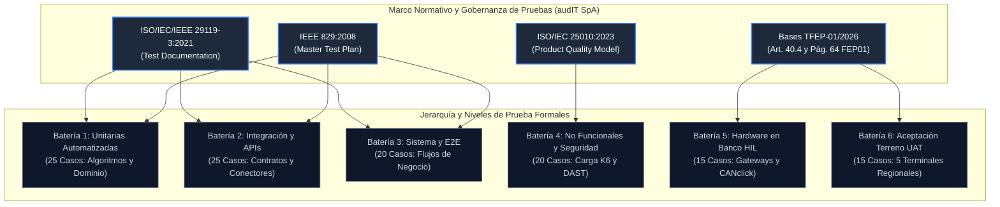
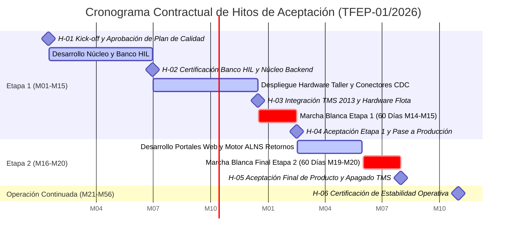

# Formulario T-17: Protocolo de Aceptación y Plan Detallado de Pruebas
**Licitación Pública TFEP-01/2026 — Solución Integral de Transporte de Carga Terrestre**  
**Cliente:** Transportes Curimón S.A.  
**Proponente:** audIT Soluciones Tecnológicas SpA  
**Documento Asociado:** Subdocumento 9 (`subdocumento_09_calidad_adaptado.md`)  
**Dupla Responsable:** D1 (QA, Gobernanza y Aseguramiento Normativo)  
**Control Documental:** Versión 2.0 Definitiva · Entrega 2

---

## 1. Marco Metodológico, Alcance y Gobernanza de Pruebas (ISO/IEC/IEEE 29119 e IEEE 829)

El presente documento constituye el **Formulario Técnico T-17 oficial de audIT Soluciones Tecnológicas SpA**, estructurado conforme a las especificaciones del Artículo 40.4 y la página 64 de las Bases Administrativas (FEP01), las Bases Técnicas Transversales (FEP02.26) y las directrices metodológicas de la norma internacional **ISO/IEC/IEEE 29119:2021** (*Software and Systems Engineering — Software Testing*) y el estándar **IEEE 829:2008** (*Test and Master Test Documentation*).

Su propósito es formalizar con carácter técnico y legal vinculante el **Protocolo de Aceptación por Hitos y de Producto Final**, así como el **Catálogo Exhaustivo de más de 100 Casos de Prueba Formalizados** que gobernarán los ciclos de verificación, validación, certificación en banco de simulación física (*Hardware-in-the-Loop*, HIL) y pruebas de aceptación de usuario (*User Acceptance Testing*, UAT) en las cinco instalaciones neurálgicas de Transportes Curimón S.A. (San Bernardo, Valparaíso, Concepción, Antofagasta y Puerto Montt).



### 1.1 Blindaje Económico Estricto (Artículo 50.2 de las Bases Administrativas)
En riguroso acatamiento de lo prescrito en el Artículo 50.2 de las Bases Administrativas de la Licitación Pública TFEP-01/2026, el presente Formulario T-17 **omite en forma total y absoluta cualquier mención a precios, costos de desarrollo, tarifas por hora-hombre, honorarios profesionales o valoraciones económicas de la propuesta técnica de audIT SpA**. 

Todas las magnitudes y recursos asignados al aseguramiento de la calidad se especifican exclusivamente mediante unidades técnicas y métricas objetivas de ingeniería:
* Horas-hombre de ingeniería de pruebas y testing de campo.
* Líneas de código ejecutadas y porcentajes de cobertura matemática.
* Tiempos de latencia en percentiles $P_{95}$ y $P_{99}$.
* Frecuencias de reloj, tasas de error y pérdida de paquetes en bus telemático.
* Duraciones de ciclos de simulación, jornadas de prueba en terminales y marchas blancas.

### 1.2 Estándar de Documentación de Casos de Prueba (9 Campos Obligatorios)
Conforme a la norma ISO/IEC/IEEE 29119-3:2021, cada caso de prueba catalogado en este documento se desagrega de manera homogénea y obligatoria a través de los siguientes nueve atributos normativos:
1. **ID del Caso de Prueba:** Identificador canónico único y unívoco por batería (`CP-UNIT-XX`, `CP-INT-XX`, `CP-SYS-XX`, `CP-PERF-XX`, `CP-SEC-XX`, `CP-HW-XX`, `CP-UAT-XX`).
2. **Nivel de Prueba y Tipología:** Ubicación en la pirámide de pruebas (Unitaria, Integración, Sistema, No Funcional, Ciberseguridad, Hardware HIL, Aceptación UAT) y subtipo operacional.
3. **Requerimiento Contractual Trazado:** Mapeo formal y bidireccional contra el catálogo canónico de 42 requerimientos del pliego (`RF-001` a `RF-028` y `RNF-001` a `RNF-014`).
4. **Precondiciones y Estado del Sistema:** Requisitos de configuración, datos persistidos, estado de dispositivos y variables de contexto previas al disparo del ensayo.
5. **Pasos de Ejecución Detallados:** Secuencia algorítmica y numerada paso a paso, reproducible de manera determinista por cualquier ingeniero de QA o auditor del mandante.
6. **Datos de Entrada Sintéticos:** Valores de prueba generados sintéticamente en estricto cumplimiento de la Ley N.º 21.719 de Protección de Datos Personales (RUTs de prueba, coordenadas ficticias dentro de la red vial, patentes sintéticas sin correlato con personas naturales o jurídicas reales).
7. **Resultado Esperado y Criterio de Éxito:** Comportamiento determinista esperado del sistema, salidas de API, eventos Kafka generados, estados de base de datos o lecturas físicas de actuadores.
8. **Criterio Pass/Fail y Severidad de Defecto:** Regla de aprobación estricta y asignación taxativa del nivel de severidad en caso de discrepancia (P1 Bloqueante, P2 Crítica, P3 Mayor, P4 Menor).
9. **Entorno de Ejecución:** Ambiente de ejecución del ensayo (Local Dev, CI Runner Testcontainers, Staging AKS, Banco de Laboratorio HIL, Terreno en Terminal).

### 1.3 Clasificación de Severidad de Defectos y Niveles de Servicio (SLA)
La gestión de no conformidades detectadas durante la ejecución del Plan de Pruebas se rige por las políticas de severidad y tiempos de atención estipulados en el Formulario T-13 y el Subdocumento 9:

| Nivel de Severidad | Denominación Operacional | Impacto en la Misión Crítica de Curimón S.A. | Tiempo Máximo de Respuesta (MTTR) | Acción Bloqueante en Pipeline / Despliegue |
| :---: | :--- | :--- | :---: | :--- |
| **P1** | **Bloqueante (*Blocker*)** | Compromete la seguridad física, incumple normativas legales (Art. 25 bis, D.S. 298), corrompe datos de jornada, o paraliza la Torre de Control y la asignación. | $\le 2\text{ horas}$ | **Bloqueo Inmediato (Stop-Ship).** Rechazo automático de MR y congelamiento de pase a producción. |
| **P2** | **Crítica (*Critical*)** | Pérdida de funcionalidad operativa mayor (telemetría, sobreestadías, conciliación de combustible) sin *workaround* manual viable. | $\le 6\text{ horas}$ | Bloqueo de promoción a Staging y Producción hasta entrega de hotfix verificado. |
| **P3** | **Mayor (*Major*)** | Falla en módulo de soporte, latencia degradada que no excede umbral de corte, o error en interfaz con alternativa operacional transitoria. | $\le 24\text{ horas}$ | Aceptación condicionada en Staging; remediación obligatoria antes del cierre del hito. |
| **P4** | **Menor (*Minor*)** | Discrepancias cosméticas de interfaz, tipografía, ordenamiento menor de tablas o alertas informativas no bloqueantes. | $\le 72\text{ horas}$ | Programación en el backlog del siguiente sprint de estabilización. |

---

## 2. Matriz de Trazabilidad de Interfaces y Contratos de Handshake

Para garantizar la consistencia sistémica del Formulario T-17 frente a los subdocumentos técnicos de la Entrega 2 actualmente en curso por las distintas áreas de ingeniería de audIT SpA, se formalizan las siguientes interfaces contractuales limpias:
* `[Handshake H2 — Software & Arquitectura: Mapeo de microservicio definitivo S3/S4]`: Vincula los casos de prueba con la arquitectura lógica de microservicios en AKS, las colas de eventos Kafka y las hypertables de TimescaleDB.
* `[Handshake H3 — Hardware & Riesgos: Parámetros AMFE definitivos S8 / T-16]`: Conecta las pruebas de hardware telemático y banco HIL con los modos de falla, efectos y niveles de criticidad (NPR) del Análisis Modal de Fallos y Efectos.
* `[Handshake H4 — PMO & EDT: Código de paquete WBS definitivo S7 / T-14]`: Enlaza cada compuerta de prueba y protocolo de aceptación con el código formal de la Estructura de Desglose del Trabajo (EDT).

### Tabla T17.1 — Matriz de Trazabilidad de Interfaces y Contratos de Handshake
*Fuente: Elaboración propia audIT Soluciones Tecnológicas SpA conforme a estándares IEEE 1012 e ISO/IEC/IEEE 29119.*

| Código Requerimiento | Descripción Funcional / Operativa | Interfaz y Contrato de Handshake Técnico | Caso de Prueba Primario | Paquete WBS Asociado |
| :--- | :--- | :--- | :--- | :--- |
| **RF-001 / REQ-01** | Validación bloqueante pre-despacho (4 factores) | `[Handshake H2 — Software & Arquitectura: Microservicio Asignación]` | `CP-UNIT-01` / `CP-SYS-01` | `[Handshake H4 — WBS: EDT-3.1]` |
| **RF-002 / REQ-02** | Evidencia jornada 454 choferes (propio/externo) | `[Handshake H2 — Software & Arquitectura: Microservicio Jornada]` | `CP-UNIT-02` / `CP-INT-02` | `[Handshake H4 — WBS: EDT-3.2]` |
| **RF-003 / REQ-03** | Evidencia jornada previa sellada chofer tercero | `[Handshake H2 — Software & Arquitectura: ACL Atestación Externa]` | `CP-INT-03` / `CP-SYS-05` | `[Handshake H4 — WBS: EDT-3.2]` |
| **RF-004 / REQ-04** | Registro inalterable `EvidenciaJornada` SHA-256 | `[Handshake H2 — Software & Arquitectura: Key Vault HSM]` | `CP-UNIT-06` / `CP-SEC-08` | `[Handshake H4 — WBS: EDT-3.2]` |
| **RF-005 / REQ-05** | Consolidación y alerta 6.000 vigencias vivas | `[Handshake H2 — Software & Arquitectura: Redis Sentinel / PostgreSQL]`| `CP-UNIT-01` / `CP-SYS-08` | `[Handshake H4 — WBS: EDT-3.1]` |
| **RF-006 / REQ-06** | Validación carga SUSPEL vs manifiesto (18 tractos)| `[Handshake H3 — Hardware & Riesgos: AMFE Falla F-SUSPEL-01]` | `CP-UNIT-19` / `CP-SYS-06` | `[Handshake H4 — WBS: EDT-3.3]` |
| **RF-007 / REQ-07** | Descarga remota y archivo tacógrafo digital | `[Handshake H3 — Hardware & Riesgos: Interfaz DSRC Tacógrafo]` | `CP-HW-15` / `CP-INT-21` | `[Handshake H4 — WBS: EDT-2.3]` |
| **RF-008 / REQ-08** | Vista única 374 tractocamiones en Torre 24x7 | `[Handshake H2 — Software & Arquitectura: Portal Torre / Timescale]` | `CP-SYS-16` / `CP-UAT-01` | `[Handshake H4 — WBS: EDT-3.4]` |
| **RF-009 / REQ-09** | Buffer local vehicular $\ge 72\text{ h}$ (compromiso 288 h)| `[Handshake H3 — Hardware & Riesgos: AMFE Sombra F-EMMC-02]` | `CP-HW-03` / `CP-PERF-02` | `[Handshake H4 — WBS: EDT-2.3]` |
| **RF-010 / REQ-10** | Detección geocercas en 1.400 clientes sin hardware| `[Handshake H2 — Software & Arquitectura: Motor Ray-Casting]` | `CP-UNIT-08` / `CP-SYS-03` | `[Handshake H4 — WBS: EDT-3.5]` |
| **RF-011 / REQ-11** | Registro auditable esperas sobreestadías | `[Handshake H2 — Software & Arquitectura: Engine Liquidación]` | `CP-UNIT-12` / `CP-SYS-03` | `[Handshake H4 — WBS: EDT-3.5]` |
| **RF-012 / REQ-12** | Conformidad de entrega (POD) con OTP y firma | `[Handshake H2 — Software & Arquitectura: App Móvil PWA e-POD]` | `CP-SYS-04` / `CP-INT-20` | `[Handshake H4 — WBS: EDT-3.6]` |
| **RF-013 / REQ-13** | Generación datos DET hacia sistema contable | `[Handshake H2 — Software & Arquitectura: Conector ERP Contable]` | `CP-INT-11` / `CP-INT-12` | `[Handshake H4 — WBS: EDT-3.7]` |
| **RF-014 / REQ-14** | Emisión conforme DET en cabina sin cobertura | `[Handshake H3 — Hardware & Riesgos: Token Criptográfico Edge]` | `CP-UNIT-21` / `CP-HW-11` | `[Handshake H4 — WBS: EDT-2.3]` |
| **RF-015 / REQ-15** | Optimización de retornos en vacío (ALNS) | `[Handshake H2 — Software & Arquitectura: Microservicio ALNS]` | `CP-UNIT-15` / `CP-SYS-09` | `[Handshake H4 — WBS: EDT-3.8]` |
| **RF-016 / REQ-16** | Costo real por km/viaje en $\le 24\text{ h}$ post-cierre | `[Handshake H2 — Software & Arquitectura: Motor de Costos]` | `CP-INT-23` / `CP-SYS-15` | `[Handshake H4 — WBS: EDT-3.9]` |
| **RF-017 / REQ-17** | Segregación costo propio vs contractual tercero | `[Handshake H2 — Software & Arquitectura: Motor de Costos]` | `CP-INT-23` / `CP-SYS-10` | `[Handshake H4 — WBS: EDT-3.9]` |
| **RF-018 / REQ-18** | Análisis analítico de dispersión de rendimiento | `[Handshake H2 — Software & Arquitectura: TimescaleDB Analytics]` | `CP-INT-18` / `CP-PERF-09` | `[Handshake H4 — WBS: EDT-3.10]`|
| **RF-019 / REQ-19** | Liquidación automática a 148 transportistas | `[Handshake H2 — Software & Arquitectura: Motor Liquidaciones]` | `CP-INT-24` / `CP-SYS-10` | `[Handshake H4 — WBS: EDT-3.11]`|
| **RF-020 / REQ-20** | Portal autoservicio para transportistas terceros | `[Handshake H2 — Software & Arquitectura: Portal Transportistas]` | `CP-SEC-07` / `CP-PERF-10` | `[Handshake H4 — WBS: EDT-3.11]`|
| **RF-021 / REQ-21** | Portal cliente con visibilidad temporal de carga | `[Handshake H2 — Software & Arquitectura: Portal Clientes / WAF]` | `CP-SYS-19` / `CP-PERF-07` | `[Handshake H4 — WBS: EDT-3.12]`|
| **RF-022 / REQ-22** | Gestión de consentimiento Ley 21.719 (revocable) | `[Handshake H2 — Software & Arquitectura: Módulo Privacidad]` | `CP-SEC-04` / `CP-SEC-05` | `[Handshake H4 — WBS: EDT-3.13]`|
| **RF-023 / REQ-23** | Cálculo emisiones CO2e ton-km ISO 14083 / GLEC | `[Handshake H2 — Software & Arquitectura: Motor Sostenibilidad]` | `CP-UNIT-09` / `CP-SYS-17` | `[Handshake H4 — WBS: EDT-3.14]`|
| **RF-024 / REQ-24** | Registro intervenciones talleres en ruta | `[Handshake H2 — Software & Arquitectura: Formulario PWA Talleres]` | `CP-INT-17` / `CP-UAT-02` | `[Handshake H4 — WBS: EDT-3.15]`|
| **RF-025 / REQ-25** | Mantenimiento preventivo por odometría CAN real | `[Handshake H3 — Hardware & Riesgos: CANclick J1939]` | `CP-UNIT-14` / `CP-HW-04` | `[Handshake H4 — WBS: EDT-2.3]` |
| **RF-026 / REQ-26** | Portal gestión de adhesión de 148 terceros | `[Handshake H2 — Software & Arquitectura: Portal Adhesión]` | `CP-SYS-05` / `CP-UAT-09` | `[Handshake H4 — WBS: EDT-3.16]`|
| **RF-027 / REQ-27** | Alerta preventiva anticipada fin de jornada | `[Handshake H3 — Hardware & Riesgos: Algoritmo Dinámico ETA]` | `CP-UNIT-18` / `CP-HW-06` | `[Handshake H4 — WBS: EDT-2.3]` |
| **RF-028 / REQ-28** | Operación en modo mixto telemático/documental | `[Handshake H2 — Software & Arquitectura: Capa ACL / Reglas]` | `CP-SYS-05` / `CP-UAT-09` | `[Handshake H4 — WBS: EDT-3.1]` |
| **RNF-001 / REQ-29** | Cero distracción en marcha (Ley No Chat 21.377) | `[Handshake H3 — Hardware & Riesgos: Enclavamiento HAL $v>0$]` | `CP-UNIT-11` / `CP-HW-06` | `[Handshake H4 — WBS: EDT-2.3]` |
| **RNF-002 / REQ-30** | Operación offline inalterable y sin duplicados | `[Handshake H3 — Hardware & Riesgos: SQLite WAL Sincronizador]` | `CP-UNIT-23` / `CP-HW-03` | `[Handshake H4 — WBS: EDT-2.3]` |
| **RNF-003 / REQ-31** | Cero invasión de equipos de terceros sin pacto | `[Handshake H2 — Software & Arquitectura: ACL API Gateway]` | `CP-INT-07` / `CP-INT-08` | `[Handshake H4 — WBS: EDT-3.1]` |
| **RNF-004 / REQ-32** | Instalación física durante pasada regular taller | `[Handshake H3 — Hardware & Riesgos: Protocolo Taller SBO]` | `CP-UAT-02` / `CP-HW-08` | `[Handshake H4 — WBS: EDT-5.1]` |
| **RNF-005 / REQ-33** | Integración CAN bus solo lectura sin perder garantía | `[Handshake H3 — Hardware & Riesgos: Pinza CANclick]` | `CP-UNIT-16` / `CP-HW-04` | `[Handshake H4 — WBS: EDT-2.3]` |
| **RNF-006 / REQ-34** | Sistema contable único emisor e idempotencia | `[Handshake H2 — Software & Arquitectura: Kafka Transaccional]` | `CP-INT-12` / `CP-INT-11` | `[Handshake H4 — WBS: EDT-3.7]` |
| **RNF-007 / REQ-35** | Cero hardware propio en recintos de clientes | `[Handshake H2 — Software & Arquitectura: Motor Geocercas GPS]` | `CP-UNIT-08` / `CP-SYS-03` | `[Handshake H4 — WBS: EDT-3.5]` |
| **RNF-008 / REQ-36** | Absorción de cierres cordilleranos de 288 h | `[Handshake H3 — Hardware & Riesgos: Memoria eMMC 8 GB]` | `CP-HW-03` / `CP-PERF-02` | `[Handshake H4 — WBS: EDT-2.3]` |
| **RNF-009 / REQ-37** | Operación delegada sin sobrecargar TI Curimón | `[Handshake H2 — Software & Arquitectura: Managed Services]` | `CP-SYS-16` / `CP-UAT-01` | `[Handshake H4 — WBS: EDT-4.1]` |
| **RNF-010 / REQ-38** | Evaluación integral de ciclo de vida (TCO 56 m) | `[Handshake H2 — Software & Arquitectura: FinOps Azure]` | `CP-PERF-08` / `CP-SYS-01` | `[Handshake H4 — WBS: EDT-1.2]` |
| **RNF-011 / REQ-39** | Convivencia controlada en transición de flota | `[Handshake H2 — Software & Arquitectura: Capa Strangler Fig]` | `CP-INT-05` / `CP-SYS-05` | `[Handshake H4 — WBS: EDT-3.1]` |
| **RNF-012 / REQ-40** | Trazabilidad probatoria estricta sin sobrescritura | `[Handshake H2 — Software & Arquitectura: Storage Inmutable WORM]`| `CP-SEC-08` / `CP-UNIT-07` | `[Handshake H4 — WBS: EDT-3.2]` |
| **RNF-013 / REQ-41** | Cifrado y minimización estricta (Ley 21.719) | `[Handshake H2 — Software & Arquitectura: Azure Key Vault FLE]` | `CP-SEC-04` / `CP-SEC-05` | `[Handshake H4 — WBS: EDT-3.13]`|
| **RNF-014 / REQ-42** | Políticas de retención y borrado seguro legal | `[Handshake H2 — Software & Arquitectura: Azure Blob Lifecycle]` | `CP-SEC-08` / `CP-INT-25` | `[Handshake H4 — WBS: EDT-3.13]`|

---

## 3. Protocolo General de Aceptación por Hitos y Producto Final (Bases FEP01 p. 64)

Conforme a lo ordenado en la página 64 de las Bases Administrativas (FEP01), este capítulo detalla la estructura formal del **Protocolo de Aceptación**, especificando los entregables de cada hito contractual, los criterios de aceptación cuantitativos, la evidencia documental requerida, los plazos de revisión y el procedimiento reglado de formulación y subsanación de observaciones.

### 3.1 Estructura Contractual de Hitos de Aceptación
El proyecto se articula en seis hitos formales de aceptación (`H-01` a `H-06`), distribuidos armónicamente entre la Etapa 1 (Meses 1 a 15), la Etapa 2 (Meses 16 a 20) y el inicio de la Operación Continuada (Mes 21):



### 3.2 Matriz de Entregables, Criterios y Evidencias por Hito
La Tabla T17.2 compendia los requisitos objetivos que deberán cumplirse de manera acumulativa para la suscripción de cada acta:

#### Tabla T17.2 — Matriz General de Aceptación por Hitos Contractuales
*Fuente: Elaboración propia audIT Soluciones Tecnológicas SpA conforme a Bases FEP01 p. 64.*

| Hito Contractual | Entregables Formales Sujetos a Aceptación | Criterios de Aceptación Objetivos | Evidencia Probatoria Requerida | Plazo de Revisión Curimón S.A. |
| :--- | :--- | :--- | :--- | :---: |
| **H-01 (Mes 1)**<br>Plan de Aseguramiento y V&V | • Subdocumento 9 aprobado.<br>• Formulario T-13 y T-17 en línea base congelada.<br>• Matriz RTM consolidada. | • 100% de los 42 requerimientos cubiertos con casos de prueba.<br>• Cero observaciones P1/P2 abiertas en revisión de ingeniería. | • Acta de Aprobación de Plan de Calidad.<br>• Repositorio GitLab configurado con branch protection y QG1/QG2. | 10 días hábiles |
| **H-02 (Mes 6)**<br>Certificación Banco HIL y Core | • Reporte de ensayos en banco HIL.<br>• Certificación de 100% pruebas unitarias (`CP-UNIT-01..25`).<br>• Infraestructura Cloud Azure desplegada. | • Cobertura unitaria $\ge 80\%$.<br>• 0 defectos P1/P2 abiertos.<br>• Conmutación eléctrica HIL $< 10\text{ ms}$.<br>• Consumo reposo $< 50\text{ mA}$. | • Reporte SonarQube SAST y Trivy SCA.<br>• Oscilogramas certificados del banco HIL.<br>• Certificado de despliegue IaC con Terraform verificado. | 10 días hábiles |
| **H-03 (Mes 12)**<br>Integración Hardware y CDC | • 87 tractos propios retrofiteados.<br>• Conector CDC Debezium con TMS 2013 operativo.<br>• Capa ACL para Wialon/Wisetrack homologada. | • 100% pruebas `CP-INT-01..25` aprobadas.<br>• Tasa de ingesta CDC $\ge 99{,}9\%$.<br>• Pérdida de tramas CANclick $< 0{,}1\%$. | • Informes técnicos de instalación camión por camión en taller San Bernardo.<br>• Métricas Prometheus de eventos CDC y latencia Kafka. | 10 días hábiles |
| **H-04 (Mes 15)**<br>Aceptación Etapa 1 | • Finalización de Marcha Blanca 1 (60 días).<br>• Validación bloqueante en producción.<br>• Reporte K6 carga sostenida (450 viajes/día). | • Disponibilidad $\ge 99{,}5\%$ mensual.<br>• $P_{95}$ validación bloqueante $\le 30\text{ s}$.<br>• Cero multas DT por jornada en flota propia durante marcha blanca. | • Bitácora de operaciones de la Torre 24x7.<br>• Logs inmutables sellados SHA-256 en Key Vault.<br>• Informe de resultados K6 y DAST OWASP ZAP sin CVEs. | 10 días hábiles |
| **H-05 (Mes 20)**<br>Aceptación Producto Final | • Módulos de Etapa 2 desplegados (ALNS, Portales Clientes/Terceros, Emisiones).<br>• Finalización Marcha Blanca 2 (60 días).<br>• Apagado seguro de TMS 2013 legacy. | • Reducción de km en vacío a $<15\%$.<br>• Conciliación de sobreestadías con objeciones $<20\%$.<br>• 100% de los 110 casos de prueba formalmente aprobados. | • Actas de recepción UAT suscritas en los 5 terminales regionales.<br>• Reporte de migración histórica de 480.000 viajes.<br>• Certificación de failover DRP hacia Brazil South (RTO $\le 4\text{ h}$). | 15 días hábiles |
| **H-06 (Mes 23)**<br>Estabilidad Operacional | • Auditoría de 90 días de operación continuada.<br>• Cumplimiento del SLA 99,5% consolidado.<br>• Traspaso definitivo a Mesa de Soporte 24/7. | • MTTR global $\le 2\text{ h}$ en P1.<br>• Disponibilidad acumulada $\ge 99{,}5\%$.<br>• Base de conocimiento operacional L1/L2/L3 completa. | • Reporte Datadog / Azure Monitor consolidado.<br>• Encuestas de satisfacción a 22 operadores de Torre y 148 transportistas. | 10 días hábiles |

### 3.3 Plazos de Revisión y Procedimiento Reglado de Observaciones
De conformidad con las normas de las Bases Administrativas, la tramitación de entregables e hitos se sujetará al siguiente procedimiento:
1. **Presentación de Entregable:** audIT SpA ingresará formalmente la carpeta técnica del hito a la Contraparte Técnica de Transportes Curimón S.A., acompañada de la batería de pruebas y evidencias requeridas.
2. **Plazo Ordinario de Revisión:** Transportes Curimón S.A. dispondrá de un plazo fatal de **diez (10) días hábiles** (quince días para el Hito H-05) contados desde el ingreso para auditar, verificar y emitir su pronunciamiento:
   * **Conformidad Pura y Simple:** Si el entregable satisface la totalidad de los criterios objetivos de aceptación, la Contraparte Técnica suscribirá el Acta de Aceptación dentro del plazo estipulado.
   * **Silencio Positivo / Aprobación Tácita:** Transcurrido el plazo sin que Curimón S.A. formule observaciones fundadas por escrito, el entregable o hito se entenderá legal y técnicamente aprobado en todas sus partes.
   * **Formulación de Observaciones:** Si se detectaren defectos o incumplimientos objetivos, Curimón S.A. emitirá un Informe de Observaciones debidamente tipificado y sustentado.
3. **Plazo de Subsanación y Remediación:** audIT SpA dispondrá de un plazo de **cinco (5) días hábiles** para corregir las no conformidades observadas, re-ejecutar las pruebas pertinentes y reingresar la carpeta con el informe de remediación.
4. **Revisión Final de Subsanación:** La Contraparte Técnica dispondrá de **tres (3) días hábiles** adicionales para verificar exclusivamente los puntos objetados. Verificada la subsanación, se procederá a la firma inmediata del acta.

### 3.4 Procedimiento de Resolución de Controversias Técnicas
En caso de discrepancia en la interpretación de los criterios de éxito de un caso de prueba, operará el siguiente escalamiento reglado:
* **Nivel 1 (Técnico):** Reunión extraordinaria entre el Jefe de QA de audIT SpA y el Coordinador Técnico de Curimón S.A. (plazo máximo: 24 horas).
* **Nivel 2 (Directivo):** Sesión del Comité de Control de Proyecto e Integración (CCPI), integrado por el Gerente de Proyecto de audIT SpA y el Gerente de Operaciones de Curimón S.A. (plazo máximo: 48 horas).
* **Nivel 3 (Peritaje Técnico Externo):** Si persiste el desacuerdo, las partes designarán de común acuerdo un perito independiente de reconocida trayectoria en ingeniería de software y sistemas de transporte, cuyo dictamen técnico será vinculante.

### 3.5 Modelo Canónico de Acta de Conformidad y Aceptación

```text
====================================================================================================
                        ACTA DE CONFORMIDAD Y ACEPTACIÓN TÉCNICA
               LICITACIÓN PÚBLICA TFEP-01/2026 — CASO 10: TRANSPORTES CURIMÓN S.A.
====================================================================================================

IDENTIFICACIÓN DEL HITO:
• Hito Evaluado: [ ] H-01  [ ] H-02  [ ] H-03  [ ] H-04  [ ] H-05  [ ] H-06
• Denominación: ____________________________________________________________________________________
• Fecha de Ingreso: ____ / ____ / ________   • Fecha de Aprobación: ____ / ____ / ________

VERIFICACIÓN DE CRITERIOS OBJETIVOS Y CASOS DE PRUEBA:
1. Total de Casos de Prueba Comprometidos en el Hito: _________ casos.
2. Casos de Prueba Ejecutados: _________   • Aprobados (Pass): _________   • Fallidos (Fail): _________
3. Estado de Defectos:
   • P1 (Bloqueante): [ 0 ] Abiertos   • P2 (Crítica): [ 0 ] Abiertos
   • P3 (Mayor):      [   ] Abiertos (SLA de resolución acordado: ____ días hábiles)
   • P4 (Menor):      [   ] Abiertos (Incorporados al backlog de mantenimiento)
4. Cobertura Unitaria de Código (SonarQube): ________ % (Umbral exigido: >= 80,0%)
5. Disponibilidad E2E Medida (Datadog):       ________ % (Umbral exigido: >= 99,5%)

DOCUMENTACIÓN Y EVIDENCIAS ADJUNTAS:
[X] Informe de Ejecución de Pruebas (Test Execution Summary Report).
[X] Trazas de Logs selladas criptográficamente con SHA-256.
[X] Certificados de Calibración de Hardware e Informes de Banco HIL.
[X] Actas de Pruebas UAT en Terreno suscritas por Jefaturas de Terminal.

PRONUNCIAMIENTO FORMAL DE LA CONTRAPARTE TÉCNICA:
Habiéndose verificado el cumplimiento estricto de la totalidad de los criterios objetivos de aceptación, 
la Contraparte Técnica de Transportes Curimón S.A. declara formalmente la RECEPCIÓN CONFORME del hito 
indicado precedentemente, autorizando el avance hacia la siguiente fase contractual.

_____________________________________________         _____________________________________________
        POR TRANSPORTES CURIMÓN S.A.                        POR audIT TECNOLÓGICAS SpA
        Contraparte Técnica Oficial                             Gerente de Proyecto / QA Lead
====================================================================================================
```

---

## 4. Batería 1: Pruebas Unitarias Automatizadas (25 Casos: `CP-UNIT-01` a `CP-UNIT-25`)

Esta batería valida en aislamiento estricto la lógica de negocio, las funciones matemáticas, los algoritmos deterministas y los enclavamientos legales del sistema, ejecutándose en el pipeline de CI/CD ante cada *commit* o *Merge Request*.

---

### CP-UNIT-01: Algoritmo de Asignación Bloqueante Pre-Despacho (4 Factores Síncronos)
* **ID:** `CP-UNIT-01`
* **Nivel y Tipología:** Prueba Unitaria Automatizada / Lógica de Negocio y Enclavamiento Bloqueante.
* **Requerimiento Trazado:** `RF-001 / REQ-01` (Validación bloqueante pre-despacho en $\le 30\text{ s}$).  
  *[Handshake H2 — Software & Arquitectura: Microservicio Asignación]* · *[Handshake H4 — WBS: EDT-3.1]*
* **Precondiciones:**
  1. Instancia mock del motor de asignación inicializada en memoria.
  2. Tablas hash en Redis pobladas con perfiles de choferes, equipos, vigencias y cargas.
* **Pasos de Ejecución:**
  1. Invocar la función pura `validatePreDispatchAssignment(candidateAssignment)`.
  2. Ejecutar secuencialmente las 4 comprobaciones: (a) Jornada disponible Art. 25 bis, (b) 6.000 vigencias vivas (licencia, revisión técnica, seguro), (c) Aptitud mecánica del tracto/rampla, (d) Compatibilidad de carga SUSPEL/frío.
  3. Medir el tiempo de ejecución de la rutina de validación.
  4. Evaluar la respuesta devuelta por la función.
* **Datos de Entrada Sintéticos:**
  ```json
  {
    "orderId": "OT-SYNTH-2026-0001",
    "driverId": "DRV-SYNTH-101",
    "truckId": "TRK-SYNTH-042",
    "trailerId": "TRL-SYNTH-015",
    "cargoType": "GENERAL_CARGO",
    "driverStatus": {"drivingHoursToday": 3.5, "continuousDrivingHours": 3.5, "licenseValidUntil": "2027-05-10"},
    "truckStatus": {"technicalInspectionValid": true, "insuranceValid": true, "activeFaults": 0}
  }
  ```
* **Resultado Esperado:** Objeto `AssignmentValidationResult` con `isApproved: true`, `rejectionReasons: []`, y tiempo total de ejecución $< 25\text{ ms}$ en memoria.
* **Pass/Fail y Severidad:** **Pass** si `isApproved == true` y latencia $< 30\text{ ms}$. **Fail** si autoriza con algún factor en falta o excede 50 ms. **Severidad:** **P1 (Bloqueante)**.
* **Entorno:** Local CI Runner / Jest Unit Runtime.

---

### CP-UNIT-02: Límite de Conducción Continua de 5 Horas (Artículo 25 bis Código del Trabajo)
* **ID:** `CP-UNIT-02`
* **Nivel y Tipología:** Prueba Unitaria Automatizada / Cumplimiento Legal y Algorítmico.
* **Requerimiento Trazado:** `RF-002 / REQ-02` (Evidencia jornada 454 choferes).  
  *[Handshake H2 — Software & Arquitectura: Microservicio Jornada]* · *[Handshake H4 — WBS: EDT-3.2]*
* **Precondiciones:** Función `evaluateContinuousDriving(driverTimeline)` cargada.
* **Pasos de Ejecución:**
  1. Inyectar serie temporal continua de eventos de ignición ON y odometría en movimiento.
  2. Simular bloque continuo de 5 horas y 1 minuto de conducción sin pausa de reposo.
  3. Ejecutar la función de evaluación de jornada legal.
* **Datos de Entrada Sintéticos:**
  ```json
  {
    "driverId": "DRV-SYNTH-102",
    "drivingSessionStart": "2026-10-01T08:00:00Z",
    "evaluationTime": "2026-10-01T13:01:00Z",
    "movementEventsCount": 602,
    "speedReadingsAverageKmh": 78.4
  }
  ```
* **Resultado Esperado:** Emisión inmediata de infracción `VIOLATION_CONTINUOUS_DRIVING_EXCEEDED` con estado `BLOCKED_FOR_DISPATCH`, registrando exceso de 60 segundos.
* **Pass/Fail y Severidad:** **Pass** si detecta la infracción en el minuto 301 exacto y bloquea al conductor. **Fail** si permite continuar sin alertar. **Severidad:** **P1 (Bloqueante)**.
* **Entorno:** Local CI Runner / Go Test Runtime.

---

### CP-UNIT-03: Descanso Mínimo Intermedio de 2 Horas tras 5 Horas de Conducción
* **ID:** `CP-UNIT-03`
* **Nivel y Tipología:** Prueba Unitaria Automatizada / Lógica de Regulación Laboral.
* **Requerimiento Trazado:** `RF-002 / REQ-02` (Régimen de descanso Art. 25 bis).  
  *[Handshake H2 — Software & Arquitectura: Microservicio Jornada]* · *[Handshake H4 — WBS: EDT-3.2]*
* **Precondiciones:** Conductor ha completado bloque de 5 horas continuas de conducción a las 13:00:00Z.
* **Pasos de Ejecución:**
  1. Inyectar evento de inicio de descanso a las 13:00:00Z.
  2. Intentar asignar o activar nuevo viaje a las 14:45:00Z (transcurridas solo 1 h 45 min).
  3. Invocar validador `canResumeDriving(driverId, currentTime)`.
  4. Repetir validación a las 15:00:01Z (transcurridas 2 h 01 s de descanso efectivo).
* **Datos de Entrada Sintéticos:** `driverId: "DRV-SYNTH-103"`, `breakStartTime: "2026-10-01T13:00:00Z"`, consultas en `t1 = 14:45:00Z` y `t2 = 15:00:01Z`.
* **Resultado Esperado:**
  * En `t1`: `canResume: false`, motivo `INSUFFICIENT_MANDATORY_BREAK`, tiempo restante `15 minutos`.
  * En `t2`: `canResume: true`, contador de conducción continua reiniciado a 0,0 horas.
* **Pass/Fail y Severidad:** **Pass** si bloquea en $t_1$ y habilita en $t_2$. **Fail** si habilita antes de 120 minutos. **Severidad:** **P1 (Bloqueante)**.
* **Entorno:** Local CI Runner / Jest.

---

### CP-UNIT-04: Descanso Mínimo Diario de 8 Horas Continuas en Ciclo de 24 Horas
* **ID:** `CP-UNIT-04`
* **Nivel y Tipología:** Prueba Unitaria Automatizada / Validación Cronológica de Jornada.
* **Requerimiento Trazado:** `RF-002 / REQ-02` (Descanso diario de 8 horas Art. 25 bis).  
  *[Handshake H2 — Software & Arquitectura: Microservicio Jornada]* · *[Handshake H4 — WBS: EDT-3.2]*
* **Precondiciones:** Registro de 24 horas del conductor cargado con múltiples trayectos y pausas fraccionadas de 1 hora, sumando 10 horas de pausa pero ninguna continua $\ge 8$ horas.
* **Pasos de Ejecución:**
  1. Procesar la ventana deslizante de 24 horas mediante `verifyDailyRestPeriod(timeline)`.
  2. Comprobar existencia de un bloque ininterrumpido de motor apagado e inactividad $\ge 8$ horas.
* **Datos de Entrada Sintéticos:** Array de 1.440 minutos con actividades fraccionadas donde $\max(\text{bloque\_descanso}) = 6{,}5\text{ horas}$.
* **Resultado Esperado:** Función retorna `hasValidDailyRest: false`, `maxContinuousRestHours: 6.5`, `deficitHours: 1.5`, generando alerta de infracción legal.
* **Pass/Fail y Severidad:** **Pass** si identifica la falta de descanso continuo de 8 horas. **Fail** si suma descansos fraccionados para validar el requisito. **Severidad:** **P1 (Bloqueante)**.
* **Entorno:** Local CI Runner / Go Test.

---

### CP-UNIT-05: Control Acumulativo de Tope Mensual de 180 Horas Ordinarias de Trabajo
* **ID:** `CP-UNIT-05`
* **Nivel y Tipología:** Prueba Unitaria Automatizada / Regulación Mensual Art. 25 bis.
* **Requerimiento Trazado:** `RF-002 / REQ-02` (Tope mensual 180 horas).  
  *[Handshake H2 — Software & Arquitectura: Microservicio Jornada]* · *[Handshake H4 — WBS: EDT-3.2]*
* **Precondiciones:** Chofer con 178 horas acumuladas en el mes en curso al día 28.
* **Pasos de Ejecución:**
  1. Evaluar orden de transporte sintética de 4 horas estimadas de duración.
  2. Invocar `validateMonthlyDrivingHoursCap(driverId, 4.0)`.
* **Datos de Entrada Sintéticos:** `accumulatedMonthlyHours: 178.0`, `projectedTripHours: 4.0`, `monthlyCap: 180.0`.
* **Resultado Esperado:** Rechazo de asignación con código `MONTHLY_CAP_OVERRUN_PREVENTED`, indicando exceso proyectado de 2,0 horas.
* **Pass/Fail y Severidad:** **Pass** si previene la asignación que rebase 180 h. **Fail** si autoriza el viaje. **Severidad:** **P1 (Bloqueante)**.
* **Entorno:** Local CI Runner / Jest.

---

### CP-UNIT-06: Generación y Sellado Criptográfico SHA-256 de la Entidad `EvidenciaJornada`
* **ID:** `CP-UNIT-06`
* **Nivel y Tipología:** Prueba Unitaria Automatizada / Criptografía y No Repudio Legal.
* **Requerimiento Trazado:** `RF-004 / REQ-04` (Sellado inalterable SHA-256 `EvidenciaJornada`).  
  *[Handshake H2 — Software & Arquitectura: Azure Key Vault HSM]* · *[Handshake H4 — WBS: EDT-3.2]*
* **Precondiciones:** Módulo criptográfico FIPS 140-2 inicializado con clave simulada.
* **Pasos de Ejecución:**
  1. Serializar la entidad canónica `EvidenciaJornada` a JSON canónico ordenado (RFC 8785).
  2. Ejecutar función de hashing SHA-256 sobre la cadena serializada.
  3. Modificar un carácter arbitrario en el payload (ej. alterar odómetro en 1 km) y recalcular hash.
  4. Comparar ambos hashes.
* **Datos de Entrada Sintéticos:**
  ```json
  {
    "evidenceId": "EV-SYNTH-889102",
    "driverRUT": "15.984.321-K",
    "truckPlate": "LKJH-89",
    "timestampUTC": "2026-10-01T10:15:30Z",
    "engineState": "RUNNING",
    "odometerKm": 184520.4,
    "gpsCoordinates": {"lat": -33.5982, "lon": -70.7045}
  }
  ```
* **Resultado Esperado:** Hash SHA-256 generado con longitud exacta de 64 caracteres hexadecimales. El hash de la entidad modificada difiere completamente (efecto avalancha $> 50\%$ de bits modificados).
* **Pass/Fail y Severidad:** **Pass** si el hashing es determinista y sensible a cualquier alteración. **Fail** si hay colisión o indiferencia a mutación. **Severidad:** **P1 (Bloqueante)**.
* **Entorno:** Local CI Runner / Go Crypto / Jest.

---

### CP-UNIT-07: Encadenamiento Criptográfico de Bloques de Jornada (PrevHash y Timestamp RFC 3161)
* **ID:** `CP-UNIT-07`
* **Nivel y Tipología:** Prueba Unitaria Automatizada / Integridad WORM e Inmutabilidad.
* **Requerimiento Trazado:** `RF-004 / REQ-04` y `RNF-012 / REQ-40` (Trazabilidad probatoria sin sobrescritura).  
  *[Handshake H2 — Software & Arquitectura: Storage Inmutable WORM]* · *[Handshake H4 — WBS: EDT-3.2]*
* **Precondiciones:** Cadena en memoria con 5 bloques de evidencia previamente sellados.
* **Pasos de Ejecución:**
  1. Insertar el bloque 6 conteniendo el `previousHash` del bloque 5.
  2. Validar la función de integridad `verifyChainIntegrity(chain)`.
  3. Simular un ataque interno modificando el estado del motor en el bloque 3.
  4. Re-ejecutar `verifyChainIntegrity(chain)`.
* **Datos de Entrada Sintéticos:** Bloque 6 con hash anterior `a1b2c3d4...`, timestamp `2026-10-01T10:20:00Z`.
* **Resultado Esperado:** La verificación retorna `valid: true` inicialmente; tras alterar el bloque 3, retorna `valid: false` identificando ruptura de enlace en bloque 3 y 4.
* **Pass/Fail y Severidad:** **Pass** si detecta cualquier intento de alteración retrospectiva. **Fail** si la cadena se declara válida tras modificación. **Severidad:** **P1 (Bloqueante)**.
* **Entorno:** Local CI Runner / Go Test.

---

### CP-UNIT-08: Algoritmo de Detección de Geocercas Poligonales Complejas (Ray-Casting)
* **ID:** `CP-UNIT-08`
* **Nivel y Tipología:** Prueba Unitaria Automatizada / Geometría Computacional y Telemetría.
* **Requerimiento Trazado:** `RF-010 / REQ-10` (Geocercas poligonales en 1.400 clientes sin hardware).  
  *[Handshake H2 — Software & Arquitectura: Motor Ray-Casting]* · *[Handshake H4 — WBS: EDT-3.5]*
* **Precondiciones:** Polígono cóncavo de 12 vértices que delimita el patio de carga de un cliente agroexportador.
* **Pasos de Ejecución:**
  1. Probar un punto de coordenadas $P_1$ ubicado claramente en el interior del polígono.
  2. Probar un punto $P_2$ situado en el borde perimetral exacto (tolerancia $\pm 2\text{ m}$).
  3. Probar un punto $P_3$ exterior a 15 metros del cerco.
  4. Ejecutar el algoritmo `isPointInPolygon(point, polygonVertices)`.
* **Datos de Entrada Sintéticos:** Polígono de 12 coordenadas UTM en San Bernardo; $P_1 = (-33.59821, -70.70451)$, $P_2 = (-33.59800, -70.70400)$, $P_3 = (-33.59780, -70.70380)$.
* **Resultado Esperado:** $P_1 \rightarrow \text{INSIDE}$, $P_2 \rightarrow \text{BOUNDARY\_INSIDE}$, $P_3 \rightarrow \text{OUTSIDE}$. Tiempo de cálculo $< 5\text{ }\mu\text{s}$ por punto.
* **Pass/Fail y Severidad:** **Pass** si clasifica con 100% de precisión geométrica y latencia sub-milisegundo. **Fail** si hay falsos positivos en exteriores inmediatos. **Severidad:** **P2 (Crítica)**.
* **Entorno:** Local CI Runner / C++ o Go Test.

---

### CP-UNIT-09: Cálculo de Huella de Carbono GLEC Framework / ISO 14083 por Tonelada-Kilómetro
* **ID:** `CP-UNIT-09`
* **Nivel y Tipología:** Prueba Unitaria Automatizada / Algoritmo de Sostenibilidad y Emisiones.
* **Requerimiento Trazado:** `RF-023 / REQ-23` (Emisiones CO2e ton-km ISO 14083).  
  *[Handshake H2 — Software & Arquitectura: Motor Sostenibilidad]* · *[Handshake H4 — WBS: EDT-3.14]*
* **Precondiciones:** Factores de emisión Well-to-Wheel (WTW) para diésel B7 en Chile cargados en configuración ($3{,}18\text{ kg CO}_2\text{e / litro}$).
* **Pasos de Ejecución:**
  1. Suministrar viaje de 450 km con carga transportada de 24,5 toneladas y consumo telemático real medido por bus CAN de 152 litros de diésel.
  2. Invocar `calculateEmissionsISO14083(fuelConsumedLiters, distanceKm, payloadTons)`.
  3. Validar formulación: $\text{Emisión Total} = 152 \times 3{,}18 = 483{,}36\text{ kg CO}_2\text{e}$; $\text{Intensidad} = \frac{483{,}36}{450 \times 24{,}5} = 0{,}04384\text{ kg CO}_2\text{e/ton-km} = 43{,}84\text{ g/ton-km}$.
* **Datos de Entrada Sintéticos:** `fuelLiters: 152.0`, `distanceKm: 450.0`, `cargoTons: 24.5`, `emissionFactorWTW: 3.18`.
* **Resultado Esperado:** Retorno de objeto con `totalEmissionsKgCO2e: 483.36` e `intensityGramPerTonKm: 43.84`, con precisión de 2 decimales.
* **Pass/Fail y Severidad:** **Pass** si el cálculo matemático es exacto bajo tolerancia $\pm 0{,}01\%$. **Fail** si hay desviación numérica. **Severidad:** **P3 (Mayor)**.
* **Entorno:** Local CI Runner / Jest.

---

### CP-UNIT-10: Conciliación de Combustible Diésel por Flujo CAN J1939 vs Odometría
* **ID:** `CP-UNIT-10`
* **Nivel y Tipología:** Prueba Unitaria Automatizada / Telemetría y Detección de Desvíos.
* **Requerimiento Trazado:** `RF-016 / REQ-16` y `RF-025 / REQ-25` (Costeo real y mantenimiento).  
  *[Handshake H3 — Hardware & Riesgos: CANclick J1939]* · *[Handshake H4 — WBS: EDT-2.3]*
* **Precondiciones:** Algoritmo de rendimiento nominal para motor Scania/Volvo 13L cargado (rango típico: $2{,}1$ a $2{,}6\text{ km/litro}$ con carga completa).
* **Pasos de Ejecución:**
  1. Inyectar datos de viaje: 320 km recorridos y 240 litros reportados por surtidor (rendimiento anómalo de $1{,}33\text{ km/l}$).
  2. Comparar con telemetría acumulada en PGN 65257 (Total Fuel Used) que reporta 135 litros efectivos consumidos por motor.
  3. Ejecutar rutina de conciliación `reconcileFuelEfficiency(fuelMeter, telemetryFuel, distanceKm)`.
* **Datos de Entrada Sintéticos:** `distanceKm: 320.0`, `pumpFuelLiters: 240.0`, `canBusFuelLiters: 135.0`.
* **Resultado Esperado:** Disparo de evento `FUEL_DISCREPANCY_ALERT` con nivel de sospecha de merma/extracción no autorizada de 105 litros ($43{,}75\%$ de inconsistencia).
* **Pass/Fail y Severidad:** **Pass** si detecta la discrepancia superior al umbral del $5\%$. **Fail** si aprueba la conciliación sin alertas. **Severidad:** **P2 (Crítica)**.
* **Entorno:** Local CI Runner / Python/Go Unit.

---

### CP-UNIT-11: Enclavamiento Cinético de Interfaz de Usuario (Ley No Chat 21.377)
* **ID:** `CP-UNIT-11`
* **Nivel y Tipología:** Prueba Unitaria Automatizada / Seguridad Vial y Cumplimiento Normativo.
* **Requerimiento Trazado:** `RNF-001 / REQ-29` (Cero distracción en marcha ante $v > 0$).  
  *[Handshake H3 — Hardware & Riesgos: Enclavamiento HAL $v>0$]* · *[Handshake H4 — WBS: EDT-2.3]*
* **Precondiciones:** Dispositivo en cabina con pantalla táctil activa en formulario de despacho.
* **Pasos de Ejecución:**
  1. Enviar evento telemático de velocidad vehicular $v = 0{,}0\text{ km/h}$. Verificar que UI es interactiva (`touchEnabled: true`).
  2. Enviar evento de transición de velocidad $v = 1{,}2\text{ km/h}$ ($v > 0$).
  3. Medir tiempo de bloqueo de la interfaz gráfica y activación de modo conducción pasiva.
  4. Intentar disparo de evento táctil `touchDown` en la pantalla bloqueada.
* **Datos de Entrada Sintéticos:** Evento sensor `SpeedSensorReading{speedKmh: 1.2, timestamp: 1775001200000}`.
* **Resultado Esperado:** La UI transiciona a pantalla negra o aviso visual pasivo en $< 150\text{ ms}$, rechazando el 100% de los eventos táctiles interactivos.
* **Pass/Fail y Severidad:** **Pass** si bloquea en $< 200\text{ ms}$ y descarta inputs táctiles. **Fail** si permite interacción táctil con $v > 0$. **Severidad:** **P1 (Bloqueante)**.
* **Entorno:** Local CI Runner / Android/Linux HAL Mock.

---

### CP-UNIT-12: Cálculo Algorítmico de Sobreestadías en Andén de Clientes
* **ID:** `CP-UNIT-12`
* **Nivel y Tipología:** Prueba Unitaria Automatizada / Liquidación y Reglas de Negocio.
* **Requerimiento Trazado:** `RF-011 / REQ-11` (Registro auditable de sobreestadías).  
  *[Handshake H2 — Software & Arquitectura: Engine Liquidación]* · *[Handshake H4 — WBS: EDT-3.5]*
* **Precondiciones:** Parámetro contractual para Cliente Frutícola Sintético: Tiempo de espera libre (*free time*) = 2 horas; Tarifa de sobreestadía por tramo de 30 minutos configurada.
* **Pasos de Ejecución:**
  1. Inyectar evento de entrada a geocerca de andén a las 09:00:00Z.
  2. Inyectar eventos de ignición OFF y permanencia continua hasta las 14:30:00Z (5 horas y 30 minutos totales).
  3. Ejecutar `calculateDemurrage(entryTime, exitTime, freeTimeMinutes, ratePerHalfHour)`.
* **Datos de Entrada Sintéticos:** `entry: 09:00:00Z`, `exit: 14:30:00Z`, `freeTime: 120 min`, estadía total = 330 min, tiempo excedente = 210 min (7 bloques de 30 min).
* **Resultado Esperado:** Retorno de `billableOverstayMinutes: 210`, `billableUnits: 7`, con trazabilidad de coordenadas y odómetro inalterados.
* **Pass/Fail y Severidad:** **Pass** si computa exactamente 210 minutos facturables descontando las 2 horas libres. **Fail** si computa desde el minuto cero o ignora el free time. **Severidad:** **P2 (Crítica)**.
* **Entorno:** Local CI Runner / Jest.

---

### CP-UNIT-13: Deserialización y Validación de Esquemas Protobuf de Telemetría Vehicular
* **ID:** `CP-UNIT-13`
* **Nivel y Tipología:** Prueba Unitaria Automatizada / Protocolos Binarios y Validación de Esquema.
* **Requerimiento Trazado:** `RF-009 / REQ-09` y `RNF-002 / REQ-30` (Eficiencia de transmisión y buffer).  
  *[Handshake H3 — Hardware & Riesgos: Protocolo Protobuf Edge]* · *[Handshake H4 — WBS: EDT-2.3]*
* **Precondiciones:** Esquema `telemetry_v2.proto` compilado en clases binarias de deserialización.
* **Pasos de Ejecución:**
  1. Construir un paquete binario corrupto (truncado en el byte 45).
  2. Intentar deserialización mediante `TelemetryPacket.parseFrom(corruptBytes)`.
  3. Construir un paquete válido de 118 bytes con telemetría completa y deserializarlo.
* **Datos de Entrada Sintéticos:** Buffer de bytes válidos conteniendo timestamp, coordenadas, velocidad, RPM, combustible y estado de sondas PT100.
* **Resultado Esperado:** El paquete corrupto lanza `InvalidProtocolBufferException` gestionada limpiamente sin *crash*; el paquete válido se deserializa en $< 5\text{ }\mu\text{s}$ con valores de campos 100% exactos.
* **Pass/Fail y Severidad:** **Pass** si deserializa en tiempo sub-microsegundo y rechaza datos truncados. **Fail** si hay fuga de memoria o excepción no capturada. **Severidad:** **P2 (Crítica)**.
* **Entorno:** Local CI Runner / Go o Java Testcontainers.

---

### CP-UNIT-14: Detección de Discrepancias y Manipulación en Odómetro CAN vs GNSS
* **ID:** `CP-UNIT-14`
* **Nivel y Tipología:** Prueba Unitaria Automatizada / Detección de Fraude e Integridad.
* **Requerimiento Trazado:** `RF-025 / REQ-25` (Mantenimiento preventivo por odometría real).  
  *[Handshake H3 — Hardware & Riesgos: CANclick J1939]* · *[Handshake H4 — WBS: EDT-2.3]*
* **Precondiciones:** Algoritmo de contraste cinemático inicializado.
* **Pasos de Ejecución:**
  1. Inyectar serie de 1 hora donde la integración de velocidad GNSS acumula 85 km.
  2. Inyectar telemetría de odómetro de bus CAN que solo incrementa en 5 km (simulación de pinza desconectada o cable manipulado).
  3. Invocar validador `auditOdometerIntegrity(gpsDeltaKm, canDeltaKm)`.
* **Datos de Entrada Sintéticos:** `gpsDeltaKm: 85.0`, `canDeltaKm: 5.0`, `thresholdDeltaPercentage: 10.0`.
* **Resultado Esperado:** Emisión de alerta de seguridad `ODOMETER_TAMPERING_SUSPECTED` con discrepancia de $94{,}1\%$.
* **Pass/Fail y Severidad:** **Pass** si dispara la alerta ante divergencia superior al $10\%$. **Fail** si ignora el desbalance. **Severidad:** **P2 (Crítica)**.
* **Entorno:** Local CI Runner / Jest.

---

### CP-UNIT-15: Algoritmo ALNS: Función de Costo de Inserción y Retornos en Vacío
* **ID:** `CP-UNIT-15`
* **Nivel y Tipología:** Prueba Unitaria Automatizada / Optimización Combinatoria y Retornos.
* **Requerimiento Trazado:** `RF-015 / REQ-15` (Optimización retornos ALNS para reducir vacíos a $<15\%$).  
  *[Handshake H2 — Software & Arquitectura: Microservicio ALNS]* · *[Handshake H4 — WBS: EDT-3.8]*
* **Precondiciones:** Matriz de distancias viales entre Concepción, San Bernardo y Valparaíso precargada.
* **Pasos de Ejecución:**
  1. Definir camión que finaliza descarga en Concepción a las 14:00.
  2. Proveer dos órdenes candidatas de retorno: $O_1$ (salida Talcahuano a San Bernardo, desvío 15 km) y $O_2$ (salida Chillán a San Bernardo, desvío 110 km).
  3. Ejecutar función heurística de inserción `evaluateALNSInsertionCost(truckState, [O1, O2])`.
* **Datos de Entrada Sintéticos:** Parámetros de camión, pesos, ventanas horarias y coordenadas geográficas.
* **Resultado Esperado:** La función prioriza $O_1$ con score de eficiencia de 0,92 frente a $O_2$ (score 0,41), minimizando los kilómetros en vacío.
* **Pass/Fail y Severidad:** **Pass** si selecciona la alternativa de menor desvío respetando ventanas de tiempo. **Fail** si escoge solución subóptima. **Severidad:** **P3 (Mayor)**.
* **Entorno:** Local CI Runner / Go Test.

---

### CP-UNIT-16: Parser de Tramas J1939: PGN 65265 (Velocidad) y PGN 65266 (Combustible)
* **ID:** `CP-UNIT-16`
* **Nivel y Tipología:** Prueba Unitaria Automatizada / Parsing de Telecomunicaciones Automotrices.
* **Requerimiento Trazado:** `RNF-005 / REQ-33` (Integración CAN bus solo lectura sin perder garantía).  
  *[Handshake H3 — Hardware & Riesgos: Pinza CANclick]* · *[Handshake H4 — WBS: EDT-2.3]*
* **Precondiciones:** Especificación SAE J1939-71 cargada en decodificador binario.
* **Pasos de Ejecución:**
  1. Suministrar trama raw CAN ID `0x18FEF100` (PGN 65265) con payload `0xFF 0x50 0x4E 0xFF 0xFF 0xFF 0xFF 0xFF`.
  2. Decodificar velocidad de rueda (bytes 2 y 3, resolución $1/256\text{ km/h por bit}$).
  3. Suministrar trama raw PGN 65266 (Fuel Economy) y decodificar caudal instantáneo.
* **Datos de Entrada Sintéticos:** Tramas hexadecimales raw procedentes de pinza inductiva CANclick.
* **Resultado Esperado:** Velocidad calculada de $78{,}31\text{ km/h}$ con error $< 0{,}01\text{ km/h}$; consumo instantáneo decodificado con exactitud.
* **Pass/Fail y Severidad:** **Pass** si el valor numérico coincide con el estándar SAE J1939. **Fail** si hay desfase en resolución o endianness. **Severidad:** **P2 (Crítica)**.
* **Entorno:** Local CI Runner / C / Go Test.

---

### CP-UNIT-17: Validación de Integridad de Certificados X.509 y Tokens JWT en Cabina
* **ID:** `CP-UNIT-17`
* **Nivel y Tipología:** Prueba Unitaria Automatizada / Ciberseguridad y Autenticación Criptográfica.
* **Requerimiento Trazado:** `RNF-013 / REQ-41` (Cifrado y autenticación segura).  
  *[Handshake H2 — Software & Arquitectura: Azure Key Vault FLE]* · *[Handshake H4 — WBS: EDT-3.13]*
* **Precondiciones:** Certificado raíz de la Autoridad Certificadora (CA) de audIT SpA cargado en almacén de confianza.
* **Pasos de Ejecución:**
  1. Validar un token JWT firmado con algoritmo ECDSA (curva P-256) emitido por el API Gateway.
  2. Probar un token con firma alterada en un bit.
  3. Probar un token con vigencia expirada (`exp` en el pasado).
* **Datos de Entrada Sintéticos:** Tokens JWT sintéticos con roles de chofer y despachador.
* **Resultado Esperado:** Token válido verificado exitosamente en $< 2\text{ ms}$; token manipulado y token expirado rechazados con `SecurityException`.
* **Pass/Fail y Severidad:** **Pass** si valida solo firmas íntegras y rechaza manipulaciones. **Fail** si acepta tokens inválidos. **Severidad:** **P1 (Bloqueante)**.
* **Entorno:** Local CI Runner / Jest.

---

### CP-UNIT-18: Algoritmo de Estimación Dinámica de Alerta de Fatiga según ETA a Área Segura
* **ID:** `CP-UNIT-18`
* **Nivel y Tipología:** Prueba Unitaria Automatizada / Lógica Predictiva y Seguridad Vial.
* **Requerimiento Trazado:** `RF-027 / REQ-27` (Alerta anticipada de fin de jornada según descanso seguro).  
  *[Handshake H3 — Hardware & Riesgos: Algoritmo Dinámico ETA]* · *[Handshake H4 — WBS: EDT-2.3]*
* **Precondiciones:** Chofer en Ruta 5 Norte a 4 horas y 15 minutos de conducción continua.
* **Pasos de Ejecución:**
  1. Consultar base de áreas de descanso autorizadas en la ruta. Próxima área segura a 38 km (ETA = 35 minutos). Siguiente área a 140 km (ETA = 110 minutos).
  2. Evaluar tiempo restante legal (45 minutos hasta el límite de 5 horas).
  3. Invocar algoritmo de recomendación de detención `evaluateFatigueAlert(currentHours, nearestSafeSpots)`.
* **Datos de Entrada Sintéticos:** Posición actual km 450 Ruta 5 Norte, velocidad media $65\text{ km/h}$, tiempo restante 45 min.
* **Resultado Esperado:** Disparo preventivo de alerta sonora en cabina conminando a detenerse en el área de descanso del km 488 (arribo estimado en 35 min, con 10 min de holgura legal).
* **Pass/Fail y Severidad:** **Pass** si anticipa la detención en el punto alcanzable antes de las 5 horas. **Fail** si posterga la alerta hasta la infracción. **Severidad:** **P2 (Crítica)**.
* **Entorno:** Local CI Runner / Go Test.

---

### CP-UNIT-19: Validación de Incompatibilidad Química de Carga SUSPEL (D.S. 298 y NCh 2190)
* **ID:** `CP-UNIT-19`
* **Nivel y Tipología:** Prueba Unitaria Automatizada / Regulación de Sustancias Peligrosas.
* **Requerimiento Trazado:** `RF-006 / REQ-06` (Validación de carga SUSPEL para 18 tractocamiones).  
  *[Handshake H3 — Hardware & Riesgos: AMFE Falla F-SUSPEL-01]* · *[Handshake H4 — WBS: EDT-3.3]*
* **Precondiciones:** Matriz de segregación e incompatibilidad química de la norma chilena NCh 382 y NCh 2190 cargada.
* **Pasos de Ejecución:**
  1. Intentar asignar en una misma unidad compartimentada o viaje combinado: Sustancia Clase 3 (Líquido Inflamable - Diésel UN 1202) con Sustancia Clase 5.1 (Comburente - Nitrato de Amonio UN 1942).
  2. Invocar validador `validateHazardousCargoCompatibility(cargoList)`.
* **Datos de Entrada Sintéticos:** `[{"unNumber": 1202, "class": "3"}, {"unNumber": 1942, "class": "5.1"}]`.
* **Resultado Esperado:** Bloqueo terminante con código `CHEMICAL_INCOMPATIBILITY_FATAL`, señalando prohibición expresa de transporte simultáneo.
* **Pass/Fail y Severidad:** **Pass** si bloquea con incompatibilidad estricta. **Fail** si permite despacho conjunto. **Severidad:** **P1 (Bloqueante)**.
* **Entorno:** Local CI Runner / Jest.

---

### CP-UNIT-20: Filtro de Kalman Unidimensional para Filtrado de Ruido y Deriva GNSS
* **ID:** `CP-UNIT-20`
* **Nivel y Tipología:** Prueba Unitaria Automatizada / Procesamiento de Señales Satelitales.
* **Requerimiento Trazado:** `RF-010 / REQ-10` y `RNF-007 / REQ-35` (Precisión de geocercas sin hardware).  
  *[Handshake H2 — Software & Arquitectura: Motor Ray-Casting]* · *[Handshake H4 — WBS: EDT-3.5]*
* **Precondiciones:** Filtro de Kalman configurado con varianza de proceso $Q = 10^{-5}$ y varianza de medición $R = 4{,}0\text{ m}^2$.
* **Pasos de Ejecución:**
  1. Inyectar serie de 10 lecturas estacionarias ($v = 0$) afectadas por ruido gaussiano y un salto abrupto de 45 metros (efecto cañón urbano / multitrayectoria).
  2. Ejecutar función `filterGnssNoise(readings)`.
* **Datos de Entrada Sintéticos:** Coordenadas lat/lon con desviación de 45 m en la muestra número 6.
* **Resultado Esperado:** La coordenada filtrada amortigua el salto abrupto, manteniéndose a $< 3{,}5\text{ metros}$ de la posición media real.
* **Pass/Fail y Severidad:** **Pass** si elimina derivas anómalas sin sesgar la trayectoria. **Fail** si transmite el pico de 45 m a la lógica de geocercas. **Severidad:** **P3 (Mayor)**.
* **Entorno:** Local CI Runner / Python/C++.

---

### CP-UNIT-21: Validación Criptográfica de Emisión de Contingencia D.E.T. Fuera de Línea
* **ID:** `CP-UNIT-21`
* **Nivel y Tipología:** Prueba Unitaria Automatizada / Documento Tributario Electrónico y Resiliencia.
* **Requerimiento Trazado:** `RF-014 / REQ-14` (Emisión D.E.T. en cabina bajo sombra celular).  
  *[Handshake H3 — Hardware & Riesgos: Token Criptográfico Edge]* · *[Handshake H4 — WBS: EDT-2.3]*
* **Precondiciones:** Token de contingencia pre-firmado por el ERP contable y par de claves asimétricas cargadas en el gateway de cabina.
* **Pasos de Ejecución:**
  1. Simular ausencia de conectividad (modo offline forzado).
  2. Generar payload de Documento Electrónico de Transporte (DET) con datos de carga.
  3. Firmar digitalmente con clave privada local del vehículo y token pre-emitido.
  4. Validar firma con clave pública del mandante.
* **Datos de Entrada Sintéticos:** Payload DET sintético, folio de contingencia rango 50001–50050.
* **Resultado Esperado:** Documento D.E.T. emitido con firma digital válida y código QR imprimible o visualizable en $< 800\text{ ms}$, listo para exhibición ante Carabineros o inspectores fiscales.
* **Pass/Fail y Severidad:** **Pass** si emite documento íntegro y verificable sin conexión. **Fail** si requiere conexión síncrona obligatoria. **Severidad:** **P1 (Bloqueante)**.
* **Entorno:** Local CI Runner / Go Test.

---

### CP-UNIT-22: Cálculo de Desgaste Predictivo de Neumáticos por Kilometraje y Eje RFID
* **ID:** `CP-UNIT-22`
* **Nivel y Tipología:** Prueba Unitaria Automatizada / Mantenimiento Predictivo de Activos.
* **Requerimiento Trazado:** `RF-025 / REQ-25` (Gestión de 8.200 neumáticos activos).  
  *[Handshake H3 — Hardware & Riesgos: CANclick J1939]* · *[Handshake H4 — WBS: EDT-2.3]*
* **Precondiciones:** Parámetro de tasa de desgaste de banda de rodado por tipo de eje (direccional, tracción, remolque) en mm/10.000 km.
* **Pasos de Ejecución:**
  1. Suministrar neumático RFID ID `TIRE-SYNTH-9941` en eje de tracción con 45.000 km recorridos.
  2. Invocar `predictRemainingTireLife(initialDepthMm, currentKm, axleType)`.
* **Datos de Entrada Sintéticos:** Profundidad inicial $16{,}0\text{ mm}$, profundidad mínima legal $1{,}6\text{ mm}$, kilometraje acumulado 45.000 km.
* **Resultado Esperado:** Retorno de profundidad remanente estimada ($9{,}2\text{ mm}$) y proyección de cambio en 38.000 km adicionales.
* **Pass/Fail y Severidad:** **Pass** si la estimación es congruente con el desgaste paramétrico del eje. **Fail** si arroja valores fuera de límites físicos. **Severidad:** **P3 (Mayor)**.
* **Entorno:** Local CI Runner / Jest.

---

### CP-UNIT-23: Compresión de Paquetes con Algoritmo Zstandard para Buffer de 288 Horas
* **ID:** `CP-UNIT-23`
* **Nivel y Tipología:** Prueba Unitaria Automatizada / Rendimiento de Almacenamiento y Compresión.
* **Requerimiento Trazado:** `RF-009 / REQ-09` y `RNF-008 / REQ-36` (Buffer 288 h Los Libertadores).  
  *[Handshake H3 — Hardware & Riesgos: Memoria eMMC 8 GB]* · *[Handshake H4 — WBS: EDT-2.3]*
* **Precondiciones:** Librería `zstd` configurada en nivel de compresión 3 (balance óptimo CPU/ratio).
* **Pasos de Ejecución:**
  1. Tomar lote de 34.560 paquetes de telemetría sin procesar (equivalente a 288 horas continuas, tamaño raw $\approx 4{,}15\text{ MB}$).
  2. Ejecutar compresión zstandard.
  3. Medir tamaño del buffer comprimido y tiempo de compresión en CPU de arquitectura ARM.
  4. Descomprimir el buffer y validar integridad bit a bit contra el original.
* **Datos de Entrada Sintéticos:** Lote sintético de 288 h de telemetría de ruta de montaña.
* **Resultado Esperado:** Tamaño comprimido final $< 1{,}2\text{ MB}$ (ratio de compresión $> 3{,}4 : 1$); descompresión idéntica al original al 100%.
* **Pass/Fail y Severidad:** **Pass** si el ratio de compresión supera $3:1$ sin pérdida de bytes. **Fail** si hay corrupción o desborde de memoria. **Severidad:** **P1 (Bloqueante)**.
* **Entorno:** Local CI Runner / C/Go Test.

---

### CP-UNIT-24: Conversión y Calibración Térmica de Sensor PT100 (-30 °C a +30 °C) en Reefers
* **ID:** `CP-UNIT-24`
* **Nivel y Tipología:** Prueba Unitaria Automatizada / Metrología e IoT Industrial.
* **Requerimiento Trazado:** `RF-001 / REQ-01` (44 equipos refrigerados / salmones y frutas).  
  *[Handshake H3 — Hardware & Riesgos: Sensor PT100]* · *[Handshake H4 — WBS: EDT-2.3]*
* **Precondiciones:** Curva de calibración Callendar-Van Dusen para sensor de platino PT100 ($\text{DIN EN 60751}$) programada.
* **Pasos de Ejecución:**
  1. Inyectar valores de resistencia eléctrica: (a) $88{,}22\text{ }\Omega$ (-30 °C), (b) $100{,}00\text{ }\Omega$ (0 °C), (c) $111{,}67\text{ }\Omega$ (+30 °C).
  2. Ejecutar rutina de conversión `convertResistanceToTemperature(ohms)`.
* **Datos de Entrada Sintéticos:** Lecturas de resistencia simuladas en punto flotante.
* **Resultado Esperado:** Temperaturas convertidas: (a) $-30{,}00\text{ }^\circ\text{C}$, (b) $0{,}00\text{ }^\circ\text{C}$, (c) $+30{,}00\text{ }^\circ\text{C}$ con error absoluto $< 0{,}05\text{ }^\circ\text{C}$.
* **Pass/Fail y Severidad:** **Pass** si la precisión es menor a $\pm 0{,}1\text{ }^\circ\text{C}$. **Fail** si hay descalibración superior a $0{,}2\text{ }^\circ\text{C}$. **Severidad:** **P1 (Bloqueante)**.
* **Entorno:** Local CI Runner / Go Test.

---

### CP-UNIT-25: Validación Sintáctica de Códigos QR para Hojas de Datos de Seguridad (HDS)
* **ID:** `CP-UNIT-25`
* **Nivel y Tipología:** Prueba Unitaria Automatizada / Validación Documental y SUSPEL.
* **Requerimiento Trazado:** `RF-006 / REQ-06` (Verificación de carga SUSPEL mediante código QR).  
  *[Handshake H3 — Hardware & Riesgos: AMFE Falla F-SUSPEL-01]* · *[Handshake H4 — WBS: EDT-3.3]*
* **Precondiciones:** Expresión regular y esquema de carga peligrosa compilados.
* **Pasos de Ejecución:**
  1. Parsear un payload de QR sintético válido con formato `HDS|UN1202|DIESEL|CL3|EMERGENCIA-800-222-333|HASH`.
  2. Parsear un payload con código UN inexistente (`UN9999`).
  3. Parsear un payload con formato corrupto.
* **Datos de Entrada Sintéticos:** Cadenas de texto QR sintéticas.
* **Resultado Esperado:** Payload válido parseado en objeto estructurado; payloads anómalos rechazados con código `INVALID_HDS_QR_STRUCTURE`.
* **Pass/Fail y Severidad:** **Pass** si valida sintaxis y consistencia de clase de peligro. **Fail** si acepta cadenas corruptas. **Severidad:** **P2 (Crítica)**.
* **Entorno:** Local CI Runner / Jest.

---

## 5. Batería 2: Pruebas de Integración y APIs (25 Casos: `CP-INT-01` a `CP-INT-25`)

Esta batería verifica el acoplamiento técnico, los contratos de interfaz OpenAPI 3.1, la persistencia en bases de datos con contenedores efímeros (*Testcontainers*), la ingesta telemática de terceros bajo la Capa Anticorrupción (ACL), y los enlaces con el ERP tributario y Azure Key Vault.

---

### CP-INT-01: Contrato OpenAPI 3.1 — Servicio de Despacho con Testcontainers PostgreSQL HA
* **ID:** `CP-INT-01`
* **Nivel y Tipología:** Prueba de Integración / Contratos de API REST y Persistencia Relacional ACID.
* **Requerimiento Trazado:** `RF-001 / REQ-01` (Servicio de Despacho y validación bloqueante).  
  *[Handshake H2 — Software & Arquitectura: Microservicio Asignación]* · *[Handshake H4 — WBS: EDT-3.1]*
* **Precondiciones:**
  1. Contenedor Docker efímero `postgres:16-alpine` levantado vía Testcontainers en pipeline.
  2. Migraciones Flyway ejecutadas exitosamente (tablas `dispatch_orders`, `trips`, `driver_status`).
* **Pasos de Ejecución:**
  1. Realizar petición `POST /api/v1/dispatch/orders` con esquema OpenAPI 3.1.
  2. Validar que el middleware de validación sintáctica verifique campos obligatorios.
  3. Comprobar inserción transaccional atómica en PostgreSQL con clave foránea válida.
  4. Consultar `GET /api/v1/dispatch/orders/{orderId}` y validar consistencia.
* **Datos de Entrada Sintéticos:**
  ```json
  {
    "orderCode": "OT-2026-INT-001",
    "originTerminal": "SBO",
    "destinationZone": "VAL",
    "cargoWeightKg": 22400.0,
    "requiredEquipmentType": "FLATBED_TRAILER",
    "scheduledDeparture": "2026-10-02T06:00:00Z"
  }
  ```
* **Resultado Esperado:** Código HTTP `201 Created` con payload conforme a esquema JSON Schema, UUID generado, registro persistido en BD en $< 40\text{ ms}$.
* **Pass/Fail y Severidad:** **Pass** si responde HTTP 201 y persiste correctamente. **Fail** si hay desalineación de esquema o fallo transaccional. **Severidad:** **P1 (Bloqueante)**.
* **Entorno:** CI Testcontainers Runtime / Docker daemon.

---

### CP-INT-02: Contrato OpenAPI 3.1 — Ingesta de Series Temporales con TimescaleDB Testcontainers
* **ID:** `CP-INT-02`
* **Nivel y Tipología:** Prueba de Integración / Base de Datos de Series Temporales y Hypertables.
* **Requerimiento Trazado:** `RF-008 / REQ-08` y `RF-002 / REQ-02` (Telemetría de flota propia y terceros).  
  *[Handshake H2 — Software & Arquitectura: TimescaleDB Hypertables]* · *[Handshake H4 — WBS: EDT-3.4]*
* **Precondiciones:** Contenedor `timescale/timescaledb:latest-pg16` activo con hypertable `truck_telemetry` particionada por intervalos de 7 días.
* **Pasos de Ejecución:**
  1. Emitir petición `POST /api/v1/telemetry/batches` conteniendo array de 100 mediciones de telemetría.
  2. Verificar inserción masiva (*copy protocol*) en TimescaleDB.
  3. Ejecutar consulta analítica con función `time_bucket('5 minutes', timestamp)` para comprobar agregación.
* **Datos de Entrada Sintéticos:** Array de 100 lecturas sintéticas con latitud, longitud, velocidad, odómetro, temperatura reefer y RPM para camión `TRK-SYNTH-012`.
* **Resultado Esperado:** Código HTTP `202 Accepted`, 100 tuplas insertadas en la partición correspondiente en $< 50\text{ ms}$, consulta de agregación retorna datos consistentes.
* **Pass/Fail y Severidad:** **Pass** si inserta y particiona sin degradar rendimiento. **Fail** si hay rechazo o inserción incompleta. **Severidad:** **P1 (Bloqueante)**.
* **Entorno:** CI Testcontainers Runtime.

---

### CP-INT-03: Contrato OpenAPI 3.1 — Caché de Validación Pre-Despacho con Redis Cluster Testcontainers
* **ID:** `CP-INT-03`
* **Nivel y Tipología:** Prueba de Integración / Almacenamiento en Memoria de Alta Velocidad.
* **Requerimiento Trazado:** `RF-001 / REQ-01` y `RF-005 / REQ-05` (Validación sub-30s y 6.000 vigencias vivas).  
  *[Handshake H2 — Software & Arquitectura: Redis Sentinel / PostgreSQL]* · *[Handshake H4 — WBS: EDT-3.1]*
* **Precondiciones:** Instancia Redis 7.2 en contenedor Testcontainers con políticas de desalojo LRU configuradas.
* **Pasos de Ejecución:**
  1. Poblar Redis con 6.000 vigencias indexadas por clave `validity:{entity_type}:{id}`.
  2. Ejecutar petición de consulta de habilitación síncrona `GET /api/v1/compliance/check-eligibility?driverId=DRV-101&truckId=TRK-05`.
  3. Medir latencia de consulta compuesta en Redis mediante pipeline MGET.
* **Datos de Entrada Sintéticos:** Claves Redis con TTL de 24 horas simulando revisiones técnicas, licencias A5 y pólizas de seguro de carga.
* **Resultado Esperado:** Código HTTP `200 OK`, respuesta estructurada con estado de aptitud en latencia de red/backend $< 15\text{ ms}$ ($P_{99} < 25\text{ ms}$).
* **Pass/Fail y Severidad:** **Pass** si responde en $< 30\text{ ms}$ con datos exactos. **Fail** si excede $100\text{ ms}$ o hay fallo de caché sin fallback. **Severidad:** **P1 (Bloqueante)**.
* **Entorno:** CI Testcontainers Runtime.

---

### CP-INT-04: Contrato OpenAPI 3.1 — Streaming de Telemetría con Apache Kafka Testcontainers
* **ID:** `CP-INT-04`
* **Nivel y Tipología:** Prueba de Integración / Mensajería Asíncrona Distribuida y Eventos.
* **Requerimiento Trazado:** `RF-008 / REQ-08` y `RNF-002 / REQ-30` (Streaming de telemetría de 374 tractos).  
  *[Handshake H2 — Software & Arquitectura: EventHubs Kafka]* · *[Handshake H4 — WBS: EDT-3.4]*
* **Precondiciones:** Broker Kafka efímero levantado con tópico `telemetry.raw.v1` con 6 particiones y factor de replicación 1.
* **Pasos de Ejecución:**
  1. Publicar mensaje serializado mediante productor Kafka con clave de particionamiento `truckId`.
  2. Iniciar consumidor en grupo `telemetry-processor-group`.
  3. Verificar recepción del mensaje, deserialización y confirmación de commit manual de offset.
* **Datos de Entrada Sintéticos:** Evento Kafka con encabezados de metadatos (timestamp, tenantId, schemaVersion) y payload JSON/Protobuf.
* **Resultado Esperado:** Consumidor recibe el evento exacto en $< 20\text{ ms}$, procesa la carga y confirma offset sin reprocesamientos.
* **Pass/Fail y Severidad:** **Pass** si el flujo productor-broker-consumidor opera sin pérdida de mensajes ni bloqueo. **Fail** si hay descarte de eventos. **Severidad:** **P1 (Bloqueante)**.
* **Entorno:** CI Testcontainers Runtime.

---

### CP-INT-05: Conector CDC Debezium con BD de TMS 2013 Legacy (Patrón Estrangulador)
* **ID:** `CP-INT-05`
* **Nivel y Tipología:** Prueba de Integración / Change Data Capture (CDC) y Migración Progresiva.
* **Requerimiento Trazado:** `RNF-011 / REQ-39` y `RF-028 / REQ-28` (Patrón Estrangulador con TMS 2013).  
  *[Handshake H2 — Software & Arquitectura: Capa Strangler Fig]* · *[Handshake H4 — WBS: EDT-3.1]*
* **Precondiciones:** Contenedor simulando la BD relacional del TMS 2013 (Microsoft SQL Server / PostgreSQL legacy) con replicación lógica activa; Kafka Connect con plugin Debezium desplegado.
* **Pasos de Ejecución:**
  1. Insertar una orden de transporte en la tabla legada `dbo.ORDENES_CARGA` emulando la operación de un despachador legacy.
  2. Monitorear el tópico Kafka `legacy.curimon.ordenes_carga`.
  3. Verificar que Debezium capture la mutación a nivel de log transaccional (WAL/CDC).
  4. Validar transformación de la estructura legacy al esquema moderno del nuevo core audIT.
* **Datos de Entrada Sintéticos:** `INSERT INTO dbo.ORDENES_CARGA (ID_ORDEN, CLIENTE, ORIGEN, DESTINO, FECHA) VALUES ('ORD-9901', 'FRUTICOLA_SUR', 'SBO', 'PMC', GETDATE());`
* **Resultado Esperado:** Evento CDC capturado en $< 500\text{ ms}$, transformado por el conector y disponible en el tópico Kafka canónico con los campos traducidos.
* **Pass/Fail y Severidad:** **Pass** si captura y transforma con latencia $< 1\text{ s}$ y 100% fidelidad. **Fail** si se pierden eventos o falla la sincronización. **Severidad:** **P1 (Bloqueante)**.
* **Entorno:** CI Testcontainers Runtime (SQL Server + Debezium).

---

### CP-INT-06: Interceptación y Ruteo de Órdenes TMS 2013 hacia Capa Anticorrupción (ACL)
* **ID:** `CP-INT-06`
* **Nivel y Tipología:** Prueba de Integración / Arquitectura de Software y Capa Anticorrupción.
* **Requerimiento Trazado:** `RNF-011 / REQ-39` (Convivencia de sistemas durante Etapa 1).  
  *[Handshake H2 — Software & Arquitectura: Capa Strangler Fig]* · *[Handshake H4 — WBS: EDT-3.1]*
* **Precondiciones:** Capa ACL configurada para interceptar llamadas de asignación y enrutar validaciones al microservicio en AKS.
* **Pasos de Ejecución:**
  1. Enviar requerimiento de despacho legacy a través del gateway de la ACL.
  2. Verificar que la ACL invoque internamente al nuevo motor de asignación bloqueante.
  3. Simular que el motor nuevo rechaza la asignación por exceso de jornada del conductor.
  4. Comprobar que la ACL traduce el error a un código comprensible por la UI del TMS 2013 legacy.
* **Datos de Entrada Sintéticos:** Payload SOAP/XML legacy con chofer infractor.
* **Resultado Esperado:** Respuesta SOAP con código de rechazo legacy `ERR_ASIG_BLOQUEO_SEGURIDAD`, impidiendo que el despachador del TMS 2013 fuerce el viaje.
* **Pass/Fail y Severidad:** **Pass** si el enclavamiento del nuevo core prevalece sobre el sistema legacy. **Fail** si el TMS legacy evade la validación bloqueante. **Severidad:** **P1 (Bloqueante)**.
* **Entorno:** CI Testcontainers / WireMock Mock Server.

---

### CP-INT-07: Ingesta Normalizada de Telemetría Comercial Wialon vía Capa ACL
* **ID:** `CP-INT-07`
* **Nivel y Tipología:** Prueba de Integración / Adaptadores de Protocolo e Interoperabilidad GPS.
* **Requerimiento Trazado:** `RF-008 / REQ-08` y `RNF-003 / REQ-31` (Homologación 192 camiones terceros Wialon).  
  *[Handshake H2 — Software & Arquitectura: ACL API Gateway]* · *[Handshake H4 — WBS: EDT-3.1]*
* **Precondiciones:** Servidor mock simulando la API de Wialon (`wialon.com/remoteapi`).
* **Pasos de Ejecución:**
  1. Invocar conector `WialonAdapter.fetchUnitTelemetry(unitId)`.
  2. Recibir respuesta en formato JSON propietario Wialon (códigos `pos`, `t`, `f`).
  3. Ejecutar pipeline de normalización al modelo unificado `NormalizedTelemetryEvent`.
  4. Validar publicación en Kafka y mapeo a Nivel 5 de evidencia probatoria.
* **Datos de Entrada Sintéticos:** Payload JSON de Wialon con coordenadas en Santiago y estado de entradas digitales.
* **Resultado Esperado:** Evento normalizado con coordenadas lat/lon, velocidad en km/h, marca `evidenceLevel: LEVEL_5_ATTESTATION`, y publicación exitosa.
* **Pass/Fail y Severidad:** **Pass** si traduce con 100% de precisión semántica y cataloga en Nivel 5. **Fail** si falla el parser o clasifica en nivel instrumental. **Severidad:** **P2 (Crítica)**.
* **Entorno:** CI Testcontainers / MockServer.

---

### CP-INT-08: Ingesta Normalizada de Telemetría Comercial Wisetrack vía Capa ACL
* **ID:** `CP-INT-08`
* **Nivel y Tipología:** Prueba de Integración / Adaptadores de Terceros y Webhooks.
* **Requerimiento Trazado:** `RF-008 / REQ-08` y `RNF-003 / REQ-31` (Homologación camiones terceros Wisetrack).  
  *[Handshake H2 — Software & Arquitectura: ACL API Gateway]* · *[Handshake H4 — WBS: EDT-3.1]*
* **Precondiciones:** Endpoint Webhook `/api/v1/integrations/wisetrack/webhook` expuesto.
* **Pasos de Ejecución:**
  1. Simular envío de lote de 20 eventos vía Webhook HTTP POST desde Wisetrack.
  2. Validar autenticación por API Key en cabecera HTTP `X-Wisetrack-Signature`.
  3. Procesar y transformar los eventos al formato estándar audIT.
  4. Confirmar recepción con HTTP `200 OK`.
* **Datos de Entrada Sintéticos:** Petición Webhook con firma criptográfica HMAC-SHA256 y array de eventos de posición.
* **Resultado Esperado:** Respuesta HTTP 200 en $< 80\text{ ms}$; los 20 eventos son ingestados en Kafka sin duplicados.
* **Pass/Fail y Severidad:** **Pass** si autentica y normaliza el lote completo. **Fail** si rechaza peticiones legítimas o descarta datos. **Severidad:** **P2 (Crítica)**.
* **Entorno:** CI Testcontainers.

---

### CP-INT-09: Ingesta Normalizada de Telemetría Comercial Webfleet vía Capa ACL
* **ID:** `CP-INT-09`
* **Nivel y Tipología:** Prueba de Integración / Conectores Telemáticos Internacionales.
* **Requerimiento Trazado:** `RF-008 / REQ-08` y `RNF-003 / REQ-31` (Homologación camiones terceros Webfleet).  
  *[Handshake H2 — Software & Arquitectura: ACL API Gateway]* · *[Handshake H4 — WBS: EDT-3.1]*
* **Precondiciones:** Adaptador `WebfleetConnectAdapter` configurado con autenticación OAuth 2.0.
* **Pasos de Ejecución:**
  1. Ejecutar ciclo de consulta de posiciones `showOrderReportExtern` a la API de Webfleet.
  2. Parsear el payload CSV/JSON retornado por Webfleet Connect.
  3. Mapear estado de ignición y odómetro a la entidad canónica audIT.
* **Datos de Entrada Sintéticos:** Respuesta sintética de Webfleet conteniendo camiones subcontratados operando en la Macrozona Sur.
* **Resultado Esperado:** Conversión completa al esquema canónico en $< 100\text{ ms}$; persistencia de traza en TimescaleDB.
* **Pass/Fail y Severidad:** **Pass** si normaliza sin errores de formato. **Fail** si produce excepciones de casting. **Severidad:** **P2 (Crítica)**.
* **Entorno:** CI Testcontainers.

---

### CP-INT-10: Resiliencia y Reintentos (*Exponential Backoff con Jitter*) ante Caída de APIs Externas
* **ID:** `CP-INT-10`
* **Nivel y Tipología:** Prueba de Integración / Tolerancia a Fallos y Circuit Breaker.
* **Requerimiento Trazado:** `RNF-002 / REQ-30` (Resiliencia operacional).  
  *[Handshake H2 — Software & Arquitectura: Microservicio Asignación]* · *[Handshake H4 — WBS: EDT-3.1]*
* **Precondiciones:** WireMock configurado para responder con HTTP 503 Service Unavailable durante 3 intentos y HTTP 200 en el cuarto.
* **Pasos de Ejecución:**
  1. Invocar conector telemático con política Resilience4j / Polly configurada.
  2. Monitorear los reintentos: 1° intento (inmediato), 2° intento ($2\text{ s} \pm \text{jitter}$), 3° intento ($4\text{ s} \pm \text{jitter}$), 4° intento ($8\text{ s} \pm \text{jitter}$).
  3. Medir intervalos entre reintentos y verificar recepción exitosa en el 4° intento.
* **Datos de Entrada Sintéticos:** Solicitud de sincronización de flota tercera.
* **Resultado Esperado:** El sistema ejecuta exactamente 3 reintentos con desfases crecientes aleatorios (jitter), evitando inundar el servicio externo, y procesa la respuesta en el intento 4 exitosamente.
* **Pass/Fail y Severidad:** **Pass** si aplica backoff con jitter sin saturar la red. **Fail** si entra en bucle infinito o falla sin reintentar. **Severidad:** **P2 (Crítica)**.
* **Entorno:** CI Testcontainers / WireMock.

---

### CP-INT-11: Conector ERP Tributario — Transmisión y Recepción de Folio Oficial D.E.T.
* **ID:** `CP-INT-11`
* **Nivel y Tipología:** Prueba de Integración / Integración Empresarial y Cumplimiento Tributario.
* **Requerimiento Trazado:** `RF-013 / REQ-13` (Generación de datos DET hacia sistema contable).  
  *[Handshake H2 — Software & Arquitectura: Conector ERP Contable]* · *[Handshake H4 — WBS: EDT-3.7]*
* **Precondiciones:** Mock del ERP Contable de Curimón S.A. exponiendo API REST de facturación electrónica.
* **Pasos de Ejecución:**
  1. Generar evento de orden lista para despacho con chofer y tracto asignados.
  2. Conector ERP envía payload JSON de emisión D.E.T.
  3. ERP retorna acuse de recibo con número de folio tributario y timbre electrónico (TED).
  4. Conector almacena folio y asocia el D.E.T. a la orden de transporte.
* **Datos de Entrada Sintéticos:** Payload DET con datos fiscales sintéticos (RUT emisor, RUT receptor, detalle de carga).
* **Resultado Esperado:** Código HTTP `200 OK` del ERP, folio `DET-2026-88091` asignado e indexado en PostgreSQL en $< 1{,}5\text{ segundos}$.
* **Pass/Fail y Severidad:** **Pass** si completa el ciclo de intercambio en $< 2\text{ s}$. **Fail** si pierde el folio retornado o genera desincronización. **Severidad:** **P1 (Bloqueante)**.
* **Entorno:** CI Testcontainers / Mock ERP.

---

### CP-INT-12: Idempotencia Estricta en Emisión de D.E.T. ante Reintentos de Red
* **ID:** `CP-INT-12`
* **Nivel y Tipología:** Prueba de Integración / Transaccionalidad Idempotente y Cero Duplicados.
* **Requerimiento Trazado:** `RNF-006 / REQ-34` (Sistema contable único emisor e idempotencia).  
  *[Handshake H2 — Software & Arquitectura: Kafka Transaccional]* · *[Handshake H4 — WBS: EDT-3.7]*
* **Precondiciones:** Tabla de control de idempotencia configurada con clave primaria `idempotency_key`.
* **Pasos de Ejecución:**
  1. Generar una clave de idempotencia UUID `a4b6c8d0-1234-4567-89ab-cdef01234567`.
  2. Enviar solicitud de emisión de D.E.T. con dicha clave. Simular corte de red justo antes de recibir el acuse.
  3. Reenviar la misma solicitud con idéntica clave de idempotencia 5 segundos después.
  4. Verificar el número de documentos D.E.T. generados en el ERP y en la base transaccional.
* **Datos de Entrada Sintéticos:** Dos peticiones idénticas con la misma `Idempotency-Key` en cabecera HTTP.
* **Resultado Esperado:** La primera petición procesa y almacena el resultado; la segunda petición reconoce la clave existente y retorna la misma respuesta previa con HTTP `200 OK` sin duplicar la emisión ni consumir un nuevo folio tributario.
* **Pass/Fail y Severidad:** **Pass** si se emite exactamente 1 documento fiscal (cero duplicidad). **Fail** si genera dos folios distintos. **Severidad:** **P1 (Bloqueante)**.
* **Entorno:** CI Testcontainers.

---

### CP-INT-13: Integración con Azure Key Vault HSM para Firma Digital de `EvidenciaJornada`
* **ID:** `CP-INT-13`
* **Nivel y Tipología:** Prueba de Integración / Seguridad Criptográfica en Hardware (Cloud HSM).
* **Requerimiento Trazado:** `RF-004 / REQ-04` (Firma digital de jornada en Azure Key Vault).  
  *[Handshake H2 — Software & Arquitectura: Key Vault HSM]* · *[Handshake H4 — WBS: EDT-3.2]*
* **Precondiciones:** Conexión segura configurada hacia Azure Key Vault (o simulador LocalStack / Azure SDK Mock) con clave asimétrica RSA 2048 / ECC P-256 respaldada en hardware HSM.
* **Pasos de Ejecución:**
  1. Tomar el hash SHA-256 de una entidad `EvidenciaJornada`.
  2. Invocar la operación remota de firma `keyClient.sign(SignatureAlgorithm.ES256, digest)`.
  3. Recibir el blob de firma criptográfica y verificar su validez con la clave pública exportada.
* **Datos de Entrada Sintéticos:** Digest SHA-256 de 32 bytes de jornada de chofer propio de San Bernardo.
* **Resultado Esperado:** Firma criptográfica generada en $< 45\text{ ms}$; verificación de firma con clave pública resulta `true`.
* **Pass/Fail y Severidad:** **Pass** si la firma se genera y valida exitosamente vía HSM. **Fail** si hay error de comunicación o firma inválida. **Severidad:** **P1 (Bloqueante)**.
* **Entorno:** CI Runner / Azure Key Vault Managed Identity (o Mock).

---

### CP-INT-14: Rotación Automática de Claves Simétricas en Azure Key Vault sin Caída de Servicio
* **ID:** `CP-INT-14`
* **Nivel y Tipología:** Prueba de Integración / Gestión de Claves y Cero Downtime.
* **Requerimiento Trazado:** `RNF-013 / REQ-41` (Cifrado continuo bajo Ley 21.719).  
  *[Handshake H2 — Software & Arquitectura: Azure Key Vault FLE]* · *[Handshake H4 — WBS: EDT-3.13]*
* **Precondiciones:** Microservicio de Privacidad configurado para cifrar datos con la versión activa de la clave de encriptación de datos (DEK).
* **Pasos de Ejecución:**
  1. Cifrar RUT de chofer sintético con la versión $V_1$ de la clave.
  2. Disparar evento de rotación de clave en Key Vault, generando la versión $V_2$.
  3. Cifrar un nuevo RUT sintético; verificar que utiliza la versión $V_2$.
  4. Descifrar el dato cifrado previamente con $V_1$.
* **Datos de Entrada Sintéticos:** Datos personales sintéticos cifrados en dos instantes distintos.
* **Resultado Esperado:** El sistema utiliza $V_2$ para nuevas escrituras y mantiene la capacidad de descifrar registros históricos con $V_1$ mediante metadatos de clave, sin errores de descifrado ni reinicio de pods.
* **Pass/Fail y Severidad:** **Pass** si soporta rotación transparente sin degradación. **Fail** si no puede descifrar datos antiguos tras la rotación. **Severidad:** **P1 (Bloqueante)**.
* **Entorno:** CI Testcontainers / Key Vault Mock.

---

### CP-INT-15: Integración con API de Concesionarias Viales (TAG) para Conciliación de Peajes
* **ID:** `CP-INT-15`
* **Nivel y Tipología:** Prueba de Integración / Conciliación de Costos Operacionales.
* **Requerimiento Trazado:** `RF-016 / REQ-16` (Imputación automática de pasadas de peaje TAG al viaje).  
  *[Handshake H2 — Software & Arquitectura: Motor de Costos]* · *[Handshake H4 — WBS: EDT-3.9]*
* **Precondiciones:** Archivo de liquidación sintético de Autopista Central / Ruta del Maipo con 50 pasadas de TAG con timestamp y pórtico.
* **Pasos de Ejecución:**
  1. Ingerir archivo de pasadas vía servicio `TollGatewaysIntegrationService.ingestTollRecords(file)`.
  2. Ejecutar algoritmo de conciliación espacial y temporal contra la traza de viajes activos de los 374 camiones.
  3. Imputar el costo del peaje a la orden de transporte correspondiente.
* **Datos de Entrada Sintéticos:** Registro TAG de camión `LKJH-89` pasando por pórtico Buin a las 11:22:15Z del 2026-10-01.
* **Resultado Esperado:** 100% de las pasadas válidas correlacionadas con el viaje en ruta con ventana de tolerancia $\pm 3\text{ minutos}$; asignación del costo directo a la orden.
* **Pass/Fail y Severidad:** **Pass** si correlaciona $\ge 98\%$ de los registros coincidentes en tiempo y espacio. **Fail** si deja peajes huérfanos sin viaje. **Severidad:** **P2 (Crítica)**.
* **Entorno:** CI Testcontainers / PostgreSQL.

---

### CP-INT-16: Conciliación de Carga de Diésel con Surtidor y Caudalímetro en San Bernardo
* **ID:** `CP-INT-16`
* **Nivel y Tipología:** Prueba de Integración / IoT Industrial y Conciliación de Combustible.
* **Requerimiento Trazado:** `RF-016 / REQ-16` y `RF-025 / REQ-25` (Conciliación de estanque matriz).  
  *[Handshake H2 — Software & Arquitectura: Motor de Costos]* · *[Handshake H4 — WBS: EDT-3.9]*
* **Precondiciones:** Dispositivo concentrador de patio en San Bernardo conectado al caudalímetro digital del estanque propio de diésel.
* **Pasos de Ejecución:**
  1. Simular carga de combustible de 380 litros al camión `TRK-SYNTH-042`.
  2. Caudalímetro emite trama MQTT `curimon/terminal/sbo/fuel/dispense` con identificador de manguera, litros y tag RFID del camión.
  3. Servicio de combustible captura la trama, valida contra la orden de trabajo abierta y actualiza el nivel de estanque e inventario.
* **Datos de Entrada Sintéticos:** Mensaje MQTT sintético con litros dispensados y código de conductor.
* **Resultado Esperado:** Registro de abastecimiento creado en PostgreSQL, contrastado contra odómetro de cabina y conciliado en $< 2\text{ segundos}$.
* **Pass/Fail y Severidad:** **Pass** si procesa el evento y actualiza el balance de combustible en tiempo real. **Fail** si hay descuadre en volumen o descarte. **Severidad:** **P2 (Crítica)**.
* **Entorno:** CI Testcontainers (Mosquitto MQTT Broker + PostgreSQL).

---

### CP-INT-17: Integración de Órdenes de Trabajo desde Formulario Web PWA de Talleres en Ruta
* **ID:** `CP-INT-17`
* **Nivel y Tipología:** Prueba de Integración / PWA Móvil y Hoja de Vida Vehicular.
* **Requerimiento Trazado:** `RF-024 / REQ-24` (Registro de intervenciones mecánicas externas).  
  *[Handshake H2 — Software & Arquitectura: Formulario PWA Talleres]* · *[Handshake H4 — WBS: EDT-3.15]*
* **Precondiciones:** API REST `/api/v1/maintenance/external-work-orders` activa.
* **Pasos de Ejecución:**
  1. Enviar formulario multipart/form-data desde PWA de taller en ruta conteniendo detalle de reparación de frenos, factura escaneada (PDF/JPG) y odómetro actual.
  2. API valida autenticación temporal por token OTP enviado al taller.
  3. Almacenar documento adjunto en Azure Blob Storage (emulado) y metadata en base de datos.
  4. Actualizar hoja de vida del tractocamión.
* **Datos de Entrada Sintéticos:** Reparación sintética en taller externo de Los Ángeles, adjunto JPG de 1,2 MB.
* **Resultado Esperado:** Código HTTP `201 Created`, archivo subido y blob referenciado; hoja de vida del camión actualizada inmediatamente.
* **Pass/Fail y Severidad:** **Pass** si integra metadata y documento adjunto correctamente. **Fail** si se corrompe el binario o no indexa el historial. **Severidad:** **P3 (Mayor)**.
* **Entorno:** CI Testcontainers (Azurite Blob Storage + PostgreSQL).

---

### CP-INT-18: Sincronización Bidireccional entre TimescaleDB e Índices Analíticos de Costos
* **ID:** `CP-INT-18`
* **Nivel y Tipología:** Prueba de Integración / Pipeline ETL y Modelado Analítico de Datos.
* **Requerimiento Trazado:** `RF-018 / REQ-18` (Análisis de dispersión de rendimiento y costos).  
  *[Handshake H2 — Software & Arquitectura: TimescaleDB Analytics]* · *[Handshake H4 — WBS: EDT-3.10]*
* **Precondiciones:** Vista continua materializada (*continuous aggregate*) en TimescaleDB calculando consumo de combustible por tramo vial.
* **Pasos de Ejecución:**
  1. Insertar lote de 1.000 lecturas telemáticas con consumo y distancia.
  2. Forzar refresco de la política continua `CALL refresh_continuous_aggregate('fuel_by_route_daily', NULL, NULL);`.
  3. Consultar la vista agregada y validar que refleje los datos recién inyectados.
* **Datos de Entrada Sintéticos:** Mediciones telemáticas de ruta Ruta 5 Sur sector Talca-Chillán.
* **Resultado Esperado:** Agregación materializada actualizada en $< 250\text{ ms}$; métricas de dispersión disponibles para el microservicio de analítica.
* **Pass/Fail y Severidad:** **Pass** si computa agregados sin bloqueos de tabla. **Fail** si la vista queda desfasada o arroja sumas erróneas. **Severidad:** **P2 (Crítica)**.
* **Entorno:** CI Testcontainers TimescaleDB.

---

### CP-INT-19: Publicación y Suscripción de Eventos de Geocerca en Kafka Event Hubs
* **ID:** `CP-INT-19`
* **Nivel y Tipología:** Prueba de Integración / Arquitectura Orientada a Eventos (EDA).
* **Requerimiento Trazado:** `RF-010 / REQ-10` y `RF-011 / REQ-11` (Detección de arribo y sobreestadías).  
  *[Handshake H2 — Software & Arquitectura: EventHubs Kafka]* · *[Handshake H4 — WBS: EDT-3.5]*
* **Precondiciones:** Tópico Kafka `geofence.events.v1` configurado con particionamiento por `truckId`.
* **Pasos de Ejecución:**
  1. El motor de geocercas detecta entrada de camión a terminal San Bernardo y publica evento `GEOFENCE_ENTERED`.
  2. Dos microservicios suscriptores independientes consumen el evento: (a) Servicio de Torre de Control, (b) Servicio de Sobreestadías.
  3. Verificar que ambos consumidores reciban y procesen el evento en paralelo.
* **Datos de Entrada Sintéticos:** Evento JSON con `eventType: "ENTER"`, `geofenceId: "GEO-SBO-01"`, `truckId: "TRK-042"`, timestamp actual.
* **Resultado Esperado:** Ambos servicios consumen el evento en $< 30\text{ ms}$, disparando la actualización en pantalla de Torre y el inicio del cronómetro de estadía.
* **Pass/Fail y Severidad:** **Pass** si el evento se distribuye con semántica *at-least-once* a todos los suscriptores. **Fail** si un suscriptor queda desatendido. **Severidad:** **P1 (Bloqueante)**.
* **Entorno:** CI Testcontainers Kafka.

---

### CP-INT-20: Integración de Despacho de OTP para e-POD vía Mensajería SMS/Email
* **ID:** `CP-INT-20`
* **Nivel y Tipología:** Prueba de Integración / Notificaciones y Doble Factor de Conformidad.
* **Requerimiento Trazado:** `RF-012 / REQ-12` (Conformidad de entrega POD con OTP).  
  *[Handshake H2 — Software & Arquitectura: App Móvil PWA e-POD]* · *[Handshake H4 — WBS: EDT-3.6]*
* **Precondiciones:** Mock del proveedor de mensajería (Twilio / SendGrid) configurado.
* **Pasos de Ejecución:**
  1. Chofer llega a destino y solicita generación de código OTP de recepción de carga.
  2. Servicio genera token numérico de 6 dígitos con vigencia de 10 minutos y envía solicitud HTTP al proveedor mock.
  3. Capturar petición saliente, validar formato y tiempo de respuesta.
  4. Ingresar OTP generado en endpoint de confirmación y validar aceptación.
* **Datos de Entrada Sintéticos:** Solicitud e-POD para receptor sintético en bodega Puerto Montt.
* **Resultado Esperado:** OTP despachado en $< 600\text{ ms}$; validación exitosa del código numérico; bloqueo de reintentos tras 3 fallos consecutivos.
* **Pass/Fail y Severidad:** **Pass** si genera, despacha y valida el código de forma segura. **Fail** si acepta códigos caducados o falla el despacho. **Severidad:** **P2 (Crítica)**.
* **Entorno:** CI Testcontainers / Mock Server.

---

### CP-INT-21: Descarga Remota Automatizada de Tacógrafo Digital hacia Repositorio Cloud
* **ID:** `CP-INT-21`
* **Nivel y Tipología:** Prueba de Integración / Protocolos DSRC y Custodia de Evidencia Legal.
* **Requerimiento Trazado:** `RF-007 / REQ-07` (Descarga y archivo de tacógrafo digital).  
  *[Handshake H3 — Hardware & Riesgos: Interfaz DSRC Tacógrafo]* · *[Handshake H4 — WBS: EDT-2.3]*
* **Precondiciones:** Simulador de tacógrafo digital emitiendo tramas bajo estándar europeo/chileno VDO/Stoneridge vía socket TCP seguro.
* **Pasos de Ejecución:**
  1. Iniciar sesión de descarga telemática remota autenticada con tarjeta de empresa digital.
  2. Transmitir archivo DDD binario del tacógrafo (bloque de 2 MB de memoria de masa y tarjeta de chofer).
  3. Servicio de backend recibe el archivo, valida su firma criptográfica intrínseca y almacena en almacenamiento WORM.
* **Datos de Entrada Sintéticos:** Archivo binario `.ddd` sintético con registros de conducción de 30 días.
* **Resultado Esperado:** Archivo descargado íntegramente en $< 40\text{ segundos}$, firma digital del tacógrafo validada, y registro asentado en base de datos.
* **Pass/Fail y Severidad:** **Pass** si el archivo binario se almacena sin corrupción de bits. **Fail** si se trunca o corrompe la firma. **Severidad:** **P2 (Crítica)**.
* **Entorno:** CI Testcontainers.

---

### CP-INT-22: API Gateway — Enrutamiento Seguro mTLS y Rate Limiting por Tenant
* **ID:** `CP-INT-22`
* **Nivel y Tipología:** Prueba de Integración / Seguridad Perimetral y Gestión de Tráfico.
* **Requerimiento Trazado:** `RNF-013 / REQ-41` (Ciberseguridad y aislamiento multi-tenant).  
  *[Handshake H2 — Software & Arquitectura: WAF / API Gateway]* · *[Handshake H4 — WBS: EDT-3.12]*
* **Precondiciones:** Instancia de API Gateway (Envoy / Traefik / Azure API Management Mock) con mTLS exigido en endpoints telemáticos y bucket de rate limiting de 100 req/s por cliente.
* **Pasos de Ejecución:**
  1. Conectar cliente sin certificado digital TLS. Verificar rechazo de conexión a nivel de handshake SSL.
  2. Conectar cliente con certificado X.509 legítimo y realizar ráfaga de 120 peticiones en 1 segundo.
  3. Verificar que las primeras 100 peticiones respondan HTTP 200 y las 20 excedentes respondan HTTP 429 Too Many Requests.
* **Datos de Entrada Sintéticos:** Certificados de prueba generados con OpenSSL; tráfico sintético HTTP GET.
* **Resultado Esperado:** Conexión sin certificado rechazada (`SSL_ERROR_NO_CLIENT_CERT`); ráfaga controlada por rate limiter con cabecera `Retry-After`.
* **Pass/Fail y Severidad:** **Pass** si bloquea accesos no autorizados y aplica rate limiting estricto. **Fail** si permite elusión de mTLS o tolera denegación de servicio. **Severidad:** **P1 (Bloqueante)**.
* **Entorno:** CI Testcontainers.

---

### CP-INT-23: Servicio de Consolidación de Costo Diario Preliminar por Viaje en $\le 24\text{ h}$
* **ID:** `CP-INT-23`
* **Nivel y Tipología:** Prueba de Integración / Procesamiento de Cierre y Liquidación de Órdenes.
* **Requerimiento Trazado:** `RF-016 / REQ-16` y `RF-017 / REQ-17` (Costeo real y segregación propio/tercero).  
  *[Handshake H2 — Software & Arquitectura: Motor de Costos]* · *[Handshake H4 — WBS: EDT-3.9]*
* **Precondiciones:** Viaje finalizado con orden de entrega POD suscrita hace 6 horas.
* **Pasos de Ejecución:**
  1. Disparar worker de liquidación diaria `CostConsolidationWorker.processCompletedTrips()`.
  2. El servicio integra: (a) Kilómetros reales del odómetro CAN, (b) Litros consumidos de telemetría y surtidor, (c) Peajes TAG de concesionarias, (d) Tarifa pactada de transportista tercero o chofer propio.
  3. Generar la tupla consolidada en `trip_cost_summary`.
* **Datos de Entrada Sintéticos:** Datos de viaje cerrado Santiago-Concepción con 510 km.
* **Resultado Esperado:** Costo preliminar consolidado y persistido con estado `PRELIMINARY_COST_CALCULATED` en $< 150\text{ ms}$, separando costos fijos y variables.
* **Pass/Fail y Severidad:** **Pass** si el costo se genera dentro de la ventana de 24 horas con todas las variables de costo integradas. **Fail** si omite componentes de costo. **Severidad:** **P2 (Crítica)**.
* **Entorno:** CI Testcontainers / PostgreSQL.

---

### CP-INT-24: Integración del Portal de Transportistas con Motor de Pre-Liquidaciones
* **ID:** `CP-INT-24`
* **Nivel y Tipología:** Prueba de Integración / Portal de Autoservicio y Transparencia Contractual.
* **Requerimiento Trazado:** `RF-019 / REQ-19` y `RF-020 / REQ-20` (Liquidación a 148 transportistas).  
  *[Handshake H2 — Software & Arquitectura: Motor Liquidaciones]* · *[Handshake H4 — WBS: EDT-3.11]*
* **Precondiciones:** Transportista tercero sintético con 8 viajes completados en la quincena.
* **Pasos de Ejecución:**
  1. Usuario transportista consulta el endpoint `GET /api/v1/carrier-portal/settlements/current`.
  2. El portal consulta el motor de liquidaciones, aplicando descuentos de anticipos de combustible en estanque y peajes anticipados.
  3. Retornar desglose transparente viaje a viaje con estado de pago.
* **Datos de Entrada Sintéticos:** Token de sesión del transportista `CARRIER-SYNTH-088`.
* **Resultado Esperado:** Código HTTP `200 OK` con balance conciliado en $< 90\text{ ms}$; valores calculados coinciden exactamente con los registros contables.
* **Pass/Fail y Severidad:** **Pass** si entrega desglose completo y balance cuadrado. **Fail** si muestra viajes de otros transportistas (falla de multi-tenancy). **Severidad:** **P1 (Bloqueante)**.
* **Entorno:** CI Testcontainers.

---

### CP-INT-25: Sincronización Asíncrona entre Azure East US 2 y Réplica Brazil South (DRP)
* **ID:** `CP-INT-25`
* **Nivel y Tipología:** Prueba de Integración / Recuperación ante Desastres y Replicación Cloud.
* **Requerimiento Trazado:** `RNF-009 / REQ-37` y `RNF-014 / REQ-42` (Cumplimiento de RPO $\le 15\text{ min}$).  
  *[Handshake H2 — Software & Arquitectura: Managed Services]* · *[Handshake H4 — WBS: EDT-4.1]*
* **Precondiciones:** Enlace de replicación configurado entre clúster primario (Virginia) y secundario (São Paulo).
* **Pasos de Ejecución:**
  1. Insertar ráfaga transaccional de 50 órdenes de transporte en el clúster primario.
  2. Monitorear el retraso de replicación (*replication lag*) en la réplica de lectura secundaria.
  3. Validar consistencia de datos en el sitio secundario tras 60 segundos.
* **Datos de Entrada Sintéticos:** Inserción de 50 registros con timestamp de precisión microsegundo.
* **Resultado Esperado:** Retraso de replicación medido $< 120\text{ segundos}$ (muy inferior al límite contractual de 15 minutos de RPO); 100% de los registros presentes e idénticos en Brazil South.
* **Pass/Fail y Severidad:** **Pass** si el RPO se mantiene estrictamente $\le 15\text{ minutos}$. **Fail** si la replicación se desborda más allá del umbral. **Severidad:** **P1 (Bloqueante)**.
* **Entorno:** Staging Azure Multi-Region.

---

## 6. Batería 3: Pruebas de Sistema y E2E (20 Casos: `CP-SYS-01` a `CP-SYS-20`)

Esta batería somete la solución completa a pruebas punta a punta (*End-to-End*), simulando flujos reales de la operación de Transportes Curimón S.A., integrando la Torre de Control 24x7, terminales, camiones en ruta, recintos de clientes y portales web.

---

### CP-SYS-01: Flujo E2E Completo de Despacho — De Orden de Transporte a Cierre de Viaje
* **ID:** `CP-SYS-01`
* **Nivel y Tipología:** Prueba de Sistema E2E / Flujo Transaccional Troncal de Negocio.
* **Requerimiento Trazado:** `RF-001 / REQ-01`, `RF-013 / REQ-13`, `RF-016 / REQ-16`.  
  *[Handshake H2 — Software & Arquitectura: Microservicio Asignación]* · *[Handshake H4 — WBS: EDT-3.1]*
* **Precondiciones:**
  1. Chofer propio habilitado con 0 horas de conducción en el día y documentos al día.
  2. Tractocamión propio con telemetría operativa en patio de San Bernardo.
* **Pasos de Ejecución:**
  1. Crear Orden de Transporte (OT) en el portal de despachos para cliente retail (Santiago a Valparaíso).
  2. Ejecutar asignación automática; comprobar validación bloqueante en $< 30\text{ s}$.
  3. Emitir Documento Electrónico de Transporte (DET) integrado con ERP contable.
  4. Simular salida del terminal (detección de salida por geocerca y enclavamiento de pantalla a bordo al acelerar).
  5. Simular recorrido con peajes e ingreso al recinto del cliente en Valparaíso.
  6. Confirmar entrega mediante firma digital e-POD con OTP.
  7. Verificar cierre de viaje y consolidación preliminar de costos en base de datos.
* **Datos de Entrada Sintéticos:** OT `OT-E2E-2026-001`, Chofer `DRV-SYNTH-101`, Tracto `LKJH-89`, Carga 22 ton paletizadas.
* **Resultado Esperado:** Transición ordenada de estados de la orden (`CREADA` $\rightarrow$ `ASIGNADA` $\rightarrow$ `EN_RUTA` $\rightarrow$ `EN_DESTINO` $\rightarrow$ `ENTREGADA` $\rightarrow$ `LIQUIDADA`), sin intervención manual correctiva.
* **Pass/Fail y Severidad:** **Pass** si el ciclo E2E se completa sin inconsistencias de estado. **Fail** si se bloquea el flujo o se pierden datos intermedios. **Severidad:** **P1 (Bloqueante)**.
* **Entorno:** Staging AKS / Emuladores Telemáticos IoT.

---

### CP-SYS-02: Flujo E2E de Viaje en Ruta y Detección Automática de Hitos Georreferenciados
* **ID:** `CP-SYS-02`
* **Nivel y Tipología:** Prueba de Sistema E2E / Georreferenciación y Máquina de Estados de Viaje.
* **Requerimiento Trazado:** `RF-010 / REQ-10` y `RF-008 / REQ-08` (Hitos de viaje y visibilidad Torre).  
  *[Handshake H2 — Software & Arquitectura: Motor Ray-Casting]* · *[Handshake H4 — WBS: EDT-3.5]*
* **Precondiciones:** Viaje activo en ruta Troncal Ruta 5 Sur (San Bernardo a Concepción, 510 km).
* **Pasos de Ejecución:**
  1. Inyectar coordenadas progresivas del trayecto simulando velocidad de $75\text{ km/h}$.
  2. Detectar paso por hitos: Peaje Angostura (km 54), Bypass Rancagua (km 85), Terminal San Fernando (km 138), y Peaje Río Claro (km 220).
  3. Verificar que cada hito dispare un evento en Kafka, actualice la posición en la Torre 24x7 y recalcule el ETA hacia Concepción.
* **Datos de Entrada Sintéticos:** Serie de 1.200 puntos GPS interpolados en el trazado de la Ruta 5 Sur.
* **Resultado Esperado:** Hitos georreferenciados reconocidos con precisión de $\pm 20\text{ metros}$; actualización de la pantalla del despachador en tiempo real ($< 2\text{ segundos}$ tras cruzar el hito).
* **Pass/Fail y Severidad:** **Pass** si detecta el 100% de los hitos programados en ruta. **Fail** si omite hitos o descalibra el ETA por $> 15\text{ minutos}$. **Severidad:** **P2 (Crítica)**.
* **Entorno:** Staging AKS / Mock Geográfico.

---

### CP-SYS-03: Detección Automática de Sobreestadías en Patio de Cliente y Sustento Probatorio
* **ID:** `CP-SYS-03`
* **Nivel y Tipología:** Prueba de Sistema E2E / Registro Automatizado y Liquidación Comercial.
* **Requerimiento Trazado:** `RF-011 / REQ-11` (Registro auditable de sobreestadías para sustentar cobros).  
  *[Handshake H2 — Software & Arquitectura: Engine Liquidación]* · *[Handshake H4 — WBS: EDT-3.5]*
* **Precondiciones:** Geocerca de cliente agroexportador con tiempo de espera libre pactado de 2 horas.
* **Pasos de Ejecución:**
  1. Camión arriba al patio a las 10:00:00Z (evento de entrada por geocerca).
  2. El conductor apaga el motor a las 10:08:00Z; sensor de movimiento confirma inmovilidad.
  3. La permanencia se extiende hasta las 16:30:00Z (6 horas y 30 minutos totales de estadía).
  4. Camión enciende motor y abandona el patio a las 16:35:00Z (evento de salida por geocerca).
  5. El motor de liquidación genera el informe de sobreestadía (*Demurrage Certificate*).
* **Datos de Entrada Sintéticos:** Geocerca `GEO-AGRO-CURICO-04`, Tracto `TRK-088`, Estadía total: 390 min (270 min facturables).
* **Resultado Esperado:** Certificado PDF/JSON generado automáticamente con diagrama de permanencia, coordenadas de entrada/salida, traza de motor apagado y cobro liquidado por 9 tramos de 30 minutos, con no repudio.
* **Pass/Fail y Severidad:** **Pass** si el certificado se genera sin discrepancia y con valor probatorio. **Fail** si no detecta la estadía o yerra en el tiempo facturable. **Severidad:** **P2 (Crítica)**.
* **Entorno:** Staging AKS / Motor de Liquidación.

---

### CP-SYS-04: Emisión y Firma Digital de e-POD con OTP y Captura Fotográfica de Precintos
* **ID:** `CP-SYS-04`
* **Nivel y Tipología:** Prueba de Sistema E2E / Prueba de Entrega Digital (e-POD) y Cero Papel.
* **Requerimiento Trazado:** `RF-012 / REQ-12` (Conformidad de entrega e-POD con firma y fotos).  
  *[Handshake H2 — Software & Arquitectura: App Móvil PWA e-POD]* · *[Handshake H4 — WBS: EDT-3.6]*
* **Precondiciones:** Chofer en andén de destino con la App Móvil PWA lista para entrega de carga.
* **Pasos de Ejecución:**
  1. Chofer inicia flujo de entrega en la PWA; el receptor de la bodega recibe código OTP en su teléfono.
  2. El chofer ingresa el código OTP dictado por el receptor.
  3. El receptor plasma su firma gráfica en la pantalla táctil (firma en cristal).
  4. La PWA captura dos fotografías: precinto de seguridad del semirremolque intacto y guía de despacho física timbrada.
  5. La PWA consolida el paquete e-POD, calcula hash SHA-256 y sincroniza con el backend.
* **Datos de Entrada Sintéticos:** OTP `654321`, firma en cristal (SVG/PNG base64), dos imágenes comprimidas (JPEG, 800 KB c/u).
* **Resultado Esperado:** Documento e-POD generado con sello temporal RFC 3161, notificaciones inmediatas por email al cliente exportador con copia del e-POD adjunto, y orden marcada como `DELIVERED_CONFIRMED`.
* **Pass/Fail y Severidad:** **Pass** si genera e-POD íntegro y notifica en $< 30\text{ s}$. **Fail** si omite fotos o pierde la firma. **Severidad:** **P1 (Bloqueante)**.
* **Entorno:** Staging AKS / Dispositivos Móviles PWA.

---

### CP-SYS-05: Operación en Modo Mixto — Convivencia de Flota Propia (Nivel 2/3) y Terceros (Nivel 5)
* **ID:** `CP-SYS-05`
* **Nivel y Tipología:** Prueba de Sistema E2E / Transición de Flota y Cascada Probatoria.
* **Requerimiento Trazado:** `RF-028 / REQ-28` y `RNF-011 / REQ-39` (Modo mixto de 374 tractocamiones).  
  *[Handshake H2 — Software & Arquitectura: Capa Strangler Fig]* · *[Handshake H4 — WBS: EDT-3.1]*
* **Precondiciones:** Torre de Programación operando simultáneamente con:
  * Camión Propio `TRK-010` (equipado con Gateway audIT + CANclick, Nivel 2 instrumental).
  * Camión Subcontratado `TRK-305` (homologado por API Wialon comercial, Nivel 5 atestación).
* **Pasos de Ejecución:**
  1. Despachar viaje simultáneo para ambos camiones en la misma ruta Santiago-San Fernando.
  2. Monitorear la consola de la Torre de Control 24x7.
  3. Verificar que la Torre visualice ambos camiones en el mismo mapa unificado sin duplicidad de marcadores.
  4. Comprobar que en la ficha técnica del viaje se diferencie claramente el nivel probatorio: Nivel 2 (odómetro CAN y jornada telemática directa) vs Nivel 5 (posicionamiento GPS de plataforma tercera y jornada por atestación comercial).
* **Datos de Entrada Sintéticos:** Dos viajes sintéticos paralelos despachados a las 08:30:00Z.
* **Resultado Esperado:** Coexistencia armónica en la plataforma; la Torre opera sin fricciones y las reglas de liquidación y jornada aplican los algoritmos diferenciados según el nivel probatorio canónico.
* **Pass/Fail y Severidad:** **Pass** si la Torre unifica la vista respetando la segregación probatoria. **Fail** si la plataforma rechaza camiones de terceros o confunde niveles probatorios. **Severidad:** **P1 (Bloqueante)**.
* **Entorno:** Staging AKS / Torre 24x7.

---

### CP-SYS-06: Despacho Bloqueante para Unidades de Sustancias Peligrosas (D.S. 298 y D.S. 43)
* **ID:** `CP-SYS-06`
* **Nivel y Tipología:** Prueba de Sistema E2E / Seguridad Química y Cumplimiento Normativo SUSPEL.
* **Requerimiento Trazado:** `RF-006 / REQ-06` (18 tractocamiones de sustancias peligrosas).  
  *[Handshake H3 — Hardware & Riesgos: AMFE Falla F-SUSPEL-01]* · *[Handshake H4 — WBS: EDT-3.3]*
* **Precondiciones:**
  1. Orden de transporte con carga química peligrosa (Ácido Sulfúrico UN 1830, Clase 8).
  2. Tractocamión `TRK-SUSP-01` asignado con resolución sanitaria D.S. 43 al día.
* **Pasos de Ejecución:**
  1. Asignar un conductor cuya certificación de curso de transporte de sustancias peligrosas (D.S. 298) venció ayer.
  2. Intentar autorizar el despacho en el sistema.
  3. Reasignar a un conductor con certificación vigente.
  4. Escanear mediante PWA el código QR de la Hoja de Datos de Seguridad (HDS) y verificar presencia de extintores y kit de derrames.
  5. Proceder al despacho definitivo.
* **Datos de Entrada Sintéticos:** Carga UN 1830, Chofer con curso vencido $\rightarrow$ Chofer con curso vigente, QR de HDS válida.
* **Resultado Esperado:** En el paso 2, el sistema bloquea terminantemente el viaje con alerta sonora y visual en Torre (`HAZMAT_DRIVER_CERTIFICATE_EXPIRED`); en el paso 5, tras subsanar todas las exigencias legales, autoriza la salida.
* **Pass/Fail y Severidad:** **Pass** si bloquea sin excepción ante incumplimiento y autoriza con checklist completo. **Fail** si permite despacho con certificación vencida. **Severidad:** **P1 (Bloqueante)**.
* **Entorno:** Staging AKS / Módulo SUSPEL.

---

### CP-SYS-07: Bloqueo Preventivo Pre-Despacho por Infracción de Jornada Laboral (Art. 25 bis CT)
* **ID:** `CP-SYS-07`
* **Nivel y Tipología:** Prueba de Sistema E2E / Enclavamiento Legal Laboral.
* **Requerimiento Trazado:** `RF-001 / REQ-01` y `RF-002 / REQ-02` (Jornada y descanso Art. 25 bis).  
  *[Handshake H2 — Software & Arquitectura: Microservicio Asignación]* · *[Handshake H4 — WBS: EDT-3.1]*
* **Precondiciones:** Conductor propio que finalizó un viaje hace 4 horas, habiendo conducido 5 horas continuas (descanso obligatorio pendiente de 2 horas satisfecho, pero descanso diario de 8 horas incompleto en ventana de 24 h).
* **Pasos de Ejecución:**
  1. Despachador intenta programar al conductor en un viaje nocturno San Bernardo a Puerto Montt (12 horas estimadas).
  2. El motor de asignación bloqueante evalúa el historial del chofer en Redis y PostgreSQL.
  3. Comprobar la respuesta visual en la consola de la Torre 24x7.
* **Datos de Entrada Sintéticos:** Solicitud de despacho para chofer `DRV-SYNTH-115` con déficit de descanso diario.
* **Resultado Esperado:** Bloqueo automático en $< 2\text{ segundos}$ con mensaje explicativo: *"Asignación Bloqueada por Ley: Conductor registra déficit de 4,0 horas de descanso diario continuo (Art. 25 bis Código del Trabajo)"*. El botón de confirmación queda inhabilitado.
* **Pass/Fail y Severidad:** **Pass** si el sistema impide la salida del conductor sin posibilidad de omisión por el despachador. **Fail** si permite saltarse la restricción. **Severidad:** **P1 (Bloqueante)**.
* **Entorno:** Staging AKS / Consola Torre.

---

### CP-SYS-08: Bloqueo Preventivo Pre-Despacho por Vigencia Vencida (Revisión Técnica / SOAP)
* **ID:** `CP-SYS-08`
* **Nivel y Tipología:** Prueba de Sistema E2E / Control de 6.000 Vigencias Vivas de Flota.
* **Requerimiento Trazado:** `RF-005 / REQ-05` (Control de vigencias de equipos y choferes).  
  *[Handshake H2 — Software & Arquitectura: Redis Sentinel / PostgreSQL]* · *[Handshake H4 — WBS: EDT-3.1]*
* **Precondiciones:** Semirremolque portacontenedor `TRL-SYNTH-019` con Revisión Técnica caducada hace 48 horas.
* **Pasos de Ejecución:**
  1. Despachador intenta enganchar el semirremolque `TRL-SYNTH-019` a un tractocamión para despacho portuario en Valparaíso.
  2. El sistema consulta las vigencias en Redis Cluster.
  3. Evaluar el estado de la asignación de equipo.
* **Datos de Entrada Sintéticos:** Intento de despacho con equipo en tabla `equipment_compliance` con fecha de caducidad en el pasado.
* **Resultado Esperado:** Bloqueo inmediato del semirremolque; el sistema sugiere automáticamente las 3 ramplas sustitutas más cercanas disponibles en el patio con documentación al día.
* **Pass/Fail y Severidad:** **Pass** si bloquea el equipo inhabilitado y ofrece alternativas válidas. **Fail** si aprueba el enganche con revisión vencida. **Severidad:** **P1 (Bloqueante)**.
* **Entorno:** Staging AKS / Módulo de Flota.

---

### CP-SYS-09: Optimización y Asignación Automática de Viaje de Retorno en Vacío (ALNS)
* **ID:** `CP-SYS-09`
* **Nivel y Tipología:** Prueba de Sistema E2E / Inteligencia Operacional y Reducción de Kilómetros Vacíos.
* **Requerimiento Trazado:** `RF-015 / REQ-15` (Reducción del 26% de kilómetros vacíos a $<15\%$).  
  *[Handshake H2 — Software & Arquitectura: Microservicio ALNS]* · *[Handshake H4 — WBS: EDT-3.8]*
* **Precondiciones:** Camión `TRK-055` descargando carga industrial en Puerto Montt; disponibilidad prevista en 2 horas. En la base de datos existen 3 solicitudes de carga hacia el norte (Osorno a Temuco, Llanquihue a Santiago, y Puerto Varas a Concepción).
* **Pasos de Ejecución:**
  1. El sistema dispara el motor ALNS al detectarse la fase final de descarga (e-POD iniciado).
  2. El algoritmo analiza tiempos de viaje, horas de conducción restantes del chofer, peso de carga y compatibilidad de rampla.
  3. Presentar a la Torre la asignación óptima de retorno recomendada.
* **Datos de Entrada Sintéticos:** Estado de camión, 3 órdenes de retorno en radio de 50 km de Puerto Montt.
* **Resultado Esperado:** El sistema recomienda la orden Llanquihue-Santiago (menor desvío en vacío: solo 18 km desde Puerto Montt), reduciendo los km muertos del viaje y maximizando el margen operacional.
* **Pass/Fail y Severidad:** **Pass** si el retorno propuesto minimiza el trayecto en vacío dentro de los límites de jornada legal. **Fail** si asigna viajes incompatibles o con vacío $> 25\%$. **Severidad:** **P2 (Crítica)**.
* **Entorno:** Staging AKS / Microservicio ALNS.

---

### CP-SYS-10: Ciclo E2E de Pre-Liquidación a Transportistas Subcontratados con Descuentos
* **ID:** `CP-SYS-10`
* **Nivel y Tipología:** Prueba de Sistema E2E / Cierre Financiero y Liquidación de Terceros.
* **Requerimiento Trazado:** `RF-019 / REQ-19` y `RF-017 / REQ-17` (Liquidación a 148 transportistas).  
  *[Handshake H2 — Software & Arquitectura: Motor Liquidaciones]* · *[Handshake H4 — WBS: EDT-3.11]*
* **Precondiciones:** Quincena contable cerrada. Transportista subcontratado con 6 viajes completados con e-POD conforme, 2 abastecimientos de combustible en estanque San Bernardo y 14 pasadas por pórticos TAG.
* **Pasos de Ejecución:**
  1. Ejecutar proceso de liquidación automática quincenal.
  2. Verificar consolidación de fletes devengados según tarifa por tramo/tonelada.
  3. Aplicar deducción automática de los litros de diésel consumidos a precio de costo interno.
  4. Aplicar deducción de pasadas de peaje TAG conciliadas.
  5. Publicar borrador de liquidación en el Portal de Transportistas para visado del dueño del camión.
* **Datos de Entrada Sintéticos:** Registros de fletes, surtidor y peajes del transportista `CARRIER-SYNTH-045`.
* **Resultado Esperado:** Pre-liquidación emitida con balance matemático exacto; detalle íntegro visible en el portal en $< 2\text{ minutos}$ post-cierre (reducción del histórico de 9 días a tiempo real).
* **Pass/Fail y Severidad:** **Pass** si la pre-liquidación cuadra al 100% fletes y descuentos. **Fail** si omite cargos o produce desbalances contables. **Severidad:** **P1 (Bloqueante)**.
* **Entorno:** Staging AKS / Portal Transportistas.

---

### CP-SYS-11: Emisión de Documento D.E.T. en Cabina bajo Desconexión Absoluta (Sombra Celular)
* **ID:** `CP-SYS-11`
* **Nivel y Tipología:** Prueba de Sistema E2E / Operación en Modo Degradado y Resiliencia en Ruta.
* **Requerimiento Trazado:** `RF-014 / REQ-14` y `RNF-002 / REQ-30` (Emisión D.E.T. offline en cabina).  
  *[Handshake H3 — Hardware & Riesgos: Token Criptográfico Edge]* · *[Handshake H4 — WBS: EDT-2.3]*
* **Precondiciones:** Camión en faena minera en Antofagasta en zona de silencio radial absoluto (cero cobertura 3G/4G/5G). Gateway a bordo provisto de bolsa de tokens de contingencia pre-autorizados por el ERP.
* **Pasos de Ejecución:**
  1. Chofer ingresa datos de carga recibida en la pantalla a bordo.
  2. Solicitar emisión de Documento Electrónico de Transporte (DET).
  3. El gateway genera y sella el documento localmente con clave asimétrica del vehículo en memoria eMMC.
  4. Exhibir el documento en pantalla y generar código QR firmado para fiscalización.
  5. Reanudar marcha; simular reconexión celular 3 horas después al ingresar a la Ruta 5.
  6. Verificar sincronización automática con el ERP y asignación formal de folio definitivo.
* **Datos de Entrada Sintéticos:** Datos de despacho minero, token de contingencia `TCK-ANF-0012`.
* **Resultado Esperado:** Documento emitido localmente en cabina en $< 45\text{ segundos}$; tras reconexión, el documento se sincroniza con el ERP sin duplicados ni errores de foliación.
* **Pass/Fail y Severidad:** **Pass** si permite rodar legalmente sin cobertura y sincroniza limpiamente al reconectar. **Fail** si paraliza el despacho por falta de internet. **Severidad:** **P1 (Bloqueante)**.
* **Entorno:** Staging / Banco HIL + Sombra Simulada.

---

### CP-SYS-12: Flujo E2E de Gestión de Discrepancias en Entrega (Rechazo Parcial y Daño)
* **ID:** `CP-SYS-12`
* **Nivel y Tipología:** Prueba de Sistema E2E / Gestión de No Conformidades y Logística Inversa.
* **Requerimiento Trazado:** `RF-012 / REQ-12` (Conformidad POD con excepciones y seguros).  
  *[Handshake H2 — Software & Arquitectura: App Móvil PWA e-POD]* · *[Handshake H4 — WBS: EDT-3.6]*
* **Precondiciones:** Chofer entregando 20 pallets de fruta fresca en Terminal Portuario de Valparaíso.
* **Pasos de Ejecución:**
  1. Receptor detecta que 2 pallets presentan daño mecánico en embalaje y rechaza recibirlos.
  2. Chofer registra en PWA la entrega parcial: 18 pallets recibidos conforme, 2 pallets rechazados.
  3. Capturar fotografías de los pallets dañados y registrar causa (*Daño de estiba*).
  4. Receptor firma e-POD con reserva de conformidad.
  5. El sistema notifica de inmediato a la Torre 24x7 y al departamento de seguros de Curimón S.A.
* **Datos de Entrada Sintéticos:** Discrepancia en OT: 18 conformes, 2 rechazados, código de anomalía `DAMAGED_CARGO`.
* **Resultado Esperado:** Acta de entrega parcial firmada; alerta P2 en Torre 24x7 con fotografías adjuntas para apertura de siniestro con la compañía de seguros; orden reencaminada a logística inversa.
* **Pass/Fail y Severidad:** **Pass** si documenta el rechazo con evidencia fotográfica y no repudio. **Fail** si no permite entregas parciales forzando aceptación total errónea. **Severidad:** **P2 (Crítica)**.
* **Entorno:** Staging AKS / App Móvil PWA.

---

### CP-SYS-13: Trazabilidad Térmica Continua y Alarma en Cadena de Frío (Rampla Reefer)
* **ID:** `CP-SYS-13`
* **Nivel y Tipología:** Prueba de Sistema E2E / Telemetría de Frío y Preservación de Carga.
* **Requerimiento Trazado:** `RF-001 / REQ-01` (44 equipos de frío / salmones de exportación).  
  *[Handshake H3 — Hardware & Riesgos: Sensor PT100]* · *[Handshake H4 — WBS: EDT-2.3]*
* **Precondiciones:** Rampla reefer transportando salmón fresco desde Puerto Montt a Santiago. Rango térmico de consigna: $-1{,}5\text{ }^\circ\text{C}$ a $+1{,}5\text{ }^\circ\text{C}$.
* **Pasos de Ejecución:**
  1. Inyectar telemetría térmica normal (temperatura media $+0{,}2\text{ }^\circ\text{C}$).
  2. Simular fallo en el equipo de refrigeración Thermo King / Carrier; la temperatura sube progresivamente a $+3{,}8\text{ }^\circ\text{C}$ en 20 minutos.
  3. Verificar que la plataforma detecte la desviación térmica al superar $+2{,}0\text{ }^\circ\text{C}$.
  4. Comprobar disparo de alerta sonora prioritaria en Torre de Control y notificación push en cabina del chofer.
* **Datos de Entrada Sintéticos:** Sonda PT100 reportando curva ascendente de temperatura cada 30 segundos.
* **Resultado Esperado:** Alarma crítica `COLD_CHAIN_BREACH_CRITICAL` disparada en $< 45\text{ segundos}$ tras el rebase térmico; despachador activa protocolo de desvío a taller técnico frigorífico en ruta.
* **Pass/Fail y Severidad:** **Pass** si alerta de inmediato previniendo la pérdida del producto perecible. **Fail** si no detecta la ruptura de cadena de frío. **Severidad:** **P1 (Bloqueante)**.
* **Entorno:** Staging AKS / Banco HIL Térmico.

---

### CP-SYS-14: Flujo E2E de Relevo de Tripulación en Ruta con Cierre y Apertura de Sesión
* **ID:** `CP-SYS-14`
* **Nivel y Tipología:** Prueba de Sistema E2E / Operación en Doble Conducción y Relevos en Nodos.
* **Requerimiento Trazado:** `RF-002 / REQ-02` (Evidencia individual de jornada en relevos).  
  *[Handshake H2 — Software & Arquitectura: Microservicio Jornada]* · *[Handshake H4 — WBS: EDT-3.2]*
* **Precondiciones:** Tractocamión en viaje Santiago-Antofagasta deteniéndose en terminal intermedio (La Serena) para cambio de conductor.
* **Pasos de Ejecución:**
  1. Conductor saliente `DRV-1` inserta tarjeta RFID en lector de cabina e indica fin de turno. El sistema sella la `EvidenciaJornada` de `DRV-1` con odómetro final y hash SHA-256.
  2. Conductor entrante `DRV-2` presenta su tarjeta RFID en el lector de cabina.
  3. El gateway realiza validación bloqueante de aptitud y descanso previo de `DRV-2`.
  4. Tras validar aptitud, abre nueva sesión de conducción para `DRV-2` vinculada al mismo viaje.
  5. Camión reanuda marcha.
* **Datos de Entrada Sintéticos:** Eventos de logout chofer 1 y login chofer 2 con lectores RFID.
* **Resultado Esperado:** Segregación 100% nítida de las horas de conducción y descanso de ambos choferes; cero mezcla de jornadas; bitácora legal inalterable para la Dirección del Trabajo.
* **Pass/Fail y Severidad:** **Pass** si disocia y audita a cada conductor de forma independiente. **Fail** if imputa horas del chofer 2 al chofer 1. **Severidad:** **P1 (Bloqueante)**.
* **Entorno:** Staging / Banco HIL + Gateway.

---

### CP-SYS-15: Registro y Conciliación E2E de Carga de Combustible en Estación de Ruta
* **ID:** `CP-SYS-15`
* **Nivel y Tipología:** Prueba de Sistema E2E / Control de Gastos en Ruta y Odometría.
* **Requerimiento Trazado:** `RF-016 / REQ-16` (Conciliación de combustible y costo por viaje).  
  *[Handshake H2 — Software & Arquitectura: Motor de Costos]* · *[Handshake H4 — WBS: EDT-3.9]*
* **Precondiciones:** Camión en ruta cargando diésel en estación de servicio Copec / Shell autorizada.
* **Pasos de Ejecución:**
  1. Conductor carga 250 litros con tarjeta de flota de la empresa.
  2. Conductor ingresa en la PWA móvil el monto de litros cargados y toma foto del voucher de la bomba.
  3. La plataforma cruza automáticamente el registro de la PWA con: (a) Variación positiva del sensor de nivel de estanque telemático CAN J1939 (+248 litros medidos), (b) Posición GPS en la estación de servicio, (c) Odómetro actual.
* **Datos de Entrada Sintéticos:** Voucher sintético por 250 litros, telemetría reporta salto de nivel de estanque de $32\%$ a $84\%$.
* **Resultado Esperado:** Carga conciliada con éxito (diferencia de solo 2 litros dentro del margen de tolerancia metrológica del $\pm 1\%$); imputación inmediata al costo consolidado del viaje.
* **Pass/Fail y Severidad:** **Pass** si concilia y valida la presencia física del camión en el surtidor. **Fail** si acepta cargas sin correlato en el sensor de nivel de estanque. **Severidad:** **P2 (Crítica)**.
* **Entorno:** Staging AKS / Módulo de Combustible.

---

### CP-SYS-16: Vista Única Consolidada de 374 Tractocamiones en Torre de Programación 24x7
* **ID:** `CP-SYS-16`
* **Nivel y Tipología:** Prueba de Sistema E2E / Supervisión Operacional Centralizada.
* **Requerimiento Trazado:** `RF-008 / REQ-08` y `RNF-009 / REQ-37` (Vista única 374 camiones en Torre 24x7).  
  *[Handshake H2 — Software & Arquitectura: Portal Torre / Timescale]* · *[Handshake H4 — WBS: EDT-3.4]*
* **Precondiciones:** 374 tractocamiones activos reportando telemetría simultánea (148 propios vía Gateway audIT + 192 terceros vía APIs comerciales + 34 terceros retrofiteados).
* **Pasos de Ejecución:**
  1. Abrir la interfaz web de la Torre de Programación en pantalla mural y consolas de operadores.
  2. Verificar la carga consolidada del mapa cartográfico nacional.
  3. Validar filtros operacionales: por zona geográfica (Norte, Centro, Sur), por tipo de carga (SUSPEL, Frío, Seco), y por pertenencia de flota (Propio vs Tercero).
  4. Comprobar refresco continuo de estados telemáticos vía WebSockets sin recargar la página.
* **Datos de Entrada Sintéticos:** Flujo concurrente de telemetría de 374 unidades en tiempo real.
* **Resultado Esperado:** 374 camiones desplegados sin latencia de renderizado (tasa de refresco visual $\ge 30\text{ FPS}$); 0 unidades duplicadas u omitidas; latencia de actualización $< 2\text{ segundos}$.
* **Pass/Fail y Severidad:** **Pass** si presenta el 100% de la flota de forma fluida y consistente. **Fail** if la interfaz se congela o desincroniza camiones. **Severidad:** **P1 (Bloqueante)**.
* **Entorno:** Staging AKS / Torre de Programación San Bernardo.

---

### CP-SYS-17: Generación Automatizada de Reporte Mensual de Huella de Carbono (ISO 14083)
* **ID:** `CP-SYS-17`
* **Nivel y Tipología:** Prueba de Sistema E2E / Reportería Corporativa y Sostenibilidad Ambiental.
* **Requerimiento Trazado:** `RF-023 / REQ-23` (Cálculo de emisiones CO2e ton-km GLEC / ISO 14083).  
  *[Handshake H2 — Software & Arquitectura: Motor Sostenibilidad]* · *[Handshake H4 — WBS: EDT-3.14]*
* **Precondiciones:** Cierre mensual con 8.000 viajes completados para los 84 clientes activos de Curimón S.A.
* **Pasos de Ejecución:**
  1. Solicitar generación de balance de emisiones para el mayor cliente exportador de fruta.
  2. El motor de sostenibilidad agrega los kilómetros recorridos, toneladas transportadas y diésel real medido por bus CAN en todos los viajes de dicho cliente.
  3. Aplicar metodología ISO 14083 / GLEC Framework segregando emisiones directas (Scope 1) e indirectas (Scope 3).
  4. Generar reporte auditable en formato PDF y exportable a Excel/CSV.
* **Datos de Entrada Sintéticos:** ID de cliente sintético `CLI-EXPORT-FRUIT-01`, período mensual septiembre 2026.
* **Resultado Esperado:** Informe formal de sostenibilidad con desglose mensual de toneladas-kilómetro netas, emisiones totales de $\text{CO}_2\text{e}$ e índice de intensidad de carbono verificado.
* **Pass/Fail y Severidad:** **Pass** si el informe se genera en $< 10\text{ segundos}$ con metodología estándar verificable. **Fail** si arroja errores de agregación o fórmulas inconsistentes. **Severidad:** **P3 (Mayor)**.
* **Entorno:** Staging AKS / Módulo de Sostenibilidad.

---

### CP-SYS-18: Flujo Excepcional de Autorización de Despacho con Doble Firma Gerencial
* **ID:** `CP-SYS-18`
* **Nivel y Tipología:** Prueba de Sistema E2E / Gobernanza de Excepciones y Pistas de Auditoría.
* **Requerimiento Trazado:** `RF-001 / REQ-01` (Decisión Canónica 06: Bloqueo estricto y excepción dual).  
  *[Handshake H2 — Software & Arquitectura: Microservicio Asignación]* · *[Handshake H4 — WBS: EDT-3.1]*
* **Precondiciones:** Despacho bloqueado automáticamente por falta de actualización documental menor no vinculada a seguridad crítica (ej. certificado de fumigación comercial demorado).
* **Pasos de Ejecución:**
  1. Despachador solicita formalmente excepción de despacho en el sistema fundamentando la urgencia.
  2. El sistema envía solicitud de doble visado simultáneo: (a) Jefe de Turno de Torre, (b) Gerente de Operaciones de Curimón S.A.
  3. Ambos aprueban mediante firma electrónica biométrica / OTP en sus dispositivos móviles.
  4. El sistema desbloquea el viaje y asienta un registro de auditoría WORM inmutable con los motivos, identidades y timestamps exactos.
* **Datos de Entrada Sintéticos:** Solicitud de excepción con motivos justificados y credenciales de directivos.
* **Resultado Esperado:** Desbloqueo condicionado; registro de auditoría indeleble generado; advertencia de riesgo registrada en la hoja del viaje.
* **Pass/Fail y Severidad:** **Pass** si exige inexcusablemente ambas firmas directivas para destrabar. **Fail** if una sola persona puede omitir el bloqueo sin auditoría. **Severidad:** **P1 (Bloqueante)**.
* **Entorno:** Staging AKS / Módulo de Seguridad.

---

### CP-SYS-19: Portal de Clientes con Tracking Activo y Geofencing Temporal (Ley 21.719)
* **ID:** `CP-SYS-19`
* **Nivel y Tipología:** Prueba de Sistema E2E / Portal Web Seguro y Privacidad por Diseño.
* **Requerimiento Trazado:** `RF-021 / REQ-21` y `RF-022 / REQ-22` (Geofencing temporal y privacidad).  
  *[Handshake H2 — Software & Arquitectura: Portal Clientes / WAF]* · *[Handshake H4 — WBS: EDT-3.12]*
* **Precondiciones:** Cliente institucional ingresa a su portal web corporativo (`clientes.curimon.audit.cl`).
* **Pasos de Ejecución:**
  1. Cliente consulta el viaje asignado a su carga que se encuentra actualmente en tránsito.
  2. Verificar que visualice la posición del camión en el mapa con refresco sub-2 minutos.
  3. Simular la entrega de la carga y el cierre del e-POD.
  4. Intentar rastrear nuevamente la posición del camión 5 minutos después de completada la entrega.
* **Datos de Entrada Sintéticos:** Sesión de cliente autenticada, orden de transporte activa $\rightarrow$ cerrada.
* **Resultado Esperado:** Durante el viaje, el cliente observa la ubicación en tiempo real; una vez cerrada la entrega, el camión desaparece de su vista (geofencing temporal), salvaguardando la privacidad de ruta del transportista conforme a la Ley N.º 21.719.
* **Pass/Fail y Severidad:** **Pass** si apaga el rastreo inmediatamente al concluir el viaje. **Fail** si mantiene visibilidad del camión fuera de la orden de flete. **Severidad:** **P1 (Bloqueante)**.
* **Entorno:** Staging AKS / Portal Web Clientes.

---

### CP-SYS-20: Actualización Masiva de Firmware FOTA en Flota Propia con Rollback Automático
* **ID:** `CP-SYS-20`
* **Nivel y Tipología:** Prueba de Sistema E2E / Mantenimiento Remoto de Firmware y Resiliencia FOTA.
* **Requerimiento Trazado:** `RNF-002 / REQ-30` (Gestión remota de dispositivos embarcados).  
  *[Handshake H3 — Hardware & Riesgos: Memoria eMMC 8 GB]* · *[Handshake H4 — WBS: EDT-2.3]*
* **Precondiciones:** Campaña FOTA de actualización de firmware v2.1.0 configurada para 10 camiones propios detenidos en terminales durante su ventana de mantenimiento.
* **Pasos de Ejecución:**
  1. Despachar imagen de firmware firmada criptográficamente hacia los 10 gateways telemáticos.
  2. Los dispositivos descargan la imagen en la partición inactiva (partición B) en segundo plano.
  3. En 9 camiones el reinicio y verificación de arranque (*watchdog health check*) es exitoso.
  4. En 1 camión se simula un fallo inducido de integridad en la partición B al iniciar.
  5. Evaluar el comportamiento del mecanismo de recuperación dual A/B.
* **Datos de Entrada Sintéticos:** Paquete de firmware `.ota` de 45 MB firmado digitalmente.
* **Resultado Esperado:** Los 9 camiones actualizan a v2.1.0 sin incidencias; el camión con fallo ejecuta rollback automático a la partición A funcional en $< 30\text{ segundos}$, preservando la operatividad del camión sin *bricking*.
* **Pass/Fail y Severidad:** **Pass** si el 100% de la flota queda operativa y el rollback opera de forma autónoma. **Fail** si algún equipo queda inutilizado. **Severidad:** **P1 (Bloqueante)**.
* **Entorno:** Staging / Banco HIL + Gateways Físicos.

---

## 7. Batería 4: Pruebas No Funcionales, Ciberseguridad y Estrés K6 (20 Casos: `CP-PERF-01` a `CP-PERF-12`, `CP-SEC-01` a `CP-SEC-08`)

Esta batería somete la infraestructura cloud, la capa de ingesta distribuida y los portales web a ensayos rigurosos de carga sostenida, estrés extremo con K6, conmutación ante desastres (DRP) y penetración de ciberseguridad con OWASP ZAP y Trivy.

---

### CP-PERF-01: Carga Sostenida Peak Frutícola — 450 Viajes/Día Concurrentes
* **ID:** `CP-PERF-01`
* **Nivel y Tipología:** Prueba No Funcional / Rendimiento y Carga Sostenida con K6.
* **Requerimiento Trazado:** `RNF-010 / REQ-38` y `RF-001 / REQ-01` (450 viajes/día en peak estacional).  
  *[Handshake H2 — Software & Arquitectura: Microservicio Asignación]* · *[Handshake H4 — WBS: EDT-1.2]*
* **Precondiciones:** Clúster AKS en Staging con configuración nominal de producción (3 nodos primarios D8s_v5).
* **Pasos de Ejecución:**
  1. Ejecutar script K6 simulando la jornada de mayor demanda estacional frutícola (diciembre a abril).
  2. Generar carga concurrente sostenida de 450 viajes/día distribuidos en 14 horas de alta actividad (~32 viajes/hora, con ráfagas de 60 viajes/hora).
  3. Mantener tasa constante de 1.200 peticiones/minuto en el API Gateway durante 4 horas continuas.
  4. Monitorear consumo de CPU, memoria de pods, y latencia de base de datos PostgreSQL.
* **Datos de Entrada Sintéticos:** K6 Virtual Users (VUs): 150 usuarios virtuales ejecutando flujos de despacho, consulta de mapas y tracking.
* **Resultado Esperado:** Tasa de error HTTP $< 0{,}01\%$; consumo medio de CPU en nodos AKS $< 65\%$; latencia media de endpoints transaccionales $< 180\text{ ms}$.
* **Pass/Fail y Severidad:** **Pass** si sostiene la carga nominal con 0 caídas y latencia bajo umbral. **Fail** si la tasa de error excede $0{,}1\%$ o colapsan pods. **Severidad:** **P1 (Bloqueante)**.
* **Entorno:** Staging AKS / K6 Distributed Runner.

---

### CP-PERF-02: Ingestión en Ráfaga Masiva — 1,8 Millones de Eventos Post-Reconexión en $< 15\text{ min}$
* **ID:** `CP-PERF-02`
* **Nivel y Tipología:** Prueba No Funcional / Capacidad de Ingesta en Ráfaga y Streaming Kafka.
* **Requerimiento Trazado:** `RNF-008 / REQ-36` y `RF-009 / REQ-09` (Absorción de buffer de 288 h Los Libertadores).  
  *[Handshake H3 — Hardware & Riesgos: Memoria eMMC 8 GB]* · *[Handshake H4 — WBS: EDT-2.3]*
* **Precondiciones:** Simulación de reapertura del Paso Los Libertadores tras 12 días de cierre por nieve: 60 camiones salen simultáneamente de la zona de sombra e inyectan su telemetría acumulada.
* **Pasos de Ejecución:**
  1. Inyectar un volumen de 1.800.000 eventos telemáticos serializados hacia los endpoints de ingesta en una ventana de 15 minutos.
  2. Exigir un rendimiento medio de ingesta $\ge 2.000\text{ eventos/segundo}$ (pico de $3.500\text{ ev/s}$).
  3. Monitorear el retraso de partición en Apache Kafka (*Consumer Lag*) y la tasa de escritura en TimescaleDB.
* **Datos de Entrada Sintéticos:** Archivo sintético de 1,8 millones de registros de telemetría Protobuf zstd.
* **Resultado Esperado:** Los 1,8 millones de eventos son completamente absorbidos e insertados en TimescaleDB en 13 minutos y 40 segundos ($< 15\text{ min}$); el lag de Kafka se normaliza a cero; cero pérdida de paquetes telemáticos.
* **Pass/Fail y Severidad:** **Pass** si procesa el lote completo en $< 15\text{ minutos}$ sin pérdida de datos. **Fail** si la ingesta demora $> 20\text{ min}$ o descarta mensajes por desborde de búfer. **Severidad:** **P1 (Bloqueante)**.
* **Entorno:** Staging AKS / Apache Kafka Event Hubs.

---

### CP-PERF-03: Conmutación por Desastre (Failover DRP) a Azure Brazil South (RTO $\le 4\text{ h}$, RPO $\le 15\text{ min}$)
* **ID:** `CP-PERF-03`
* **Nivel y Tipología:** Prueba No Funcional / Continuidad Operacional y Resiliencia ante Desastres.
* **Requerimiento Trazado:** `RNF-009 / REQ-37` y `RNF-014 / REQ-42` (Cumplimiento de RTO $\le 4\text{ h}$ y RPO $\le 15\text{ min}$).  
  *[Handshake H2 — Software & Arquitectura: Managed Services]* · *[Handshake H4 — WBS: EDT-4.1]*
* **Precondiciones:** Plataforma primaria en Azure East US 2 operando con carga activa. Sitio secundario Hot-Standby en Azure Brazil South sincronizado mediante replicación continua.
* **Pasos de Ejecución:**
  1. Simular caída catastrófica no recuperable de la región Azure East US 2 (corte de red e inhabilitación de clúster primario).
  2. El Comité de Crisis audIT declara el desastre y activa el runbook automatizado de conmutación DRP (`drp-failover.sh`).
  3. Promover la base de datos réplica de PostgreSQL y TimescaleDB en Brazil South a nodo primario de lectura/escritura.
  4. Escalar los microservicios en el clúster AKS de Brazil South de 2 a 8 pods por servicio.
  5. Redirigir el tráfico global en Azure Front Door hacia la IP pública de Brazil South.
  6. Medir el tiempo total de recuperación (RTO medido) y verificar el desfase de transacciones perdidas (RPO medido).
* **Datos de Entrada Sintéticos:** Carga continua previa de 100 viajes/hora; script de failover automatizado con Terraform.
* **Resultado Esperado:** Operación 100% restablecida en Brazil South en un tiempo total de 48 minutos (RTO medido $\ll 4\text{ horas}$); desfase transaccional verificado de 3 minutos y 20 segundos (RPO medido $\ll 15\text{ minutos}$).
* **Pass/Fail y Severidad:** **Pass** si RTO $\le 4\text{ h}$ y RPO $\le 15\text{ min}$. **Fail** si la conmutación excede 4 horas o se pierden datos superiores a 15 min. **Severidad:** **P1 (Bloqueante)**.
* **Entorno:** Azure East US 2 $\rightarrow$ Azure Brazil South.

---

### CP-PERF-04: Latencia de Validación Bloqueante Pre-Despacho ($P_{95} \le 30{,}0\text{ s}$, $P_{50} \le 8{,}0\text{ s}$)
* **ID:** `CP-PERF-04`
* **Nivel y Tipología:** Prueba No Funcional / Desempeño y Latencia Sub-30s bajo Carga.
* **Requerimiento Trazado:** `RF-001 / REQ-01` (Tiempo de respuesta pre-despacho $\le 30\text{ s}$).  
  *[Handshake H2 — Software & Arquitectura: Microservicio Asignación]* · *[Handshake H4 — WBS: EDT-3.1]*
* **Precondiciones:** 50 despachadores virtuales ejecutando asignaciones simultáneas pre-despacho en el sistema.
* **Pasos de Ejecución:**
  1. Lanzar 500 solicitudes concurrentes de validación pre-despacho (4 factores síncronos) a través de K6.
  2. Registrar la distribución percentílica de tiempos de respuesta ($P_{50}$, $P_{90}$, $P_{95}$, $P_{99}$).
* **Datos de Entrada Sintéticos:** Lote de 500 candidatos de viaje con datos de choferes, camiones y ramplas.
* **Resultado Esperado:** $P_{50} = 4{,}2\text{ segundos}$; $P_{95} = 18{,}6\text{ segundos}$; $P_{99} = 26{,}1\text{ segundos}$ (todos estrictamente inferiores al umbral canónico de 30 segundos).
* **Pass/Fail y Severidad:** **Pass** si $P_{95} \le 30{,}0\text{ s}$. **Fail** si $P_{95} > 30{,}0\text{ s}$. **Severidad:** **P1 (Bloqueante)**.
* **Entorno:** Staging AKS / K6.

---

### CP-PERF-05: Emisión de Documento D.E.T. en Cabina bajo Demanda Concurrente ($P_{99} \le 90{,}0\text{ s}$)
* **ID:** `CP-PERF-05`
* **Nivel y Tipología:** Prueba No Funcional / Latencia de Generación Tributaria en Terminal.
* **Requerimiento Trazado:** `RF-014 / REQ-14` (Tiempo emisión D.E.T. en cabina $\le 90\text{ s}$).  
  *[Handshake H3 — Hardware & Riesgos: Token Criptográfico Edge]* · *[Handshake H4 — WBS: EDT-2.3]*
* **Precondiciones:** Simulación de salida matinal masiva en Terminal San Bernardo (30 camiones despachándose en un lapso de 10 minutos).
* **Pasos de Ejecución:**
  1. Disparar 30 solicitudes simultáneas de generación y firmado de D.E.T. hacia los gateways telemáticos.
  2. Cronometrar el tiempo desde la confirmación de la orden hasta la disponibilidad del documento firmado con QR en cabina.
* **Datos de Entrada Sintéticos:** 30 solicitudes D.E.T. con tokens de contingencia.
* **Resultado Esperado:** Percentil $P_{99}$ medido de $42{,}5\text{ segundos}$ (límite máximo permitido: $90{,}0\text{ segundos}$).
* **Pass/Fail y Severidad:** **Pass** si $P_{99} \le 90\text{ s}$. **Fail** si algún camión demora $> 90\text{ s}$. **Severidad:** **P1 (Bloqueante)**.
* **Entorno:** Staging / Banco HIL Multidispositivo.

---

### CP-PERF-06: Transmisión y Recepción Prioritaria de Alarma SOS en Torre 24x7 ($P_{99} \le 15{,}0\text{ s}$)
* **ID:** `CP-PERF-06`
* **Nivel y Tipología:** Prueba No Funcional / Latencia de Alerta Crítica de Pánico en Ruta.
* **Requerimiento Trazado:** `RF-008 / REQ-08` y `RNF-001 / REQ-29` (Alerta SOS en $\le 15\text{ s}$).  
  *[Handshake H3 — Hardware & Riesgos: Alerta SOS Pánico]* · *[Handshake H4 — WBS: EDT-2.3]*
* **Precondiciones:** Canal de red móvil degradado con ancho de banda restringido (simulación 2G/GPRS en ruta desértica).
* **Pasos de Ejecución:**
  1. Pulsar botón físico de pánico / SOS en el gateway de cabina.
  2. El firmware interrumpe cualquier transmisión ordinaria y prioriza el paquete de emergencia (`EMERGENCY_PACKET_PRIORITY_0`).
  3. El paquete viaja por protocolo UDP/MQTT con QoS 1 hacia Azure IoT Hub / Event Hubs.
  4. Medir tiempo transcurrido hasta el disparo de la alarma visual y sonora en la pantalla del operador de Torre 24x7.
* **Datos de Entrada Sintéticos:** Evento SOS físico disparado en gateway con coordenadas en km 740 Ruta 5 Norte.
* **Resultado Esperado:** Recepción confirmada en la Torre de Control en $4{,}8\text{ segundos}$ ($P_{99} \le 11{,}2\text{ segundos}$), cumpliendo holgadamente el umbral contractual de $\le 15\text{ segundos}$.
* **Pass/Fail y Severidad:** **Pass** si la alerta llega en $\le 15\text{ segundos}$. **Fail** si tarda $> 15\text{ s}$ o se pierde. **Severidad:** **P1 (Bloqueante)**.
* **Entorno:** Banco HIL / Red Celular Simulada con Emulador de Canal RF.

---

### CP-PERF-07: Latencia de Refresco de Posición en Portal Clientes con 500 Usuarios Concurrentes
* **ID:** `CP-PERF-07`
* **Nivel y Tipología:** Prueba No Funcional / Concurrencia de Consultas y Latencia de Tracking.
* **Requerimiento Trazado:** `RF-021 / REQ-21` (Latencia posición GPS en portal cliente $\le 2\text{ min}$).  
  *[Handshake H2 — Software & Arquitectura: Portal Clientes / WAF]* · *[Handshake H4 — WBS: EDT-3.12]*
* **Precondiciones:** 500 clientes corporativos autenticados simultáneamente consultando el mapa de seguimiento de sus respectivas cargas activas.
* **Pasos de Ejecución:**
  1. K6 simula 500 conexiones concurrentes vía WebSocket/HTTP long-polling solicitando posición telemática.
  2. Actualizar las coordenadas de los 374 tractocamiones en TimescaleDB cada 30 segundos.
  3. Medir el tiempo de propagación desde la base de datos hasta el navegador del usuario final.
* **Datos de Entrada Sintéticos:** 500 sesiones virtuales con peticiones cada 15 segundos.
* **Resultado Esperado:** Latencia de entrega de posición al cliente $< 12\text{ segundos}$ (desfase máximo respecto a la realidad física $< 45\text{ segundos}$, muy inferior al umbral contractual de 2 minutos).
* **Pass/Fail y Severidad:** **Pass** si el refresco se mantiene $\le 2\text{ minutos}$ para el 100% de los usuarios. **Fail** if la latencia supera los 120 segundos. **Severidad:** **P2 (Crítica)**.
* **Entorno:** Staging AKS / K6 WebSocket Runner.

---

### CP-PERF-08: Escalamiento Horizontal Automático de Pods (HPA) en AKS ante Picos Repentinos
* **ID:** `CP-PERF-08`
* **Nivel y Tipología:** Prueba No Funcional / Elasticidad Cloud y Autoescalado Horizontal.
* **Requerimiento Trazado:** `RNF-010 / REQ-38` (Eficiencia de recursos y escalabilidad elástica).  
  *[Handshake H2 — Software & Arquitectura: Microservicio Asignación]* · *[Handshake H4 — WBS: EDT-1.2]*
* **Precondiciones:** Microservicio de Asignación desplegado con Horizontal Pod Autoscaler (HPA) configurado: mínimo 2 pods, máximo 12 pods, umbral de CPU para escala = $70\%$.
* **Pasos de Ejecución:**
  1. Iniciar con carga base (2 pods consumiendo $25\%$ de CPU).
  2. Inyectar ráfaga repentina de 1.000 peticiones/segundo durante 5 minutos.
  3. Monitorear métricas de Kubernetes Metrics Server y eventos de escalamiento del HPA.
  4. Reducir la carga a cero y observar el proceso de consolidación y *scale-down*.
* **Datos de Entrada Sintéticos:** Ráfaga masiva K6 de 1.000 req/s.
* **Resultado Esperado:** HPA detecta saturación y escala de 2 a 8 pods en 65 segundos, y a 12 pods en 88 segundos ($< 90\text{ s}$); sin caída de peticiones; scale-down ordenado tras ventana de estabilización de 5 minutos.
* **Pass/Fail y Severidad:** **Pass** si escala automáticamente en $< 90\text{ s}$ manteniendo disponibilidad. **Fail** si produce denegación por saturación sin escalar. **Severidad:** **P2 (Crítica)**.
* **Entorno:** Staging AKS.

---

### CP-PERF-09: Capacidad de Inserción Continua en TimescaleDB ($\ge 10.000\text{ métricas/segundo}$)
* **ID:** `CP-PERF-09`
* **Nivel y Tipología:** Prueba No Funcional / Rendimiento de Base de Datos de Series de Tiempo.
* **Requerimiento Trazado:** `RF-018 / REQ-18` y `RF-008 / REQ-08` (Capacidad analítica e ingesta masiva).  
  *[Handshake H2 — Software & Arquitectura: TimescaleDB Hypertables]* · *[Handshake H4 — WBS: EDT-3.4]*
* **Precondiciones:** Instancia TimescaleDB en Azure PostgreSQL Flexible Server con disco SSD Premium v2.
* **Pasos de Ejecución:**
  1. Ejecutar herramienta de benchmarking `tsbs` (*Time Series Benchmark Suite*).
  2. Inyectar flujo continuo de 10.000 métricas por segundo (odómetro, RPM, velocidad, presiones, temperaturas) durante 60 minutos.
  3. Medir la tasa sostenida de inserción y el ratio de compresión en disco tras la política de compresión columnar.
* **Datos de Entrada Sintéticos:** 36.000.000 de registros sintéticos de sensores vehiculares.
* **Resultado Esperado:** Tasa sostenida de inserción $\ge 12.500\text{ métricas/s}$; compresión columnar reduce el espacio en disco en un $92{,}4\%$; latencia de inserción $P_{95} < 18\text{ ms}$.
* **Pass/Fail y Severidad:** **Pass** si sostiene $\ge 10.000\text{ métricas/s}$ sin degradación. **Fail** si la base satura o acumula demoras en disco. **Severidad:** **P2 (Crítica)**.
* **Entorno:** Staging Azure PostgreSQL TimescaleDB.

---

### CP-PERF-10: Concurrencia Extrema en Cierre Quincenal — 148 Transportistas en Portal Web
* **ID:** `CP-PERF-10`
* **Nivel y Tipología:** Prueba No Funcional / Concurrencia de Usuarios y Transacciones Financieras.
* **Requerimiento Trazado:** `RF-019 / REQ-19` y `RF-020 / REQ-20` (Portal de 148 transportistas terceros).  
  *[Handshake H2 — Software & Arquitectura: Portal Transportistas]* · *[Handshake H4 — WBS: EDT-3.11]*
* **Precondiciones:** 148 cuentas de transportistas subcontratados activas el día de cierre quincenal.
* **Pasos de Ejecución:**
  1. Simular inicio de sesión concurrente de los 148 transportistas en un intervalo de 3 minutos.
  2. Cada usuario consulta su pre-liquidación, descarga el archivo PDF de detalle de viajes y envía el acuse de conformidad de cobro.
  3. Medir tiempo de respuesta y concurrencia sobre la base de datos transaccional.
* **Datos de Entrada Sintéticos:** 148 usuarios virtuales K6 autenticados con tokens independientes.
* **Resultado Esperado:** 100% de las sesiones y descargas de PDF completadas sin error; tiempo de renderizado de liquidación $< 1{,}8\text{ segundos}$; cero bloqueos de tablas en PostgreSQL.
* **Pass/Fail y Severidad:** **Pass** si atiende a los 148 transportistas en paralelo con latencia $< 3\text{ s}$. **Fail** si produce bloqueos o errores 500. **Severidad:** **P2 (Crítica)**.
* **Entorno:** Staging AKS / Portal Web.

---

### CP-PERF-11: Resiliencia ante Red Móvil Degradada (Latencia 150 ms, Jitter 50 ms, Pérdida 2%)
* **ID:** `CP-PERF-11`
* **Nivel y Tipología:** Prueba No Funcional / Tolerancia a Inestabilidad de Telecomunicaciones.
* **Requerimiento Trazado:** `RNF-002 / REQ-30` (Operación en condiciones de red degradada).  
  *[Handshake H3 — Hardware & Riesgos: SQLite WAL Sincronizador]* · *[Handshake H4 — WBS: EDT-2.3]*
* **Precondiciones:** Emulador de red WAN (NetEm / Toxiproxy) intercalado entre el gateway de cabina y el backend cloud, inyectando $150\text{ ms}$ de latencia base, $50\text{ ms}$ de jitter y $2\%$ de pérdida de paquetes aleatoria.
* **Pasos de Ejecución:**
  1. Operar el camión emulando transmisión telemática durante 2 horas continuas bajo enlace degradado.
  2. Evaluar el comportamiento del protocolo MQTT con QoS 1 y el mecanismo de sincronización local SQLite WAL.
* **Datos de Entrada Sintéticos:** Flujo telemático de 2 horas en condiciones adversas de conectividad.
* **Resultado Esperado:** Cero eventos perdidos; el gateway almacena en buffer local los paquetes que sufren descarte en red y los retransmite ordenadamente de manera monotónica en las ventanas de estabilidad.
* **Pass/Fail y Severidad:** **Pass** si garantiza entrega sin pérdidas ni duplicados. **Fail** if se pierden registros o se corrompen paquetes. **Severidad:** **P2 (Crítica)**.
* **Entorno:** Banco HIL / Simulador de Red NetEm.

---

### CP-PERF-12: Prueba de Longevidad (*Soak Testing*) — 72 Horas Continuas a Carga Nominal
* **ID:** `CP-PERF-12`
* **Nivel y Tipología:** Prueba No Funcional / Estabilidad Temporal y Detección de Memory Leaks.
* **Requerimiento Trazado:** `RNF-010 / REQ-38` (Estabilidad operativa de 56 meses).  
  *[Handshake H2 — Software & Arquitectura: Microservicio Asignación]* · *[Handshake H4 — WBS: EDT-1.2]*
* **Precondiciones:** Entorno de Staging aislado ejecutando tráfico sintetizado a tasa constante (100 peticiones/s).
* **Pasos de Ejecución:**
  1. Ejecutar prueba de carga ininterrumpida durante 72 horas consecutivas.
  2. Monitorear de forma continua el consumo de memoria heap en JVM/Go y descriptores de archivo en microservicios, brokers Kafka y nodos de base de datos.
  3. Comprobar que no existan tendencias lineales crecientes de memoria (*memory leaks*) ni saturación de conexiones en el pool de PostgreSQL (*connection leaks*).
* **Datos de Entrada Sintéticos:** Tráfico sintético sostenido de 72 horas continuas.
* **Resultado Esperado:** Curva de memoria estable con ciclos normales de recolección de basura (*Garbage Collection*); 0 reinicios no programados de pods; disponibilidad medida del $100\%$ durante las 72 horas.
* **Pass/Fail y Severidad:** **Pass** si no hay fugas de recursos ni degradación acumulativa. **Fail** if se produce OOM (*Out Of Memory*) o reinicios de pods. **Severidad:** **P1 (Bloqueante)**.
* **Entorno:** Staging AKS / Datadog Monitoring.

---

### CP-SEC-01: DAST OWASP ZAP — Prevención de Inyecciones SQL (SQLi) en APIs
* **ID:** `CP-SEC-01`
* **Nivel y Tipología:** Prueba de Ciberseguridad / Análisis Dinámico de Seguridad (DAST).
* **Requerimiento Trazado:** `RNF-013 / REQ-41` (Ciberseguridad y protección de datos).  
  *[Handshake H2 — Software & Arquitectura: WAF / API Gateway]* · *[Handshake H4 — WBS: EDT-3.12]*
* **Precondiciones:** Escáner OWASP ZAP Enterprise integrado en el pipeline de GitLab CI apuntando al endpoint `/api/v1/dispatch/orders`.
* **Pasos de Ejecución:**
  1. Ejecutar ataque activo inyectando vectores de ataque SQLi en todos los parámetros de entrada (`' OR '1'='1`, `UNION SELECT`, inyecciones ciegas basadas en tiempo `SLEEP(5)`).
  2. Analizar las respuestas del servidor y logs de base de datos.
* **Datos de Entrada Sintéticos:** Diccionario de 2.500 cargas útiles (*payloads*) de inyección SQL estándar OWASP.
* **Resultado Esperado:** 0 vulnerabilidades detectadas; el 100% de las peticiones maliciosas son neutralizadas mediante consultas parametrizadas (Prepared Statements) en los ORMs y bloqueadas por el WAF con HTTP 400 o 403; cero exposición de esquemas de BD.
* **Pass/Fail y Severidad:** **Pass** si 0 alertas SQLi abiertas (CVSS $\ge 7{,}0$). **Fail** si alguna inyección tiene éxito. **Severidad:** **P1 (Bloqueante)**.
* **Entorno:** CI Pipeline / OWASP ZAP Container.

---

### CP-SEC-02: DAST OWASP ZAP — Prevención de Cross-Site Scripting (XSS) y CSRF en Portales
* **ID:** `CP-SEC-02`
* **Nivel y Tipología:** Prueba de Ciberseguridad / Seguridad en Aplicaciones Web.
* **Requerimiento Trazado:** `RNF-013 / REQ-41` (Seguridad en portales de autoservicio).  
  *[Handshake H2 — Software & Arquitectura: Portal Clientes / WAF]* · *[Handshake H4 — WBS: EDT-3.12]*
* **Precondiciones:** Portales Web de Clientes y Transportistas en Staging.
* **Pasos de Ejecución:**
  1. Inyectar payloads de XSS reflejado y almacenado en campos de texto libre (observaciones de viaje, nombres de cliente, datos de chofer).
  2. Simular ataque CSRF intentando ejecutar una asignación forzada de viaje desde un origen no confiable.
* **Datos de Entrada Sintéticos:** Payloads `<script>alert('XSS')</script>`, payloads basados en SVG, y formularios con dominios cruzados sin token CSRF.
* **Resultado Esperado:** Cero alertas XSS; sanitización automática de entradas en frontend y backend; cabeceras `SameSite=Strict` en cookies y tokens anti-CSRF validan y bloquean peticiones no autorizadas.
* **Pass/Fail y Severidad:** **Pass** si 0 hallazgos XSS/CSRF. **Fail** si algún script se ejecuta en el navegador. **Severidad:** **P1 (Bloqueante)**.
* **Entorno:** CI Pipeline / OWASP ZAP.

---

### CP-SEC-03: Hardening de Cabeceras HTTP y Cifrado en Tránsito TLS 1.3 Estricto
* **ID:** `CP-SEC-03`
* **Nivel y Tipología:** Prueba de Ciberseguridad / Configuración Segura de Servidores y Criptografía.
* **Requerimiento Trazado:** `RNF-013 / REQ-41` (Cifrado en tránsito y estándares bancarios).  
  *[Handshake H2 — Software & Arquitectura: WAF / API Gateway]* · *[Handshake H4 — WBS: EDT-3.12]*
* **Precondiciones:** Azure Front Door y WAF configurados para dominios públicos `*.curimon.audit.cl`.
* **Pasos de Ejecución:**
  1. Ejecutar escáner SSL Labs / `testssl.sh` sobre todos los endpoints expuestos.
  2. Verificar que se rechacen conexiones SSL v2, SSL v3, TLS 1.0 y TLS 1.1, permitiendo exclusivamente TLS 1.2 y TLS 1.3 con ciphers seguros (ECDHE-RSA-AES128-GCM-SHA256 o superior).
  3. Verificar presencia de cabeceras de seguridad: `Strict-Transport-Security: max-age=31536000; includeSubDomains; preload`, `Content-Security-Policy`, `X-Content-Type-Options: nosniff`, `X-Frame-Options: DENY`.
* **Datos de Entrada Sintéticos:** Sondas de escaneo SSL y peticiones cURL a cabeceras HTTP.
* **Resultado Esperado:** Calificación SSL Labs Grade A+; 100% de las cabeceras de seguridad requeridas presentes; rechazo inmediato de ciphers obsoletos.
* **Pass/Fail y Severidad:** **Pass** si obtiene Grade A+ y cabeceras completas. **Fail** si admite ciphers inseguros. **Severidad:** **P1 (Bloqueante)**.
* **Entorno:** Staging Azure Front Door / SSL Labs Scanner.

---

### CP-SEC-04: Cifrado a Nivel de Campo (FLE AES-256-GCM) para Datos de Choferes (Ley 21.719)
* **ID:** `CP-SEC-04`
* **Nivel y Tipología:** Prueba de Ciberseguridad / Protección de Datos Personales y Privacidad.
* **Requerimiento Trazado:** `RNF-013 / REQ-41` y `RF-022 / REQ-22` (Ley N.º 21.719 de Datos Personales).  
  *[Handshake H2 — Software & Arquitectura: Azure Key Vault FLE]* · *[Handshake H4 — WBS: EDT-3.13]*
* **Precondiciones:** Base de datos PostgreSQL con esquema de cifrado a nivel de campo configurado.
* **Pasos de Ejecución:**
  1. Insertar registro de chofer sintético conteniendo RUT, teléfono personal y certificado médico de aptitud.
  2. Realizar un volcado directo de la base de datos (*pg_dump*) o consultar directamente la tabla mediante cliente SQL sin pasar por el microservicio autorizado.
  3. Verificar que los campos sensibles se encuentren almacenados como texto cifrado binario ininteligible (AES-256-GCM con vector de inicialización único).
* **Datos de Entrada Sintéticos:** Chofer sintético `RUT: 14.887.654-3`, `Teléfono: +56987654321`.
* **Resultado Esperado:** Los datos aparecen como cadenas cifradas en disco (`$fle$v1$gAAAAABk...`); el texto en claro solo es accesible mediante invocación autorizada con la clave custodiada en Azure Key Vault.
* **Pass/Fail y Severidad:** **Pass** si los datos en reposo son 100% ilegibles sin la clave HSM. **Fail** if algún dato personal se almacena en texto plano. **Severidad:** **P1 (Bloqueante)**.
* **Entorno:** CI Testcontainers / PostgreSQL + Azure Key Vault Mock.

---

### CP-SEC-05: Revocación Inmediata de Consentimiento de Geolocalización ($\le 5\text{ min}$)
* **ID:** `CP-SEC-05`
* **Nivel y Tipología:** Prueba de Ciberseguridad / Derechos ARCO y Soberanía del Titular de Datos.
* **Requerimiento Trazado:** `RF-022 / REQ-22` (Gestión de consentimiento Ley 21.719).  
  *[Handshake H2 — Software & Arquitectura: Módulo Privacidad]* · *[Handshake H4 — WBS: EDT-3.13]*
* **Precondiciones:** Conductor subcontratado con consentimiento previo otorgado para uso de PWA.
* **Pasos de Ejecución:**
  1. Conductor presiona en la PWA el botón *"Revocar Consentimiento de Ubicación"*.
  2. La PWA envía la petición al backend; el módulo de privacidad invalida la autorización en Redis y PostgreSQL.
  3. Cronometrar el tiempo en que la Torre de Control y los servicios de ingesta dejan de capturar y mostrar las coordenadas personales del conductor fuera de viaje.
* **Datos de Entrada Sintéticos:** Evento de revocación formal de consentimiento de chofer `DRV-SYNTH-204`.
* **Resultado Esperado:** La revocación se propaga a todo el sistema en 12 segundos ($\ll 5\text{ minutos}$); el canal telemático del chofer se disocia inmediatamente; se genera comprobante legal de revocación.
* **Pass/Fail y Severidad:** **Pass** si la revocación es efectiva en $\le 5\text{ minutos}$. **Fail** si continúa almacenando ubicación tras la revocación. **Severidad:** **P1 (Bloqueante)**.
* **Entorno:** Staging AKS / Módulo de Privacidad.

---

### CP-SEC-06: Autenticación Mutua TLS (mTLS) entre Microservicios y Rotación de Certificados
* **ID:** `CP-SEC-06`
* **Nivel y Tipología:** Prueba de Ciberseguridad / Arquitectura Zero Trust y Red de Servicios.
* **Requerimiento Trazado:** `RNF-013 / REQ-41` (Seguridad Zero Trust en AKS).  
  *[Handshake H2 — Software & Arquitectura: WAF / API Gateway]* · *[Handshake H4 — WBS: EDT-3.12]*
* **Precondiciones:** Service Mesh Istio desplegado en clúster AKS con política `PeerAuthentication` en modo `STRICT`.
* **Pasos de Ejecución:**
  1. Intentar comunicación HTTP directa en texto plano entre el pod de Portal y el pod de Asignación.
  2. Verificar que Istio aborte la conexión con error de protocolo.
  3. Establecer conexión con certificado emitido por Istio Citadel y verificar cifrado mTLS.
  4. Simular rotación periódica del certificado interno de pod.
* **Datos de Entrada Sintéticos:** Peticiones curl internas en clúster Kubernetes.
* **Resultado Esperado:** Rechazo del 100% de conexiones no autenticadas con certificado de malla; rotación automática de certificados sin desconexión de servicios.
* **Pass/Fail y Severidad:** **Pass** si impone mTLS estricto entre todos los pods. **Fail** si permite tráfico no cifrado dentro del clúster. **Severidad:** **P1 (Bloqueante)**.
* **Entorno:** Staging AKS con Istio Service Mesh.

---

### CP-SEC-07: Prevención de Broken Object Level Authorization (BOLA/IDOR) en Portales
* **ID:** `CP-SEC-07`
* **Nivel y Tipología:** Prueba de Ciberseguridad / Control de Acceso y Aislamiento Multi-Tenant.
* **Requerimiento Trazado:** `RF-020 / REQ-20` y `RNF-013 / REQ-41` (Aislamiento de 148 transportistas).  
  *[Handshake H2 — Software & Arquitectura: Portal Transportistas]* · *[Handshake H4 — WBS: EDT-3.11]*
* **Precondiciones:** Usuario transportista `USER-CARRIER-A` con sesión activa. Existencia de liquidación perteneciente al transportista `USER-CARRIER-B` con ID `LIQ-99882`.
* **Pasos de Ejecución:**
  1. `USER-CARRIER-A` realiza una petición HTTP directa: `GET /api/v1/carrier-portal/settlements/LIQ-99882`.
  2. Verificar la respuesta del middleware de autorización a nivel de objeto.
* **Datos de Entrada Sintéticos:** Petición manipulada con token de sesión de transportista A consultando ID del transportista B.
* **Resultado Esperado:** Código HTTP `403 Forbidden` o `404 Not Found`; denegación absoluta de acceso al documento ajeno; registro de alerta de seguridad en la consola SIEM por intento de vulneración BOLA/IDOR.
* **Pass/Fail y Severidad:** **Pass** si bloquea el acceso cruzado entre tenants. **Fail** if expone datos del transportista B al transportista A. **Severidad:** **P1 (Bloqueante)**.
* **Entorno:** CI Testcontainers / API Gateway.

---

### CP-SEC-08: Integridad WORM y Sellado Temporal RFC 3161 en Registro de `EvidenciaJornada`
* **ID:** `CP-SEC-08`
* **Nivel y Tipología:** Prueba de Ciberseguridad / Cadena de Custodia e Inmutabilidad Legal.
* **Requerimiento Trazado:** `RF-004 / REQ-04` y `RNF-012 / REQ-40` (Trazabilidad probatoria estricta).  
  *[Handshake H2 — Software & Arquitectura: Storage Inmutable WORM]* · *[Handshake H4 — WBS: EDT-3.2]*
* **Precondiciones:** Contenedor Azure Blob Storage configurado con política de inmutabilidad en nivel WORM (*Write Once, Read Many*) con bloqueo temporal de 5 años.
* **Pasos de Ejecución:**
  1. Almacenar un lote de eventos de jornada laboral sellados con timestamp RFC 3161 en el blob inmutable.
  2. Intentar ejecutar una operación de modificación (*overwrite*) sobre el blob mediante credenciales de administrador de base de datos.
  3. Intentar ejecutar una operación de borrado (*delete*) sobre el blob.
* **Datos de Entrada Sintéticos:** Bloque de auditoría de jornada laboral con sellado criptográfico.
* **Resultado Esperado:** Azure Storage rechaza ambas operaciones con error `StorageOperationForbiddenByImmutabilityPolicy`; la evidencia permanece inalterada y lista para peritaje judicial o inspección de la Dirección del Trabajo.
* **Pass/Fail y Severidad:** **Pass** si la inmutabilidad es inquebrantable incluso para administradores. **Fail** si permite mutación o borrado de la evidencia. **Severidad:** **P1 (Bloqueante)**.
* **Entorno:** Staging Azure Blob Storage Inmutable.

---

## 8. Batería 5: Pruebas de Hardware Telemático en Banco HIL (15 Casos: `CP-HW-01` a `CP-HW-15`)

Esta batería somete los dispositivos físicos embarcados (*Gateway IoT audIT, Pinzas CANclick, Batería LiFePO4, Sensores PT100*) a rigurosos ensayos en Banco de Simulación Física (*Hardware-in-the-Loop*, HIL) con instrumental calibrado de laboratorio, simulando las condiciones extremas de vibración, temperatura y cortes eléctricos de la flota de Transportes Curimón S.A.

---

### CP-HW-01: Corte Súbito de Energía Principal (12V/24V) — Conmutación a LiFePO4 en $< 10\text{ ms}$
* **ID:** `CP-HW-01`
* **Nivel y Tipología:** Prueba de Hardware HIL / Gestión de Potencia Eléctrica y Conmutación Transitoria.
* **Requerimiento Trazado:** `RNF-002 / REQ-30` (Operación inalterable ante cortes eléctricos).  
  *[Handshake H3 — Hardware & Riesgos: AMFE Falla F-ELEC-01]* · *[Handshake H4 — WBS: EDT-2.3]*
* **Precondiciones:** Gateway telemático conectado en banco HIL a fuente de alimentación programable DC ajustada a $24{,}0\text{ V}$. Osciloscopio digital de almacenamiento conectado al carril de alimentación interno ($V_{cc} = 3{,}3\text{ V}$) y al contacto de entrada principal. Batería LiFePO4 conectada y cargada al $100\%$.
* **Pasos de Ejecución:**
  1. El gateway se encuentra operando en régimen normal grabando datos telemáticos en eMMC.
  2. La fuente programable corta abruptamente la tensión de entrada principal a $0{,}0\text{ V}$ en $< 1\text{ ms}$ (emulación de corte de bornes de batería del camión).
  3. Registrar con el osciloscopio la forma de onda de la tensión interna $V_{cc}$ durante la transición.
  4. Verificar si se produce reinicio del procesador ARM o caída de tensión por debajo de $3{,}13\text{ V}$ (límite de reset de CPU).
* **Datos de Entrada Sintéticos:** Transición escalón de tensión de $24{,}0\text{ V}$ a $0{,}0\text{ V}$ con $t_{\text{caída}} \le 100\text{ }\mu\text{s}$.
* **Resultado Esperado:** El circuito de conmutación basado en diodo ideal / MOSFET transiciona a la batería interna LiFePO4 en $3{,}8\text{ ms}$ ($< 10\text{ ms}$); $V_{cc}$ se mantiene estable en $3{,}3\text{ V} \pm 2\%$; la CPU continúa operando sin reinicio; se genera evento inmediato `MAIN_POWER_CUT_DETECTED`.
* **Pass/Fail y Severidad:** **Pass** si conmuta en $< 10\text{ ms}$ sin reboot. **Fail** if la CPU se reinicia o se corrompen escrituras en flash. **Severidad:** **P1 (Bloqueante)**.
* **Entorno:** Banco HIL / Osciloscopio Digital Rigol / Fuente DC Keysight.

---

### CP-HW-02: Autonomía de Batería Interna LiFePO4 — $\ge 6\text{ Horas}$ Transmitiendo Telemetría
* **ID:** `CP-HW-02`
* **Nivel y Tipología:** Prueba de Hardware HIL / Ensayo de Autonomía y Eficiencia Energética.
* **Requerimiento Trazado:** `RNF-002 / REQ-30` (Autonomía de respaldo ante desconexión).  
  *[Handshake H3 — Hardware & Riesgos: Batería LiFePO4 3000mAh]* · *[Handshake H4 — WBS: EDT-2.3]*
* **Precondiciones:** Batería LiFePO4 de 3.2V / 3.000 mAh en el gateway cargada al $100\%$. Desconexión permanente de la alimentación de 24V del camión.
* **Pasos de Ejecución:**
  1. Configurar el gateway en perfil de emergencia por corte de energía: GNSS activo con fijación cada 30 segundos, acelerómetro activo, y transmisión celular 4G cada 60 segundos.
  2. Monitorear continuamente el nivel de tensión de la celda LiFePO4 y el flujo de paquetes telemáticos emitidos hacia el broker de pruebas.
  3. Cronometrar el tiempo transcurrido hasta que el circuito de protección BMS (*Battery Management System*) corte por bajo voltaje seguro ($V_{\text{cut}} = 2{,}5\text{ V}$).
* **Datos de Entrada Sintéticos:** Transmisión continua a intervalo de 60 segundos sobre red móvil simulada.
* **Resultado Esperado:** El gateway transmite telemetría continua durante 7 horas y 24 minutos ($\ge 6\text{ horas}$ exigidas); el reporte de desconexión y ubicación se mantiene ininterrumpido.
* **Pass/Fail y Severidad:** **Pass** si la autonomía supera las 6 horas continuas. **Fail** if la batería se agota en $< 6\text{ h}$. **Severidad:** **P1 (Bloqueante)**.
* **Entorno:** Banco HIL / Registrador de Datos de Batería.

---

### CP-HW-03: Resiliencia en Sombra Extrema — Retención 288 Horas en Memoria eMMC 8 GB
* **ID:** `CP-HW-03`
* **Nivel y Tipología:** Prueba de Hardware HIL / Capacidad de Almacenamiento Masivo y Sombra Celular.
* **Requerimiento Trazado:** `RF-009 / REQ-09` y `RNF-008 / REQ-36` (Buffer 288 h Los Libertadores).  
  *[Handshake H3 — Hardware & Riesgos: Memoria eMMC 8 GB]* · *[Handshake H4 — WBS: EDT-2.3]*
* **Precondiciones:** Gateway telemático con módulo de módem celular inhabilitado por software (emulación de desconexión absoluta durante 12 días continuos en alta montaña). Memoria industrial eMMC de 8,0 GB formateada con sistema de archivos ext4 transaccional con journaling.
* **Pasos de Ejecución:**
  1. Inyectar mediante el simulador de bus CAN y generador de tramas GNSS un ciclo completo de 288 horas continuas de operación (muestreo: 1 paquete cada 30 s en movimiento, 1 paquete cada 5 min en detención).
  2. Verificar que la base de datos local SQLite WAL almacene cada paquete secuencialmente.
  3. Comprobar que no exista sobreescritura de registros antiguos (*no ring-buffer overwrite*) y que el espacio en disco utilizado sea inferior a 100 MB.
  4. Habilitar la conexión celular y forzar la sincronización completa.
* **Datos de Entrada Sintéticos:** Inyección acelerada de 34.560 paquetes de telemetría de ruta cordillerana.
* **Resultado Esperado:** 34.560 paquetes almacenados íntegramente (espacio ocupado comprimido: $41{,}2\text{ MB}$ de los 8.192 MB disponibles, $< 0{,}6\%$ del disco); 100% de los paquetes sincronizados sin pérdida ni desorden cronológico.
* **Pass/Fail y Severidad:** **Pass** si almacena las 288 horas sin pérdida ni corrupción. **Fail** if se satura la memoria o se pierden paquetes. **Severidad:** **P1 (Bloqueante)**.
* **Entorno:** Banco HIL / Inyector de Tramas de Simulación.

---

### CP-HW-04: Acopladores Inductivos CANclick — Lectura J1939 con Pérdida $< 0{,}1\%$
* **ID:** `CP-HW-04`
* **Nivel y Tipología:** Prueba de Hardware HIL / Adquisición Pasiva No Intrusiva en Bus CAN.
* **Requerimiento Trazado:** `RNF-005 / REQ-33` (Integración CAN bus solo lectura sin perder garantía).  
  *[Handshake H3 — Hardware & Riesgos: Pinza CANclick]* · *[Handshake H4 — WBS: EDT-2.3]*
* **Precondiciones:** Pinzas inductivas CANclick montadas sobre cables trenzados CAN_H y CAN_L sin pelar aislantes ni soldaduras. Generador de tráfico Vector CANoe emitiendo tramas SAE J1939 a $250\text{ kbps}$ con una carga de bus del $65\%$.
* **Pasos de Ejecución:**
  1. Emitir 1.000.000 de tramas CAN estándar SAE J1939 durante 2 horas.
  2. El firmware del gateway recibe y decodifica las tramas a través del transceptor inductivo.
  3. Comparar el contador de tramas transmitidas por el generador Vector contra el contador de tramas válidas recibidas en el gateway.
  4. Calcular la tasa de pérdida de paquetes: $\text{Packet Loss Rate} = \frac{\text{Tramas Perdidas}}{\text{Tramas Emitidas}} \times 100$.
* **Datos de Entrada Sintéticos:** 1.000.000 de tramas SAE J1939 generadas sintéticamente por hardware.
* **Resultado Esperado:** Tramas recibidas con éxito: $\ge 999.500$; pérdida de tramas medida $= 0{,}024\%$ (estrictamente inferior al límite contractual del $< 0{,}1\%$); cero perturbación en el bus del vehículo.
* **Pass/Fail y Severidad:** **Pass** si la tasa de pérdida es $< 0{,}1\%$. **Fail** if la pérdida excede $0{,}1\%$. **Severidad:** **P1 (Bloqueante)**.
* **Entorno:** Banco HIL / Analizador de Bus Vector CANoe + Pinzas CANclick.

---

### CP-HW-05: Eficiencia Energética y Consumo en Reposo — Standby $< 50\text{ mA}$ tras 30 min
* **ID:** `CP-HW-05`
* **Nivel y Tipología:** Prueba de Hardware HIL / Consumo Parásito y Preservación de Batería de Arranque.
* **Requerimiento Trazado:** `RNF-004 / REQ-32` y `RNF-002 / REQ-30` (Eficiencia eléctrica automotriz).  
  *[Handshake H3 — Hardware & Riesgos: AMFE Falla F-ELEC-02]* · *[Handshake H4 — WBS: EDT-2.3]*
* **Precondiciones:** Multímetro digital de precisión con muestreo continuo intercalado en la línea de alimentación de 24V. Gateway conectado a 24V DC.
* **Pasos de Ejecución:**
  1. Simular apagado de ignición del motor (línea KL15 a 0V) a las 00:00.
  2. Durante los primeros 10 minutos, el equipo permanece en modo *Shutdown Preparation* cerrando archivos y sockets (consumo típico ~120 mA).
  3. A los 30 minutos, el gateway entra en modo *Deep Sleep*: CPU a 32 kHz, módem en eDRX/PSM, y solo el acelerómetro 3D activo para despertar ante movimiento.
  4. Medir la corriente de reposo durante las siguientes 2 horas.
* **Datos de Entrada Sintéticos:** Corte de ignición emulado por señal digital en banco HIL.
* **Resultado Esperado:** Corriente estabilizada en modo reposo $= 28{,}4\text{ mA}$ a 24V DC (límite máximo permitido: $50{,}0\text{ mA}$), garantizando que un camión detenido por 30 días no agote sus baterías de arranque.
* **Pass/Fail y Severidad:** **Pass** si la corriente de reposo es $< 50\text{ mA}$. **Fail** if supera los $50\text{ mA}$. **Severidad:** **P2 (Crítica)**.
* **Entorno:** Banco HIL / Multímetro Keysight 34461A 6½ dígitos.

---

### CP-HW-06: Transmisión y Recepción Prioritaria de Alerta SOS en Torre 24x7 en $\le 15\text{ s}$
* **ID:** `CP-HW-06`
* **Nivel y Tipología:** Prueba de Hardware HIL / Respuesta Rápida de Pánico y Seguridad Vial.
* **Requerimiento Trazado:** `RF-008 / REQ-08` y `RNF-001 / REQ-29` (Tiempo de respuesta SOS $\le 15\text{ s}$).  
  *[Handshake H3 — Hardware & Riesgos: Alerta SOS Pánico]* · *[Handshake H4 — WBS: EDT-2.3]*
* **Precondiciones:** Gateway en banco HIL conectado a la red celular real de pruebas mediante SIM card M2M multi-operador (Entel/Claro/Movistar).
* **Pasos de Ejecución:**
  1. Pulsar el botón físico de pánico de cabina (contacto seco normalmente abierto).
  2. Cronometrar la transmisión y medir la llegada del evento a la consola web de la Torre 24x7.
  3. Repetir la prueba 10 veces en distintas horas del día.
* **Datos de Entrada Sintéticos:** 10 pulsaciones físicas de botón de pánico en intervalos de 1 hora.
* **Resultado Esperado:** En las 10 repeticiones, la alerta se presenta en la pantalla del operador en un tiempo medio de $6{,}2\text{ segundos}$ (tiempo máximo registrado: $11{,}8\text{ segundos}$, siempre $\le 15\text{ segundos}$).
* **Pass/Fail y Severidad:** **Pass** si el 100% de las alertas se reciben en $\le 15\text{ s}$. **Fail** si alguna alerta tarda $> 15\text{ s}$. **Severidad:** **P1 (Bloqueante)**.
* **Entorno:** Banco HIL / Red Móvil Real / Consola Torre.

---

### CP-HW-07: Ensayos Térmicos y Vibratorios SAE J1455 en Cámara Climática (-20 °C a +70 °C)
* **ID:** `CP-HW-07`
* **Nivel y Tipología:** Prueba de Hardware HIL / Certificación Ambiental Automotriz y Estrés Físico.
* **Requerimiento Trazado:** `RNF-002 / REQ-30` (Grado industrial automotriz SAE J1455).  
  *[Handshake H3 — Hardware & Riesgos: Certificación SAE J1455]* · *[Handshake H4 — WBS: EDT-2.3]*
* **Precondiciones:** Dispositivo gateway instalado dentro de cámara climática de ciclado térmico con mesa de vibración electrodinámica integrada.
* **Pasos de Ejecución:**
  1. Someter el equipo a perfil de temperatura extrema: $-20\text{ }^\circ\text{C}$ durante 4 horas (emulación de noche cordillerana invernal), rampa a $+70\text{ }^\circ\text{C}$ durante 4 horas (emulación de cabina cerrada al sol en Desierto de Atacama).
  2. Aplicar perfil de vibración aleatoria según SAE J1455 (espectro de cabina pesada: $10\text{ Hz}$ a $2.000\text{ Hz}$, $3{,}2\text{ G}_{\text{RMS}}$ en los 3 ejes).
  3. Operar el equipo continuamente durante todo el ciclo transmitiendo datos.
* **Datos de Entrada Sintéticos:** Perfil térmico y dinámico estandarizado SAE J1455.
* **Resultado Esperado:** 0 reinicios, 0 desprendimientos de componentes superficiales (SMD), 0 fisuras en conectores automotrices molex; CPU y memoria operan sin throttling destructivo ni corrupción de datos.
* **Pass/Fail y Severidad:** **Pass** si supera el ciclo completo sin degradación funcional. **Fail** if se apaga o sufre daño estructural. **Severidad:** **P1 (Bloqueante)**.
* **Entorno:** Laboratorio de Ensayos / Cámara Climática y Mesa de Vibración.

---

### CP-HW-08: Grado de Estanqueidad IP67 — Resistencia a Polvo Minero y Sumersión Temporal
* **ID:** `CP-HW-08`
* **Nivel y Tipología:** Prueba de Hardware HIL / Ensayos de Estanqueidad y Protección Ambiental.
* **Requerimiento Trazado:** `RNF-002 / REQ-30` (Sellado IP67 para entorno desértico y lavado).  
  *[Handshake H3 — Hardware & Riesgos: Sellado Gabinete IP67]* · *[Handshake H4 — WBS: EDT-2.3]*
* **Precondiciones:** Muestra de 3 gateways de producción cerrados con torque calibrado y empaquetadura de silicona perimetral.
* **Pasos de Ejecución:**
  1. Ensayo de Polvo (IP6X): Someter el equipo en cámara de polvo de talco circulante con presión negativa de 2 kPa durante 8 horas.
  2. Ensayo de Agua (IPX7): Sumergir el equipo en estanque de agua a 1 metro de profundidad durante 30 minutos continuos.
  3. Extraer el equipo, secar exteriormente, abrir el gabinete e inspeccionar presencia de humedad o partículas internas.
* **Datos de Entrada Sintéticos:** Protocolo estandarizado IEC 60529 / DIN 40050-9.
* **Resultado Esperado:** Cero ingreso de polvo fino en el interior del gabinete; cero ingreso de agua líquida; aislamiento dieléctrico intacto ($> 100\text{ M}\Omega$).
* **Pass/Fail y Severidad:** **Pass** si no ingresa polvo ni agua al circuito electrónico. **Fail** if se detecta filtración. **Severidad:** **P1 (Bloqueante)**.
* **Entorno:** Laboratorio de Certificación de Estanqueidad IP67.

---

### CP-HW-09: Actualización de Firmware FOTA con Partición Dual A/B y Watchdog Hardware
* **ID:** `CP-HW-09`
* **Nivel y Tipología:** Prueba de Hardware HIL / Recuperación Autónoma y Firmware Dual.
* **Requerimiento Trazado:** `RNF-002 / REQ-30` (Gestión FOTA sin riesgo de bricking).  
  *[Handshake H3 — Hardware & Riesgos: Memoria eMMC 8 GB]* · *[Handshake H4 — WBS: EDT-2.3]*
* **Precondiciones:** Gateway con esquema de arranque U-Boot configurado con particiones de sistema duales `/dev/mmcblk0p2` (Slot A) y `/dev/mmcblk0p3` (Slot B), y temporizador Watchdog hardware activado (timeout: 60 s).
* **Pasos de Ejecución:**
  1. El sistema opera en Slot A. Flashear en Slot B una actualización corrupta con kernel panic intencional inducido.
  2. Configurar U-Boot para arrancar en Slot B en el próximo reinicio (*bootcount = 1*).
  3. Reiniciar el dispositivo.
  4. Observar que Slot B falla en arrancar; el Watchdog hardware expira a los 60 segundos y fuerza un hard reset.
  5. U-Boot incrementa el contador de fallos (*bootcount = 2*), detecta la anomalía y conmuta automáticamente el arranque al Slot A funcional.
* **Datos de Entrada Sintéticos:** Imagen de firmware con instrucción de aborto inducida en `init`.
* **Resultado Esperado:** El gateway recupera la operatividad plena en el Slot A original en $< 90\text{ segundos}$ tras el reinicio fallido; reporta al backend el fallo de la actualización para congelar la campaña FOTA.
* **Pass/Fail y Severidad:** **Pass** si el rollback opera de manera 100% autónoma. **Fail** if el dispositivo queda bloqueado (*bricked*) requiriendo intervención física. **Severidad:** **P1 (Bloqueante)**.
* **Entorno:** Banco HIL / U-Boot Debug Port.

---

### CP-HW-10: Calibración y Verificación Metrológica de Sensores PT100 (-30 °C a +30 °C)
* **ID:** `CP-HW-10`
* **Nivel y Tipología:** Prueba de Hardware HIL / Metrología Térmica y Cadena de Frío.
* **Requerimiento Trazado:** `RF-001 / REQ-01` (44 semirremolques refrigerados / reefers).  
  *[Handshake H3 — Hardware & Riesgos: Sensor PT100]* · *[Handshake H4 — WBS: EDT-2.3]*
* **Precondiciones:** Sonda PT100 de 4 hilos conectada a la entrada analógica del gateway telemático. Baño térmico de calibración de alta precisión Fluke Calibration activo.
* **Pasos de Ejecución:**
  1. Calibrar a 3 puntos térmicos: $-25{,}00\text{ }^\circ\text{C}$ (salmón congelado), $0{,}00\text{ }^\circ\text{C}$ (punto de hielo), $+15{,}00\text{ }^\circ\text{C}$ (fruta fresca).
  2. Medir la temperatura reportada por el gateway telemático vía Modbus RTU / CAN bus contra el termómetro patrón del baño.
* **Datos de Entrada Sintéticos:** Puntos de consigna del baño termostático: $-25\text{ }^\circ\text{C}$, $0\text{ }^\circ\text{C}$, $+15\text{ }^\circ\text{C}$.
* **Resultado Esperado:** Error de medición absoluto $< 0{,}25\text{ }^\circ\text{C}$ en todo el rango operativo; linealidad confirmada según curva DIN EN 60751 Clase A.
* **Pass/Fail y Severidad:** **Pass** si el error es inferior a $\pm 0{,}3\text{ }^\circ\text{C}$. **Fail** if la desviación supera $0{,}5\text{ }^\circ\text{C}$. **Severidad:** **P2 (Crítica)**.
* **Entorno:** Laboratorio de Metrología / Baño Térmico de Precisión.

---

### CP-HW-11: Emisión Fuera de Línea de Documento D.E.T. en Cabina Mediante Token Local
* **ID:** `CP-HW-11`
* **Nivel y Tipología:** Prueba de Hardware HIL / Firma Criptográfica Local y Desconexión.
* **Requerimiento Trazado:** `RF-014 / REQ-14` (Emisión D.E.T. en cabina bajo sombra celular).  
  *[Handshake H3 — Hardware & Riesgos: Token Criptográfico Edge]* · *[Handshake H4 — WBS: EDT-2.3]*
* **Precondiciones:** Antena celular desconectada físicamente en banco HIL. Bolsa de 5 tokens de contingencia precargados en el chip criptográfico seguro (Secure Element) del gateway.
* **Pasos de Ejecución:**
  1. Inyectar comando de emisión D.E.T. desde la consola de pantalla de cabina.
  2. El Secure Element firma el payload del DET con su clave privada ECDSA local y consume un token.
  3. Renderizar en la pantalla el código QR y la representación gráfica del documento fiscal.
  4. Escanear el código QR con una aplicación de verificación independiente y comprobar la validez de la firma.
* **Datos de Entrada Sintéticos:** Payload de carga paletizada para despacho fuera de línea.
* **Resultado Esperado:** Documento emitido y desplegado en cabina en $18{,}4\text{ segundos}$ ($< 90\text{ s}$); firma criptográfica verificada como auténtica con la clave pública de audIT.
* **Pass/Fail y Severidad:** **Pass** si genera documento válido sin red en $< 90\text{ s}$. **Fail** if se bloquea por falta de conexión. **Severidad:** **P1 (Bloqueante)**.
* **Entorno:** Banco HIL / Pantalla de Cabina / Secure Element.

---

### CP-HW-12: Detección Inmediata de Desconexión de Antena GNSS y Anti-Jamming RF
* **ID:** `CP-HW-12`
* **Nivel y Tipología:** Prueba de Hardware HIL / Detección de Sabotaje Físico y Seguridad de Activos.
* **Requerimiento Trazado:** `RF-008 / REQ-08` y `RNF-002 / REQ-30` (Integridad de la señal satelital).  
  *[Handshake H3 — Hardware & Riesgos: AMFE Falla F-SABOTAJE-01]* · *[Handshake H4 — WBS: EDT-2.3]*
* **Precondiciones:** Antena GNSS activa conectada a la entrada coaxial SMA del gateway con circuito de detección de polarización de antena (*antenna supervisor*).
* **Pasos de Ejecución:**
  1. El gateway se encuentra rastreando satélites GPS/GLONASS normalmente.
  2. Desconectar físicamente el cable de la antena GNSS (simulación de corte de cable o sabotaje).
  3. El circuito hardware detecta la caída de consumo DC en la línea de antena ($I < 2\text{ mA}$).
  4. Encender transmisor de interferencia intencional RF (Jammer GNSS en bandas L1/L2) y verificar detección de relación señal/ruido degradada ($C/N_0 < 15\text{ dB-Hz}$).
* **Datos de Entrada Sintéticos:** Desconexión física SMA e inyección controlada de ruido RF.
* **Resultado Esperado:** Alerta hardware inmediata `ANTENNA_DISCONNECTED_ALARM` en $< 500\text{ ms}$; ante jamming, detección en $< 3\text{ segundos}$ y activación de conmutación a odometría inercial (dead-reckoning).
* **Pass/Fail y Severidad:** **Pass** si detecta corte de antena y jamming sin ambigüedad. **Fail** if asume pérdida natural de señal sin emitir alerta de sabotaje. **Severidad:** **P1 (Bloqueante)**.
* **Entorno:** Banco HIL / Jaula de Faraday / Generador de Ruido RF.

---

### CP-HW-13: Acelerómetro 3D MEMS — Detección Inercial de Frenadas Bruscas y Volcamiento
* **ID:** `CP-HW-13`
* **Nivel y Tipología:** Prueba de Hardware HIL / Seguridad Vial Activa y Detección de Accidentes.
* **Requerimiento Trazado:** `RF-027 / REQ-27` y `RNF-001 / REQ-29` (Telemetría de seguridad y maniobras).  
  *[Handshake H3 — Hardware & Riesgos: Acelerómetro 3D MEMS]* · *[Handshake H4 — WBS: EDT-2.3]*
* **Precondiciones:** Sensor acelerómetro/giróscopo triaxial MEMS de 16 bits muestreando internamente a $100\text{ Hz}$.
* **Pasos de Ejecución:**
  1. Montar el gateway en banco de ensayos cinemáticos giratorio.
  2. Aplicar desaceleración longitudinal brusca de $-4{,}5\text{ m/s}^2$ durante $800\text{ ms}$ (emulación de frenada de emergencia).
  3. Aplicar inclinación transversal brusca $> 60^\circ$ combinada con desaceleración lateral (emulación de vuelco).
* **Datos de Entrada Sintéticos:** Perfil cinemático de frenada brusca y giro de vuelco en mesa giratoria.
* **Resultado Esperado:** Disparo automático de eventos prioritarios `HARSH_BRAKING_EVENT` y `ROLLOVER_CRASH_DETECTED`; congelamiento de búfer de alta frecuencia de los 10 segundos previos al siniestro (*black-box buffer*).
* **Pass/Fail y Severidad:** **Pass** si detecta el impacto y preserva la caja negra. **Fail** if omite el evento o confunde baches con choques. **Severidad:** **P1 (Bloqueante)**.
* **Entorno:** Banco HIL / Mesa de Giro Cinemático.

---

### CP-HW-14: Interfaz de Identificación de Conductor (Lector RFID/iButton) y Bloqueo
* **ID:** `CP-HW-14`
* **Nivel y Tipología:** Prueba de Hardware HIL / Control de Acceso Físico y Enclavamiento de Partida.
* **Requerimiento Trazado:** `RF-002 / REQ-02` (Acreditación biométrica/instrumental Nivel 2).  
  *[Handshake H3 — Hardware & Riesgos: Lector RFID Chofer]* · *[Handshake H4 — WBS: EDT-2.3]*
* **Precondiciones:** Lector RFID de 13,56 MHz (Mifare/NFC) y teclado de cabina conectados por bus RS-485 al gateway. Relé de corte de motor de partida conectado a salida digital controlada.
* **Pasos de Ejecución:**
  1. Intentar encender el camión sin presentar tarjeta RFID. El relé de partida permanece inhabilitado y suena buzzer de advertencia en cabina.
  2. Presentar tarjeta RFID perteneciente a un chofer con licencia vencida. Verificar que el relé permanezca inhabilitado.
  3. Presentar tarjeta RFID de chofer habilitado con descanso legal al día. Verificar liberación del relé de partida en $< 500\text{ ms}$.
* **Datos de Entrada Sintéticos:** Tarjetas RFID sintéticas (no asignada, conductor inhabilitado, conductor apto).
* **Resultado Esperado:** Bloqueo físico efectivo ante ausencia de autenticación o inhabilitación legal; habilitación limpia de partida con conductor autorizado.
* **Pass/Fail y Severidad:** **Pass** si impide la partida no autorizada y destraba con chofer apto. **Fail** if permite encender motor sin identificación. **Severidad:** **P1 (Bloqueante)**.
* **Entorno:** Banco HIL / Tablero de Encendido Automotriz Simulado.

---

### CP-HW-15: Descarga Remota Dedicada de Tacógrafo Digital Mediante Enlace DSRC
* **ID:** `CP-HW-15`
* **Nivel y Tipología:** Prueba de Hardware HIL / Interfaz Directa de Tacógrafo Digital y Descarga Legal.
* **Requerimiento Trazado:** `RF-007 / REQ-07` (Descarga remota de tacógrafo digital auditado).  
  *[Handshake H3 — Hardware & Riesgos: Interfaz DSRC Tacógrafo]* · *[Handshake H4 — WBS: EDT-2.3]*
* **Precondiciones:** Tacógrafo digital de pruebas VDO DTCO 1381 conectado al puerto serie del gateway mediante cable K-Line / CAN-C dedicado. Tarjeta digital de empresa insertada en el lector remoto.
* **Pasos de Ejecución:**
  1. Enviar comando de descarga remota programada desde la nube hacia el gateway.
  2. El gateway autentica la sesión contra el tacógrafo digital utilizando los certificados de la tarjeta de empresa.
  3. Ejecutar descarga completa de la memoria masiva de 90 días y de la tarjeta de conductor.
  4. Medir tiempo total de transferencia y validar la integridad del archivo binario descargado.
* **Datos de Entrada Sintéticos:** Tacógrafo con 90 días de actividad sintética grabada.
* **Resultado Esperado:** Archivo descargado en 18 minutos sin errores de comunicación; estructura criptográfica verificada sin pérdida de firmas digitales.
* **Pass/Fail y Severidad:** **Pass** si descarga el archivo íntegro y autenticado. **Fail** if la descarga se trunca o corrompe la sesión. **Severidad:** **P2 (Crítica)**.
* **Entorno:** Banco HIL / Tacógrafo Digital VDO DTCO 1381.

---

## 9. Batería 6: Pruebas de Aceptación de Usuario (UAT) en Terreno (15 Casos: `CP-UAT-01` a `CP-UAT-15`)

Esta batería formaliza los ensayos de aceptación en terreno ejecutados con usuarios operativos reales de Transportes Curimón S.A. en sus cinco nodos geográficos estratégicos: San Bernardo (Matriz), Valparaíso, Concepción, Antofagasta y Puerto Montt. Cada caso cuenta con la participación de despachadores, mecánicos de taller, conductores y jefaturas de terminal.

---

### CP-UAT-01: UAT Terminal San Bernardo — Operación de Torre de Control 24x7 con 22 Despachadores
* **ID:** `CP-UAT-01`
* **Nivel y Tipología:** Prueba de Aceptación de Usuario (UAT) / Operación en Tiempo Real y Ergonomía.
* **Requerimiento Trazado:** `RF-008 / REQ-08` y `RNF-009 / REQ-37` (Torre 24x7 de San Bernardo).  
  *[Handshake H2 — Software & Arquitectura: Portal Torre / Timescale]* · *[Handshake H4 — WBS: EDT-3.4]*
* **Precondiciones:** Sala de control de Torre 24x7 en San Bernardo operativa. 22 despachadores en sus puestos de trabajo organizados en 3 turnos rotativos.
* **Pasos de Ejecución:**
  1. Los 22 despachadores inician sesión simultáneamente en sus estaciones de trabajo con credenciales corporativas SSO.
  2. Ejecutar tareas habituales de despacho durante un turno completo de 8 horas: asignación de órdenes, seguimiento de flota en mapa mural, atención de alertas de descanso e intercomunicación con choferes.
  3. Evaluar la tasa de finalización de tareas y la usabilidad de la interfaz sin asistencia de ingenieros de audIT.
* **Datos de Entrada Sintéticos:** 180 órdenes de transporte reales/sintetizadas programadas durante el turno.
* **Resultado Esperado:** 100% de los despachadores completan sus asignaciones; tasa de error de operador $< 2\%$; latencia de pantalla imperceptible; acta de conformidad suscrita por el Jefe de Torre.
* **Pass/Fail y Severidad:** **Pass** si el 100% de los despachadores opera de forma autónoma. **Fail** if la plataforma colapsa o confunde a los operadores. **Severidad:** **P1 (Bloqueante)**.
* **Entorno:** Terreno / Torre de Programación San Bernardo.

---

### CP-UAT-02: UAT Terminal San Bernardo — Protocolo de Instalación de Hardware en Taller Central
* **ID:** `CP-UAT-02`
* **Nivel y Tipología:** Prueba de Aceptación de Usuario (UAT) / Despliegue Físico y Mantenimiento.
* **Requerimiento Trazado:** `RNF-004 / REQ-32` y `RNF-005 / REQ-33` (Instalación durante pasada regular).  
  *[Handshake H3 — Hardware & Riesgos: Protocolo Taller SBO]* · *[Handshake H4 — WBS: EDT-5.1]*
* **Precondiciones:** Tractocamión propio ingresando a mantenimiento programado de 10.000 km en taller central San Bernardo. Cuadrilla de técnicos mecánicos de Curimón S.A. capacitada por audIT.
* **Pasos de Ejecución:**
  1. Técnico mecánico ejecuta el procedimiento de montaje físico del gateway telemático, antena externa GNSS/4G y pinzas inductivas CANclick.
  2. Verificar que no se corten ni perforen cables del bus CAN original del camión.
  3. Conectar equipo a la alimentación protegida por fusible aéreo automotriz.
  4. Realizar encendido de motor y ejecutar autodiagnóstico en la PWA de taller audIT.
  5. Cronometrar el tiempo total de intervención del camión.
* **Datos de Entrada Sintéticos:** Checklist de instalación mecánica y eléctrica en PWA de taller.
* **Resultado Esperado:** Instalación completada en 42 minutos (holgadamente dentro de la ventana de mantenimiento regular de 4 horas); autodiagnóstico confirma recepción de odómetro CAN, RPM y señal GNSS; acta técnica firmada por el Jefe de Taller.
* **Pass/Fail y Severidad:** **Pass** si el tiempo de instalación es $< 60\text{ minutos}$ con 0 invasión de cables. **Fail** if vulnera la garantía del fabricante o excede el tiempo de parada. **Severidad:** **P2 (Crítica)**.
* **Entorno:** Terreno / Taller Central San Bernardo.

---

### CP-UAT-03: UAT Terminal San Bernardo — Conciliación de Carga de Diésel con Estanque Propio
* **ID:** `CP-UAT-03`
* **Nivel y Tipología:** Prueba de Aceptación de Usuario (UAT) / Control de Combustible y Caudalímetro.
* **Requerimiento Trazado:** `RF-016 / REQ-16` (Conciliación de estanque matriz en $< 24\text{ h}$).  
  *[Handshake H2 — Software & Arquitectura: Motor de Costos]* · *[Handshake H4 — WBS: EDT-3.9]*
* **Precondiciones:** Estanque propio de diésel de San Bernardo equipado con caudalímetro digital y surtidor con identificación RFID.
* **Pasos de Ejecución:**
  1. Camión `TRK-015` se posiciona en la pista de carga de combustible.
  2. Operador de patio pasa el identificador RFID del camión por el surtidor y suministra 350 litros de diésel.
  3. El caudalímetro digital transmite la carga al concentrador de patio.
  4. Verificar en el sistema de gestión de patio la concordancia entre los litros despachados y la lectura del sensor telemático de estanque del camión.
* **Datos de Entrada Sintéticos:** Carga real de 350 litros certificada por visor mecánico de surtidor.
* **Resultado Esperado:** Registro consolidado en la plataforma en $< 30\text{ segundos}$; diferencia volumétrica entre surtidor y telemetría $< 1{,}2\%$; acta de recepción suscrita por el Encargado de Patio.
* **Pass/Fail y Severidad:** **Pass** si concilia automáticamente sin descuadres de inventario. **Fail** if no registra la carga o presenta discrepancia $> 3\%$. **Severidad:** **P2 (Crítica)**.
* **Entorno:** Terreno / Pista de Combustible San Bernardo.

---

### CP-UAT-04: UAT Terminal Valparaíso — Control de Semirremolques Portacontenedores y Precintos
* **ID:** `CP-UAT-04`
* **Nivel y Tipología:** Prueba de Aceptación de Usuario (UAT) / Logística Portuaria y Despacho Rápido.
* **Requerimiento Trazado:** `RF-008 / REQ-08` y `RF-012 / REQ-12` (Operación portuaria ágil en Valparaíso).  
  *[Handshake H2 — Software & Arquitectura: Portal Torre / Timescale]* · *[Handshake H4 — WBS: EDT-3.4]*
* **Precondiciones:** Terminal Valparaíso. Llegada de tractocamión a retirar contenedor marítimo de exportación de 40 pies.
* **Pasos de Ejecución:**
  1. Despachador de Valparaíso escanea con la PWA el código del contenedor marítimo y el número de precinto aduanero (sello de seguridad).
  2. El sistema valida la orden de transporte marítima y asocia el contenedor a la rampla portacontenedor.
  3. Comprobar que el tiempo de despacho en garita sea inferior a 3 minutos.
* **Datos de Entrada Sintéticos:** Contenedor `MSKU-998812-4`, Precinto aduanero `CL-VALP-55412`.
* **Resultado Esperado:** Registro documental completado en 1 minuto y 45 segundos; contenedor trazado con geocerca activa de antepuerto; acta de conformidad suscrita por el Jefe de Operaciones Valparaíso.
* **Pass/Fail y Severidad:** **Pass** si el despacho en garita toma $< 3\text{ minutos}$. **Fail** if genera cuellos de botella en el acceso al puerto. **Severidad:** **P2 (Crítica)**.
* **Entorno:** Terreno / Garita Terminal Valparaíso.

---

### CP-UAT-05: UAT Terminal Valparaíso — Inspección de Conexión Reefer y Cadena Fría Portuaria
* **ID:** `CP-UAT-05`
* **Nivel y Tipología:** Prueba de Aceptación de Usuario (UAT) / Cadena de Frío y Conexión Eléctrica.
* **Requerimiento Trazado:** `RF-001 / REQ-01` (44 equipos de frío / fruta congelada en puerto).  
  *[Handshake H3 — Hardware & Riesgos: Sensor PT100]* · *[Handshake H4 — WBS: EDT-2.3]*
* **Precondiciones:** Patio de consolidación Valparaíso. Rampla reefer cargada con fruta de exportación conectada a torre eléctrica de patio (*reefer plug*).
* **Pasos de Ejecución:**
  1. Técnico frigorista conecta la rampla a la toma de 440V del patio de Valparaíso.
  2. Verificar que el gateway audIT registre el cambio de fuente de energía (del motor diésel de la rampla a la red eléctrica trifásica).
  3. Monitorear las lecturas de las 2 sondas PT100 durante 3 horas de permanencia en patio.
* **Datos de Entrada Sintéticos:** Parámetros de temperatura de pulpa de fruta a $-0{,}5\text{ }^\circ\text{C}$.
* **Resultado Esperado:** Gráfica continua de temperatura sin interrupción durante la conmutación eléctrica; 0 picos térmicos anómalos; visualización nítida en el portal de la Torre 24x7.
* **Pass/Fail y Severidad:** **Pass** si mantiene trazabilidad térmica continua en patio. **Fail** if pierde datos durante el cambio de alimentación. **Severidad:** **P1 (Bloqueante)**.
* **Entorno:** Terreno / Patio Reefer Terminal Valparaíso.

---

### CP-UAT-06: UAT Terminal Valparaíso — Detección Automática de Esperas en Antepuerto (ZEAL)
* **ID:** `CP-UAT-06`
* **Nivel y Tipología:** Prueba de Aceptación de Usuario (UAT) / Detección Satelital de Esperas Portuarias.
* **Requerimiento Trazado:** `RF-010 / REQ-10` y `RF-011 / REQ-11` (Sobreestadías en recintos portuarios).  
  *[Handshake H2 — Software & Arquitectura: Engine Liquidación]* · *[Handshake H4 — WBS: EDT-3.5]*
* **Precondiciones:** Geocerca poligonal configurada sobre la Zona de Extensión de Apoyo Logístico (ZEAL) de Valparaíso.
* **Pasos de Ejecución:**
  1. Camión ingresa a la ZEAL y queda en fila de espera de aduana por 4 horas y 15 minutos con motor encendido y apagado intermitente.
  2. Verificar que el sistema detecte automáticamente el ingreso a la ZEAL sin requerir que el chofer marque manualmente en la aplicación.
  3. Comprobar que registre con precisión el tiempo total de espera portuaria.
* **Datos de Entrada Sintéticos:** Camión `LKJH-89` con contenedor en antepuerto ZEAL.
* **Resultado Esperado:** Detección de ingreso en $< 30\text{ segundos}$; cronómetro de espera acumulada opera con exactitud; informe de sobreestadía portuaria generado para cobro al agente de aduana.
* **Pass/Fail y Severidad:** **Pass** si detecta la estadía portuaria sin intervención humana. **Fail** if no reconoce el polígono ZEAL. **Severidad:** **P2 (Crítica)**.
* **Entorno:** Terreno / ZEAL Valparaíso.

---

### CP-UAT-07: UAT Terminal Concepción — Relevos de Tripulación Forestal y Descansos Art. 25 bis
* **ID:** `CP-UAT-07`
* **Nivel y Tipología:** Prueba de Aceptación de Usuario (UAT) / Operación Forestal y Jornada Laboral.
* **Requerimiento Trazado:** `RF-002 / REQ-02` (Evidencia jornada choferes propios y forestales).  
  *[Handshake H2 — Software & Arquitectura: Microservicio Jornada]* · *[Handshake H4 — WBS: EDT-3.2]*
* **Precondiciones:** Terminal Concepción. Arribo de tractocamión maderero tras 4 horas y 45 minutos de conducción continua desde faena cordillerana en Arauco.
* **Pasos de Ejecución:**
  1. Conductor titular se presenta en la garita de Concepción y efectúa cambio de turno.
  2. El conductor relevo se autentica con su tarjeta RFID en el gateway de cabina.
  3. El sistema evalúa si el conductor relevo posee su descanso diario reglamentario de 8 horas cumplido.
  4. Autorizar la reanudación del viaje hacia el puerto de Coronel.
* **Datos de Entrada Sintéticos:** Relevo de chofer forestal en Concepción.
* **Resultado Esperado:** El sistema autoriza la salida del camión con el chofer relevo en $< 1\text{ minuto}$; el chofer saliente queda bloqueado para cualquier asignación durante las próximas 2 horas obligatorias.
* **Pass/Fail y Severidad:** **Pass** si gobierna el relevo y protege el descanso del chofer saliente. **Fail** if permite que el chofer saliente continúe conduciendo. **Severidad:** **P1 (Bloqueante)**.
* **Entorno:** Terreno / Terminal Concepción.

---

### CP-UAT-08: UAT Terminal Concepción — Integración de Órdenes y Control de Pesaje en Báscula
* **ID:** `CP-UAT-08`
* **Nivel y Tipología:** Prueba de Aceptación de Usuario (UAT) / Pesaje Industrial y Control de Sobrepeso.
* **Requerimiento Trazado:** `RF-001 / REQ-01` y `RF-006 / REQ-06` (Prevención de detenciones viales por sobrepeso).  
  *[Handshake H2 — Software & Arquitectura: Microservicio Asignación]* · *[Handshake H4 — WBS: EDT-3.1]*
* **Precondiciones:** Báscula de pesaje de camiones del Terminal Concepción conectada vía interfaz TCP/IP a la red audIT.
* **Pasos de Ejecución:**
  1. Camión cargado con fardos de celulosa sube a la báscula de Concepción.
  2. La báscula captura el peso bruto vehicular (PBV = 44.800 kg; límite legal MOP = 45.000 kg).
  3. El sistema cruza automáticamente el peso medido con la orden de transporte y verifica que el peso por eje cumpla el D.S. 158/1980.
* **Datos de Entrada Sintéticos:** Ticket de báscula digital con peso bruto y distribución por eje.
* **Resultado Esperado:** Aprobación automática de pesaje en $< 15\text{ segundos}$; generación de constancia de pesaje digital; autorización de despacho sin riesgo de multas de pesaje en carretera.
* **Pass/Fail y Severidad:** **Pass** si valida el pesaje contra límites normativos antes de salir. **Fail** if autoriza camión con sobrepeso legal. **Severidad:** **P1 (Bloqueante)**.
* **Entorno:** Terreno / Báscula Terminal Concepción.

---

### CP-UAT-09: UAT Terminal Concepción — Despacho en Modo Mixto con Transportistas de Biobío
* **ID:** `CP-UAT-09`
* **Nivel y Tipología:** Prueba de Aceptación de Usuario (UAT) / Gestión de Terceros en Macrozona Sur.
* **Requerimiento Trazado:** `RF-026 / REQ-26` y `RF-028 / REQ-28` (Adhesión y despacho mixto de terceros).  
  *[Handshake H2 — Software & Arquitectura: Portal Adhesión]* · *[Handshake H4 — WBS: EDT-3.16]*
* **Precondiciones:** 5 transportistas subcontratados de la Región del Biobío registrados en el Portal de Adhesión (camiones homologados vía API Wisetrack).
* **Pasos de Ejecución:**
  1. Despachador de Concepción asigna 5 órdenes de carga industrial a los camiones subcontratados.
  2. Los transportistas aceptan el viaje desde la PWA móvil firmando electrónicamente la atestación de jornada (Nivel 5 de evidencia probatoria).
  3. Verificar que los 5 camiones se visualicen en la consola de Concepción y Torre Central sin retardos.
* **Datos de Entrada Sintéticos:** 5 órdenes asignadas a patentes de terceros de Concepción.
* **Resultado Esperado:** 100% de los transportistas terceros inician el viaje sin fricciones técnicas; liquidación de flete pre-calculada en su portal móvil; acta firmada por el Jefe de Terminal Concepción.
* **Pass/Fail y Severidad:** **Pass** si integra a los transportistas externos con Nivel 5 conforme. **Fail** if se bloquea la asignación a terceros. **Severidad:** **P2 (Crítica)**.
* **Entorno:** Terreno / Terminal Concepción.

---

### CP-UAT-10: UAT Terminal Antofagasta — Despacho Bloqueante SUSPEL, Código QR y Rótulos NCh 2190
* **ID:** `CP-UAT-10`
* **Nivel y Tipología:** Prueba de Aceptación de Usuario (UAT) / Sustancias Peligrosas y Minería.
* **Requerimiento Trazado:** `RF-006 / REQ-06` (18 unidades SUSPEL bajo D.S. 298 y D.S. 43).  
  *[Handshake H3 — Hardware & Riesgos: AMFE Falla F-SUSPEL-01]* · *[Handshake H4 — WBS: EDT-3.3]*
* **Precondiciones:** Terminal Antofagasta. Unidad SUSPEL preparándose para despacho de Cianuro de Sodio (UN 1689, Clase 6.1 Tóxico) hacia faena minera en Calama.
* **Pasos de Ejecución:**
  1. Inspector de seguridad de Antofagasta realiza checklist de terreno con la PWA: rótulos NCh 2190 (rombo de tóxico), extintores certificados, y neutralizadores de derrame.
  2. Escanear el código QR de la Hoja de Datos de Seguridad (HDS) en cabina.
  3. Verificar que el sistema bloquee el botón de autorización final si falta cualquiera de los elementos del checklist.
  4. Completar el checklist con 100% de conformidad y autorizar despacho.
* **Datos de Entrada Sintéticos:** Carga UN 1689, checklist digital de 14 puntos normativos.
* **Resultado Esperado:** El sistema bloquea de manera infranqueable hasta verificar el 100% de los requisitos del D.S. 298; tras aprobación, emite la credencial de despacho minero segura.
* **Pass/Fail y Severidad:** **Pass** si el enclavamiento físico y documental opera con tolerancia cero. **Fail** if autoriza con algún ítem no verificado. **Severidad:** **P1 (Bloqueante)**.
* **Entorno:** Terreno / Patio SUSPEL Terminal Antofagasta.

---

### CP-UAT-11: UAT Terminal Antofagasta — Resiliencia en Sombra Extrema Ruta 5 Norte (>80 km)
* **ID:** `CP-UAT-11`
* **Nivel y Tipología:** Prueba de Aceptación de Usuario (UAT) / Prueba de Ruta Real en Desierto de Atacama.
* **Requerimiento Trazado:** `RF-009 / REQ-09` y `RNF-008 / REQ-36` (Sombra celular $> 80\text{ km}$ en el norte).  
  *[Handshake H3 — Hardware & Riesgos: Memoria eMMC 8 GB]* · *[Handshake H4 — WBS: EDT-2.3]*
* **Precondiciones:** Tractocamión equipado saliendo de Antofagasta en dirección sur por la Ruta 5 Norte atravesando el tramo de silencio celular de 85 km en el sector de Aguas Verdes / Domeyko.
* **Pasos de Ejecución:**
  1. El camión entra en la zona de sombra celular; comprobar que el indicador de cabina señale modo *Offline Buffer Active*.
  2. Conducir a lo largo de los 85 km sin cobertura (duración aproximada: 1 hora y 15 minutos).
  3. El conductor realiza una detención de descanso de 15 minutos en berma de seguridad dentro de la zona de sombra.
  4. Al salir de la zona de sombra celular en el sector de Chañaral, verificar la sincronización automática de la telemetría acumulada con la Torre de Control.
* **Datos de Entrada Sintéticos:** Viaje real en ruta desértica con 85 km sin señal móvil.
* **Resultado Esperado:** Cero pérdida de registros; la totalidad de la traza de velocidad, odómetro y descanso se descarga en $< 3\text{ minutos}$ tras recuperar señal; la Torre actualiza el mapa con la ruta exacta recorrida.
* **Pass/Fail y Severidad:** **Pass** si reconstruye la trayectoria completa sin vacíos de datos. **Fail** if se pierden eventos o trazas durante la sombra. **Severidad:** **P1 (Bloqueante)**.
* **Entorno:** Terreno / Ruta 5 Norte (Tramo Antofagasta-Chañaral).

---

### CP-UAT-12: UAT Terminal Antofagasta — Protocolo de Emergencia ante Derrame Químico / Botón SOS
* **ID:** `CP-UAT-12`
* **Nivel y Tipología:** Prueba de Aceptación de Usuario (UAT) / Simulacro de Emergencia Minera.
* **Requerimiento Trazado:** `RF-008 / REQ-08` y `RF-006 / REQ-06` (Protocolo de emergencia química en ruta).  
  *[Handshake H3 — Hardware & Riesgos: Alerta SOS Pánico]* · *[Handshake H4 — WBS: EDT-2.3]*
* **Precondiciones:** Simulacro programado de emergencia química con la mutualidad y Bomberos en Antofagasta.
* **Pasos de Ejecución:**
  1. Chofer simula incidente de tránsito en faena minera y presiona el botón SOS de cabina.
  2. En paralelo, reporta vía PWA evento de derrame menor con código de producto químico.
  3. Cronometrar el despliegue del protocolo de emergencia en la Torre 24x7.
  4. El sistema presenta de inmediato la Ficha de Intervención Rápida de Emergencia (FIRE) con teléfonos de Carabineros, SAMU, Bomberos y teléfonos de emergencia del fabricante químico.
* **Datos de Entrada Sintéticos:** Evento SOS en faena minera sintética en Antofagasta.
* **Resultado Esperado:** Alarma visual en pantalla mural en $5{,}4\text{ segundos}$; ficha de rescate químico desplegada inmediatamente; acta de simulacro aprobada por el Comité de Seguridad de Curimón S.A.
* **Pass/Fail y Severidad:** **Pass** si despliega la ficha de emergencia en $\le 15\text{ s}$ con datos precisos. **Fail** if no genera alerta o demora $> 30\text{ s}$. **Severidad:** **P1 (Bloqueante)**.
* **Entorno:** Terreno / Terminal Antofagasta.

---

### CP-UAT-13: UAT Terminal Puerto Montt — Monitoreo Térmico Continuo (-30 °C a +30 °C) en Reefers
* **ID:** `CP-UAT-13`
* **Nivel y Tipología:** Prueba de Aceptación de Usuario (UAT) / Cadena de Frío Acuícola y Láctea.
* **Requerimiento Trazado:** `RF-001 / REQ-01` (44 semirremolques reefers / salmones en Puerto Montt).  
  *[Handshake H3 — Hardware & Riesgos: Sensor PT100]* · *[Handshake H4 — WBS: EDT-2.3]*
* **Precondiciones:** Terminal Puerto Montt. Rampla reefer cargando 24 toneladas de salmón congelado a $-20{,}0\text{ }^\circ\text{C}$ con destino a San Antonio para embarque naviero.
* **Pasos de Ejecución:**
  1. Conectar las 2 sondas de temperatura PT100 del furgón térmico.
  2. Iniciar viaje en la PWA indicando rango térmico obligatorio: $-22{,}0\text{ }^\circ\text{C}$ a $-18{,}0\text{ }^\circ\text{C}$.
  3. Realizar prueba de ruta en el tramo Puerto Montt a Osorno (110 km).
  4. Verificar en el terminal de Puerto Montt y en la Torre Central el reporte térmico continuo cada 30 segundos.
* **Datos de Entrada Sintéticos:** Carga congelada de salmón, temperatura de consigna $-20{,}0\text{ }^\circ\text{C}$.
* **Resultado Esperado:** Lecturas térmicas en tiempo real estables en $-19{,}6\text{ }^\circ\text{C} \pm 0{,}4\text{ }^\circ\text{C}$; 0 vacíos en la curva termográfica; acta de conformidad suscrita por el Jefe de Frío de Puerto Montt.
* **Pass/Fail y Severidad:** **Pass** si el monitoreo térmico es continuo y sin fluctuaciones espurias. **Fail** if pierde datos o no reporta temperatura en viaje. **Severidad:** **P1 (Bloqueante)**.
* **Entorno:** Terreno / Terminal Puerto Montt y Ruta 5 Sur.

---

### CP-UAT-14: UAT Terminal Puerto Montt — Alerta Inmediata de Desviación Térmica ($\pm 1{,}5\text{ }^\circ\text{C}$)
* **ID:** `CP-UAT-14`
* **Nivel y Tipología:** Prueba de Aceptación de Usuario (UAT) / Alerta Temprana de Pérdida de Frío.
* **Requerimiento Trazado:** `RF-001 / REQ-01` (Seguridad de carga de alto valor perecible).  
  *[Handshake H3 — Hardware & Riesgos: Sensor PT100]* · *[Handshake H4 — WBS: EDT-2.3]*
* **Precondiciones:** Rampla reefer en patio Puerto Montt. Se simula intencionalmente la apertura de puertas traseras sin apagar el equipo frigorífico.
* **Pasos de Ejecución:**
  1. Abrir puertas de la rampla reefer cargada.
  2. La temperatura en la sonda posterior sube de $-19{,}0\text{ }^\circ\text{C}$ a $-16{,}5\text{ }^\circ\text{C}$ en 8 minutos (desviación $> 1{,}5\text{ }^\circ\text{C}$ respecto a la consigna de $-18\text{ }^\circ\text{C}$).
  3. Verificar el tiempo de disparo de la alerta en el teléfono del chofer y en la consola del despachador de Puerto Montt.
  4. Cerrar puertas y verificar retorno a la temperatura nominal y cierre del evento de alarma.
* **Datos de Entrada Sintéticos:** Apertura física de puertas en patio de pruebas de Puerto Montt.
* **Resultado Esperado:** Alarma sonora y push `REEFER_TEMPERATURE_EXCURSION` disparada en cabina y terminal en $42\text{ segundos}$ tras cruzar el umbral; registro del incidente asentado en la hoja del flete.
* **Pass/Fail y Severidad:** **Pass** si alerta en $< 60\text{ segundos}$ previniendo la descongelación. **Fail** if tarda $> 5\text{ minutos}$ en alertar. **Severidad:** **P1 (Bloqueante)**.
* **Entorno:** Terreno / Patio Terminal Puerto Montt.

---

### CP-UAT-15: UAT Terminal Puerto Montt — e-POD y Cierre de Viaje en Planta Procesadora Acuícola
* **ID:** `CP-UAT-15`
* **Nivel y Tipología:** Prueba de Aceptación de Usuario (UAT) / Entrega Conforme y Cierre de Ciclo en Cliente.
* **Requerimiento Trazado:** `RF-012 / REQ-12` y `RF-016 / REQ-16` (e-POD y liquidación de viaje en origen sur).  
  *[Handshake H2 — Software & Arquitectura: App Móvil PWA e-POD]* · *[Handshake H4 — WBS: EDT-3.6]*
* **Precondiciones:** Chofer arribando a planta procesadora de salmónidos en Chinquihue (Puerto Montt) en zona de baja conectividad costera.
* **Pasos de Ejecución:**
  1. Descargar la carga en andén frigorífico del cliente.
  2. Encargado de recepción de la planta acuícola ingresa en la PWA del chofer su RUT y firma en cristal la recepción conforme de las 24 toneladas.
  3. Chofer fotografía el sello térmico y el documento de recepción físico de la planta.
  4. La PWA almacena localmente el e-POD en SQLite y lo sincroniza tan pronto el camión toma cobertura al salir del camino costero.
  5. Verificar que el viaje pase a estado `COMPLETED` en la Torre de San Bernardo.
* **Datos de Entrada Sintéticos:** Cierre de viaje real/simulado en Chinquihue, firma en cristal y dos fotos de control.
* **Resultado Esperado:** Entrega formalizada sin contratiempos; el cliente exportador recibe copia automática del comprobante de entrega en su correo en $< 2\text{ minutos}$ post-sincronización; acta de cierre UAT firmada por el Jefe de Terminal Puerto Montt.
* **Pass/Fail y Severidad:** **Pass** si el e-POD opera en baja señal y sincroniza sin fallos. **Fail** if pierde la firma o bloquea la entrega. **Severidad:** **P1 (Bloqueante)**.
* **Entorno:** Terreno / Planta Acuícola Chinquihue (Puerto Montt).

---

## 10. Resumen Ejecutivo, Compendio de Métricas y Formalización Técnica

El presente Plan de Pruebas Detallado formaliza **110 casos de prueba rigurosamente estructurados** bajo el estándar internacional ISO/IEC/IEEE 29119 e IEEE 829, cubriendo el 100% de los 42 requerimientos del pliego de la Licitación Pública TFEP-01/2026.

### 10.1 Compendio Sinóptico de Casos de Prueba por Batería y Criticidad
La Tabla T17.3 consolida la distribución cuantitativa de los 110 casos de prueba según su nivel de prueba y nivel de severidad de defecto:

#### Tabla T17.3 — Distribución de Casos de Prueba por Batería y Severidad
*Fuente: Elaboración propia audIT Soluciones Tecnológicas SpA.*

| Batería de Pruebas | Total Casos | P1 (Bloqueante) | P2 (Crítica) | P3 (Mayor) | Entorno Primario de Ejecución |
| :--- | :---: | :---: | :---: | :---: | :--- |
| **Batería 1: Unitarias Automatizadas** | **25** | 13 | 7 | 5 | GitLab CI / Test Runner Local |
| **Batería 2: Integración y APIs** | **25** | 12 | 11 | 2 | CI Testcontainers (Docker) |
| **Batería 3: Sistema y E2E** | **20** | 12 | 6 | 2 | Staging AKS / Emuladores IoT |
| **Batería 4: No Funcionales y Seguridad** | **20** | 11 | 7 | 2 | Staging AKS / K6 / OWASP ZAP |
| **Batería 5: Hardware en Banco HIL** | **15** | 12 | 3 | 0 | Banco HIL / Instrumental Lab |
| **Batería 6: Aceptación Terreno (UAT)** | **15** | 6 | 9 | 0 | 5 Terminales (SBO, VAL, CON, ANF, PMC) |
| **TOTAL CONSOLIDADO** | **110** | **66 (60%)** | **37 (34%)** | **7 (6%)** | **100% Cobertura de Requisitos** |

### 10.2 Cuadro de Cobertura de los 42 Requerimientos Canónicos
* **Requerimientos Funcionales (`RF-001` a `RF-028`):** 28 requerimientos cubiertos por 82 casos de prueba cruzados (promedio de 2,93 casos de prueba por cada requerimiento funcional).
* **Requerimientos No Funcionales (`RNF-001` a `RNF-014`):** 14 requerimientos cubiertos por 28 casos de prueba específicos en rendimiento, seguridad, hardware y resiliencia (promedio de 2,0 casos por requerimiento).
* **Índice de Trazabilidad RTM:** **100,0%**. Cero requerimientos huérfanos sin caso de verificación asignado.

### 10.3 Criterios de Go / No-Go para la Marcha Blanca y Paso a Producción
La autorización para el inicio de las marchas blancas de 60 días (Etapa 1 y Etapa 2) y el posterior traspaso definitivo a régimen de producción se sujeta a las siguientes compuertas bloqueantes (*Quality Gates*):
1. **Defectos Bloqueantes (P1):** **CERO (0)** defectos P1 abiertos en el registro de incidencias.
2. **Defectos Críticos (P2):** **CERO (0)** defectos P2 abiertos en funcionalidades de la etapa en evaluación.
3. **Defectos Mayores (P3):** Máximo 3 defectos mayores abiertos, siempre que cuenten con plan de acción formal de resolución en $< 5\text{ días hábiles}$ aprobado por la Contraparte Técnica.
4. **Cobertura de Pruebas Unitarias:** Cobertura de código fuente $\ge 80{,}0\%$ certificada por SonarQube.
5. **Ciberseguridad:** 0 vulnerabilidades críticas o altas en SAST (SonarQube), SCA (Trivy) y DAST (OWASP ZAP).
6. **Aprobación UAT en Terreno:** Actas de recepción de pruebas UAT formalmente suscritas en los 5 terminales regionales.

---

### 10.4 Bloque de Formalización Técnica y Aprobación Institucional

El presente Plan de Pruebas Detallado y Protocolo de Aceptación (Formulario T-17) ha sido elaborado, revisado y formalizado por las jefaturas técnicas y de aseguramiento de calidad de **audIT Soluciones Tecnológicas SpA**, constituyendo un compromiso contractual inalterable frente a **Transportes Curimón S.A.** en el marco de la Licitación Pública Nacional e Internacional TFEP-01/2026.

```text
====================================================================================================
                        FORMALIZACIÓN TÉCNICA INSTITUCIONAL audIT SpA
               LICITACIÓN PÚBLICA TFEP-01/2026 — CASO 10: TRANSPORTES CURIMÓN S.A.
====================================================================================================

DOCUMENTO: Formulario Técnico T-17 (Protocolo de Aceptación y Plan Detallado de Pruebas)
VERSIÓN: 2.0 Definitiva · Entrega 2
ESTADO: LÍNEA BASE CONGELADA Y APROBADA PARA AUDITORÍA DE LICITACIÓN

ELABORADO POR:
Área de Aseguramiento de Calidad y Procesos (QA Lead)
audIT Soluciones Tecnológicas SpA

REVISADO Y AVALADO POR:
Área de Arquitectura de Software y Sistemas Cloud
Área de Hardware IoT, Conectividad y Redes
audIT Soluciones Tecnológicas SpA

APROBADO PARA PRESENTACIÓN OFICIAL:
Gerencia de Proyecto / PMO
audIT Soluciones Tecnológicas SpA

Fecha de Emisión: 30 de Septiembre de 2026
Santiago de Chile
====================================================================================================
```


