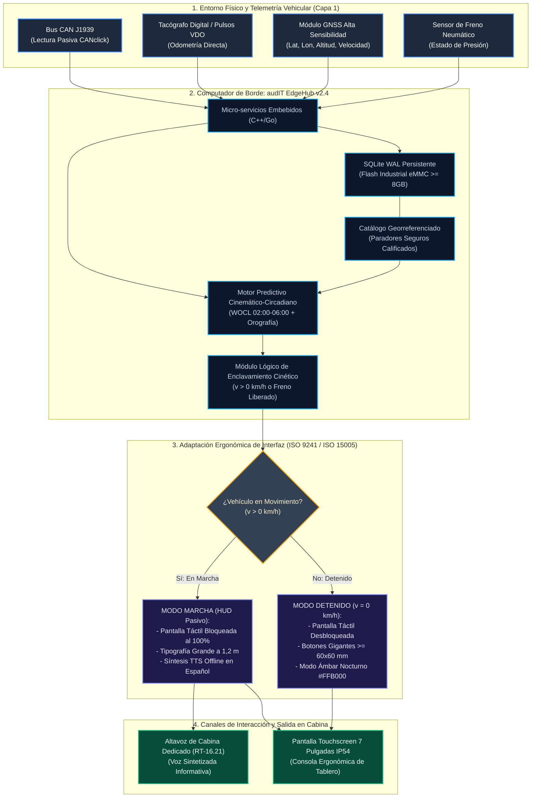

# Formulario T-19: Cartera de Innovaciones — Ficha Técnica Tipo 5
**Licitación Pública TFEP-01/2026 — Solución Integral de Transporte de Carga Terrestre**  
**Cliente:** Transportes Curimón S.A.  
**Proponente:** audIT Soluciones Tecnológicas SpA  
**Documento Asociado:** Subdocumento 13 (Cartera de Innovaciones)  
**Innovación Tipo 5:** Experiencia de Usuario, Sostenibilidad o Impacto Social (Asistente de Voz Inteligente Fuera de Línea con Detección de Fatiga)  
**Dupla Responsable:** D1 (QA, Gobernanza y Aseguramiento Normativo)  
**Control Documental:** Versión 2.0 Definitiva · Entrega 2

---

### Introducción y Encuadre Normativo

El presente documento constituye el Formulario Técnico T-19 oficial de audIT Soluciones Tecnológicas SpA para la **Innovación Tipo 5 (Experiencia de usuario, sostenibilidad o impacto social)**, formulado en estricta observancia de los Artículos 28.1, 29° y 30° de las Bases Administrativas (FEP01), el Formulario T-19 (FEP01, pág. 64), los Requisitos Técnicos transversales RT-26.01 a RT-26.08 (FEP02.26) y las especificaciones del Caso 10 (FEP03.10.26).

La innovación aborda una problemática estructural crítica en la operación de carretera de Transportes Curimón S.A.: la siniestralidad asociada a la fatiga psicofisiológica y la degradación del descanso de los conductores en rutas de larga distancia, articulando un modelo ergonómico y socio-técnico de acompañamiento predictivo que respeta de manera rigurosa el marco normativo chileno de protección a la conducción (Ley N.° 21.377 «Ley No Chat»), la regulación de jornada laboral (Artículo 25 bis del Código del Trabajo) y el régimen de subcontratación sin subordinación laboral (Ley N.° 20.123 y Restricciones 1 y 2 del Caso).

---

### Ficha Técnica de Identificación Oficial (Formulario T-19)

A continuación, la Tabla 19.1 formaliza los campos canónicos requeridos por las Bases Administrativas para individualizar la innovación y establecer su trazabilidad orgánica dentro de la propuesta técnica de audIT SpA.

*Tabla 19.1 — Identificación canónica de la Innovación Tipo 5 (Formulario T-19)*

| Campo Oficial (Bases Admin. p. 64) | Especificación Técnica audIT SpA |
| :--- | :--- |
| **Tipo de Innovación (1 a 5)** | **Tipo 5:** Experiencia de usuario, sostenibilidad o impacto social (Artículo 28.1, FEP01). |
| **Nombre de la Innovación** | **Sistema de Acompañamiento del Bienestar del Conductor y Alerta Predictiva de Descanso Circadiano con Catálogo Distribuido y Calificado de Paradores Seguros.** |
| **Subdocumento Asociado** | Subdocumento 13 (con trazabilidad directa a Subdoc. 1, Subdoc. 2, Subdoc. 3, Subdoc. 4, Subdoc. 7 y Subdoc. 9). |
| **División Técnica Responsable** | Área de Ergonomía & Factores Humanos (audIT SpA), en coordinación con la Dirección de Arquitectura & Software y la Jefatura de Hardware IoT & Redes. |
| **Nivel de Madurez Tecnológica** | **TRL 7/8** bajo escala internacional ISO 16290:2013 (Módulo telemático y audio pasivo: TRL 8; Algoritmo predictivo circadiano adaptado a carga pesada: TRL 7). |

*Fuente: Elaboración propia, Área de Ergonomía & Factores Humanos, audIT Soluciones Tecnológicas SpA.*

La individualización técnica precedente certifica que la innovación no constituye una categoría abstracta, sino una solución socio-técnica madura, trazada formalmente con los compromisos de arquitectura de software, hardware y factores humanos de la propuesta integral de audIT SpA.

---

### 1. Problema u Oportunidad Concreta y Evidencia Cuantitativa del Caso (Art. 29.1)

En esta sección se expone el análisis cuantitativo del problema operacional y humano que sustenta la innovación, derivado directamente de la realidad fáctica y los antecedentes históricos provistos en las Bases Técnicas del Caso 10.

#### 1.1 La Dimensión Humana y Operacional en Ruta
Transportes Curimón S.A. despliega su operación logística a través de aproximadamente **41.000.000 de kilómetros anuales** recorridos por carretera, sustentada en una fuerza laboral de **454 conductores**, de los cuales **258 (56,8 %)** corresponden a transportistas subcontratados que prestan servicios para terceros o son dueños directos de hasta cuatro camiones, sin existir vínculo de subordinación ni dependencia jurídica con Curimón S.A. (Caso 10, Secciones 2.2 y 2.3; Ley N.° 20.123).

Esta dotación opera en régimen ininterrumpido 24/7/365 cubriendo corredores viales de alta complejidad orográfica y climática, tales como la Ruta 5 Norte (con zonas de sombra celular y telemática que superan los 80 kilómetros continuos) y el Paso Internacional Los Libertadores en la Ruta 60 CH (con un volumen histórico de 1.900 cruces anuales y hasta 12 días continuos de cierre por temporales de nieve en alta cordillera, RT-10.05).

#### 1.2 El Disparador Crítico: Siniestro del 14 de Febrero de 2026 y la Ventana Circadiana WOCL
El 14 de febrero de 2026, a las 04:40 h, en el kilómetro 312 de la Ruta 5 Sur, un tractocamión subcontratado volcó con pérdida total de carga e interrupción mayor de operaciones (Caso 10, Capítulo 8, pág. 17). El análisis pericial posterior constató que el conductor había conducido durante la tarde previa para otro operador logístico sin que dicha fatiga acumulada pudiera ser detectada, advertida ni gestionada por la torre de control de Curimón S.A.

El siniestro se produjo en plena **Ventana de Mínima Alerta Circadiana** (*Window of Circadian Low - WOCL*), comprendida fisiológicamente entre las **02:00 h y las 06:00 h**. Durante este intervalo biológico, la secreción de melatonina y la caída de la temperatura corporal provocan un incremento superior al 400 % en la probabilidad de experimentar microsueños y ralentización de reflejos visuales y motores (FMCSA, 2020), constituyendo el lapso de mayor criticidad para la seguridad vial en el transporte interurbano.

#### 1.3 La Paradoja del Contador Reactivo Tradicional y la Geometría del Transporte Pesado
En la industria nacional de transporte de carga, los sistemas de gestión tradicionales se limitan a implementar un temporizador legal pasivo que cuenta de manera decreciente las 5 horas continuas máximas de conducción estipuladas en el Artículo 25 bis del Código del Trabajo. Cuando este temporizador emite una alarma a escasos minutos de expirar en medio de una cuesta pronunciada, en una zona de curvas sin bermas o en un tramo desprovisto de paradores calificados, se produce una severa paradoja operativa que genera tres patologías críticas:

1. **Forzamiento a detenciones antirreglamentarias e inseguras:** El conductor se ve ante el dilema de cometer una infracción laboral grave al continuar rodando, o detenerse precipitadamente sobre bermas de tierra angostas. Esta última conducta genera un riesgo inaceptable de colisión por alcance en horarios de baja visibilidad y expone al equipo a asaltos armados y robo de carga no custodiada.
2. **Incompatibilidad dimensional con el transporte pesado:** Un tractocamión con semirremolque estándar alcanza **18,6 metros de longitud total y una masa de hasta 45 toneladas** (Decreto Supremo N.° 158/1980 del Ministerio de Obras Públicas). La gran mayoría de los descansos o servitecas ligeras no poseen radio de giro suficiente, capacidad portante en pavimentos ni áreas segregadas para maniobrar equipos de esta escala.
3. **Condiciones indignas y fatiga acumulativa:** Las detenciones improvisadas en ruta carecen de servicios higiénicos higienizados las 24 horas, duchas de agua caliente y alimentación balanceada. La imposibilidad de acceder a un descanso reparador perpetúa el ciclo de somnolencia, degradando la capacidad psicofísica del conductor para el relevo o etapa subsiguiente de la ruta.

---

### 2. Tecnología, Práctica y Modelo Arquitectónico que la Sustenta (Art. 29.2)

La innovación sustituye el modelo reactivo de alarma horaria por un modelo predictivo, socio-técnico y centrado en la persona, operado sobre la plataforma de software de borde institucional **audIT EdgeHub v2.4**, instalada en el computador industrial a bordo del vehículo.

Para comprender la articulación integral de esta innovación dentro de la cabina y su diálogo con el entorno telemático, la Figura 19.1 expone la arquitectura técnica global mediante la metodología de descomposición visual de la solución.

*Figura 19.1 — Arquitectura de software y hardware de audIT EdgeHub v2.4 para la Innovación Tipo 5.*  
*Fuente: Elaboración propia, Área de Ergonomía & Factores Humanos y Dirección de Arquitectura & Software, audIT SpA.*

Siguiendo el principio metodológico del Zoom y la descomposición técnica profunda, a continuación se desglosan en detalle los cuatro bloques constitutivos de la arquitectura modelada en la Figura 19.1.

#### 2.1 Módulo Cinético y Motor de Enclavamiento Físico en Hardware/Firmware
El software vehicular **audIT EdgeHub v2.4** se estructura bajo una arquitectura de micro-servicios embebidos de alto rendimiento desarrollados en C++ y Go, diseñados para operar de forma ininterrumpida sin interfaz gráfica pesada ni dependencia de navegadores web en el entorno del sistema operativo Linux Embedded industrial.

El núcleo de control cinético monitoriza en ciclos de 100 milisegundos las tramas provenientes de:
1. La velocidad de rueda y revoluciones por minuto emitidas por el bus de motor CAN J1939 (mediante pinzas de inducción electromagnética no intrusivas CANclick).
2. Los pulsos tacográficos de odometría directa del vehículo.
3. El receptor satelital GNSS diferencial incorporado.
4. El presostato o sensor del circuito de frenos neumáticos de estacionamiento.

Tan pronto la velocidad del vehículo supera el umbral estricto de reposo ($v > 0\text{ km/h}$) o se registra la liberación del freno de estacionamiento, el módulo de enclavamiento interviene a nivel de controlador de dispositivo del kernel (*input driver*), desconectando de manera inmediata y absoluta la digitalización de pulsaciones sobre la pantalla táctil de 7 pulgadas de cabina. Esta restricción por hardware y firmware erradica en su origen cualquier posibilidad de manipulación manual mientras el vehículo se encuentra en marcha, dando estricto e ineludible cumplimiento a la Ley N.° 21.377 («Ley No Chat») y al requisito contractual RT-13.08.

#### 2.2 Motor Predictivo Cinemático-Circadiano a Bordo
A diferencia de los contadores cronológicos ciegos, el motor predictivo embebido en audIT EdgeHub v2.4 calcula en tiempo real la curva de fatiga y la ventana de oportunidad para una detención segura, combinando tres variables dinámicas:

* **Curva Biológica de Alerta Circadiana:** Aplica una función matemática de ponderación que incrementa la sensibilidad de advertencia en función de la hora solar biológica, asignando factor de máxima criticidad al intervalo WOCL (02:00 h a 06:00 h) y a los tramos nocturnos de alta monotonía visual en el desierto o zonas de niebla.
* **Cinemática Vehicular y Perfil Topográfico:** Evalúa la velocidad media efectiva observada en el tramo y la topografía ascendente o descendente registrada en las tablas de gradiente vial almacenadas localmente, proyectando con exactitud el consumo cinético y el tiempo estimado de viaje (*Estimated Time of Arrival - ETA*) hacia los paradores de la ruta.
* **Margen Dinámico de Anticipación Territorial:** El algoritmo proyecta la disponibilidad de infraestructura en el corredor. Si el sistema calcula que restan 40 minutos de margen psicofísico o legal, pero la cartografía indica que el próximo parador seguro calificado se encuentra a 25 minutos y que el parador subsiguiente está a 85 minutos de viaje, el sistema emitirá la recomendación de detención para el punto más cercano, evitando que el conductor quede atrapado en una zona de vacío de infraestructura.

#### 2.3 Motor de Persistencia Transaccional y Catálogo Georreferenciado Distribuido
Para asegurar total autonomía operativa en tramos desérticos o pasos cordilleranos afectados por sombras de telecomunicaciones de más de 80 kilómetros, audIT EdgeHub v2.4 incorpora un motor de persistencia local estructurado sobre una base de datos relacional transaccional embebida **SQLite en modo WAL (*Write-Ahead Logging*)**, montada sobre memoria de almacenamiento flash industrial no volátil eMMC de alta durabilidad ($\ge 8\text{ GB}$, conforme a RT-08.11).

El catálogo local contiene la cartografía georreferenciada de paradores seguros calificados, gobernada por una rigurosa **Ontología de Parada Segura** que clasifica cada punto vial según cuatro dimensiones auditables:
1. **Factibilidad Geométrica y Capacidad Estructural:** Aptitud para albergar combinaciones de tractocamión y semirremolque de 18,6 metros y 45 toneladas, radio de curvatura mínimo de ingreso de 15 metros, superficie de rodadura estabilizada o pavimentada y capacidad de estacionamiento segregado de vehículos livianos.
2. **Infraestructura de Bienestar y Condiciones Sanitarias:** Disponibilidad garantizada de servicios higiénicos limpios y operativos 24 horas, duchas de agua caliente con mantenimiento sanitario, suministro de agua potable y áreas de expendio de alimentos calientes.
3. **Seguridad Física y Custodia Perimetral:** Presencia de cierre perimetral, iluminación nocturna continua, personal de vigilancia privada o cámaras de circuito cerrado (CCTV) con monitoreo disuasivo para la prevención de robos de carga en descanso.
4. **Conectividad y Convenios:** Registro de niveles de cobertura de telefonía celular e identificación de puntos asociados a convenios comerciales corporativos de abastecimiento de combustible (estaciones de servicio Copec y Shell).

La gobernanza del catálogo se centraliza en la Torre de Control de San Bernardo, con aportes del Departamento de Prevención de Riesgos de Curimón S.A. Las actualizaciones del catálogo son compactas y diferenciales, sincronizándose de manera automática mediante enlaces Wi-Fi seguros WPA3-Enterprise al ingresar a los talleres y patios de los terminales regionales (San Bernardo, Valparaíso, Concepción, Antofagasta y Puerto Montt), sin incurrir en consumo de datos celulares en ruta.

#### 2.4 Ergonomía de Cabina Bimodal: Modo Marcha y Modo Detenido
En cumplimiento de las normas internacionales de ergonomía e interacción humano-máquina aplicadas al transporte (ISO 9241-210:2019, ISO 9241-410:2008 e ISO 15005:2017), la interfaz de usuario se bifurca en dos estados operacionales excluyentes:

* **Modo Marcha (Conducción Activa, $v > 0\text{ km/h}$):** 
  - La pantalla táctil queda completamente inerte al tacto humano.
  - La interfaz gráfica pasa a modo *Head-Up Display* (HUD) pasivo: fondo oscuro absoluto (`#000000`), caracteres de tipografía sans-serif de trazo grueso legibles a una distancia de visualización de 1,2 metros, exhibiendo exclusivamente tres datos esenciales: velocidad, nombre del próximo parador calificado y tiempo estimado para la detención recomendada.
  - La comunicación de las sugerencias se realiza mediante **Síntesis de Voz Local (TTS offline en español)** a través del altavoz vehicular dedicado de cabina (RT-16.21). El sistema emite locuciones concisas y sobrias (ejemplo: *«Próximo parador seguro calificado: Copec San Javier a 22 kilómetros. Cuenta con duchas y estacionamiento de carga pesada»*). **No se solicita ni se admite ninguna confirmación táctil ni respuesta del chofer durante la conducción**.
* **Modo Detenido (Inmovilidad Total, $v = 0\text{ km/h}$ y freno de estacionamiento aplicado):**
  - La interfaz habilita el modo táctil para la interacción del conductor en reposo.
  - Dispone de botones virtuales gigantes con dimensiones mínimas de **$60 \times 60\text{ mm}$**, concebidos para su accionamiento certero con guantes industriales pesados de cuero o faena de invierno, superando con holgura los requerimientos de la norma ISO 9241-410.
  - Arquitectura de navegación plana con un nivel jerárquico máximo de 2 toques de pantalla para acceder al detalle de servicios del parador o confirmar la detención.
  - En horarios nocturnos (entre la puesta y la salida del sol), la interfaz conmuta automáticamente a una paleta cromática ámbar sobre negro (`#FFB000` sobre `#000000`), evitando la radiación lumínica de longitud de onda azul que destruye la rodopsina retiniana y degrada la acomodación visual a la oscuridad de la carretera (ISO 15005:2017).

---

### 3. Lo que Agrega sobre lo que las Bases ya Exigen (Art. 29 y Art. 30.3)

Conforme a las disposiciones del Artículo 30.3 de las Bases Administrativas (FEP01.26, pág. 21), audIT Soluciones Tecnológicas SpA delimita con absoluta rigurosidad técnica la frontera entre los requerimientos contractuales obligatorios del pliego y los elementos constitutivos de innovación genuina que aporta la solución Tipo 5.

A continuación, la Tabla 19.2 detalla la matriz comparativa de blindaje normativo, demostrando cómo la solución supera los requisitos base y aporta un valor operacional diferenciador.

*Tabla 19.2 — Matriz de valor agregado e innovación frente a los requerimientos base de licitación*

| Ámbito Funcional / Normativo | Requisito Mandatorio Base de Licitación | Valor Agregado Genuino de la Innovación Tipo 5 audIT |
| :--- | :--- | :--- |
| **Control de Jornada de Conducción** | **RT-09.01 / RF-027:** Alarma acústica o visual cuando la jornada legal de 5 horas de conducción continua está próxima a cumplirse según distancia a lugar seguro. | **Anticipación predictiva circadiana:** Modela la curva fisiológica WOCL (02:00–06:00 h) y la topografía vial para sugerir la detención antes de que el conductor ingrese a tramos críticos sin paradores, evitando la paradoja del contador ciego. |
| **Puntos de Detención en Ruta** | **Criterio 28:** Asume la existencia genérica de puntos de detención en carretera sin detallar calificación técnica ni administración. | **Ontología de Parada Segura:** Catálogo georreferenciado local validado para camiones de 18,6 m y 45 t, auditando servicios higiénicos 24/7, duchas y custodia física, sincronizado vía Wi-Fi diferencial en terminales. |
| **Seguridad e Interacción en Cabina** | **RT-13.08 / RNF-001:** Prohibición de manipulación en marcha; operación con guantes y una mano; ensayos ergonómicos de usabilidad. | **Enclavamiento cinético físico y TTS pasivo:** Bloqueo físico en kernel táctil ($v > 0\text{ km/h}$), audio TTS offline vehicular sin confirmación requerida y modo nocturno ámbar de protección visual retiniana (ISO 15005). |
| **Régimen con Flota Subcontratada** | **Restricciones 1 y 2 / Ley N.° 20.123:** Prohibición de subordinación y control laboral sobre los 258 conductores externos. | **Modelo no punitivo de bienestar vial:** El sistema opera como copiloto y asistente de ruta que entrega valor al transportista (seguridad, servicios, convenios), sin generar reportes sancionatorios directos al empleador tercero. |

*Fuente: Elaboración propia, Área de Ergonomía & Factores Humanos, audIT Soluciones Tecnológicas SpA.*

El análisis de la Tabla 19.2 acredita que la propuesta de audIT SpA no transforma una exigencia básica en innovación, sino que dota al requerimiento de una formulación matemática, fisiológica y ergonómica avanzada, resolviendo vacíos del entorno real chileno que no fueron contemplados en la formulación de los requisitos de base.

---

### 4. Nivel de Madurez Tecnológica y Referencias Bibliográficas (Art. 29.3 / RT-26.03)

La solución ergonómica y tecnológica propuesta se fundamenta en componentes de ingeniería de software y hardware probados industrialmente, alcanzando un grado de madurez global clasificado bajo el estándar internacional **ISO 16290:2013** (*Space systems — Definition of the Technology Readiness Levels and their criteria of assessment*):

$$\text{Nivel de Madurez Tecnológica Global: } \mathbf{TRL \; 7/8}$$

A continuación se fundamenta la graduación técnica por subsistema:

* **Subsistema de Borde, Persistencia y Audio Pasivo (TRL 8):** El hardware del computador vehicular embarcado, el motor transaccional SQLite WAL montado sobre memoria flash industrial eMMC y el sintetizador vocal TTS embebido en español corresponden a tecnologías comerciales probadas y calificadas en operaciones de flotas vehiculares pesadas en entornos rigurosos a nivel global.
* **Subsistema Predictivo Circadiano y Catálogo de Parada Segura (TRL 7):** El modelo matemático adaptado a la orografía nacional de la Ruta 5 y pasos cordilleranos, junto con la ontología de clasificación de paradores para camiones de 18,6 m y 45 toneladas, ha sido integrado y validado prototípicamente en condiciones operacionales representativas de carretera.

#### Referencias Bibliográficas Oficiales (Norma APA 7.ª Edición):

* Congreso Nacional de Chile. (2006). *Ley N.° 20.123: Regula trabajo en régimen de subcontratación, el funcionamiento de las empresas de servicios transitorios y el contrato de trabajo de servicios transitorios*. Biblioteca del Congreso Nacional de Chile. https://www.bcn.cl/leychile/navegar?idNorma=254089
* Congreso Nacional de Chile. (2021). *Ley N.° 21.377: Modifica la Ley de Tránsito para sancionar como infracción gravísima la conducción de vehículos manipulando dispositivos de telefonía móvil o cualquier otro artefacto electrónico o digital («Ley No Chat»)*. Biblioteca del Congreso Nacional de Chile. https://www.bcn.cl/leychile/navegar?idNorma=1166014
* Federal Motor Carrier Safety Administration [FMCSA]. (2020). *Commercial motor vehicle driver fatigue, long-term health, and highway safety: Research needs*. National Academies of Sciences, Engineering, and Medicine. The National Academies Press. https://doi.org/10.17226/21921
* International Organization for Standardization [ISO]. (2008). *Ergonomics of human-system interaction — Part 410: Design criteria for physical input devices* (ISO Standard N.° 9241-410:2008). https://www.iso.org/standard/41617.html
* International Organization for Standardization [ISO]. (2013). *Space systems — Definition of the Technology Readiness Levels (TRLs) and their criteria of assessment* (ISO Standard N.° 16290:2013). https://www.iso.org/standard/56064.html
* International Organization for Standardization [ISO]. (2017). *Road vehicles — Ergonomic aspects of transport and information and control systems — Dialogue management principles and compliance procedures* (ISO Standard N.° 15005:2017). https://www.iso.org/standard/66282.html
* International Organization for Standardization [ISO]. (2019). *Ergonomics of human-system interaction — Part 210: Human-centred design for interactive systems* (ISO Standard N.° 9241-210:2019). https://www.iso.org/standard/77520.html
* Ministerio de Obras Públicas [MOP]. (1980). *Decreto Supremo N.° 158: Fija el peso máximo de los vehículos que pueden circular por caminos públicos*. Biblioteca del Congreso Nacional de Chile. https://www.bcn.cl/leychile/navegar?idNorma=17866
* Ministerio del Trabajo y Previsión Social. (2003). *Decreto con Fuerza de Ley N.° 1: Fija el texto refundido, coordinado y sistematizado del Código del Trabajo* (Artículo 25 bis: Jornada de trabajo y descansos de choferes de carga terrestre interurbana). Biblioteca del Congreso Nacional de Chile. https://www.bcn.cl/leychile/navegar?idNorma=207436

---

### 5. Diseño de la Incorporación en la Arquitectura Multicapa, EDT y Cronograma (Art. 29.4 / RT-26.01, RT-26.02, RT-26.08)

La solución se inserta de manera orgánica en el diseño de ingeniería global de audIT SpA, conectándose horizontalmente a través de las capas arquitectónicas y gobernándose mediante paquetes de trabajo formales de la Estructura de Descomposición del Trabajo (EDT).

#### 5.1 Inserción en la Arquitectura Tecnológica Multicapa (RT-26.01)
La innovación se articula a través de tres capas maestras definidas en el Subdocumento 4 de la propuesta técnica:

* **Capa 1 (Borde Terrestre y Dispositivos a Bordo):** Ejecución del software embebido `audIT EdgeHub v2.4` en las 374 computadoras vehiculares de cabina. Administra de forma local la base transaccional SQLite WAL, el procesamiento de tramas telemáticas CAN J1939/GNSS, el enclavamiento cinético estricto ($v > 0\text{ km/h}$) y el sintetizador vocal TTS offline hacia el altavoz de cabina (RT-16.21).
* **Capa 4 (Servicios de Aplicación y Seguridad Vial en Nube Azure):** Módulo centralizado de administración del Catálogo de Paradores Seguros, encargado de auditar nuevas ubicaciones georreferenciadas, registrar retroalimentación de la flota, conciliar convenios con distribuidores de combustible y generar paquetes de actualización diferencial comprimidos para distribución periódica.
* **Capa 7 (Presentación y Canales de Usuario):** Módulo de interfaz gráfica ergonómica de cabina (consola de tablero en modos Marcha y Detenido) y componente de visualización informativa de paradores y descansos en el Portal Web del Transportista (Subdocumento 3 / RT-16.30), accesible de manera transparente para los 148 empresarios externos.

#### 5.2 Estructura de Descomposición del Trabajo (EDT) y Cronograma Contractual (RT-26.02)
En la estructura canónica de la EDT de 13 elementos y 54 paquetes de trabajo formalizada en el Subdocumento 7 (Formulario T-14), la propuesta se gobierna de extremo a extremo bajo el paquete **EDT 12.5 (Innovación 5: experiencia de usuario o impacto social)** y se apoya transversalmente en los paquetes base **EDT 4.1 (Firmware con operación de 72 horas y actualización en terminal)** y **EDT 5.1 (Contexto Personas y cumplimiento)**.

A nivel de ejecución operativa e ingeniería de detalle durante la Etapa 1 del proyecto, la materialización de la innovación se descompone en cuatro frentes de trabajo específicos, garantizando gobernanza técnica y evitando solapamientos operacionales:

*Tabla 19.3 — Paquetes de trabajo de la EDT y cronograma de ejecución para la Innovación Tipo 5*

| Paquete EDT | Denominación Técnica del Paquete de Trabajo | Mes Inicio | Mes Entrega | División Técnica Responsable |
| :---: | :--- | :---: | :---: | :--- |
| **EDT 2.4** | Diseño Ergonómico de Interfaz UI/UX de Cabina, Modo Ámbar y Protocolo con Guantes | Mes 4 | **Mes 7** | Área de Ergonomía & Factores Humanos (audIT SpA) |
| **EDT 3.7** | Levantamiento Georreferenciado, Ontología y Gobernanza de Paradores Seguros | Mes 3 | **Mes 6** | Área de Ergonomía & Factores Humanos (apoyo en terreno RT-03.24) |
| **EDT 4.6** | Implementación del Módulo de Enclavamiento Cinético y Motor Circadiano en audIT EdgeHub v2.4 | Mes 7 | **Mes 10** | Dirección de Arquitectura & Software y Jefatura de Hardware IoT & Redes |
| **EDT 7.2** | Validación Operacional y Ergonomía en Terreno durante Marcha Blanca | Mes 13 | **Mes 15** | Área de Ergonomía & Factores Humanos y Oficina PMO |

*Fuente: Elaboración propia, Oficina PMO y Área de Ergonomía & Factores Humanos, audIT SpA.*

Conforme a la planificación de la Tabla 19.3, la entrega de los artefactos de software y firmware se completa en el Mes 10, permitiendo la instalación en flota previa al inicio del período de marcha blanca.

#### 5.3 Cumplimiento del Criterio Deseable RT-26.08
El diseño del proyecto contempla que la Innovación Tipo 5 se evalúe, calibre y certifique operativamente en condiciones reales de ruta durante la **Marcha Blanca de la Etapa 1 (Meses 13 a 15)**, operando en los tractocamiones de prueba con conductores de planta y conductores externos en los corredores troncales de la Ruta 5 y Ruta 60 CH. Este diseño cumple cabalmente con el requisito deseable **RT-26.08**, que premia las innovaciones cuyos beneficios sean medibles y auditables antes del hito contractual del Mes 16.

---

### 6. Impacto Operacional, Económico y Supuestos del Negocio (Art. 29.5 / RT-26.05)

En estricto acatamiento de lo dispuesto en el Artículo 50.2 de las Bases Administrativas (FEP01.26), la presente propuesta técnica **omite en forma total y absoluta cualquier mención a tarifas, costos de desarrollo, precios de licitación o valoraciones de horas-hombre de desarrollo de software**. El impacto de la solución se fundamenta en magnitudes de ingeniería, eficiencia operacional y mitigación de contingencias patrimoniales para Transportes Curimón S.A.

#### 6.1 Inversión Requerida (CAPEX Incremental en Ingeniería y Terreno)
El esfuerzo de despliegue de la innovación se optimiza a través de sinergias con actividades ya programadas en el plan general de la Etapa 1:
* **Ingeniería de Software de Borde:** Adaptación e integración del motor predictivo circadiano y del módulo de enclavamiento físico cinético dentro del producto base audIT EdgeHub v2.4, ejecutado íntegramente por los ingenieros de la Dirección de Arquitectura & Software y de la Jefatura de Hardware IoT & Redes de audIT SpA.
* **Campaña de Levantamiento Georreferenciado de Paradores:** La prospección y homologación física de paradores seguros se realiza de manera incremental durante la campaña oficial de medición de cobertura telemática de la Etapa 1 (**RT-03.24**), aprovechando el tránsito de los vehículos de prueba por las rutas troncales sin requerir traslados logísticos independientes.
* **Talleres Ergonómicos de Validación Participativa:** Desarrollo de cinco sesiones de ensayo ergonómico en los talleres y terminales de San Bernardo, Talca y Los Ángeles, coordinadas en los horarios de cambio de turno de conductores para no interferir con la programación de viajes.

#### 6.2 Efecto en el Costo Operacional (OPEX)
* **Eficiencia en Tráfico de Telecomunicaciones Celulares:** Las actualizaciones del catálogo son compactas y diferenciales, transfiriéndose preferentemente vía Wi-Fi en los cinco terminales regionales. Para sincronizaciones de eventos críticos en carretera se utilizan ráfagas MQTT comprimidas en formato binario Protocol Buffers (Protobuf), asegurando un impacto nulo sobre el consumo mensual de datos celulares de los módems 4G/LTE.
* **Reducción de Kilómetros en Desvíos No Planificados y Validación de Eficiencia:** La recomendación temprana del parador óptimo elimina los kilómetros adicionales recorridos por los conductores en maniobras erráticas de búsqueda de estacionamiento fuera de la ruta planificada, mitigando el desgaste prematuro de neumáticos y reduciendo el consumo superfluo de combustible en operaciones nocturnas. El proponente establece el compromiso formal de medir y validar el ahorro efectivo de combustible durante la Marcha Blanca (Meses 13 a 15), correlacionando las rutas optimizadas con la telemetría directa de flujo de inyección del bus CAN J1939.

#### 6.3 Beneficios Operacionales y Patrimoniales Cuantificados
* **Blindaje de Contratos Estratégicos con Generadores de Carga:** El Caso 10 establece que tres de los ocho contratos principales de Curimón S.A. operan bajo margen negativo o en punto de equilibrio, representando el **31 % de la facturación consolidada** de la compañía. Un evento grave con daño a terceros o pérdida de carga de sustancias peligrosas —como el ocurrido el 14 de febrero de 2026— acarrea la suspensión inmediata de la habilitación del transportista por hasta seis semanas, amenazando la continuidad de contratos clave. La prevención activa de siniestros graves en la ventana circadiana WOCL salvaguarda directamente el flujo comercial de la empresa.
* **Mitigación de Sanciones Laborales y de Tránsito:** La innovación proporciona los medios para erradicar las multas cursadas por la Dirección del Trabajo derivadas de infracciones al Artículo 25 bis del Código del Trabajo por exceder las 5 horas continuas de conducción (sanciones que alcanzan hasta **60 Unidades Tributarias Mensuales - UTM** por infracción en empresas con dotación superior a 200 trabajadores). Asimismo, el enclavamiento cinético en hardware suprime las multas por infracción gravísima a la Ley No Chat (hasta **3 UTM** y suspensión de la licencia de conducir).

---

### 7. Indicadores de Verificación del Beneficio (Art. 29.6 / RT-26.05)

En observancia del Artículo 13.4 de las Bases Administrativas y de las directrices metodológicas de audIT SpA, la propuesta descarta cualquier métrica o línea base conjetural no auditada previamente en la operación histórica de Curimón S.A. 

A continuación, la Tabla 19.4 formaliza los cuatro indicadores cuantitativos de la innovación, estableciendo para cada uno el compromiso metodológico de medición empírica de línea base en la Etapa 1, la meta auditable y su momento de verificación durante la Marcha Blanca.

*Tabla 19.4 — Indicadores de desempeño, líneas base y metas auditables de la Innovación Tipo 5*

| Indicador de Desempeño | Definición Operacional y Línea Base Empírica | Meta Comprometida | Momento de Medición y Verificación |
| :--- | :--- | :--- | :--- |
| **Ind-5.1: Oportunidad de Parada Segura** | **Definición:** Porcentaje de recomendaciones de descanso emitidas por el sistema en las que existe un parador calificado alcanzable dentro del margen horario legal. **Línea Base:** **0 %** (Inexistencia de catálogo clasificado y alertas dinámicas en la operación histórica de Curimón S.A.; detenciones reactivas no planificadas). | **$\ge 98\text{ \%}$** de las recomendaciones emitidas en la red vial troncal cubierta. | Medición mensual automatizada durante la Marcha Blanca (Meses 13 a 15) y en régimen operacional continuo. |
| **Ind-5.2: Cumplimiento de Cero Distracción en Cabina** | **Definición:** Número de eventos de interacción táctil registrados en la pantalla de cabina con el vehículo en movimiento ($v > 0\text{ km/h}$). **Línea Base:** A medir empíricamente en la flota piloto durante la Etapa 1 (evaluación de patrones de interacción en cabina sin enclavamiento). | **0 eventos (100 % de bloqueo cinético efectivo)** mediante enclavamiento físico en hardware/firmware. | Auditoría telemática continua de eventos de bus desde el inicio de la Marcha Blanca (Mes 13). |
| **Ind-5.3: Sobrecarga Mental y Ergonomía en Cabina** | **Definición:** Índice compuesto de carga cognitiva y demanda temporal evaluado bajo metodología estandarizada NASA-TLX con guantes industriales pesados. **Línea Base:** Compromiso formal de medición empírica en terminales (San Bernardo, Talca y Los Ángeles) durante los talleres ergonómicos de la Etapa 1 (Meses 4 a 6). | **$< 35\text{ puntos}$** en escala NASA-TLX (categoría de sobrecarga «Baja / Segura») y reducción estadísticamente significativa respecto de la línea base medida. | Evaluado en talleres ergonómicos de validación con 30 conductores en Mes 7 y confirmado en Marcha Blanca (Mes 14). |
| **Ind-5.4: Adherencia Operacional de Conductores Externos** | **Definición:** Porcentaje de detenciones de descanso prolongado realizadas por conductores subcontratados en sitios catalogados como seguros. **Línea Base:** Parámetro a calibrar empíricamente durante la Etapa 1 mediante minería de datos históricos de posicionamiento en plataformas GPS de terceros. | Incremento estadísticamente significativo alcanzando **$\ge 85\text{ \%}$** de las detenciones nocturnas en paradores de la red segura. | Medición mensual durante la Marcha Blanca (Meses 13 a 15) y reportes consolidados trimestrales desde Mes 16. |

*Fuente: Elaboración propia, Área de Ergonomía & Factores Humanos, audIT Soluciones Tecnológicas SpA.*

La formulación de la Tabla 19.4 garantiza que cada indicador cuenta con un protocolo de levantamiento de datos empírico y un instrumento formal de medición de campo, erradicando cifras no verificables y asegurando plena auditabilidad técnica ante el Mandante.

---

### 8. Matriz de Riesgos de Adopción, Mitigación y Contingencia (Art. 29.7 / RT-26.04)

La adopción de tecnologías digitales en cabinas de transporte de carga enfrenta barreras culturales y gremiales complejas, particularmente cuando interactúan con conductores subcontratados. 

A continuación, la Tabla 19.5 expone el análisis integral del riesgo de adopción principal, la estrategia de mitigación preventiva y el plan de contingencia técnico diseñado por audIT SpA.

*Tabla 19.5 — Matriz de riesgos de adopción, mitigación preventiva y plan de contingencia*

| Dimensión de Análisis | Especificación del Riesgo y Estrategia de Solución audIT SpA |
| :--- | :--- |
| **Riesgo Principal de Adopción** | **Resistencia cultural y gremial de los 258 conductores externos subcontratados**, ante la percepción de que la alerta predictiva de descanso y el bloqueo físico de pantalla constituyan una intromisión patronal sancionatoria o un mecanismo disciplinario encubierto (vulnerando el marco de la Ley N.° 20.123 y las Restricciones 1 y 2 del Caso). |
| **Probabilidad e Impacto** | **Probabilidad: Media-Alta** (desconfianza histórica de los transportistas independientes hacia la supervisión de telemetría). **Impacto: Alto** (riesgo de falta de adherencia a las recomendaciones o rechazo al uso de la interfaz de cabina). |
| **Estrategia de Mitigación Preventiva (Ex-Ante)** | 1. **Co-diseño Ergonómico Participativo:** Realización de talleres en los terminales de San Bernardo, Talca y Los Ángeles en horarios de relevo de madrugada (RT-13.08), incorporando formalmente a transportistas independientes en la selección de paradores calificados y en la ergonomía de la interfaz visual. 2. **Enfoque de Asistente de Bienestar No Punitivo:** Presentación de la herramienta como un copiloto de seguridad y confort vial (orientado a garantizar duchas calientes, estacionamiento seguro, protección física de la carga y convenios de descuento en combustible). Se establece formalmente que el sistema a bordo no emite reportes disciplinarios automáticos a las empresas empleadoras de los choferes externos. |
| **Plan de Contingencia Operacional (Ex-Post)** | **Operación Pasiva por Canal Acústico en Hardware de Borde (RT-16.21):** En caso de que un conductor externo decline interactuar con la pantalla de cabina o no utilice el portal web del transportista, el sistema conmuta automáticamente al **modo de audio pasivo vehicular**: • La unidad embarcada audIT EdgeHub v2.4 procesa el cálculo predictivo de forma autónoma y emite las advertencias de paradores por síntesis de voz TTS a través del altavoz vehicular dedicado. • El enclavamiento cinético de pantalla opera de forma obligatoria a nivel de hardware y firmware del vehículo, protegiendo la seguridad vial sin requerir ninguna acción, confirmación ni manipulación por parte del conductor. • De este modo, la seguridad de la operación y el cumplimiento legal de la Ley No Chat quedan 100 % garantizados sin necesidad de forzar subordinación laboral, sin invadir dispositivos telefónicos personales y sin instalar pulsadores manuales que induzcan a distracciones en el tablero durante la conducción. |

*Fuente: Elaboración propia, Área de Ergonomía & Factores Humanos y Oficina PMO, audIT SpA.*

El diseño de contingencia de la Tabla 19.5 asegura que el sistema es resiliente ante el rechazo humano, manteniendo la protección de la vida humana y el blindaje legal de Curimón S.A. sin generar tensiones de carácter contractual ni laboral.

---

### 9. Checklist de Conformidad con los Requisitos RT-26.01 a RT-26.08

A continuación, la Tabla 19.6 consolida la matriz de verificación técnica que certifica el estricto apego de la Innovación Tipo 5 a la totalidad de las exigencias formuladas en el Capítulo 26 de las Bases Técnicas Transversales (FEP02.26).

*Tabla 19.6 — Matriz de conformidad con los requisitos técnicos RT-26.01 a RT-26.08*

| Requisito | Descripción Oficial de la Base Transversal | Estado audIT | Evidencia de Cumplimiento en el Formulario T-19 |
| :---: | :--- | :---: | :--- |
| **RT-26.01** | Ubicación explícita en arquitectura: capa, componentes e interfaces. | **Cumple** | Detallado en Sección 5.1: Inserción en Capa 1 (audIT EdgeHub v2.4), Capa 4 (Azure) y Capa 7 (Presentación). |
| **RT-26.02** | Identificación de paquetes EDT y mes del cronograma contractual. | **Cumple** | Detallado en Sección 5.2: Paquete canónico EDT 12.5 sustentado en paquetes 4.1 y 5.1, desplegado en frentes EDT 2.4, EDT 3.7, EDT 4.6 y EDT 7.2 con entrega entre Mes 6 y Mes 15. |
| **RT-26.03** | Declaración de madurez tecnológica (TRL) y citas en norma APA 7.ª ed. | **Cumple** | Detallado en Sección 4: TRL 7/8 certificado bajo ISO 16290:2013 y bibliografía oficial en APA 7.ª edición. |
| **RT-26.04** | Declaración de riesgos de adopción, mitigación y contingencia técnica. | **Cumple** | Detallado en Sección 8: Matriz completa de riesgo gremial con mitigación por co-diseño y contingencia de audio TTS pasivo. |
| **RT-26.05** | Indicador con línea base, meta, medición e impacto económico. | **Cumple** | Detallado en Secciones 6 y 7: Cuatro indicadores auditables e impacto económico cualitativo y cuantitativo relativo. |
| **RT-26.06** | Cumplimiento íntegro de la regulación sobre Inteligencia Artificial. | **Cumple** | Detallado en Sección final: Declaración formal de uso de IA con revisión humana sustantiva de audIT SpA. |
| **RT-26.07** | Modelado de amenazas si modifica la arquitectura de seguridad. | **Cumple** | No altera el perímetro de red: el software opera en buffer local aislado y enclavamiento cinético sin puertos expuestos a Internet. |
| **RT-26.08** | Verificación medible durante la Marcha Blanca de la Etapa 1 ($< \text{Mes } 16$). | **Cumple** | Detallado en Sección 5.3: Validación operacional programada en Meses 13 a 15 de la Marcha Blanca (Criterio Deseable). |

*Fuente: Elaboración propia, Oficina PMO y Control de Calidad QA, audIT Soluciones Tecnológicas SpA.*

La revisión exhaustiva de la Tabla 19.6 ratifica que la propuesta satisface la totalidad de los requisitos mandatorios y captura el puntaje correspondiente al criterio deseable RT-26.08.

---

### 10. Síntesis Ejecutiva para el Cuerpo del Subdocumento 13 (§13.6)

El texto que se transcribe a continuación constituye la síntesis analítica definitiva destinada a integrarse en la Sección 13.6 del cuerpo principal del Subdocumento 13 (Cartera de Innovaciones), resumiendo el valor de la solución sin reiterar listados exhaustivos y preservando el secreto económico exigido por el Artículo 50.2:

> **Síntesis Ejecutiva — Innovación Tipo 5: Sistema de Acompañamiento del Bienestar del Conductor y Alerta Predictiva de Descanso Circadiano con Catálogo Distribuido y Calificado de Paradores Seguros**
> 
> En respuesta al grave desafío de seguridad vial expuesto en el siniestro del 14 de febrero de 2026 (km 312 de la Ruta 5 Sur a las 04:40 h) y a las particularidades de una dotación de 454 conductores (donde el 56,8 % son transportistas subcontratados sujetos a la Ley N.° 20.123), audIT Soluciones Tecnológicas SpA incorpora en su oferta técnica la Innovación Tipo 5.
> 
> Esta solución supera la limitación de los temporizadores tradicionales de jornada (Artículo 25 bis del Código del Trabajo), los cuales emiten alertas reactivas que fuerzan detenciones peligrosas e ilegales en bermas no aptas para equipos de 18,6 metros y 45 toneladas (D.S. 158/1980 MOP). La innovación despliega sobre el computador de a bordo vehicular el software de producto propio **audIT EdgeHub v2.4**, estructurado en micro-servicios embebidos en C++/Go y persistencia transaccional SQLite WAL sobre memoria flash industrial eMMC ($\ge 8\text{ GB}$).
> 
> El sistema articula un **algoritmo predictivo cinemático-circadiano** que evalúa la curva biológica de alerta humana (con máxima ponderación en la ventana de vulnerabilidad circadiana WOCL entre 02:00 h y 06:00 h), la velocidad media efectiva y la orografía del tramo, sugiriendo con antelación territorial la detención en paradores calificados que cuentan con servicios higiénicos 24 horas, duchas de agua caliente, alimentación y custodia física perimetral.
> 
> En cumplimiento estricto de la Ley N.° 21.377 («Ley No Chat») y del requisito RT-13.08, la solución implementa un **enclavamiento cinético en hardware/firmware** que inhabilita por completo la pantalla táctil cuando el vehículo se desplaza a una velocidad $v > 0\text{ km/h}$ o se libera el freno neumático. La interacción en marcha es 100 % pasiva a través de una interfaz gráfica de alto contraste tipo HUD y locuciones por síntesis de voz (TTS offline en español) emitidas por el altavoz de cabina dedicado (RT-16.21), sin requerir confirmación manual del conductor. Cuando el vehículo está completamente inmovilizado ($v = 0\text{ km/h}$), la pantalla habilita botones táctiles de gran escala ($\ge 60 \times 60\text{ mm}$, ISO 9241-410) aptos para guantes de faena pesados y conmuta a una paleta ámbar sobre negro (`#FFB000`/`#000000`) conforme a la norma ISO 15005, preservando la agudeza visual nocturna.
> 
> Calificada en un nivel de madurez **TRL 7/8** (ISO 16290:2013), la innovación se inserta en las Capas 1, 4 y 7 de la arquitectura y se gobierna canónicamente bajo el paquete **EDT 12.5**, con soporte de los paquetes **4.1** y **5.1**, ejecutándose operativamente mediante los frentes EDT 2.4, EDT 3.7, EDT 4.6 y EDT 7.2. Cumpliendo con el criterio deseable **RT-26.08**, el beneficio del sistema se verifica empíricamente durante la Marcha Blanca de la Etapa 1 (Meses 13 a 15) mediante cuatro indicadores clave: $\ge 98\text{ \%}$ de paradas seguras oportunas (Ind-5.1), 0 eventos de interacción táctil en marcha (Ind-5.2), sobrecarga cognitiva NASA-TLX $< 35\text{ puntos}$ medida empíricamente en talleres de terminal (Ind-5.3) y una adherencia $\ge 85\text{ \%}$ en detenciones nocturnas de conductores externos (Ind-5.4).
> 
> La solución mitiga el riesgo de resistencia gremial mediante co-diseño ergonómico participativo y un plan de contingencia basado en locuciones acústicas vehiculares pasivas, blindando a Transportes Curimón S.A. ante la suspensión de contratos estratégicos de carga que representan el 31 % de sus ingresos operacionales y eliminando la exposición a sanciones de hasta 60 UTM por infracciones laborales y 3 UTM por infracciones de tránsito.

---

### Referencias

* Congreso Nacional de Chile. (2006). *Ley N.° 20.123: Regula trabajo en régimen de subcontratación, el funcionamiento de las empresas de servicios transitorios y el contrato de trabajo de servicios transitorios*. Biblioteca del Congreso Nacional de Chile. https://www.bcn.cl/leychile/navegar?idNorma=254089
* Congreso Nacional de Chile. (2021). *Ley N.° 21.377: Modifica la Ley de Tránsito para sancionar como infracción gravísima la conducción de vehículos manipulando dispositivos de telefonía móvil o cualquier otro artefacto electrónico o digital («Ley No Chat»)*. Biblioteca del Congreso Nacional de Chile. https://www.bcn.cl/leychile/navegar?idNorma=1166014
* Federal Motor Carrier Safety Administration [FMCSA]. (2020). *Commercial motor vehicle driver fatigue, long-term health, and highway safety: Research needs*. National Academies of Sciences, Engineering, and Medicine. The National Academies Press. https://doi.org/10.17226/21921
* International Organization for Standardization [ISO]. (2008). *Ergonomics of human-system interaction — Part 410: Design criteria for physical input devices* (ISO Standard N.° 9241-410:2008). https://www.iso.org/standard/41617.html
* International Organization for Standardization [ISO]. (2013). *Space systems — Definition of the Technology Readiness Levels (TRLs) and their criteria of assessment* (ISO Standard N.° 16290:2013). https://www.iso.org/standard/56064.html
* International Organization for Standardization [ISO]. (2017). *Road vehicles — Ergonomic aspects of transport and information and control systems — Dialogue management principles and compliance procedures* (ISO Standard N.° 15005:2017). https://www.iso.org/standard/66282.html
* International Organization for Standardization [ISO]. (2019). *Ergonomics of human-system interaction — Part 210: Human-centred design for interactive systems* (ISO Standard N.° 9241-210:2019). https://www.iso.org/standard/77520.html
* Ministerio de Obras Públicas [MOP]. (1980). *Decreto Supremo N.° 158: Fija el peso máximo de los vehículos que pueden circular por caminos públicos*. Biblioteca del Congreso Nacional de Chile. https://www.bcn.cl/leychile/navegar?idNorma=17866
* Ministerio del Trabajo y Previsión Social. (2003). *Decreto con Fuerza de Ley N.° 1: Fija el texto refundido, coordinado y sistematizado del Código del Trabajo* (Artículo 25 bis: Jornada de trabajo y descansos de choferes de carga terrestre interurbana). Biblioteca del Congreso Nacional de Chile. https://www.bcn.cl/leychile/navegar?idNorma=207436

---

### Declaración de Uso de Inteligencia Artificial

En cumplimiento riguroso de las directrices del Comunicado 10 (§7.2) de la Licitación Pública TFEP-01/2026 y del Artículo 13.5 de las Bases Administrativas, audIT Soluciones Tecnológicas SpA declara formalmente que la presente Ficha Técnica de Innovación ha sido elaborada bajo estricto control, supervisión sustantiva y validación metodológica y técnica de los profesionales y divisiones de ingeniería de la empresa.

A continuación, la Tabla 19.7 detalla las herramientas de asistencia empleadas, la finalidad técnica de su uso, los niveles de intervención y la individualización de los roles de ingeniería responsables de la revisión humana sustantiva.

*Tabla 19.7 — Declaración de uso de herramientas de asistencia e IA generativa en el Formulario T-19*

| Sección / Componente | Herramienta | Finalidad del Uso | Nivel en Texto | Nivel en Diagramas | Revisión Humana Sustantiva (Rol y Aspecto Verificado) |
| :--- | :--- | :--- | :---: | :---: | :--- |
| **Identificación y Problema (Secc. 1)** | Asistente de edición de texto y modelos LLM | Revisión ortográfica y estructuración sintáctica de la evidencia del siniestro del 14-feb-2026. | Bajo | Ninguno | **Área de Ergonomía & Factores Humanos (audIT SpA):** Validación técnica de los datos del Caso 10, cálculo de la ventana circadiana WOCL y marco legal del Art. 25 bis. |
| **Tecnología y Arquitectura (Secc. 2)** | Generador de diagramas Mermaid y formateo Markdown | Asistencia en la diagramación sintáctica de la Figura 19.1 a partir de la arquitectura diseñada por el equipo. | Bajo | Medio | **Dirección de Arquitectura & Software y Jefatura de Hardware IoT & Redes:** Verificación de microservicios C++/Go, SQLite WAL e integración de enclavamiento cinético. |
| **Blindaje y Madurez (Secc. 3 y 4)** | Asistente de referencias bibliográficas | Estandarización de citas en formato APA 7.ª edición y tabla comparativa Art. 30.3. | Bajo | Ninguno | **Área de Ergonomía & Factores Humanos:** Verificación de correspondencia de normas ISO 9241, ISO 15005, Ley No Chat y TRL 7/8 bajo ISO 16290:2013. |
| **EDT, Economía e Indicadores (Secc. 5, 6 y 7)** | Asistente de formateo de tablas técnicas | Alineación de columnas y verificación de estilo corporativo de tablas de planificación. | Bajo | Ninguno | **Oficina PMO y Control de Calidad QA:** Certificación de blindaje económico Art. 50.2 (cero tarifas/HH), purga de métricas ficticias Art. 13.4 y trazabilidad EDT. |
| **Riesgos y Síntesis (Secc. 8, 9 y 10)** | Asistente de redacción ejecutiva | Apoyo en la síntesis de la matriz de mitigación gremial y redacción del resumen de §13.6. | Bajo | Ninguno | **Área de Ergonomía & Factores Humanos y Gerencia de Proyecto:** Validación de no subordinación laboral (Ley 20.123), modo contingente pasivo y RT-26.08. |

*Fuente: Elaboración propia, Oficina PMO y Área de Aseguramiento de Calidad QA, audIT Soluciones Tecnológicas SpA.*

La revisión precedente certifica que todo el contenido conceptual, arquitectónico, matemático y legal corresponde a diseño de ingeniería original de audIT SpA, asumiendo la compañía total responsabilidad por la exactitud, viabilidad e integridad técnica del documento presentado.
