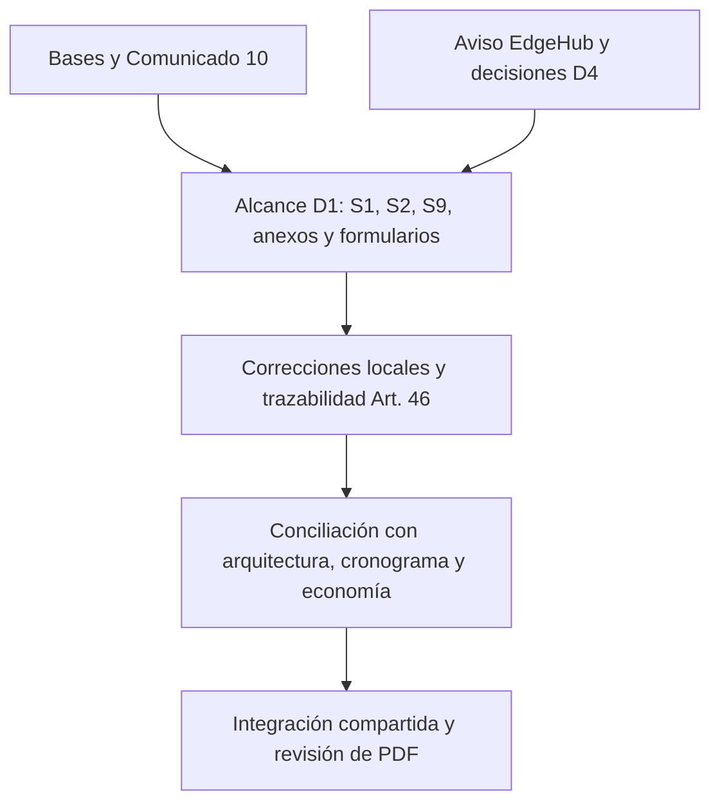

# Plan de revisión D1 — Entrega 2 y aviso EdgeHub

Fecha de evaluación: 09-10-2026. Documento interno de planificación; no forma parte de la oferta ni debe compilarse como subdocumento.

Organización actual: los documentos Markdown están en `../subdocs/` y este plan en `orden_personal/`. Las rutas de etapas anteriores que citan archivos directamente en `Informe-2/d1/` deben entenderse ahora bajo `Informe-2/d1/subdocs/`. Las copias S3/S4/S5/T-11/T-12 conservan carácter de referencia de otras duplas.

## 1. Dictamen y alcance

Las correcciones documentales locales de cobertura, bloqueo administrativo, FOTA, perfil de carga, controles de calidad y jerarquía editorial fueron aplicadas el 09-10-2026. Las seis correcciones centrales del aviso EdgeHub se conservan. No se declara cierre total: la observación 97 requiere el modelo económico y su valorización; los ensayos, la revisión humana y la integración de esta nueva versión en el formato compartido/PDF requieren evidencia propia.

Había modificaciones previas en el repositorio. Para esta ejecución se respaldó el estado inicial de los diez documentos autorizados y se compararon huellas del resto. Esta sesión modifica siete documentos de contenido D1 y este plan interno. No modifica `recursos/`, archivos de D2/D3/D4, economía ni las copias de S3/S4/S5/T-11/T-12 dentro de `d1/`. Las correcciones anteriores al respaldo no se atribuyen a esta ejecución.

La titularidad se extrae del plan maestro §1.1 y §3.1; la ficha T-19 tipo 5 se incorpora por la asignación explícita del aviso D4. La ubicación física en `d1/` no concede titularidad sobre otros capítulos.

## 2. Lista cerrada de documentos modificables

Las rutas siguientes son relativas a `Informe-2/d1/subdocs/`. Son los diez documentos de contenido incluidos en el alcance; este plan es un archivo interno adicional. La modificación de cada documento dependerá de un hallazgo, no de su sola inclusión.

| Archivo | Titularidad y uso | Entregable relacionado |
|---|---|---|
| `subdocumento_01_empresa_adaptado.md` | S1; definición EdgeHub, organización y capacidades | AUDIT-Subdocumento1.pdf |
| `subdocumento_01_anexos.md` | Anexo institucional de S1; coherencia de certificación | Anexo 1.A de S1; comprobar empaquetado |
| `formulario_t06_experiencia_oferente.md` | Experiencia del oferente asignada en el maestro | AUDIT-Formulario-T-6.pdf |
| `subdocumento_02_problema_adaptado.md` | S2; diagnóstico, restricciones y supuestos | AUDIT-Subdocumento2.pdf |
| `subdocumento_02_anexos.md` | Catálogos, flota, actores y decisiones de S2 | AUDIT-Subdocumento2-Anexos.pdf |
| `Tabla-Art46-Informe2.md` | Consolidación transversal de respuestas; no autoriza editar capítulos ajenos | Tabla-Art46-Informe2.pdf |
| `subdocumento_09_calidad_adaptado.md` | S9; calidad, aseguramiento y alineación temporal | AUDIT-Subdocumento9.pdf |
| `formulario_t13_calidad_producto_quality_gates.md` | T-13; niveles, ambientes, controles y calendario | AUDIT-Formulario-T-13.pdf |
| `formulario_t17_protocolo_aceptacion_plan_pruebas.md` | T-17; catálogo, trazabilidad y aceptación | AUDIT-Formulario-T-17.pdf |
| `formulario_t19_tipo5_innovacion.md` | Únicamente ficha de innovación 5, según aviso | Ficha 5 de T-19 y aporte a S13 §13.5 |

Quedan excluidos aunque se encuentren dentro de `d1/`: `AUDIT-Subdocumento3.md`, `AUDIT-Subdocumento4.md`, `AUDIT-Subdocumento5.md`, `AUDIT-Formulario-T-11.md` y `AUDIT-Formulario-T-12.md`. Se consultan como dependencias; el maestro los asigna a otros responsables.

También quedan en lectura: el plan maestro, `Informe-2/D4/`, los documentos de D2/D3, `recursos/Formato-Oferta-audIT/`, sus estilos compartidos, S13 completo, T-19 completo y los archivos de la oferta económica. No se sustituirá un formato completo ni se editarán fuentes compartidas con este alcance.

## 3. Extracción del plan maestro: trabajos D1

| Paquete | Trabajo de D1 | Estado de la evaluación |
|---|---|---|
| D1-T00 | Plantilla corporativa, tamaños, márgenes, portada y foliación | Depende del formato compartido y de inspección visual de PDF; no certificado en esta revisión |
| D1-T01–T18 | Remediación S1/S2, matrices, tono institucional y anexos | S1 conciliado y anexo S1 depurado; S2 y anexos S2 conservados; verificación visual final independiente |
| D1-T19 | Tabla Art. 46, taxonomía y evidencia de corrección | 100 filas preservadas; 18 filas del aviso reformuladas con alcance y evidencia reales, sin declarar cierre externo |
| D1-T20 | S9 con 9.1, 9.2 y 9.3; apertura conceptual | Estructura preservada; cobertura, gates, perfil y figura macro conciliados; PDF final por comprobar |
| D1-T21 | ISO 25010, controles software y homologación vehicular en T-13 | Controles consolidados en T-13 Tabla 13.1: umbral, alcance, método, caso y evidencia |
| D1-T22 | Catálogo T-17, integración, E2E, estrés y UAT en cinco terminales | 120 casos únicos preservados; CP-HW-14, FOTA, región, carga y trazabilidad corregidos |

Dependencias a verificar: H1, correspondencia de requisitos/innovaciones con EDT; H2, pipeline y umbrales con D3; H3, equipo físico y modos de falla con D4; H4, hitos/ventanas de S7 y T-15 con D2. D1 tiene además el encargo de revisar S7/T-14/T-15/T-18, sin adquirir permiso de modificación sobre ellos. Esta evaluación no constituye el acta completa de esa auditoría cruzada.

El maestro requiere contraste antes de reutilizar sus números: §4.1 habla de 192 terceros homologados por API, SLA global 99,5 %, East US 2 y búfer de unos 40 MB; no deben copiarse como parámetros vigentes. También señala 98 observaciones, mientras la tabla actual enumera 01–100, y marcha blanca de 60 días frente a las ventanas contractuales M13–M15/M19–M20 usadas en los borradores. Deben prevalecer las bases/comunicados y decisiones vigentes verificadas. La tabla Art. 46 tiene seis columnas: evaluar su tratamiento como matriz independiente frente al límite de cinco columnas del cuerpo y la excepción del formato de declaración IA; no recortar sin examinar la norma y la salida.

## 4. Aviso EdgeHub: evaluación de los seis cambios

Estado de los borradores D1 actuales, no del formato compartido ni de una prueba ejecutada.

| Cambio solicitado | Evidencia local | Resultado |
|---|---|---|
| 182 equipos: 148 propios + 34 terceros, sin presentar 87 propios como carentes de GPS | S1 §1.5; T-19 §5.1; T-17 CP-UAT-02 | Corregido en fuente; los 61 con telemetría de fábrica son subconjunto de 148 |
| Technoton CANCrocodile en lugar de CANclick | S1 §§1.5/1.6.2; T-17 CP-HW-04 | Corregido para la solución propuesta |
| EdgeHub como software del iWave G26I | S1 §1.1.3; T-19 §2; Art. 46 fila 96 | Corregido; sección exacta para comunicar: 1.1.3 |
| 38,4 MB de búfer; aproximadamente 2,4 GB de ocupación; 8 GB de equipo | S1 §1.1.3; T-19 §2.3; T-17 CP-HW-03 | Corregido como presupuesto propuesto, sujeto a medición; 72 h contractual separado de 288 h ampliado |
| No presumir integración API de los 192 terceros | S1 §1.5; S2 §2.5; T-17 CP-INT-07/08 | Corregido; acceso autorizado y restricciones explícitos |
| Balizas Bluetooth para frío, sin segunda solución PT100 | S1 §§1.1.2/1.6.2; T-17 CP-UNIT-24/CP-HW-10 | Corregido; las menciones históricas de T-6 no son equipamiento de Curimón |

El nombre del producto está normalizado como `audIT EdgeHub` en S1 y la ficha local tipo 5. Las menciones PT100 de S1 niegan su provisión adicional, y T-6 describe experiencia histórica; no corresponde borrar todas las coincidencias sin evaluar el contexto.

## 5. Resolución de pendientes y límites del cierre

| Pendiente | Resolución aplicada | Estado y evidencia |
|---|---|---|
| Cobertura 85/80/70 % | S1, S9, T-13 y T-17 distinguen cobertura de líneas de lógica de negocio ≥70 % y ramas ≥80 %, ambas bloqueantes. Ramas 80 % es compromiso audIT coherente con S6 Tabla 6.3; se documentan denominadores y exclusiones | Corregido en D1. Configuración y reportes CI requieren evidencia de ejecución |
| CP-HW-14: relé frente a bloqueo administrativo | Reescrito con lector homologado sin presumir tecnología/interfaz, entradas inválidas/vencidas/conformes, veredicto legal, causa y registro. No actúa sobre arranque o CAN. Trazado a RF-001/RF-003/RNF-005 | Corregido; RF-001 y RF-003 incorporan el caso complementario en la matriz de T-17 |
| FOTA ambigua en S1 | Transferencia, instalación, activación y reinicio solo con vehículo detenido en terminal autorizado y ventana de mantenimiento. CP-SYS-20/CP-HW-09 comprueban rechazo fuera de condición y reversión A/B | Corregido en S1, T-13, T-17 y ficha tipo 5. Se retiró promesa de rollback <30 s incompatible con watchdog de 60 s; firma inválida y fallo de arranque se ensayan por separado |
| Perfiles 350/525 frente a 380 | S9, T-13 y T-17 adoptan la hipótesis vigente del formato compartido: 80 internos + 150 conductores + 50 transportistas + 100 clientes = 380; estrés 1,5 veces = 570, con la misma mezcla proporcional | Corregido en D1; son hipótesis de simultaneidad, no datos observados. La alternativa 350 del formato local de arquitectura exige conciliación externa, sin modificarla aquí |
| Gates dispersos | T-13 Tabla 13.1 consolida cobertura, complejidad ≤15, cero vulnerabilidades críticas/altas, CAN <0,1 %, corriente <50 mA, homologación térmica/vibratoria, IP67 y FOTA; se explicitan método, caso, evidencia y bloqueo | Corregido. La homologación aplica al conjunto y montaje ofertados, no a una certificación presumida del computador. Se eliminan supuestos no acreditados de frecuencia de CPU/consumo típico |
| Respuestas Art. 46 del aviso | Filas 53–63, 68, 75, 76, 80, 89, 91 y 97 distinguen elementos presentes de evidencia faltante. ADR-01/02 ya no se atribuyen a decisiones distintas de las que documentan; innovación 2 referencia §13.2 | Corregida la respuesta documental, no certificado el cierre técnico de capítulos ajenos. Se eliminan propuestas de tecnologías discordantes y referencias de sección no sustentadas |
| Observación 97 / flujo de caja | Ficha tipo 5 conserva inversión, operación, beneficio, períodos, método, control de duplicidades y tres identificadores económicos. Se limita la constatación de valores/celdas vacíos a las dos versiones examinadas | Trazabilidad conceptual documentada; cierre económico abierto. No se inventan cifras, cotizaciones, celdas ni planilla; T-22 sitúa valorización/modelo en Informe 3 y E-21 en Sobre 3 |
| Integración y TRL de innovación 5 | Se cotejó que S13 compartido contiene TRL 6 declarado y objetivo TRL 7 tras piloto M13–M15; ficha local conserva distinción entre declaración y acreditación | No requiere cambiar el nivel por la sola revisión. Expediente de ensayos y traslado de las correcciones nuevas a fuente compartida requieren evidencia propia |
| Revisión humana / declaración IA | Las declaraciones de los documentos intervenidos reflejan correcciones asistidas y mantienen ausencia de acreditación de revisión humana; no se inventan revisores ni se rebaja nivel IA | Registro humano sustantivo y declaraciones ajenas requieren cierre externo. La comprobación documental automatizada no los sustituye |
| Calidad editorial | S1 utiliza apertura concreta y capacidades declaradas, conserva 22 profesionales y separa respaldo documental. Anexo S1 corrige «1.1.1 3.» a «3.» y elimina formulaciones de compromiso irrestricto | Corregido en fuente; legibilidad, negritas, tamaños y foliación se comprueban al integrar/renderizar |
| Figura macro S9 | Se incorpora diagrama Mermaid completo con cita previa, leyenda, fuente y explicación de bloques | Corregida la ausencia en Markdown; su conversión e inspección en PDF requieren integración |
| Discrepancias conexas encontradas | T-17 cambia región primaria a Chile Central; CP-PERF-05 mantiene ERP como emisor del DET y equipo a bordo como receptor; CP-PERF-04/05 usan carga de fondo común; se normaliza ID CP-SYS-18 | Corregido; 120 identificadores y 100 observaciones preservados |

Los parámetros adicionales de diseño no se atribuyen a las bases. La existencia de un caso de prueba o una norma citada no acredita homologación ni resultado conseguido.

## 6. Cambios externos del aviso: tratamiento permitido

Los problemas indicados por D4 en S4 (API, concurrencia, referencias ASHRAE/TIA), S13 (STRIDE, códigos EDT y declaraciones IA) se revisan como dependencias. Se comprobaron en la fuente compartida la afirmación API REST/Webhook (S4 línea 764), 380 sesiones (líneas 641 y 1195), la referencia ASHRAE/TIA (línea 1314), los paquetes 3.4/4.4 de balizas (S13 línea 261) y la atribución STRIDE a S4 (S13 línea 303). S4 conserva un nombre real en su declaración; S13 ya lo retiró. La concurrencia de 380 tiene ahora una tabla de rangos en S4: su corrección exige evaluar la derivación frente al caso y conciliar el perfil, no sustituir automáticamente por 350. No se certifica aquí el cierre del conjunto de S4/S13.

La tabla D1 ya reemplaza varios «Se incorpora» por texto que reconoce que la implementación no se acredita. Esto evita una afirmación falsa de cierre, pero no resuelve la observación técnica subyacente. Las propuestas citadas aún requieren contraste: por ejemplo, las respuestas sobre innovaciones ajenas no pueden prevalecer sobre el diseño vigente de D4.

Para cerrar, preparar una relación de integración con S1 §1.1.3, ficha tipo 5 y referencias económicas comprobadas. La confirmación a D4 y el envío de cualquier mensaje requieren instrucción del usuario; esta revisión no envía comunicaciones.

## 7. Trabajo que requiere cierre posterior

El aviso establece entrega el 12-10-2026. La corrección de fuentes D1 del 09-10 no equivale al empaquetado final.

| Orden | Trabajo restante | Evidencia de cierre |
|---|---|---|
| 1 | Trasladar las siete fuentes modificadas a sus destinos de formato, respetando titularidad | Diferencias D1/formato resueltas por sección; S13/T-19 solo innovación 5 |
| 2 | Conciliar contradicciones externas de S4/S13 y los perfiles alternativos | Arquitectura, innovación 3, EDT y Art. 46 concordantes; decisiones y figuras reales |
| 3 | Completar valorización económica de innovación 5 y las otras cuatro | Totales y celdas de modelo, distribución mensual, supuestos aprobados y conciliación; sin importes en documentos técnicos |
| 4 | Registrar revisión humana sustantiva y evidencias de madurez/ensayos aplicables | Revisión real y expedientes identificados; sin sustituir evidencia por declaraciones |
| 5 | Compilar, inspeccionar PDF y paquete final | Diagrama presente y legible; fuentes, tamaños, márgenes, tablas, anexos, referencias y foliación verificados |

Los pasos que implican fuentes ajenas permanecen fuera de la lista de edición de §2. La ausencia de valorización prevista para Informe 3 no demuestra por sí sola incumplimiento de la agenda técnica de Informe 2, pero tampoco permite cerrar la observación 97.

## 8. Fuentes de esta evaluación

- `Informe-2/plan_maestro_consolidado_entrega_2.md`: §§1.1, 3.1, 4, 5.1 y 6.
- `Informe-2/D4/AVISO-D1-EdgeHub.md`: aviso de 07-10-2026 y sus dos tablas de hallazgos.
- `Informe-2/D4/DECISIONES-D4.md`: D4-01, D4-43, D4-55 y D4-86.
- Los diez documentos de contenido listados en §2; comprobaciones dirigidas y lectura de secciones pertinentes, no auditoría técnica exhaustiva de todo el repositorio.
- `recursos/Formato-Oferta-audIT/subdocumentos/01-empresa/contenido.tex`, `04-arquitectura/contenido.tex`, `13-innovaciones/contenido.tex` y `13-innovaciones/declaracion-ia.tex`, como fuentes de integración en lectura.
- `recursos/Formato-Oferta-audIT/subdocumentos/07-plan-trabajo/formularios/T-14.tex`: paquetes 4.1, 5.1 y 12.5.
- `economico/datos/partidas.csv` de los formatos compartido y D4: identificadores de innovación 5, sin valores informados.
- Enrutador, ficha canónica y reglas de calidad editorial. Comunicado 10: tablas (§4) y uso de IA (§7.1). FEP02 RT-04.11: mínimo de cobertura 70 %. Las referencias del aviso a las bases del Caso y a decisiones D4 son puntos de contraste; esta actualización no constituye una auditoría exhaustiva de esas fuentes.
- Bases Administrativas, Formularios T-22 y E-21 §2.7: separación de la agenda de Informe 2 y la valorización/modelo económico de Informe 3.

Las líneas citadas corresponden a los archivos actuales examinados el 09-10-2026; pueden desplazarse al editar. No se revisaron visualmente los PDF ni se acreditó revisión humana sustantiva, disponibilidad de stock, integración real con proveedores GPS o validación TRL.

## 9. Verificación de esta ejecución

La comparación contra el respaldo previo confirma siete documentos de contenido modificados: S1, anexo S1, S9, T-13, T-17, ficha T-19 tipo 5 y tabla Art. 46. T-6, S2 y anexos S2 se conservaron. El resto del repositorio mantiene las huellas registradas al iniciar esta ejecución.

La comprobación dirigida verifica estructura oficial de S9, perfiles y cobertura coherentes, gates de T-13, restricción FOTA, ausencia de actuación de arranque en CP-HW-14 y referencias a casos existentes. Se conservan los 120 casos únicos y las 100 observaciones; CP-SYS-18 ya tenía contenido, pero su campo ID se normalizó al formato del catálogo. Las tablas nuevas/modificadas mantienen hasta cinco columnas, salvo la matriz formal Art. 46 y declaraciones IA.

No se ejecutó el pipeline de la solución ni ensayos HIL, carga, UAT o DR. En la etapa inicial de corrección Markdown no se regeneraron los PDF. El reporte previo de formato deja sin medir tamaños de cuerpo/figuras, por lo que no se utiliza para certificar la presentación final. No se acredita revisión humana, valorización económica ni validación TRL por esta ejecución.

## 10. Actualización posterior: traslado autorizado a TeX y salida persistente

El usuario autorizó posteriormente trasladar las correcciones a TeX. Las restricciones y pendientes de integración indicados en §§1–9 describen el estado de la etapa Markdown; esta sección actualiza ese estado sin ampliar la titularidad sobre otros capítulos.

Se actualizaron doce fuentes TeX: contenido, anexo y declaración IA de S1; contenido y declaración IA de S9; T-13 y los dos archivos de catálogo/trazabilidad T-17; respuestas Art. 46; y únicamente el aporte de innovación 5 en S13, T-19 y su declaración IA. Los estilos, la configuración y las herramientas compartidas se conservaron. S2 y sus anexos no requirieron nuevas correcciones por estos hallazgos.

Las fuentes corregidas están en `recursos/Formato-Oferta-audIT/`. `Formato-Oferta-audIT/` es un enlace a esa misma carpeta. La compilación se valida en una copia temporal con fuentes idénticas, para evitar que una compilación parcial retire otras salidas del repositorio. Las salidas actualizadas se guardan en `Formato-Oferta-audIT/salida/informe2/`, conservando los documentos restantes: S1, S9, S13 y formularios T-6, T-13, T-17 y T-19. S13 y T-19 contienen también aportes ajenos que no se corrigieron en esta intervención.

El traslado a TeX queda resuelto, incluido el diagrama macro nativo de S9. Se verificaron compilación y vistas de las páginas intervenidas; esto no equivale a una inspección exhaustiva de todas las páginas del paquete. La revisión de formato completa, anexos, foliación y referencias del conjunto sigue abierta. S13 conserva dos referencias no resueltas de innovación 4 (`sec:3-adhesion` y `sec:4-implementos`), fuera del aporte autorizado de innovación 5.

Pendientes actuales: revisión humana sustantiva y actualización fiel de su declaración; auditoría cruzada H1–H4 y conciliación de discrepancias externas de S4/S13; modelo y valorización de innovación 5 para cerrar la observación 97 en la entrega económica correspondiente; y revisión final del paquete completo. Los protocolos propuestos no constituyen evidencia de ensayos realizados ni de TRL acreditado, y esta intervención no acredita esos resultados.

## 11. Reevaluación del estado existente y comentarios interequipos — 09-10-2026

Esta revisión responde a la solicitud de extraer el alcance D1 y preparar la planificación. Las actuaciones narradas en §§1–10 son antecedentes del archivo existente, no acciones realizadas en esta revisión. Se encontraron modificaciones locales previas tanto en D1 como en el formato compartido. En esta revisión se modifica únicamente este plan interno; no se cambian fuentes de contenido, fuentes TeX, salidas ni documentos de otros responsables.

### 11.1 Dictamen actual y perímetro de edición

**D1 no está completamente cerrado.** Las seis correcciones técnicas centrales del aviso EdgeHub están presentes en el S1 actual y también en su fuente compartida. No corresponde repetirlas. La definición precisa está en S1 §1.1.3, «Software de borde embarcado: audIT EdgeHub»; S13 compartido ya la cita en el aporte de innovación 5. Esto acredita incorporación documental en esa versión, no comunicación o aceptación por D4.

La lista cerrada de §2 contiene los diez documentos de contenido modificables: S1 y su anexo, T-6, S2 y sus anexos, tabla Art. 46, S9, T-13, T-17 y ficha T-19 tipo 5. Este plan es el registro interno adicional. Las cinco copias S3/S4/S5/T-11/T-12 que están en `d1/` siguen excluidas. El aporte de innovación 5 no habilita editar las otras innovaciones ni todo S13/T-19. Para esta solicitud, las fuentes compartidas se consultan y no se modifican.

### 11.2 Comentarios de otros responsables: vigencia comprobada

| Origen y pedido | Evidencia actual | Evaluación / acción pendiente |
|---|---|---|
| D4, aviso: seis discrepancias de S1 y nombre uniforme | S1 §1.1.3, §1.5 y §1.6.2; `01-empresa/contenido.tex` | Incorporadas: software sobre G26I, 182 instalaciones, CANCrocodile, 38,4 MB, integración autorizada de 192 terceros y balizas Bluetooth. No repetir corrección. |
| D4, aviso: sección que define EdgeHub | S1 §1.1.3; S13 compartido cita explícitamente esa sección | Resuelto en la versión compartida leída. Falta constatar aceptación de la versión con D4; no se envió mensaje en esta revisión. |
| D4, aviso: observación 97 y partida económica | Ficha tipo 5 §6.5 y Art. 46 fila 97 | Abierto: existen identificadores y reglas de conciliación, sin acreditación del modelo valorizado y sus celdas. Preparar insumos; el cierre económico queda fuera de los archivos autorizados. |
| D2, `CONSIDERACIONES-D2.md` líneas 47–52: EDT provisional de T-17 | Matriz T-17: paquetes numéricos vigentes para los 42 requisitos | Corregido en borrador; completar conciliación H1 con T-12 vigente y comprobar salida final. No confundir cadenas de datos sintéticos como `TRK-SYNTH-042` con hitos o códigos EDT. |
| D2: innovación 5 en 12.5, 4.1 y 5.1 | Ficha tipo 5 §5.2; T-14 compartido identifica 5.1 como Personas y cumplimiento | Incorporado en borrador. Verificar concordancia del aporte en S13/T-19 final. |
| D2: pruebas E1 M10–M12/A12, E2 M17–M18/A22 y DR junio/noviembre | S9 §9.3 y apertura T-17 | Incorporado. Confirmar concordancia de T-13 y versiones de entrega con H4. |
| D2: Art. 46 filas 01, 08, 09 y 12 | Tabla D1: 01 cita S3 §3.2.8/T-12; 08 cita S3 §§3.2–3.4; 09 limita comprobación al lote; 12 contempla cuerpo S3/T-12 y no acredita purga integral S13 | Atendido con distinto alcance: las cuatro filas están reformuladas, pero 09 no acredita examen de S3 y 12 no cierra S13. Falta comprobar evidencia final antes de declarar cierre transversal. |
| D2: verificación falla con manifiesto S1/S2 sin anexos PDF | Existe `salida/informe2/manifiesto-s1-s2.json`; el reporte `verificacion-d1.md` cubre ocho archivos sin el PDF independiente de anexos S2 | Incidencia histórica a reproducir en revisión del paquete; no afirmar que persiste el fallo sin ejecutar el verificador actual. Comprobar manifiestos, anexos y archivos de salida en conjunto. |
| D4, `DECISIONES-D4.md` líneas 208–209: marcha blanca/hitos y doble uso de Célula Alfa | S9 establece E1 M13–M15, E2 M19–M20 y usa H5/H10/H12; no aparecen Alfa/Beta ni Hipercare en S9 actual | Las formulaciones denunciadas ya no aparecen en los borradores S9/T-17 consultados. S1 conserva células funcionales; documentar su relación con la organización temporal de S7 si se reutiliza esa denominación. |
| D4, decisiones: nombre ZIP y archivo Art. 46 | Encargos D4-31 y tabla de dependencias de D4 | Pendiente de cierre de empaquetado. Definir nombres y comprobar norma vigente; el encargo no autoriza cambiar configuración compartida en esta revisión. |

No se encontró un aviso adicional dirigido explícitamente a D1 en los tres Markdown principales de D3. Sí permanecen dependencias técnicas: S6 menciona marchas blancas de 60 días, compra de 148 computadores/34 CANclick y SLA 99,5 % (líneas 29, 61 y 62). Su tabla de pipeline exige cobertura de ramas ≥80 % (línea 134), mientras su DoD dice cobertura ≥80 % sin identificar denominador (línea 165). H2 requiere aclarar esa diferencia sin rebajar los controles D1 ni modificar S6.

### 11.3 Discrepancias externas que impiden cerrar coherencia de la oferta

La fuente compartida de S4 conserva integración REST/Webhook para los 192 terceros (línea 764), concurrencia de 380 presentada como extremo «real» (línea 641) y memoria de cálculo atribuida a ASHRAE/TIA (línea 1314). S13 conserva atribución de STRIDE a S4 (línea 303). Se trata de dependencias ajenas al perímetro D1. El perfil D1 de 380/570 debe seguir identificado como hipótesis: que coincida aritméticamente con S4 no resuelve por sí solo el cuestionamiento de D4 frente a su alternativa de 350.

El plan maestro sirve para titularidad y paquetes de trabajo, pero su §4.1 contiene parámetros cuestionados por D4: API para terceros, SLA 99,5 %, East US 2 y marcha blanca de 60 días. No reutilizar ese bloque como verdad técnica. La divergencia de 98 observaciones del maestro frente a las 100 filas existentes también debe conservarse visible al consolidar.

### 11.4 Plan de cierre limitado a D1

La fecha 12-10-2026 procede del aviso D4; aquí se usa como referencia interna y no como calendario oficial comprobado.

| Prioridad / momento | Trabajo | Archivos D1 afectados | Criterio de cierre |
|---|---|---|---|
| P0 · antes de congelar fuentes | Conciliar H1–H4 con las versiones vigentes de T-12, S6, S4 y S7; registrar discrepancias de perfiles, cobertura y calendario | S1/S2/S9, T-13, T-17, ficha tipo 5 y Art. 46, solo cuando exista diferencia comprobada | Matriz de acuerdos y diferencias; ningún cierre basado solo en que una afirmación se repita en varios archivos |
| P0 · antes de dar por cerrada Art. 46 | Revisar las 100 respuestas con evidencia de cada responsable, especialmente 01/08/09/12, 53–63, 68, 75/76, 80, 89/91 y 96/97 | `Tabla-Art46-Informe2.md` | Respuesta, sección y evidencia concordantes; pendientes externos visibles; sin afirmar incorporaciones inexistentes |
| P0 · antes de entrega | Completar revisión humana sustantiva de la versión actual y registrar su resultado fielmente | Diez documentos D1 según hallazgos; registro interno | Revisión real identificada por versión. No completar declaraciones ni acreditar firmas automáticamente |
| P1 · preparación técnica | Consolidar insumos y trazabilidad de innovación 5 para futura valorización y conciliación sin duplicidades | Ficha tipo 5 y fila 97 | Alcance y tres identificadores coherentes; cierre económico explícitamente abierto hasta contar con el modelo correspondiente |
| P1 · integración final | Verificar anexos, nombres, manifiestos, correspondencia Markdown/TeX/PDF, referencias y formato | Registro en este plan; fuentes compartidas solo en lectura con este alcance | Paquete completo consistente; tamaños de cuerpo y figuras medidos; revisión visual y anexos acreditados |
| P1 · auditoría asignada | Revisar S7 y T-14/T-15/T-18 y documentar observaciones | Este plan o registro D1; sin cambios en D2 | Informe de revisión con evidencias y pendientes, sin suponer sign-off por tener los documentos disponibles |

El reporte de formato disponible deja el cuerpo de 11 pt «NO APLICA» por falta de medición y marca figuras «CUMPLE» aunque indica que no pudo medir su letra. No permite certificar esos criterios. Tampoco un plan de pruebas diseñado demuestra ensayos ejecutados; para Informe 2 debe evaluarse la suficiencia del plan, sin exigir resultados futuros de implementación como condición artificial de cierre documental.

No hay razón para reescribir todas las fuentes D1: la siguiente intervención debe atender únicamente diferencias verificadas y mantener los cambios locales previos. Esta revisión prepara ese cierre y no declara auditado exhaustivamente cada requisito ni cada página de la oferta.
