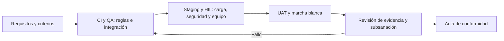

# Subdocumento 9. Plan de calidad

> **Resumen de apertura.**
>
> Este plan define cómo se verificará la calidad del servicio, el software y los componentes telemáticos de la solución para Transportes Curimón S.A. Establece criterios de aceptación trazables, niveles de prueba, controles de calidad y evidencia de conformidad. La disponibilidad de servicio se fija en 99,9 %; la continuidad local considera el mínimo de 72 horas exigido en RT-03.10. El perfil de carga adopta las hipótesis declaradas en la arquitectura compartida: 380 sesiones nominales y 570 en estrés y las actividades de calidad se vincularán al plan de trabajo.
>
> **Qué recibe Transportes Curimón S.A.**
> - Criterios de calidad y aceptación vinculados a las bases y a la matriz de requerimientos.
> - Estrategia de verificación desde pruebas unitarias hasta aceptación operacional.
> - Registro de evidencias, defectos y decisiones para cada hito.
> - Parámetros de carga y actividades de prueba vinculados con arquitectura, hardware y cronograma.

## 9.1 Plan de Calidad

El plan aplica controles preventivos y verificaciones basadas en riesgo a cada incremento de software, configuración de infraestructura y equipo embarcado. Los criterios de servicio provienen de las bases; los umbrales adicionales de cobertura de ramas, complejidad y vulnerabilidades se adoptan como compromisos bloqueantes de audIT y se distinguen del mínimo contractual. La homologación física utiliza los criterios de T-13 Tabla 13.1 sobre la configuración ofertada, sin atribuir a las bases los parámetros adicionales de diseño ni declarar ensayos ejecutados.

La homologación física utiliza iWave G26I con audIT EdgeHub, lector CAN sin contacto Technoton CANCrocodile y las balizas Bluetooth de la innovación 3. Se distinguen los 182 equipos previstos de los 192 terceros con dispositivos existentes: sus plataformas requieren acceso autorizado y no se presume API ni exportación disponible. El catálogo T-17 verifica lectura, integridad, datos ausentes, antigüedad y conciliación, sin atribuir al parque real el resultado de dobles sintéticos. Para frío, rango y precisión provienen del modelo y la homologación; no se trasladan especificaciones de sondas PT100.

### 9.1.1 Modelo de calidad y controles verificables

Se utiliza el modelo de calidad de producto ISO/IEC 25010:2023, con nueve características (ISO/IEC, 2023). No constituye una certificación de audIT ni demuestra conformidad por nombrarlo. Cada característica se transforma en una pregunta de ensayo y en evidencia conservada.

La adecuación funcional se verifica contrastando entradas, reglas de despacho, jornada, documentos y salidas contra un oráculo independiente; cualquier autorización ilegal es fallo, aunque otros casos aprueben. La eficiencia de desempeño se mide mediante percentiles y distribución por unidad: asignación p95 de hasta treinta segundos, DET hasta noventa segundos y sincronización hasta veinte minutos por camión tras setenta y dos horas sin cobertura. Una media favorable no compensa una unidad fuera del límite.

El oráculo de jornada conserva la cascada de S3 y distingue su aplicación por modalidad: la completa aporta nivel 2; la de datos complementa el reposo del camión de nivel 4 con atestación firmada de nivel 5 y permite asignar con marca. Sin adhesión, la validación documental exige atestación firmada para obtener un veredicto habilitante; sin ella se bloquea la asignación. Modalidad, fuente, nivel y veredicto se verifican por separado en CP-SYS-05 y CP-UAT-09. Ninguna modalidad levanta bloqueos legales.

La compatibilidad se prueba con contratos versionados de ERP, GPS, TMS y dispositivos; duplicados, cambios de esquema y respuesta ausente no pueden producir doble emisión o pérdida de evidencia. La capacidad de interacción se verifica con tareas representativas de despacho, taller y conductor detenido; se registran finalización, errores y necesidad de asistencia, sin inventar una tasa de éxito ya medida.

La fiabilidad se verifica con disponibilidad real E2E de al menos 99,9 %, continuidad local y ejercicios de recuperación con RTO de hasta cuatro horas y RPO de hasta quince minutos. La seguridad se comprueba mediante autorización por titular, alcance y vigencia, revocación efectiva, aislamiento entre clientes y protección de evidencia; un acceso no autorizado bloquea la promoción.

La mantenibilidad se verifica con revisión, análisis estático, pruebas de regresión y cobertura automatizada de líneas ejecutables de lógica de negocio de al menos 70 % (mínimo contractual RT-04.11) y de ramas de al menos 80 % (compromiso adicional bloqueante de audIT, coherente con S6 §6.2, Tabla 6.3). Se calculan por separado líneas cubiertas/líneas ejecutables y ramas cubiertas/ramas instrumentadas; el manifiesto identifica módulos de negocio y exclusiones justificadas. No se promedian ambos porcentajes ni se incluyen dependencias o código generado para elevar la cobertura. La flexibilidad se comprueba en los modelos e interfaces homologados, con actualización/reversión y perfiles nominales y de estrés: no se presume compatibilidad con cualquier camión. La seguridad operacional se verifica mediante bloqueo ante jornada ausente, habilitación vencida o documento no conforme; la interacción del conductor se admite únicamente detenido. Dos autorizaciones comerciales no levantan esos bloqueos legales.

La madurez del desarrollo seguro se gestiona mediante evaluación inicial y reevaluación anual con OWASP SAMM o marco equivalente (FEP02, RT-11.28, p. 24, carácter deseable). El resultado identifica práctica, evidencia, brecha, responsable y acción; no se declara una madurez alcanzada ni una certificación CMMI. Como controles adicionales de ingeniería, audIT adopta complejidad ciclomática $v(G)\le15$ por función, duplicación menor que 3 % del código analizado y cero ciclos en el grafo de dependencias entre módulos de negocio. Se conservan versión del analizador, exclusiones justificadas, denominador y grafo. Una función que excede quince caminos independientes requiere refactorización o descomposición antes de promocionar; un ciclo o acceso directo a datos ajenos incumple el límite de contexto. Estos controles bloquean promoción como compromisos de audIT, sin atribuir los números a las bases. La revisión por pares verifica que reducir una métrica no oculte lógica o suprima pruebas.

El flujo incorpora SAST, composición, DAST y escaneo de imágenes con bloqueo de hallazgos críticos (FEP02, RT-11.22, p. 24); entrega SBOM por versión (RT-11.23) y firma/procedencia conforme a SLSA nivel 3 o superior (RT-11.24). El reporte relaciona artefacto, huella, pipeline y promoción autorizada; una firma aislada no demuestra cumplimiento de SLSA.

Estos controles relacionan calidad con consecuencias operacionales concretas: el análisis de seguridad no sustituye la comprobación de jornada, y la cobertura de código no acredita disponibilidad. T-13 organiza la ejecución y T-17 contiene los 120 casos diseñados y sus criterios, sin presentar resultados antes de ensayar.

### 9.1.2 Objetivos y métricas de aceptación

La Tabla 9.1 distingue los mínimos contractuales de los compromisos adicionales de audIT y de las hipótesis de carga. Ningún control adicional sustituye ni rebaja los umbrales contractuales.

**Tabla 9.1.** Métricas de calidad y trazabilidad

| Métrica | Criterio | Naturaleza y fuente | Evidencia |
|---|---|---|---|
| Disponibilidad de servicios críticos | $\ge 99{,}9%$ mensual E2E | Contractual: Art. 20 FEP01, p. 14; RT-10.01 FEP02, p. 22 | Medición real de transacciones E2E; monitoreo sintético complementario y reporte |
| Recuperación ante desastre | RTO $\le 4 h; RPO \le 15$ min | Contractual: RT-07.04 FEP02, p. 17 | Informe fechado de ejercicio de recuperación |
| Retención local sin conectividad | Al menos 72 h, sin pérdida ni corrupción | Contractual: RT-03.10, p. 31 | Registro de desconexión, almacenamiento y sincronización |
| Cobertura automatizada de lógica de negocio | Líneas ≥70 %; ramas ≥80 %, ambas bloqueantes | RT-04.11 FEP02, p. 11: mínimo 70 %; ramas 80 %: compromiso audIT, S6 Tabla 6.3 | Reporte por versión, numeradores, denominadores y exclusiones |
| Perfil de carga y latencia | 380 sesiones nominales y 570 en estrés (1,5 × 380) | Hipótesis de diseño: S4, «Concurrencia y volumen declarados»; factor de prueba RT-09.06 | Script K6 versionado, mezcla por perfil, configuración y percentiles |

La disponibilidad se medirá sobre el servicio punta a punta y con la ventana, exclusiones y método de cómputo que establezcan las bases. El requisito de retención local es 72 h; la capacidad ampliada de 288 h es una propuesta de arquitectura física y su verificación depende del diseño y perfil de muestreo que se confirmen.

### 9.1.3 Responsabilidades de calidad

La jefatura de aseguramiento administra el plan, la matriz de trazabilidad y el registro de defectos. Desarrollo corrige hallazgos y adjunta evidencia; QA prepara o revisa los casos y comunica resultados; arquitectura y hardware confirman los parámetros de sus componentes. La aceptación del mandante permanece en la contraparte técnica designada. La asignación de responsables y la segregación de funciones del flujo de integración se vinculan a las funciones y dedicaciones de S7/T-15.

## 9.2 Estrategia de Aseguramiento de Calidad

La verificación combina inspección, análisis automatizado y pruebas dinámicas. Se ejecutará sobre versiones identificadas y ambientes controlados. Las herramientas, los umbrales de seguridad y las autorizaciones de despliegue se especificarán en el diseño del flujo de integración; no se declara que los controles descritos ya estén implantados ni que las pruebas se hayan ejecutado.

La Figura 9.1 muestra el recorrido general desde el criterio contractual hasta la aceptación. El detalle de niveles, datos y decisiones se desarrolla después de la figura.

*Figura 9.1. Recorrido general de aseguramiento de calidad. Fuente: elaboración propia.*

El primer bloque fija el criterio antes de ejecutar; CI y QA detectan fallos de lógica y contratos antes de utilizar dispositivos o datos operacionales. Staging y HIL reproducen carga, desconexión y fallas con controles de reversión. El resultado conserva ambiente, versión, entradas y medición: una captura sin esos datos no permite reevaluar el ensayo. UAT comprueba tareas con usuarios designados; marcha blanca añade volumen real y estabilidad sostenida. La Contraparte Técnica formaliza el cierre solo cuando concurren las seis condiciones contractuales. Cualquier fallo devuelve el incremento a corrección y reevaluación, sin convertir la figura en evidencia de ejecución.

### 9.2.1 Niveles, ambientes y datos de prueba

La secuencia propuesta es: pruebas unitarias en integración continua; pruebas de integración en QA; pruebas de sistema, rendimiento y seguridad en staging; ensayos de hardware en banco HIL; y aceptación de usuario en los terminales que confirme el plan de trabajo. Producción y recuperación ante desastres se usan solo en ejercicios autorizados, con ventana, respaldo y reversión aprobados.

Los datos de prueba serán sintéticos o anonimizados. El uso de datos operacionales requiere autorización, minimización, control de acceso y retención acordada. Cada conjunto de datos y script conservará versión, origen, parámetros y responsable, sin exponer datos personales reales.

### 9.2.2 Criterios de entrada, salida y gestión de defectos

Antes de iniciar una prueba deben estar identificados el requisito y el caso de prueba; disponible la versión y el ambiente; aprobados los datos, parámetros, umbrales y responsables; y definidos los respaldos y la reversión cuando corresponda. La concurrencia y las ráfagas se fijan con el perfil de S4; las ventanas de ensayo son las de sección 9.3.2.

Una prueba se cierra cuando se conserva el resultado reproducible, la evidencia, la versión y la evaluación contra criterios previamente aprobados. No se acepta el cierre de marcha blanca con incidentes críticos o altos abiertos atribuibles a la solución. Los defectos restantes requieren responsable, severidad, plazo acordado y aceptación documentada de la contraparte. Las categorías y plazos definitivos deben concordar con el contrato y el protocolo aprobado.

### 9.2.3 Puertas de calidad propuestas

La Tabla 9.2 establece los puntos de control de audIT, coherentes con S6 Tabla 6.3 y T-13 Tabla 13.1. La configuración y evidencia del pipeline deben materializar esos compromisos; describirlos no acredita su implantación.

**Tabla 9.2.** Puertas de calidad y evidencia de salida

| Puerta | Control propuesto | Condición de salida | Evidencia |
|---|---|---|---|
| G1 — Código | Revisión, pruebas y análisis estático | Líneas ≥70 %, ramas ≥80 %, cero pruebas fallidas, complejidad ≤15 por función | Reporte CI y SonarQube por versión; T-13 §9.0.3 |
| G2 — Dependencias | SAST, composición y escaneo de imágenes | Cero vulnerabilidades críticas o altas abiertas en el artefacto promovido | SBOM, SonarQube y Trivy por versión |
| G3 — Integración | Contratos e intercambio entre servicios | Casos de integración trazados aprobados | Resultados y logs de integración |
| G4 — Sistema | Rendimiento, resiliencia y seguridad | Umbrales acordados antes del ensayo y cumplidos | Reporte de ejecución y configuración |
| G5 — Aceptación | Pruebas funcionales con usuarios designados | Acta de aceptación o lista de observaciones acordada | Casos ejecutados, incidencias y acta |
| G6 — Recuperación | Restauración y continuidad | RTO/RPO exigidos demostrados en ejercicio autorizado | Bitácora, marcas de tiempo y reporte |

Una puerta fallida detiene la promoción hasta documentar corrección y reevaluación satisfactoria. No se admite excepción que rebaje los mínimos contractuales o los gates adicionales bloqueantes de cobertura, complejidad y vulnerabilidades aquí comprometidos. La configuración concreta del pipeline GitLab, los servicios cloud y las herramientas mencionadas en los borradores se conciliarán con la arquitectura lógica.

## 9.3 Alineación con Plan de Trabajo

Las pruebas deben preceder a los hitos de integración, despliegue y aceptación a los que dan evidencia. La secuencia siguiente organiza las evidencias que deben incorporarse a los paquetes de trabajo y al calendario de los Formularios T-14, T-15 y T-18.

### 9.3.1 Secuencia de hitos de calidad

La Tabla 9.3 relaciona cada hito con su actividad de aseguramiento, la evidencia de salida y la dependencia que permite ejecutarla.

**Tabla 9.3.** Secuencia de aseguramiento y dependencias de cronograma

| Hito | Actividad de calidad | Evidencia de salida | Dependencia |
|---|---|---|---|
| Diseño y construcción | Revisar requisitos, riesgos, arquitectura de prueba y datos | Matriz de trazabilidad y casos revisados | T-12 y definición de diseño |
| Integración | Ejecutar pruebas unitarias, contratos e integración | Reportes identificados por versión | Diseño del flujo de integración |
| Validación de sistema | Ejecutar seguridad, carga, resiliencia y recuperación en staging/HIL | Informes reproducibles y defectos asociados | Dimensionamiento y ambientes disponibles |
| Aceptación de hito | Ejecutar protocolo, recopilar observaciones y emitir acta | Evidencias y pronunciamiento de contraparte | Cronograma contractual y plan de trabajo |
| Marcha blanca y cierre | Medir disponibilidad, incidencias y transferencia a soporte | Reporte del período y acta de conformidad | Ventana y criterios contractuales confirmados |

Esta secuencia organiza las evidencias de calidad alrededor de los hitos, pero se aplica a las ventanas contractuales detalladas a continuación, sin declarar pruebas ejecutadas.

### 9.3.2 Actividades de calidad ubicadas en el calendario

El calendario contractual establece las ventanas; la red vigente de S7/T-15 identifica las actividades A09 a A25 utilizadas aquí. Los códigos A son actividades verificables del cronograma, sin atribuirles la condición de diccionario completo de la EDT. La Tabla 9.4 sintetiza dónde se produce la evidencia de cada transición.

**Tabla 9.4.** Ventanas de ensayo y actividad de cronograma

| Ventana | Actividad S7 | Ensayos | Salida verificable |
|---|---|---|---|
| Construcción E1 | A09/A10/A11 | Unitarias, integración y piloto HIL | Versión y regresión trazadas |
| M10--M12, hito H5 | A12 | Pruebas integrales E1: carga, resiliencia, DR, seguridad y UAT | Informe y defectos de certificación |
| M13--M15 | A15 | Marcha blanca E1 | Cuatro semanas y seis condiciones |
| M16, hito H7 | A19 | Producción E1 | Acta de su alcance |
| Construcción E2 | A20 | Regresión E1 y ensayos del incremento | Evidencia sin degradación E1 |
| M17--M18, hito H10 | A22 | Certificación E2: carga, resiliencia, DR, seguridad y UAT | Informe y defectos de certificación |
| M19--M20 | A24 | Marcha blanca E2 | Cuatro semanas y seis condiciones |
| M21, hito H12 | A25 | Producto final | Acta e inicio de operación |
| Operación (M21--M56) | A25/Operación | Simulacros semestrales DR (junio y noviembre) | Demostración RTO $\le 4 h, RPO \le 15$ min y conmutación |

Las pruebas de carga utilizan el perfil aprobado de S4, conservando mezcla y concurrencia; resiliencia incluye desconexión embarcada de 72 h, terminal de 24 h y reconexión masiva. Cada ejercicio DR mide desde la declaración del incidente hasta servicio recuperado y contrasta el último dato recuperable con RPO; seguridad ofensiva se ejecuta con autorización, límites, datos de ensayo y reversión. Las cuatro familias producen informes independientes en las ventanas de pruebas integrales A12 (meses 10 a 12) y A22 (meses 17 a 18), para evitar que un éxito funcional sustituya una comprobación no funcional. Antes de cada paso a producción y semestralmente durante los 36 meses de operación (M21 a M56) se ejecutan las pruebas de resiliencia y DR; estos ejercicios de recuperación ante desastres se programan en junio y noviembre de cada año operacional, distanciados por cinco meses y fuera de la temporada alta de fruta para resguardar la continuidad de negocio ((FEP02, RT-07.07, p. 17)), certificando el RTO $\le 4$ h y RPO $\le 15$ min hacia la región secundaria Azure Brazil South (FEP02, RT-07.04, p. 17). Las pruebas de intrusión se ejecutan antes de cada paso a producción y anualmente, por tercero independiente de audIT, con informe íntegro y remediación (FEP02, 20.1, pp. 34--35; FEP02, RT-11.20, p. 24). La carga prueba los umbrales a 1,5 veces el peak declarado. La migración definitiva requiere dos ensayos previos con conciliación sin diferencias no explicadas. Estas comprobaciones complementan las certificaciones A12/A22 y conservan responsables, autorización y ventanas.

### 9.3.3 Protocolo de aceptación, observaciones y acta

Para cada hito se identificará el entregable, la versión sometida, el criterio objetivo, el responsable de ejecución y la evidencia. La contraparte revisará el paquete dentro de los plazos previstos en las bases; las observaciones se registrarán con identificador, requisito relacionado, severidad, evidencia y respuesta. La versión corregida se reevalúa contra el mismo criterio y se conserva la trazabilidad de ambas revisiones.

Solo el acta de aceptación suscrita acredita el hito; el registro de observaciones no sustituye la conformidad exigida. La disponibilidad contractual es al menos 99,9 %; RTO máximo 4 h y RPO máximo 15 min; la retención local mínima es 72 h. Para el resto de los criterios, el valor medido, el umbral aprobado y la fuente deben constar en el acta, sin completar resultados antes de ejecutar las pruebas.

### 9.3.4 Registro de evidencia y control de cambios

Cada evidencia incluirá identificador de requisito/caso, fecha, versión, ambiente, datos de prueba, herramienta, resultado, defectos y responsable. Los reportes y actas se almacenarán en el repositorio controlado del proyecto con permisos y retención definidos. Todo cambio de caso, parámetro o umbral conservará motivo, aprobador, impacto y versión afectada.

### 9.3.5 Condiciones contractuales de calendario y aceptación

El calendario de la Tabla 9.5 es obligatorio conforme al FEP01, Artículo 17.1, pp. 12--13. M1 se cuenta desde el origen contractual efectivo; no se convierte la fecha de entrega de la oferta en inicio del contrato. Los puntos de control técnicos no sustituyen los hitos ponderados de E-25.

**Tabla 9.5.** Calendario contractual y evidencia de transición

| Fase | Meses | Control y evidencia |
|---|---|---|
| Desarrollo E1 | M1--M12 | Construcción, integración, migración, seguridad y certificación. |
| Marcha blanca E1 | M13--M15 | Tres meses supervisados; seis condiciones acumulativas de cierre. |
| Producción E1 | M16 | Sistema de registro oficial de su alcance. |
| Desarrollo E2 | M13--M18 | Solapamiento con E1; cierre del desarrollo en M18. |
| Marcha blanca E2 | M19--M20 | Dos meses supervisados; única fuente de verdad compartida. |
| Producción E2 | M21 | Aceptación final e inicio simultáneo de operación. |
| Operación | M21--M56 | Ambos alcances: 36 meses de soporte y servicio. |

La convivencia exige frentes suficientes, integridad compartida y ausencia de degradación de E1 (FEP01, Artículo 17.2, p. 13); la nivelación se acredita mediante S7 y T-15. Ningún ensayo o congelamiento operacional desplaza estas fases.

Cada marcha blanca cierra solo cuando se cumplen simultáneamente las seis condiciones del FEP01, Artículo 17.3, p. 13: ningún incidente crítico ni alto abierto atribuible a la solución; volumen real comprometido durante al menos las cuatro últimas semanas; disponibilidad y respuesta cumplidas sostenidamente en ese mismo período; conciliación sin diferencias no explicadas; personal del cliente capacitado y certificado según plan aprobado; y acta suscrita por la Contraparte Técnica. Si no se cumplen, audIT extiende la marcha blanca a su costo, sin cargo adicional ni desplazamiento de fases siguientes y sujeto a las multas contractuales.

El cliente dispone de diez días hábiles para revisar y pronunciarse y audIT de diez días hábiles para subsanar. La segunda presentación con observaciones de igual naturaleza constituye atraso imputable a audIT (FEP01, Artículo 18.3, p. 13). La aceptación requiere acta suscrita; no procede aprobación por silencio. Cada ingreso adjunta artefacto, evidencia objetiva, trazabilidad y observaciones previas resueltas (FEP01, Artículo 18.1 y 18.2, p. 13). No se premarcan resultados, adjuntos, incidencias ni pronunciamientos. La aceptación no convalida defectos posteriores (FEP01, Artículo 18.4, p. 13).

### 9.3.6 Controles mínimos trazados y método de medición

La Tabla 9.6 concreta los criterios que deben incorporarse al catálogo de pruebas y sus reportes. Los parámetros adicionales no rebajan estos mínimos.

**Tabla 9.6.** Criterios contractuales de servicio y continuidad

| Control | Umbral | Fuente y evidencia |
|---|---|---|
| Disponibilidad crítica E2E | $\ge99{,}9%$ mensual | FEP01, Artículo 20, p. 14, FEP02, RT-10.01, p. 22: intentos, éxito/fallo y duración de transacciones reales correlacionadas. Monitoreo sintético complementario. |
| Red, cómputo, datos y portal | $\ge99{,}95%$ por componente | FEP02, Cap. 7, pp. 17--18; sala Cap. 6: métricas por componente y conciliación con incidencias de negocio. |
| Recuperación | RTO $\le4 h; RPO \le15$ min | FEP02, RT-07.04, p. 17: conmutación real autorizada, tiempos y datos recuperados. |
| Asignación bloqueante | p95 $\le30$ s | Caso, RT-09.01, p. 32; FEP02 Cap. 9: jornada previa, habilitaciones y equipo bajo carga declarada. |
| Documento de transporte | $\le90$ s | Caso, RT-09.01, p. 32: documento conforme antes de mover carga; ERP contable como emisor tributario. |
| Emergencia y posición | $\le15 s con cobertura; \le2$ min | Caso, RT-09.01, p. 32: tiempos origen/destino; publicación al cliente y cobertura documentada. |
| Costeo | $\le24$ h tras cierre | Caso, RT-05.29, p. 32: consolidación con identificación de componentes aún no disponibles. |
| Cobertura de negocio | Líneas ≥70 %; ramas ≥80 % | FEP02 RT-04.11: mínimo contractual 70 %; ramas 80 %: gate adicional audIT, S6 Tabla 6.3. Ambos bloquean; no demuestran por sí solos corrección funcional. |
| Autonomía embarcada | $\ge72$ h sin cobertura | Caso, RT-03.10, p. 31: posición, conducción, jornada, tiempos y documentos sin pérdida. 288 h es propuesta adicional. |
| Autonomía terminal | $\ge24$ h sin enlace exterior | FEP01, Artículo 16.4, p. 12; FEP02, RT-03.10, p. 9: mínimo transversal ante las 12 h del caso; operación degradada y conciliación. |
| Reconexión masiva | $\le20$ min por camión tras 72 h | Caso, RT-03.13, p. 31: perfil explícito de 300 unidades simultáneas; medir por unidad, sin pérdida de jornada o esperas. |

Los mínimos de infraestructura no acreditan éxito de la transacción: se mide la experiencia real de la persona usuaria, conforme a FEP02, Cap. 9. Los SLA del T-6 corresponden a experiencia histórica y no se alteran. El perfil de 300 unidades responde al escenario de varios cientos del Caso, numeral 14.2; la tasa de generación, tamaño y ráfaga se justifican en la memoria de cálculo.

En marcha la captura es automática y no se admite interacción manual. Solo se habilita interacción con el vehículo detenido. El titular controla autorización, alcance, vigencia y revocación de datos; la jornada previa de un conductor externo requiere evidencia autorizada y su ausencia no equivale a jornada cero ni habilita despacho. Llegada y salida se registran automáticamente sin instalar equipos en recintos de clientes (Caso, RT-09.01, p. 32).

El cliente adquiere el hardware; audIT especifica cantidades, características, interoperabilidad, seguridad y reposición (Caso, Cap. 11; FEP02, Cap. 8). La sala de San Bernardo debe remediarse o reemplazarse y EXC-04 no excluye sus adecuaciones necesarias (Caso, RT-06.01, p. 32). No se presupone equipamiento, API del ERP ni acceso autorizado a interfaces de fábrica.

## Referencias

ISO/IEC. (2023). *ISO/IEC 25010:2023. Systems and software engineering — Systems and software Quality Requirements and Evaluation (SQuaRE) — Product quality model*. https://www.iso.org/standard/78176.html

Transportes Curimón S.A. (2026). *Bases administrativas para la preparación de la propuesta: Licitación Pública Internacional N.º TFEP-01/2026* (Documento FEP01).

Transportes Curimón S.A. (2026). *Bases técnicas del Caso 10, Transporte de Carga: Licitación Pública Internacional N.º TFEP-01/2026* (Documento FEP03).

Transportes Curimón S.A. (2026). *Bases técnicas transversales para la preparación de la propuesta: Licitación Pública Internacional N.º TFEP-01/2026* (Documento FEP02).

## Declaración de uso de IA

Conforme al Comunicado 10, sección 7.2, cada sección de este subdocumento y cada formulario asociado declara la herramienta de inteligencia artificial generativa usada, su finalidad, el nivel de uso en texto y en diagramas según la escala oficial de esa sección, y quién revisó y qué verificó. Esta declaración se consolida en el Formulario A-6.

| Sección | Herramienta | Finalidad del uso | Nivel en texto | Nivel en diagramas | Revisión humana (quién y qué verificó) |
|---|---|---|---|---|---|
| Apertura | Asistente LLM y Codex | Integración del borrador de calidad | Alto | Ninguno | Los controles documentales automatizados no acreditan revisión humana sustantiva; se requiere su registro antes de entrega. |
| 9.1 Plan de Calidad | Asistente LLM y Codex | Conciliación de cobertura contractual y de ramas, métricas y gates | Alto | Ninguno | Los controles documentales automatizados no acreditan revisión humana sustantiva; se requiere su registro antes de entrega. |
| 9.2 Estrategia de Aseguramiento de Calidad | Asistente LLM y Codex | Desarrollo de estrategia y controles; alineación de equipos e interfaces GPS; diagrama de proceso | Alto | Alto | Los controles documentales automatizados no acreditan revisión humana sustantiva; se requiere su registro antes de entrega. |
| 9.3 Alineación con Plan de Trabajo | Asistente LLM y Codex | Integración de secuencia de hitos y evidencias | Alto | Ninguno | Los controles documentales automatizados no acreditan revisión humana sustantiva; se requiere su registro antes de entrega. |
| Formulario T-13 | Asistente LLM y Codex | Consolidación de gates, evidencia, equipos y perfil nominal/estrés | Alto | Ninguno | Los controles documentales automatizados no acreditan revisión humana sustantiva; se requiere su registro antes de entrega. |
| Formulario T-17 | Asistente LLM y Codex | Corrección del bloqueo administrativo, FOTA, región y carga; depuración de 120 casos y cotejo S3/T-12 con matriz de 42 requisitos y variantes de comprobación; conciliación de modalidades y veredictos con S3; adaptación CAN, Bluetooth, memoria y acceso GPS | Alto | Ninguno | Los controles documentales automatizados no acreditan revisión humana sustantiva; se requiere su registro antes de entrega. |
