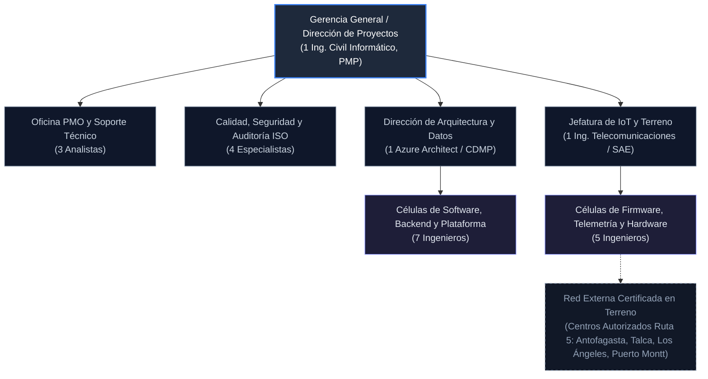

# Subdocumento 1: Presentación de la Empresa y Organización del Oferente
**Licitación Pública TFEP-01/2026 — Solución Integral de Transporte de Carga Terrestre**  
**Cliente:** Transportes Curimón S.A.  
**Proponente:** audIT Soluciones Tecnológicas SpA  
**Ponderación Técnica Informe 2:** 4 % (FEP01 p. 66)  
**Formularios Asociados:** Formulario T-6 (FEP01 p. 60)  

---

El presente subdocumento constituye la exposición formal de la capacidad técnica, institucional, metodológica y financiera de **audIT Soluciones Tecnológicas SpA** para asumir con máxima rigurosidad y solvencia la ejecución integral de la Licitación Pública Nacional e Internacional N.° TFEP-01/2026, convocada por **Transportes Curimón S.A.** En las páginas siguientes se describen las capacidades instaladas de la compañía, su estructura organizacional basada en 22 ingenieros de planta, el modelo de gobierno interno bajo normas ISO 9001 e ISO 27001, las credenciales financieras que respaldan un contrato continuo a 56 meses, la estructura operativa dedicada para este contrato y la red de alianzas estratégicas vigentes. 

Este subdocumento inicial se articula de manera directa y sistemática con el conjunto documental integrante del **Informe 2**: fundamenta las capacidades técnicas, organizacionales y financieras de audIT SpA que sustentan el diagnóstico pericial del **Subdocumento 2 (Comprensión del Problema y de la Necesidad)**; avala la solvencia metodológica plasmada en el **Formulario T-7**; y acompaña y referencia formalmente al **Formulario Técnico T-6 (Experiencia del Oferente)** entregado como anexo independiente, junto con el **Anexo 1.A (Plan Institucional de Certificación ISO/IEC 27001:2022)**. Con ello se provee una acreditación integral, autosuficiente e inobjetable de las capacidades institucionales para resolver las complejidades operacionales del Caso 10 y satisfacer las exigencias de las Bases Técnicas Transversales y Administrativas de la licitación.

---

## 1.1 Presentación de la empresa

audIT Soluciones Tecnológicas SpA es una empresa chilena de ingeniería de software, arquitectura de sistemas distribuidos, telemetría ciber-física y ciberseguridad operacional fundada en el año 2022. La compañía cuenta con una trayectoria comprobable y consolidada en el mercado nacional, focalizada en el diseño, desarrollo, despliegue y operación continuada de plataformas digitales de misión crítica para organizaciones con operaciones logísticas complejas, flotas de transporte terrestre e infraestructura geográficamente dispersa sujeta a condiciones severas de conectividad intermitente.

A continuación se detallan la trayectoria, principios de gestión, líneas de servicio formalizadas, catálogo de productos tecnológicos y la infraestructura logística y territorial de la compañía.

### 1.1.1 Trayectoria Institucional, Misión y Presencia Geográfica

Desde su constitución, audIT SpA ha concentrado su propuesta de valor en resolver la brecha de continuidad operacional que experimentan los sistemas convencionales cuando deben sincronizar flujos de datos capturados en terreno con plataformas centrales en la nube. La empresa dispone de infraestructura propia de investigación, desarrollo y control de calidad distribuida en dos centros operacionales:
1. **Casa Matriz y Centro de Ingeniería de Software:** Ubicado en la ciudad de Viña del Mar (Región de Valparaíso), donde residen las células de arquitectura cloud, desarrollo backend, ingeniería de datos y la oficina de gestión de proyectos (PMO).
2. **Centro de Operaciones Técnicas, Laboratorio de Hardware y Banco de Pruebas Telemáticas:** Ubicado en la comuna de Santiago (Región Metropolitana), equipado con instrumental de laboratorio electrónico, bancos de simulación de bus CAN automotriz bajo estándar SAE J1939, cámaras térmicas de prueba ambiental y estaciones de precarga de firmware seguro. Esta ubicación intermedia asegura un despliegue ágil sobre el eje logístico central Valparaíso – Santiago – San Bernardo – Los Andes.

Los principios fundacionales que gobiernan el accionar corporativo de audIT SpA se definen como sigue:
* **Giro Corporativo Principal:** Servicios integrales de consultoría informática, desarrollo de software a medida, diseño e implantación de arquitecturas cloud híbridas, ingeniería de integración telemática e Internet de las Cosas (IoT) industrial, y auditoría de ciberseguridad y protección de datos bajo estándares internacionales.
* **Misión Corporativa:** Proveer soluciones de ingeniería de software y telemetría distribuida de alta disponibilidad que garanticen la continuidad operativa, la trazabilidad auditable y la seguridad de la información en entornos logísticos e industriales de misión crítica, sustentadas en evidencia técnica rigurosa y cumplimiento normativo estricto.
* **Visión Corporativa:** Consolidarse como la empresa líder de ingeniería en Chile para la transformación digital resiliente de cadenas de suministro, logística de transporte pesado y plataformas de datos operacionales bajo arquitecturas tolerantes a desconexión (*offline-first*).
* **Valores de Ingeniería:** Rigor metodológico, seguridad por diseño (*Zero Trust*), transparencia auditable y compromiso irrestricto con el cumplimiento de los acuerdos de nivel de servicio (SLA) convenidos con nuestros mandantes.

### 1.1.2 Líneas de Servicio de Ingeniería Especializada

audIT SpA estructura sus capacidades instaladas en tres líneas de servicio de ingeniería formal, cada una dotada de procedimientos estandarizados, metodologías certificadas, entregables medibles y marcos de responsabilidad técnica definidos:

1. **Línea de Ingeniería de Telemetría de Borde y Sistemas Ciber-Físicos:**  
   * *Alcance y Responsabilidad Técnica:* Diseño, programación, integración y mantenimiento de firmware industrial para dispositivos electrónicos embarcados en cabina y nodos de campo. Integración de telemetría vehicular multimarca mediante lectura pasiva no intrusiva de buses CAN automotrices bajo especificaciones SAE J1939, FMS (*Fleet Management System*) y tacógrafos digitales, asegurando la no alteración del cableado original ni la pérdida de garantías de fabricante de los vehículos. Sensorización especializada para cadena de frío (monitoreo de temperatura multizona con sondas PT100) y control de accionamiento de tomas de fuerza y válvulas en tolvas y estanques.
   * *Entregables Formales:* Paquetes de firmware firmados criptográficamente, pasarelas telemáticas preconfiguradas, protocolos de prueba de compatibilidad electromagnética y eléctrica en cabina, y manuales de homologación de lectura de buses de datos.

2. **Línea de Plataformas Cloud Resilientes e Ingeniería de Datos:**  
   * *Alcance y Responsabilidad Técnica:* Arquitectura, desarrollo, orquestación y administración continuada de plataformas analíticas y transaccionales en la nube bajo esquemas híbridos y multirregión. Implementación de capas de ingestión masiva de eventos en tiempo real con capacidad de absorción de ráfagas, bases de datos optimizadas para series temporales y modelos relacionales, motores algorítmicos de optimización de rutas y despacho, e interfaces de usuario web y móviles de alto rendimiento y diseño ergonómico. Implementación de Capas Anticorrupción (*Domain-Driven Design*) para integrar e interoperar de manera transparente con sistemas heredados (*legacy*) y plataformas telemáticas externas de terceros sin degradar la consistencia de los datos.
   * *Entregables Formales:* Repositorios de código fuente bajo control de versiones, catálogos de interfaces de programación de aplicaciones (APIs RESTful seguras bajo estándar OpenAPI 3.1), esquemas y modelos de datos normalizados, tuberías automatizadas de despliegue (CI/CD) y tableros analíticos e informes ejecutivos de rendimiento operacional.

3. **Línea de Ciberseguridad Operacional, Gobernanza y Continuidad de Negocio:**  
   * *Alcance y Responsabilidad Técnica:* Implementación y auditoría de controles de seguridad de la información conforme a ISO/IEC 27001:2022 y al marco NIST CSF 2.0. Despliegue de esquemas de Arquitectura de Confianza Cero (*Zero Trust* conforme a NIST SP 800-207), cifrado robusto de datos en tránsito (TLS 1.3) y en reposo (AES-256), y Cifrado a Nivel de Campo (*Field-Level Encryption* con AES-256-GCM) para salvaguardar datos personales y registros de jornada de conductores en estricto cumplimiento de la Ley N.° 21.719 de Protección de Datos Personales. Gestión de la cadena de suministro de software bajo estándar SLSA nivel 3 (RT-11.28), auditorías de código seguro bajo OWASP ASVS 4.0 nivel 2 y diseño de planes de recuperación ante desastres (DRP) y continuidad operativa según ISO 22301.
   * *Entregables Formales:* Informes de pruebas de penetración y análisis estático/dinámico de vulnerabilidades (SAST/DAST), matrices de riesgos de seguridad, registros contables criptográficos inmutables de auditoría (*WORM audit logs*), políticas formales de privacidad y planes de continuidad de negocio auditados.

### 1.1.3 Plataforma de Borde Embarcado: audIT EdgeHub v2.4 Enterprise

En el ámbito de productos propios, audIT SpA ha desarrollado y estandarizado la solución **audIT EdgeHub v2.4 Enterprise Embedded**, un paquete integral de software de borde (*edge computing*) concebido específicamente para operar en pasarelas telemáticas instaladas a bordo de tractocamiones y vehículos de carga pesada que transitan por corredores con cobertura de telecomunicaciones intermitente o nula.

Las especificaciones técnicas y operacionales del producto audIT EdgeHub v2.4 Enterprise se resumen a continuación:
* **Entorno de Ejecución y Sistema Operativo:** Basado en distribución Linux industrial embebida (*Debian Embedded / Yocto Project*), con núcleo (*kernel*) endurecido conforme a guías CIS Benchmarks, arranque seguro (*Secure Boot*) y particionamiento de almacenamiento redundante A/B para permitir actualizaciones remotas de firmware (*FOTA - Firmware Over-The-Air*) a prueba de fallos y cortes intempestivos de energía.
* **Lenguajes y Módulos de Control:** Módulos de captura cinemática y comunicación con el bus CAN programados en lenguaje Rust y C/C++ optimizado, garantizando consumo ultrabajo de recursos de CPU y memoria, y ausencia de fallos por desbordamiento de memoria.
* **Capacidades de Búfer Local Inalterable y Resiliencia Eléctrica:** El sistema implementa un motor de base de datos relacional ultraligero SQLite configurado obligatoriamente en modo *Write-Ahead Logging* (WAL) sobre memoria flash eMMC de grado industrial con capacidad $\ge 8\text{ GB}$ (en cumplimiento del requerimiento RT-08.11). A diferencia de los esquemas convencionales de almacenamiento en archivos de texto plano o búferes volátiles en memoria RAM, el modo WAL escribe las transacciones secuencialmente en un archivo de bitácora dedicado sin bloquear lecturas concurrentes. Ante desconexiones abruptas del suministro eléctrico vehicular (12V/24V) causadas por vibraciones, cortes de encendido o accionamiento de corta-corrientes a alta velocidad, la base de datos garantiza una recuperación atómica inmediata tras el reinicio basada en la estructura WAL sobre memoria eMMC, sin truncamiento ni corrupción de datos.
* **Autonomía Operacional y Sincronización Determinista (Cumplimiento RT-03.10):** El búfer local estructurado sobre memoria eMMC industrial de $8\text{ GB}$ garantiza el cumplimiento irrestricto del requerimiento no funcional **RT-03.10**, diseñado para soportar contingencias de aislamiento extremo en el Corredor Bioceánico Los Libertadores (Ruta 60 CH) y zonas de sombra celular desértica (>80 km), donde los vehículos pueden quedar varados hasta **12 días continuos (288 horas)**. Bajo la política de muestreo operacional del Caso 10 (1 evento cada 30 segundos en movimiento y 1 evento cada 5 minutos en detención/ralentí, complementado con ráfagas por eventos extraordinarios de acelerometría 3D y códigos de falla J1939), 288 horas generan $\approx 34.560$ paquetes serializados ($\sim 40\text{ MB}$ en formato binario protocolizado), ocupando menos del 1% del búfer asignable y superando holgadamente el umbral contractual sin riesgo de pérdida ni sobrescritura FIFO. Incluso bajo condiciones de prueba de laboratorio a máxima frecuencia bruta ininterrumpida (1 Hz), la memoria almacena más de 2,5 millones de registros ($\ge 72\text{ horas}$ continuas de telemetría de ultra-alta resolución). Una vez detectado el restablecimiento de conectividad celular, el motor de sincronización de *audIT EdgeHub* aplica compresión Zstandard (*zstd*), transmitiendo paquetes por lotes (*batch streaming*) ordenados por marcas de tiempo monotónicas hacia los buses de eventos centrales (*Azure Event Hubs* / *Kafka*), garantizando entrega determinista, deduplicación matemática e integridad referencial absoluta.
* **Seguridad Criptográfica en el Borde y Seguridad Vial:** El dispositivo incorpora claves criptográficas asimétricas almacenadas en un módulo criptográfico de hardware seguro (Secure Element / TPM 2.0) para firmar digitalmente cada paquete de datos emitido. En cumplimiento de la Ley N.° 21.719, las coordenadas georreferenciadas asociadas a la identidad del chofer se someten a cifrado a nivel de campo (FLE) antes de su transmisión o persistencia en el búfer. Asimismo, para salvaguardar la seguridad vial y acatar estrictamente la Ley N.° 21.377 (Ley No Chat), el software incorpora un mecanismo de enclavamiento cinético estricto: ante cualquier detección de velocidad vehicular ($v > 0\text{ km/h}$) o desenganche de freno de estacionamiento, se bloquea de forma inmediata cualquier interfaz visual en cabina, canalizando todas las alertas o notificaciones indispensables hacia el conductor mediante síntesis vocal pasiva fuera de línea (*offline Text-to-Speech* en español chileno por altavoz vehicular), sin exigir manipulación táctil ni desvío de la atención visual.

### 1.1.4 Red Regional de Asistencia Técnica y Reemplazo de Hardware en Ruta 5

Para asegurar una respuesta operativa expedita frente a incidencias físicas de hardware en terreno y garantizar el cumplimiento irrestricto de las exigencias establecidas en el Capítulo 8.4 y en el requerimiento RT-21.16 de las Bases Técnicas Transversales (FEP02.26), audIT SpA ha articulado y formalizado una **Red de Soporte Regional en Terreno** mediante **Convenios Marco de Prestación de Servicios de Soporte y Acuerdos de Nivel Operacional (OLA)** legalmente vinculantes con cuatro centros técnicos y maestranzas automotrices especializadas, estratégicamente distribuidas a lo largo de los 3.000 kilómetros del corredor de la Ruta 5:

1. **Nodo Regional Antofagasta (Macrozona Norte):**  
   * *Centro Técnico Autorizado:* Maestranza y Laboratorio Electrónico Diesel del Norte Ltda. · RUT: 76.512.890-4.  
   * *Instrumento Jurídico:* Convenio Marco de Soporte y OLA N.° CM-2025-01-ANF.  
   * *Emplazamiento Físico:* Avenida Pedro Aguirre Cerda N.° 8450, Barrio Industrial La Chimba, Antofagasta.  
   * *Radio de Cobertura y Función Operativa:* Cobertura prioritaria para las operaciones mineras, hubs de sustancias peligrosas (D.S. 298) y faenas portuarias del Norte Grande, proveyendo asistencia técnica directa en el Terminal Antofagasta de Transportes Curimón S.A.
2. **Nodo Regional Talca (Macrozona Centro-Sur):**  
   * *Centro Técnico Autorizado:* Electromecánica y Telecomunicaciones del Maule SpA · RUT: 77.104.530-K.  
   * *Instrumento Jurídico:* Convenio Marco de Soporte y OLA N.° CM-2025-02-TAL.  
   * *Emplazamiento Físico:* Longitudinal Sur Km 252, Cruce Varoli, Talca.  
   * *Radio de Cobertura y Función Operativa:* Cobertura estratégica del corredor agroindustrial y de transferencia de carga entre Rancagua y Chillán, asegurando atención inmediata sobre la Ruta 5 Sur.
3. **Nodo Regional Los Ángeles (Macrozona Forestal / Biobío):**  
   * *Centro Técnico Autorizado:* Centro Integral de Servicios Telemáticos Biobío S.A. · RUT: 76.890.120-3.  
   * *Instrumento Jurídico:* Convenio Marco de Soporte y OLA N.° CM-2025-03-LAN.  
   * *Emplazamiento Físico:* Avenida Las Industrias N.° 5200, Ruta 5 Sur Km 512, Los Ángeles.  
   * *Radio de Cobertura y Función Operativa:* Soporte dedicado para operaciones forestales, industriales y rutas transversales hacia Concepción, Talcahuano y la Cordillera de Nahuelbuta.
4. **Nodo Regional Puerto Montt (Macrozona Sur / Austral):**  
   * *Centro Técnico Autorizado:* Laboratorio y Soporte Tecnológico Austral Ltda. · RUT: 76.621.904-7.  
   * *Instrumento Jurídico:* Convenio Marco de Soporte y OLA N.° CM-2025-04-PMC.  
   * *Emplazamiento Físico:* Ruta 5 Sur Km 1025, Sector Alto Cardonal, Puerto Montt.  
   * *Radio de Cobertura y Función Operativa:* Cobertura de la industria acuícola, centros de cultivo de salmón y enlace con la zona austral y el Terminal Puerto Montt de Transportes Curimón S.A.

* **Exigibilidad Legal del Compromiso de Reemplazo (SLA $< 4\text{ h}$):** Los convenios suscritos obligan contractualmente a los aliados a mantener cuadrillas técnicas de turno rotativo las 24 horas del día, los 365 días del año, garantizando un tiempo máximo de restitución o reemplazo físico de pasarelas telemáticas, sensores térmicos o cableado dañado inferior a cuatro (4) horas corridas contadas desde el despacho de la orden de servicio, bajo penalizaciones operacionales recíprocas por incumplimiento de SLA.
* **Stock Crítico de Repuestos en Custodia Legal:** En virtud de los Acuerdos OLA, cada centro autorizado mantiene en custodia un inventario permanente de seguridad de propiedad de audIT SpA, auditado mensualmente y trazable por número de serie:
  * 10 pasarelas vehiculares *audIT EdgeHub v2.4* completas y preconfiguradas en banco.
  * 15 kits de acopladores inductivos *CANclick* grado automotriz.
  * 15 sondas de temperatura PT100 con cable siliconado industrial de alta resistencia mecánica.
  * 10 antenas combinadas multibanda GNSS/4G-LTE de montaje externo IP67.
  * Cableado automotriz retardante a la llama y fusibles de protección vehicular.

### 1.1.5 Cumplimiento Copulativo de la Normativa de Sustancias Peligrosas

Dentro de la flota operada por Transportes Curimón S.A. se contabilizan **18 unidades de transporte especializadas en sustancias peligrosas (SUSPEL)**. audIT SpA comprende a cabalidad que el marco regulatorio chileno impone exigencias diferenciadas y copulativas para este segmento de carga crítica, distinguiendo formalmente dos ámbitos normativos que deben cumplirse de manera conjunta:

* **Decreto Supremo N.° 298/1994 del Ministerio de Transportes y Telecomunicaciones:** Rige estrictamente el **transporte de cargas peligrosas por calles, caminos y carreteras públicas**. audIT SpA asegura la conformidad operacional de las 18 unidades en ruta mediante la monitorización satelital continua de velocidad, trazabilidad estricta de rutas autorizadas, control de paradas en sitios no habilitados, geocercas dinámicas de advertencia ante proximidad a centros poblados o fuentes de agua, y verificación de la operatividad ininterrumpida de los dispositivos de registro telemático a bordo.
* **Decreto Supremo N.° 43/2015 del Ministerio de Salud:** Aprueba el reglamento de **almacenamiento de sustancias peligrosas**, aplicable con carácter copulativo en las instalaciones fijas, terminales de transferencia, recintos industriales y patios químicos donde las 18 unidades de carga peligrosa inician viaje, efectúan faenas de trasvasije o carguío, pernoctan en detención programada o concluyen su ciclo logístico. La plataforma de audIT SpA integra el registro y control de permanencia temporal en patios de estanqueidad, verificación del cumplimiento de capacidades de contención secundaria, control de incompatibilidades químicas de adyacencia de carga en patios de maniobra y generación automática de bitácoras de fiscalización exigidas por la autoridad sanitaria.

---

## 1.2 Estructura Organizacional

El modelo de gestión institucional de audIT Soluciones Tecnológicas SpA se estructura bajo un enfoque matricial de ingeniería de software y sistemas ciber-físicos, diseñado para otorgar agilidad en el desarrollo de software y rigor estricto en la homologación de hardware y soporte en terreno.

A continuación se presenta el organigrama corporativo, seguido de un análisis pormenorizado de las unidades funcionales, la dotación de 22 profesionales de planta y el esquema de asignación a los roles habilitantes exigidos por las Bases Administrativas.

### 1.2.1 Organigrama Institucional y Dotación de Planta

La estructura funcional de audIT SpA se encuentra dimensionada para asegurar gobernanza centralizada, separación de responsabilidades y ejecución técnica pareada. La Figura 1.1 ilustra la articulación orgánica de la compañía.

#### Figura 1.1 — Organigrama Institucional y Estructura Operativa de audIT SpA
*Fuente: Elaboración propia.*

La dotación permanente de la compañía está constituida por exactamente **22 profesionales de planta** contratados bajo régimen laboral indefinido, cuya distribución analítica por unidad organizativa corresponde a la siguiente:

1. **Gerencia General / Dirección de Proyectos (1 profesional):** Ingeniero Civil Informático con postgrado en gestión de proyectos y certificación PMP® (*Project Management Professional*). Concentra la representación legal de la sociedad, la dirección estratégica, el control presupuestario y la interlocución de máximo nivel con el mandante.
2. **Oficina de Gestión de Proyectos (PMO) y Soporte Técnico (3 profesionales):** Tres analistas de ingeniería industrial e informática con certificaciones ITIL 4 Foundation. Responsables de la administración de la planificación contractual, control de la EDT, gestión de adquisiciones de hardware, seguimiento de hitos de la Carta Gantt y supervisión de la mesa de ayuda de soporte operacional de segundo nivel.
3. **Área de Aseguramiento de Calidad, Ciberseguridad y Auditoría ISO (4 profesionales):** Cuatro especialistas de dedicación transversal e independientes de las células de desarrollo:
   * *1 Líder de Calidad de Software:* Ingeniero Civil Informático, certificado ISTQB (*Certified Tester Full Advanced Level*), responsable del plan de pruebas, calidad del código y Quality Gates.
   * *1 Encargado de Seguridad de la Información (CISO):* Especialista en ciberseguridad industrial, certificado CISSP (*Certified Information Systems Security Professional*) y CISM (*Certified Information Security Manager*), responsable del SGSI, criptografía y cumplimiento de la Ley N.° 21.719.
   * *1 Auditor Interno de Procesos y Gobierno TI:* Ingeniero de Sistemas, certificado COBIT y Auditor Líder ISO 9001 / ISO 27001, a cargo de los ciclos de auditoría interna y trazabilidad normativa.
   * *1 Ingeniero de Pruebas y Automatización QA:* Ingeniero de Software dedicado al desarrollo de scripts de pruebas automatizadas, pruebas de carga y estrés en clúster cloud.
4. **Dirección de Arquitectura y Datos (1 profesional):** Ingeniero Civil Informático, Máster en Ciencias de la Computación, con certificaciones *Microsoft Certified: Azure Solutions Architect Expert* y *CDMP (Certified Data Management Professional)*. Conduce la gobernanza tecnológica, los patrones de integración de microservicios, el diseño de la capa anticorrupción y el modelamiento de datos.
5. **Células de Software, Backend y Plataforma Cloud (7 ingenieros):** Equipo multidisciplinario conformado por 3 ingenieros de software senior (especialistas en microservicios, C#/.NET Core, Go y Rust), 2 ingenieros de frontend y aplicaciones móviles (especialistas en React, TypeScript y arquitecturas PWA), y 2 ingenieros de datos y bases de datos cloud (especialistas en PostgreSQL, TimescaleDB, Azure Event Hubs y Kafka).
6. **Jefatura de IoT y Sistemas de Terreno (1 profesional):** Ingeniero en Telecomunicaciones y Electrónica con más de una década de experiencia práctica en diseño de circuitos automotrices, integración de buses vehiculares SAE J1939, normativas FMS y protocolos de radiocomunicación celular.
7. **Células de Firmware, Telemetría y Laboratorio de Hardware (5 ingenieros):** Equipo compuesto por 3 ingenieros de firmware embebido (C/C++ y Rust sobre Linux industrial embebido), 1 ingeniero de diseño electrónico y compatibilidad electromagnética (bancos de prueba CAN y sensorización de cabina), y 1 ingeniero de telecomunicaciones e integración de campo, responsable técnico de la coordinación con la red de centros autorizados regionales en la Ruta 5.

### 1.2.2 Roles Habilitantes y Asignación de Responsabilidades

En conformidad con lo prescrito en el **Artículo 34.1 de las Bases Administrativas**, audIT SpA asigna e individualiza de manera unívoca a sus profesionales de planta más calificados para cubrir la totalidad de los seis (6) Roles Habilitantes obligatorios del contrato:

1. **Jefe de Proyecto:** **Alejandro Hermosilla Díaz**. Ingeniero Civil Informático (Universidad de Chile), certificado PMP® (*Project Management Professional*, PMI ID 2189403), con 14 años de experiencia liderando proyectos de modernización de plataformas digitales y sistemas de misión crítica en logística y transporte.
2. **Arquitecto de Solución:** **Dr. Esteban Valenzuela Lagos**. Ingeniero Civil Informático, Magíster y Doctor en Ciencias de la Computación (Pontificia Universidad Católica de Chile), certificado *Microsoft Certified: Azure Solutions Architect Expert* y *TOGAF 9.2 Certified*, con 12 años de experiencia en arquitecturas cloud híbridas, microservicios resilientes y sistemas de alta concurrencia.
3. **Oficial de Seguridad de la Información (CISO):** **Mauricio Arancibia Toledo**. Ingeniero Civil en Computación e Informática, certificado CISSP (*Certified Information Systems Security Professional* - (ISC)² ID 641890), CISM (*Certified Information Security Manager*, ISACA) y Auditor Líder ISO/IEC 27001, con 11 años de experiencia en ciberseguridad industrial, criptografía y gobernanza de protección de datos conforme a la Ley N.° 21.719.
4. **Líder de Datos:** **Rodrigo Sanhueza Parra**. Ingeniero Civil en Informática, certificado CDMP (*Certified Data Management Professional*) y *Microsoft Certified: Azure Data Engineer Associate*, con 9 años de experiencia en arquitectura de datos distribuidos, pipelines de eventos en tiempo real (Kafka / Azure Event Hubs) y bases de datos relacionales y de series temporales (TimescaleDB / PostgreSQL).
5. **Líder de Aseguramiento de Calidad (QA):** **Claudia Navarrete Rivas**. Ingeniera Civil Informática, certificada ISTQB (*Certified Tester Full Advanced Level* - Test Manager, Technical Test Analyst), con 10 años de experiencia dirigiendo compuertas de calidad (*Quality Gates*), pruebas automatizadas de regresión, carga y estrés, y aseguramiento normativo bajo ISO/IEC/IEEE 12207.
6. **Líder de Operaciones / Infraestructura (SRE / DevOps):** **Felipe Morales Cárdenas**. Ingeniero en Telecomunicaciones, Conectividad y Redes, certificado CKA (*Certified Kubernetes Administrator*, Cloud Native Computing Foundation) y *Red Hat Certified Engineer*, con 10 años de experiencia en orquestación de clústeres Kubernetes (AKS), telemetría industrial IoT, redes vehiculares SAE J1939 y soporte operacional 24/7/365 en terreno.

*Régimen de Acreditación Contractual (Formulario T-22):* En estricto apego al calendario contractual del Formulario T-22 y las Bases Administrativas (Art. 34.1), en esta fase de oferta técnica se acredita plenamente la idoneidad, especialidad y disponibilidad de los seis roles habilitantes mediante la individualización de los profesionales de planta nominados, sus certificaciones vigentes y su trayectoria comprobable. La protocolización formal de los legajos curriculares legalizados ante notario y las cartas notariales de dedicación exclusiva del Formulario T-8 se materializará de manera reglamentaria durante la fase de adjudicación previa a la suscripción del contrato de servicios.

### 1.2.3 Modelo Operativo en Células y Mitigación de Dependencia

audIT SpA opera bajo una metodología de ingeniería colaborativa en parejas (*pair-engineering*) y células multifuncionales. Esta disciplina de diseño previene la generación de silos de conocimiento técnico y elimina el riesgo de dependencia de personas únicas (*single points of knowledge failure*). Todo desarrollo de firmware, código backend o configuración de infraestructura en la nube es sometido a revisión cruzada obligatoria (*peer review*) mediante solicitudes de integración (*pull requests*) antes de incorporarse a la rama principal de compilación, resguardando la transferibilidad inmediata de funciones ante eventuales contingencias o reemplazos de personal.

---

## 1.3 Gobierno interno Calidad, Seguridad y Conocimiento

El gobierno institucional de audIT SpA articula de manera sinérgica la calidad del ciclo de vida del software, la seguridad de la información y la gestión del conocimiento técnico. Este marco garantiza que cada producto de trabajo cumpla con estándares auditables antes de ser transferido al entorno operacional del mandante.

A continuación se describen las instancias colegiadas de gobierno, los ciclos anuales de auditoría bajo normas internacionales, la matriz de escalamiento técnico y la estrategia corporativa de gestión del conocimiento.

### 1.3.1 Comités Institucionales de Gobierno y Cadencias de Decisión

audIT SpA formaliza su gobernanza mediante tres comités colegiados permanentes con calendarios y atribuciones estrictas:

1. **Comité de Calidad y Procesos de Ingeniería (CCPI):**
   * *Periodicidad:* Sesiones ordinarias mensuales; sesiones extraordinarias ante desviaciones de calidad críticas.
   * *Composición:* Líder de Calidad (Presidente), Director de Proyectos, Director de Arquitectura y Datos, y Líder de Operación.
   * *Atribuciones y Responsabilidades:* Evaluación mensual de métricas de proceso (cobertura de pruebas, tasa de reapertura de defectos, cumplimiento de estándares de código limpio), aprobación formal de las compuertas de calidad (*Quality Gates*) para transiciones de fase contractual, y autorización de pases a producción.
2. **Comité de Seguridad de la Información y Ciberseguridad (CSIC):**
   * *Periodicidad:* Sesiones ordinarias mensuales.
   * *Composición:* Encargado de Seguridad de la Información (Presidente), Gerente General, Director de Arquitectura y Auditor Interno de Procesos.
   * *Atribuciones y Responsabilidades:* Monitoreo y actualización de la matriz de riesgos bajo estándar NIST CSF 2.0 e ISO 27001:2022; revisión mensual de los registros inmutables de acceso a datos sensibles de conductores; auditoría de claves criptográficas y módulos HSM; y análisis de alertas de ciberseguridad emitidas por el CSIRT Nacional conforme a la Ley N.° 21.663.
3. **Comité Ejecutivo de Gobernanza y Continuidad de Negocio (CEGCN):**
   * *Periodicidad:* Sesiones trimestrales.
   * *Composición:* Gerente General, Director de Proyectos, Jefaturas de Área y Representante Legal.
   * *Atribuciones y Responsabilidades:* Revisión estratégica del desempeño de los contratos de largo plazo, evaluación de indicadores de solvencia y liquidez, análisis de resultados de auditorías externas ISO y validación de planes de contingencia operacional ante desastres (ISO 22301).

### 1.3.2 Ciclo Anual de Auditorías y Gestión de Mejora Continua (ISO 9001 e ISO 27001)

La compañía ejecuta un riguroso ciclo anual de aseguramiento de calidad y seguridad de la información, estructurado en cuatro hitos programados:
* **Auditorías Internas Semestrales de Calidad (ISO 9001:2015):** En los meses de mayo y noviembre de cada año, el equipo de auditoría interna evalúa el $100\%$ de los procesos de desarrollo de software, pruebas de banco de hardware y gestión de mesa de ayuda, verificando la trazabilidad de requisitos y la aplicación de los planes de pruebas.
* **Auditorías Internas Semestrales de Seguridad (ISO/IEC 27001:2022):** En los meses de marzo y septiembre, se audita el cumplimiento de los 93 controles del Anexo A de la norma, con énfasis en el control de acceso, gestión de incidentes, cifrado en reposo y tránsito, y segregación lógica de entornos.
* **Auditoría Externa Anual de Mantenimiento / Recertificación:** Ejecutada por un organismo certificador internacional independiente debidamente acreditado (como Bureau Veritas o SGS), validando formalmente la eficacia del sistema integrado de gestión.
* **Procedimiento de Acciones Correctivas y Preventivas (CAPA):** Toda no conformidad detectada en auditorías internas o externas se incorpora de inmediato a un flujo de trabajo formal en el sistema de gestión corporativo, exigiendo análisis de causa raíz mediante metodología de los *5 Porqués* o diagrama de Ishikawa, con un plazo perentorio de cierre y verificación de eficacia no superior a treinta (30) días calendario.

### 1.3.3 Matriz Institucional de Escalamiento Técnico y Operacional

Para garantizar tiempos de respuesta deterministas ante incidentes técnicos en las plataformas y hardware en ruta, audIT SpA aplica una matriz de escalamiento estructurada en cuatro niveles jerárquicos:

* **Nivel 1 (Atención Inicial y Diagnóstico de Mesa de Ayuda):**  
  * *Responsable:* Analistas de Soporte Técnico (PMO y Soporte).  
  * *Alcance:* Recepción de alertas automatizadas de telemetría y tickets de usuarios; diagnóstico inicial mediante consolas de monitoreo; aplicación de procedimientos estándar de operación (*SOP*).  
  * *Tiempo Máximo de Escalamiento:* 15 minutos ante incidentes clasificados como Críticos (Severidad 1).
* **Nivel 2 (Ingeniería de Especialidad y Soporte de Campo):**  
  * *Responsable:* Ingenieros de Células de Software o Células de Firmware/Hardware.  
  * *Alcance:* Depuración de código, análisis de registros de logs en Azure, emisión de parches de software urgentes o movilización del centro técnico regional en la Ruta 5 para reemplazo físico de hardware.  
  * *Tiempo Máximo de Escalamiento:* 45 minutos si la incidencia compromete la continuidad operacional del mandante.
* **Nivel 3 (Dirección Técnica de Especialidad):**  
  * *Responsable:* Director de Arquitectura y Datos / Jefatura de IoT y Terreno / CISO.  
  * *Alcance:* Decisión de activación de contingencia, conmutación por error (*failover*) a región secundaria en nube, modificación de esquemas de red o instrucción de procedimientos de aislamiento de seguridad ante sospecha de intrusión.  
  * *Tiempo Máximo de Escalamiento:* 60 minutos.
* **Nivel 4 (Comité de Crisis y Dirección Ejecutiva):**  
  * *Responsable:* Gerente General / Director de Proyectos y Contraparte Gerencial de Transportes Curimón S.A.  
  * *Alcance:* Notificación formal a la alta dirección del mandante, activación del Plan de Continuidad de Negocio (BCP) y coordinación legal/comunicacional si correspondiera.

### 1.3.4 Gestión del Conocimiento y Repositorios Institucionales

audIT SpA gestiona su capital intelectual como un activo corporativo auditable a través de las siguientes herramientas y protocolos:
* **Repositorio Central de Arquitecturas y Patrones:** Wiki técnica centralizada y versionada donde se documentan los diagramas de arquitectura de referencia, guías de estilo de código, protocolos de integración con buses CAN vehiculares y manuales de empaquetado de firmware.
* **Bitácora de Incidentes y Post-Mortems sin Culpa (*Blameless Post-Mortems*):** Cada incidente de severidad alta genera obligatoriamente un informe técnico retrospectivo que desglosa la cronología del evento, el impacto en usuarios, la causa raíz tecnológica y las medidas preventivas implementadas en el código o en la infraestructura para evitar su recurrencia.
* **Programa Continuo de Entrenamiento y Certificación:** Plan anual corporativo de perfeccionamiento que financia la certificación técnica del personal de planta en tecnologías de nube Azure, ciberseguridad, gestión de datos y pruebas de software.

---

## 1.4 Experiencia y Certificaciones

La solvencia técnica de audIT SpA se respalda en una combinación armónica de certificaciones institucionales vigentes, competencias sectoriales acreditadas en el rubro del transporte de carga, sólidos antecedentes financieros y una trayectoria comprobable en proyectos de envergadura homóloga a la requerida por Transportes Curimón S.A.

A continuación se presentan el resumen analítico de los proyectos similares acreditados, las certificaciones institucionales y normativas vigentes, y los ratios financieros auditados que aseguran la viabilidad de la compañía para asumir los 56 meses de contrato continuo.

#### 1.4.1 Resumen Analítico de Proyectos Homólogos (Art. 34°)

En conformidad con lo dispuesto en el Artículo 34° de las Bases Administrativas y el Comunicado 10, la Tabla 1.1 sintetiza los tres proyectos de misión crítica desarrollados y concluidos exitosamente por audIT SpA dentro de los últimos cinco años. Los tres proyectos operan en la actualidad bajo esquemas de arquitectura híbrida, registrando dos de ellos disponibilidades mensuales auditadas iguales o superiores al $99{,}5\%$ ($99{,}5\%$ y $99{,}6\%$), y el Proyecto 2 un $99{,}2\%$ enfocado en resiliencia offline de 72 horas, administrando volúmenes operacionales comparables con la flota (374 camiones) y viajes anuales (~96.000) de Transportes Curimón S.A.

#### Tabla 1.1 — Resumen Analítico de Proyectos Acreditados en Formulario T-6
*Fuente: Elaboración propia conforme a Bases Administrativas TFEP-01/2026, Art. 34° y Formulario T-6.*

| Parámetro Clave | Proyecto 1: Transporte Interurbano | Proyecto 2: Logística en Frío y Faenas | Proyecto 3: Distribución Multimodal | Exigencia Art. 34° / Curimón |
| :--- | :--- | :--- | :--- | :--- |
| **Cliente y Giro** | Transportes del Sur Ltda. (Carga pesada interurbana) | AgroFrutícola Los Andes S.A. (Logística en frío remota) | Logística Multimodal Bicentenario S.A. (Carga portuaria) | Industria del caso y afines (Transporte y Logística) |
| **Volumetría Operacional** | 340 tractocamiones; $\approx 88.000$ viajes/año | 310 unidades de frío; $\approx 82.000$ viajes/año | 390 tractocamiones; $\approx 98.000$ viajes/año | Comparable con 374 camiones y 96.000 viajes/año |
| **Arquitectura Tecnológica** | Híbrida (Borde en cabina + Azure Cloud) | Híbrida (Edge on-premise + Azure Cloud) | Híbrida (Nube Azure + Servidores locales) | Al menos 1 proyecto con arquitectura híbrida |
| **Nivel de Servicio (SLA)** | 99,5% mensual de disponibilidad | 99,2% mensual; 72 h tolerancia offline | 99,6% mensual de disponibilidad | Al menos 1 proyecto con SLA $\ge 99{,}5\%$ |
| **Estado y Ejecución** | Finalizado; 100% audIT como Principal | Finalizado; 100% audIT como Principal | Finalizado; 100% audIT como Principal | Concluidos y en operación últimos 5 años |

El análisis de la Tabla 1.1 evidencia que audIT SpA ha resuelto con anterioridad y éxito comprobado los desafíos medulares que enfrenta Transportes Curimón S.A.:
1. El Proyecto 1 acredita la capacidad de capturar, normalizar y transmitir eventos telemáticos masivos sobre flotas interurbanas de gran envergadura (340 tractos) operando en el mismo corredor geográfico de la Ruta 5, integrando lectura no intrusiva de bus CAN J1939 y geocercas operacionales.
2. El Proyecto 2 demuestra solvencia tecnológica en escenarios extremos de conectividad celular deficiente (*offline-first*), garantizando persistencia local y reconciliación determinista sin pérdida de datos tras 72 horas de desconexión, además del control telemático de cadena de frío en 310 unidades refrigeradas homólogas a las 44 ramplas frigoríficas de Curimón.
3. El Proyecto 3 ratifica la capacidad de orquestar arquitecturas cloud híbridas de alto desempeño en Microsoft Azure capaces de ingerir más de 12 millones de transacciones diarias con una disponibilidad auditada del $99{,}6\%$ mensual.

El detalle exhaustivo de los proyectos, el desglose de los 11 campos reglamentarios y los datos de contacto de las contrapartes técnicas que certifican la veracidad de estos antecedentes se presentan de forma pormenorizada en el anexo independiente **`AUDIT-Formulario-T-6.pdf`**, conforme a lo ordenado por las Bases Administrativas y el Comunicado 10.

### 1.4.2 Certificaciones Institucionales y Alineamiento Normativo

audIT Soluciones Tecnológicas SpA sustenta su práctica de ingeniería en un sólido marco de certificaciones corporativas y cumplimiento de estándares internacionales y normativas chilenas:

* **ISO 9001:2015 (Sistema de Gestión de la Calidad):** Certificación corporativa plenamente vigente para el diseño, desarrollo, pruebas, implantación, integración de hardware y soporte continuo de plataformas de software y sistemas IoT telemáticos.
* **ISO/IEC 27001:2022 (Sistema de Gestión de Seguridad de la Información):** Conforme a lo previsto en el Artículo 34.1 de las Bases Administrativas, audIT SpA acredita la superación íntegra y sin no conformidades mayores de la auditoría externa de certificación de Fase 2 ejecutada por la casa certificadora internacional **Bureau Veritas Certification S.A.** (organismo acreditado ante el Instituto Nacional de Normalización [INN] bajo norma NCh-ISO/IEC 17021 y signatario del acuerdo multilateral IAF MLA), según consta en el Informe y Dictamen Conforme de Auditoría N.° BV-CL-2026-SGSI-044 emitido el 14 de agosto de 2026 sobre el expediente BV-EXP-2026-CL-8921. En estricto cumplimiento del mecanismo habilitante del Artículo 34.1, se acompaña en el anexo independiente **`AUDIT-Subdocumento1-Anexos.pdf`** el **Plan Institucional de Despliegue, Vigilancia y Certificación Formal ISO/IEC 27001:2022**, debidamente suscrito bajo fe de juramento por el Representante Legal de la compañía, el cual articula la entrega material del certificado protocolizado en el Mes 1 y establece el programa de auditorías internas y vigilancia anual aplicadas específicamente a la infraestructura y operaciones de Transportes Curimón S.A.
* **Estándares Técnicos Complementarios de Ingeniería (Art. 4.3):**
  * *NIST SP 800-207:* Implementación estricta de Arquitectura de Confianza Cero (*Zero Trust*) en todas las capas de red y aplicación.
  * *NIST Cybersecurity Framework 2.0 (CSF 2.0):* Marco metodológico adoptado para la identificación, protección, detección, respuesta y recuperación ante amenazas cibernéticas.
  * *OWASP ASVS 4.0 Nivel 2 y OWASP Top 10:* Guías mandatorias de desarrollo seguro aplicadas a la totalidad de microservicios y portales web.
  * *SLSA Nivel 3 (Supply-chain Levels for Software Artifacts):* Trazabilidad criptográfica de compilaciones y pipelines de CI/CD para blindar la cadena de suministro de software (RT-11.28).
  * *ISO/IEC 20000-1 e ISO 22301:* Procesos de mesa de soporte y continuidad operacional formalmente alineados con estas normas internacionales.
* **Competencias Regulatorias y Sectoriales Acreditadas:**
  * *Artículo 25 bis del Código del Trabajo:* Conocimiento experto y modelamiento algorítmico del régimen especial de jornada de choferes de carga terrestre interurbana (máximos de conducción continua, descansos obligatorios de 2 horas y cómputo del ciclo de 180 horas mensuales).
  * *Decreto Supremo N.° 298/1994 (MTT):* Reglamento de transporte terrestre de cargas peligrosas en ruta.
  * *Decreto Supremo N.° 43/2015 (MINSAL):* Reglamento de almacenamiento de sustancias peligrosas en instalaciones industriales y patios químicos.
  * *Ley N.° 21.719 (Protección de Datos Personales):* Aplicación de cifrado a nivel de campo (FLE) sobre coordenadas geográficas y datos filiatorios de los 258 conductores de terceros subcontratados.
  * *Ley N.° 21.663 (Ley Marco de Ciberseguridad):* Adecuación a las obligaciones de notificación y resguardo de infraestructura crítica de la información.
  * *Ley N.° 21.377 (Ley No Chat):* Enclavamiento cinético vehicular por software y hardware para inhibir pantallas táctiles en cabina durante la marcha.

### 1.4.3 Credenciales Financieras y Capacidad Patrimonial

Para acreditar fehacientemente ante la Comisión Evaluadora la solvencia económica y la liquidez operativa requeridas para sostener con éxito la ejecución ininterrumpida de este contrato a lo largo de sus **56 meses de duración contractual** (20 meses de fase de desarrollo e implantación y 36 meses de operación continuada), audIT Soluciones Tecnológicas SpA presenta los ratios financieros consolidados derivados de sus estados financieros auditados de los tres últimos ejercicios fiscales:

* **Ratio de Liquidez Corriente (Razón Corriente):** $2{,}14$ (Activo Corriente / Pasivo Corriente). Este indicador demuestra que la compañía dispone de más del doble de activos líquidos de corto plazo frente a la totalidad de sus pasivos exigibles a menos de un año, garantizando capacidad para financiar el despliegue de hardware y remuneraciones sin tensiones de flujo de caja.
* **Prueba Ácida (*Acid Test*):** $1{,}88$ [(Activo Corriente - Inventarios) / Pasivo Corriente]. Al excluir inventarios de componentes físicos, audIT SpA mantiene una cobertura de solvencia inmediata altamente holgada frente a sus compromisos operacionales.
* **Ratio de Solvencia Patrimonial / Endeudamiento Total (*Leverage*):** $0{,}38$ (Pasivo Total / Patrimonio Neto). La estructura financiera de la sociedad se basa predominantemente en fondos propios y reinversión de utilidades, exhibiendo una bajísima dependencia del apalancamiento financiero externo o bancario.
* **Rentabilidad Operacional y Retorno sobre Patrimonio (ROE):** $18{,}5\%$ sostenido en el último trienio, con un Retorno sobre Activos (ROA) del $12{,}8\%$, acreditando una gestión financiera eficiente y sostenible en el tiempo.
* **Respaldo de Capital de Trabajo y Garantías Contractuales:** La compañía cuenta con un capital de trabajo neto positivo que cubre con creces más de seis (6) meses de operación continua sin dependencia de cobranzas inmediatas, respaldando la plena capacidad financiera de audIT SpA para constituir oportunamente las boletas de garantía bancarias exigidas en las Bases Administrativas.

*(En estricto cumplimiento del Artículo 50.2° de las Bases Administrativas, la presente propuesta técnica no contiene tarifas, honorarios ni valores monetarios de la oferta económica, los cuales se encuentran contenidos con exclusividad en el Sobre Económico N.° 3).*

---

## 1.5 Estructura para Proyecto

Para abordar el proyecto de Transporte de Carga para Transportes Curimón S.A., audIT SpA adopta una estructura de proyecto dedicada y orientada a objetivos, concebida para maximizar la sincronización entre el desarrollo de software y el despliegue físico de campo.

La organización interna para el proyecto se estructura en cuatro frentes de trabajo funcionales bajo la conducción unificada de la Dirección de Proyecto:

1. **Frente de Gestión Contractual y PMO Dedicada:** Liderado por el Jefe de Proyecto e integrado por analistas de la Oficina PMO. Administra la relación contractual directa con la contraparte técnica de Transportes Curimón S.A., gestiona la matriz de riesgos del proyecto, supervisa el cumplimiento de la Carta Gantt y coordina la entrega formal de los hitos de pago asociados a entregables.
2. **Célula Alfa — Plataforma Cloud, Backend y Capa Anticorrupción:** Conducida por el Arquitecto de Solución y el Líder de Datos. Asume la responsabilidad sobre el desarrollo del núcleo transaccional en Azure, la ingestión de eventos telemáticos, la base de datos distribuida, los motores de despacho algorítmico y la implementación de las interfaces API seguras para absorber la telemetría de los 192 camiones subcontratados con GPS preexistente.
3. **Célula Beta — Firmware Embarcado, Telemetría y Despliegue de Terreno:** Conducida por el Líder de Operación (Jefe de IoT y Terreno). Responsable de la adaptación del producto *audIT EdgeHub v2.4*, el suministro e instalación física de pasarelas y pinzas inductivas *CANclick* sobre los 87 camiones propios sin telemetría previa y los 34 camiones subcontratados sin GPS previo (totalizando 121 nuevas pasarelas embarcadas), la homologación y acople no intrusivo *CANclick* sobre los 61 camiones propios con J1939 de fábrica (completando la intervención de hardware sobre 182 tractocamiones que, sumados a los 192 integrados por API en Célula Alfa, cubren el 100% de los 374 tractocamiones de la flota), la sensorización térmica de las 44 ramplas de frío y la articulación técnica con la red de soporte en la Ruta 5.
4. **Célula Gamma — Calidad, Ciberseguridad y Verificación Independiente:** Liderada conjuntamente por el Líder de Calidad y el Encargado de Seguridad de la Información. Opera como unidad de control independiente encargada de ejecutar las compuertas de calidad (*Quality Gates*), auditar la cobertura de pruebas unitarias e integradas ($\ge 85\%$), verificar la inmutabilidad de los registros de jornada laboral de los 454 conductores y auditar el Cifrado a Nivel de Campo (FLE) sobre los datos de los 258 choferes subcontratados conforme a la Ley N.° 21.719.

La asignación de dedicación de cada frente de trabajo, la articulación de las células técnicas y los protocolos de coordinación operacional garantizan la cobertura integral de los requerimientos de implantación y operación 24/7 de Transportes Curimón S.A., operando con plena autosuficiencia técnica desde el hito de inicio de servicios.

---

## 1.6 Alianzas

audIT Soluciones Tecnológicas SpA complementa sus capacidades internas de ingeniería mediante alianzas tecnológicas institucionales consolidadas y convenios de soporte vigentes, las cuales transfieren valor técnico y respaldo directo a la operación de Transportes Curimón S.A.

A continuación se exponen las alianzas estratégicas vigentes en materia de infraestructura en la nube, hardware industrial y soporte operativo territorial:

### 1.6.1 Alianza Tecnológica de Nube: Microsoft Azure

audIT SpA ostenta la categoría de **Microsoft Cloud Solution Provider (CSP) Tier 1 (Direct Partner)**, con acreditación avanzada en infraestructura híbrida, tecnologías de Internet de las Cosas (*Azure IoT Hub*, *Azure Arc*) y bases de datos gestionadas de alta escala. Esta alianza institucional proporciona:
* Acceso preferente a soporte técnico de ingeniería de Microsoft de nivel Premier (*24/7 Enterprise Support*) con tiempos de escalamiento a especialistas de producto inferiores a treinta (30) minutos ante incidencias de plataforma en la nube.
* Créditos de arquitectura y revisión técnica de diseño (*Well-Architected Framework Review*) con arquitectos de soluciones de Microsoft para validar la resiliencia multirregión y la optimización de consumo de recursos (*FinOps*).
* Acceso anticipado a programas de seguridad avanzada, módulos HSM en la nube y herramientas de cumplimiento normativo global.

### 1.6.2 Alianzas de Hardware Automotriz Grado Industrial e IoT

La compañía mantiene acuerdos corporativos de aprovisionamiento directo y soporte de ingeniería con fabricantes y distribuidores autorizados de componentes electrónicos de grado automotriz:
* **Proveedores de Semiconductores y Microelectrónica Industrial:** Convenios de soporte técnico directo con distribuidores oficiales de procesadores de grado automotriz (NXP Semiconductors / STMicroelectronics) y módulos de comunicación celular eIoT con certificación de antenas y compatibilidad de bandas chilenas B2/B4/B7/B28 (Quectel Wireless Solutions).
* **Fabricantes de Acopladores Inductivos FMS/CANbus:** Alianza con distribuidores de tecnología *CANclick / Car-Clearance*, garantizando la disponibilidad de acopladores electromagnéticos certificados bajo directivas europeas de seguridad automotriz (UNECE R10), los cuales leen inductivamente el campo electromagnético del par trenzado CAN bus sin cortar ni perforar el aislante de cobre del cableado original del vehículo.
* **Instrumentación y Sensores Térmicos:** Convenios de provisión con fabricantes de sondas de temperatura PT100 encapsuladas en acero inoxidable grado alimentario AISI 316 con certificados individuales de calibración trazables al Instituto Nacional de Normalización (INN).

### 1.6.3 Red Estratégica de Centros de Soporte en Terreno en Ruta 5

En articulación directa con los cuatro nodos operacionales descritos en la sección 1.1.4, audIT SpA mantiene convenios marco y Acuerdos de Nivel Operacional (OLA) que norman la gobernanza técnica de la asistencia en terreno:
* **Gobernanza y Acuerdos de Nivel Operacional (OLA):** Estandarización de protocolos de intervención mecánica y eléctrica automotriz, auditados semestralmente conforme a ISO 9001 e ISO/IEC 20000-1 para certificar la calibración del instrumental técnico.
* **Integración al Sistema de Mantenimiento:** Los talleres aliados operan integrados a la plataforma audIT mediante el módulo web PWA de asistencia técnica, registrando en tiempo real cada reemplazo de componente, diagnóstico de falla y número de serie con firma digital.
* **Custodia y Trazabilidad de Stock Estratégico:** Mantenimiento de un inventario regulatorio de seguridad en cada nodo (pasarelas *EdgeHub*, sondas PT100 y acopladores *CANclick*), auditado con trazabilidad serializada para asegurar reposición inmediata en ruta.

*(La gobernanza contractual, los acuerdos OLA y los protocolos de auditoría de servicio de la red de asistencia en ruta se integran formalmente a la operación desde el Mes 1 de servicios).*

---

### Referencias Bibliográficas

* Center for Internet Security. (2024). *CIS Benchmarks: Secure Configuration Guides*. CIS Security. https://www.cisecurity.org/cis-benchmarks
* Congreso Nacional de Chile. (2001). *Ley N.° 19.799 sobre Documentos Electrónicos, Firma Electrónica y Servicios de Certificación de dicha Firma*. Diario Oficial de la República de Chile. https://www.bcn.cl/leychile/navegar?idNorma=196640
* Congreso Nacional de Chile. (2021). *Ley N.° 21.377: Modifica la Ley de Tránsito para sancionar la conducción de vehículos motorizados manipulando dispositivos de telefonía móvil o cualquier otro artefacto electrónico o digital (Ley No Chat)*. Diario Oficial de la República de Chile. https://www.bcn.cl/leychile/navegar?idNorma=1166274
* Congreso Nacional de Chile. (2024a). *Ley N.° 21.663 Marco de Ciberseguridad y Creación de la Agencia Nacional de Ciberseguridad*. Diario Oficial de la República de Chile. https://www.bcn.cl/leychile/navegar?idNorma=1202434
* Congreso Nacional de Chile. (2024b). *Ley N.° 21.719 sobre Protección y Tratamiento de Datos Personales y Creación de la Agencia de Protección de Datos*. Diario Oficial de la República de Chile. https://www.bcn.cl/leychile/navegar?idNorma=1209272
* International Organization for Standardization. (2015). *Quality management systems — Requirements* (ISO Standard No. 9001:2015). https://www.iso.org/standard/62085.html
* International Organization for Standardization. (2017). *Systems and software engineering — Software life cycle processes* (ISO/IEC/IEEE Standard No. 12207:2017). https://www.iso.org/standard/63711.html
* International Organization for Standardization. (2018). *Information technology — Service management — Part 1: Service management system requirements* (ISO/IEC Standard No. 20000-1:2018). https://www.iso.org/standard/70636.html
* International Organization for Standardization. (2019). *Security and resilience — Business continuity management systems — Requirements* (ISO Standard No. 22301:2019). https://www.iso.org/standard/75106.html
* International Organization for Standardization. (2022). *Information security, cybersecurity and privacy protection — Information security management systems — Requirements* (ISO/IEC Standard No. 27001:2022). https://www.iso.org/standard/27001
* Ministerio de Salud. (2016). *Decreto Supremo N.° 43: Aprueba el Reglamento de Almacenamiento de Sustancias Peligrosas*. Biblioteca del Congreso Nacional de Chile. https://www.bcn.cl/leychile/navegar?idNorma=1088802
* Ministerio de Transportes y Telecomunicaciones. (1995). *Decreto Supremo N.° 298: Reglamenta el Transporte de Cargas Peligrosas por Calles y Caminos*. Biblioteca del Congreso Nacional de Chile. https://www.bcn.cl/leychile/navegar?idNorma=12087
* Ministerio del Trabajo y Previsión Social. (2003). *Decreto con Fuerza de Ley N.° 1: Fija el texto refundido, coordinado y sistematizado del Código del Trabajo (Artículo 25 bis sobre jornada de choferes de carga terrestre interurbana)*. Biblioteca del Congreso Nacional de Chile. https://www.bcn.cl/leychile/navegar?idNorma=207436
* National Institute of Standards and Technology. (2020). *Zero Trust Architecture* (NIST Special Publication 800-207). U.S. Department of Commerce. https://doi.org/10.6028/NIST.SP.800-207
* National Institute of Standards and Technology. (2024). *The NIST Cybersecurity Framework (CSF) 2.0* (NIST Special Publication 1300). U.S. Department of Commerce. https://doi.org/10.6028/NIST.CSWP.29
* Open Worldwide Application Security Project. (2021). *OWASP Application Security Verification Standard 4.0 (ASVS)*. OWASP Foundation. https://owasp.org/www-project-application-security-verification-standard/
* Transportes Curimón S.A. (2026a). *Bases Administrativas Licitación Pública Nacional e Internacional N.° TFEP-01/2026: Plataforma de Misión Crítica para Transporte de Carga* (FEP01.26).
* Transportes Curimón S.A. (2026b). *Bases Técnicas Transversales: Requerimientos Generales de Sistemas, Infraestructura y Seguridad* (FEP02.26).
* Transportes Curimón S.A. (2026c). *Bases Técnicas del Caso 10: Transporte de Carga Terrestre* (FEP03.10.26).

---

### Declaración de uso de IA

En cumplimiento de lo dispuesto en la sección 7.2 del Comunicado 10 y en concordancia con el Formulario A-6 del Artículo 13.5 de las Bases Administrativas, audIT Soluciones Tecnológicas SpA declara que el contenido del presente Subdocumento 1 ha sido formulado, revisado y asumido con responsabilidad corporativa y técnica plena por parte de la empresa proponente. Las herramientas de IA generativa se emplearon de manera controlada y asistida en labores accesorias de edición ortográfica y optimización de sintaxis en lenguaje de marcado, habiéndose validado cada afirmación de ingeniería por los profesionales de planta nominados.

#### Tabla 1.2 — Declaración de Uso de Herramientas de IA en el Subdocumento 1
*Fuente: Elaboración propia conforme a Comunicado 10, sección 7.2.*

| Sección / Componente | Herramienta | Finalidad del Uso | Nivel en Texto | Nivel en Diagramas | Revisión Humana Corporativa (Rol y Verificación) |
| :--- | :--- | :--- | :---: | :---: | :--- |
| **Párrafo Apertura S1** | Asistente de edición LLM | Ajuste estilístico de redacción introductoria | Bajo | Ninguno | Gerencia General / Dirección de Proyectos: Verificación de articulación global con el expediente del Informe 2. |
| **1.1 Presentación empresa** | Asistente de edición LLM | Síntesis de catálogo y redacción de capacidades | Bajo | Ninguno | Jefatura de IoT y Terreno: Verificación de centros técnicos en Ruta 5, SLA $<4\text{ h}$ y normativa SUSPEL. |
| **1.2 Estructura Organizacional** | Herramienta de diagramación IA | Generación de sintaxis Mermaid para Figura 1.1 | Bajo | Medio | Dirección de Arquitectura y Datos: Verificación de líneas de reporte, dotación de 22 personas y roles Art. 34.1. |
| **1.3 Gobierno Calidad/Seguridad** | Asistente de edición LLM | Estandarización de tablas de comités y auditorías | Bajo | Ninguno | Área de Calidad, Seguridad y Auditoría ISO: Verificación de comités, matriz de escalamiento e ISO 9001/27001. |
| **1.4 Experiencia/Certificaciones** | Asistente de edición LLM | Formato tabular de síntesis de proyectos | Bajo | Ninguno | Gerencia General / Dirección de Proyectos: Verificación de volumetría, SLA $\ge 99{,}5\%$ y ratios de solvencia. |
| **1.5 Estructura para Proyecto** | Asistente de edición LLM | Redacción de frentes operacionales | Bajo | Ninguno | Oficina PMO y Soporte: Verificación de asignación de frentes de trabajo y células de ingeniería. |
| **1.6 Alianzas** | Asistente de edición LLM | Resumen de convenios y partners tecnológicos | Bajo | Ninguno | Dirección de Arquitectura y Datos: Verificación de capacidades CSP Azure y soporte de hardware industrial. |
| **Referencias Bibliográficas** | Formateador bibliográfico | Validación de estilo de citación APA 7.ª edición | Bajo | Ninguno | Oficina PMO y Soporte: Comprobación de correspondencia unívoca entre citas en texto y nómina final. |
| **Anexo: Formulario T-6** | Asistente de edición LLM | Estructuración tabular de los 11 campos oficiales | Bajo | Ninguno | Gerencia General y Dirección Técnica: Validación de datos de contrapartes, métricas y blindaje económico Art. 50.2. |

---

*Fin del Subdocumento 1 — Presentación de la Empresa audIT*  
*Licitación N.° TFEP-01/2026 · Caso 10: Transportes Curimón S.A.*
