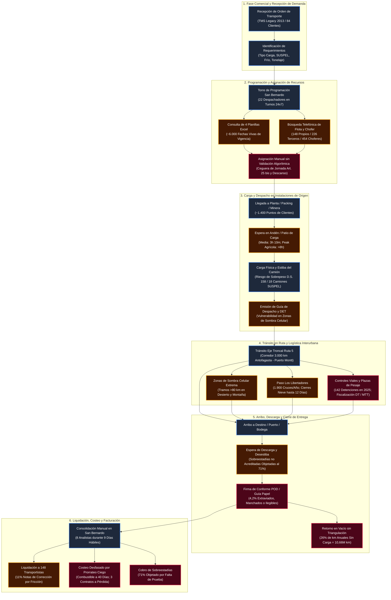
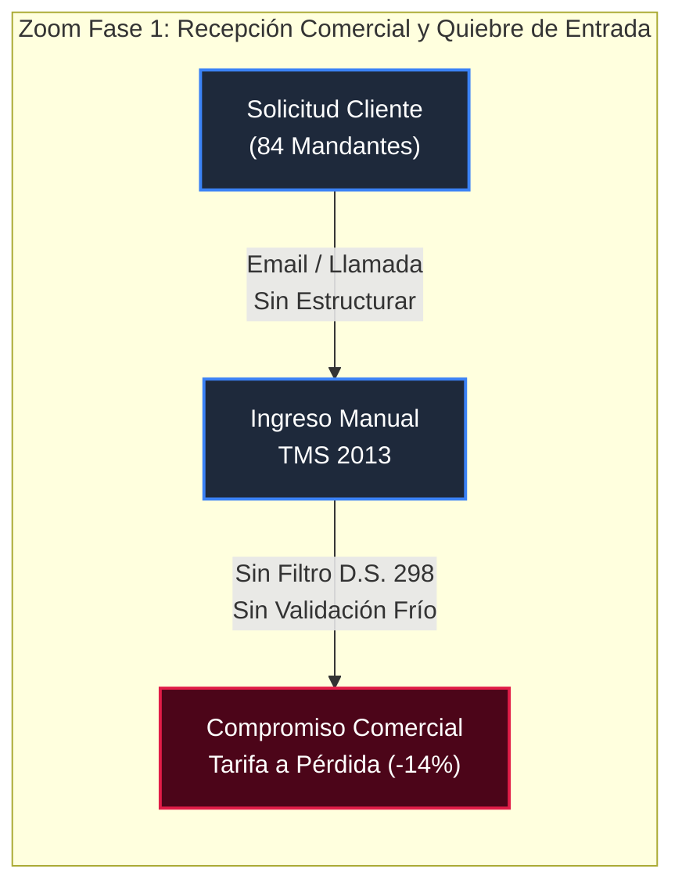
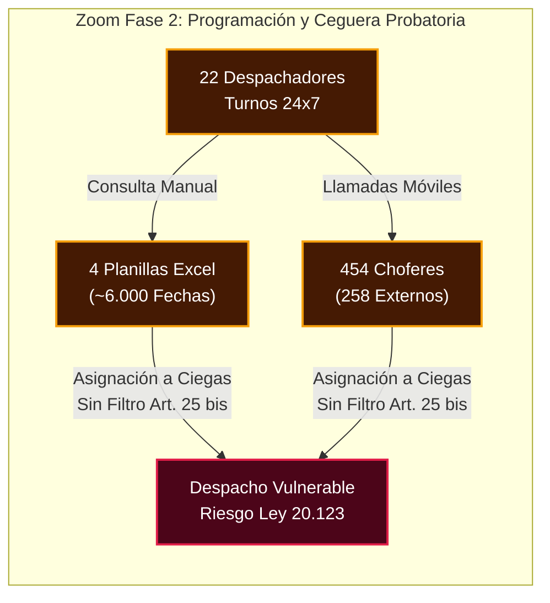
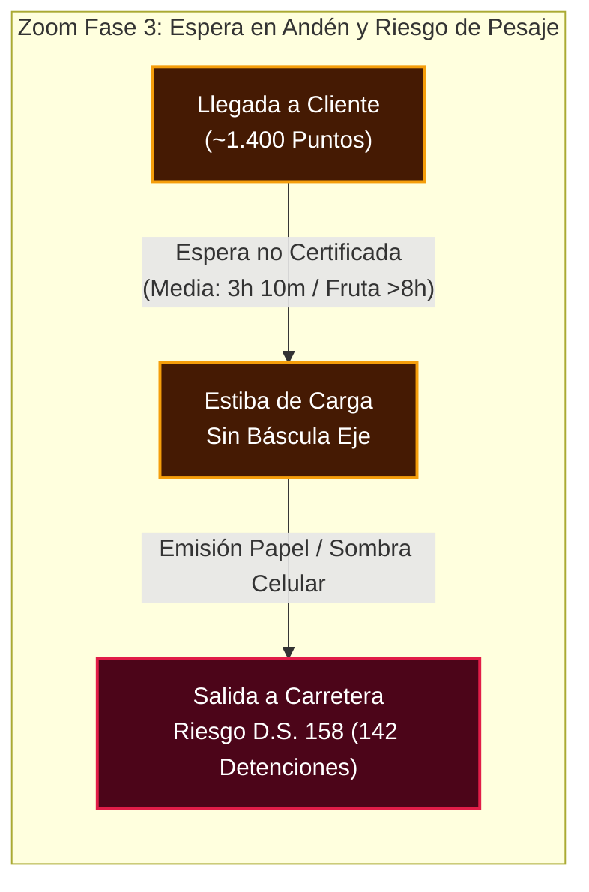
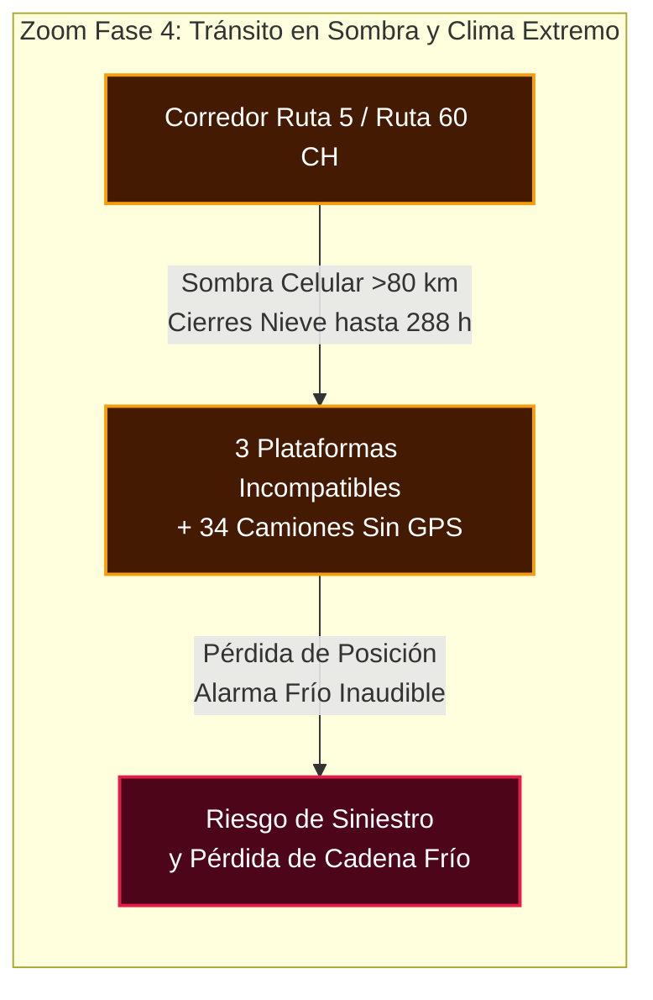
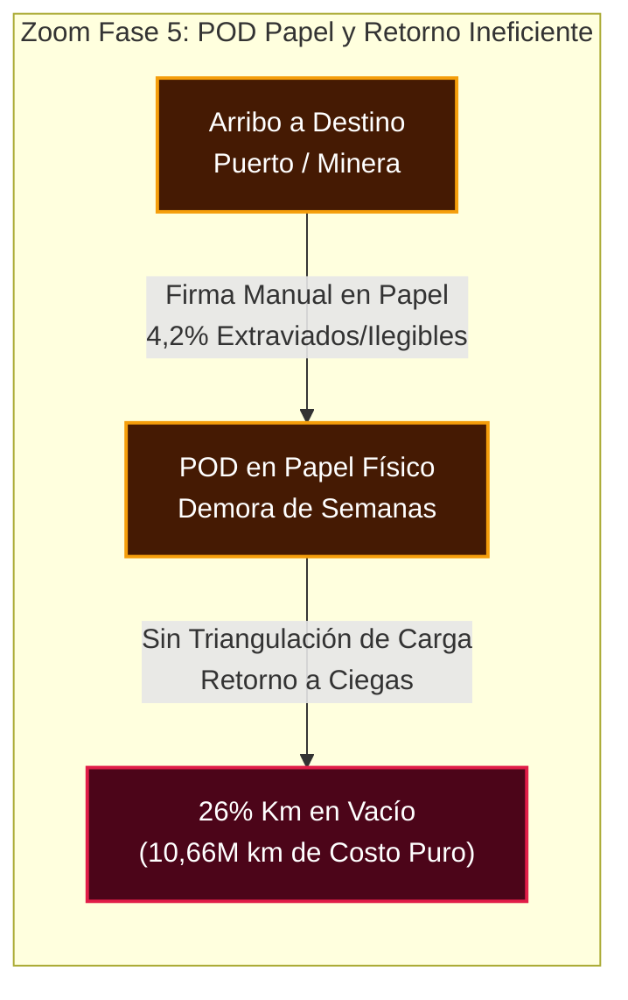
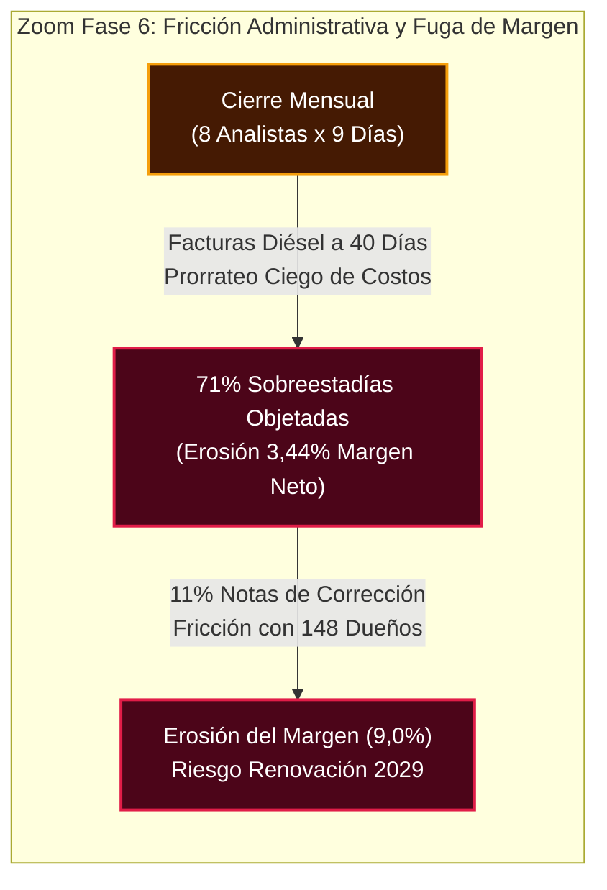
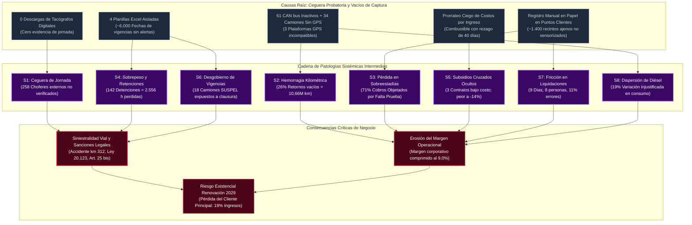
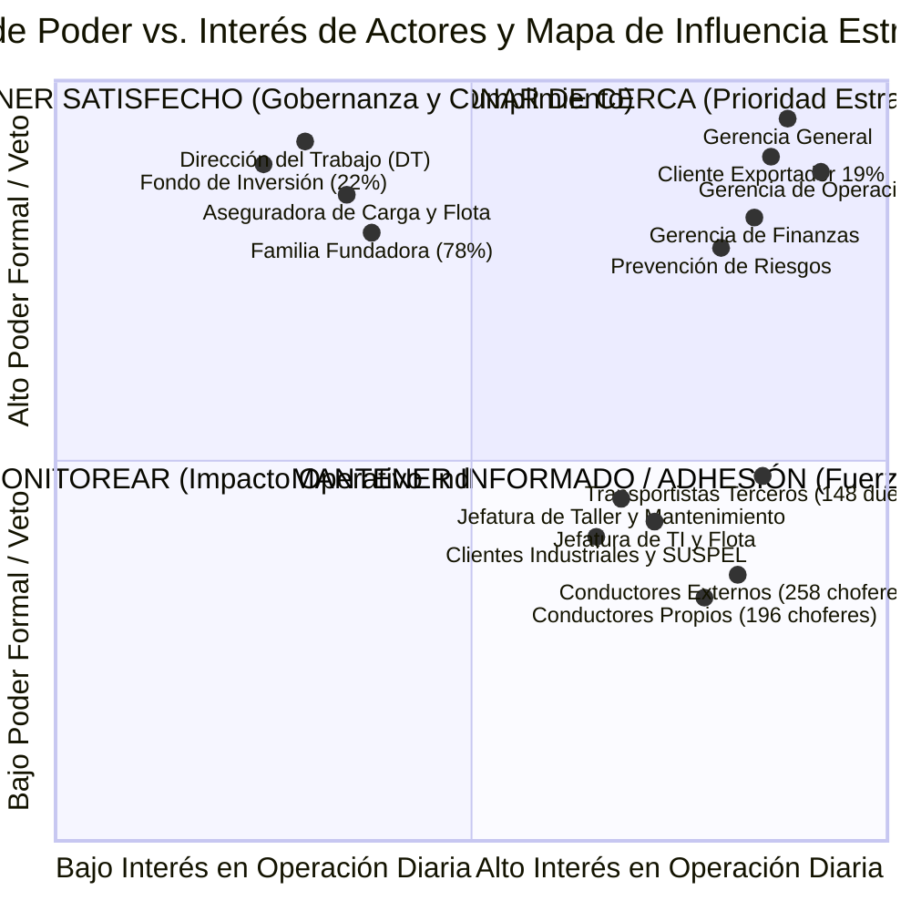

# SUBDOCUMENTO 2 — COMPRENSIÓN DEL PROBLEMA Y DE LA NECESIDAD

El presente subdocumento expone el diagnóstico pericial, técnico, operacional, normativo y comercial realizado por **audIT Soluciones Tecnológicas SpA** sobre la situación actual de **Transportes Curimón S.A.**, en el marco de la Licitación Pública Nacional e Internacional N.° TFEP-01/2026. A partir del levantamiento de antecedentes y la evaluación rigurosa de los procesos logísticos en terreno, este documento desglosa la complejidad del desafío de transporte de carga por carretera, delimitando con precisión ingenieril las causas raíz de las ineficiencias observadas y las restricciones que condicionan la operación.

Este capítulo se articula orgánicamente con la totalidad de los subdocumentos y anexos de la propuesta técnica:
1. Provee el fundamento fáctico e ingenieril para el diseño del alcance y la descomposición modular expuestos en el **Subdocumento 3** (*Esquema de Solución y Alcance*).
2. Determina los requerimientos no funcionales de resiliencia, volumetría y desempeño que gobiernan la **Arquitectura Lógica y Física** desarrollada en el **Subdocumento 4**.
3. Delimita los dominios de información, volumetría histórica y requerimientos de gobernanza formalizados en el **Subdocumento 5** (*Modelo y Gestión de Datos*).
4. Define el contexto operacional bajo el cual se estructuran las metodologías de trabajo, los paquetes de la Estructura de Descomposición del Trabajo (EDT) y la matriz de riesgos analizados en los **Subdocumentos 6, 7 y 8**.
5. Establece los umbrales basales de calidad, niveles de servicio y soporte continuado a 36 meses detallados en los **Subdocumentos 9, 10 y 11**.
6. Se vincula de forma directa con la asignación de roles y perfiles del **Subdocumento 12**, la justificación del catálogo de innovaciones del **Subdocumento 13** y la demostración de beneficios cuantificados en el **Subdocumento 14**.

Asimismo, para asegurar la legibilidad del cuerpo principal conforme a lo normado en el Comunicado 10, los inventarios detallados de requerimientos preliminares, el desglose pormenorizado del parque vehicular y conductores, la matriz exhaustiva de restricciones legales y las fichas completas de caracterización de actores se trasladan al documento complementario `AUDIT-Subdocumento2-Anexos.md`, el cual se referencia formalmente a lo largo de este texto.

---

## 2.1 Resumen Ejecutivo del problema

El diagnóstico estructural de Transportes Curimón S.A. revela un desacople crítico entre la responsabilidad integral asumida por la compañía frente a sus mandantes y el control operacional efectivo que ejerce sobre los recursos con que ejecuta el servicio de transporte interurbano. En el modelo de negocio vigente, Curimón asume el 100% de la responsabilidad patrimonial, civil y laboral por la carga transportada, la puntualidad en los puntos de destino, la seguridad de las operaciones en ruta y el cumplimiento normativo ante organismos fiscalizadores. No obstante, el 60,4% de la capacidad de transporte rodante (226 tractocamiones de un total de 374) y el 56,8% de la fuerza de conducción asignable (258 conductores externos frente a 196 propios) corresponden a recursos subcontratados pertenecientes a 148 pequeños y medianos transportistas independientes, sobre los cuales la empresa no ejerce tuición patronal ni subordinación directa.

Esta asimetría estructural genera vacíos sistemáticos de supervisión que impactan de manera directa la estabilidad operacional de la compañía. En el plano de la escala física, la red logística de Curimón coordina anualmente 96.000 viajes, movilizando 2,4 millones de toneladas de carga a lo largo de 41 millones de kilómetros recorridos por carretera. La operación se despliega en un eje territorial superior a 3.000 kilómetros lineales entre las ciudades de Antofagasta y Puerto Montt, complementado por aproximadamente 1.900 cruces internacionales por el Paso Fronterizo Los Libertadores hacia la provincia de Mendoza. La magnitud territorial descrita se gestiona actualmente mediante una asignación basada predominantemente en telefonía, planillas de cálculo y la memoria de 22 despachadores en la Torre de Programación de San Bernardo, lo que origina una ineficiencia estructural verificable: el 26% de la distancia total anual recorrida se ejecuta en condición de retorno en vacío (10,66 millones de kilómetros sin carga).

La fragilidad descrita se traslada con rigor a la estructura financiera y comercial de la compañía. Curimón registra la facturación anual bruta consolidada del mandante operando con un margen operacional estrecho del 9,0%. Sin embargo, dicho margen global encubre una distorsión profunda: el análisis analítico de rentabilidad por contrato evidencia que tres (3) de los ocho (8) clientes principales de la empresa operan por debajo de la línea de costo técnico. Estos tres contratos deficitarios concentran en conjunto el 31% de los despachos e ingresos corporativos, registrándose en el caso más grave un contrato con un margen negativo sostenido del -14% durante cuatro ejercicios fiscales consecutivos. Esta pérdida ha sido financiada de forma involuntaria por las rutas rentables debido a la aplicación histórica de un esquema contable de prorrateo ciego de costos por ingresos. 

A esta fuga de valor se suma la pérdida de ingresos por concepto de sobreestadías en instalaciones de clientes: el 71% de los cobros emitidos por concepto de sobreestadías en recintos de carga y descarga resulta sistemáticamente objetado y retenido por los clientes debido a la inexistencia de registros cronológicos objetivos e inalterables que demuestren fehacientemente los horarios de llegada, espera y despacho, erosionando un 3,44% del margen operacional neto anual de la compañía (determinado analíticamente al relacionar 241,4 millones de unidades de sobreestadía no cobradas frente a 7.020 millones de unidades de margen neto anual al 9,0%).

En el ámbito de la gobernanza de datos y el cumplimiento legal, la empresa presenta una ceguera probatoria crítica. La trazabilidad documental se apoya en cerca de 6.000 fechas de vencimiento vivas (licencias de conducir, permisos de circulación, revisiones técnicas, certificados de transporte de sustancias peligrosas y seguros obligatorios) administradas manualmente en cuatro planillas de cálculo sin integridad referencial ni alarmas automáticas preventivas. A nivel de hardware instalado, existe una desconexión generalizada: se constata un registro histórico de cero descargas de tacógrafos digitales, 61 tractocamiones propios disponen de telemetría de bus CAN J1939 de fábrica que nunca ha sido consultada ni integrada, 34 camiones de terceros carecen por completo de dispositivos satelitales GPS, y las 340 unidades restantes se encuentran fragmentadas en tres plataformas comerciales heterogéneas que impiden conformar una vista de mando operacional unificada.

Esta situación de vulnerabilidad adquiere carácter de riesgo existencial ante la proximidad del ciclo de renovación contractual fijado para el año 2029 por el cliente exportador principal de la compañía. Dicho mandante concentra el 19% de la actividad comercial y facturación global de la empresa (superando ampliamente el total del margen neto corporativo del 9,0%) y ha formalizado cuatro requerimientos de cumplimiento obligatorio e improrrogable:
1. Trazabilidad integral y posicionamiento de carga en tiempo real para el 100% de los despachos asignados.
2. Emisión y tramitación de documentación electrónica de transporte sin redigitación manual ni soporte físico en papel (e-Docs para un volumen proyectado de 128.000 documentos anuales).
3. Acreditación técnica fehaciente del cumplimiento de los límites de jornada laboral y descansos obligatorios del Artículo 25 bis del Código del Trabajo para la totalidad de los conductores (tanto propios como externos de terceros) en cada viaje asignado.
4. Reportabilidad periódica y auditada de emisiones de gases de efecto invernadero (GEI/CO2e) por tonelada-kilómetro transportada, calculada bajo el estándar internacional del marco GLEC (*Global Logistics Emissions Council*) / ISO 14083:2023.

El incumplimiento de estas exigencias hacia el año 2029 supondría la pérdida inmediata del 19% de la facturación de Curimón, lo que destruiría la totalidad del margen operacional corporativo (9,0%) y sumiría a la empresa en insolvencia económica. En consecuencia, el desafío técnico consiste en estructurar un diagnóstico holístico y riguroso que dimensione estas brechas para sustentar la ingeniería de transformación sin confundir el problema con las soluciones que se detallarán en los capítulos posteriores.

---

## 2.2 Comprensión del problema y de la necesidad

Para comprender la raíz del problema operacional de Transportes Curimón S.A., es indispensable contextualizar la actividad en la cadena de valor del transporte terrestre de carga interurbana en Chile, examinando las restricciones geográficas, comerciales y los marcos legales que gobiernan la circulación por carretera.

A continuación, la Figura 2.1 describe el flujo operacional y la cadena de valor característica del transporte de carga en Curimón, ilustrando la secuencia de procesos desde la recepción de la orden de transporte hasta la liquidación final y cierre de costos.

*Figura 2.1 — Flujo Operacional y Cadena de Valor del Transporte de Carga en Curimón.*  
*Fuente: Elaboración propia a partir de las Bases Técnicas del Caso 10 (Transportes Curimón S.A., 2026).*

El análisis de la Figura 2.1 permite constatar que la cadena de valor de Curimón se encuentra fragmentada por discontinuidades analíticas y operacionales en cada una de sus fases. En estricta concordancia con la técnica de descomposición jerárquica (*Zoom-In*), a continuación se desglosa el funcionamiento interno, los cuellos de botella y los riesgos de pérdida de trazabilidad específicos de cada uno de los seis bloques de la cadena operativa:

1. **Fase 1: Comercial y Recepción de Demanda:**
   * *Proceso Operativo:* Captura y formalización de solicitudes de transporte generadas por los 84 clientes corporativos de la cartera.
   * *Sistemas y Prácticas Actuales:* Registro manual en el sistema legado TMS 2013, complementado con correos electrónicos y llamadas telefónicas no estructuradas.
   * *Cuellos de Botella y Puntos de Fricción:* Ausencia de validación automatizada de compatibilidad de carga al momento de ingresar la solicitud (identificación tardía de requerimientos de frío Pt100, especificaciones D.S. 298 para sustancias peligrosas o restricciones de peso por eje según D.S. 158).
   * *Riesgo de Negocio:* Compromiso comercial de itinerarios irreales o con tarifas deficitarias (prorrateo ciego), perpetuando contratos que operan hasta con un -14% de margen operacional negativo.

2. **Fase 2: Programación y Asignación de Recursos:**
   * *Proceso Operativo:* Casamiento de órdenes de transporte con unidades de tracción (374 camiones) y tripulaciones (454 conductores).
   * *Sistemas y Prácticas Actuales:* Torre de Programación en Terminal San Bernardo compuesta por 22 despachadores en turnos rotativos 24x7x365, quienes operan consultando manualmente cuatro (4) planillas de cálculo Excel aisladas con cerca de 6.000 fechas vivas de vigencia documental.
   * *Cuellos de Botella y Puntos de Fricción:* Asignación manual basada en llamadas telefónicas y memoria de los operadores. La falta de filtros algorítmicos cruzados impide validar síncronamente en pre-despacho el cumplimiento de los límites de jornada laboral del Artículo 25 bis del Código del Trabajo, la vigencia documental del camión y del chofer, y la localización geográfica de la unidad más cercana.
   * *Riesgo de Negocio:* Despacho de choferes con fatiga acumulada (ceguera de jornada en 258 conductores externos), exponiendo a la empresa a responsabilidad solidaria o subsidiaria según Ley N.° 20.123 ante siniestros viales graves (accidente km 312).

3. **Fase 3: Carga y Despacho en Instalaciones de Origen:**
   * *Proceso Operativo:* Presentación del camión en el recinto del cliente (~1.400 puntos a nivel nacional), ingreso a andén, estiba física de la carga y emisión de documentos de despacho.
   * *Sistemas y Prácticas Actuales:* Registro manuscrito en hojas de control de portería y planillas de papel provistas por el cliente o el transportista.
   * *Cuellos de Botella y Puntos de Fricción:* Saturación masiva de patios y andenes de carga en faenas agrícolas y mineras. Los tiempos de espera promedian 3 horas 10 minutos y superan las 8 horas en faenas frutícolas de temporada. Al no existir geocercas poligonales automáticas ni atestación telemática inalterable, las horas de espera no quedan acreditadas objetivamente. En paralelo, la emisión de guías de despacho y Documentos Electrónicos de Transporte (DET) colapsa si el recinto se ubica en zonas con sombra celular.
   * *Riesgo de Negocio:* Retenciones viales en plazas MOP por sobrepeso al salir sin pesaje instrumental previo (142 detenciones en 2025 = 2.556 horas perdidas) y rechazo sistemático del cobro de sobreestadías por parte del mandante.

4. **Fase 4: Tránsito en Ruta y Logística Interurbana:**
   * *Proceso Operativo:* Conducción por el eje troncal de la Ruta 5 (corredor de 3.000 km entre Antofagasta y Puerto Montt) y cruce internacional por el Paso Los Libertadores (Ruta 60 CH hacia Mendoza).
   * *Sistemas y Prácticas Actuales:* Monitoreo fragmentado en tres plataformas GPS comerciales incompatibles para 192 camiones terceros, mientras que 61 camiones propios poseen CAN bus J1939 inactivo y 34 unidades externas carecen de todo dispositivo de posicionamiento.
   * *Cuellos de Botella y Puntos de Fricción:* Tramos con más de 80 kilómetros continuos de sombra celular en el desierto y pasos cordilleranos, donde los sistemas comerciales pierden la señal y no almacenan datos locales. Cierres invernales de hasta 12 días continuos (288 horas) por nieve y viento blanco en alta montaña, inmovilizando la carga sin transmisión telemática.
   * *Riesgo de Negocio:* Desconexión total de las alertas de temperatura en carga refrigerada, pérdida de trazabilidad ante robos o desvíos, e incumplimiento de la Ley No Chat (Ley N.° 21.377) al forzar la comunicación manual con choferes en movimiento ($v > 0\text{ km/h}$).

5. **Fase 5: Arribo, Descarga y Cierre de Entrega:**
   * *Proceso Operativo:* Arribo a destino final (puerto marítimo, centro de distribución, faena minera), desestiba, recepción de carga y certificación de conformidad.
   * *Sistemas y Prácticas Actuales:* Emisión de comprobantes de entrega en papel (*Proof of Delivery* [POD]) firmados a mano y timbrados en portería.
   * *Cuellos de Botella y Puntos de Fricción:* Retrasos severos en la recepción y objeción de sobreestadías en destino. Un 4,2% de las guías de papel se extravían, resultan manchadas o ilegibles en el retorno físico hacia San Bernardo. Asimismo, la Torre de Tráfico carece de visibilidad inmediata para programar recargas de retorno, forzando la vuelta a base sin carga.
   * *Riesgo de Negocio:* Hemorragia kilométrica de un 26% de retornos en vacío (10,66 millones de kilómetros al año sin facturar) y dilatación del ciclo de cobro comercial al no disponer de POD digital inmediato.

6. **Fase 6: Liquidación, Costeo y Facturación:**
   * *Proceso Operativo:* Rendición de cuentas de viajes ejecutados, pago de fletes a 148 transportistas terceros, conciliación de facturas de diésel y cobro a clientes.
   * *Sistemas y Prácticas Actuales:* Proceso administrativo manual en Casa Matriz San Bernardo que insume nueve (9) días hábiles mensuales y el trabajo continuo de ocho (8) profesionales para conciliar planillas físicas y talones de peaje/combustible.
   * *Cuellos de Botella y Puntos de Fricción:* Desfase analítico de hasta 40 días en la recepción de facturas consolidadas de combustible, imposibilitando detectar a tiempo dispersiones de rendimiento de hasta un 19% en carretera. Prorrateo contable ciego de costos en función de ingresos brutos.
   * *Riesgo de Negocio:* El 71% de los cobros anuales facturados por sobreestadías resulta objetado y retenido por clientes por carecer de prueba fehaciente, mermando un 3,44% del margen operacional neto anual de la compañía (241,4 millones de unidades de cobro retenido sobre 7.020 millones de margen neto corporativo al 9,0%). Un 11% de las liquidaciones a transportistas son reclamadas y corregidas con notas de crédito, friccionando la relación con quienes proveen el 60,4% de la capacidad de tracción de la compañía.

### 2.2.1 Diagnóstico Holístico e Integración Causal de la Cadena Operacional

Las fallas detectadas en Transportes Curimón S.A. no representan eventos aislados atribuibles a descuidos puntuales de personal, sino que responden a una cadena causal integrada de patologías organizacionales y técnicas que se retroalimentan mutuamente:

1. **Subsidios Cruzados de Tarifas y Prorrateo Ciego:** La práctica contable de distribuir los costos operacionales en función de los ingresos brutos facturados por cada cliente ha encubierto la rentabilidad marginal real de cada servicio. El análisis financiero pormenorizado demuestra que tres contratos comerciales operan bajo costo, absorbiendo en conjunto el 31% de la actividad e ingresos corporativos. El caso más crítico registra cuatro años consecutivos operando con un margen negativo de -14%. Debido a que los costos directos de combustible, peajes de autopista y tarifas a terceros no se asocian de forma unívoca a la orden de transporte que los originó, las rutas altamente rentables financian de manera continua e invisible los déficits de los contratos ruinosos, distorsionando la estrategia comercial y mermando el margen de la compañía (9,0%).
2. **Brecha Probatoria de Tacógrafo Digital y Ceguera de Descanso:** La omisión absoluta en la descarga de tacógrafos digitales (cero descargas históricas) y la falta de control sobre las actividades previas de los 258 conductores subcontratados generan un punto ciego operacional con severas ramificaciones legales. El incidente ocurrido el 14 de febrero de 2026 en el kilómetro 312 de la Ruta 5 Sur (volcamiento de un tractocamión subcontratado a las 04:40 h por fatiga extrema del operador) expuso judicialmente que dicho chofer venía de cumplir un servicio continuo para otra empresa sin haber gozado del descanso legal mínimo. Bajo el régimen de subcontratación, la empresa carecía de registros para acreditar su debida diligencia patronal, lo que derivó en la suspensión de contratos comerciales durante seis semanas e investigaciones de la autoridad laboral.
3. **Dispersión Injustificada de Combustible y Rezago Analítico:** El combustible representa el 14% de la estructura de costos de Curimón, posicionándose como el segundo rubro de mayor gasto de la compañía. La gestión de este recurso presenta dos deficiencias estructurales: por una parte, existe una dispersión de rendimiento de hasta un 19% entre tractocamiones de idéntica marca, modelo y año asignados a una misma ruta geográfica; por otra parte, la conciliación de los consumos depende de la recepción mensual de las facturas consolidadas de las distribuidoras de combustible, lo que introduce un retraso analítico de hasta 40 días. Durante esta ventana temporal, la empresa desconoce anomalías como ralentí excesivo, desvíos de ruta, malos hábitos de aceleración o eventuales pérdidas en carretera, imposibilitando la aplicación oportuna de medidas correctivas.
4. **Vulnerabilidad de Infraestructura en Alta Montaña y Desierto:** El paso fronterizo Los Libertadores, por donde transitan aproximadamente 1.900 viajes internacionales al año, permanece cerrado entre junio y septiembre por eventos meteorológicos extremos de nieve y viento blanco durante períodos que alcanzan hasta 12 días continuos (288 horas). En estas circunstancias, decenas de camiones con carga industrial y química quedan varados en alta montaña sin conectividad celular ni soporte local. En paralelo, los corredores mineros de la Región de Antofagasta registran sombras de telecomunicaciones de más de 80 kilómetros. Al no concebirse la desconexión como un estado operacional estándar, el sistema pierde la posición de los vehículos, no puede actualizar itinerarios y queda expuesto a la pérdida de información crítica.

### 2.2.2 Fundamentación de la Investigación Externa Aportada y Marco Normativo

audIT Soluciones Tecnológicas SpA ha incorporado en el análisis pericial del problema un conjunto de normativas y estándares externos que condicionan de manera directa la operación y fijan los requerimientos de diseño de cualquier arquitectura de procesos logísticos. A continuación, se acredita formalmente el valor técnico y las consecuencias operativas que impone cada norma:

* **Ley N.° 20.123 sobre Trabajo en Régimen de Subcontratación:** Esta normativa, promulgada por el Ministerio del Trabajo y Previsión Social (2006), establece que la empresa principal (Transportes Curimón S.A.) es solidaria o subsidiariamente responsable de las obligaciones laborales, previsionales y de seguridad y salud en el trabajo que afecten a los trabajadores de sus contratistas. Dado que el 56,8% de los conductores que tripulan camiones a nombre de Curimón son dependientes de 148 microempresarios externos, cualquier infracción a los descansos legales, impago previsional o accidente con lesiones en carretera traslada la responsabilidad legal, civil e indemnizatoria directamente a Curimón si la compañía no ejerce de forma efectiva su derecho legal de información y retención. Esto impone la restricción de que Curimón debe validar la idoneidad y legalidad laboral del chofer externo de forma vinculante previo al despacho del viaje.
* **Artículo 25 bis del Código del Trabajo:** Regulado en el Decreto con Fuerza de Ley N.° 1 (Ministerio del Trabajo y Previsión Social, 2003), fija el régimen especial de jornada laboral para choferes de carga terrestre interurbana. Establece un límite de conducción continua que no puede exceder de cinco (5) horas; un descanso obligatorio no inferior a dos (2) horas al término de cada ciclo de cinco horas; un descanso diario ininterrumpido de al menos ocho (8) horas dentro de cada período de veinticuatro horas; y un tope mensual ordinario de 180 horas distribuidas en no menos de veintiún días. La transgresión de estos parámetros no solo acarrea cuantiosas multas de la Dirección del Trabajo, sino que anula las pólizas de seguros de carga y expone a la plana ejecutiva a querellas penales por cuasidelito de lesiones o muerte en siniestros viales originados por somnolencia.
* **Decreto Supremo N.° 298/1994 (MTT) frente al Decreto Supremo N.° 43/2015 (MINSAL) para Sustancias Peligrosas (SUSPEL):** Curimón dispone de 18 unidades especializadas en transporte de sustancias químicas. El marco regulatorio impone dos normativas complementarias pero con ámbitos físicos diferenciados:
  * El **D.S. N.° 298/1994** del Ministerio de Transportes y Telecomunicaciones reglamenta el transporte de cargas peligrosas por calles y caminos, exigiendo que el vehículo cuente con una antigüedad máxima permitida, revisión técnica periódica específica, señalización reglamentaria bajo norma chilena NCh 2190 (rótulos de advertencia y número UN), extintores adecuados, tacógrafo operativo, Hoja de Datos de Seguridad (HDS) en cabina y un conductor debidamente capacitado con curso de transporte de sustancias peligrosas vigente. El incidente documentado en abril de 2026, donde una unidad quedó inmovilizada 14 horas por portar el certificado del conductor vencido tres semanas antes, demuestra el colapso del control de este decreto.
  * El **D.S. N.° 43/2015** del Ministerio de Salud regula el almacenamiento de sustancias peligrosas en instalaciones fijas, afectando directamente al Terminal Matriz de San Bernardo y patios de acopio. Exige distancias de segregación química, pretiles de retención de derrames, sistemas de extinción certificados y prohíbe taxativamente la permanencia o pernoctación de camiones cargados con sustancias incompatibles en áreas no habilitadas. La coexistencia de ambas normas demanda un control documental y espacial riguroso que impida el despacho o estacionamiento irregular de estas unidades.
* **Ley de Tránsito N.° 18.290 y Ley N.° 21.377 (Ley No Chat):** El Decreto con Fuerza de Ley N.° 1 del Ministerio de Transportes y Telecomunicaciones (2009), enriquecido por la Ley N.° 21.377 (Congreso Nacional de Chile, 2021), tipifica como infracción gravísima la conducción de vehículos manipulando dispositivos de telefonía móvil o cualquier otro artefacto electrónico o digital que no venga incorporado de fábrica en el vehículo, a menos que su operación se realice mediante manos libres y sin desviar la vista del camino. Esta disposición legal introduce una restricción física y ergonómica inmutable en la cabina del camión: prohíbe que el conductor interactúe manualmente con pantallas, teléfonos celulares o aplicaciones durante el movimiento del vehículo ($v > 0\text{ km/h}$). Cualquier interacción manual debe limitarse a momentos de detención total comprobada, o bien gestionarse mediante mecanismos auditivos pasivos de síntesis de voz.
* **Marco GLEC (*Global Logistics Emissions Council*) / ISO 14083:2023:** Desarrollado por el *Smart Freight Centre* (Global Logistics Emissions Council, 2023), el marco GLEC constituye el estándar internacional de referencia adoptado por las multinacionales exportadoras para el cálculo y auditoría de la huella de carbono en la cadena logística. Exige reportar las emisiones de dióxido de carbono equivalente ($\text{CO}_2\text{e}$) por tonelada-kilómetro transportada ($\text{g CO}_2\text{e}/\text{t-km}$), desagregando las fases *Well-to-Tank* (WTT) y *Tank-to-Wheel* (TTW). Para Curimón, satisfacer el ultimátum comercial del cliente exportador (19% de ingresos) implica la imposibilidad de aplicar estimaciones teóricas o factores promedio de emisión; se requiere computar el consumo real de diésel medido empíricamente sobre el motor y asociarlo a la carga neta efectiva movilizada en cada tramo.
* **El Tacógrafo Digital como Instrumento Probatorio Inalterable:** La jurisprudencia laboral y de tránsito en Chile reconoce al tacógrafo digital como el medio de prueba por excelencia para acreditar la velocidad y el cumplimiento de los tiempos de manejo y descanso del conductor. Sin embargo, su eficacia legal depende de la cadena de custodia: los archivos digitales deben ser extraídos periódicamente en su formato nativo inalterable con firma criptográfica. La omisión histórica de Curimón en la descarga de tacógrafos ha privado a la compañía de su principal herramienta de defensa jurídica frente a demandas laborales, multas de la Dirección del Trabajo y litigios con compañías de seguros.

### 2.2.3 Modelación Cuantitativa de la Estacionalidad Operativa

Como se expone cuantitativamente a continuación en la Figura 2.2, la dinámica anual de la operación exhibe una marcada disparidad entre la regularidad basal de la carga general y los picos pronunciados de la temporada agrícola, superpuestos a las ventanas de riesgo climático en la alta cordillera.

*Figura 2.2 — Dinámica de Estacionalidad Operativa y Restricciones de Red en Ruta.*  
*Fuente: Elaboración propia a partir de Bases Técnicas del Caso 10 y registros de cruces Los Libertadores (Transportes Curimón S.A., 2026).*

El modelamiento gráfico de la Figura 2.2 fundamenta las dos singularidades estacionales que determinan la ingeniería de operaciones y las directrices de despliegue de audIT SpA:

1. **Temporada Frutícola y de Agroexportación (Diciembre a Abril):** Durante estos cinco meses (150 días), la industria agroexportadora de la zona central concentra la cosecha y exportación de cerezas, uvas, arándanos, manzanas y carozos. Este período genera las siguientes repercusiones cuantitativas:
   * Los 44 semirremolques refrigerados propios (correspondientes al 21,0% del parque de semirremolques propios y al 11,8% de la flota tractiva total) experimentan una utilización del 100%, absorbiendo en este período el **65% de la demanda anual acumulada** del servicio de cadena de frío.
   * La demanda agregada diaria se eleva desde un promedio anual de 263 viajes/día hasta un volumen de punta derivado analíticamente (\(96.000\text{ viajes/año} \times 0{,}65 / 150\text{ días} \approx 416\) a **450 viajes diarios** en semanas críticas de cosecha, equivalente a un factor punta de 1,71).
   * La infraestructura de los terminales de empaque (*packings*) y puertos de embarque (San Antonio y Valparaíso) se satura masivamente: los tiempos de espera de los camiones para cargar o descargar escalan desde el promedio basal de 3 horas 10 minutos hasta **superar las 8 horas continuas** en andenes y bermas de espera.
   * La rotación de conductores se intensifica drásticamente, incrementando el riesgo de fatiga y la probabilidad de pérdida de frío por apertura prolongada de puertas o desabastecimiento de combustible en los equipos de refrigeración autónomos (termógrafos).
2. **Cierres Climáticos del Paso Fronterizo Los Libertadores (Junio a Septiembre):** El corredor bioceánico de la Ruta 60 CH hacia Mendoza registra aproximadamente 1.900 cruces de camiones al año. Durante la temporada invernal, las nevazones en la alta cordillera (sobre los 3.200 msnm) provocan cortes de tránsito prolongados:
   * Se registran eventos de cierre continuo de frontera de **hasta 12 días consecutivos (288 horas continuas)** debido a temporales de nieve y viento blanco.
   * Si bien las bases de licitación fijan un piso reglamentario de 72 horas de operación autónoma (RT-03.10), la ingeniería de confiabilidad exige dimensionar la capacidad de almacenamiento local persistente a bordo a no menos de **288 horas de telemetría completa ininterrumpida** para cubrir la ventana climática extrema histórica documentada en alta montaña.
   * La flota queda inmovilizada en cobertizos cordilleranos y aparcamientos de frontera (Uspallata y Los Andes), manteniendo conductores a bordo y acumulando sobreestadías no planificadas.
   * Para evitar la pérdida de trazabilidad y datos durante estos eventos de 288 horas de aislamiento absoluto sin conectividad de datos celular comercial, se establece el requerimiento físico ineludible de que los dispositivos instalados a bordo cuenten con una capacidad de almacenamiento local persistente no menor a 288 horas de telemetría completa ininterrumpida, garantizando que ningún dato de jornada, temperatura o alarma se extravíe por desbordamiento de memoria.
3. **Ventanas de Restricción Vial y Cierres Administrativos:**
   * **Restricciones de Tránsito Pesado:** En festividades como Semana Santa y Fiestas Patrias (septiembre), el Ministerio de Obras Públicas y Carabineros de Chile restringen la circulación de camiones en las rutas 68, 78 y 5 Sur para descongestionar el tráfico vehicular menor, inmovilizando la flota por lapsos de 12 a 36 horas.
   * **Ciclo de Liquidación Mensual:** Durante los últimos nueve (9) días de cada mes calendario, la administración destina ocho (8) profesionales exclusivamente a procesar las liquidaciones manuales de los 148 transportistas, congelando procesos de auditoría analítica e introduciendo rigidez al flujo de caja corporativo.

---

## 2.3 Dimensionamiento del problema

El dimensionamiento cuantitativo del problema operacional de Transportes Curimón S.A. se sustenta en el análisis riguroso de las magnitudes físicas, financieras, territoriales y de seguridad que componen la actividad de la empresa. Todas las cifras presentadas derivan directamente de las Bases Técnicas del Caso 10 (Transportes Curimón S.A., 2026) y de las relaciones matemáticas de su modelo de negocio.

A continuación, la Tabla 2.1 sintetiza los parámetros volumétricos consolidados que caracterizan la escala de la operación actual y las proyecciones requeridas para la estabilidad del servicio.

#### Tabla 2.1 — Volumetría Operacional y Magnitudes del Desafío Logístico
*Fuente: Elaboración propia a partir de Bases Técnicas del Caso 10 (Transportes Curimón S.A., 2026).*

| Métrica Operacional | Línea Base Actual | Proyección a 3 Años | Unidad de Medida | Impacto en la Operación |
| :--- | :---: | :---: | :---: | :--- |
| **Viajes Anuales Totales** | 96.000 | 118.000 | viajes / año | Volumen medio de ~263 viajes/día (~450 viajes/día en peak estacional). |
| **Kilómetros Recorridos** | 41.000.000 | 50.000.000 | km / año | Desgaste intensivo de activos y base de odometría para mantenimiento. |
| **Kilómetros en Vacío** | 10.660.000 | < 7.500.000 | km / año | Corresponde al 26% del kilometraje anual sin generar facturación. |
| **Carga Total Transportada** | 2.400.000 | 2.900.000 | ton / año | Exposición a 142 detenciones viales anuales por sobrepeso por eje. |
| **Documentación D.E.T.** | 128.000 | 157.000 | documentos / año | Guías y documentos tributarios a emitir y respaldar sin papel. |
| **Puntos de Carga y Descarga** | 1.400 | 1.700 | instalaciones únicas | Recintos de clientes donde se producen esperas medias de 3 h 10 min. |
| **Vigencias Documentales** | 6.000 | 7.000 | fechas vivas | Fechas críticas de conductores y vehículos gestionadas en 4 Excel. |
| **Cruces Paso Los Libertadores**| 1.900 | 2.400 | cruces / año | Operación binacional sujeta a cierres climáticos de hasta 12 días. |
| **Abastecimientos Diésel** | 74.000 | 90.000 | eventos / año | Carga en estanque de San Bernardo y estaciones externas en ruta. |
| **Pasadas de Peajes (TAG)** | 620.000 | 760.000 | transacciones / año | Conciliación de peajes interurbanos desfasada sin costeo por ruta. |
| **Migración Histórica TMS 2013**| 480.000 | N/A | viajes y maestros | Base histórica de 5 años a migrar y conciliar según RT-05.15. |

El análisis de la Tabla 2.1 evidencia la magnitud transaccional que debe ser gobernada. El volumen de 96.000 viajes anuales, 41 millones de kilómetros distribuidos en 1.400 puntos de clientes y un acervo histórico de 480.000 viajes legados no pueden seguir siendo coordinados mediante procedimientos manuales ni memoria humana. La persistencia de un 26% de kilómetros en vacío (10,66 millones de km) representa una merma de recursos que destruye directamente el resultado operacional.

A continuación, la Figura 2.3 expone la cadena causal integrada que articula las diez patologías sistémicas diagnosticadas en Curimón, demostrando cómo los vacíos en la captura de datos primarios se propagan hasta comprometer el margen corporativo y amenazar la continuidad de los contratos comerciales.

*Figura 2.3 — Cadena Causal Integrada de Patologías Sistémicas y Pérdida de Valor.*  
*Fuente: Elaboración propia a partir de las Bases Técnicas del Caso 10 (Transportes Curimón S.A., 2026).*

La Figura 2.3 desglosa con claridad que la erosión del margen del 9% y la amenaza sobre la continuidad contractual son el resultado directo de no capturar, procesar ni validar la información primaria de la operación. Cuando la torre de tráfico asigna a ciegas respecto al descanso del chofer (S1), se precipitan accidentes graves e investigaciones por responsabilidad subsidiaria (Ley 20.123). Cuando la asignación ignora la geolocalización integrada para casar retornos (S2), se dilapida una porción sustancial del presupuesto de diésel rodando 10,66 millones de kilómetros vacíos (26% de la distancia anual). Cuando la sobreestadía en los 1.400 puntos de clientes no genera un registro digital inalterable (S3), las gerencias de adquisiciones objetan el 71% de las facturas emitidas, privando a la empresa de recursos críticos que merman su rentabilidad operacional neta.

### 2.3.1 Análisis de los 7 Bloques de Datos Duros de Curimón

A partir de la cadena causal expuesta, se dimensiona el impacto numérico de los siete bloques de datos duros que estructuran la operación:

1. **Parque Vehicular y Asimetría de Tenencia:** La flota totaliza 374 tractocamiones, divididos en 148 unidades propias (39,6%, con antigüedad media de 6,4 años) y 226 unidades subcontratadas (60,4%). A esto se añaden 210 semirremolques propios, de los cuales 44 son furgones refrigerados y 18 unidades están certificadas bajo D.S. N.° 298 para sustancias peligrosas. Los 226 camiones subcontratados pertenecen a 148 transportistas independientes que poseen entre 1 y 4 vehículos. Curimón provee la relación comercial y absorbe la responsabilidad patronal y civil completa, pero carece de potestad sobre el 60,4% de los tractocamiones motrices, impidiendo cualquier política de estandarización por imposición jerárquica.
2. **Fuerza Conductora y Brecha de Control de Jornada:** La fuerza laboral asignable suma 454 conductores: 196 dependientes con contrato indefinido en Curimón y 258 choferes dependientes de los 148 transportistas terceros. La ausencia de descargas de tacógrafos digitales y la carencia de control sobre las actividades previas de los choferes externos implican que la empresa despacha viajes sin verificar si el conductor ha descansado las 8 horas mínimas o si superó las 5 horas continuas de conducción (Art. 25 bis). En los últimos tres años se han documentado cuatro (4) siniestros graves con lesiones atribuibles a somnolencia y fatiga, siendo el accidente del kilómetro 312 el hito que gatilló la paralización temporal de servicios por parte de clientes mineros e industriales.
3. **Red Vial, Kilometraje y Retornos en Vacío:** La flota recorre 41 millones de kilómetros al año a lo largo de un corredor de 3.000 kilómetros. La descoordinación entre la demanda de transporte y la localización de los equipos da lugar a que el 26% de la distancia total (10,66 millones de km) se recorra en vacío. Esta ineficiencia equivale a movilizar una flota virtual de cerca de 97 tractocamiones consumiendo diésel, peajes y neumáticos sin percibir tarifa alguna.
4. **Desgobierno Documental y Recursos Tecnológicos Subutilizados:** La administración manual de aproximadamente 6.000 fechas vivas de vigencia en cuatro planillas de cálculo aisladas sin validación cruzada ha derivado en fallas graves, como la inmovilización de una unidad SUSPEL por 14 horas en abril de 2026 debido a un certificado vencido hace tres semanas. Asimismo, se evidencia una subutilización tecnológica crítica: 61 tractocamiones propios cuentan con módulos telemáticos CAN bus de fábrica que nunca han sido leídos; 34 camiones externos circulan sin GPS; y las 192 unidades de transportistas subcontratados con GPS previo operan fragmentadas sobre tres plataformas comerciales heterogéneas incompatibles entre sí (Wialon, Wisetrack, Webfleet), de las cuales dos no disponen de interfaces API automatizadas hacia la Torre de Control.

5. **Fricción Comercial y Pérdida por Sobreestadías:** La detención en los 1.400 recintos de carga y descarga genera tiempos muertos no imputables al transporte, promediando 3 horas 10 minutos y superando las 8 horas en la temporada agrícola. El 71% de los cobros emitidos por concepto de sobreestadías resulta sistemáticamente objetado por los clientes debido a la inexistencia de registros objetivos e inalterables que acrediten la permanencia en andén, lo que erosiona un 3,44% del margen operacional neto anual de la compañía (determinado analíticamente al relacionar 241,4 millones de unidades de cobro objetado frente a 7.020 millones de unidades de margen neto anual al 9,0%). A esto se suma que el 4,2% de los comprobantes de entrega en papel (*Proof of Delivery* [POD]) se extravían, resultan ilegibles o sufren roturas, demorando el ciclo de facturación y cobro.
6. **Estructura Financiera y Subsidios Cruzados:** La empresa opera con un margen consolidado estrecho del 9,0%. La estructura de costos se distribuye principalmente en: 38% para pagos a transportistas terceros, 14% en combustible de flota propia y 12% en remuneraciones de choferes propios. La asignación de costos por prorrateo ciego encubre que 3 de los 8 contratos principales (que concentran el 31% de los ingresos corporativos) operan bajo la línea de costo técnico, registrándose un contrato con un margen negativo sostenido de -14% durante cuatro años. En paralelo, el diésel exhibe una dispersión injustificada de rendimiento del 19% entre vehículos idénticos en la misma ruta, cuya causa se desconoce debido al desfase de 40 días en la recepción de facturas.
7. **Seguridad Vial, Pesajes y Riesgo Existencial:** Durante el año 2025, la flota registró 142 detenciones formales en plazas de pesaje del Ministerio de Obras Públicas por infringir los límites de peso máximo por eje establecidos en el D.S. N.° 158/1980, sumando 2.556 horas-camión inmovilizadas (promedio de 18 horas de detención por infracción). Este descontrol vial y documental colisiona frontalmente con el ultimátum impuesto por el cliente exportador mayor, el cual concentra el 19% de la actividad comercial y facturación global de la empresa (superando holgadamente el margen total corporativo del 9,0%), quien ha condicionado la renovación contractual de 2029 a la certificación de jornada en el 100% de los viajes, digitalización documental sin papel, posicionamiento continuo y auditoría de emisiones de GEI bajo marco GLEC / ISO 14083.

### 2.3.2 Caracterización Territorial y Mapeo de Nodos Críticos

El despliegue territorial de Transportes Curimón S.A. abarca una red física y logística compleja compuesta por seis tipologías de nodos operacionales, cuya infraestructura actual impone severas restricciones técnicas que deben ser consideradas en el diagnóstico.

A continuación, la Tabla 2.2 sintetiza las características y niveles de criticidad de los nodos que conforman la red operacional de la empresa.

#### Tabla 2.2 — Síntesis de Nodos Críticos de la Red Operacional
*Fuente: Elaboración propia a partir de Bases Técnicas del Caso 10 y Bases Transversales (Transportes Curimón S.A., 2026).*

| Nodo Operacional | Tipología e Instalación | Enlaces y Telecomunicaciones | Restricción Crítica Identificada | Criticidad |
| :--- | :--- | :--- | :--- | :---: |
| **Terminal San Bernardo (Matriz)** | Casa matriz, torre 24x7, taller central, estanque diésel. | Enlace principal de fibra óptica + enlace de respaldo 4G/5G. | Sala de servidores de 26 m², split doméstico y UPS 20 min (incumple RT-06). | **Máxima** |
| **Terminales Regionales (4 Bases)**| Valparaíso (puerto), Concepción (industrial), Antofagasta (minero/SUSPEL) y Puerto Montt (acuícola). | Enlaces comerciales locales con conectividad dispar; 3 de 4 terminales carecen de respaldo. | Vulnerabilidad de conectividad; puntos de relevo y control de flota en macrozonas norte, centro y sur. | **Alta** |
| **Talleres Propios y Convenios (2)**| San Bernardo (taller mayor) y Los Ángeles (taller intermedio); 46 técnicos. | Conectados a la red corporativa de sus bases; asistencia externa en Talca. | Ciclo de paso por taller cada 6 días en propios; terceros pasan cada 30 días o más. | **Alta** |
| **Paso Los Libertadores** | Corredor bioceánico binacional hacia Mendoza (~1.900 viajes). | Conectividad celular precaria; sujeta a infraestructura fronteriza. | Cierres climáticos por nieve de hasta 12 días continuos (288 horas) sin señal. | **Crítica** |
| **Zonas de Sombra Celular** | Corredor Ruta 5 Norte (Atacama) y tramos cordilleranos. | Desconexión celular absoluta (cero cobertura en tramos > 80 km). | Pérdida total de transmisión telemática en tiempo real y bloqueo de e-Docs en ruta. | **Crítica** |
| **Puntos de Clientes (~1.400)** | Plantas industriales, packings, mineras y recintos portuarios. | Infraestructura ajena; prohibición de instalar equipos en recintos. | Esperas no acreditadas (3 h 10 min a >8 h); 71% sobreestadías objetadas. | **Alta** |

El análisis de la Tabla 2.2 expone que la sala de servidores ubicada en el Terminal San Bernardo (26 m², climatización por split doméstico, una UPS con 20 minutos de autonomía y carencia de grupo generador industrial redundante) incumple formalmente los requerimientos de infraestructura física estipulados en las Bases Técnicas Transversales (requerimientos RT-06.01 a RT-06.09). Intentar alojar la plataforma de misión crítica de la compañía en estas dependencias constituiría un punto único de falla (*Single Point of Failure* [SPOF]) inaceptable para una operación continua de 24 horas al día, 365 días al año. 

Asimismo, la presencia de tramos con más de 80 kilómetros continuos sin cobertura de telecomunicaciones en la Ruta 5 Norte y los cierres de hasta 288 horas por temporales cordilleranos en el Paso Los Libertadores determinan que la arquitectura tecnológica no puede asumir la conectividad permanente como un supuesto válido. La desconexión es una condición física intrínseca a la geografía chilena, y los sistemas deben operar con autonomía local en cabina y sincronización escalonada determinista al recuperar señal celular.

---

## 2.4 Actores y Grupos de Interés

La operación y gobernanza de Transportes Curimón S.A. involucra a un ecosistema diverso de trece (13) actores clave, cuyos intereses, expectativas y capacidades de bloqueo determinan la viabilidad de cualquier transformación en los procesos corporativos. En el diagnóstico previo se omitió a tres actores estratégicos: el **Fondo de Inversión Institucional**, la **Dirección del Trabajo (DT)** y la **Aseguradora de Carga y Flota**. A continuación, se presenta la caracterización exhaustiva de la totalidad de los actores.

A continuación, la Figura 2.4 ilustra el mapeo de actores en la Matriz de Poder e Influencia frente al Nivel de Interés, identificando la estrategia de gestión corporativa requerida para cada uno.

*Figura 2.4 — Matriz de Poder vs. Interés de Actores y Mapa de Influencia Estratégica.*  
*Fuente: Elaboración propia conforme a metodología de gestión de stakeholders (PMBOK / Curimón S.A., 2026).*

El análisis de la Figura 2.4 permite estructurar la gobernanza de los grupos de interés en cuatro cuadrantes de acción bien diferenciados:
* **Cuadrante 1 — Gestionar de Cerca (Alto Poder / Alto Interés):** Concentra a las gerencias de Curimón (General, Operaciones, Finanzas y Prevención) y al Cliente Exportador del 19%. Estos actores son los garantes de la viabilidad económica y la continuidad del negocio; una fricción no resuelta con cualquiera de ellos paraliza la operación o deriva en la pérdida del contrato principal.
* **Cuadrante 2 — Mantener Satisfecho (Alto Poder / Bajo Interés Diario):** Incluye a las entidades fiscalizadoras y de capital: la Dirección del Trabajo (DT), la Aseguradora de Carga, el Fondo de Inversión Institucional (22%) y la Familia Fundadora (78%). Estos actores no intervienen en el despacho diario, pero poseen facultad de clausura legal, revocación de pólizas de seguro, o veto financiero sobre el Directorio.
* **Cuadrante 3 — Monitorear (Bajo Poder / Bajo Interés Operativo Central):** Agrupa a las jefaturas técnicas intermedias (TI y Mantenimiento), que canalizan la viabilidad instrumental de las plataformas.
* **Cuadrante 4 — Mantener Informado y Asegurar Adhesión (Bajo Poder Jerárquico / Alto Interés de Campo):** Compuesto por los 148 dueños subcontratados, los 258 choferes externos y los 196 choferes propios. Aunque individualmente carecen de poder societario, su poder colectivo de veto de facto es altísimo: si los transportistas rechazan compartir datos o los conductores sabotean el registro de jornada, la operación de Curimón queda desabastecida en un 60,4%.

A continuación, la Tabla 2.3 resume las características, expectativas y riesgos asociados a cada uno de los trece actores del ecosistema.

#### Tabla 2.3 — Matriz Sintética de Actores y Grupos de Interés
*Fuente: Elaboración propia a partir de Bases Técnicas del Caso 10 (Transportes Curimón S.A., 2026). Detalle exhaustivo en Anexo 2.D.*

| Actor / Stakeholder | Representatividad / Dotación | Dolor Operacional Principal | Capacidad de Bloqueo | Nivel de Riesgo Asociado |
| :--- | :--- | :--- | :---: | :---: |
| **1. Fondo de Inversión** | 22% propiedad accionaria. | Pasivos contingentes laborales y deterioro del margen (9,0%). | **Máxima** (Directorio) | Financiero / Gobernanza |
| **2. Dirección del Trabajo (DT)**| Autoridad laboral fiscalizadora. | Cero descargas de tacógrafos e infracciones a jornada Art. 25 bis. | **Extrema** (Clausura) | Legal / Regulatorio |
| **3. Aseguradora de Carga y Flota**| Compañía de seguros comerciales. | Opacidad en causas de siniestros y falta de registro de cadena de frío.| **Alta** (Cobertura) | Financiero / Pólizas |
| **4. Directorio / Familia Fundadora**| 78% propiedad accionaria. | Daño reputacional y amenaza existencial por ultimátum 2029. | **Máxima** (Societaria) | Estratégico corporativo |
| **5. Gerencia General** | Enrique Valdebenito (21 años). | Fractura entre responsabilidad civil 100% y control sobre terceros. | **Máxima** (Ejecutiva) | Operacional y penal |
| **6. Gerencia de Operaciones** | Ricardo Mansilla (22 despachadores).| Asignación a ciegas, 26% retornos vacíos y 3 plataformas GPS. | **Alta** (Despacho) | Fricción operacional |
| **7. Gerencia de Finanzas** | Gabriela Ossandón (desde Ene-26). | 3 contratos a pérdida (-14%), diésel a 40 días y liquidación lenta. | **Alta** (Financiera) | Pérdida de rentabilidad |
| **8. Jefatura de Mantenimiento** | Hugo Trincado (46 operarios). | Preventivo basado en adivinanza; 61 CANbus de fábrica inactivos. | **Media** (Logística) | Falla mecánica en ruta |
| **9. Prevención de Riesgos** | Denisse Aguayo. | Responsabilidad solidaria en accidentes; 6.000 vigencias en Excel. | **Alta** (Veto legal) | Siniestralidad y multas |
| **10. Jefatura de TI y Flota** | Marcelo Riquelme / Patricio Kast. | TMS 2013 rígido, 34 camiones sin GPS y 9 personas en TI. | **Alta** (Técnica) | Obsolescencia y silos |
| **11. Conductores Propios** | 196 choferes (Yasna Colipán). | Fatiga en ruta, bermas inseguras, esperas >8 h no reconocidas. | **Alta** (De facto) | Seguridad y sindical |
| **12. Transportistas Terceros** | 148 dueños (Nolberto Sandoval). | Vulneración de soberanía de activo, liquidaciones tardías y errores. | **Muy Alta** (Colectiva) | Desabastecimiento 60% |
| **13. Cliente Exportador Mayor** | Andrea Lecaros (19% facturación). | Incumplimiento de exigencias 2029 (CO2e GLEC, e-Docs, trazabilidad).| **Extrema** (Comercial) | Quiebre de facturación |

*(Para consultar las fichas de caracterización pormenorizadas de cada actor, véase el **Anexo 2.D** en `AUDIT-Subdocumento2-Anexos.md`).*

El desglose de la Tabla 2.3 pone de manifiesto que los tres actores incorporados en este informe introducen restricciones vinculantes: el Fondo de Inversión impone el resguardo estricto del EBITDA y la reducción de pasivos contingentes; la Dirección del Trabajo no tolera la ceguera probatoria de jornada; y las compañías aseguradoras exigen registros inalterables para cursar indemnizaciones ante volcamientos o pérdida de cadena de frío en carga refrigerada.

### 2.4.1 Principios de Arbitraje Operacional de las Seis Tensiones Estructurales

La coexistencia de estos trece actores genera seis tensiones operacionales de gobernanza que históricamente se han administrado mediante fricción verbal e ineficiencia administrativa. Para asegurar la viabilidad de la transformación logística de Transportes Curimón S.A., se definen a continuación los criterios y principios objetivos de conciliación operacional, fundamentados estrictamente en el marco regulatorio vigente y en las restricciones del negocio:

1. **Privacidad del Conductor y Transportista Externo frente al Deber de Fiscalización Patronal:**
   * *Naturaleza del Conflicto:* La Jefa de Prevención de Riesgos y la Dirección del Trabajo exigen fiscalización continua de jornada y geolocalización. Sin embargo, los transportistas externos advierten que no admitirán el rastreo de sus activos patrimoniales cuando presten servicios a terceros o durante sus descansos privados, amparándose en la **Ley N.° 21.719 de Protección de Datos Personales**.
   * *Criterio de Arbitraje y Principio Rector:* La captura y tratamiento de datos telemáticos debe supeditarse estrictamente a la existencia de una orden de transporte activa y consentida. Fuera de la ventana temporal del viaje asignado por Curimón, la tuición informativa debe cesar para salvaguardar la soberanía del transportista tercero, requiriéndose el anonimizado o disociación de coordenadas conforme al principio de finalidad legal.

2. **Flexibilidad de Despacho Manual frente a Asignación Rigurosa y Seguridad Vial:**
   * *Naturaleza del Conflicto:* Operaciones busca preservar la discrecionalidad de los 22 despachadores para autorizar salidas con documentación en trámite y así cumplir itinerarios comerciales, mientras que Prevención de Riesgos exige el bloqueo estricto ante cualquier vencimiento de vigencias o límites de jornada.
   * *Criterio de Arbitraje y Principio Rector:* Primacía absoluta de la seguridad y la legalidad sobre la urgencia comercial. El proceso de asignación debe operar bajo una política preventiva donde la ausencia de acreditación documental vigente o la falta de descanso certificado impida por defecto la liberación de la carga, exigiendo que cualquier excepción operacional requiera autorización formal dual y registro auditable de responsabilidad indelegable.

3. **Autonomía del Transportista Tercero frente a Estandarización de Datos de Flota:**
   * *Naturaleza del Conflicto:* Curimón requiere visibilidad sobre el 60,4% de la flota subcontratada, pero carece de potestad jurídica para forzar a 148 empresarios independientes a sustituir sus sistemas GPS actuales o a realizar inversiones obligatorias de modernización.
   * *Criterio de Arbitraje y Principio Rector:* Integración no traumática basada en homologación progresiva e incentivos. El modelo de gestión debe admitir la heterogeneidad de fuentes preexistentes mediante interfaces estandarizadas de datos, focalizando la provisión de nuevo equipamiento exclusivamente en las unidades desprovistas de seguimiento, y recompensando la entrega fidedigna de información operativa con transparencia en las liquidaciones mensuales de fletes.

4. **Presión Comercial de Entrega Inmediata frente a Restricciones Operativas de Descanso:**
   * *Naturaleza del Conflicto:* La fuerza de ventas y los clientes exigen tiempos de tránsito acelerados para cumplir ventanas de descarga portuaria o faenas mineras, induciendo indirectamente a los choferes a exceder las 5 horas continuas de conducción (**Art. 25 bis del Código del Trabajo**).
   * *Criterio de Arbitraje y Principio Rector:* Subordinación inexcusable del compromiso comercial a la viabilidad física del trayecto. La promesa de entrega debe calcularse considerando de forma obligatoria las áreas de detención habilitadas en la ruta y los descansos legales imperativos, prohibiendo la programación de despachos que induzcan velocidades de circulación incompatibles con la Ley de Tránsito y el D.S. N.° 158.

5. **Costeo Real por Ruta frente a Prorrateo Ciego de Tarifas:**
   * *Naturaleza del Conflicto:* La inercia administrativa ha mantenido el costeo histórico por prorrateo de ingresos por comodidad contable, encubriendo las pérdidas de los contratos deficitarios (hasta un -14% de margen) y postergando decisiones comerciales estratégicas.
   * *Criterio de Arbitraje y Principio Rector:* Transición obligatoria hacia el costeo analítico y marginal por servicio. La empresa requiere imputar los costos directos (diésel, peajes y fletes a terceros) de manera unívoca a la orden de transporte que los devengó, erradicando los subsidios cruzados y proveyendo a la Gerencia de Finanzas la evidencia cuantitativa necesaria para renegociar las tarifas de los contratos bajo costo.

6. **Exigencia de Trazabilidad Integral del Cliente Exportador frente a Heterogeneidad Tecnológica:**
   * *Naturaleza del Conflicto:* El cliente principal (19% de la facturación) exige un estándar unificado de datos para la renovación contractual de 2029, mientras que Curimón opera con un parque mixto compuesto por camiones propios y de terceros con dispares niveles de sensorización y plataformas aisladas.
   * *Criterio de Arbitraje y Principio Rector:* Desacoplamiento funcional entre la captura de campo y la reportabilidad corporativa. El ecosistema de información de Curimón requiere un modelo canónico unificado que normalice las distintas señales operacionales, permitiendo emitir atestaciones de servicio, documentación digital y métricas de emisiones de GEI bajo marco GLEC / ISO 14083 con total independencia del dispositivo de captura utilizado en ruta.

---

## 2.5 Resumen de Requerimientos, Supuestos, Exclusiones y Restricciones

El cierre analítico del diagnóstico operacional consolida las condiciones de contorno que delimitan el alcance del proyecto. Conforme a las directrices de ingeniería, en este acápite se sintetizan las necesidades del mandante y se formula una matriz de supuestos de ingeniería que evalúa el impacto de eventuales contingencias, derivando los inventarios y matrices exhaustivas hacia el documento complementario de anexos.

### 2.5.1 Síntesis de Requerimientos del Negocio y Operacionales Preliminares

Las necesidades levantadas a partir de las Bases Técnicas del Caso 10 y las sesiones de trabajo con las gerencias de Curimón se agrupan en cuatro dominios funcionales clave:
1. **Dominio de Asignación y Control Operacional:** Capacidad de verificar en tiempo real (< 30 s) la disponibilidad legal del conductor (Art. 25 bis), idoneidad mecánica del camión, vigencia de 6.000 fechas documentales y compatibilidad de carga antes de liberar una orden de transporte.
2. **Dominio de Trazabilidad y Gestión de Esperas:** Detección automática por geocercas poligonales de arribos, esperas y salidas en los 1.400 puntos de clientes, generando registros auditables e irrefutables que permitan respaldar el 100% de los cobros legítimos de sobreestadías hoy objetados.
3. **Dominio de Documentación Digital y Continuidad en Sombra:** Emisión descentralizada de Documentos Electrónicos de Transporte (DET para ~128.000 emisiones anuales) capaces de operar en modo desconectado en zonas sin cobertura celular, asegurando la continuidad del despacho.
4. **Dominio de Costeo y Sostenibilidad:** Reconstrucción analítica diaria (< 24 h) del costo directo por viaje (combustible por telemetría CAN bus, peajes y flete a terceros) y cálculo de huella de carbono ($\text{g CO}_2\text{e}/\text{t-km}$) bajo estándar GLEC para el 100% de la flota.

En el plano de los **Requerimientos No Funcionales Canónicos y de Resiliencia** (Bases Administrativas Art. 78 y Bases Transversales RT-07), el diagnóstico fija los siguientes umbrales contractuales vinculantes para cualquier solución propuesta:
* **SLA de Disponibilidad Contractual Global:** Disponibilidad mensual $\ge 99,5\%$ medida sobre la transacción operativa punta a punta en régimen continuo de 24 horas al día, 365 días al año.
* **Objetivo de Tiempo de Recuperación (RTO):** $\text{RTO} \le 4\text{ horas}$ ante contingencias mayores o eventos de desastre en el centro de datos principal.
* **Objetivo de Punto de Recuperación (RPO):** $\text{RPO} \le 15\text{ minutos}$ de pérdida máxima de datos transaccionales mediante replicación asíncrona permanente.
* **Autonomía Telemática Desconectada:** Capacidad de almacenamiento persistente a bordo de cada vehículo $\ge 288\text{ horas}$ continuas (12 días de operación en memoria industrial), resistiendo sin desbordamiento los cortes de frontera en el Paso Los Libertadores.

*(El catálogo exhaustivo de requerimientos de negocio y no funcionales, clasificados por código unívoco, fuente y criticidad, se encuentra desarrollado en el **Anexo 2.A** de `AUDIT-Subdocumento2-Anexos.md`).*

### 2.5.2 Matriz de Supuestos Auténticos de Ingeniería de Proyectos

En sustitución de la mera reiteración de dilemas no resueltos, audIT SpA formula una matriz de supuestos auténticos de ingeniería de proyectos. Cada supuesto representa una condición del entorno cuya certeza se presume para viabilizar el proyecto, evaluando la probabilidad de ocurrencia, el impacto sobre la operación en caso de falsedad y la estrategia técnica de contingencia predefinida.

A continuación, la Tabla 2.4 presenta la matriz de supuestos de ingeniería formulada para el proyecto.

#### Tabla 2.4 — Matriz de Supuestos de Ingeniería del Proyecto
*Fuente: Elaboración propia según metodología de gestión de riesgos y supuestos de ingeniería de audIT SpA.*

| Supuesto de Ingeniería del Entorno | Prob. | Impacto si Falla | Estrategia de Mitigación y Plan de Contingencia Técnico |
| :--- | :---: | :---: | :--- |
| **SUP-01: Adhesión Operativa de Terceros** Al menos el 85% de los 148 transportistas subcontratados aceptará compartir telemetría básica a cambio de incentivos. | Media | **Crítico** | Enrolamiento escalonado basado en portal de pre-liquidación transparente y anticipos de combustible. Convivencia con despacho restringido para no adherentes. |
| **SUP-02: Disponibilidad de Interfaces de Terceros** Las 3 plataformas GPS de terceros (Wialon, Wisetrack, Webfleet) mantendrán conectividad accesible. | Baja | **Alto** | Mecanismos de ingesta adaptativa con amortiguación temporal de eventos y opción de homologación de dispositivos para unidades críticas. |
| **SUP-03: Continuidad de Sistemas Públicos** Los servicios web de la DT (asistencia) y SII (documentación tributaria electrónica) mantendrán SLA $\ge 99\%$. | Media | **Alto** | Capacidad de despacho en contingencia: validación local descentralizada con firma temporal de resguardo y sincronización asíncrona diferida. |
| **SUP-04: Resiliencia Extrema en Cordillera** Los cortes de ruta por nieve en Paso Los Libertadores no excederán el máximo histórico de 12 días continuos (288 h). | Baja | **Crítico** | Requisito de dimensionamiento de almacenamiento no volátil de alta durabilidad en hardware vehicular, asegurando retención circular de telemetría extendida. |
| **SUP-05: Integridad de Garantías Vehiculares** La captura de datos CAN bus no afectará las garantías mecánicas de los 148 tractocamiones propios ni de terceros. | Muy Baja | **Alto** | Exigencia obligatoria de acopladores inductivos no intrusivos que capturen el tráfico de datos por inducción electromagnética sin seccionar ni intervenir el cableado original. |
| **SUP-06: Cadencia de Ingreso a Terminales** La flota propia mantendrá un ciclo de paso por taller cada 6 días y los terceros ingresarán al menos una vez cada 30 días. | Media | **Medio** | Programación de instalaciones físicas de hardware coordinada por el algoritmo de asignación de la Torre, aprovechando estadías de mantenimiento regular. |

El análisis de la Tabla 2.4 demuestra que el diagnóstico ha blindado técnicamente sus premisas operacionales. Ante la eventual contingencia de un supuesto, la formulación contempla salvaguardas de ingeniería: la autonomía de almacenamiento fuera de línea previene la pérdida de datos por sombras de red, la tecnología inductiva no invasiva salvaguarda las garantías de fábrica y el modelo de incentivos transparentes neutraliza la resistencia al cambio de los 148 transportistas subcontratados.

### 2.5.3 Exclusiones y Restricciones Principales

Para fijar la frontera formal del proyecto y evitar desviaciones de alcance, se declaran las siguientes exclusiones y restricciones contractuales:
* **Exclusiones Contractuales Explícitas:**
  1. No forman parte del alcance la provisión de combustible físico, repuestos mecánicos ni el mantenimiento preventivo/correctivo de los motores y carrocerías de los vehículos.
  2. No se incluye el licenciamiento, modificación del código fuente base ni la administración del ERP transaccional contable de Curimón, interactuando con este exclusivamente a través de interfaces API estandarizadas.
  3. Se excluyen obras civiles mayores de remodelación edilicia en las salas de servidores de terminales, orientándose la arquitectura hacia servicios en la nube pública de alta resiliencia.
* **Restricciones Operacionales y de Entorno:**
  1. **Restricción de No Interacción en Marcha (Ley No Chat):** Prohibición absoluta de exigir que el conductor manipule pantallas táctiles mientras el camión esté en movimiento ($v > 0\text{ km/h}$).
  2. **Restricción de Cadena de Frío:** Registro térmico ininterrumpido en el rango de -30 °C a +30 °C con resolución de 0,1 °C para las 44 ramplas refrigeradas.
  3. **Restricción de Blindaje Económico (Art. 50.2):** Prohibición terminante de incorporar tarifas, honorarios de desarrollo o costos de la oferta técnica de audIT SpA en la propuesta técnica.

*(La matriz exhaustiva de restricciones legales, operacionales y exclusiones de alcance se detalla en el **Anexo 2.C** de `AUDIT-Subdocumento2-Anexos.md`).*

---

### Referencias Bibliográficas

* Congreso Nacional de Chile. (2021). *Ley N.° 21.377: Modifica la Ley de Tránsito para sancionar la conducción de vehículos motorizados manipulando dispositivos de telefonía móvil o cualquier otro artefacto electrónico o digital (Ley No Chat)*. Diario Oficial de la República de Chile. https://www.bcn.cl/leychile/navegar?idNorma=1166274
* Congreso Nacional de Chile. (2024). *Ley N.° 21.719 sobre Protección y Tratamiento de Datos Personales y Creación de la Agencia de Protección de Datos*. Diario Oficial de la República de Chile. https://www.bcn.cl/leychile/navegar?idNorma=1209272
* Global Logistics Emissions Council. (2023). *GLEC Framework for Logistics Emissions Methodologies: Version 3.0* (Conforme con la norma internacional ISO 14083:2023). Smart Freight Centre. https://www.smartfreightcentre.org/en/glec-framework/
* International Organization for Standardization. (2023). *Greenhouse gases — Quantification and reporting of greenhouse gas emissions arising from operations of transport chains* (ISO Standard No. 14083:2023). https://www.iso.org/standard/78864.html
* Ministerio de Obras Públicas. (1980). *Decreto Supremo N.° 158: Fija peso máximo de los vehículos que pueden circular por caminos públicos* (Actualizado con Decreto MOP N.° 181 de 2025). Biblioteca del Congreso Nacional de Chile. https://www.bcn.cl/leychile/navegar?idNorma=10212
* Ministerio de Salud. (2016). *Decreto Supremo N.° 43: Aprueba el Reglamento de Almacenamiento de Sustancias Peligrosas*. Biblioteca del Congreso Nacional de Chile. https://www.bcn.cl/leychile/navegar?idNorma=1088802
* Ministerio de Transportes y Telecomunicaciones. (1995). *Decreto Supremo N.° 298: Reglamenta el Transporte de Cargas Peligrosas por Calles y Caminos*. Biblioteca del Congreso Nacional de Chile. https://www.bcn.cl/leychile/navegar?idNorma=12087
* Ministerio de Transportes y Telecomunicaciones. (2009). *Decreto con Fuerza de Ley N.° 1: Fija texto refundido, coordinado y sistematizado de la Ley de Tránsito N.° 18.290*. Biblioteca del Congreso Nacional de Chile. https://www.bcn.cl/leychile/navegar?idNorma=1007469
* Ministerio del Trabajo y Previsión Social. (2003). *Decreto con Fuerza de Ley N.° 1: Fija el texto refundido, coordinado y sistematizado del Código del Trabajo (Artículo 25 bis sobre jornada de choferes de carga terrestre interurbana)*. Biblioteca del Congreso Nacional de Chile. https://www.bcn.cl/leychile/navegar?idNorma=207436
* Ministerio del Trabajo y Previsión Social. (2006). *Ley N.° 20.123: Regula trabajo en régimen de subcontratación, el funcionamiento de las empresas de servicios transitorios y el contrato de trabajo de servicios transitorios*. Biblioteca del Congreso Nacional de Chile. https://www.bcn.cl/leychile/navegar?idNorma=254080
* Project Management Institute. (2021). *A guide to the project management body of knowledge (PMBOK guide)* (7th ed.). Project Management Institute.
* SAE International. (2020). *Joint Fleet Standards for Maintenance and Operation: Surface Vehicle Recommended Practice for Microprocessor and Electronic Components in Heavy-Duty Vehicle Applications* (SAE Standard No. J1455 / J1939). SAE International. https://www.sae.org/standards/content/j1939_202008/
* Transportes Curimón S.A. (2026a). *Bases Administrativas Licitación Pública Nacional e Internacional N.° TFEP-01/2026: Plataforma de Misión Crítica para Transporte de Carga* (FEP01.26).
* Transportes Curimón S.A. (2026b). *Bases Técnicas Transversales: Requerimientos Generales de Sistemas, Infraestructura y Seguridad* (FEP02.26).
* Transportes Curimón S.A. (2026c). *Bases Técnicas del Caso 10: Transporte de Carga Terrestre* (FEP03.10.26).

---

### Declaración de uso de IA

En cumplimiento de lo normado en la sección 7.2 del Comunicado 10 y en concordancia con el Formulario A-6 del Artículo 13.5 de las Bases Administrativas de la Licitación TFEP-01/2026, **audIT Soluciones Tecnológicas SpA** declara formalmente que el contenido del presente Subdocumento 2 y sus respectivos Anexos ha sido formulado, desarrollado, auditado y validado técnicamente por los profesionales de planta de la empresa proponente. Las herramientas de inteligencia artificial generativa se utilizaron de manera asistida y subordinada en labores accesorias de refinamiento de estilo gramatical y generación de sintaxis de marcado para diagramas, asumiendo audIT SpA la autoría y responsabilidad técnica íntegra sobre cada análisis, cálculo y conclusión de ingeniería expuestos en este entregable.

#### Tabla 2.5 — Declaración de Uso de Herramientas de IA en el Subdocumento 2 y Anexos
*Fuente: Elaboración propia conforme a lo exigido en el Comunicado 10, sección 7.2.*

| Sección / Componente | Herramienta | Finalidad del Uso | Nivel en Texto | Nivel en Diagramas | Revisión Humana Corporativa (Rol y Verificación) |
| :--- | :--- | :--- | :---: | :---: | :--- |
| **Párrafo Apertura S2** | Asistente de edición LLM | Ajuste estilístico de redacción introductoria | Bajo | Ninguno | Gerencia General / Dirección de Proyectos: Verificación de articulación global con los restantes 13 subdocumentos. |
| **2.1 Resumen Ejecutivo** | Asistente de edición LLM | Síntesis ejecutiva de la problemática | Bajo | Ninguno | Dirección Técnica / PMO: Verificación de volumetría operacional, márgenes y blindaje económico Art. 50.2. |
| **2.2 Comprensión del problema**| Asistente de edición LLM | Redacción de diagnóstico holístico y marco legal | Bajo | Medio (Fig. 2.1 y Fig. 2.2) | Área Legal y Prevención de Riesgos: Comprobación de Ley 20.123, Art. 25 bis, D.S. 298 vs 43 y marco GLEC. |
| **2.3 Dimensionamiento** | Asistente de edición LLM | Estructuración tabular y análisis causal | Bajo | Medio (Fig. 2.3) | Jefatura de IoT y Terreno: Verificación de volumetría (96k viajes, 41M km, 26% vacío) y buffer eMMC 288 h. |
| **2.4 Actores y Grupos de Interés**| Asistente de edición LLM | Mapeo de 13 actores y arbitraje de 6 tensiones | Bajo | Medio (Fig. 2.4) | Gerencia de Operaciones y TI: Validación de matriz de poder/interés y principios de arbitraje operacional. |
| **2.5 Requerimientos y Supuestos**| Asistente de edición LLM | Estandarización de matriz de supuestos de proyecto| Bajo | Ninguno | Dirección de Arquitectura y Datos: Verificación de supuestos de ingeniería, probabilidad, impacto y mitigación. |
| **Referencias Bibliográficas** | Formateador bibliográfico | Validación de estilo de citación APA 7.ª edición | Bajo | Ninguno | Oficina PMO y Soporte: Comprobación de correspondencia unívoca entre citas en texto y nómina final. |
| **Anexos 2.A, 2.B, 2.C y 2.D** | Asistente de edición LLM | Estructuración tabular de inventarios y fichas | Bajo | Ninguno | Jefaturas de Terreno, Software y Legal: Verificación de inventario de 374 tractos, 454 choferes y 13 fichas completas. |

---

*Fin del Subdocumento 2 — Comprensión del Problema y de la Necesidad*  
*Licitación N.° TFEP-01/2026 · Caso 10: Transportes Curimón S.A. · Proponente: audIT Soluciones Tecnológicas SpA*
