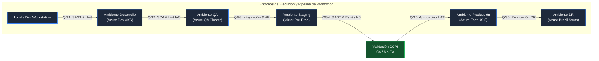
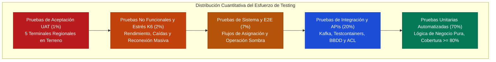

# Subdocumento 9: Plan de Aseguramiento de Calidad
**Licitación Pública TFEP-01/2026 — Solución Integral de Transporte de Carga Terrestre**  
**Cliente:** Transportes Curimón S.A.  
**Proponente:** audIT Soluciones Tecnológicas SpA  
**Ponderación Técnica Informe 2:** 8 % (FEP01 p. 66)  
**Formularios Asociados:** Formulario T-13 y Formulario T-17 (FEP01 p. 62, 64)  
**Dupla Responsable:** D1 (QA, Gobernanza y Aseguramiento Normativo)

---

Este subdocumento define el plan de aseguramiento de calidad propuesto por audIT Soluciones Tecnológicas SpA para la licitación TFEP-01/2026 de Transportes Curimón S.A. El alcance considera los procesos de ingeniería, el software, el firmware de borde y los dispositivos telemáticos previstos para la flota. Los criterios descritos son objetivos de diseño y deberán comprobarse mediante las evidencias y procedimientos de aceptación correspondientes.

El plan se relaciona con los siguientes componentes de la propuesta técnica:
* Se sustenta en las capacidades institucionales, la gobernanza corporativa y el laboratorio de hardware formalizados en el **Capítulo 1 (Subdocumento 1)**.
* Provee los mecanismos de verificación empírica para mitigar las patologías de control, la dispersión operativa y los riesgos de sobreestadías diagnosticados en el **Capítulo 2 (Subdocumento 2)**.
* Asegura el cumplimiento verificable de los 42 requerimientos normalizados de la propuesta formalizados en el **Capítulo 3 (Subdocumento 3)** y su matriz externa de trazabilidad (**Formulario Técnico T-12**).
* Establece las compuertas de calidad técnica (*Quality Gates*) para los microservicios en la nube, las capas anticorrupción (ACL), los componentes transaccionales y el despliegue georredundante entre Azure East US 2 y Azure Brazil South descritos en el **Capítulo 4 (Subdocumento 4)** y su catálogo de implementos (**Formulario Técnico T-11**).
* Fija las directrices de integridad, sanitización y conciliación necesarias para la migración de los 480.000 viajes históricos del TMS 2013 y la gobernanza de datos personales (Ley N.° 21.719) detalladas en el **Capítulo 5 (Subdocumento 5)**.
* Opera como el brazo ejecutor y el sistema de control de calidad para las metodologías híbridas de desarrollo DevSecOps y gestión PMBOK formalizadas en el **Capítulo 6 (Subdocumento 6)** y sus formularios metodológicos (**Formularios Técnicos T-9 y T-10**).
* Sincroniza sus hitos de validación, compuertas bloqueantes y ventanas de certificación con la Estructura de Desglose del Trabajo (EDT), el cronograma maestro y las marchas blancas del **Capítulo 7 (Subdocumento 7)** y sus anexos de planificación (**Formularios Técnicos T-14, T-15 y T-18**).
* Provee la batería de mitigaciones técnicas e instrumentales frente a los riesgos de falla física, ciberseguridad, indisponibilidad de enlaces celulares y degradación de servicio identificados en el **Capítulo 8 (Subdocumento 8)** y su matriz de riesgos (**Formulario Técnico T-16**).
* Define controles de calidad vinculados a los niveles de servicio de disponibilidad E2E $\ge 99{,}9\%$ (Art. 20 FEP01, p. 14; RT-10.01 FEP02, p. 22), RTO $\le 4\text{ h}$ y RPO $\le 15\text{ min}$ (RT-07.04 FEP02, p. 17). La articulación con soporte y calendario queda sujeta al cotejo con los entregables vigentes de D2/D3.
* Valida las calificaciones y certificaciones del equipo técnico clave nominado en el **Capítulo 12 (Subdocumento 12)**.
* Establece los protocolos de validación en terreno para las cinco innovaciones obligatorias comprometidas en el **Capítulo 13 (Subdocumento 13)** y su formulario técnico (**Formulario Técnico T-19**).
* Acredita la solidez y confiabilidad técnica que sustentan la síntesis de valor del **Capítulo 14 (Subdocumento 14)**.

Este capítulo se complementa con los borradores de los formularios T-13 (*Matriz de Calidad del Producto y Quality Gates*) y T-17 (*Plan de Pruebas Detallado*), cuyas métricas, trazabilidad normativa y fechas quedan sujetas a revisión antes de su emisión.

---

## 9.1 Plan de Calidad

El Plan de Calidad de audIT Soluciones Tecnológicas SpA organiza las actividades propuestas para definir, asegurar y controlar la calidad de la plataforma. Los criterios se aplican desde la definición de requisitos y arquitectura hasta las pruebas de operación, y se registran como objetivos verificables, no como resultados ya alcanzados.

A continuación se exponen el marco normativo adoptado, las estructuras de gobernanza técnica corporativa, la formulación matemática de las métricas de software, firmware y telemetría, y la especificación de las compuertas de calidad bloqueantes de paso entre entornos.

### 9.1.1 Marco Normativo ISO/IEC 25010 y Gobernanza de Calidad

Se propone utilizar como referencia el modelo de calidad de producto de **ISO/IEC 25010:2023** (*Systems and software engineering — Systems and software Quality Requirements and Evaluation [SQuaRE] — Product quality model*). Las características se relacionan con el sistema de transporte de Curimón de la siguiente forma:

1. **Adecuación Funcional (*Functional Suitability*):** Grado en que el software provee funciones que satisfacen las necesidades declaradas bajo condiciones especificadas. Se subdivide en completitud, corrección y pertinencia funcional, garantizando que el 100% de los 42 requerimientos del pliego contractual se implementen de manera fáctica y sin omisiones.
2. **Eficiencia de Desempeño (*Performance Efficiency*):** Comportamiento temporal, consumo de recursos y capacidad de procesamiento bajo condiciones nominales y de sobrecarga. Abarca la latencia sub-segundo en el clúster Redis para la validación bloqueante pre-despacho ($\le 30\text{ s}$), el procesamiento en streaming en Apache Kafka y la optimización de almacenamiento en series temporales de TimescaleDB.
3. **Compatibilidad (*Compatibility*):** Grado en que un sistema puede intercambiar información con otros sistemas y compartir un entorno común. Incluye la coexistencia e interoperabilidad de la Capa Anticorrupción (ACL) con el TMS 2013 legacy de Curimón, con las tres plataformas GPS comerciales de terceros (Wialon, Wisetrack, Webfleet) y con el ERP contable para la emisión de documentos tributarios.
4. **Capacidad de Interacción (*Interaction Capability* — antes Usabilidad):** Grado en que el sistema puede ser comprendido, aprendido y utilizado de manera eficiente y satisfactoria. Se orienta a la ergonomía de las interfaces web para despachadores y a la seguridad de la interfaz para conductores, garantizando el enclavamiento cinético estricto exigido por la **Ley N.° 21.377 (Ley No Chat)** mediante alertas sonoras pasivas (*Text-to-Speech*) fuera de línea sin manipulación táctil en movimiento.
5. **Fiabilidad (*Reliability*):** Grado en que el sistema mantiene un nivel especificado de rendimiento bajo condiciones declaradas durante un período determinado. Comprende la madurez, tolerancia a fallos y recuperabilidad, sustentando el SLA E2E de disponibilidad mensual $\ge 99{,}9\%$, el requisito mínimo de retención local de 72 h y los objetivos de recuperación ante desastres (RTO $\le 4\text{ h}$, RPO $\le 15\text{ min}$). La capacidad ampliada de 288 h es una propuesta de D4 para S4, sujeta a dimensionamiento y validación.
6. **Seguridad (*Security*):** Grado en que el sistema protege la información y los datos de modo que personas o sistemas no autorizados no puedan leerlos ni modificarlos. Abarca confidencialidad, integridad, no repudio, autenticidad y responsabilidad, implementando cifrado TLS 1.3 en tránsito, AES-256 en reposo, sellado criptográfico SHA-256 en Azure Key Vault para la entidad `EvidenciaJornada` (Art. 25 bis del Código del Trabajo) y minimización de datos conforme a la **Ley N.° 21.719**.
7. **Mantenibilidad (*Maintainability*):** Grado de efectividad y eficiencia con que el sistema puede ser modificado por los mantenedores. Se subdivide en modularidad, reusabilidad, analizabilidad, modificabilidad y capacidad de prueba, garantizando una arquitectura desacoplada basada en microservicios en Azure Kubernetes Service (AKS), alta cobertura de pruebas unitarias y bajo acoplamiento.
8. **Flexibilidad (*Flexibility* — antes Portabilidad):** Grado en que el producto puede adaptarse eficazmente a cambios en sus requisitos, contextos de uso o entornos de ejecución. Abarca adaptabilidad, escalabilidad e instalabilidad, permitiendo la extensión del sistema a nuevos tractocamiones, semirremolques refrigerados y faenas mineras o forestales sin rediseño estructural.
9. **Seguridad de Funcionamiento (*Safety*):** Característica incorporada formalmente en la edición 2023 de la norma, que evalúa el grado en que el sistema previene situaciones de riesgo inaceptable de daño a las personas, la propiedad o el medio ambiente. En el contexto de Curimón, esta característica rige el bloqueo automático preventivo ante incompatibilidades químicas de sustancias peligrosas (**D.S. 298/1994** y **D.S. 43/2015**) y el control preventivo de fatiga de conductores.

#### Estructura de Gobernanza de Calidad de audIT SpA

Para asegurar la ejecución sistemática de este marco normativo, audIT SpA establece un modelo de gobernanza estructurado en tres niveles de responsabilidad técnica, liderado por el **Comité de Calidad y Procesos de Ingeniería (CCPI)**:

* **Comité de Calidad y Procesos de Ingeniería (CCPI):** Máxima instancia decisional técnica en materia de aseguramiento de calidad, integrada colegiadamente por la Gerencia de Proyecto / PMO, la Dirección de Arquitectura & Software, la Jefatura de Hardware IoT & Conectividad y la Jefatura de Aseguramiento de Calidad & Procesos. El CCPI sesiona de forma ordinaria quincenalmente y de manera extraordinaria ante desviaciones críticas de calidad, asumiendo la potestad exclusiva de autorizar o vetar la promoción de releases entre entornos de Staging y Producción, y de sancionar los dictámenes Go/No-Go.
* **Líder de Aseguramiento de Calidad (QA Lead):** Profesional senior responsable de la planificación, diseño y supervisión del Plan de Pruebas. Administra la matriz de trazabilidad de requerimientos, define los escenarios de prueba no funcional y actúa como contraparte técnica de validación frente a la comisión fiscalizadora de Transportes Curimón S.A.
* **Ingeniero de Automatización de Pruebas (Test Automation Engineer):** Responsable de la codificación, mantenimiento y ejecución automatizada de las baterías de pruebas unitarias, de integración, de contratos de API y de rendimiento dentro de las tuberías de integración continua (GitLab CI Enterprise).
* **Auditor de Procesos de Ingeniería y Seguridad:** Profesional independiente del equipo de desarrollo, encargado de fiscalizar el cumplimiento de las guías de estilo, los estándares de codificación, las compuertas de análisis estático/dinámico (SAST/DAST) y la gestión documental de evidencias para auditorías de las normas ISO 9001 e ISO 27001.

### 9.1.2 Métricas Cuantitativas de Software, Firmware y Telemetría

En conformidad con las directrices de ingeniería de audIT SpA, toda meta de calidad debe expresarse mediante métricas objetivas, computables y verificables de manera automatizada. Se rechaza categóricamente el uso de adjetivos abstractos en favor de especificaciones paramétricas con umbrales matemáticos claros.

A continuación, la Tabla 9.1 consolida las métricas cuantitativas que rigen el ciclo de vida del software, el firmware embebido en pasarelas de borde y los flujos telemáticos distribuidos del proyecto.

#### Tabla 9.1 — Métricas Cuantitativas de Calidad bajo ISO/IEC 25010 y Hardware
*Fuente: Elaboración propia conforme a normas ISO/IEC 25010:2023, SAE J1455 y Bases Técnicas FEP02/FEP03.*

| Característica ISO | Métrica Evaluada | Herramienta | Umbral Aprobatorio | Efecto Bloqueante |
| :--- | :--- | :--- | :--- | :--- |
| **Mantenibilidad** | Cobertura de pruebas unitarias | GitLab CI / Jest / Go Test | $\ge 80\%$ en lógica de negocio | Bloqueo de Merge Request |
| **Mantenibilidad** | Complejidad ciclomática de McCabe | SonarQube | $v(G) \le 15$ por función | Bloqueo de Merge Request |
| **Mantenibilidad** | Duplicación de código fuente | SonarQube | $< 3{,}0\%$ del código base | Bloqueo de Pipeline |
| **Mantenibilidad** | Ratio de Deuda Técnica | SonarQube | $< 5{,}0\%$ (Calificación A) | Bloqueo de Pipeline |
| **Seguridad** | Vulnerabilidades SAST/SCA críticas | SonarQube / Trivy | 0 vulnerabilidades (CVSS $\ge 7{,}0$) | Bloqueo de Compilación |
| **Seguridad** | Hallazgos dinámicos DAST críticos | OWASP ZAP Enterprise | 0 hallazgos activos en Staging | Bloqueo de Despliegue |
| **Eficiencia** | Latencia Asignación de Viaje | K6 / OpenTelemetry | $P_{95} \le 30\text{ s}$ (4 validaciones) | Bloqueo de Pase a Staging |
| **Eficiencia** | Alerta Sonora Botón de Pánico | K6 / Broker EventHubs | $P_{99} \le 15\text{ s}$ en recepción | Bloqueo de Pase a Staging |
| **Eficiencia** | Pre-emisión D.E.T. en Sombra | Banco Hardware audIT | $P_{99} \le 90\text{ s}$ en cabina | Bloqueo de Firmware OTA |
| **Fiabilidad** | Disponibilidad Plataforma E2E | Datadog / Azure Monitor | $\ge 99{,}9\%$ mensual (Art. 20 FEP01, p. 14; RT-10.01 FEP02, p. 22) | Verificar medición y evidencia contra el SLA |
| **Fiabilidad** | Pérdida de paquetes en bus CAN | Analizador CAN J1939 | Pérdida $< 0{,}1\%$ de tramas | Rechazo de Instalación |
| **Fiabilidad** | Persistencia atómica SQLite WAL | Test Suite Embebido | Latencia $< 10\text{ ms}$ post-corte | Rechazo de Firmware |
| **Fiabilidad** | Retención local sin conectividad | Test de desconexión y sincronización | Mínimo $\ge 72\text{ h}$; objetivo ampliado propuesto de 288 h sujeto a validación de D4 | Rechazo si no cumple el mínimo de 72 h; objetivo ampliado se evalúa tras confirmar diseño |
| **Seguridad Fís.** | Consumo eléctrico en Standby | Multímetro Calibrado | $< 50\text{ mA}$ tras 30 min corte | Rechazo de Instalación |

#### Análisis Técnico de las Métricas de Calidad

La Tabla 9.1 propone umbrales de calidad para controlar el paso entre desarrollo y operación. El objetivo de cobertura unitaria de **$\ge 80\%$** se aplicaría a la lógica de negocio, incluidos los cálculos de jornada y los algoritmos de asignación. El umbral de complejidad ciclomática de McCabe **$v(G) \le 15$** se propone como guía de mantenibilidad. Ambos requieren validación contra el alcance, las herramientas y los criterios de aceptación del proyecto.

Para telemetría de borde, se propone medir la pérdida de tramas CAN con un límite de **$<0{,}1\%$**. La prueba deberá confirmar el método de lectura y la compatibilidad del acoplador con cada vehículo; este umbral por sí solo no certifica garantías de fabricante.

También se propone ensayar la recuperación de SQLite en modo Write-Ahead Logging (WAL) después de una interrupción de alimentación. El umbral de recuperación inferior a 10 ms requiere validación en un banco de pruebas; no implica por sí solo que no pueda perderse ningún evento.

Por último, la aceptación debe comprobar una retención local mínima de **72 horas**. D4 propone estudiar una capacidad ampliada de hasta 288 horas en una unidad eMMC de 8 GB; ese objetivo queda sujeto al perfil de muestreo, la carga de eventos, la compresión, el espacio reservado por el sistema operativo y los ensayos de hardware.

### 9.1.3 Umbrales de Aceptación y Quality Gates Bloqueantes de Paso a Producción

La promoción de código, configuraciones de infraestructura y paquetes de firmware a través de los distintos entornos de la plataforma se encuentra gobernada por una tubería de entrega continua altamente automatizada en **GitLab CI Enterprise**, estructurada mediante compuertas de calidad bloqueantes (*Quality Gates*, QG). Ningún artefacto puede avanzar hacia un entorno superior si no satisface de manera determinista y con cero excepciones los criterios fijados para su compuerta previa.

A continuación, la Figura 9.1 ilustra la arquitectura del flujo de promoción a través de los seis entornos del proyecto y las compuertas de aseguramiento integradas.

#### Figura 9.1 — Flujo de Promoción por Ambientes y Quality Gates Bloqueantes
*Fuente: Elaboración propia conforme a estándares DevSecOps de audIT SpA y Comunicado 10.*

#### Especificación de Quality Gates (QG1 a QG6)

Las compuertas de calidad integradas en la tubería se definen taxativamente como sigue:

1. **Quality Gate 1 (QG1) — Verificación Local y Calidad de Código Estático:**  
   * *Momento de Ejecución:* Ejecución previa al commit local y en la apertura de *Merge Request* hacia ramas de desarrollo.
   * *Controles Automatizados:* Ejecución de suite de pruebas unitarias locales; análisis de linter de lenguaje; cálculo de cobertura de pruebas ($\ge 80\%$); complejidad ciclomática de McCabe ($v(G) \le 15$).
   * *Criterio de Rechazo:* Fallo en cualquier prueba unitaria o violación de umbrales estáticos. Bloqueo automático de fusión de código en GitLab CI.
2. **Quality Gate 2 (QG2) — Seguridad de Cadena de Suministro y Análisis de IaC:**  
   * *Momento de Ejecución:* Al compilar la rama `develop` para despliegue en el entorno de Desarrollo.
   * *Controles Automatizados:* Análisis de composición de software (SCA) con Trivy en dependencias de código y librerías externas; escaneo estático de plantillas de Infraestructura como Código (IaC) de Terraform con `checkov` y `tflint`; auditoría de imágenes base de contenedores Docker.
   * *Criterio de Rechazo:* Detección de cualquier vulnerabilidad conocida con puntaje CVSS $\ge 7{,}0$ (severidad Alta o Crítica), o configuraciones de Terraform que permitan exposición de puertos públicos no autorizados.
3. **Quality Gate 3 (QG3) — Integración de Servicios y Pruebas de Contrato de API:**  
   * *Momento de Ejecución:* Al finalizar el despliegue automático en el clúster de QA.
   * *Controles Automatizados:* Pruebas de integración sobre contenedores efímeros creados mediante Testcontainers (PostgreSQL, TimescaleDB, Kafka, Redis); pruebas de contrato de interfaces OpenAPI 3.1 mediante Pact; pruebas de lectura de tramas de telemetría de borde mockeadas.
   * *Criterio de Rechazo:* Incumplimiento de contratos de interfaz entre microservicios o fallos de transaccionalidad relacional en bases de datos.
4. **Quality Gate 4 (QG4) — Pruebas Dinámicas DAST, Ciberseguridad y Rendimiento K6:**  
   * *Momento de Ejecución:* En el entorno de Staging (preproducción), idéntico en dimensionamiento y configuración al entorno de Producción.
   * *Controles Automatizados:* Análisis dinámico de seguridad de aplicaciones (DAST) con OWASP ZAP Enterprise; pruebas de rendimiento y estrés con K6 sobre el perfil pico que se dimensione con D2; y reconexión masiva con el volumen de unidades definido por D2/D4. Los parámetros de carga quedan pendientes de trazabilidad.
   * *Criterio de Rechazo:* Latencia de asignación de viaje superior a 30 segundos en el percentil 95; alerta SOS superior a 15 segundos en el percentil 99; cualquier vulnerabilidad web crítica en OWASP Top 10.
5. **Quality Gate 5 (QG5) — Certificación de Pruebas UAT y Dictamen Go/No-Go:**  
   * *Momento de Ejecución:* Previo a la ventana de paso a Producción.
   * *Controles:* Verificación de actas de aceptación de usuario (UAT) suscritas en los 5 terminales regionales; certificación de 0 defectos abiertos de severidad P1 y P2; validación de la ventana de congelamiento de cambios (*Change Freeze*) si corresponde (Diciembre a Abril).
   * *Criterio de Rechazo:* Rechazo formal de cualquier acta UAT por el cliente o veto técnico por parte del Comité de Calidad y Procesos de Ingeniería (CCPI).
6. **Quality Gate 6 (QG6) — Validación de Conmutación y Resiliencia DR:**  
   * *Momento de Ejecución:* Post-despliegue en Producción primaria (Azure East US 2).
   * *Controles Automatizados:* Comprobación de la replicación asíncrona continua de datos hacia la región secundaria (Azure Brazil South); verificación del tiempo de desfase de réplica de bases de datos para garantizar RPO $\le 15\text{ minutos}$; prueba de conectividad y arranque de servicios en clúster AKS Hot-Standby para asegurar RTO $\le 4\text{ horas}$.
   * *Criterio de Rechazo:* Desfase de replicación $> 15$ minutos o fallos de sincronización en réplicas de Kafka.

*(La especificación exhaustiva de cada una de estas compuertas, sus scripts de validación, condiciones de disparo y roles autorizadores se formaliza de manera independiente en el **Formulario Técnico T-13**, archivo `formulario_t13_calidad_producto_quality_gates.md`, complementario a este capítulo).*

---

## 9.2 Estrategia de Aseguramiento de Calidad

La estrategia de aseguramiento de calidad de audIT SpA se articula en torno a dos ejes metodológicos complementarios: la prevención y corrección temprana de defectos en la fase de ingeniería de software mediante revisiones sistemáticas por pares y herramientas automatizadas de análisis estático/dinámico, y la ejecución exhaustiva de un modelo de pruebas multinivel alineado estrictamente con el estándar internacional **ISO/IEC/IEEE 29119**.

A continuación se detallan las prácticas de revisión de código, la pirámide integral de testing, la gestión de datos de prueba sintéticos bajo la Ley N.° 21.719 y la matriz de trazabilidad biunívoca entre requerimientos y casos de prueba.

### 9.2.1 Revisiones Técnicas entre Pares (Peer Reviews) y Análisis Estático/Dinámico (SAST/DAST)

El proceso de desarrollo de audIT SpA prohíbe taxativamente la incorporación directa de código fuente a las ramas troncales sin haber superado una revisión técnica exhaustiva. Para ello, se implementa un **Protocolo de Revisión por Pares (*Code Review*)** gobernado bajo el flujo de trabajo GitFlow en GitLab CI Enterprise:

* **Mecanismo de Doble Aprobación Senior:** Todo *Merge Request* (MR) exige obligatoriamente la revisión, comentario y aprobación formal de al menos dos (2) ingenieros de software senior o especialistas de dominio antes de ser susceptible de fusión. Se segregan responsabilidades técnicas: una aprobación debe provenir del área de arquitectura de software (validando diseño, inmutabilidad y patrones DDD), y la segunda debe provenir del área de aseguramiento de calidad o ciberseguridad.
* **Lista de Verificación de Revisión (*Review Checklist*):** Los revisores auditan activamente el código contra una lista de verificación institucional que fiscaliza:
  1. *Inmutabilidad y pureza funcional:* Prohibición de mutaciones de estado in-place sobre objetos transaccionales; uso estricto de estructuras inmutables.
  2. *Manejo defensivo de excepciones:* Control explícito de nulos, desbordamientos numéricos y timeouts en llamadas a servicios externos o APIs telemáticas.
  3. *Seguridad y sanitización:* Ausencia de credenciales, claves criptográficas o tokens hardcodeados en el código; parametrización absoluta de consultas SQL para erradicar cualquier vector de inyección SQL.
  4. *Rendimiento y contención:* Ausencia de bloqueos (*deadlocks*) en el uso de memoria o hilos de ejecución concurrentes en Go y Rust.

#### Integración Automatizada de Análisis SAST, SCA y DAST

El protocolo humano se encuentra integrado de manera indivisible con herramientas de inspección automática de código que operan de forma no negociable en la tubería CI/CD:

* **Análisis Estático de Seguridad (SAST) con SonarQube Enterprise:** Escaneo continuo del 100% de los repositorios de backend y frontend en cada commit. SonarQube fiscaliza la adherencia a las reglas OWASP Top 10 y CWE/SANS Top 25, detectando vulnerabilidades de inyección, sanitización deficiente o deserialización insegura. El pipeline se interrumpe de forma bloqueante si se detecta cualquier hallazgo de severidad Crítica o Alta.
* **Análisis de Composición de Software (SCA) con Trivy:** Auditoría automatizada de la cadena de suministro de software y dependencias de terceros (módulos npm, crates de Rust, paquetes Go). Trivy cruza los manifiestos de dependencias contra las bases de datos de vulnerabilidades CVE (*Common Vulnerabilities and Exposures*), bloqueando la compilación si existe alguna vulnerabilidad conocida sin parche disponible que supere un puntaje CVSS $\ge 7{,}0$.
* **Auditoría de Infraestructura como Código (IaC) con Checkov y TFLint:** Análisis estático de los scripts de Terraform que configuran los recursos de red, almacenamiento y cómputo en Microsoft Azure. Checkov asegura que ningún bucket de almacenamiento (*Azure Blob Storage*) sea público, que todos los discos administrados cuenten con cifrado de hardware habilitado y que las reglas de red de los grupos de seguridad (NSG) restrinjan estrictamente el tráfico no corporativo.
* **Análisis Dinámico de Seguridad (DAST) con OWASP ZAP Enterprise:** Ejecución de pruebas de penetración automatizadas sobre las interfaces web y endpoints de API en el entorno de Staging. Simula ataques en tiempo de ejecución, incluyendo cross-site scripting (XSS), cross-site request forgery (CSRF), inyección de encabezados y desconfiguraciones de cookies seguras y cabeceras HSTS.

### 9.2.2 Estrategia y Niveles de Prueba según Estándar ISO/IEC/IEEE 29119

audIT SpA estructura su plan de verificación funcional y no funcional bajo la serie de estándares internacionales **ISO/IEC/IEEE 29119** (*Software Testing*), adoptando sus principios de diseño de pruebas basados en riesgo, cobertura sistemática de requerimientos y documentación formal de evidencias. La distribución del esfuerzo de pruebas sigue el principio de la **Pirámide Integral de Testing**, maximizando las pruebas automáticas de ejecución rápida en la base y minimizando la dependencia de pruebas manuales lentas en la cúspide.

A continuación, la Figura 9.2 ilustra la jerarquización de los niveles de prueba y su distribución cuantitativa en el proyecto.

#### Figura 9.2 — Pirámide Integral de Testing de audIT bajo Estándar ISO/IEC/IEEE 29119
*Fuente: Elaboración propia conforme a ISO/IEC/IEEE 29119 y directrices corporativas audIT SpA.*

#### Tabla 9.2 — Niveles de Prueba y Estrategia de Ejecución según ISO/IEC/IEEE 29119
*Fuente: Elaboración propia conforme a ISO/IEC/IEEE 29119-2.*

| Nivel de Prueba | Tipología y Alcance | Entorno | Responsable | Criterio de Entrada/Salida |
| :--- | :--- | :--- | :--- | :--- |
| **Unitarias** | Lógica de negocio pura, cálculo Art. 25 bis, algoritmos ALNS | Local / CI | Ingeniero de Software | Ent: Código nuevo. Sal: Cobertura $\ge 80\%$, $v(G) \le 15$. |
| **Integración** | Mensajería Kafka, caché Redis, ACL TMS 2013 y BBDD | QA (Testcontainers) | Ingeniero de Automatización | Ent: Pruebas unitarias al 100%. Sal: Cero fallos en contratos de API. |
| **Sistema / E2E** | Flujos punta a punta, asignación bloqueante y emisión DET | QA / Staging | Ingeniero Líder de QA | Ent: Integración aprobada. Sal: 100% casos de uso críticos OK. |
| **No Funcionales** | Estrés K6 (reconexión 300 camiones), fallas y DAST | Staging | QA / Especialista DevSecOps | Ent: Sistema estabilizado. Sal: Latencias nominales y cero CVEs. |
| **Aceptación (UAT)** | Validación operacional en terreno con usuarios Curimón | 5 Terminales | Comité Calidad CCPI / Mandante | Ent: QG4 aprobado en Staging. Sal: Actas UAT firmadas sin objeción. |

#### Análisis Técnico de los Niveles de Prueba y Protección de Datos Personales

La estrategia reflejada en la Tabla 9.2 asigna de manera inequívoca las responsabilidades operativas y los criterios de aceptación en cada fase del ciclo de vida. La ejecución automatizada del 70% del esfuerzo en la base de la pirámide (pruebas unitarias) asegura que las fallas de código se detecten a segundos de ser introducidas, reduciendo drásticamente el costo de reparación de defectos.

Un aspecto técnico y jurídico de primer orden en esta estrategia es la **Protección de Datos Personales en Ambientes de Prueba**, en estricto cumplimiento de la **Ley N.° 21.719**. Queda terminantemente prohibido utilizar volcados (*dumps*) de bases de datos reales o registros auténticos de conductores (RUT, nombres, teléfonos, geolocalizaciones efectivas o historiales de jornada) en los entornos de Desarrollo, QA o Staging. Para satisfacer los requerimientos de volumen sin comprometer la privacidad legal de los 454 choferes ni de los 148 transportistas terceros, audIT SpA implementa:
1. **Generación Determinista de Datos Sintéticos:** Scripts parametrizados con librerías generativas especializadas (Faker / scripts en Python y Go) que producen datos realistas pero enteramente sintéticos: RUTs válidos algorítmicamente pero inexistentes, coordenadas de prueba dentro de la malla vial chilena y eventos de bus CAN simulados con curvas cinemáticas fidedignas.
2. **Entornos Efímeros y Desacoplados:** Utilización de Testcontainers en GitLab CI, que instancia bases de datos y colas Kafka aisladas en contenedores Docker de un solo uso durante la ejecución de las pruebas de integración, destruyéndose de forma segura inmediatamente después sin dejar remanentes de datos.

### 9.2.3 Verificación y Validación (V&V): Trazabilidad de Requerimientos a Casos de Prueba

audIT SpA adopta la metodología de **Verificación y Validación de Software (V&V)** estandarizada bajo la norma **IEEE 1012:2016** (*IEEE Standard for System, Software, and Hardware Verification and Validation*), aplicando un enfoque de doble entrada:
* **Verificación:** Proceso de evaluación técnica que determina si los productos de una fase de desarrollo dada satisfacen las condiciones impuestas al inicio de dicha fase (*"¿Estamos construyendo el producto correctamente?"*).
* **Validación:** Proceso de evaluación técnica que determina si el software en su entorno operacional final satisface el uso previsto y los requerimientos del negocio del cliente (*"¿Estamos construyendo el producto correcto?"*).

#### Esquema de Trazabilidad Unívoca y Matriz Canónica

La trazabilidad de la propuesta opera mediante un esquema continuo y biunívoco que enlaza cada requerimiento contractual con los artefactos de diseño, implementación y prueba:

$$\text{Requerimiento Contractual (T-12)} \longrightarrow \text{Microservicio / Módulo} \longrightarrow \text{Caso de Prueba (T-17)} \longrightarrow \text{Criterio de Aceptación}$$

A continuación, la Tabla 9.3 presenta la síntesis canónica de trazabilidad preliminar para los 42 requerimientos normalizados de la Ficha Técnica del Caso 10 (28 Funcionales `RF-001` a `RF-028` y 14 No Funcionales `RNF-001` a `RNF-014`), asociando a cada uno su componente arquitectural host, su caso de prueba principal y el criterio de aceptación vinculado.

#### Tabla 9.3 — Matriz Canónica de Trazabilidad V&V (42 Requerimientos del Pliego)
*Fuente: Elaboración propia conforme a IEEE 1012, Ficha Canónica y Formulario T-12.*

| Código Requerimiento | Descripción Funcional / Operativa | Componente Arquitectural Host | Caso de Prueba Principal | Criterio Aceptación |
| :--- | :--- | :--- | :--- | :--- |
| **RF-001 / REQ-01** | Validación bloqueante pre-despacho (4 factores) | Microservicio Asignación (AKS) | `CP-SYS-ASIG-01` | CA-01 / Bloqueo $\le 30\text{ s}$ |
| **RF-002 / REQ-02** | Evidencia jornada 454 choferes (propio/externo) | Microservicio Jornada / Key Vault | `CP-INT-JORN-02` | CA-02 / Cascada 6 Niveles |
| **RF-003 / REQ-03** | Evidencia jornada previa sellada chofer tercero | Microservicio Jornada / ACL | `CP-INT-JORN-03` | CA-03 / Atestación Nivel 5 |
| **RF-004 / REQ-04** | Registro inalterable `EvidenciaJornada` SHA-256 | Azure Key Vault / PostgreSQL | `CP-SEC-AUDT-04` | CA-04 / Hash encadenado |
| **RF-005 / REQ-05** | Consolidación y alerta 6.000 vigencias vivas | PostgreSQL HA / Redis Cluster | `CP-SYS-VIG-05` | CA-05 / Alerta 60-30-7 d |
| **RF-006 / REQ-06** | Validación carga SUSPEL vs manifiesto (18 tractos) | Módulo SUSPEL / App PWA Móvil | `CP-SYS-SUSP-06` | CA-06 / D.S. 298 y 43 |
| **RF-007 / REQ-07** | Descarga remota y archivo tacógrafo digital | Gateway audIT / Servicio Descarga | `CP-HW-TACO-07` | CA-07 / Descarga sin pérdida |
| **RF-008 / REQ-08** | Vista única 374 tractocamiones en Torre 24x7 | Portal Web Torre / TimescaleDB | `CP-SYS-VIST-08` | CA-08 / Padrón conciliado |
| **RF-009 / REQ-09** | Retención local mínima $\ge 72\text{ h}$; capacidad ampliada de hasta 288 h propuesta por D4 sujeta a validación | audIT EdgeHub / SQLite WAL | `CP-HW-BUFF-09` | Aceptación mínima 72 h; prueba ampliada condicionada a confirmar diseño D4 |
| **RF-010 / REQ-10** | Detección geocercas en 1.400 clientes sin HW | Motor Geocercas / EventHubs | `CP-SYS-GEOC-10` | CA-10 / Polígonos auto |
| **RF-011 / REQ-11** | Registro auditable esperas sobreestadías | TimescaleDB / Motor Tarifario | `CP-INT-ESPE-11` | CA-11 / Objeciones $\le 20\%$ |
| **RF-012 / REQ-12** | Conformidad de entrega (POD) con OTP y firma | App PWA Móvil / Sync Service | `CP-SYS-EPOD-12` | CA-12 / Cero pérdidas POD |
| **RF-013 / REQ-13** | Generación datos DET hacia sistema contable | Conector ERP / Capa Transaccional | `CP-INT-DET-13` | CA-13 / Integración idempotente |
| **RF-014 / REQ-14** | Emisión conforme DET en cabina sin cobertura | Gateway audIT / Token Criptográfico | `CP-HW-DETO-14` | CA-14 / Emisión $\le 90\text{ s}$ |
| **RF-015 / REQ-15** | Optimización de retornos en vacío (ALNS) | Microservicio Retornos ALNS | `CP-ALG-ALNS-15` | CA-15 / Vacíos $< 15\%$ |
| **RF-016 / REQ-16** | Costo real por km/viaje en $\le 24\text{ h}$ post-cierre | Motor de Costos / PostgreSQL | `CP-SYS-COST-16` | CA-16 / Consolidado 24 h |
| **RF-017 / REQ-17** | Segregación costo propio vs contractual tercero | Motor de Costos / Portal Finanzas | `CP-SYS-COST-17` | CA-16 / Costo marginal OK |
| **RF-018 / REQ-18** | Análisis analítico de dispersión de rendimiento | Módulo Analítico BI / TimescaleDB | `CP-ALG-DISP-18` | CA-18 / Explicación $\ge 80\%$ |
| **RF-019 / REQ-19** | Liquidación automática a 148 transportistas | Motor Liquidaciones / Portal | `CP-SYS-LIQ-19` | CA-20 / Cierre en $\le 1\text{ d}$ |
| **RF-020 / REQ-20** | Portal autoservicio para transportistas terceros | Portal Web Transportistas | `CP-SEC-PORT-20` | CA-21 / Segregación multi-tenant |
| **RF-021 / REQ-21** | Portal cliente con visibilidad temporal de carga | Portal Web Clientes / Geofencing | `CP-SEC-CLIE-21` | CA-22 / Geofence temporal |
| **RF-022 / REQ-22** | Gestión de consentimiento Ley 21.719 (revocable) | Módulo Privacidad / Key Vault | `CP-SEC-PRIV-22` | CA-23 / Revocación $\le 5\text{ min}$ |
| **RF-023 / REQ-23** | Cálculo emisiones CO2e ton-km ISO 14083 / GLEC | Motor Sostenibilidad / CAN bus | `CP-ALG-CO2-23` | CA-24 / GLEC verificado |
| **RF-024 / REQ-24** | Registro intervenciones talleres en ruta | Formulario Web PWA Talleres | `CP-SYS-TALL-24` | CA-25 / Integración hoja vida |
| **RF-025 / REQ-25** | Mantenimiento preventivo por odometría CAN real | Módulo Mantenimiento / Odómetro | `CP-INT-MANT-25` | CA-26 / Alerta preventiva |
| **RF-026 / REQ-26** | Portal gestión de adhesión de 148 terceros | Portal Adhesión / CRM Flota | `CP-SYS-ADHE-26` | CA-27 / Adhesión $\ge 70\%$ E1 |
| **RF-027 / REQ-27** | Alerta preventiva anticipada fin de jornada | audIT EdgeHub / Módulo Ruta | `CP-HW-ALER-27` | CA-28 / Aviso dinámico ETA |
| **RF-028 / REQ-28** | Operación en modo mixto telemático/documental | Capa Anticorrupción / Asignación | `CP-SYS-MIXT-28` | Control sin degradación |
| **RNF-001 / REQ-29** | Cero distracción en marcha (Ley No Chat 21.377) | audIT EdgeHub / TTS Off-line | `CP-HW-NOCH-29` | Enclavamiento cinético $v>0$ |
| **RNF-002 / REQ-30** | Operación offline inalterable y sin duplicados | audIT EdgeHub / Sincronizador | `CP-HW-SYNC-30` | Sincronización monotónica |
| **RNF-003 / REQ-31** | Cero invasión de equipos de terceros sin pacto | Capa Anticorrupción (ACL) | `CP-SEC-ACCE-31` | Aislamiento telemático |
| **RNF-004 / REQ-32** | Instalación física durante pasada regular taller | Plan Despliegue San Bernardo | `CP-TER-INST-32` | Sin detención adicional flota |
| **RNF-005 / REQ-33** | Integración CAN bus solo lectura sin perder garantía | Pinzas Inductivas CANclick | `CP-HW-CAN-33` | Pérdida $<0{,}1\%$, no corte |
| **RNF-006 / REQ-34** | Sistema contable único emisor e idempotencia | Integración ERP / Colas Kafka | `CP-INT-IDEM-34` | Cero facturación duplicada |
| **RNF-007 / REQ-35** | Cero hardware propio en recintos de clientes | Geocercas satelitales GPS | `CP-TER-CLIE-35` | Detección 100% remota |
| **RNF-008 / REQ-36** | Continuidad ante desconexión: mínimo 72 h conforme a RT-03.10; evaluar la propuesta ampliada D4 de 288 h | Memoria eMMC propuesta | `CP-HW-CORD-36` | Verificar mínimo contractual; ampliación condicionada a diseño y ensayo D4 |
| **RNF-009 / REQ-37** | Operación delegada sin sobrecargar TI Curimón | Servicio audIT Managed Cloud | `CP-OPS-SERV-37` | Soporte L1/L2/L3 audIT |
| **RNF-010 / REQ-38** | Evaluación integral de ciclo de vida (TCO 56 m) | Arquitectura Cloud FinOps | `CP-OPS-FIN-38` | Cumplimiento contractual |
| **RNF-011 / REQ-39** | Convivencia controlada en transición de flota | Capa Anticorrupción (ACL) | `CP-SYS-CONV-39` | Modo mixto gobernado |
| **RNF-012 / REQ-40** | Trazabilidad probatoria estricta sin sobrescritura | Base WORM / Firmas SHA-256 | `CP-SEC-WORM-40` | Cadena de custodia legal |
| **RNF-013 / REQ-41** | Cifrado y minimización estricta (Ley 21.719) | Azure Key Vault / TLS 1.3 | `CP-SEC-CRIP-41` | FLE en datos sensibles |
| **RNF-014 / REQ-42** | Políticas de retención y borrado seguro legal | Storage Lifecycle Management | `CP-SEC-RETE-42` | Custodia legal 5 años |

*(El borrador del catálogo de casos propuestos, con precondiciones, pasos y datos de entrada, se presenta en el **Formulario Técnico T-17**, archivo `formulario_t17_protocolo_aceptacion_plan_pruebas.md`. La cobertura debe verificarse con la matriz RTM.)*

---

## 9.3 Alineación con Plan de Trabajo

El plan de calidad se vinculará con los paquetes de trabajo de la EDT y el cronograma maestro del Capítulo 7. Como el borrador de la EDT y el calendario no están disponibles para este cruce, los códigos y fechas de la matriz siguiente son referencias provisionales y deben confirmarse antes de congelar la línea base.

El mapeo propuesto a continuación es provisional y debe cotejarse con la EDT vigente. El régimen operativo de UAT y la marcha blanca también requieren confirmación de calendario y participantes.

### 9.3.1 Mapeo de Hitos de Calidad en los Paquetes de Trabajo de la EDT (Capítulo 7)

La matriz de trabajo relaciona actividades de calidad con códigos preliminares `EDT-1.X` a `EDT-5.X`. Cada paquete deberá cotejarse con el diccionario T-14 antes de asociarle un hito o una compuerta.

La Tabla 9.4 presenta el mapeo exhaustivo entre la estructura EDT y los hitos de aseguramiento de calidad del proyecto.

#### Tabla 9.4 — Mapeo de Hitos de Calidad con Macro-Fases y Paquetes de la EDT
*Fuente: Propuesta de mapeo; requiere conciliación con Capítulo 7 y Formulario T-14.*

| Fase EDT | Paquete de Trabajo | Hito de Calidad Asociado | Entregable Formal | Compuerta Bloqueante |
| :--- | :--- | :--- | :--- | :--- |
| **EDT-1.X: Gestión** | EDT-1.3 Gestión de Requisitos | H-QA-01: Baseline de Requisitos y V&V | Matriz T-12 auditada | QG1 (Validación Alcance) |
| **EDT-2.X: Infra** | EDT-2.2 Despliegue Cloud Azure | H-QA-02: Certificación IaC y Red | Reporte Checkov / TFLint | QG2 (Seguridad Cloud) |
| **EDT-2.X: Infra** | EDT-2.4 Capa Strangler TMS 2013 | H-QA-03: Validación CDC y ACL | Informe Integración API | QG3 (Contratos Legacy) |
| **EDT-3.X: Software** | EDT-3.1 Core Asignación y Jornada | H-QA-04: Suite Unitarias y Algoritmos | Reporte Jest / SonarQube | QG1 (Cobertura $\ge 80\%$) |
| **EDT-3.X: Software** | EDT-3.5 Gateway audIT EdgeHub | H-QA-05: Certificación Firmware Borde | Acta Banco de Pruebas HW | QG3 (Firmware eMMC OK) |
| **EDT-3.X: Terreno** | EDT-3.6 Retrofitting Flota Curimón | H-QA-06: Control CANclick y Sensores | Protocolo Instalación Flota | QG5 (Hardware Grado Auto) |
| **EDT-4.X: Calidad** | EDT-4.2 Pruebas de Estrés y Carga | H-QA-07: Certificación Rendimiento K6 | Informe de Carga Staging | QG4 (Latencia $\le 30\text{ s}$) |
| **EDT-4.X: Calidad** | EDT-4.4 Pruebas UAT en 5 Nodos | H-QA-08: Aceptación de Usuario | 5 Actas UAT Regionales | QG5 (Firma Contraparte) |
| **EDT-5.X: Puesta** | EDT-5.2 Migración Histórica TMS | H-QA-09: Conciliación 480k Viajes | Acta Muestreo Aceptación | QG5 (Cero Inconsistencias) |
| **EDT-5.X: Puesta** | EDT-5.3 Marcha Blanca 60 Días E1 | H-QA-10: Certificación Estabilidad E1 | Dictamen Go/No-Go E1 | QG6 (Paso a Producción E1) |

*Nota de Interfaz Técnica:* La denominación, codificación y desglose de los paquetes consignados en la Tabla 9.4 concuerdan plenamente con el catálogo oficial del Diccionario de la EDT formalizado en el **Formulario Técnico T-14** (Formulario Técnico T-14).

### 9.3.2 Articulación de Pruebas UAT, Pruebas No Funcionales y Marchas Blancas en el Cronograma

El despliegue de las pruebas finales y la transición operacional deberán coordinarse con el calendario aprobado y las restricciones operativas que confirme Transportes Curimón S.A.

#### Protocolo Operativo de Pruebas UAT en los 5 Terminales Regionales

El plan propone Pruebas de Aceptación de Usuario (UAT) en cinco terminales de Transportes Curimón S.A. La programación, disponibilidad de usuarios y escenarios por terminal deben confirmarse antes de fijar su ejecución:
1. **Terminal San Bernardo (Región Metropolitana - Matriz):** Validación de la Torre de Programación 24x7 con 22 operadores en turnos, taller central de mantenimiento, calibración de caudalímetro en estanque de diésel propio y asignación masiva de flota.
2. **Terminal Valparaíso (Región de Valparaíso):** Validación del flujo portuario de contenedores secos y reefers, integración de precintos electrónicos y gestión documental rápida para agencias de aduana.
3. **Terminal Concepción (Región del Biobío):** Validación de transporte forestal, tolvas graneleras y transferencias químicas industriales, incluyendo relevo de tripulaciones.
4. **Terminal Antofagasta (Región de Antofagasta):** Validación del transporte de **sustancias peligrosas (D.S. 298 y D.S. 43)** sobre los 18 camiones habilitados, inspección de Hojas de Seguridad, pruebas de enlace celular en tramos desérticos con sombra $>80\text{ km}$ en Ruta 5 Norte y control de fatiga en conductores de alta montaña.
5. **Terminal Puerto Montt (Región de Los Lagos):** Validación del monitoreo continuo de **cadena de frío con sondas PT100** en los 44 tractocamiones refrigerados dedicados a la industria acuícola y exportación de salmón.

#### Régimen de Marcha Blanca de 60 Días en Etapa 1 y Gobernanza de Solapamiento (M13–M15)

En estricto cumplimiento del Artículo 17.3 de las Bases Administrativas, la Etapa 1 concluye con una **Marcha Blanca de sesenta (60) días corridos**, programada entre los meses 14 y 15 (M14–M15):
* **Célula Alfa de estabilización:** Durante este período, un equipo asignado atenderá la estabilización, el monitoreo de telemetría y la resolución de incidencias conforme al esquema de soporte que se acuerde.
* **Convivencia con Célula Beta (desarrollo de Etapa 2):** El plan considera separar la atención de estabilización del desarrollo de Etapa 2 durante el solapamiento previsto en los meses 13 a 15 (M13–M15). La distribución de recursos y paquetes debe confirmarse con D2.
* **Criterios propuestos Go/No-Go de cierre de marcha blanca:** La recomendación de paso de etapa requerirá, como mínimo, evaluar los siguientes criterios y adjuntar sus resultados:
   1. Disponibilidad E2E mensual del sistema $\ge 99{,}9\%$, con medición y período conforme a bases, durante la marcha blanca; confirmar el método de cómputo y ventana con la contraparte.
  2. Cero incidentes abiertos de severidad P1 (Bloqueante) o P2 (Crítico).
  3. Tiempo de recuperación ante cortes eléctricos vehiculares $< 10\text{ ms}$ en el 100% de la flota equipada.
  4. Conciliación y migración exitosa del 100% de los datos históricos del TMS 2013.
* **Ventana de cambios estacionales (*Change Freeze*):** El borrador considera evitar intervenciones masivas en flota durante diciembre–abril. Debe confirmarse con la contraparte que esta ventana corresponde a una restricción de las bases o a un supuesto operativo del caso.

---

### Referencias Bibliográficas

Las fuentes externas y referencias normativas de este borrador requieren revisión bibliográfica: confirmar edición, título, aplicabilidad y correspondencia con las citas del texto antes de la entrega.
* Ministerio de Salud. (2016). *Decreto Supremo N.° 43: Aprueba el Reglamento de Almacenamiento de Sustancias Peligrosas*. Biblioteca del Congreso Nacional de Chile. https://www.bcn.cl/leychile/navegar?idNorma=1088802
* Ministerio de Transportes y Telecomunicaciones. (1995). *Decreto Supremo N.° 298: Reglamenta el Transporte de Cargas Peligrosas por Calles y Caminos*. Biblioteca del Congreso Nacional de Chile. https://www.bcn.cl/leychile/navegar?idNorma=12087
* Ministerio del Trabajo y Previsión Social. (2003). *Decreto con Fuerza de Ley N.° 1: Fija el texto refundido, coordinado y sistematizado del Código del Trabajo (Artículo 25 bis sobre jornada de choferes de carga interurbana)*. Biblioteca del Congreso Nacional de Chile. https://www.bcn.cl/leychile/navegar?idNorma=207436
* National Institute of Standards and Technology. (2024). *The NIST Cybersecurity Framework (CSF) 2.0* (NIST Special Publication 1300). U.S. Department of Commerce. https://doi.org/10.6028/NIST.CSWP.29
* Open Worldwide Application Security Project. (2021). *OWASP Application Security Verification Standard 4.0 (ASVS)*. OWASP Foundation. https://owasp.org/www-project-application-security-verification-standard/
* SAE International. (2020). *Joint SAE/TMC Recommended Environmental Practices for Electronic Equipment Design (Heavy-Duty Trucks)* (SAE Standard J1455_202011). SAE International. https://doi.org/10.4271/J1455_202011
* Transportes Curimón S.A. (2026a). *Bases Administrativas Licitación Pública Nacional e Internacional N.° TFEP-01/2026: Plataforma de Misión Crítica para Transporte de Carga* (FEP01.26).
* Transportes Curimón S.A. (2026b). *Bases Técnicas Transversales: Requerimientos Generales de Sistemas, Infraestructura y Seguridad* (FEP02.26).
* Transportes Curimón S.A. (2026c). *Bases Técnicas del Caso 10: Transporte de Carga Terrestre* (FEP03.10.26).

---

### Declaración de uso de IA

Declaración provisional para revisión del equipo: la asistencia de IA se utilizó de forma sustantiva para estructurar, redactar y editar secciones del Subdocumento 9 y para preparar esquemas y tablas. La revisión humana de normas, métricas, supuestos, trazabilidad y alineación con otros subdocumentos está pendiente; no se declara aprobación ni validación técnica completada. El responsable debe incorporar este uso en su bitácora individual A-6 antes de la entrega.

#### Tabla D9.1 — Declaración de Uso de Herramientas de IA en el Subdocumento 9
*Fuente: Elaboración propia conforme a Comunicado 10, sección 7.2.*

| Sección / Componente | Herramienta | Finalidad del Uso | Nivel en Texto | Nivel en Diagramas | Revisión Humana Corporativa (Rol y Verificación) |
| :--- | :--- | :--- | :---: | :---: | :--- |
| **Subdocumento 9** | Asistente LLM | Apoyo sustantivo en estructura, redacción y edición de secciones | Medio | Ninguno | Pendiente de revisión humana; verificar normas, métricas, supuestos y conexiones con los demás subdocumentos. |
| **9.1 Plan de Calidad** | Asistente LLM | Reescritura sustantiva y organización de criterios ISO/IEC 25010 | Medio | Ninguno | Pendiente de revisión humana; validar edición de la norma y su interpretación. |
| **9.1.2 Métricas Cuantitativas** | Asistente LLM | Revisión y reformulación de métricas y umbrales | Medio | Ninguno | Pendiente de validar herramientas, umbrales y referencias con arquitectura y hardware. |
| **9.1.3 Quality Gates (QG1-6)** | Asistente LLM | Edición de texto y esquemas Mermaid | Medio | Medio | Pendiente de revisión de pipeline, ambientes, autorización y continuidad. |
| **9.2 Estrategia QA y Testing** | Asistente LLM | Redacción sustantiva de estrategia y criterios de prueba | Medio | Ninguno | Pendiente de revisión normativa, técnica y contractual. |
| **9.2.2 Pirámide ISO 29119** | Asistente LLM | Preparación y edición de esquema Mermaid | Medio | Medio | Pendiente de validar niveles, proporciones y datos de prueba. |
| **9.2.3 Verificación y V&V** | Asistente LLM | Estructuración de la matriz de trazabilidad | Medio | Ninguno | Pendiente de cotejo contra T-12 y T-17. |
| **9.3 Alineación con Plan Trabajo** | Asistente LLM | Redacción y mapeo preliminar de hitos QA | Medio | Ninguno | Pendiente de conciliación con S7/T-14/T-18 y de confirmar calendario. |
| **9.3.2 UAT y Marcha Blanca** | Asistente LLM | Redacción preliminar del protocolo UAT | Medio | Ninguno | Pendiente de programación y confirmación con los terminales. |
| **Referencias Bibliográficas** | Asistente LLM | Formato y edición de referencias | Medio | Ninguno | Pendiente de verificar cada cita, dato bibliográfico y correspondencia textual. |
| **Formulario T-13** | Asistente LLM | Estructuración y revisión sustantiva de matrices de métricas y gates | Medio | Ninguno | Pendiente de validación técnica y normativa. |
| **Formulario T-17** | Asistente LLM | Estructuración y edición sustantiva de catálogo y criterios de aceptación | Medio | Ninguno | Pendiente de validar cobertura, casos, cronograma y evidencias. |

---

*Fin del Subdocumento 9 — Plan de Aseguramiento de Calidad*  
*Licitación N.° TFEP-01/2026 · Caso 10: Transportes Curimón S.A.*
