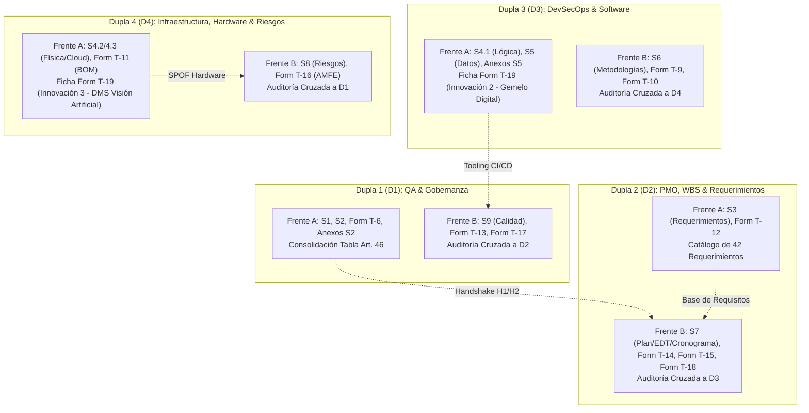
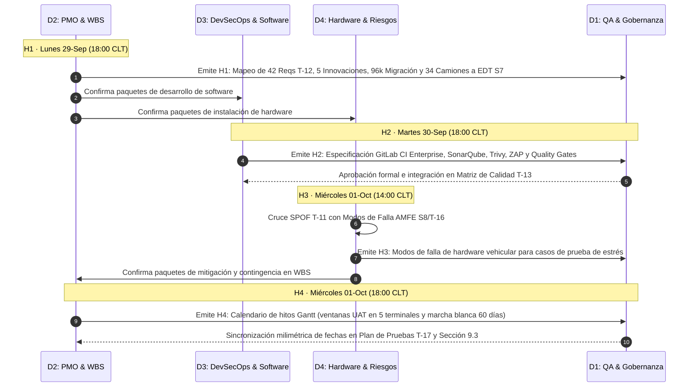

# PLAN MAESTRO CONSOLIDADO — ENTREGA 2
## audIT Soluciones Tecnológicas SpA | Licitación Pública TFEP-01/2026
### Sistema Integral de Gestión de Flota, Telemetría y Monitoreo en Ruta — Transportes Curimón S.A.

---

> [!IMPORTANT]
> **DOCUMENTO CORPORATIVO DE GOBERNANZA INTERNA — ESTRICTAMENTE CONFIDENCIAL**
> Este plan consolida y articula de forma unificada los dos frentes de ingeniería de audIT para la Entrega 2:
> 1. **Frente A (Plan 1):** Remediación, rectificación integral y blindaje normativo de los subdocumentos del Informe 1 (S1, S2, S3, S4, S5, S13 y Formularios T-6, T-11, T-12, T-19).
> 2. **Frente B (Plan 2):** Redacción, diagramación, modelamiento y desarrollo de los nuevos subdocumentos analíticos del Informe 2 (S6, S7, S8, S9 y Formularios T-9, T-10, T-13, T-14, T-15, T-16, T-17, T-18).
>
> **Régimen de Ficción de Licitación (Art. 46 Obs. 12):** Queda terminantemente prohibido consignar nombres de integrantes o referencias académicas externas en cualquiera de los archivos de entrega final. La asignación de responsabilidades se formaliza exclusivamente mediante códigos de dupla (`D1`, `D2`, `D3`, `D4`) y sus respectivos roles corporativos.

---

## 1. Visión General, Gobernanza y Asignación de Roles Corporativos

La Entrega 2 representa el hito más exigente y de mayor ponderación de la propuesta técnica. Para maximizar el rendimiento del equipo y garantizar el cumplimiento irrestricto de las directrices fijadas en los **Comunicados 09 y 10**, se establece un esquema de avance en paralelo con responsabilidades inmutables por dupla:



### 1.1 Matriz de Titularidad y Responsabilidades Corporativas

| Dupla | Rol Corporativo | Titularidad Frente A (Correcciones Informe 1) | Titularidad Frente B (Nuevos Subdocs Informe 2) | Rol en Auditoría Cruzada |
|:---:|:---|:---|:---|:---:|
| **D1** | **Ingeniero Líder de QA & Testing / Gobernanza y Aseguramiento Normativo** | • Subdocumento 1 (Resumen Ejecutivo)<br>• Subdocumento 2 (Comprensión y Contexto)<br>• Formulario T-6 (Experiencia Licitador)<br>• Anexos Subdoc 2<br>• Consolidación Tabla Art. 46 | • Subdocumento 9 (Plan de Calidad)<br>• Formulario T-13 (Matriz de Calidad)<br>• Formulario T-17 (Plan de Pruebas Detallado) | **Audita a D2**<br>(Evalúa Cap. 7, T-14, T-15, T-18) |
| **D2** | **Especialista en WBS, Cronograma & PMO / Ingeniería de Requerimientos** | • Subdocumento 3 (Ingeniería de Requerimientos)<br>• Formulario T-12 (Matriz de Requerimientos Completa e Independiente) | • Subdocumento 7 (Plan de Trabajo, EDT y Cronograma)<br>• Formulario T-14 (Diccionario EDT Exhaustivo)<br>• Formulario T-15 (Histograma y Curva S)<br>• Formulario T-18 (Cronograma Maestro Gantt) | **Audita a D3**<br>(Evalúa Cap. 6, T-9, T-10) |
| **D3** | **Arquitecto DevSecOps & Metodologías / Ingeniería de Software y Datos** | • Subdocumento 4.1 (Arquitectura Lógica)<br>• Subdocumento 5 (Modelo y Plataforma de Datos)<br>• Anexos Subdoc 5 (Diccionario de Datos)<br>• Ficha Formulario T-19 (Innovación 2 - Gemelo Digital) | • Subdocumento 6 (Metodologías de Gestión y Desarrollo)<br>• Formulario T-9 (Marco de Gobernanza de Gestión)<br>• Formulario T-10 (Estándares DevSecOps) | **Audita a D4**<br>(Evalúa Cap. 8, T-16) |
| **D4** | **Ingeniero de Confiabilidad, Hardware & Riesgos / Infraestructura IoT y Edge** | • Subdocumento 4.2 / 4.3 (Arquitectura Física y Data Center)<br>• Formulario T-11 (Bill of Materials de Equipamiento IoT)<br>• Ficha Formulario T-19 (Innovación 3 - DMS Visión Artificial) | • Subdocumento 8 (Plan de Gestión de Riesgos)<br>• Formulario T-16 (Matriz de Riesgos y Análisis AMFE) | **Audita a D1**<br>(Evalúa Cap. 9, T-13, T-17) |

---

## 2. Cronograma Maestro Integrado (27 de Septiembre al 05 de Octubre de 2026)

El cronograma maestro articula los dos frentes para evitar la congestión en las fechas límites. Las mañanas se concentran en cerrar la deuda técnica del Informe 1 hasta su congelamiento definitivo, mientras que las tardes y noches se dedican a la producción analítica y sincronización del Informe 2:

```text
27-Sep (Día 1): Apertura frentes A y B -> Estructuración bases S6-S9 y corrección primeras 30 obs.
28-Sep (Día 2): Remediación pesada Frente A -> Respaldo 8GB eMMC, T-11, T-12, DER S5, ADRs en S4.1.
29-Sep (Día 3): Handshake H1 (18:00 CLT) -> Mapeo Reqs T-12 a EDT S7 + Avance temprano APA/IA.
30-Sep (Día 4): Handshake H2 (18:00 CLT) -> CONGELAMIENTO TOTAL PLAN 1 (23:59 CLT - Read Only).
01-Oct (Día 5): Full-Day Nuevos Subdocs -> Handshake H3 (14:00) + H4 (18:00) + FREEZE BORRADORES (23:59 CLT).
02-Oct (Día 6): Auditoría Cruzada Bloque 1 (14:00 a 22:00 CLT) -> D1 audita D2 / D2 audita D3.
03-Oct (Día 7): Auditoría Cruzada Bloque 2 (14:00 a 22:00 CLT) -> D3 audita D4 / D4 audita D1 + Sign-Offs.
04-Oct (Día 8): Subsanación de Hallazgos + Renderizado Final PDFs + Pre-Flight Check de Imprenta (23:59 CLT).
05-Oct (Día 9): Empaquetado ZIP final + Checksum SHA-256 + ENTREGA OFICIAL ANTICIPADA (18:00 CLT).
```

### 2.1 Detalle Operativo Día por Día:

| Fecha | Bloque | Frente / Dupla | Tarea Operativa Específica | Entregable Concreto | Hito / Compuerta |
|:---|:---:|:---:|:---|:---|:---:|
| **Sáb 27-Sep** | 09:00–14:00 | **Frente A (Todas)** | Reestructuración de índices de S1 a S5 y S13 conforme al Comunicado 10. Eliminación de bitácoras y prosa inflada. | Borradores S1–S5 alineados a Comunicado 10. | Check de avance 14:00 |
| | 15:00–18:30 | **Frente B (D1–D4)** | Apertura de archivos base S6, S7, S8 y S9. Redacción obligatoria de párrafos conceptuales de apertura y secciones X.1. | Secciones 6.1, 7.1, 8.1 y 9.1 redactadas. | Regla $\le 5$ columnas |
| | 19:30–22:30 | **Frente B (D1–D4)** | Esbozo de WBS N1/N2 (D2), RBS y calibración 5x5 (D4), Quality Gates base (D1) y comités CCB (D3). | Esqueletos de Formularios T-9, T-13, T-14, T-16. | Estructuración técnica |
| **Dom 28-Sep** | 09:00–14:00 | **Frente A (D2 y D4)** | D2 normaliza los 42 requerimientos del T-12 con 12 campos obligatorios. D4 construye BOM completo de T-11 (374 gateways, 61 CANclick, etc.). | Formularios T-11 y T-12 independientes. | Cierre de inventario físico |
| | 09:00–14:00 | **Frente A (D1 y D3)** | D1 reestructura S1 y S2 con matrices analíticas. D3 resuelve ambigüedad de stack (Kafka, TimescaleDB, Redis) y 8 ADRs en S4.1. | Secciones S1, S2, S4.1 refactorizadas. | Stack cloud consolidado |
| | 15:00–18:30 | **Frente A (D3 y D4)** | D3 diseña entidad `EvidenciaJornada` y Ficha T-19 (TwinMaker). D4 calcula desglose matemático 8GB eMMC y Ficha T-19 (DMS AI). | DER S5, Fichas Innovación 2 y 3. | Justificación eMMC cerrada |
| | 19:30–22:30 | **Frente B (D1–D4)** | Avance en descomposición EDT N3/N4 (D2), pipeline DevSecOps en GitLab CI (D3), matriz cualitativa de riesgos (D4) y pirámide de testing (D1). | Borradores intermedios de S6, S7, S8, S9. | Sincronización interna |
| **Lun 29-Sep** | 09:00–14:00 | **Frente A (Todas)** | Renderizado de diagramas limpios de arquitectura S4.1, S4.2, DER relacional S5 y plano San Bernardo (D4). | Diagramas autónomos $\ge 9$ pt, sin crop. | Control visual pre-flight |
| | 15:00–18:00 | **Frente B (D2)** | **Ejecución de Handshake H1:** Mapeo formal de 42 requerimientos de T-12, 5 innovaciones, migración 2013 y 34 camiones en paquetes EDT. | Matriz Trazabilidad Alcance $\rightarrow$ EDT. | **HITO HANDSHAKE H1 (18:00)** |
| | 15:00–18:00 | **Frente B (D1, D3, D4)** | Redacción de ciclo de vida evolutivo y DDD (D3), estrategia ISO 29119 (D1) y captura de riesgos críticos del pliego (D4). | Secciones 6.2, 8.2 y 9.2 estructuradas. | Redacción contextualizada |
| | 19:00–22:30 | **Frente B (D2 y D4)** | D2 redacta plan de trabajo §7.2 con partición en Célula Alfa y Beta. D4 estructura Formulario T-16 y mapa de calor. | Modelamiento de frentes y AMFE preliminar. | Nivelación de recursos |
| | 22:30–23:30 | **Transversal** | **Apertura de Bloque Transversal:** Registro temprano de referencias APA 7.ª y matrices de uso de IA en S6–S9 para evitar retrasos de cierre. | Tablas de IA y citas bibliográficas iniciadas. | Blindaje normativo |
| **Mar 30-Sep** | 09:00–14:00 | **Frente A (Todas)** | Consolidación de la `Tabla-Art46-Informe2.md` con las 98 respuestas y taxonomía de aclaraciones. Pre-inspección de scripts bash. | Tabla Art. 46 consolidada al 100%. | Visto Bueno QA |
| | 15:00–18:00 | **Frente B (D3)** | **Ejecución de Handshake H2:** Entrega formal de tooling CI/CD en GitLab CI Enterprise y umbrales de aprobación a D1. | Ficha Técnica DevSecOps $\rightarrow$ QA. | **HITO HANDSHAKE H2 (18:00)** |
| | 15:00–18:00 | **Frente B (D1, D2, D4)** | D1 integra Quality Gates en T-13. D2 modela red PERT/CPM y Ruta Crítica. D4 calibra AMFE ($S, O, D \in [1,5]$, $NPR$). | Modelos cuantitativos en T-13, T-16, T-18. | Congruencia técnica |
| | 19:00–22:30 | **Frente B (Todas)** | D2 genera Carta Gantt y Curva S (T-15/T-18). D4 redacta §8.3 de mitigaciones y reservas en HH. D3 cierra Formulario T-10. | Borradores de nuevos subdocs al 85%. | Formularios desacoplados |
| | 23:00–23:59 | **Frente A (Todas)** | **CONGELAMIENTO TOTAL PLAN 1 (Internal Freeze):** S1–S5, S13 y Formularios T-6, T-11, T-12, T-19 pasan a estado READ-ONLY con hash SHA-256. | Manifiesto criptográfico de remediación. | **HITO: PLAN 1 SELLADO (23:59)** |
| **Mié 01-Oct** | 08:00–11:30 | **Frente B (Todas)** | Detalle de despliegue blue-green y marchas blancas (D2), pruebas UAT en 5 terminales (D1), coherencia de sprints (D3), modos de falla IoT (D4). | Secciones 6.2, 7.3, 8.2 y 9.3 finalizadas. | Preparación H3 y H4 |
| | 11:30–14:00 | **Frente B (D4)** | **Ejecución de Handshake H3:** Validación de que todos los SPOF del T-11 (hardware, SIMs, sensores) tienen modo de falla en S8/T-16. | Matriz SPOF Hardware $\leftrightarrow$ AMFE. | **HITO HANDSHAKE H3 (14:00)** |
| | 14:30–18:00 | **Frente B (D2)** | **Ejecución de Handshake H4:** Entrega del calendario oficial del Gantt (hitos de prueba UAT, estrés y marchas blancas) a D1. | Calendario Cronograma $\leftrightarrow$ Pruebas V&V. | **HITO HANDSHAKE H4 (18:00)** |
| | 18:30–22:30 | **Frente B (Todas)** | Cierre formal de Referencias APA 7.ª y Declaración de uso de IA con tabla oficial en S6, S7, S8 y S9. Verificación de reglas de tablas. | Secciones de cierre 100% completas. | Cero citas huérfanas |
| | 22:30–23:59 | **Frente B (Todas)** | Inspección exhaustiva de diagramas vectoriales, tablas $\le 5$ columnas y verificación de no inclusión de montos $ (Art. 50.2). | Borradores listos para auditoría de pares. | **CONGELAMIENTO BORRADORES (23:59)** |
| **Jue 02-Oct** | 14:00–22:00 | **Auditoría Cruzada 1** | **Bloque 1 de Peer Review:**<br>• D1 audita a D2 (Capítulo 7 y Forms T-14, T-15, T-18)<br>• D2 audita a D3 (Capítulo 6 y Forms T-9, T-10) | Informes de hallazgos S0, S1, S2 emitidos. | Identificación rigurosa |
| **Vie 03-Oct** | 14:00–22:00 | **Auditoría Cruzada 2** | **Bloque 2 de Peer Review:**<br>• D3 audita a D4 (Capítulo 8 y Form T-16)<br>• D4 audita a D1 (Capítulo 9 y Forms T-13, T-17)<br>• Firma de actas de sign-off condicional. | Informes de hallazgos emitidos y suscritos. | Cierre de ciclo evaluativo |
| **Sáb 04-Oct** | 09:00–18:00 | **Remediación & Build** | Subsanación obligatoria de hallazgos detectados en auditorías. Re-inspección rápida por dupla auditora y emisión de aprobación definitiva (*Passed*). | Correcciones integradas en fuentes. | 100% hallazgos S0 y S1 resueltos |
| | 18:30–23:59 | **Inspección Pre-Flight** | **Protocolo Pre-Flight de Imprenta:** Renderizado de los 12 PDFs de Entrega 2. Control de texto seleccionable, tipografía $\ge 11$/$\ge 9$ pt, márgenes e hipervínculos. | 12 PDFs congelados individualmente. | **CONGELAMIENTO FINAL (23:59 CLT)** |
| **Dom 05-Oct** | 09:00–14:30 | **Consolidación ZIP** | Consolidación de los 23 archivos PDF de la propuesta técnica completa (Frente A + Frente B). Generación del archivo ZIP y cálculo de hash SHA-256. | Archivo ZIP oficial y `checksums.sha256`. | Integridad verificada |
| | 14:30–18:00 | **Despacho Oficial** | Verificación de apertura e integridad en máquina limpia independiente. Subida a plataforma oficial de licitación con 6 horas de anticipación. | Comprobante oficial de entrega timbrado. | **HITO: ENTREGA 2 TIMBRADA Y CERRADA** |

---

## 3. Paquetes de Trabajo Consolidados por Dupla

### 3.1 Dupla 1 (D1): QA & Testing / Gobernanza y Aseguramiento Normativo

```text
Entregables a Cargo:
  Frente A: AUDIT-Subdocumento1.pdf, AUDIT-Subdocumento2.pdf, AUDIT-Formulario-T-6.pdf,
            AUDIT-Subdocumento2-Anexos.pdf, Tabla-Art46-Informe2.md
  Frente B: AUDIT-Subdocumento9.pdf, AUDIT-Formulario-T-13.pdf, AUDIT-Formulario-T-17.pdf
```

#### Tareas Críticas de Remediación (Frente A):
1. **D1-T00 (Gobernanza y Plantilla Corporativa):** Implementar la plantilla corporativa definitiva de audIT SpA en LibreOffice/LaTeX. Configurar tipografías reglamentarias ($\ge 11$ pt cuerpo, $\ge 9$ pt tablas/figuras), márgenes $\ge 2,5$ cm, pie de página con foliación formal y portada corporativa exenta de rupturas de ficción (*suprimir Universidad, cátedra, nombres*). Resuelve transversalmente las Obs. 04, 07, 09, 10 y 15.
2. **D1-T01 a D1-T18 (Subdocs 1 y 2):** Eliminar bitácoras y prosa hinchada en S1. Transformar párrafos descriptivos de S2 en matrices analíticas comparables (normativa DS 298/1994, Art. 25 bis, Ley 21.719 de datos, topografía ruta Mendoza). Extraer organigramas y fichas de conductores a `AUDIT-Subdocumento2-Anexos.pdf`.
3. **D1-T19 (Consolidación Tabla Art. 46):** Consolidar las 98 respuestas técnicas en `Tabla-Art46-Informe2.md` con 6 columnas formales. Incorporar la taxonomía unificada de las 6 observaciones con respuesta "Se aclara": 3 aclaraciones puras (Obs. 17, 28, 98), 2 mixtas que aceptan sustancia y aclaran omisión (Obs. 24, 49) y 1 que acepta fondo y aclara numeración contractual (Obs. 76).

#### Tareas de Nuevos Subdocumentos (Frente B - Capítulo 9 y Formularios):
1. **D1-T20 (Capítulo 9 - Plan de Calidad):** Redactar `AUDIT-Subdocumento9.pdf` respetando con precisión absoluta la estructura Nivel 1 y 2 del Comunicado 10 (`9.1 Plan de Calidad`, `9.2 Estrategia de Aseguramiento de Calidad`, `9.3 Alineación con Plan de Trabajo`), incorporando párrafos conceptuales de apertura bajo cada título.
2. **D1-T21 (Formulario T-13 - Matriz de Calidad y Quality Gates):** Construir `AUDIT-Formulario-T-13.pdf` integrando el modelo ISO/IEC 25010 y los **Quality Gates de hardware telemático vehicular**:
   * Tolerancia térmica y vibratoria según norma automotriz **SAE J1455** (-20°C a +70°C).
   * Grado de estanqueidad y sellado ambiental **IP67** en gabinetes telemáticos y cableados exteriores.
   * Tasa de pérdida de paquetes en bus CAN J1939 menor a **0,1%**.
   * Consumo eléctrico en modo reposo / standby menor a **50 mA** para salvaguardar la batería del camión.
   * Quality Gates de software: Cobertura unitaria $\ge 80\%$, Complejidad ciclomática $\le 15$, cero vulnerabilidades críticas/altas en SonarQube y OWASP ZAP.
3. **D1-T22 (Formulario T-17 - Plan de Pruebas Detallado):** Estructurar el catálogo de casos de prueba detallados (unitarias, integración, E2E, estrés telemático y UAT en los 5 terminales regionales), sincronizando sus fechas con el cronograma emitido por D2 en el Handshake H4.

---

### 3.2 Dupla 2 (D2): WBS, Cronograma & PMO / Ingeniería de Requerimientos

```text
Entregables a Cargo:
  Frente A: AUDIT-Subdocumento3.pdf, AUDIT-Formulario-T-12.pdf
  Frente B: AUDIT-Subdocumento7.pdf, AUDIT-Formulario-T-14.pdf,
            AUDIT-Formulario-T-15.pdf, AUDIT-Formulario-T-18.pdf
```

#### Tareas Críticas de Remediación (Frente A):
1. **D2-T01 a D2-T03 (Subdocumento 3):** Reestructurar el índice según Comunicado 10. Sustituir tablas kilométricas del cuerpo por esquemas analíticos de dominio. Insertar párrafos conceptuales antes de diagramas.
2. **D2-T04 (Formulario T-12 Independiente):** Construir `AUDIT-Formulario-T-12.pdf` como archivo externo exhaustivo que normalice los **42 requerimientos del pliego** bajo una estructura unificada de **12 campos obligatorios**: (1) ID Requerimiento, (2) Tipo, (3) Descripción Operativa, (4) Actor/Rol, (5) Precondición, (6) Resultado Esperado, (7) Prioridad MoSCoW, (8) Trazabilidad FEP02/FEP03, (9) Estado de Cumplimiento, (10) Componente Software/Hardware, (11) Sección del Pliego, (12) Evidencia de Verificación.

#### Tareas de Nuevos Subdocumentos (Frente B - Capítulo 7 y Formularios):
1. **D2-T05 (Capítulo 7 - Plan de Trabajo y Cronograma):** Redactar `AUDIT-Subdocumento7.pdf` bajo la estructura obligatoria del Comunicado 10 (`7.1 EDT`, `7.2 Plan de trabajo`, `7.3 Cronograma e implantación`).
2. **D2-T06 (Formulario T-14 - Diccionario de la EDT con Cobertura 100%):** Descomponer la WBS hasta cuentas de control y paquetes estimables, incorporando de manera taxativa:
   * Las **5 innovaciones del Formulario T-19 / Art. 28** (ALNS, TwinMaker, DMS AI, PWA offline, monitoreo IoT de frío).
   * La **migración histórica de 96.000 viajes/año del TMS 2013** legacy hacia la nueva plataforma de datos.
   * La **instalación y homologación física de hardware** para 34 camiones externos sin GPS, 61 pinzas CANclick y 148 camiones propios.
   * El plan de pruebas UAT en terreno en los **5 terminales regionales** (San Bernardo, Valparaíso, Concepción, Antofagasta y Puerto Montt).
3. **D2-T07 (Formulario T-15 - Nivelación de Recursos en Solapamiento M13–M15):** Modelar en §7.2.3 y Formulario T-15 la partición de la capacidad de ingeniería en dos escuadras sin sobreasignación:
   * **Célula Alfa:** Dedicada a la estabilización, hipercare, soporte de la marcha blanca de 60 días de Etapa 1 y transferencia a Curimón.
   * **Célula Beta:** Dedicada al desarrollo ágil de sprints de Etapa 2 y construcción de módulos avanzados.
4. **D2-T08 (Formulario T-18 - Cronograma Maestro Gantt y PERT/CPM):** Modelar la red de precedencias PERT/CPM, cálculo de holgura total/libre y trazado inequívoco de la Ruta Crítica en `AUDIT-Formulario-T-18.pdf`.

---

### 3.3 Dupla 3 (D3): DevSecOps & Metodologías / Ingeniería de Software y Datos

```text
Entregables a Cargo:
  Frente A: AUDIT-Subdocumento4.pdf (§4.1 Lógica), AUDIT-Subdocumento5.pdf,
            AUDIT-Subdocumento5-Anexos.pdf, Ficha 2 en AUDIT-Formulario-T-19.pdf
  Frente B: AUDIT-Subdocumento6.pdf, AUDIT-Formulario-T-9.pdf, AUDIT-Formulario-T-10.pdf
```

#### Tareas Críticas de Remediación (Frente A):
1. **D3-T01 a D3-T09 (Subdocumento 4.1):** Reestructurar el índice de la sección lógica. Erradicar ambigüedades de stack tecnológico: comprometer formalmente **Apache Kafka sobre Azure Event Hubs**, **TimescaleDB sobre Azure Flexible Server** y **Redis Cluster**. Desarrollar 8 fichas ADR completas (incluyendo Estrangulamiento TMS 2013, Descarte Satelital de Banda Ancha y Zero Trust). Trazar los 42 requerimientos del T-12 a microservicios.
2. **D3-T10 a D3-T15 (Subdocumento 5):** Reestructurar S5 según Comunicado 10, suprimiendo la bitácora interna. Diseñar la entidad `EvidenciaJornada` con hash SHA-256 para resistir impugnación judicial laboral. Conciliar respaldo secundario en **Azure Brazil South**. Trasladar el catálogo exhaustivo de tablas y campos a `AUDIT-Subdocumento5-Anexos.pdf`.
3. **D3-T16 (Ficha Formulario T-19 - Innovación 2):** Desarrollar la ficha técnica de **Innovación Tipo 2 (Proceso):** *Gemelo Digital en AWS IoT TwinMaker para logística y mantenimiento predictivo de flota*, cumpliendo los 7 elementos del Art. 29, TRL 7 y sin mención a montos económicos ni horas internas (Art. 50.2).

#### Tareas de Nuevos Subdocumentos (Frente B - Capítulo 6 y Formularios):
1. **D3-T17 (Capítulo 6 - Metodologías):** Redactar `AUDIT-Subdocumento6.pdf` respetando fielmente la estructura del Comunicado 10 (`6.1 Metodología de Gestión de Proyectos`, `6.2 Metodología de Desarrollo Software`).
2. **D3-T18 (Figura 6.2 y Formulario T-10 - Ecosistema DevSecOps Unificado):** Modelar el pipeline integral DevSecOps basado exclusivamente en **GitLab CI Enterprise** (suprimiendo alternativas para evitar contradicciones):
   * GitLab CI $\rightarrow$ SAST SonarQube $\rightarrow$ Detección de vulnerabilidades en contenedores con Trivy $\rightarrow$ Validación IaC Terraform $\rightarrow$ Despliegue en AWS/Azure $\rightarrow$ DAST OWASP ZAP.
   * Documentar estándares de codificación, flujo GitFlow y criterios de DoD en `AUDIT-Formulario-T-10.pdf`.
3. **D3-T19 (Formulario T-9 - Gobernanza de Gestión):** Formalizar en `AUDIT-Formulario-T-9.pdf` la matriz de gobernanza, Comités de Control de Cambios (CCB), planes de escalamiento y articulación contractual con la contraparte de TI de Curimón.

---

### 3.4 Dupla 4 (D4): Infraestructura, Hardware & Riesgos / Infraestructura IoT y Edge

```text
Entregables a Cargo:
  Frente A: AUDIT-Subdocumento4.pdf (§4.2/4.3 Física), AUDIT-Formulario-T-11.pdf,
            Ficha 3 en AUDIT-Formulario-T-19.pdf
  Frente B: AUDIT-Subdocumento8.pdf, AUDIT-Formulario-T-16.pdf
```

#### Tareas Críticas de Remediación (Frente A):
1. **D4-T01 a D4-T07 (Subdocumento 4.2 / 4.3):** Reestructurar el índice de las secciones físicas. Renderizar nuevo Diagrama de Arquitectura Física y Redes multi-AZ (Figura 4.5). Elaborar plano de planta de San Bernardo (26 m², 8,5 kVA, UPS 30 min). Declarar formalmente región secundaria en **Azure Brazil South** (latencia $<60$ ms, RTO $\le 4$ h, RPO $\le 15$ min).
2. **D4-T08 (Desglose Matemático 8 GB eMMC):** Exponer en §4.2.1 la derivación rigurosa del almacenamiento de cabina: telemetría base (10 MB/mes) + buffer sombra extrema 288 h (40 MB) + SO y runtime local (2,0 GB) + logs circulares y eventos (4,9 GB) + 1,05 GB de over-provisioning (15% desgaste wear leveling, bad blocks y ext4) = **8,0 GB eMMC industrial**.
3. **D4-T05 / D4-T06 (Formulario T-11 y Parque Vehicular):** Construir `AUDIT-Formulario-T-11.pdf` con BOM exhaustivo. Cerrar la flota en **374 unidades unívocas**: 148 propios equipados al 100%, 192 terceros homologados por API y 34 terceros sin GPS equipados por audIT con pinzas CANclick.
4. **D4-T14 (Ficha Formulario T-19 - Innovación 3):** Desarrollar la ficha técnica de **Innovación Tipo 3 (Tecnológica/Arquitectura):** *Sistema de Visión Artificial en Cabina (DMS) para detección de fatiga y distracción*, basada en Edge AI local, respetando Art. 29 y Art. 50.2.

#### Tareas de Nuevos Subdocumentos (Frente B - Capítulo 8 y Formulario T-16):
1. **D4-T15 (Capítulo 8 - Plan de Riesgos):** Redactar `AUDIT-Subdocumento8.pdf` según estructura oficial (`8.1 Plan de riesgos`, `8.2 Identificación y Análisis de Riesgos`, `8.3 Plan de Acción a Riesgos`), adaptando la RBS al transporte terrestre de carga crítica.
2. **D4-T16 (Formulario T-16 - Calibración Cuantitativa AMFE / FMEA):** Construir la matriz completa en `AUDIT-Formulario-T-16.pdf` bajo la calibración estricta del proyecto:
   * Severidad ($S \in [1, 5]$), Ocurrencia ($O \in [1, 5]$) y Detección ($D \in [1, 5]$).
   * *Escala de Detección:* 1 = Detección telemática automática en $<30$ s; 2 = Monitoreo cloud en $<5$ min; 3 = Inspección física en terminal; 4 = Reporte manual tardío de conductor; 5 = Indetectable hasta falla en carretera.
   * *Número de Prioridad de Riesgo:* $NPR = S \times O \times D \in [1, 125]$.
   * *Umbral de Contingencia Obligatoria:* Todo riesgo con $NPR \ge 50$ activa de forma perentoria un plan de contingencia con fallback automático y reservas asignadas en tiempo y HH (sin montos $, Art. 50.2).

---

## 4. Red Maestra de Sincronización e Integración (Handshakes H1 a H4)

Para erradicar contradicciones numéricas o técnicas sancionadas con puntaje cero (Comunicado 09, Art. 7.1), se definen los parámetros canónicos globales del proyecto y el protocolo de ejecución de los 4 Handshakes:

### 4.1 Parámetros Canónicos Universales (Invariables en Toda la Oferta)
* **Parque Vehicular:** Exactamente **374 camiones** (148 tractos propios + 192 terceros homologados vía API + 34 terceros sin GPS equipados por audIT). Dotación de **454 conductores**.
* **Requerimientos Contractuales:** Exactamente **42 requerimientos** normalizados en el Formulario T-12.
* **Disponibilidad y Recuperación:** SLA del servicio de **99,5%** (24/7/365). RTO $\le 4$ horas y RPO $\le 15$ minutos.
* **Residencia y Nube:** Región Principal en **Azure East US 2**; Región Secundaria en **Azure Brazil South** (latencia $<60$ ms).
* **Tolerancia a la Desconexión:** Buffer vehicular en cabina de **8,0 GB eMMC industrial** dimensionado para resistir más de **288 horas de sombra celular continua** (~40 MB de telemetría).
* **Duración Contractual:** **56 meses** (15 meses Etapa 1 + solapamiento M13–M15 con marcha blanca de 60 días + 5 meses Etapa 2 con solapamiento M19–M20 + 36 meses de operación continuada).
* **Stack Tecnológico Exclusivo:** CI/CD en **GitLab CI Enterprise**, mensajería en **Apache Kafka**, base de series de tiempo en **TimescaleDB**, caché en **Redis Cluster** y orquestación en **Kubernetes (AKS)**.

### 4.2 Protocolo de Ejecución de Handshakes:



---

## 5. Procedimiento Formal de Auditoría Cruzada (Peer Review)

Para garantizar la detección temprana de inconsistencias antes del congelamiento interno, se establece una auditoría cruzada circular de pares durante los días **02 y 03 de Octubre de 2026**:

```text
  [Dupla 1: QA & Gobernanza] -------- Audita --------> [Dupla 2: PMO & WBS]
             ^                                                        |
             |                                                        |
           Audita                                                   Audita
             |                                                        |
             v                                                        v
  [Dupla 4: Confiabilidad & Hardware] <-- Audita ------ [Dupla 3: DevSecOps & Software]
```

### 5.1 Rúbrica de Inspección Cruzada:

| Dupla Auditora | Dupla Auditada | Subdocumentos y Formularios | Criterios Críticos de Inspección |
|:---:|:---:|:---|:---|
| **D1** | **D2** | Subdoc 7 (`AUDIT-Subdocumento7.pdf`), Formularios T-14, T-15, T-18 | • Estructura 7.1, 7.2, 7.3 exacta con párrafo de apertura.<br>• 100% requerimientos T-12, 5 innovaciones, migración 2013 y 34 camiones en EDT.<br>• Nivelación M13–M15 en Célula Alfa y Beta sin sobreasignación.<br>• PERT/CPM con holguras explícitas y Ruta Crítica inequívoca.<br>• Cero montos $ (Art. 50.2) y tablas $\le 5$ columnas/1 página. |
| **D2** | **D3** | Subdoc 6 (`AUDIT-Subdocumento6.pdf`), Formularios T-9, T-10 | • Estructura 6.1, 6.2 exacta con párrafos de caída obligatorios.<br>• Cadencias Scrum alineadas a sprints de 2 semanas del Gantt de S7.<br>• Pipeline DevSecOps autónomo (sin crop) basado exclusivamente en GitLab CI.<br>• Comités CCB con Curimón viables y descritos en Formulario T-9.<br>• Estándares DDD, GitFlow e IaC Terraform documentados en T-10. |
| **D3** | **D4** | Subdoc 8 (`AUDIT-Subdocumento8.pdf`), Formulario T-16 | • Estructura 8.1, 8.2, 8.3 exacta con textos de caída.<br>• Riesgos 100% aplicados al Caso 10 Curimón (flota mixta, DS 298, cordillera).<br>• Modelamiento AMFE calibrado con $S, O, D \in [1,5]$ y $NPR = S \times O \times D$.<br>• Planes de contingencia obligatorios para $NPR \ge 50$.<br>• Reservas expresadas estrictamente en HH y días calendario (Art. 50.2). |
| **D4** | **D1** | Subdoc 9 (`AUDIT-Subdocumento9.pdf`), Formularios T-13, T-17 | • Estructura 9.1, 9.2, 9.3 exacta con párrafo de apertura.<br>• Quality Gates de hardware vehicular (SAE J1455, IP67, CAN $<0,1\%$, standby $<50\text{ mA}$).<br>• Métricas ISO 25010 (cobertura $\ge 80\%$, complejidad ciclomática $\le 15$).<br>• Pirámide de pruebas ISO 29119 limpia y casos UAT en 5 terminales.<br>• Sincronización de fechas con la Carta Gantt de S7 (Handshake H4). |

### 5.2 Escala de Severidad y Criterios Go / No-Go:
* **BLOQUEANTE (S0):** Indicios de IA (`[cite]`, textos residuales), alteración de títulos del Comunicado 10, diagramas recortados o ilegibles ($<9$ pt), tablas desbordadas ($>5$ col o $>1$ pág), formularios incrustados en el subdocumento, mención a nombres de alumnos o revelación de cifras de dinero (Art. 50.2). **Subsanación inmediata; bloquea compilación.**
* **MAYOR (S1):** Discrepancias numéricas (flota $\ne 374$, requerimientos $\ne 42$), omisión de análisis posterior a una figura, o citas bibliográficas faltantes. **Subsanación en máximo 6 horas.**
* **MENOR (S2):** Correcciones tipográficas menores o ajustes estéticos de diagramas. **Subsanación antes del congelamiento final.**

---

## 6. Protocolo de Imprenta, Nomenclatura y Empaquetado ZIP Final

### 6.1 Catálogo Oficial de los 23 Archivos PDF de la Propuesta Técnica:
En estricto cumplimiento del **Comunicado 10 (Secc. 1)** y el **Art. 40.4 de las Bases Administrativas**, los archivos deben nombrarse exactamente según la siguiente estructura oficial:

```text
TFEP01_26_Caso10_PropuestaTecnica_audIT_Entrega2.zip
├── 00_Manifiesto_Entrega.pdf                 [Manifiesto formal firmado por audIT SpA]
├── AUDIT-Subdocumento1.pdf                  [Frente A: Resumen Ejecutivo - D1]
├── AUDIT-Formulario-T-6.pdf                 [Frente A: Experiencia del Licitador - D1]
├── AUDIT-Subdocumento2.pdf                  [Frente A: Comprensión del Negocio - D1]
├── AUDIT-Subdocumento2-Anexos.pdf           [Frente A: Organigramas y Fichas Flota - D1]
├── AUDIT-Subdocumento3.pdf                  [Frente A: Requerimientos del Sistema - D2]
├── AUDIT-Formulario-T-12.pdf                [Frente A: Matriz de 42 Requerimientos - D2]
├── AUDIT-Subdocumento4.pdf                  [Frente A: Arquitectura Lógica y Física - D3/D4]
├── AUDIT-Formulario-T-11.pdf                [Frente A: Bill of Materials de Hardware - D4]
├── AUDIT-Subdocumento5.pdf                  [Frente A: Modelo y Gestión de Datos - D3]
├── AUDIT-Subdocumento5-Anexos.pdf           [Frente A: Diccionario de Datos Relacional - D3]
├── AUDIT-Subdocumento6.pdf                  [Frente B: Metodologías de Gestión y Dev - D3]
├── AUDIT-Formulario-T-9.pdf                 [Frente B: Gobernanza de Gestión de Proyectos - D3]
├── AUDIT-Formulario-T-10.pdf                [Frente B: Estándares DevSecOps e Ingeniería - D3]
├── AUDIT-Subdocumento7.pdf                  [Frente B: Plan de Trabajo, EDT y Cronograma - D2]
├── AUDIT-Formulario-T-14.pdf                [Frente B: Diccionario Exhaustivo de la EDT - D2]
├── AUDIT-Formulario-T-15.pdf                [Frente B: Histograma de Recursos y Curva S - D2]
├── AUDIT-Formulario-T-18.pdf                [Frente B: Cronograma Maestro Gantt - D2]
├── AUDIT-Subdocumento8.pdf                  [Frente B: Plan de Gestión de Riesgos - D4]
├── AUDIT-Formulario-T-16.pdf                [Frente B: Matriz de Riesgos y Análisis AMFE - D4]
├── AUDIT-Subdocumento9.pdf                  [Frente B: Plan de Aseguramiento de Calidad - D1]
├── AUDIT-Formulario-T-13.pdf                [Frente B: Matriz de Calidad y Quality Gates - D1]
├── AUDIT-Formulario-T-17.pdf                [Frente B: Plan de Pruebas Detallado - D1]
├── AUDIT-Subdocumento13.pdf                 [Frente A: Catálogo de Innovaciones - D3/D4]
├── AUDIT-Formulario-T-19.pdf                [Frente A: Fichas Técnicas de Innovación - D3/D4]
└── Tabla-Art46-Informe2.pdf                 [Frente A: Remediación Consolidada de 98 Obs - D1]
```

### 6.2 Protocolo Automatizado de Inspección Previa al Despacho:
Antes de generar el empaquetado ZIP final, el responsable de gobernanza ejecuta en terminal bash los siguientes comandos de auditoría automática sobre la carpeta de salida:

```bash
# 1. Verificación de cero citas académicas a la universidad o cátedra
grep -rnE "(Escuela de Informática|PUCV|Pontificia Universidad|Cátedra|Paralelo)" salida/
# CRITERIO DE ACEPTACIÓN: 0 coincidencias.

# 2. Verificación de cero nombres de alumnos o etiquetas de duplas en archivos de entrega
grep -rnE "(Ignacio C\.|Alonso|Carlos y Naomi|Martín|Marcel|Matías Rivas|Valenzuela|Abarza|Figueroa|Castro|Rivas|D1|D2|D3|D4)" salida/*.pdf salida/*.md
# CRITERIO DE ACEPTACIÓN: 0 coincidencias.

# 3. Verificación de cero infracciones al Art. 50.2 (Valores económicos de la oferta en Oferta Técnica)
grep -rnE "(costo de desarrollo|valor unitario UF|\$|CLP|tarifa mensual|presupuesto de la oferta)" salida/
# CRITERIO DE ACEPTACIÓN: 0 coincidencias.

# 4. Verificación de cero marcadores residuales de IA
grep -rnE "(\[cite|INSERTAR|blindaje|advertencia metodológica|hemorragia|magnitudes incalculables)" salida/
# CRITERIO DE ACEPTACIÓN: 0 coincidencias.

# 5. Generación del Hash SHA-256 de Sellado Criptográfico
sha256sum salida/*.pdf > salida/checksums.sha256
```

---

## 7. Dictamen de Cierre y Próximos Pasos

Con la emisión y formalización de este **Plan Maestro Consolidado**, el equipo de audIT SpA dispone de una hoja de ruta única, alineada, auditada y rigurosa para enfrentar con éxito la Entrega 2. 

**Acciones Inmediatas a Ejecutar:**
1. Cada dupla (`D1`, `D2`, `D3`, `D4`) asume formalmente sus paquetes de trabajo del Frente A y Frente B según la Sección 3.
2. La Dupla 2 (`D2`) inicia la estructuración de la WBS de S7 y la preparación de los insumos para el **Handshake H1 (Lunes 29 de Septiembre a las 18:00 CLT)**.
3. La Dupla 3 (`D3`) y Dupla 4 (`D4`) consolidan los textos y diagramas técnicos de S4.1, S4.2 y S5 para el **Congelamiento Total de Correcciones del Informe 1 (Martes 30 de Septiembre a las 23:59 CLT)**.
4. El Líder de QA y Gobernanza (`D1`) supervisa el cumplimiento de la plantilla corporativa, la normalización de la `Tabla-Art46-Informe2.md` y la preparación de los Quality Gates de S9.
