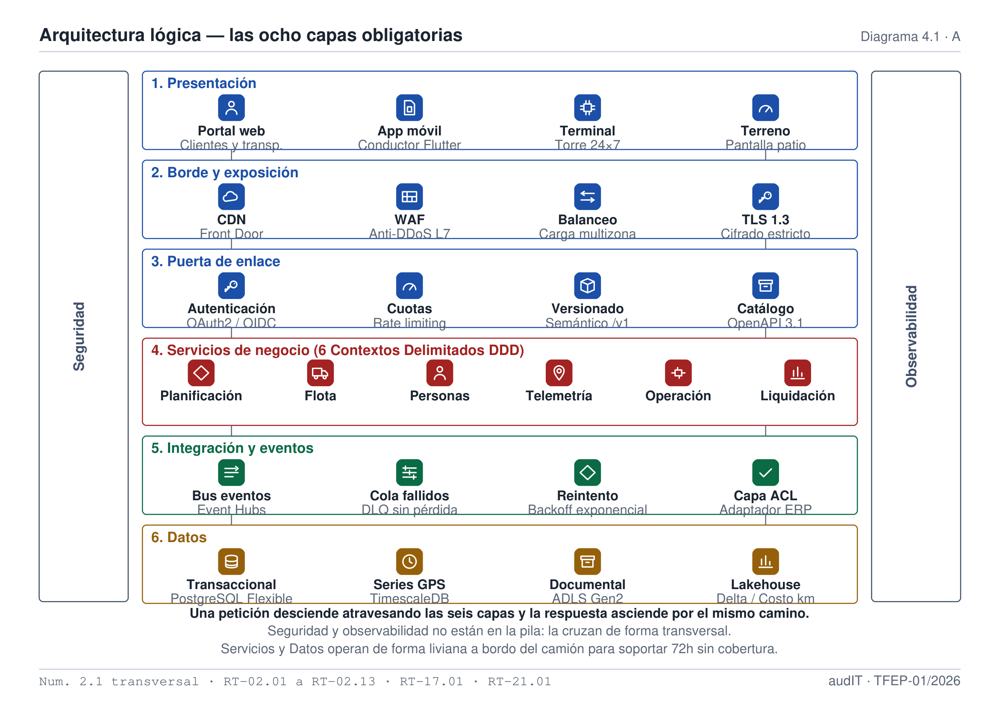
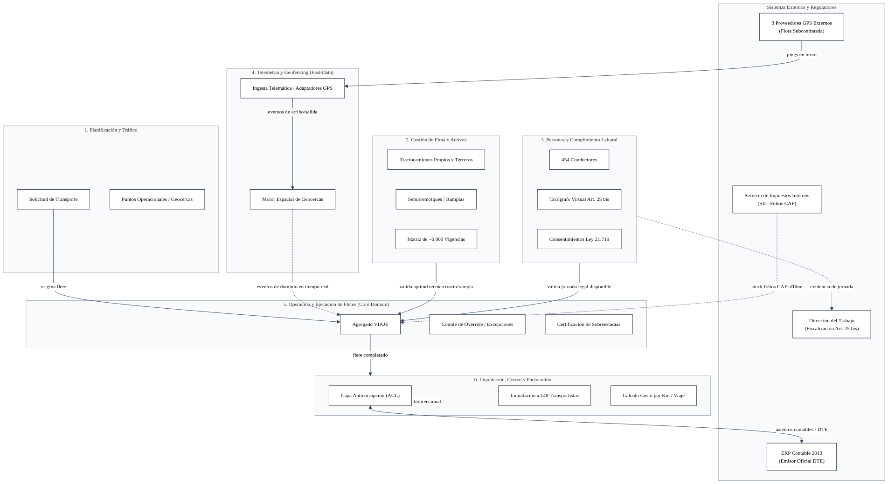
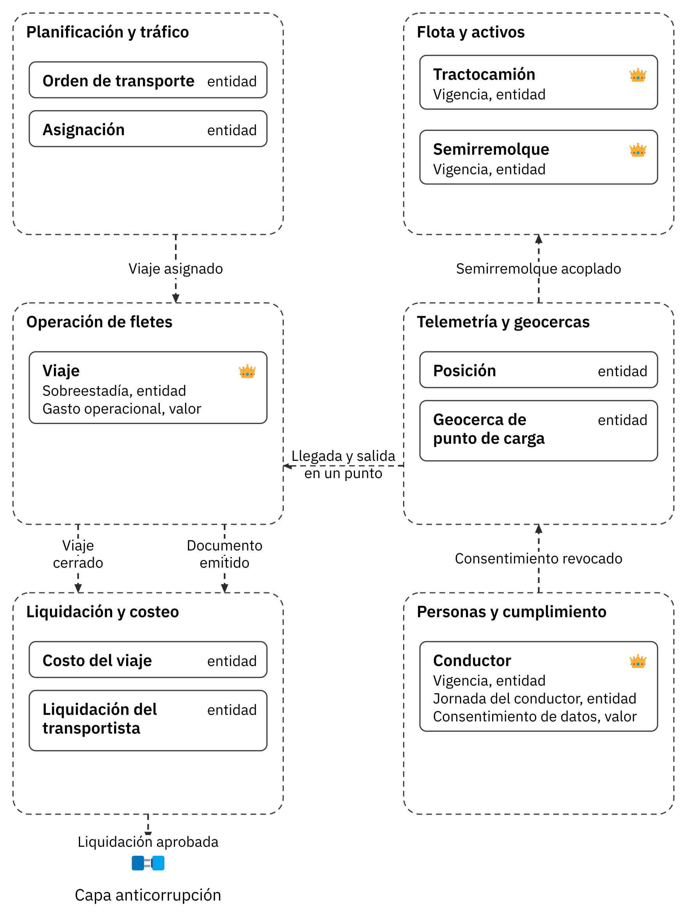
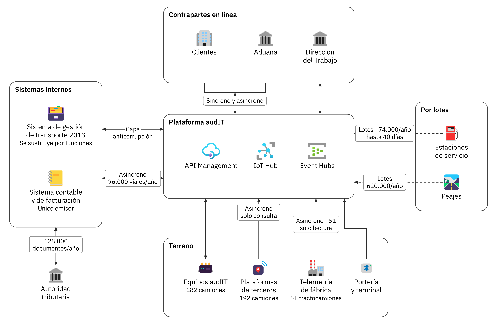
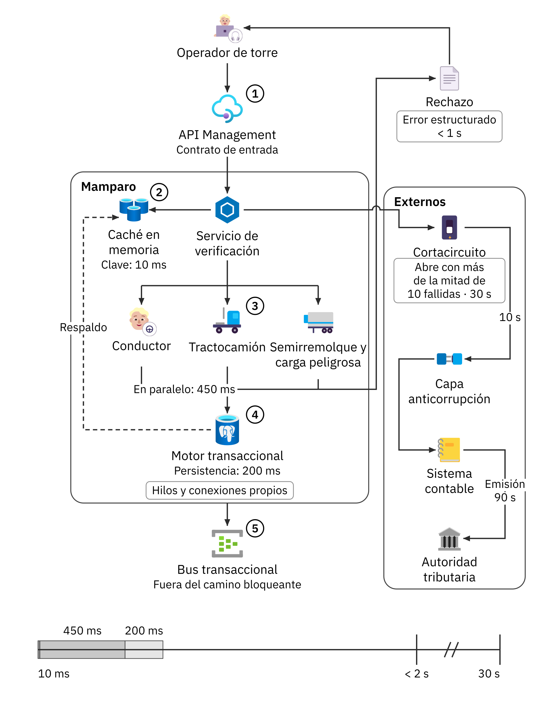
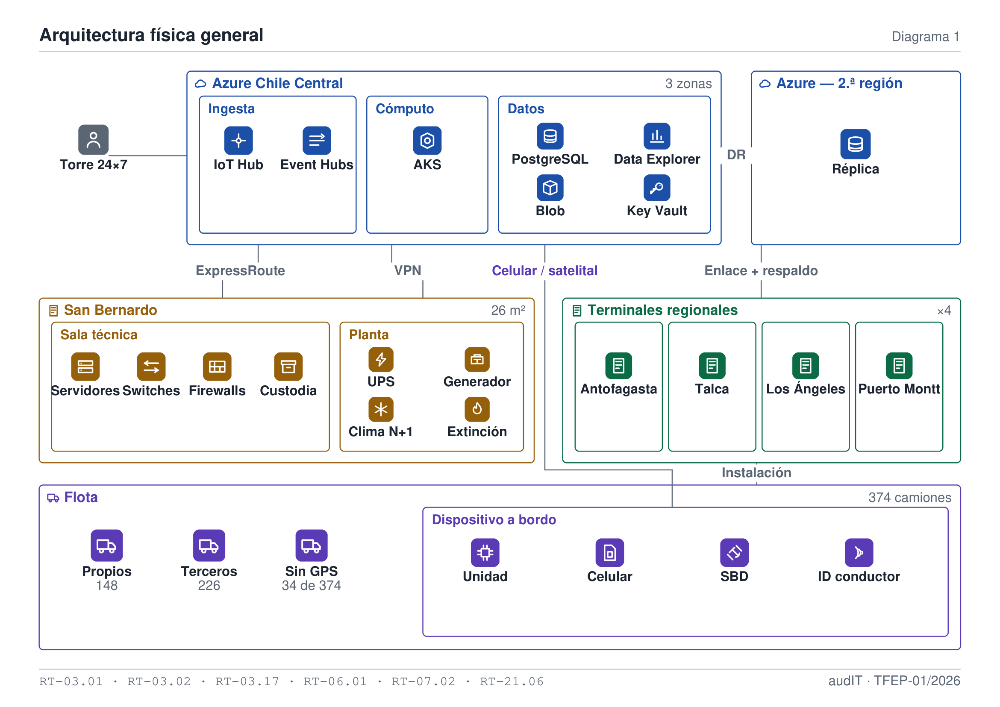
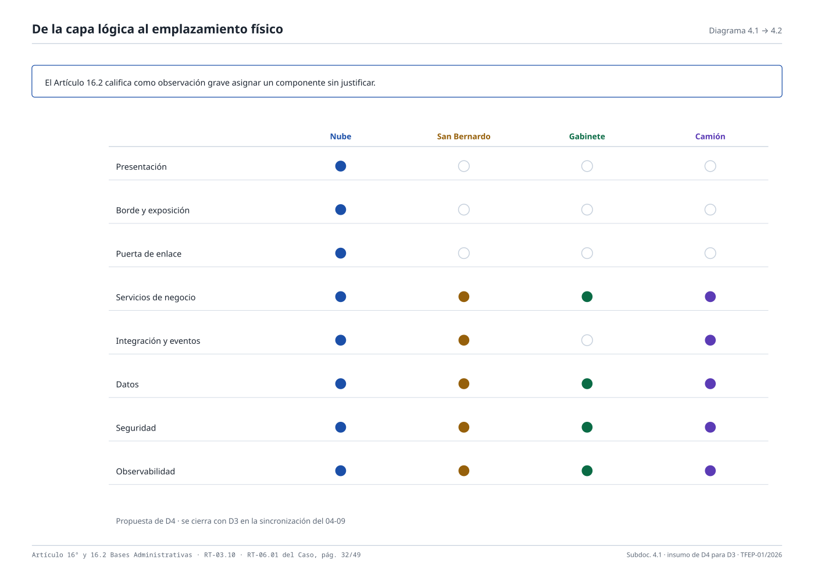
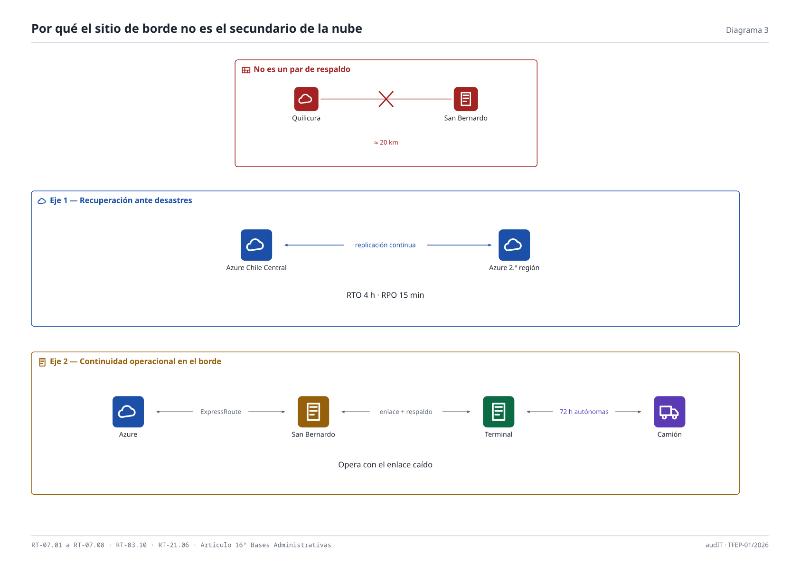

# Subdocumento 4. Arquitectura lógica y física de la solución

audIT, Empresa N.º 10. Licitación TFEP-01/2026, Caso 10 Transporte de Carga. Oferta Técnica, Sobre N.º 2. Informe Preparatorio 2.

> **Resumen de apertura.**
>
> audIT Soluciones Tecnológicas SpA presenta la arquitectura lógica y física integral para Transportes Curimón S.A., estructurada sobre el modelo de referencia de ocho capas desacopladas, alta disponibilidad en nube híbrida y borde operacional distribuido. La solución garantiza la continuidad del despacho bloqueante en menos de dos segundos (Caso, RT-09.01, p. 32), autonomía de 72 horas y hasta 12 días en pasos fronterizos mediante almacenamiento no volátil de **8 GB** (Caso, numeral 14.2, p. 29), y cálculo automatizado del costo real consolidado por viaje en menos de 24 horas (Caso, RT-05.29, p. 31).
>
> **Qué recibe Transportes Curimón S.A.**
> - Arquitectura lógica en ocho capas con seis contextos delimitados y aislamiento mediante capa anticorrupción frente al ERP contable heredado.
> - Especificación y justificación técnica del stack de software con registro formal de decisiones de arquitectura (ADR 01 a 04).
> - Arquitectura física híbrida conforme al FEP01, Artículo 16.1, p. 12, con 374 unidades de transporte concebidas como infraestructura on-premise distribuida.
> - Estrategia de data center con replicación geográfica multirregión (RTO $\le 4$ h, RPO $\le 15$ min) y contingencia local en San Bernardo.

## 4.1 Arquitectura lógica

La arquitectura lógica de audIT para Transportes Curimón S.A. mapea de manera unívoca el esquema conceptual y la explicación operacional de la solución, organizando las capacidades funcionales en ocho capas desacopladas y seis contextos delimitados. Esta disposición garantiza el aislamiento de fallas, la escalabilidad independiente de los componentes y la interoperabilidad mediante contratos gobernados y eventos asíncronos.

### 4.1.1 Punto de partida y respuesta estructural

El Capítulo 5 del Caso resume el problema central en una frase de diagnóstico: el sistema de gestión de transporte heredado de 2013 conoce el viaje que la compañía encargó, pero no conoce el viaje que efectivamente ocurrió (Caso, p. 13). El dato operacional existe disperso entre tres plataformas de posicionamiento por satélite incompatibles, telemetría de motor que nadie descarga, liquidaciones de combustible con hasta cuarenta días de desfase y documentos en papel en la cabina. Dicha dispersión no puede corregirse mediante ajustes de configuración, pues responde a limitaciones intrínsecas de acoplamiento del software monolítico original. En la Tabla 4.1 se contrastan los rasgos del sistema de 2013 con las respuestas de ingeniería de la presente propuesta.

**Tabla 4.1.** Rasgos del sistema de 2013 y respuesta de esta arquitectura

| **Rasgo heredado** | **Efecto que produce hoy** | **Respuesta de esta arquitectura** |
|---|---|---|
| Base única compartida por tráfico, facturación y contabilidad | La consulta de gestión compite con la operación de la torre por el mismo motor | Separación estricta del almacenamiento transaccional y del analítico, obligatoria por FEP02, RT-05.05, p. 9 |
| Integración con el sistema contable por tablas compartidas | Todo cambio contable alcanza el núcleo operacional sin mediación | Capa anticorrupción con colas asíncronas, obligatoria por FEP02, RT-05.20, p. 9 |
| Ausencia de costo por kilómetro por tramo de ruta | Tres de los ocho contratos principales se sirven bajo costo (el peor a $-14$ % sostenido por cuatro años) | Costo por viaje en doble versión: preliminar en 24 h y consolidada mensual (Caso, RT-05.29, p. 31) |
| Puerto de telemetría de fábrica inactivo | Lectura de motor de 61 tractocamiones desaprovechada por temor a perder garantías | Acoplamiento inductivo sin contacto sobre el arnés original (CAN/FMS) |
| Módulos operativos acoplados entre sí | El sistema no distingue el viaje encargado del viaje ocurrido | Seis contextos delimitados (DDD), cada uno con persistencia y lógica propia |

Como se desprende de la Tabla 4.1, la propuesta desacopla de raíz las funciones operacionales de las contables, garantizando que ninguna falla en procesos administrativos o analíticos degrade la operación continua de la flota en ruta.

### 4.1.2 Las ocho capas del modelo de referencia

La arquitectura lógica se organiza rigurosamente en las ocho capas del modelo de referencia mandatado por el numeral 2.1 de las Bases Técnicas Transversales (FEP02, numeral 2.1, p. 6). El diseño satisface el estándar ISO/IEC/IEEE 42010 (ISO, 2022) y asegura que ninguna interfaz externa acceda directamente a las capas de persistencia. En la Tabla 4.2 se define la responsabilidad de cada capa, mientras que en la Tabla 4.3 se detallan los componentes lógicos que residen en ellas. Asimismo, la Figura 4.1 ilustra el flujo de interacción e interfaces entre las ocho capas.

**Tabla 4.2.** Las ocho capas y su contenido en esta solución

| **Capa** | **Contenido y responsabilidad** |
|---|---|
| Presentación | Portal web para 84 clientes y 148 transportistas, aplicación móvil multipropósito, terminales de torre y taller, y pantallas de terreno operables con guantes |
| Borde y exposición | Distribución de contenidos (CDN), cortafuegos de aplicaciones web (WAF), balanceo y terminación de cifrado TLS 1.3. Único punto de entrada público |
| Puerta de enlace | Autenticación federada, autorización basada en roles (RBAC/ABAC), cuotas, límites de tasa, versionado semántico y catálogo unificado de servicios |
| Servicios de negocio | Seis contextos delimitados con límites explícitos, implementados como microservicios sin estado y desplegables de forma autónoma |
| Integración y eventos | Bus de eventos de telemetría, bus transaccional, colas de mensajes fallidos (DLQ), reintento exponencial y deduplicación |
| Datos | Persistencia políglota: motor transaccional relacional, base de series de tiempo, caché en memoria, repositorio documental inmutable y lakehouse analítico |
| Seguridad | Gestión de identidad federada, custodia de secretos en HSM, cifrado a nivel de campo (Caso, RT-11.10, p. 32) y bitácora forense auditable (FEP02, RT-05.03, p. 8) |
| Observabilidad | Instrumentación única con métricas, registros y trazas distribuidas correlacionadas por identificador de transacción común (FEP02, RT-05.19, p. 9) |

El modelo de capas establece una jerarquía estricta de llamadas descendentes y retornos ascendentes, garantizando que las capas de seguridad y observabilidad crucen transversalmente toda la infraestructura sin crear dependencias circulares.

**Tabla 4.3.** Componentes declarados por capa

| **Capa** | **Componentes declarados** |
|---|---|
| Presentación | Portal web responsivo en React y Next.js, aplicación móvil en Flutter para los cuatro perfiles de Caso, RT-17.01, p. 33 (conductor, torre, terminal y taller, y transportista externo), y terminales de patio de alto contraste |
| Borde y exposición | Servicio de entrega perimetral distribuido, WAF con protección volumétrica anti-DDoS en capas 3, 4 y 7 |
| Puerta de enlace | API Gateway con autenticación OAuth 2.0 / OpenID Connect, mTLS entre microservicios y limitación de tasa por perfil |
| Servicios de negocio | Microservicios contenerizados en clúster multizona, con despliegue independiente por contexto delimitado |
| Integración y eventos | Pipeline de ingesta masiva de telemetría (Kafka API), bus transaccional particionado con orden garantizado y adaptador de capa anticorrupción |
| Datos | Motor PostgreSQL Flexible Server multizona, TimescaleDB para series temporales, Azure Cache for Redis, ADLS Gen2 inmutable y delta lake analítico |
| Seguridad | Bóveda Azure Key Vault HSM con certificación FIPS 140-2 Nivel 3, Microsoft Entra ID y motor de auditoría WORM |
| Observabilidad | Pila de telemetría basada en OpenTelemetry con correlación unificada extremo a extremo entre nube y dispositivos a bordo |

La organización de componentes expuesta en la Tabla 4.3 asegura la total independencia operativa y el confinamiento de cargas de trabajo pesadas respecto del camino crítico transaccional.

*Figura 4.1. Las ocho capas obligatorias del numeral 2.1 transversal, con sus componentes e interfaces*

### 4.1.3 Contextos delimitados y modelo táctico del dominio

En cumplimiento de FEP02, RT-02.02, p. 7, que prohíbe las arquitecturas monolíticas indivisibles, audIT estructura la lógica de negocio mediante el patrón de Diseño Guiado por el Dominio (DDD). Se establecen seis contextos delimitados independientes, cada uno poseedor exclusivo de su esquema de persistencia y delimitado por fronteras transaccionales explícitas. En la Tabla 4.4 se definen las responsabilidades de cada contexto. Las interrelaciones estratégicas entre contextos se visualizan en la Figura 4.2, mientras que el modelo táctico detallado (agregados, entidades y servicios de dominio exigido por FEP02, RT-02.13, p. 8) se presenta en la Figura 4.3.

**Tabla 4.4.** Contextos delimitados y la decisión que sostiene cada uno

| **Contexto delimitado** | **Decisión de negocio que resuelve** |
|---|---|
| Planificación y tráfico | Determina la asignación óptima de carga, ruta, tiempo estimado y cumplimiento de compromisos comerciales |
| Flota y activos | Dictamina si la unidad tractora y el semirremolque están mecánicamente aptos y con revisiones técnicas vigentes |
| Personas y cumplimiento | Dictamina si el conductor está legalmente habilitado para conducir hoy (jornada laboral, descansos y certificados) |
| Telemetría y geocercas | Procesa coordenadas en tiempo real, detecta cruces de geocercas en faena y calcula eventos de marcha y ralentí |
| Operación de fletes | Consolida el ciclo de vida del viaje ejecutado, integrando tiempos de espera, contingencias y documentos emitidos |
| Liquidación y costeo | Liquida fletes a transportistas y determina el costo real consolidado por kilómetro y por tramo |

La partición funcional de la Tabla 4.4 previene el acoplamiento cruzado: un cambio en las fórmulas de liquidación jamás afectará la capacidad de la torre de control de monitorear o despachar camiones.

*Figura 4.2. Contextos delimitados del dominio y mapa de relaciones de negocio*

Como ilustra la Figura 4.2, los contextos se comunican mediante eventos de dominio asíncronos y contratos formalizados, erradicando los accesos directos a bases de datos compartidas. El modelo táctico derivado se despliega en la Figura 4.3, identificando los agregados raíz que custodian la coherencia transaccional.

*Figura 4.3. Modelo táctico del dominio. Agregados, entidades y servicios por contexto*

### 4.1.4 Arquitectura de integración y capa anticorrupción

La solución interactúa con una red compleja de actores internos y externos: el sistema contable heredado de 2013, plataformas telemáticas preexistentes, redes de estaciones de combustible, concesionarias de autopistas y organismos reguladores. La Figura 4.4 esquematiza el mapa integral de integraciones.

*Figura 4.4. Mapa de integraciones. Sistemas internos, fuentes de terreno y contrapartes externas*

En cumplimiento de FEP02, RT-05.20, p. 9, la interacción con el ERP contable de 2013 se aísla mediante una Capa Anticorrupción (ACL), cuyas piezas estructurales se especifican en la Tabla 4.5 y cuyo diagrama de interacción se detalla en la Figura 4.5.

**Tabla 4.5.** Piezas de la capa anticorrupción frente al ERP contable

| **Pieza estructural** | **Función de ingeniería** |
|---|---|
| Adaptador de dominio | Traduce los eventos de dominio de la nueva arquitectura a las estructuras planas y tablas que el sistema heredado espera |
| Transformador de esquemas | Homologa tipos de datos, códigos de cuenta y nomenclaturas, evitando la contaminación del nuevo modelo |
| Protector de resiliencia | Implementa cortacircuitos (Circuit Breaker) y cola de mensajes pendientes (DLQ). Si el ERP falla, la operación 24x7 no se interrumpe |
| Reconciliador transaccional | Audita en segundo plano que todo evento encolado haya impactado contablemente, alertando discrepancias en tableros de control |

La arquitectura de la Tabla 4.5 garantiza que la obsolescencia o indisponibilidad del ERP no degrade el núcleo operacional 24x7 de Transportes Curimón S.A.

*Figura 4.5. Integración con el sistema contable heredado a través de la capa anticorrupción*

**Emisión de documentos tributarios sin cobertura.** La Decisión 9 del numeral 16.1 del Caso (Caso, numeral 16.1, p. 34) aborda la emisión del Documento Electrónico de Transporte (DET) en puntos de carga sin cobertura celular. audIT resuelve este desafío anticipando el acto de firma digital: el dispositivo a bordo o terminal de faena almacena un lote seguro de folios autorizados por el SII y firma localmente el documento antes de iniciar el movimiento. Al restablecer la cobertura, la transacción se sincroniza hacia la nube y el ERP vía ACL con clave de idempotencia. Conforme a FEP02, RT-05.21, p. 9, en la Tabla 4.6 se formaliza el comportamiento de cada interfaz del sistema.

**Tabla 4.6.** Declaración por integración conforme a RT-05.21

| **Contraparte** | **Modo** | **Volumen esperado** | **Ventana de disponibilidad** | **Comportamiento ante falla** |
|---|---|---|---|---|
| ERP contable de 2013 | Asíncrono | 96.000 viajes/año (asientos y DET) | Horario administrativo hábil | Cortacircuito y encolado en DLQ; operación continúa |
| Plataformas telemáticas terceros | Asíncrono | Coordenadas de unidades externas | Variable por proveedor | Mantiene última posición conocida con marca de tiempo visible |
| Telemetría de fábrica (CAN/FMS) | Asíncrono | 61 tractocamiones (solo lectura) | En marcha del vehículo | Registro local en dispositivo a bordo vía acoplamiento inductivo |
| Red de estaciones de servicio | Lote mensual | 74.000 cargas de combustible/año | Mensual (desfase 40 días) | Costeo preliminar en 24 h y conciliación posterior |
| Concesionarias de autopistas | Lote mensual | 620.000 pasadas de peaje/año | Mensual | Estimación de peaje por traza GPS y ajuste en liquidación |
| Servicio de Impuestos Internos | Síncrono | 128.000 DET y guías al año | 24x7 del organismo | Emisión en contingencia con folios precargados a bordo |

Los parámetros de la Tabla 4.6 demuestran que ninguna interfaz externa constituye un bloqueo síncrono para el despacho ni para la continuidad del transporte en carretera.

### 4.1.5 Patrones de resiliencia y verificación bloqueante del despacho

Los servicios de negocio se implementan sin estado (stateless), alojando la sesión y variables temporales en memorias distribuidas de alta disponibilidad (FEP02, RT-02.05, p. 7). En la Tabla 4.7 se configuran los patrones de resiliencia de FEP02, RT-02.08, p. 7.

**Tabla 4.7.** Parámetros de los patrones de resiliencia

| **Patrón** | **Parámetro de diseño comprometido** |
|---|---|
| Cortacircuito (Circuit Breaker) | Apertura automática tras 50 % de fallas en ventana de 10 peticiones; estado semi-abierto a los 30 s con 3 sondas de validación |
| Mamparo (Bulkhead) | Piscinas de conexiones e hilos aisladas: la verificación de despacho no comparte recursos con reportes pesados de facturación |
| Tiempos de espera (Timeouts) | Validación en memoria: 800 ms; consulta transaccional: 5 s; llamada al ERP vía ACL: 10 s; emisión de DET: $\le 90$ s (Caso, RT-09.01, p. 32) |
| Reintento exponencial con jitter | Tres reintentos para operaciones idempotentes con variación aleatoria para evitar tormentas de reconexión de flotas |
| Límite de tasa (Rate Limiting) | Control por perfil en API Gateway, asegurando prioridad absoluta para la torre de control y eventos de emergencia |

La parametrización de la Tabla 4.7 salvaguarda la disponibilidad del sistema frente a ráfagas y degradaciones en servicios de terceros.

**Verificación bloqueante del despacho en menos de 2 segundos.** El requerimiento Caso, RT-09.01, p. 32 impone un umbral máximo de 30 segundos para la asignación de un viaje con verificación integral. audIT optimiza este proceso evaluando las tres invariantes legales en paralelo sobre memoria caché Redis (ver Tabla 4.8), completando la operación en menos de dos segundos conforme al presupuesto de la Tabla 4.9.

**Tabla 4.8.** Invariantes de la verificación bloqueante del despacho

| **Invariante** | **Regla evaluada** | **Marco regulatorio** |
|---|---|---|
| Conductor | Horas conducidas en el día, continuidad sin descanso ($\le 5$ h continuas) y horas acumuladas | Art. 25 bis del Código del Trabajo (Ministerio del Trabajo, 2003) |
| Tractocamión | Revisión técnica al día, SOAP y permiso de circulación vigente en matriz de flota | Numeral 4.4 del Caso |
| Semirremolque y carga | Habilitación para sustancias peligrosas y concordancia física entre equipo y carga | Decreto Supremo N.º 298 (Ministerio de Transportes, 1995) |

Las tres invariantes descritas en la Tabla 4.8 son de evaluación estricta y excluyente; ninguna admite bypass automatizado sin autorización expresa y registrada.

**Tabla 4.9.** Reparto del presupuesto de 30 segundos en memoria

| **Fase de procesamiento** | **Presupuesto asignado** | **Capa de resolución** |
|---|---|---|
| Validación sintáctica y bloqueo de idempotencia | 10 ms | API Gateway y Azure Cache for Redis |
| Evaluación concurrente de las 3 invariantes | 450 ms | Caché Redis (con fallback en PostgreSQL) |
| Persistencia atómica del viaje | 200 ms | Motor PostgreSQL multizona (Serializable) |
| Publicación de eventos derivados | Asíncrono (fuera de banda) | Bus de eventos Kafka |
| **Tiempo total comprometido** | **$<$ 2 segundos** | **Frente a 30 s de norma Caso, RT-09.01, p. 32** |

Como evidencia la Tabla 4.9, el sistema audIT ofrece un margen de seguridad de más de 15 veces respecto del techo contractual, garantizando que futuras expansiones volumétricas (FEP02, RT-09.03, p. 11) no requieran rediseños. Ante un rechazo, el sistema emite inmediatamente el documento de error de la Tabla 4.10.

**Tabla 4.10.** Contenido del documento de error ante un despacho rechazado

| **Atributo** | **Detalle entregado al operador** |
|---|---|
| Tipo | Identificador unívoco del motivo de rechazo (ej. `ERR_JORNADA_EXCEDIDA`) |
| Título | Enunciado conciso y claro de la regla infringida |
| Estado | Código HTTP 422 con tipificación de regla de negocio versus falla de sistema |
| Detalle | Valor cuantitativo medido frente al umbral legal (ej. «Conductor acumula 4h 50min continuas») |
| Instancia | Identificador del intento de asignación correlacionable en bitácora de auditoría |

La respuesta estructurada de la Tabla 4.10 previene intentos a ciegas por parte de la torre de control, facilitando la toma de decisiones inmediata. La secuencia completa de resiliencia y asignación se detalla en la Figura 4.6.

*Figura 4.6. Patrones de resiliencia y flujo de la asignación bloqueante*

### 4.1.6 Idempotencia, gobernanza y seguridad Zero Trust

La idempotencia (FEP02, RT-02.06, p. 7) se implementa mediante claves criptográficas únicas generadas en el origen y retenidas durante siete días, asegurando que mensajes transmitidos tras días de desconexión en pasos fronterizos no dupliquen viajes ni registros. La gobernanza de APIs adopta contratos formales OpenAPI 3.1 para interfaces síncronas y AsyncAPI 2.6 para mensajería por eventos (FEP02, RT-05.16, p. 9), generados automáticamente desde el código fuente con versionado semántico y seis meses de preaviso de obsolescencia (FEP02, RT-05.17, p. 9).

El marco de seguridad sigue el modelo Zero Trust: autenticación basada en Microsoft Entra ID con políticas de Acceso Condicional, inspección mutua TLS 1.3 (mTLS) entre componentes, y cifrado transparente de bases de datos junto con cifrado a nivel de campo para datos personales de conductores (Caso, RT-11.10, p. 32), en estricto cumplimiento de la Ley 21.719 (Ministerio de Hacienda, 2024) y la Ley 21.663 de Ciberseguridad (Congreso Nacional de Chile, 2024).

### 4.1.7 Capa analítica y cálculo del costo real por kilómetro

Para cumplir con la prohibición expresa de que las consultas analíticas degraden la operación transaccional (FEP02, RT-05.05, p. 9), audIT desacopla la analítica mediante captura de cambios (CDC) hacia un lakehouse estructurado en tres niveles de refinamiento (arquitectura Medallion), detallado en la Tabla 4.11 y graficado en la Figura 4.7.

**Tabla 4.11.** Capas del repositorio analítico medallion

| **Capa de datos** | **Contenido** | **Garantía operacional** |
|---|---|---|
| Bronce (Cruda) | Telemetría GPS, lecturas CAN/FMS, réplicas CDC y archivos mensuales de peaje y combustible | Inmutabilidad, retención histórica y posibilidad de reprocesamiento íntegro |
| Plata (Depurada) | Datos deduplicados, coordenadas validadas en ruta y marcas de tiempo unificadas | Consistencia y limpieza sin discrepancias semánticas |
| Oro (Negocio) | Modelo dimensional en estrella con hechos de costo por viaje, tramo y conductor | Consultas directas para finanzas y BI sin tocar la base operacional |

La organización de la Tabla 4.11 sustenta la explotación analítica sin introducir latencias en la operación de tráfico.

*Figura 4.7. Capa analítica por niveles de refinamiento y explotación del costo por kilómetro*

**Mecanismo de costeo dual por viaje (Caso, RT-05.29, p. 31).** El cálculo del costo por kilómetro discrimina el régimen de flota propia versus subcontratada (ver Tabla 4.12). Para dar cumplimiento a Caso, RT-05.29, p. 31, audIT implementa un cálculo dual: una versión preliminar generada en no más de 24 horas tras el cierre del viaje con los datos disponibles (telemetría, peajes estimados y conductor), y una versión consolidada definitiva emitida una vez liquidadas las facturas mensuales de combustible y pórticos. Ambas versiones se conservan en el sistema para medir la desviación presupuestaria.

**Tabla 4.12.** Componentes del costo por viaje y su origen por régimen de flota

| **Componente** | **Flota propia (148 unidades)** | **Flota subcontratada (226 unidades)** |
|---|---|---|
| Combustible | Medido directamente por CAN/FMS y valorizado mensualmente | Imputado mediante anticipos otorgados |
| Peajes | Cruce de pórtico efectivo con traza GPS | Tarifa pactada o peaje acreditado |
| Conductor | Horas efectivas de conducción y espera imputadas | Tarifa contratada (no desagregable) |
| Mantenimiento y llantas | Provisión por kilómetro según odómetro telemático | No observable (costo de tercero) |
| Sobreestadía | Espera acreditada automáticamente por geocerca de cliente | Espera acreditada por geocerca |
| Denominador de ruta | Odómetro telemático de fábrica del camión | Kilometraje de traza GPS homologada |

La distinción de la Tabla 4.12 transparenta las diferencias de margen operacional entre flota propia y subcontratada. En la Tabla 4.13 se consolidan las latencias máximas comprometidas en la capa analítica.

**Tabla 4.13.** Latencias de la capa analítica fijadas por RT-05.29 del Caso

| **Información analítica** | **Latencia máxima contractual** |
|---|---|
| Posición de camiones en zona de cobertura celular | Menor a 2 minutos en mapa |
| Jornada acumulada de conductor | Tiempo real al momento de despachar (Redis) |
| Registro de llegada y salida en geocerca de faena | Inmediato en dispositivo a bordo |
| Costo consolidado del viaje | 24 horas tras cierre del viaje (versión preliminar) |
| Reporte de huella de carbono y emisiones GLEC (Smart Freight Centre, 2023) | Consolidación mensual automatizada |

El cumplimiento de la Tabla 4.13 permite erradicar la anomalía histórica de Curimón S.A., donde tres contratos operaron a pérdida durante cuatro años por falta de costeo oportuno.

### 4.1.8 Inventario de componentes lógicos y volumetría

En la Tabla 4.14 se inventarían los componentes lógicos de la arquitectura con sus atributos de ingeniería, sirviendo de fundamento directo para la matriz de emplazamiento físico del FEP01, Artículo 16.2, p. 12.

**Tabla 4.14.** Inventario de componentes lógicos

| **Componente** | **Capa** | **Latencia** | **Criticidad** | **Volumen anual** |
|---|---|---|---|---|
| CDN y cortafuegos perimetral | Borde | 50 ms | Crítica | Tráfico web global y APIs |
| API Gateway y autenticación | Borde | 30 ms | Crítica | 350 sesiones concurrentes peak |
| Servicio de despacho y asignación | Negocio | 500 ms | Máxima | 96.000 viajes/año |
| Servicio de flota y mantenimiento | Negocio | 1 s | Alta | 374 tractos y 210 semirremolques |
| Servicio de personas y jornada | Negocio | 500 ms | Máxima | 454 conductores y vigencias |
| Servicio de gestión documental | Negocio | 2 s | Alta | 128.000 DET y guías/año |
| Servicio de tarifas y liquidación | Negocio | 3 s | Media | 148 transportistas y 84 clientes |
| Bus de telemetría de flota | Eventos | 100 ms | Crítica | $≈ 120$ millones de eventos/año |
| Bus transaccional de viajes | Eventos | 200 ms | Crítica | Ciclo de vida del viaje |
| Pasarela capa anticorrupción | Integración | 500 ms | Alta | Asientos y documentos contables |
| Base de datos transaccional | Datos | 15 ms | Máxima | 96.000 viajes particionados |
| Base de series temporales | Datos | 20 ms | Alta | 2 años en línea hot/warm |
| Caché distribuida en memoria | Datos | 5 ms | Crítica | 1.400 geocercas y sesiones |
| Almacenamiento inmutable | Datos | 1 s | Alta | Evidencia probatoria 5 a 10 años |
| Lakehouse analítico | Analítica | Segundos | Media | Costo por km y tableros BI |
| Buffer no volátil a bordo | Terreno | Inmediata | Máxima | $\ge 8$ GB en 182 unidades |

Los componentes de la Tabla 4.14 se dimensionan para absorber la concurrencia y volúmenes calculados en la Tabla 4.15 y la Tabla 4.16, derivadas de los datos del Caso (Caso, numeral 14.1, p. 29).

**Tabla 4.15.** Concurrencia derivada de la volumetría del Caso

| **Grupo de usuarios** | **Concurrencia peak** | **Base de cálculo (Caso, numeral 14.1)** |
|---|---|---|
| Personal interno de operaciones y torre | 50 a 80 | 22 operadores en turno, patio, taller y finanzas |
| Conductores en app móvil | 100 a 150 | Conexiones breves sobre 454 conductores |
| Transportistas en portal web | 30 a 50 | Consultas sobre 148 empresas colaboradoras |
| Clientes en seguimiento de carga | 50 a 100 | Monitoreo activo sobre 84 clientes corporativos |
| **Concurrencia total dimensionada** | **350 concurrentes** | **Prueba de estrés dimensionada a 525 (1,5x)** |

**Tabla 4.16.** Volumen anual de telemetría derivado

| **Parámetro** | **Magnitud anual** | **Base de derivación** |
|---|---|---|
| Kilómetros recorridos por la flota | 41.000.000 km | Caso, numeral 14.1 |
| Horas de marcha efectivas | $≈ 745.000$ h | Velocidad comercial promedio 55 km/h |
| Registros de posición en marcha (30 s) | $≈ 89.000.000$ | Ingesta continua en ruta celular |
| Registros en detención (5 min) | $≈ 30.000.000$ | Monitoreo en faenas y descansos |
| Volumen bruto anual de telemetría | 15 a 18 GB | 64 B/GPS + 160 B/CAN |
| Volumen total con índices y particiones | 30 a 40 GB/año | Persistencia en TimescaleDB |

La derivación de la Tabla 4.16 confirma que el volumen de datos de telemetría es altamente manejable bajo esquemas modernos de particionamiento y compresión.

### 4.1.9 Especificaciones Tecnologías de Software a utilizar

Conforme a la exigencia expresa del Comunicado 10 (numeral 4.1.1), se definen formalmente las tecnologías de software, frameworks, bases de datos y servicios en nube seleccionados para la solución. En la Tabla 4.17 se detallan las versiones, ciclos de soporte y planes de actualización durante los 56 meses del contrato (FEP02, RT-03.05, p. 7).

**Tabla 4.17.** Tecnologías de software, versiones y soporte ofertado a 56 meses

| **Componente** | **Producto y versión** | **Fin de soporte** | **Plan a 56 meses y justificación** |
|---|---|---|---|
| Aplicación móvil de conductores | Flutter 3.x (Dart) | Soporte LTS continuo | Compilación nativa Android/iOS, UI ergonómica de alto contraste (FEP03, RT-13.08, p. 32) y SQLite local |
| Portales web y torre de control | React 18+ / Next.js (TS) | Soporte LTS continuo | SPA modular responsiva con renderizado híbrido y accesibilidad WCAG 2.2 AA (FEP01, Art. 4.3, p. 5) |
| Servicios backend y APIs | .NET 8 LTS / Go 1.22+ | Noviembre 2026 / LTS | Microservicios de alto desempeño sobre Linux en contenedores distroless |
| Orquestación y cómputo | Azure Kubernetes Service (AKS) 1.30+ | Soporte N-2 continuo | Servicio administrado PaaS con actualizaciones automáticas fuera de hora punta |
| Motor transaccional | PostgreSQL 16 Flexible Server | Noviembre 2028 | Motor relacional con alta disponibilidad zonal y extensión PostGIS |
| Series temporales y eventos | TimescaleDB 2.15 / Event Hubs Kafka | Mayo 2029 | Particionado por rango temporal y compresión columnar para 120M eventos |
| Caché distribuida | Azure Cache for Redis 7.2 | Octubre 2028 | Almacenamiento en RAM con persistencia AOF para geocercas y sesiones |
| Persistencia a bordo | SQLite 3 con modo WAL | Soporte activo LTS | Motor embebido industrial sobre memoria flash de 8 GB con protección ante corte |
| Lakehouse analítico | Delta Lake en ADLS Gen2 | Soporte activo continuo | Tablas Delta con soporte ACID y aislamiento estricto de la operación OLTP |
| Gestión de identidad | Microsoft Entra ID / Key Vault | Servicio gestionado | Autenticación OAuth 2.0 y custodia criptográfica FIPS 140-2 Nivel 3 |

La selección tecnológica de la Tabla 4.17 prioriza servicios gestionados PaaS que eliminan la carga operativa de parches de sistema operativo (FEP02, RT-03.05, p. 7). Asimismo, en la Tabla 4.18 se registran formalmente las Decisiones de Arquitectura (ADR 01 a 04) con sus alternativas descartadas, dando cumplimiento a FEP02, RT-02.04, p. 7 y al Artículo 19 de las bases.

**Tabla 4.18.** Decisiones de arquitectura lógica registradas (ADR 01 a 04)

| **ADR** | **Contexto del problema** | **Alternativa escogida** | **Alternativa descartada** | **Criterio de ingeniería** |
|---|---|---|---|---|
| 01 | Ingesta masiva tras sombra celular compitiendo con la torre | Microservicios contenerizados (AKS) independientes | Monolito modular escalable verticalmente | Aislamiento de fallas y elasticidad horizontal por partición (FEP02, RT-02.10, p. 7) |
| 02 | Asignación de viaje dispara geocercas, alertas y costeo | Coreografía reactiva con eventos de dominio | Cadena síncrona de llamadas REST entre servicios | Desacoplamiento temporal; el despacho confirma en $<$ 2 s sin esperar procesos derivados |
| 03 | Cálculo de costo por km compitiendo con la torre | Replicación asíncrona CDC hacia Lakehouse Delta | Consultas analíticas sobre réplicas de lectura OLTP | Prohibición de degradar el motor transaccional (FEP02, RT-05.05, p. 9) |
| 04 | Coexistencia con 84 clientes, 148 terceros y ERP 2013 | Identidad federada (mTLS y OAuth 2.0) | Claves fijas en cadenas de conexión o cabeceras | Prohibición de credenciales estáticas (FEP02, RT-05.18, p. 9) y norma Zero Trust |

Las decisiones de la Tabla 4.18 blindan la mantenibilidad de la solución a lo largo de los 56 meses del contrato licitado.

## 4.2 Arquitectura física

La arquitectura física de audIT concreta el modelo híbrido mandatado por el FEP01, Artículo 16.1, p. 12, distribuyendo los componentes lógicos entre la nube pública empresarial, las salas técnicas y gabinetes en tierra, y los nodos de cómputo y almacenamiento a bordo de las 374 unidades de transporte. Esta topología asegura la total continuidad operativa y la resiliencia de las funciones críticas frente a la pérdida de enlace.

### 4.2.1 Cumplimiento del modelo híbrido y reparto de componentes

El FEP01, Artículo 16.1, p. 12 de las Bases Administrativas desestima ofertas que sean exclusivamente en nube o exclusivamente on-premise. audIT materializa una solución híbrida en tres planos complementarios (ver Tabla 4.19). El diagrama general de arquitectura física se presenta en la Figura 4.8, mientras que la correspondencia entre componentes lógicos y nodos físicos se grafica en la Figura 4.9.

**Tabla 4.19.** Los tres planos de emplazamiento físico

| **Plano de emplazamiento** | **Contenido y alcance** | **Justificación técnica de localización** |
|---|---|---|
| Nube pública empresarial | Núcleo transaccional, lakehouse analítico, portales web e ingesta | Elasticidad para absorber peaks de reconexión y alta disponibilidad zonal |
| On-premise de sitio físico | Nodo de continuidad en San Bernardo y gabinetes en 4 terminales | RT-06.01 exige continuidad de torre y terminales sin enlace exterior |
| On-premise distribuido | Dispositivos computacionales a bordo de 374 tractocamiones | Autonomía total de registro, geocercas y jornada sin cobertura celular |

Como sintetiza la Tabla 4.19, la parte on-premise es sustantiva y sostiene las operaciones de severidad máxima (FEP02, RT-21.06, p. 12) en caso de corte total de comunicaciones.

*Figura 4.12. Arquitectura física general. Nube, sitio de continuidad, gabinetes de terminal y flota*

*Figura 4.8. Correspondencia entre capa lógica y emplazamiento físico*

### 4.2.2 El dispositivo a bordo como infraestructura on-premise distribuida

En virtud de Caso, RT-06.01, p. 30, el equipamiento a bordo se trata como infraestructura on-premise distribuida. En las 148 unidades propias y las 34 unidades sin equipo que adhieran al programa (totalizando 182 unidades intervenidas), se instala equipamiento de grado industrial con almacenamiento no volátil de 8 GB. En las unidades de flota subcontratada que cuentan con equipamiento GPS preexistente (340 unidades con telemetría menos las 148 propias), la integración se realiza a nivel lógico vía APIs sin intervenir físicamente el hardware privado (Restricción 3). En la Tabla 4.20 se detallan las especificaciones del componente a bordo.

**Tabla 4.20.** Especificación del componente a bordo

| **Atributo físico** | **Especificación de ingeniería** |
|---|---|
| Almacenamiento local | Flash industrial no volátil $\ge 8$ GB con nivelación de desgaste (wear leveling) |
| Alimentación eléctrica | Rango amplio 9 a 32 VDC, filtrado contra transientes y batería de respaldo interna |
| Condiciones ambientales | Temperatura $-20$ a $+70$ \textdegree{}C, sellado IP67/IP69K contra polvo y lavado a presión |
| Interfaces vehiculares | Doble puerto CANbus con soporte SAE J1939 y acoplador inductivo sin contacto FMS |
| Identificación de conductor | Lector de credencial NFC o iButton de aproximación sin distracción en cabina |
| Gestión remota OTA | Actualización diferencial de firmware y configuración remota securizada (FEP02, RT-03.18, p. 7) |
| Stock de repuestos | 10 % del parque activo precargado y disponible en terminales para recambio rápido |

La adopción de acopladores inductivos sobre el bus CAN del tractocamión da estricto cumplimiento a la Restricción 6, garantizando que no se corte ni empalme el cableado original y protegiendo las garantías del fabricante. En la Tabla 4.21 se detallan los parámetros capturados del motor.

**Tabla 4.21.** Parámetros leídos de la telemetría de fábrica por acoplamiento inductivo

| **Parámetro telemático** | **Aplicación en la solución** |
|---|---|
| Consumo instantáneo y acumulado | Denominador fundamental del costo real de combustible de flota propia |
| Nivel de combustible en estanque | Detección de cargas no registradas o mermas y contraste con facturas |
| Odómetro telemático del vehículo | Kilómetros reales recorridos para asignación de costos y mantenimientos |
| Revoluciones y aceleraciones bruscas | Perfil de conducción eficiente, seguridad en ruta y desgaste mecánico |
| Uso de freno de servicio y retardador | Prevención de fatiga de frenos en descensos cordilleranos |

El dispositivo a bordo constituye la primera línea de captura de datos, cuya arquitectura física de instalación se visualiza en la Figura 4.10. En la Figura 4.11 se ilustra cómo se gestiona un evento de jornada cuando la unidad transita en zonas de silencio celular.

*Figura 4.9. El camión como componente on-premise distribuido*

*Figura 4.10. Flujo de un evento de jornada registrado sin cobertura*

### 4.2.3 Dimensionamiento físico derivado y consumo de datos

Conforme a la instrucción del numeral 14.2 del Caso, todo valor de diseño debe acompañarse de su derivación matemática. La especificación de 8 GB de flash industrial a bordo responde a la necesidad de absorber los cierres del paso internacional Los Libertadores, que alcanzan hasta 12 días continuos (288 horas) según Caso, RT-10.05, p. 32. En la Tabla 4.22 se calcula el volumen generado en 72 horas y en la Tabla 4.23 el consumo mensual de datos celulares.

**Tabla 4.22.** Volumen acumulado a bordo tras 72 horas sin cobertura

| **Componente telemático** | **Sin imágenes** | **Con evidencia fotográfica** |
|---|---|---|
| Posición GPS (30 s en marcha / 5 min detenido) | 263 KB | 263 KB |
| Telemetría de motor CAN/FMS (1 muestra/min) | 288 KB | 288 KB |
| Eventos discretos (puertas, pánicos, geocercas) | 32 KB | 32 KB |
| Documentos DET y firmas digitales | 195 KB | 2,6 MB |
| Subtotal de datos acumulados | 0,8 MB | 3,2 MB |
| **Total con factor de seguridad x3** | **2,5 MB** | **10,0 MB** |

Como demuestra la Tabla 4.22, incluso considerando evidencia fotográfica y un factor de seguridad de tres, 72 horas de operación requieren 10 MB, y 12 días de cierre fronterizo no superan los 40 MB. La flash de 8 GB brinda un margen de seguridad de más de 200 veces, garantizando espacio para firmas criptográficas y firmware redundante.

**Tabla 4.23.** Consumo mensual de datos móviles por camión y para la flota

| **Concepto** | **Muestreo cada 10 s** | **Muestreo cada 30 s** | **Muestreo cada 60 s** |
|---|---|---|---|
| Carga útil mensual por camión | 7,9 MB | 5,3 MB | 4,7 MB |
| Con sobrecarga de protocolos (TLS/IP) | 20 a 24 MB | 13 a 16 MB | 12 a 14 MB |
| **Consumo mensual flota (374 camiones)** | **8,2 GB** | **5,6 GB** | **5,0 GB** |

De la Tabla 4.23 se extrae una conclusión clave: el tráfico de datos móviles de la flota es marginal ($≈ 5,6$ GB mensuales totales). El foco de optimización de costos reside en los cargos fijos de conectividad SIM multicarrier y el uso selectivo de ráfagas satelitales.

### 4.2.4 Topología de redes, enlaces y análisis de puntos únicos de falla

En cumplimiento de FEP02, RT-02.11, p. 7, audIT declara abiertamente los Puntos Únicos de Falla (SPOF) que subsisten en el ecosistema físico y sus medidas de mitigación (ver Tabla 4.24).

**Tabla 4.24.** Puntos únicos de falla declarados y medidas de mitigación

| **Punto único de falla** | **Razón de su subsistencia** | **Medida de mitigación implementada** |
|---|---|---|
| ERP contable de 2013 | Restricción 8: sistema no reemplazable y único emisor tributario | La ACL aísla su falla con colas DLQ; la operación física continúa y la emisión se regulariza después |
| Dispositivo físico a bordo | Existe un solo equipo telemático por tractocamión en ruta | Fallo afecta a una unidad aislada; mitigado con procedimiento de contingencia y stock de repuesto en terminal |

En tierra, los recintos se clasifican conforme a las tipologías del numeral 6.1 de las Bases Técnicas Transversales (FEP02, numeral 6.1, p. 10), como expone la Tabla 4.25.

**Tabla 4.25.** Tipología declarada por sitio físico

| **Sitio físico** | **Tipología declarada** | **Justificación de ingeniería** |
|---|---|---|
| San Bernardo (26 m\textsuperscript{2}) | Sala técnica de sitio | Alberga nodo de continuidad de torre y terminación de enlaces |
| Terminales regionales (4 sitios) | Gabinete de borde operacional | Gabinetes sellados y climatizados con 12 h de autonomía (Caso, RT-03.10, p. 30) |
| Flota de transporte (374 camiones) | On-premise distribuido | Equipamiento embarcado con almacenamiento local y operación autónoma |

La sala técnica de San Bernardo presenta brechas severas respecto del estándar transversal, las cuales son remediadas integralmente en el alcance de audIT (ver Tabla 4.26).

**Tabla 4.26.** Habilitación del recinto de San Bernardo y brecha respecto de la situación actual

| **Subsistema** | **Especificación comprometida por audIT** | **Estado actual heredado** |
|---|---|---|
| Energía UPS | Respaldo ininterrumpido $\ge 30$ min a plena carga con baterías selladas | Respaldo precario de 20 min |
| Generador | Grupo electrógeno autónomo con estanque para $\ge 24$ h continuas | Inexistente hoy en la sala |
| Climatización | Clima de precisión redundante en configuración $N+1$ | Aire acondicionado tipo split de confort |
| Incendio | Detección por aspiración láser y extinción por agente limpio Novec 1230 | Inexistente |
| Control acceso | Doble factor biométrico (facial/dactilar) con registro auditable WORM | Llave mecánica o credencial simple |
| Enlaces | Doble acometida por ductos independientes y proveedores diferenciados | Enlace simple no redundante |

La remediación de la Tabla 4.26 garantiza que la sede central de Curimón S.A. opere con estándares bancarios de continuidad física.

### 4.2.5 Desempeño, capacidad y operación en modo desconectado

En cumplimiento de FEP02, RT-03.13, p. 7, en la Tabla 4.27 se declara con total transparencia qué funciones permanecen activas sin enlace y qué procedimiento supletorio rige para las funciones dependientes de la nube.

**Tabla 4.27.** Disponibilidad de funciones sin enlace y procedimiento supletorio

| **Función operacional** | **Disponibilidad offline** | **Procedimiento supletorio** |
|---|---|---|
| Registro de telemetría y jornada | 100 % disponible | Almacenamiento continuo en flash de 8 GB a bordo |
| Detección de geocercas en faena | 100 % disponible | Motor local con 1.400 polígonos precargados en el equipo |
| Alerta sonora de fatiga o jornada | 100 % disponible | Zumbador y display en cabina sin requerir red |
| Emisión de documento DET | 100 % disponible | Firma digital local con folios precargados |
| Botón de pánico y emergencia | Disponible vía satelital | Enlace satelital Iridium SBD (Iridium Communications, 2024) o protocolo telefónico |
| Asignación de nuevo viaje | No disponible | Vía telefónica con torre; registro diferido al recuperar enlace |
| Actualización de geocercas masivas | No disponible | Sincronización automática al ingresar a cobertura o terminal |

Como se aprecia en la Tabla 4.27, todas las funciones que salvaguardan la seguridad de la carga y el cumplimiento del Art. 25 bis del Código del Trabajo operan de forma ininterrumpida sin enlace.

### 4.2.6 Supuestos de dimensionamiento y brechas reconocidas

En la Tabla 4.28 se formalizan los supuestos de cálculo empleados por audIT y el hito contractual en que se cierran formalmente.

**Tabla 4.28.** Supuestos de ingeniería con su derivación y mecanismo de cierre

| **ID** | **Supuesto técnico** | **Valor asumido** | **Hito de cierre formal** |
|---|---|---|---|
| S-01 | Velocidad comercial promedio en ruta | 55 km/h | Campaña de telemetría Etapa 1 |
| S-02 | Horas efectivas de marcha en 72 h | 30 h (descanso Art. 25 bis) | Validado en levantamiento de rutas |
| S-03 | Tamaño de mensaje GPS comprimido | 64 bytes | Homologación de hardware a bordo |
| S-04 | Capacidad mínima de buffer a bordo | Flash industrial $\ge 8$ GB | Validación de hoja de datos fabricante |
| S-05 | Consumo celular por camión | 13 a 16 MB/mes | Telemetría en marcha blanca Etapa 1 |
| S-06 | Subconjunto de terceros pre-equipado | Unidades con GPS homologado (340 menos 148) | Censo de flota en Etapa 1 |
| S-07 | Concurrencia de operadores de torre | 50 a 80 concurrentes peak | Monitoreo en despliegue Etapa 1 |

Asimismo, la propuesta declara cinco brechas técnicas objetivas:
- **La cobertura celular real no se supone:** la disponibilidad declarada por telcos no es válida para diseño; se ejecuta una campaña de medición en terreno en Etapa 1 (Caso, RT-03.24, p. 30).
- **Censo de equipos de terceros:** se entrega un estándar técnico de homologación de interfaces para clasificar los dispositivos preexistentes en Etapa 1.
- **Conductor en camión sin dispositivo:** el vacío de registro instrumental en camiones ajenos no equipados se cierra mediante corresponsabilidad contractual y bitácora móvil de respaldo.
- **Consultas administrativas del Artículo 43:** las interpretaciones técnicas de convivencia con el ERP y telemetría FMS se ajustan tras la publicación del Acta de Respuestas formal.
- **Limitación de almacenamiento en equipos satelitales comerciales:** los módems comerciales de mercado ofrecen 40 horas de buffer (Webfleet Solutions, 2025); audIT exige e implementa 8 GB para asegurar 288 horas continuas.

### 4.2.7 Matriz de emplazamiento de componentes (Artículo 16.2)

En estricto cumplimiento del FEP01, Artículo 16.2, p. 12, se justifica individualmente la localización de los 34 componentes lógicos del sistema. En la Tabla 4.29 se definen los códigos de ubicación física, en la Tabla 4.30 se detalla la justificación componente por componente, en la Tabla 4.31 se evalúan los seis criterios de decisión de las bases, y en la Tabla 4.32 se registran las materias abiertas de la tabla.

**Tabla 4.29.** Códigos de emplazamiento y tipología declarada

| **Código** | **Emplazamiento físico** | **Tipología declarada** | **Fundamento contractual** |
|---|---|---|---|
| N | Nube primaria Azure Chile Central (3 AZ) | Nube empresarial | Caso, RT-03.01, p. 30 y Caso, RT-03.02, p. 30 |
| N2 | Nube secundaria Azure Brazil South | Sitio de DR multirregión | FEP02, RT-07.02, p. 10 y FEP01, Artículo 16.3, p. 12 |
| SB | Data center de sitio en San Bernardo (26 m\textsuperscript{2}) | Sala técnica de sitio | FEP02, numeral 6.1, p. 10 |
| GT | Gabinetes en terminales (4 recintos) | Borde operacional | Caso, RT-06.01, p. 30 y Caso, RT-03.10, p. 30 |
| DB | Dispositivo computacional a bordo (374 camiones) | On-premise distribuido | Caso, RT-06.01, p. 30 |
| BM | Borde móvil (aplicación en smartphone) | Borde móvil distribuido | Caso, RT-17.01, p. 33 |

Los seis códigos de la Tabla 4.29 permiten trazar de forma rigurosa cada servicio del inventario hacia su nodo de ejecución.

**Tabla 4.30.** Decisión de emplazamiento componente por componente

| **N.º** | **Componente lógico** | **Capa** | **Empl.** | **Justificación de la decisión** |
|---|---|---|---|---|
| 1 | CDN y protección perimetral | Borde | N | Punto de presencia distribuido global para absorción anti-DDoS |
| 2 | Puerta de enlace de servicios | Borde | N | Autenticación centralizada y enrutamiento con elasticidad horizontal |
| 3 | Servicio de despacho y asignación | Negocio | N | Orquesta recursos de toda la red; requiere visión consolidada de flota |
| 4 | Nodo de continuidad operacional | Negocio | SB | RT-21.06: despacho local de contingencia ante caída del enlace de nube |
| 5 | Servicio de flota y mantenimiento | Negocio | N | Gestión centralizada de activos; tolera latencias de segundos |
| 6 | Servicio de jornada y asistencia | Negocio | N | Validación bloqueante $\le 30$ s (Caso, RT-09.01, p. 32) contra base unificada |
| 7 | Servicio de gestión documental | Negocio | N | Sellado y control de retención centralizado con almacenamiento WORM |
| 8 | Servicio de tarifas y liquidación | Negocio | N | Procesamiento por lotes mensual sin latencia de carretera |
| 9 | Bus de eventos de telemetría | Eventos | N | Absorbe ráfagas de reconexión masiva de flotas saliendo de sombras |
| 10 | Bus transaccional de viajes | Eventos | N | Entrega garantizada con colas DLQ y particionado por zona |
| 11 | Pasarela capa anticorrupción | Integración | SB | Co-localizada con el ERP contable en San Bernardo para baja latencia |
| 12 | Integración telemática de terceros | Integración | N | Ingesta API a API en nube; cero intervención de hardware privado |
| 13 | Integración rFMS de fábrica | Integración | N | Consumo de telemetría OEM autorizada de fábrica (Caso, RT-17.06, p. 33) |
| 14 | Base de datos transaccional | Datos | N | Motor PostgreSQL con alta disponibilidad zonal y consistencia estricta |
| 15 | Base de datos de series de tiempo | Datos | N | TimescaleDB para 120M registros anuales con compresión y 2 años online |
| 16 | Caché distribuida en memoria | Datos | N | Redis en clúster multizona para geocercas, sesiones y validación express |
| 17 | Repositorio inmutable de archivos | Datos | N | ADLS Gen2 con bloqueo WORM para retención legal probatoria de 5 a 10 años |
| 18 | Lakehouse analítico | Analítica | N | Aislamiento OLTP/OLAP para costeo por tramo en $\le 24$ h (Caso, RT-05.29, p. 31) |
| 19 | Capa semántica de autoservicio | Analítica | N | Explotación por Finanzas mediante Power BI sin intervención de TI |
| 20 | Gestión remota de parque OTA | Terreno | N | Configuración, inventario y borrado remoto de terminales (FEP02, RT-03.18, p. 7) |
| 21 | Identidad y cifrado HSM | Seguridad | N | Bóveda Key Vault FIPS 140-2 independiente para cifrado de campo |
| 22 | Observabilidad y trazas | Observab. | N | Monitoreo OpenTelemetry unificado sin puntos ciegos nube-terreno |
| 23 | Réplica de recuperación ante desastres | Todas | N2 | Región Azure Brazil South; aislamiento sísmico y eléctrico (FEP02, RT-07.02, p. 10) |
| 24 | ERP contable heredado de 2013 | Legado | SB | Sistema existente en sala técnica de San Bernardo (Restricción 8) |
| 25 | Terminación de enlaces de red | Red | SB | Router perimetral redundante con ExpressRoute y VPN de respaldo |
| 26 | Custodia de medios de respaldo | Datos | SB | Almacenamiento local seguro transportable fuera de sitio (FEP02, RT-06.26, p. 10) |
| 27 | Nodo de terminal regional | Negocio | GT | Cómputo local para operar 12 h sin enlace exterior (Caso, RT-03.10, p. 30) |
| 28 | Lector de portería y biometría | Terreno | GT+SB | Validación de vigencias local; enrolamiento centralizado |
| 29 | Buffer flash no volátil $\ge 8$ GB | Terreno | DB | Autonomía de 72 h en ruta y hasta 12 días en pasos fronterizos |
| 30 | Motor de geocercas a bordo | Terreno | DB | Detección automática en faena sin dependencia de red celular |
| 31 | Alerta sonora de jornada a bordo | Terreno | DB | Alerta al conductor en cabina previa al agotamiento de horas |
| 32 | Identificador de conductor a bordo | Terreno | DB | Lector NFC o iButton de aproximación sin manipulación compleja |
| 33 | Módulo satelital de ráfagas | Terreno | DB | Transmisión de pánicos en rutas sin cobertura celular (Iridium SBD) |
| 34 | Aplicación móvil de conductor | Borde | BM | Canal informativo voluntario no bloqueante para el viaje |

La asignación detallada en la Tabla 4.30 fundamenta técnica y operacionalmente la distribución física de cada elemento. A continuación, en la Tabla 4.31 se aplica la matriz multicriterio del FEP01, Artículo 16.2, p. 12.

**Tabla 4.31.** Matriz de evaluación de los seis criterios del Artículo 16.2

| **N.º** | **Componente** | **Latencia** | **Criticidad** | **Volumen** | **Regulación** | **Conectividad** | **TCO** |
|---|---|---|---|---|---|---|---|
| 3 | Despacho y asignación | $\le 30$ s e2e | Máxima | 96k viajes/año | Sin restricción | Requiere red | Elástico |
| 4 | Nodo de continuidad | $\le 30$ s local | Máxima | Ventana 12 h | Sin restricción | Opera offline | Fijo (2 nodos) |
| 6 | Servicio de jornada | $\le 30$ s | Máxima | 454 choferes | Ley 21.719 datos | Requiere red | Elástico |
| 9 | Bus de telemetría | $\le 100$ ms | Crítica | Peak reconexión | Sin restricción | Requiere red | Por partición |
| 14 | Base transaccional | $\le 15$ ms | Máxima | Particionado | Retención legal | Requiere red | Reservado |
| 15 | Base series temporales | $\le 20$ ms | Alta | 2 años online | Sin restricción | Requiere red | Hot/cold |
| 17 | Repositorio inmutable | $\le 1$ s | Alta | Documentos DET | Ley 21.719 WORM | Requiere red | Por volumen |
| 21 | Identidad y HSM | $\le 50$ ms | Crítica | Tráfico global | Cifrado campo | Requiere red | Fijo por HSM |
| 23 | Réplica de DR | RPO $\le 15$m | Crítica | Espejo integral | Sin restricción | Red entre zonas | Activo-pasivo |
| 24 | ERP heredado | N/A | Externa | Contabilidad | Emisor DTE SII | Local en sitio | Existente |
| 27 | Nodo de terminal | Local | Alta | Autonomía 12 h | Sin restricción | Opera offline | 4 gabinetes |
| 29 | Buffer flash a bordo | Inmediata | Máxima | $≈ 10$ MB/72h | Evidencia laboral | Opera offline | Por camión |
| 30 | Geocercas a bordo | Inmediata | Alta | Polígonos faena | Sin restricción | Opera offline | Cero marginal |
| 33 | Módulo satelital | $\le 30$ s | Alta | Ráfagas cortas | Sin restricción | Sin celda celular | Por mensaje |
| 34 | Aplicación móvil | $\le 1$ s | Media | 454 choferes | Consentimiento | Requiere red | Por app |

La evaluación de la Tabla 4.31 demuestra que cada decisión obedece a un balance óptimo entre latencia, costo y exigencias regulatorias. Finalmente, en la Tabla 4.32 se identifican las materias abiertas de la tabla.

**Tabla 4.32.** Materias abiertas de la tabla de emplazamiento

| **Materia abierta** | **Justificación técnica y mecanismo de cierre** |
|---|---|
| Población con módulo satelital | Caso, RT-03.24, p. 30 prohíbe suponer coberturas. Se dimensiona tras la campaña de medición en ruta de la Etapa 1 |
| Unidades totales intervenidas con buffer | Depende de transportistas que adhieran formalmente al programa en Etapa 1 |
| Dimensionamiento fino nodo de continuidad | Requiere calibrar el peak de asignación de la torre en faena durante la marcha blanca |

El reparto resultante ubica dieciocho componentes en la nube primaria, uno en la región secundaria de DR, cinco en San Bernardo, dos en gabinetes de terminal, cinco en dispositivos a bordo y uno en borde móvil, satisfaciendo integralmente el FEP01, Artículo 16.1, p. 12.

### 4.2.8 Especificaciones Implementos a proveer (Hardware y Software)

En cumplimiento estricto del Comunicado 10 (numeral 4.2.1), audIT define la dotación de equipamiento de hardware y licencias base requeridas para la implementación de la arquitectura física:
- **Equipamiento embarcado en flota (182 unidades):** Computador de abordo telemático de grado industrial con procesador ARM Cortex, módem 4G/LTE multicarrier con SIM dual y ranura satelital, receptor GNSS multiconstelación (GPS/GLONASS/Galileo), acelerómetro de tres ejes, módulo de memoria flash industrial de 8 GB con protección ante corte abrupto de energía, batería interna Li-Ion de respaldo, acoplador inductivo CAN/FMS sin contacto, display de cabina de alto contraste y lector NFC para autenticación de conductor.
- **Infraestructura de salas y terminales on-premise:** Cuatro gabinetes metálicos autosoportados para terminales regionales con climatización integrada, UPS de 2 kVA con autonomía de 12 horas, switch gestionable Capa 3 y servidor industrial de borde (Edge Server) para nodo de continuidad. Adecuación de la sala técnica de San Bernardo con UPS de 20 kVA redundante, sistema de climatización de precisión en configuración $N+1$, sistema de detección temprana por aspiración láser y extinción automática mediante agente limpio Novec 1230.
- **Software base y servicios en nube:** Suscripciones de cómputo en clúster Azure Kubernetes Service (AKS), instancias reservadas de PostgreSQL Flexible Server, Azure Cache for Redis, Azure Event Hubs (API Kafka), almacenamiento ADLS Gen2 inmutable, y licencias de sistema operativo Linux empresarial de soporte prolongado (LTS).

El inventario exhaustivo, marcas de referencia, cantidades unitarias, especificaciones técnicas completas y cronograma de aprovisionamiento de estos implementos se formalizan detalladamente en el Formulario T-11, incluido en la sección de formularios de esta oferta.

## 4.3 Data center

audIT articula una estrategia integral de centros de datos que disocia de forma estricta los dos ejes de resiliencia operacional: la recuperación ante desastres (DR) a escala macro-geográfica y la continuidad operacional de negocio en el borde físico ante pérdidas de conectividad. Esta separación garantiza que ningún evento de fuerza mayor o corte masivo de telecomunicaciones detenga la operación crítica de Transportes Curimón S.A.

### 4.3.1 Especificaciones Data Center Primaria

Conforme a la estructura del Comunicado 10 (numeral 4.3.1), se especifican las características del centro de datos principal y su infraestructura en tierra asociada:
- **Proveedor y región geográfica:** Microsoft Azure, Región Azure Chile Central (Santiago de Chile) (Microsoft, 2025). Esta elección garantiza el cumplimiento de Caso, RT-03.01, p. 30 y Caso, RT-03.02, p. 30, asegurando soberanía nacional y estricta residencia de los datos en territorio chileno bajo el marco de la Ley 21.719 de Protección de Datos Personales (Ministerio de Hacienda, 2024).
- **Topología de Zonas de Disponibilidad (AZ):** La carga de producción se despliega activamente a través de tres Zonas de Disponibilidad (AZ1, AZ2, AZ3), cada una compuesta por uno o más centros de datos físicos independientes con infraestructura eléctrica, refrigeración y conectividad de red aisladas. La latencia interzonal es inferior a 1,5 milisegundos, permitiendo replicación sincrónica sin impacto en transacciones.
- **Infraestructura on-premise asociada:** El centro de datos primario se articula con la sala técnica central de San Bernardo (26 m\textsuperscript{2}), totalmente reacondicionada bajo la tipología de sala técnica secundaria (FEP02, numeral 6.1, p. 10) con UPS de 30 minutos, grupo electrógeno con autonomía de 24 horas y extinción por agente limpio. En dicha sala opera el nodo de continuidad operacional para soportar el despacho de la torre de control en caso de aislamiento de red.
- **Borde operacional regional:** Cuatro gabinetes técnicos en los terminales de San Felipe, San Antonio, Talcahuano y Puerto Montt, dimensionados para operar durante 12 horas de forma autónoma (Caso, RT-03.10, p. 30), garantizando el control de portería y registro de viajes locales.

### 4.3.2 Especificaciones Data Center Secundario

Conforme al numeral 4.3.2 del Comunicado 10, se formaliza la estrategia de centro de datos secundario y recuperación ante desastres:
- **Sitio de recuperación geográfica:** Región Azure Brazil South (Sao Paulo), ubicada a más de 2.500 kilómetros de distancia física de la región primaria. Esta distancia cumple con creces la exigencia de FEP02, RT-07.02, p. 10 y el FEP01, Artículo 16.3, p. 12, garantizando que el sitio secundario no comparta cuenca sísmica, red eléctrica nacional ni contingencias climáticas con el sitio principal. San Bernardo no puede ser el sitio de DR, pues comparte la misma región sísmica de Santiago.
- **Esquema de replicación de datos:**
- *Bases transaccionales relacionales:* Replicación asincrónica continua mediante réplicas geográficas de PostgreSQL Flexible Server y TimescaleDB con replicación lógica de cambios (WAL streaming).
- *Almacenamiento documental y lakehouse:* Replicación de almacenamiento con redundancia geográfica con acceso de lectura (RA-GZRS), manteniendo copias inmutables en tres zonas locales más una réplica secundaria remota.
- *Artefactos y configuración:* Sincronización continua de imágenes de contenedores en Azure Container Registry (ACR) geo-replicado e infraestructura definida como código (IaC) versionada en Git.
- **Métricas RPO y RTO comprometidas:** Se asume un compromiso contractual estricto de Tiempo Objetivo de Recuperación (RTO) menor o igual a 4 horas y Punto Objetivo de Recuperación (RPO) menor o igual a 15 minutos, superando las directrices de continuidad del FEP01, Artículo 16.3, p. 12.
- **Protocolo operativo de failover:**
- Detección automatizada de indisponibilidad regional mediante sondeos de salud (health probes) cada 30 segundos desde Azure Traffic Manager y Azure Front Door.
- Confirmación de catástrofe por el Comité de Crisis de audIT y autorización de la Gerencia de Operaciones de Transportes Curimón S.A.
- Promoción automática de la réplica geográfica de PostgreSQL a nodo maestro primario.
- Despliegue automatizado del clúster AKS secundario mediante pipeline de Terraform / Ansible en menos de 45 minutos.
- Conmutación del tráfico DNS global hacia la región de Brasil y verificación de integridad transaccional.

En la Tabla 4.33 se sintetiza la separación formal entre los dos ejes de continuidad, y en la Figura 4.12 se esquematiza su arquitectura física y operativa.

**Tabla 4.33.** Los dos ejes de continuidad y centros de datos asociados

| **Eje de resiliencia** | **Sitios asignados** | **Fundamento y métrica** |
|---|---|---|
| Recuperación ante desastres (DR) | Azure Chile Central y Azure Brazil South | FEP02, RT-07.02, p. 10: aislamiento sísmico y geográfico completo. RTO $\le 4$ h, RPO $\le 15$ min |
| Continuidad operacional local | Nube Azure y San Bernardo (on-premise) | FEP02, RT-21.06, p. 12: despacho, DET y pánicos en severidad máxima. No dependen de la nube |

La delimitación de la Tabla 4.33 garantiza que San Bernardo no sea confundido con un centro de datos de respaldo de nube, sino como el nodo de continuidad de borde que mantiene viva la torre de control.

*Figura 4.11. Separación entre recuperación ante desastres y continuidad operacional en el borde*

## Formularios

- Formulario T-11: su versión oficial es la del PDF.

