# Entregable 1: Arquitectura de Cumplimiento Técnico-Legal y Fronteras de Responsabilidad
## Licitación TFEP-01/2026 · Caso 10: Transportes Curimón S.A. · Empresa Consultora audIT
**Tema de Investigación:** TI-12 · *Cumplimiento normativo en proyectos TIC: Ley 21.719, Ley 21.663 (ANCI) y marco internacional*  
**Autor:** Martín (Persona 5 · *Compliance Architecture Designer & Case Integrator*)  
**Fecha:** Septiembre de 2026  
**Estado:** Versión Definitiva 1.0 — Auditada con Trazabilidad al Caso 10 y al Informe 1

---

## 1. Fundamentación y Fronteras Jurídicas del Tratamiento

El diseño arquitectónico de la plataforma digital para **Transportes Curimón S.A.** parte de la distinción taxativa establecida en el **Artículo 15 bis de la Ley N.º 21.719** (que sustituye y moderniza la Ley N.º 19.628 sobre Protección de la Vida Privada):

1. **Responsable del Tratamiento (Transportes Curimón S.A.):** Persona jurídica que decide sobre los fines y medios del tratamiento de los datos personales recopilados en su operación logística (datos de 454 conductores, 148 transportistas pymes y 84 clientes corporativos). Curimón asume la responsabilidad patrimonial y legal primaria ante la Agencia de Protección de Datos Personales (APDP) y los tribunales de justicia.
2. **Encargado del Tratamiento (audIT Soluciones de Software SpA y Microsoft Azure):** audIT actúa como encargado principal al operar la plataforma de software, administrar la infraestructura en la nube y custodiar las bases de datos transaccionales y telemáticas exclusivamente por cuenta, orden e instrucciones de Curimón S.A., según lo formalizado en el Acuerdo de Procesamiento de Datos (*Data Processing Agreement* - DPA). Microsoft actúa como sub-encargado de infraestructura cloud de conformidad con el estándar ISO/IEC 27018.

---

## 2. Mapa Arquitectónico de Cumplimiento

A continuación se presenta el mapa de arquitectura de cumplimiento, identificando los titulares, los canales de captura, el núcleo seguro en la nube y los canales de supervisión y reporte:

```mermaid
flowchart TB
    subgraph TITULARES["1. Titulares de Datos Personales y Activos"]
        CP["196 Conductores Propios<br>(Relación laboral directa)"]
        CE["258 Conductores Externos<br>(Pymes subcontratadas)"]
        TP["148 Transportistas Pymes<br>(Datos de tarifas y contratos)"]
        CL["84 Clientes Corporativos<br>(Direcciones y contactos)"]
        CAM["374 Camiones en Ruta<br>(Telemetría y GPS cada 30 s)"]
    end

    subgraph BORDE["2. Ingesta Segura y Borde de Terreno"]
        APP["App Móvil audIT Mobile<br>• Consentimiento previo obligatorio<br>• Enclavamiento cinético v > 0 km/h<br>• Botón desconexión fuera de flete"]
        DISP["Dispositivo Embarcado en Cabina<br>• Memoria 8 GB SQLite WAL<br>• Autonomía offline 72 h a 288 h<br>• Firmware con ventana horaria"]
    end

    subgraph ENCARGADO["3. Frontera del Encargado (audIT / Microsoft Azure Chile Central)"]
        direction TB
        APIM["Azure API Management<br>(mTLS, WAF, Cuotas de reconexión)"]
        
        subgraph LOGICA["Servicios de Negocio y Gobernanza"]
            JORN["Servicio de Jornada<br>(Art. 25 bis DT)"]
            DESP["Despacho Bloqueante<br>(Invariantes <= 30 s RT-09.01)"]
            RAT_SRV["Servicio RAT y ARCO<br>(OpenMetadata / GRC)"]
            REV_HUM["Revisión Humana<br>(Excepción Art. 8 bis)"]
        end

        subgraph CRIPTO["Bóveda Criptográfica y Almacenamiento (RT-11.10)"]
            KMS["Azure Key Vault Premium<br>• Claves RSA respaldadas por HSM<br>• Llave KEK por Titular (Borrado Cripto)"]
            BD_TRANS["PostgreSQL 16 Multi-AZ<br>(Cifrado a Nivel de Campo FLE)"]
            BD_TIME["TimescaleDB (Telemetría)<br>(Datos agregados y pseudoanonimizados)"]
            WORM["Azure Blob Storage WORM<br>(Logs inmutables SHA-256)"]
        end
    end

    subgraph TRANSFRONTERIZO["4. Flujos Transfronterizos Regulados (Arts. 27 y 28)"]
        AZ_US["Azure East US 2 (Virginia, EE.UU.)<br>Réplica DR Asíncrona (RPO 15 min)<br>Cláusulas Contractuales Tipo (SCC)"]
        MZA["Tramo Internacional a Mendoza<br>~1.900 viajes/año (Los Libertadores)<br>Armonización Ley 25.326 Argentina"]
    end

    subgraph AUTORIDADES["5. Canales Perentorios de Notificación de Incidentes"]
        CSIRT["CSIRT Nacional (Ley 21.663 Art. 9 y D.S. 295/2024)<br>• Alerta temprana: <= 3 horas<br>• Actualización técnica: 72 horas<br>• Informe forense conclusivo: 15 días"]
        APDP["Agencia Protección de Datos (Art. 14 sexies)<br>• Notificación sin dilación indebida<br>• Comunicación a titulares afectados"]
        CUR_NOTIF["Transportes Curimón S.A. (Mandante)<br>• Falla crítica operacional: <= 2 h (RT-11.18)<br>• Brecha de seguridad/datos: <= 24 h (RT-11.19)"]
    end

    CP --> APP
    CE --> APP
    CAM --> DISP
    
    APP -->|TLS 1.3 + mTLS| APIM
    DISP -->|MQTT / Protocol Buffers diferido| APIM
    
    APIM --> LOGICA
    LOGICA <--> CRIPTO
    
    CRIPTO -.->|Replicación cifrada| AZ_US
    DISP -.->|Tránsito internacional| MZA
    
    ENCARGADO ==>|Alerta ciberincidente| CSIRT
    ENCARGADO ==>|Brecha de datos personales| APDP
    ENCARGADO ==>|Alerta contractual 24/7| CUR_NOTIF
```

---

## 3. Descripción y Desglose de Componentes

### 3.1 Tratamiento Diferenciado por Colectivo de Titulares
1. **Conductores de Planta (196 personas):** Su tratamiento se fundamenta en la relación contractual laboral y el **Artículo 25 bis del Código del Trabajo** (obligación legal del empleador de supervisar la jornada de conducción y descanso). No requiere consentimiento individual, pero exige transparencia activa y limitación de finalidad (la geolocalización solo se procesa para fines de seguridad y control de turno, Dictamen Ord. N.º 569/2024 de la DT).
2. **Conductores Externos Subcontratados (258 personas):** Al no mediar vínculo de subordinación y dependencia con Curimón S.A. (pertenecen a 148 pymes terceras), el monitoreo continuo de su posición espacial constituye una injerencia en su privacidad. Se exige **consentimiento explícito, previo, libre, informado e inequívoco (Art. 12 y 13 Ley 21.719)** recabado a través de la aplicación móvil, con limitación estricta al trayecto comercial asignado y cese inmediato al confirmar la entrega (POD).
3. **Transportistas Terceros (148 microempresarios):** Se tratan sus datos financieros, bancarios y tarifarios bajo estricto secreto comercial y cifrado de campo, impidiendo que operadores de la torre o clientes visualicen tarifas de terceros.

### 3.2 Controles Criptográficos y Borrado Criptográfico (RT-11.10)
Conforme a la exigencia **RT-11.10 de las Bases Técnicas Transversales**, la plataforma rechaza el cifrado genérico de disco completo (*Transparent Data Encryption* - TDE) por considerarlo insuficiente para aislar accesos internos indebidos. En su lugar se implementa **Cifrado a Nivel de Campo (Field-Level Encryption - FLE)**:
* **Mecanismo:** Las columnas sensibles (`rut_conductor`, `nombre`, `coordenadas_gps`, `tarifa_pactada`) se cifran en el cliente de aplicación antes de enviarse al motor de base de datos PostgreSQL 16 mediante el algoritmo simétrico **AES-256-GCM**.
* **Gestión de Llaves en Nube (Azure Key Vault Premium):** Las llaves maestras de cifrado de llaves (KEK) residen en módulos **respaldados por HSM** desplegados en la región Azure Chile Central. Ninguna llave privada reside en memoria de disco sin cifrar.
* **Borrado Criptográfico por Titular (Arts. 7 y 8 ter Ley N.º 19.628 reformada por Ley 21.719):** Cada uno de los 454 conductores y 148 transportistas dispone de una llave criptográfica única de derivación. Cuando un titular ejerce su derecho de supresión/cancelación (Art. 7) o bloqueo temporal (Art. 8 ter) y la ley laboral exige conservar los registros históricos por 5 años (pero impidiendo su reidentificación), el sistema destruye la llave en el HSM, convirtiendo los datos personales almacenados en texto cifrado irrecuperable (pseudoanonimización irreversible).

### 3.3 Protocolos de Notificación de Incidentes en Tres Canales
El sistema integra una máquina de estados para la gestión de ciberincidentes y filtraciones, sincronizada con el rol de CISO (Formulario E-26):
1. **Canal CSIRT Nacional (Ley 21.663, Art. 9 y D.S. N.º 295/2024):**
   * *Alerta Preliminar ($\le 3$ horas):* Notificación perentoria de incidentes significativos con impacto operacional o compromiso de confidencialidad.
   * *Informe de Estado (72 horas):* Evaluación de alcance, mitigaciones aplicadas e indicadores de compromiso (IoC).
   * *Informe Conclusivo (15 días corridos):* Análisis forense de causa raíz y plan de cierre remediado.
2. **Canal Agencia de Protección de Datos Personales (Ley 21.719, Art. 14 sexies):** Notificación inmediata sin dilaciones indebidas cuando una vulneración afecte datos sensibles o amenace los derechos de los titulares.
3. **Canal Contractual Mandante (RT-11.18 y RT-11.19):** Alerta a la Gerencia de Curimón S.A. en un plazo máximo de **2 horas** ante eventos de indisponibilidad crítica de la torre y en **24 horas** ante vulneraciones de datos.
