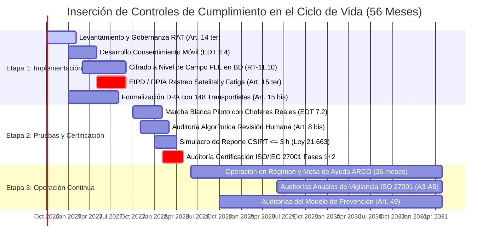

# Entregable 2: Privacidad y Seguridad desde el Diseño y por Defecto (Privacy by Design)
## Licitación TFEP-01/2026 · Caso 10: Transportes Curimón S.A. · Empresa Consultora audIT
**Tema de Investigación:** TI-12 · *Cumplimiento normativo en proyectos TIC: Ley 21.719, Ley 21.663 (ANCI) y marco internacional*  
**Autor:** Martín (Persona 5 · *Compliance Architecture Designer & Case Integrator*)  
**Fecha:** Septiembre de 2026  
**Estado:** Versión Definitiva 1.0 — Auditada con Trazabilidad al Caso 10 y al Informe 1

---

## 1. Principio Rector: Privacidad por Arquitectura (PbD)

En cumplimiento del **principio de seguridad (Art. 3° letra f) y el deber de medidas de seguridad del Art. 14 quinquies de la Ley N.º 21.719**, la plataforma no concibe la seguridad como una capa administrativa superficial posterior, sino como un principio de ingeniería integrado desde la fase de concepción de software (*Privacy by Design and by Default*). Conforme a Spiekermann & Cranor (2009), se aplica el enfoque de **privacidad por arquitectura**, minimizando la identificabilidad de los sujetos en reposo y en tránsito.

---

## 2. Inserción de Controles Normativos en el Ciclo de Vida del Proyecto (56 Meses)

El proyecto se estructura contractualmente en tres etapas sucesivas (Bases Administrativas `FEP01.26`, Art. 17 y Bases Técnicas `FEP03.10`, Art. 17):

---

## 3. Desglose de Instrumentos Clave de Privacidad desde el Diseño

### 3.1 Registro de Actividades de Tratamiento (RAT - Art. 14 ter Ley 21.719)
Curimón S.A. administra actualmente sus habilitaciones y registros en 4 planillas Excel inconexas con cerca de 6.000 vigencias documentales. El RAT centralizado en la plataforma OpenMetadata / GRC sustituye este descontrol manual mediante un inventario vivo de datos:
* **Finalidades lícitas declaradas:** (1) Asignación y despacho bloqueante de viajes, (2) Control de jornada según Art. 25 bis, (3) Liquidación y pre-facturación de fletes, y (4) Acreditación ante fiscalización del D.S. N.º 298 de sustancias peligrosas.
* **Plazos de Retención Trazables:** Matriz legal estricta conforme al Capítulo 15 del Caso:
  * Registros de jornada laboral: **5 años** (plazo de prescripción de la Dirección del Trabajo).
  * Documentos electrónicos de transporte y facturación: **6 años** (Código Tributario y SII).
  * Actas de siniestros graves e investigaciones: **10 años** (prescripción civil extracontractual).
  * Series de tiempo de telemetría y posición GPS: **2 años en línea** en almacenamiento caliente, con posterior agregación estadística o borrado seguro.

### 3.2 Evaluación de Impacto en Protección de Datos (EIPD / DPIA - Art. 15 ter)
Al operar una flota de **374 tractocamiones** que emite pings telemáticos cada 30 segundos a lo largo de 41 millones de kilómetros anuales, el sistema ejecuta un **monitoreo sistemático, intensivo y a gran escala de personas naturales**, activando la obligación legal de elaborar una EIPD previa al paso a producción.
* **Riesgos Evaluados:**
  1. *Seguimiento abusivo fuera de servicio:* Que un conductor externo sea rastreado mientras pernocta en su domicilio o realiza fletes para otras empresas.
  2. *Filtración de perfiles de conducción:* Que datos de frenado brusco o excesos de velocidad sean explotados para despidos injustificados o discriminación laboral sin debido proceso.
  3. *Bloqueo arbitrario del trabajo:* Que una falla técnica en la lectura de una vigencia impida rodar a un conductor que sí cumple la norma.
* **Medidas Mitigadoras Arquitectónicas:**
  * Modo de Privacidad en Firmware: La unidad embarcada apaga automáticamente el streaming satelital cuando el viaje está cerrado en el sistema (`estado = CERRADO`).
  * Enclavamiento cinético de pantalla (Ley N.º 21.377 "No Chat"): Pantalla bloqueada para cualquier interacción táctil con $v > 0\text{ km/h}$.
  * Revisión Humana Garantizada (Art. 8 bis).

### 3.3 Módulo de Consentimiento Móvil (Conductores Externos)
Para los 258 conductores externos subcontratados se implementa un componente en la aplicación móvil `audIT Mobile` (EDT 2.4):
* **Firma digital del consentimiento:** Antes de iniciar el primer servicio asignado, la app presenta un resumen ejecutivo en lenguaje claro indicando qué datos se capturan (GPS y odómetro), para qué (acreditar flete y sobreestadía) y quién tiene acceso.
* **Granularidad y Revocabilidad:** El chofer puede revocar el consentimiento en cualquier momento. La revocación genera un evento de dominio en Kafka que conmuta el despacho a modo contingencia (atestación en papel), sin borrar retroactivamente los datos del flete ya ejecutado pero cesando la captura en tiempo real.

### 3.4 Procedimiento de Revisión Humana ante Decisiones Automatizadas (Art. 8 bis)
El **Artículo 8 bis de la Ley N.º 21.719** consagra el derecho del titular a no ser objeto de decisiones basadas únicamente en valoraciones automatizadas que produzcan efectos jurídicos o le afecten significativamente:
* **Aplicación al Caso Curimón:** El motor de despacho evalúa 3 invariantes de negocio de forma bloqueante en menos de 2 segundos (RT-09.01). Si un conductor es bloqueado por supuesto agotamiento de jornada bajo el Art. 25 bis:
  1. El sistema no aplica un bloqueo opaco; emite un documento estructurado de rechazo indicando el valor medido (ej. "5h 15m conducidas") y la fuente instrumental.
  2. La app móvil y la consola de torre disponen del botón **"Solicitar Revisión Humana de Despacho"**, derivando el caso a un despachador nominado de la torre 24/7.
  3. El operador revisa la justificación documental y, mediante rol con credencial criptográfica de auditoría, puede autorizar una excepción justificada (conforme a la Decisión de Diseño 6 del Caso 10).
