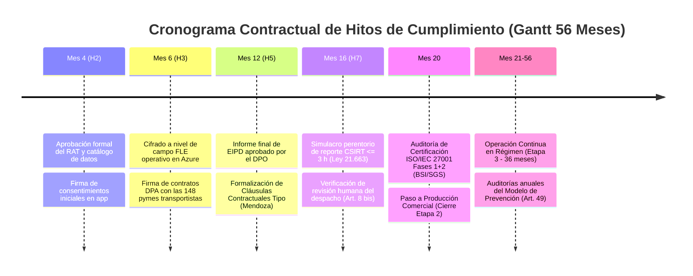

# Entregable 4: Vínculo Contractual con la Propuesta Técnico-Económica (Caso Curimón S.A.)
## Licitación TFEP-01/2026 · Caso 10: Transportes Curimón S.A. · Empresa Consultora audIT
**Tema de Investigación:** TI-12 · *Cumplimiento normativo en proyectos TIC: Ley 21.719, Ley 21.663 (ANCI) y marco internacional*  
**Autor:** Martín (Persona 5 · *Compliance Architecture Designer & Case Integrator*)  
**Fecha:** Septiembre de 2026  
**Estado:** Versión Definitiva 1.0 — Auditada con Trazabilidad al Caso 10 y al Informe 1

---

## 1. Justificación del Vínculo según la Ficha Oficial TI-12

La Ficha Oficial del tema **TI-12** (`Indicaciones Trabajo de Investigación 2026`, p. 16) define textualmente en su apartado de vínculo:
> *«Es el tema que más directamente convierte una exigencia legal en una partida presupuestaria: sin él, las propuestas subestiman los roles de cumplimiento, las auditorías y las capacidades de respuesta a incidentes»*.

En proyectos tradicionales de ingeniería de software, el cumplimiento legal suele omitirse o asumirse como una tarea burocrática sin costo. En la propuesta de **audIT para Transportes Curimón S.A.**, el cumplimiento de la **Ley N.º 21.719 (Datos Personales)** y de la **Ley N.º 21.663 (Ciberseguridad/ANCI)** se articula como una dimensión estructural del proyecto, traduciéndose directamente en paquetes de trabajo de la EDT, hitos en la Carta Gantt, roles valorizados en el Formulario E-26 y criterios formales de aceptación.

---

## 2. Trazabilidad con la Estructura de Desglose de Trabajo (EDT / WBS)

Cada mandato normativo se traduce en un entregable concreto de ingeniería dentro de los paquetes de trabajo de audIT para las Etapas 1 y 2:

| Código EDT | Paquete de Trabajo de Ingeniería | Mandato Legal / Requisito Caso 10 | Entregable de Cumplimiento Específico |
| :---: | :--- | :--- | :--- |
| **EDT 1.3** | **Gobierno de Seguridad y Datos Maestros** | Ley N.º 21.719, Art. 14 ter (RAT) y RT-05.09 (MDM) | Levantamiento del Registro de Actividades de Tratamiento (RAT) en OpenMetadata; inventario de datos de 454 choferes y 148 pymes. |
| **EDT 2.4** | **Diseño Ergonómico UI/UX y Consentimiento** | Ley N.º 21.719, Arts. 12-13 y Ley N.º 21.377 (No Chat) | Módulo digital de consentimiento granular en app móvil para los 258 choferes externos; enclavamiento cinético de pantalla en marcha ($v > 0\text{ km/h}$). |
| **EDT 3.4** | **Conectores de Ingesta Telemática Segura** | Bases Técnicas Transversales, RT-11.10 y RT-05.20 | Implementación del cifrado a nivel de campo (FLE AES-256-GCM) en PostgreSQL 16 con Azure Key Vault Premium; Capa Anticorrupción frente al ERP 2013. |
| **EDT 4.2** | **Homologación e Instalación Búfer a Bordo** | Bases del Caso 10, RT-03.10 y RT-08.11 | Unidad telemática con $\ge 8\text{ GB}$ flash industrial y persistencia local SQLite WAL; modo privacidad en firmware para deshabilitar streaming fuera de flete. |
| **EDT 4.5** | **Acopladores FMS J1939 en Flota Propia** | Bases del Caso 10, RT-17.06 y Restricción 6 | Lectura inductiva no intrusiva de odómetro y telemetría de motor en 61 tractocamiones propios sin cortar arnés ni vulnerar garantías de fábrica. |
| **EDT 7.2** | **Validación en Marcha Blanca y EIPD** | Ley N.º 21.719, Art. 15 ter (EIPD) y Art. 8 bis | Informe final de Evaluación de Impacto (EIPD); auditoría de revisión humana para despachos rechazados y simulacro de reporte CSIRT $\le 3\text{ h}$. |

---

## 3. Calendario de Hitos Contractuales (Carta Gantt a 56 Meses)

Los controles de cumplimiento actúan como compuertas de calidad (*Quality Gates*) sin las cuales el proyecto no puede avanzar de etapa:

---

## 4. Calce Biunívoco con los Perfiles Profesionales del Formulario E-26

En estricto cumplimiento de las Bases Administrativas (`FEP01.26`, Art. 13.5) y del modelo de costos de Persona 4, las actividades de cumplimiento se asignan a perfiles profesionales estandarizados:

1. **Encargado de Seguridad TI (CISO Fraccional):**
   * *Código E-26:* Línea 2479 (tarifa 1,5 a 2,5 UF/h; modelado a **2,00 UF/h**).
   * *Responsabilidad Contractual:* Liderazgo del Sistema de Gestión de Seguridad de la Información (SGSI), operación de la mesa de ciberseguridad 24/7 y ejecución material de la notificación perentoria al CSIRT Nacional en **menos de 3 horas** (Ley N.º 21.663, Art. 9 y D.S. N.º 295/2024).
2. **Delegado de Protección de Datos (DPO Fraccional):**
   * *Código E-26:* Línea 2467 (Proxy "Jefe de Proyecto", tarifa 1,5 a 3,0 UF/h; modelado a **2,00 UF/h**).
   * *Responsabilidad Contractual:* Supervisión autónoma del RAT, dictamen de la EIPD, resolución de solicitudes ARCO de conductores y clientes, e interlocución directa con la Agencia de Protección de Datos (Ley N.º 21.719, Art. 48).
3. **Analista QA y Cumplimiento:**
   * *Código E-26:* Línea 2484 (tarifa 0,8 a 1,0 UF/h; modelado a **1,00 UF/h**).
   * *Responsabilidad Contractual:* Auditoría continua de huellas criptográficas SHA-256 en WORM, control de consentimientos revocados y preparación de evidencia para auditorías anuales del Art. 49.
4. **Asesor Legal Externo Especializado en TIC:**
   * *Código E-26:* Línea 2488 (Perfil especializado no listado, tarifa 2,0 a 4,0 UF/h; modelado a **2,00 UF/h**).
   * *Responsabilidad Contractual:* Redacción y negociación de los 148 convenios DPA con transportistas y redacción de Cláusulas Contractuales Tipo para la réplica en Azure East US 2 y el cruce a Mendoza.

---

## 5. Vinculación con los Criterios de Aceptación del Caso Curimón S.A.

| Criterio de Aceptación Caso 10 | Exigencia en Bases Técnicas | Solución Técnica de Cumplimiento Aportada |
| :--- | :--- | :--- |
| **Criterio 4** | Registro inalterable de auditoría (*Audit Trail* forense que impida borrado por administradores). | Trigger en PostgreSQL con hash encadenado SHA-256 (`Hash Chain`) replicado en Azure Blob Storage WORM inmutable (RT-05.03 y RT-16.07), conforme a la norma ISO/IEC 27001 (A.8.15). |
| **Criterio 11** | Respaldar con evidencia inobjetable los cobros por tiempos de espera en clientes (hoy se objeta el 71% de \$340M). | Geocercas auditadas con reloj atómico GPS (NTP estrato 1), vinculadas a la firma digital de llegada del chofer, generando prueba oponible ante fiscalizaciones y litigios comerciales. |
| **Requisito RF-014** | Emisión del Documento Electrónico de Transporte (DET) en zonas sin señal de red celular. | Precarga de folios CAF autorizados por el SII y firma digital en cabina con certificado local en la unidad telemática antes del rodado del camión, sincronizando vía Capa Anticorrupción al recuperar cobertura. |
