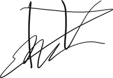
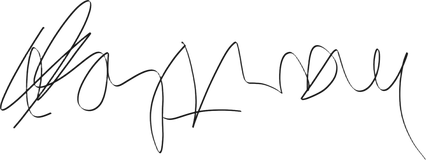
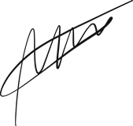

# Formulario A-6 · Anexo de Declaración de Uso de Inteligencia Artificial

## TI-12 · Cumplimiento normativo en proyectos TIC · audIT (Empresa N.º 10)

**Caso de aplicación:** Caso 10 — Transportes Curimón S.A. (Licitación TFEP-01/2026)
**Marco:** Indicaciones FEP00.3.26 §6.3, Bases Administrativas FEP01.26 Art. 13.5,
Comunicado 9.
**Custodio del formulario:** Matías V. (Persona 8)
**Fecha de consolidación:** 21 de septiembre de 2026

> [!CAUTION]
> **Un informe sin anexo de declaración no se recibe conforme y se evalúa como entrega
> incompleta** (§6.3). La declaración es **individual**: nadie declara por otro, aunque
> el informe sea grupal. El anexo debe llevar la firma de los ocho integrantes.

---

## 1. Qué exige el §6.3

| Requisito | Cumplimiento |
| :--- | :--- |
| Nivel declarado **por sección**, no un nivel global único | Tabla §3 |
| **Herramientas y versiones** utilizadas en cada caso | Columna «Herramienta y versión» |
| Para niveles 2 y 3: **prompts efectivamente empleados** | Columna «Evidencia» |
| Para niveles 2 y 3: **evidencia trazable** (conversaciones, historial de versiones, repositorio con sus commits) | Historial de `github.com/mvergaral/audIT`, rama `main` |
| **Declaración de cada integrante** | Tabla §2, ocho firmas |

> **Sobre la versión de la herramienta.** «IA», «Asistente IA» o «Claude / Gemini» **no
> cumplen**. Se exige la versión: `Claude 3.5 Sonnet`, `Gemini 3.8 Flash`, `GPT-5.1`.
> Si se usaron dos modelos en una misma sección, se listan ambos, no se ofrecen como
> alternativa.

---

## 2. Declaración individual de los ocho integrantes

| # | Integrante | Rol en el informe | Nivel | Declaración | Firma |
| :-: | :--- | :--- | :---: | :---: | :---: |
| 1 | **Ignacio Cuevas** | Liderazgo editorial, introducción, aporte propio y conclusiones | 0 + 1 | ✅ |  |
| 2 | **Alonso** | Marco legal chileno | 0/1/2 | 🟡 | *transcrita de su manual; falta herramienta y firma* |
| 3 | **Ignacio Vergara** | Marco internacional, normas técnicas y herramientas GRC | 0/1/2/3 | ✅ |  |
| 4 | **Carlos Abarza** | Matriz de obligaciones, TCO y sensibilidad | 0 + 1 | ✅ |  |
| 5 | **Martín Cevallos** | Arquitectura de cumplimiento y vínculo con el Caso 10 | 3 | ✅ |  |
| 6 | **Marcel** | Cuestionario de 30 preguntas e índice temático | 0 + 1 | ✅ |  |
| 7 | **Naomi** | Presentación ejecutiva y defensa oral | n/a | — | *no aporta secciones al informe (ver §2.1)* |
| 8 | **Matías Vergara** | Auditoría de calidad, verificación de vigencia y custodia del A-6 | 0/2/3 | ✅ |  |

### 2.1 Situaciones particulares

| Integrante | Situación |
| :--- | :--- |
| **Ignacio Vergara (P3)** | Declaración entregada y firmada el 21-09-2026. **Queda un único campo abierto:** la herramienta y versión de los niveles 1 y 2 en el §4 de su declaración, que solo él puede consignar |
| **Naomi (P7)** | **No aporta secciones al informe.** Su entregable es la presentación ejecutiva, que se despacha por separado y no forma parte del cuerpo del informe ni de sus anexos. El Formulario A-6 declara el uso por sección del informe, de modo que no le corresponde fila en la matriz del §3 |

> [!CAUTION]
> **Las firmas solo se estampan sobre una declaración existente.** El §6.3 es explícito:
> «*Cada uno declara su propio uso: nadie declara por otro*». Las cuatro firmas pendientes
> están digitalizadas y disponibles en `firmas/`, y se incorporan **en cuanto su titular
> entregue su declaración**, no antes. Estampar la firma de alguien sobre un formulario que
> no ha completado equivale a declarar por él.

**Estado al 21-09-2026:** 5 declaraciones firmadas (P1, P4, P5, P6 y P8), 2 levantadas a la espera de la revisión y firma de su titular (P2 y P3) y 1 sin secciones en el informe (P7). Las 8 firmas están digitalizadas en `firmas/`.

---

## 3. Matriz de niveles por sección del informe

> Una fila por sección del informe ensamblado. Se completa con el nivel que **cada autor
> declara para su propia sección**; el custodio no asigna niveles.

| Sección del informe | Autor | Nivel declarado | Herramienta y versión | Alcance del uso | Evidencia |
| :--- | :---: | :---: | :--- | :--- | :--- |
| Resumen ejecutivo | P1 | | | | |
| Introducción y **párrafo de aporte propio** | P1 | **0 obligatorio** | — | §6.1 prohíbe IA | |
| Marco legal chileno | P2 | | | | `Persona-2/Prompts.txt` |
| Marco internacional y normas técnicas | P3 | | | | |
| **Comparación y justificación de criterios** (GRC, ISO) | P2-P3 | **0 obligatorio** | — | §6.1 prohíbe IA | |
| Matriz de obligaciones e impacto económico | P4 | | | | `Bitacora_IA_A6_Persona_4.md` |
| **Producción de cifras del modelo económico** | P4 | **0 obligatorio** | — | §6.1 prohíbe IA | |
| Arquitectura y aplicación al Caso 10 | P5 | 3 | Antigravity IDE — `Gemini 3.8 Flash` / `Claude 3.5 Sonnet` | Generación sustancial de texto técnico y diagramas Mermaid | `Bitacora_IA_A6_Persona_5.md`, 13 interacciones |
| **Conclusiones y recomendaciones** | P1 | **0 obligatorio** | — | §6.1 prohíbe IA | |
| **Cuestionario: enunciados, respuestas y justificaciones** | P6 | **0 obligatorio** | — | §6.1 prohíbe IA | |
| Maquetación del cuestionario (Markdown, LaTeX) | P6 | 1 | | Formato y tabulación, sin alterar texto | `Bitacora_A6_Persona_6…md`, 8 registros |
| Presentación ejecutiva | P7 | | | | |
| **Libreto de defensa y matriz de preguntas difíciles** | P7 | **0 obligatorio** | — | El grupo debe reconstruir el razonamiento oralmente | |
| Verificación de vigencia y auditoría de calidad | P8 | **0** | — | Verificación manual en fuente oficial | `Verificacion_Vigencia_Normativa.md` |
| Anexo de declaración (este documento) | P8 | **0** | — | | |

---

## 4. Las cinco fronteras del §6.1

> Donde **no se admite** el uso de IA. El grupo debe poder reconstruir el razonamiento
> oralmente, sin apoyo del texto.

| # | Sección prohibida | Responsable | Verificado |
| :-: | :--- | :--- | :---: |
| 1 | El análisis comparativo y **la justificación de los criterios utilizados** | P2, P3 | ☐ |
| 2 | Las conclusiones y recomendaciones | P1 | ☐ |
| 3 | El párrafo de aporte propio y la discusión crítica de la evidencia | P1 | ☐ |
| 4 | La redacción de las preguntas del cuestionario y de sus justificaciones | P6 | ☐ |
| 5 | **La producción de cifras, citas o referencias**: se obtienen de la fuente, no del modelo | P4, P8 | ☐ |

> [!WARNING]
> **Punto de atención del custodio.** La declaración de Persona 5 parafrasea la frontera
> 5 como «producción de cifras **arancelarias directas**». El texto oficial dice «**La
> producción de cifras, citas o referencias**», sin ese calificativo. Con la redacción
> original, parte del `Entregable_3` (comparación de jurisdicciones cloud y justificación
> de la región elegida) roza también la frontera 1. **Persona 5 debe reformular la
> justificación de su Nivel 3 apoyándose en el control humano que ya documentó** —elección
> de Azure frente a AWS, descarte del HSM físico de San Bernardo, frontera Responsable /
> Encargado del Art. 15 bis— en lugar de en una paráfrasis del §6.1. El nivel declarado
> es correcto y transparente; lo que debe corregirse es el fundamento citado.

---

## 5. Lo que falta para cerrar este anexo

| Pendiente | Responsable | Estado |
| :--- | :--- | :---: |
| Declaración individual de **Ignacio C. (P1)** | P1 | ☐ |
| Declaración individual de **Ignacio V. (P3)** | P3 | ☐ |
| Declaración individual de **Naomi (P7)** | P7 | ☐ |
| Declaración individual de **Matías V. (P8)** | P8 | ☐ |
| **Alonso (P2):** trasladar al formato A-6 lo que hoy está en `Manual_Operativo_Persona_2.md` y `Prompts.txt` | P2 | ☐ |
| **Carlos (P4) y Marcel (P6):** sustituir «Asistente IA (Motor Claude / Gemini 3.8)» por la versión exacta, en los 17 registros | P4, P6 | ☐ |
| **Martín (P5):** reformular el fundamento del Nivel 3 (§4 de este documento) | P5 | ☐ |
| Ocho firmas | Todos | ☐ |

---

## 6. Plantilla de declaración individual

> Para quien aún no la ha entregado. Se devuelve completada al custodio.

```
DECLARACIÓN INDIVIDUAL DE USO DE INTELIGENCIA ARTIFICIAL — FORMULARIO A-6

Integrante:
Rol en el informe:
Fecha:

1. NIVEL DECLARADO POR SECCIÓN
   (una línea por sección propia; 0 = sin uso, 1 = corrección y estilo,
    2 = ideación y estructura, 3 = generación sustancial)

   Sección .................................. Nivel ...
   Sección .................................. Nivel ...

2. HERRAMIENTAS Y VERSIONES
   (nombre y versión exacta; «IA» no cumple)

3. ALCANCE DEL USO
   (qué hizo la herramienta y qué hice yo)

4. EVIDENCIA — solo si algún nivel es 2 o 3
   - Prompts empleados:
   - Enlace o exportación de las conversaciones:
   - Historial de versiones o commits:

5. DECLARACIÓN
   Declaro que el contenido de mis secciones fue producido, verificado y asumido como
   propio, que toda cifra y referencia fue obtenida de su fuente original y no del
   modelo, y que puedo reconstruir oralmente el razonamiento de cada una de ellas.

   Firma: ______________________
```

---

*El §6.4 es explícito: declarar correctamente el uso de IA no baja la nota. Lo que se
evalúa es la calidad y la autoría del análisis, no la abstinencia tecnológica. Declarar
un nivel inferior al real, en cambio, se evalúa como falta a la probidad académica y sus
consecuencias alcanzan a todo el grupo.*
