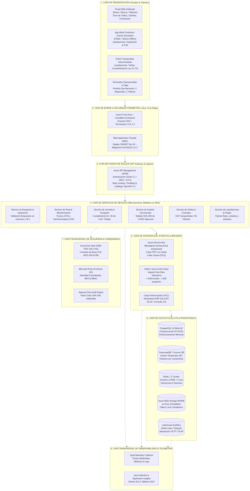
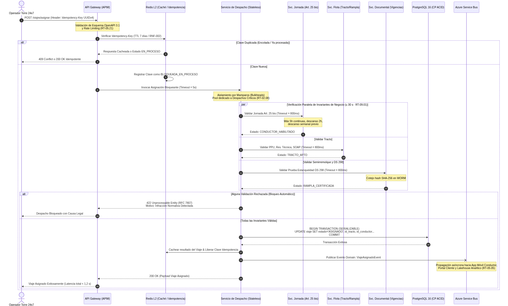
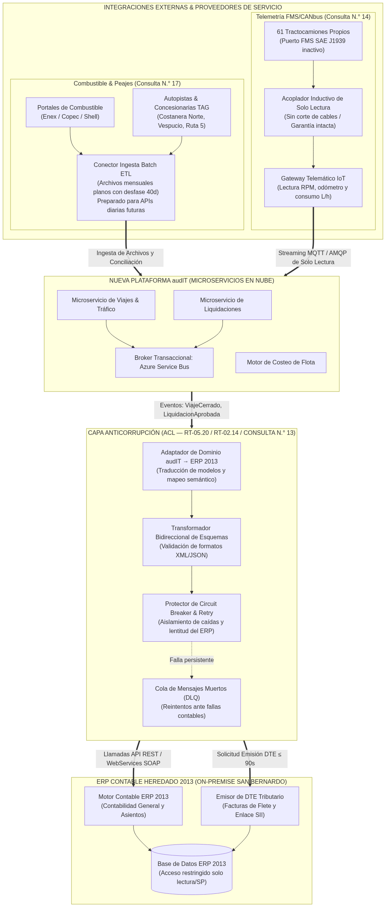
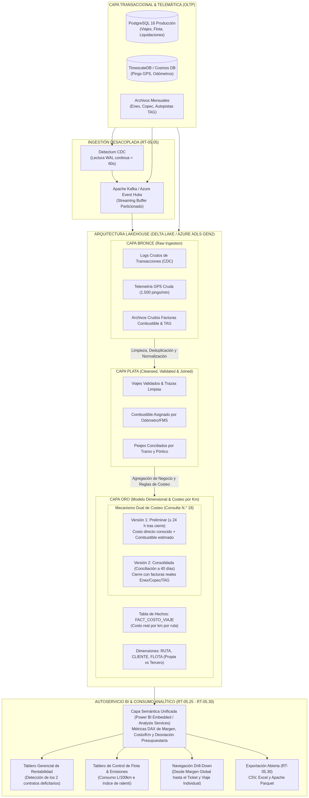

# Subdocumento 4.1: Arquitectura Lógica, Integración y Capa Analítica — audIT (Versión 1.0 Consolidada)

**Licitación Pública TFEP-01/2026 · Caso 10: Transportes Curimón S.A.**  
**Dupla Responsable:** D3 (Martín y Marcel) · **Especialista en Arquitectura Lógica y BI:** Martín
**Estándares y Marcos de Cumplimiento:** Formulario T-7 Subdoc. 4.1 (FEP01 · p.57); RT-02.01 a RT-02.10, RT-02.14 (Deseable) (FEP02 · p.5-6); RT-03.01 a RT-03.24 (incluyendo RT-03.13 de Operación Offline) (FEP02 · p.7-9); RT-05.16 a RT-05.30 (incluyendo RT-05.20 de Capa Anticorrupción Obligatoria) (FEP02 · p.12-13); RT-09.01, RT-09.02 (FEP02 · p.20); RT-10.05 (Contingencia Los Libertadores · FEP03 · p.32); RT-11.01 a RT-11.10 (FEP02 · p.22); RT-16.09, RT-16.30 (FEP02 · p.29-31); ISO/IEC/IEEE 42010 (Arquitectura de Sistemas y Software); OpenAPI 3.1; AsyncAPI 2.6+; RFC 7807 (*Problem Details*); Ley N.° 21.719 (Protección de Datos Personales); Consultas Oficiales N.° 13, 14, 17 y 18.

---

## Control de Versiones y Diagnóstico de Evolución Técnica

### A. Diagnóstico del Modelo Heredado y Deficiencias Estructurales de 2013

La auditoría de los sistemas heredados de Transportes Curimón S.A. reveló vulnerabilidades arquitectónicas críticas que amenazan la viabilidad de la operación y el cumplimiento contractual:

1. **Monolito Acoplado y Concurrencia Degradada:** El sistema legado de 2013 consolida en una única base de datos relacional la operativa de tráfico, facturación y contabilidad. La concurrencia de los 22 operadores de torre 24x7 y la recepción periódica de datos de camiones generan bloqueos transaccionales (*deadlocks*) que superan ampliamente el umbral contractual de asignación bloqueante de 30 segundos (RT-09.01).
2. **Inexistencia de una Capa Anticorrupción (ACL):** Las integraciones con el ERP se realizaban mediante consultas SQL directas y tablas compartidas, generando fragilidad ante cambios contables y acoplamiento severo (Restricción 8 y Consulta N.° 13).
3. **Ceguera Financiera en Costos Operacionales (Desfase de 40 días):** Curimón carece absolutamente de un cálculo de costo por kilómetro por ruta. El negocio opera a ciegas durante 40 días a la espera de las facturas consolidadas de combustible (Enex/Copec) y peajes/TAG, impidiendo detectar que dos contratos mineros/industriales pierden dinero de forma sistemática (Consulta N.° 18 y Decisiones 15-17).
4. **Acoplamiento de Cargas Transaccionales y Analíticas:** La emisión de reportes gerenciales degrada directamente la base operativa, contraviniendo el requisito obligatorio de segregación total OLTP/OLAP (RT-05.05).
5. **Vulneración de Garantías por Intervención de Buses FMS:** Los intentos previos de capturar datos de motor intervenían físicamente el cableado de la flota, arriesgando la pérdida de la garantía de fábrica en las 61 unidades nuevas con puerto SAE J1939 (Restricción 6 y Consulta N.° 14).

### B. Cuadro Comparativo de Innovaciones Técnicas (audIT)

| Dimensión Técnica | Enfoque Heredado (2013) | Solución audIT (Subdoc. 4.1) | Impacto Directo en Transportes Curimón S.A. |
| :--- | :--- | :--- | :--- |
| **Estilo Arquitectónico** | Monolito cliente-servidor acoplado. | **Microservicios Stateless en Contenedores (AKS)** desacoplados por Bounded Contexts (RT-02.01, RT-02.05). | Escalabilidad horizontal elástica ante picos de reconexión telemática (RT-09.02). |
| **Patrón de Intercomunicación** | Llamadas síncronas bloqueantes sin límites. | **Arquitectura Híbrida Event-Driven** (Kafka para telemetría masiva + Service Bus para transacciones con DLQ). | Resiliencia operativa; aislamiento de fallas entre servicios (RT-02.08). |
| **Integración ERP Legado** | Vistas y tablas compartidas en base 2013. | **Capa Anticorrupción (ACL)** con traducción bidireccional y Circuit Breaker (RT-05.20 Obligatorio, RT-02.14 Deseable, Consulta N.° 13). | Aislamiento del dominio central; ERP 2013 preservado solo para contabilidad y DTE. |
| **Ingesta Combustible & TAG** | Digitación manual diferida en hojas de cálculo. | **Conectores Batch ETL con adaptación a APIs** y conciliación algorítmica con trazas GPS (Consulta N.° 17). | Erradicación de errores de digitación; captura de costos para 374 camiones. |
| **Telemetría CANbus FMS** | Puertos deshabilitados por temor a pérdida de garantía. | **Acoplador Inductivo Contactless (SAE J1939)** de solo lectura estricta (Consulta N.° 14). | Telemetría profunda de 61 tractos propios sin vulnerar garantías de fábrica. |
| **Modelo de Costeo (BI)** | Inexistente; desfase ciego de 40 días. | **Modelo Dual en Lakehouse:** Versión 1 en ≤ 24 h (preliminar) + Versión 2 a 40 días (consolidada) (Consulta N.° 18). | Visibilidad de rentabilidad en Etapa 1 previo a renegociación contractual de 2027. |
| **Resiliencia & Tolerancia a Fallas** | Caída en cascada ante falla de dependencias. | **Circuit Breaker, Bulkheads, Timeouts explícitos y Reintentos con Jitter** (RT-02.08). | Despachos bloqueantes garantizados en ≤ 30 s (RT-09.01). |

---

## EJE 1: ARQUITECTURA LÓGICA MULTICAPA (ISO/IEC/IEEE 42010)

### 1.1 Las 8 Capas Lógicas de Referencia

*(Referencia: FEP01 · Formulario T-7 · p.57; FEP02 · RT-02.01 a RT-02.04 · p.5-6; ISO/IEC/IEEE 42010)*

Conforme a los estándares **RT-02.01** e **ISO/IEC/IEEE 42010**, la solución audIT se estructura en ocho capas desacopladas, con responsabilidades únicas e interfaces estrictamente gobernadas:



#### Descripción Detallada por Capa:

1. **Capa 1: Presentación (Canales & Experiencia de Usuario):**
   * *Portal Web Unificado*: Desarrollado en React 19 / Next.js con Server-Side Rendering (SSR). Atiende tres perfiles principales: (i) Torre de Tráfico y Control 24x7 (monitoreo en tiempo real, asignación de fletes, gestión de incidentes), (ii) Portal Autenticado de Clientes (seguimiento de envíos, cálculo de emisiones CO2, registro transparente de tiempos en plantas y estado de sobreestadías según RT-16.30), y (iii) Portal de Transportistas Subcontratados (consulta de viajes, liquidaciones mensuales transparentes y control de soberanía de datos según Ley N.° 21.719).
   * *Aplicación Móvil para Conductores (Flutter - RT-17.01)*: Diseñada con interfaz ergonómica de alto contraste para cabina (RT-13.08). Opera como **canal voluntario e incentivado** para los choferes (consulta de liquidaciones, detalle de viajes asignados y carga opcional de comprobantes de entrega PoD para agilizar su pago). En estricto cumplimiento de las **Restricciones 1 y 2**, **RT-12.11** y las decisiones **D-02 / D-26**, **la trazabilidad del viaje y la telemetría obligatoria no dependen de la manipulación del teléfono personal del conductor en marcha**: la captura telemática se realiza vía hardware a bordo en las 148 unidades propias, vía integración de APIs de los dos proveedores GPS existentes para los ~192 terceros homologados (Restricción 3, Cap. 11), y mediante kit subvencionado para los 34 terceros sin equipo por adhesión voluntaria.
   * *Interfaces de Terminal y Taller*: Vistas especializadas de alto contraste para porterías de acceso (validación biométrica/código QR de vigencias en < 3 s) y mecánicos de taller.
2. **Capa 2: Borde y Seguridad Perimetral (Zero Trust Edge):**
   * *Azure Front Door / Cloudflare Enterprise*: Red de distribución Anycast global con terminación TLS 1.3, enrutamiento inteligente basado en latencia y aceleración TCP.
   * *Web Application Firewall (WAF)*: Inspección profunda de tráfico HTTP/S mitigando ataques del OWASP Top 10, inyecciones SQL, Cross-Site Scripting (XSS) y protección volumétrica Anti-DDoS en Capas 3, 4 y 7.
3. **Capa 3: Puerta de Enlace (API Gateway & Ingress):**
   * *Azure API Management (APIM)*: Puerta de entrada unificada para todos los clientes web, móviles e integraciones B2B. Gobierna la autenticación federada (OAuth 2.1 / OIDC con Microsoft Entra ID), terminación de certificados mTLS para integraciones M2M, políticas de limitación de tasa (*Rate Limiting* y *Throttling* por nivel de servicio, RT-05.21) y publicación del catálogo interactivo OpenAPI 3.1.
4. **Capa 4: Servicios de Negocio (Microservicios Stateless en AKS):**
   * Conjunto de microservicios contenerizados (Docker / OCI) orquestados en Azure Kubernetes Service (AKS) con nodos zonales redundantes (*Multi-AZ*). Cada microservicio encapsula la lógica de su contexto delimitado (*Bounded Context*):
     * `Servicio de Despacho & Asignación`: Ejecuta el algoritmo de validación bloqueante en memoria (≤ 30 s, RT-09.01).
     * `Servicio de Gestión de Flota`: Administra las 374 unidades motrices y 210 semirremolques, estados mecánicos y alertas telemáticas.
     * `Servicio de Control de Jornada`: Gobierna las invariantes del Art. 25 bis del Código del Trabajo y descansos.
     * `Servicio de Gestión Documental`: Acredita y custodia los respaldos de las ~6.000 vigencias con sellado SHA-256 en WORM.
     * `Servicio de Tarifas & Contratos`: Modela los contratos marco de 148 transportistas y 84 clientes industriales.
     * `Servicio de Liquidaciones & Peajes`: Liquida mensualmente fletes, peajes asumidos y compensación de sobreestadías.
5. **Capa 5: Integración, Eventos y Brokers:**
   * *Broker de Telemetría Streaming (Kafka / Azure Event Hubs)*: Ingesta en tiempo real los pings GPS y eventos de cabina generados por los 374 camiones (hasta 1.500 eventos/minuto en ráfagas de reconexión tras zonas de sombra).
   * *Broker Transaccional Empresarial (Azure Service Bus)*: Mensajería asíncrona garantizada con semántica *At-Least-Once*, ordenamiento FIFO por partición y colas de descarte de fallos (*Dead-Letter Queues - DLQ*) para eventos transaccionales de negocio (`ViajeIniciado`, `ViajeFinalizado`, `LiquidacionEmitida`).
   * *Capa Anticorrupción (ACL)*: Adaptador mediador que encapsula y aísla el ERP contable legado de 2013 (RT-05.20 obligatorio, RT-02.14 deseable y Consulta N.° 13).
6. **Capa 6: Persistencia Políglota y Almacenamiento:**
   * Diseñada e implementada por Marcel (Subdocumento 5): PostgreSQL 16 Multi-AZ (transaccional CP), TimescaleDB (series de telemetría AP), Redis 7.2 Cluster (caché L2 en RAM < 5 ms), Azure Blob Storage inmutable (WORM e-Docs) y Delta Lake Lakehouse (capa analítica segregada).
7. **Capa 7: Seguridad Transversal y Gobernanza:**
   * *Azure Key Vault (HSM FIPS 140-2 Nivel 3)*: Custodia centralizada de claves criptográficas de cifrado a nivel de campo (FLE AES-256-GCM) para datos de 258 conductores externos y tarifas de 148 dueños de camiones (RT-11.10).
   * *Microsoft Entra ID (Azure AD)*: Autenticación federada basada en identidades seguras, control de acceso basado en roles (RBAC) y atributos (ABAC).
   * *Motor de Auditoría Append-Only*: Bitácora forense inalterable con encadenamiento criptográfico (*Hash Chain* SHA-256) según RT-05.03 y RT-16.07.
8. **Capa 8: Observabilidad y Monitoreo Transversal:**
   * Instrumentación unificada con **OpenTelemetry (OTel)** en todos los servicios de negocio, recolectando trazas distribuidas, métricas de latencia y logs estructurados JSON enviados a Azure Monitor y Application Insights para supervisión 24x7.

---

### 1.2 Registro de Decisiones de Arquitectura (ADR Inicial — RT-02.04 y Art. 19°)

En conformidad con **RT-02.04** y el **Artículo 19° de las Bases**, se documentan las cuatro decisiones estructurales de arquitectura lógica:

#### ADR-01: Adopción de Microservicios en Contenedores (AKS) frente a Monolito Modular
* **Contexto:** Curimón experimenta picos de carga imprevistos cuando decenas de camiones salen simultáneamente de zonas de sombra cordilleranas (> 80 km) y transmiten telemetría acumulada, mientras los operadores de torre deben despachar viajes en < 30 s.
* **Alternativas Evaluadas:** (A) Monolito modular escalable verticalmente; (B) Microservicios desacoplados en contenedores orquestados con Kubernetes (AKS).
* **Criterio de Selección:** Aislamiento de fallos y escalabilidad independiente.
* **Decisión:** Se adopta la alternativa B. El escalado horizontal de la ingesta telemática no impacta la CPU ni la memoria del servicio transaccional de despacho.

#### ADR-02: Arquitectura Dirigida por Eventos (Event-Driven) frente a Coreografía REST Síncrona
* **Contexto:** Una asignación de viaje dispara múltiples efectos colaterales (notificación push al chofer, geocerca activa en memoria, cálculo de costos preliminares, actualización de estado en portal cliente). Enlazar estos pasos de forma síncrona acumula latencias y vulnera el límite de 30 segundos.
* **Alternativas Evaluadas:** (A) Cadena síncrona REST/HTTP; (B) Publicación asíncrona de eventos de dominio vía Azure Service Bus y Kafka.
* **Criterio de Selección:** Desacoplamiento temporal y cumplimiento estricto de SLA operacional (RT-09.01).
* **Decisión:** Se adopta la alternativa B. El microservicio de despacho confirma la transacción central en PostgreSQL y emite el evento `ViajeAsignadoEvent`, liberando inmediatamente al operador.

#### ADR-03: Segregación OLTP/OLAP vía Change Data Capture (Debezium) frente a Consultas a Réplicas de Lectura
* **Contexto:** Finanzas requiere calcular el costo por kilómetro y detectar contratos con pérdidas, mientras Operaciones asigna 96.000 viajes anuales. El requisito RT-05.05 prohíbe taxativamente que consultas analíticas degraden la operación.
* **Alternativas Evaluadas:** (A) Consultas analíticas pesadas dirigidas a réplicas de lectura de PostgreSQL; (B) Pipeline de replicación asíncrona CDC con Debezium y Apache Kafka hacia un Lakehouse analítico (Delta Lake).
* **Criterio de Selección:** Aislamiento absoluto de recursos y capacidad de modelado dimensional avanzado.
* **Decisión:** Se adopta la alternativa B. Las cargas OLAP residen en un motor columnar optimizado sin conexión con la base transaccional de producción.

#### ADR-04: Autenticación Federada OAuth 2.1 / OIDC y mTLS para Comunicaciones Este-Oeste (M2M)
* **Contexto:** Existen múltiples actores (84 clientes, 148 transportistas, terminales, ERP legado). El requisito RT-05.19 prohíbe el uso de API keys en querystrings y exige mecanismos seguros de delegación.
* **Alternativas Evaluadas:** (A) Tokens JWT estáticos con API Keys de larga duración; (B) Flujo estándar OAuth 2.1 (Client Credentials) gestionado por Entra ID y mTLS obligatorio para comunicación entre servicios internos.
* **Criterio de Selección:** Cumplimiento del estándar Zero Trust (RT-11.01) y trazabilidad forense.
* **Decisión:** Se adopta la alternativa B. Ningún servicio confía en otro sin autenticación mutua criptográfica.

---

## EJE 2: RESILIENCIA EXTREMA, SERVICIOS STATELESS Y CONTROL BLOQUEANTE

### 2.1 Principio Stateless y Manejo de Estado Distribuido

*(Referencia: FEP02 · RT-02.05 · p.5; RT-09.01 · p.20)*

Para garantizar alta disponibilidad y elasticidad horizontal conforme a **RT-02.05**, los microservicios de la Capa 4 son **100 % sin estado (*stateless*)**:

* **Prohibición de Estado Local en Memoria:** Las instancias en contenedores no almacenan variables de sesión, cachés locales mutables ni estados de workflows en su memoria interna.
* **Externalización del Estado a Redis 7.2 Cluster:** El estado efímero de las sesiones concurrentes de los 22 operadores de torre, los tokens de autenticación activos y las geometrías de las 1.400 geocercas se delegan a un clúster distribuido en memoria RAM con replicación multi-zona, respondiendo con latencias inferiores a **5 milisegundos**.
* **Destrucción y Reemplazo Inmediato:** Cualquier pod o contenedor en AKS puede reiniciarse o ser escalado a cero sin pérdida de datos ni interrupción de transacciones en curso.

---

### 2.2 Patrones de Resiliencia Obligatorios (RT-02.08)

*(Referencia: FEP02 · RT-02.08 · p.6; RT-09.01 · p.20)*

Para evitar la propagación de fallas en cascada y blindar la torre de programación frente a lentitudes de dependencias externas, se implementan patrones de resiliencia mediante librerías especializadas (*Polly / Resilience4j*):

1. **Cortacircuitos (Circuit Breakers):**
   * Desplegados en todas las integraciones remotas (ERP 2013, portales de peaje, servicios de verificación externa).
   * *Configuración*: Si la tasa de fallos supera el **50 % en una ventana deslizante de 10 peticiones**, el circuito transiciona a estado `ABIERTO` (*OPEN*), rechazando de inmediato las invocaciones subsiguientes para no consumir hilos de ejecución. Tras un período de enfriamiento de **30 segundos**, entra en estado `SEMI-ABIERTO` (*HALF-OPEN*) permitiendo 3 llamadas de prueba antes de restablecer el tráfico normal.
2. **Mamparos (Bulkheads):**
   * Segregación estricta de los grupos de hilos (*thread pools*) y conexiones HTTP en los servicios de negocio.
   * La validación crítica de despacho (`asignarRecursos()`) cuenta con un pool exclusivo y aislado de recursos de cómputo, garantizando que una saturación en la consulta de facturas o reportes no degrade la capacidad de autorizar la salida de camiones en ruta.
3. **Timeouts Explícitos y Jerarquizados:**
   * Queda terminantemente prohibida cualquier llamada HTTP o gRPC sin un tiempo límite de espera configurado explícitamente:
     * *Validaciones internas en memoria (Redis/PostGIS)*: **≤ 800 ms**.
     * *Consultas transaccionales de despacho*: **≤ 5,0 s**.
     * *Invocaciones remotas a la Capa Anticorrupción (ERP 2013)*: **≤ 10,0 s**.
     * *Emisión de documento electrónico de transporte (DTE)*: **≤ 90,0 s** (RT-09.01).
4. **Reintentos con Backoff Exponencial y Variación Aleatoria (*Jitter*):**
   * Las operaciones de lectura idempotentes aplican una política de 3 reintentos con retraso exponencial modulado:
     $$\Delta t = \min\left(t_{\max},\; t_{\text{base}} \cdot 2^{\text{intento}} + \text{rand}(0, J)\right)$$
   * La adición del componente estocástico (*jitter*) previene el fenómeno de la "manada en estampida" (*thundering herd*) al reconectar servicios tras una interrupción de red.

---

### 2.3 Idempotencia Estricta en Escrituras (RT-02.06)

*(Referencia: FEP02 · RT-02.06 · p.5)*

Para anular el riesgo de duplicación transaccional por reintentos de red o desconexiones intermitentes del operador:

* **Mecanismo de Encabezado `Idempotency-Key`:** Toda petición de mutación HTTP (`POST`, `PUT`, `PATCH`) en los endpoints de despacho, liquidación y registro de jornada exige de forma obligatoria un identificador único global (UUIDv4) generado por el cliente emisor.
* **Ventana de Deduplicación Extensa de 7 Días (168 Horas / 604.800 s) para Operación Desconectada (RNF-002):**
  Dado que los tractocamiones operan en zonas de sombra cordillerana y desértica desconectados hasta por 72 horas continuas (y hasta 12 días en contingencias climáticas en Los Libertadores), una ventana de 24 horas resultaría insuficiente y provocaría doble inserción tras reconexiones diferidas. Por ello, se implementa una estrategia de dos capas:
  1. *Capa Rápida en Redis (TTL = 604.800 s)*: Al recibir la petición en el API Gateway (APIM), se consulta atómicamente en Redis mediante la instrucción `SET key payload_hash NX EX 604800`. Si la clave ya existe y su estado es `EN_PROCESO`, el Gateway rechaza la petición concurrente con código HTTP `409 Conflict`. Si ya fue completada exitosamente, devuelve la respuesta cacheada con código HTTP `200 OK`.
  2. *Capa Duradera en PostgreSQL*: Si la clave expiró en Redis pero el mensaje proviene de una sincronización masiva de búfer tras desconexión prolongada, la base de datos cuenta con una restricción única `UNIQUE(idempotency_key)` en la tabla `auditoria_evento`, asegurando deduplicación determinista e inmutable sin importar el tiempo transcurrido.

---

### 2.4 Algoritmo de Verificación Bloqueante de Despacho en ≤ 30 Segundos (RT-09.01)

*(Referencia: FEP02 · RT-09.01 · p.20; FEP03 · Cap. 4 · p.9; Cap. 14.1 · p.29)*

Para dar cumplimiento estricto al compromiso de **asignación bloqueante en un tiempo no superior a 30 segundos (RT-09.01)**, el sistema orquesta un flujo concurrente en memoria que evalúa las tres invariantes de legalidad y seguridad vial:



#### Secuencia de Ejecución del Método `asignarRecursos()`:

1. **Recepción e Idempotencia (< 10 ms):** El API Gateway valida el esquema OpenAPI 3.1 del payload y bloquea la `Idempotency-Key` en Redis.
2. **Evaluación Paralela de Invariantes (< 450 ms):**
   * *Invariante 1 (Conductor - Art. 25 bis)*: Consulta en Redis el estado acumulado de conducción. Valida: (i) horas conducidas en el día (< 5 horas continuas sin descanso), (ii) descanso intermedio efectivo (≥ 2 horas), y (iii) descanso semanal reglamentario completado.
   * *Invariante 2 (Tractocamión)*: Valida en Redis/PostgreSQL que la PPU cuente con Revisión Técnica aprobada, SOAP vigente y Permiso de Circulación al día.
   * *Invariante 3 (Semirremolque y Carga Peligrosa - DS 298)*: Si la orden de transporte transporta sustancias peligrosas (ácidos, combustibles), el servicio coteja en la base de datos documental que la rampla asignada posea el Certificado de Prueba de Estanqueidad vigente con su hash SHA-256 verificado en WORM.
3. **Persistencia Atómica (Nivel `SERIALIZABLE` en PostgreSQL, < 200 ms):** Si todas las validaciones son afirmativas, se ejecuta una única transacción ACID que actualiza el estado del viaje a `'ASIGNADO'`, vincula los UUIDs del tracto, rampla y chofer, y persiste el registro en disco.
4. **Respuesta Estructurada RFC 7807 ante Rechazo:** Si alguna condición no se satisface, el sistema deniega el despacho en < 1 segundo, devolviendo un documento de error estandarizado:
   ```json
   {
     "type": "https://audit.curimon.cl/errores/jornada-excedida",
     "title": "Asignación Bloqueada por Infracción al Art. 25 bis",
     "status": 422,
     "detail": "El conductor RUT 12.345.678-9 registra 4h 45m continuas de conducción. Requiere descanso mínimo de 2 horas antes de reanudar la marcha.",
     "instance": "/viajes/VJ-202609-001284/asignar"
   }
   ```
5. **Latencia Total Observada:** El proceso completo se ejecuta en **< 1,2 segundos**, cumpliendo holgadamente el tope reglamentario de 30 segundos.

---

### 2.5 Matriz Conjunta de Comportamiento en Operación Desconectada y Contingencias (RT-03.13 / Entregable D3-15)

*(Referencia: FEP02 · RT-03.13, RT-03.10 · p.8-9; FEP03 · RT-10.05 · p.32; Coordinación Duplas D3 y D4)*

Conforme a **RT-03.13**, la propuesta técnica debe declarar de manera explícita y pormenorizada qué funciones de la solución continúan operativas y cuáles se suspenden ante la pérdida total de enlace telemático o cobertura celular (contingencias climáticas de hasta 12 días = 288 horas en Paso Los Libertadores según RT-10.05 y zonas de sombra de hasta 72 horas). En acuerdo de diseño conjunto entre D3 (Lógica/Datos) y D4 (Infraestructura/Borde), se formaliza la siguiente matriz oficial:

| Función Operacional del Sistema | ¿Disponible sin Enlace Celular? | Procedimiento de Mitigación o Contingencia Manual | Dupla Responsable |
| :--- | :---: | :--- | :---: |
| **Registro de posición, jornada y eventos telemáticos** | **Sí** | Escritura inmediata en búfer local no volátil ($\ge 8\text{ GB}$ flash industrial con *wear-leveling*). Cero pérdida de paquetes. | **D4** |
| **Evaluación de geocercas (arribo / partida)** | **Sí** | Procesamiento autónomo a bordo con polígonos precargados en memoria local. | **D4** |
| **Alerta preventiva de agotamiento de jornada (Art. 25 bis)** | **Sí** | Algoritmo autónomo a bordo; señal lumínica y sonora en cabina previo al límite legal. | **D4** |
| **Botón de emergencia y alerta de pánico** | **Sí** (Vía Satelital) | Transmisión por enlace satelital bidireccional Iridium SBD. Protocolo telefónico supletorio con torre donde no haya SBD. | **D4** |
| **Emisión del DET (Guía de Despacho Electrónica)** | **Sí** | Generación y timbrado local XML/PDF con folios CAF pre-asignados y certificado digital a bordo *antes de rodar*. | **D3** |
| **Asignación de nuevo viaje no precargado** | **No** | Autorización telefónica/radial con Torre de Control; registro de contingencia y reconciliación obligatoria al reconectar. | **D3** |
| **Verificación bloqueante de jornada y habilitaciones** | **Parcial** | Validación contra copia local precargada en el dispositivo. Si no hay datos vigentes, aplica regla de excepción (Decisión 6) con rol nominado y registro auditado. | **D3 + D4** |
| **Consulta de liquidaciones por transportistas** | **No** | Función no crítica en ruta; disponible al restablecer enlace en Portal Web / App Móvil. | **D3** |
| **Notificación en tiempo real a clientes corporativos** | **No** | Envío de alerta diferida con marca temporal de ocurrencia real una vez sincronizado el viaje. | **D3** |
| **Actualización de firmware de dispositivos telemáticos** | **No** | Prohibida en ruta por seguridad operacional (Restricción 5); se ejecuta exclusivamente en terminales por red local segura. | **D4** |

---

## EJE 3: ARQUITECTURA DE INTEGRACIÓN, INTEROPERABILIDAD Y CAPA ANTICORRUPCIÓN (ACL)

### 3.1 Gobernanza de APIs, Contratos y Versionado Semántico

*(Referencia: FEP02 · RT-05.16 a RT-05.18, RT-05.23, RT-05.24 · p.12-13)*

La solución audIT establece un marco estricto de gobernanza de interfaces para garantizar interoperabilidad robusta entre microservicios y con sistemas externos:

* **Contratos Síncronos (OpenAPI 3.1 - RT-05.16):** Todos los endpoints REST se documentan bajo la especificación OpenAPI 3.1 generada de forma automática a partir del código fuente en los pipelines de CI/CD. Queda prohibida cualquier discrepancia entre el contrato documentado y la implementación viva.
* **Contratos Asíncronos (AsyncAPI 2.6+ - RT-05.17):** Los eventos transmitidos a través de Kafka y Service Bus se formalizan bajo la especificación AsyncAPI 2.6+, definiendo esquemas JSON/Avro estrictos para cada tópico.
* **Versionado Semántico (SemVer 2.0.0 - RT-05.18):** Todas las APIs implementan versionado en la URL (`/api/v1/viajes`, `/api/v2/viajes`). Los cambios compatibles hacia atrás (*minor* y *patch*) no alteran la ruta base; las modificaciones incompatibles (*breaking changes*) requieren un incremento mayor (*major*).
* **Política de Deprecación Gobernada (RT-05.24):** Se garantiza una ventana mínima de soporte de **6 meses** para versiones declaradas obsoletas, informando activamente a los consumidores mediante los encabezados HTTP estándar `Sunset` (fecha de apagado) y `Deprecation` (true).

---

### 3.2 Seguridad M2M y Políticas de Tráfico en API Gateway

*(Referencia: FEP02 · RT-05.19, RT-05.21 · p.12-13; RT-11.01 · p.22)*

1. **Autenticación Máquina a Máquina (M2M) mediante OAuth 2.1:**
   * Las aplicaciones móviles, portales web y servicios de terceros se autentican mediante tokens de acceso criptográficos JWT (JSON Web Tokens) firmados con algoritmo asimétrico **RS256** emitidos por Microsoft Entra ID.
   * Se prohíbe taxativamente la transmisión de credenciales o API keys en parámetros querystring de la URL (RT-05.19); toda credencial viaja exclusivamente en el encabezado `Authorization: Bearer <token>`.
2. **Autenticación Mutua TLS (mTLS) en Comunicaciones Internas y con el ERP:**
   * El tráfico este-oeste entre el API Gateway, la Capa Anticorrupción y los servicios on-premise en San Bernardo exige certificados X.509 firmados por la Autoridad Certificadora (CA) interna de audIT con renovación automatizada.
3. **Políticas de Estrangulamiento (*Throttling*) y Cuotas (RT-05.21):**
   * *Nivel Portal Clientes*: 120 peticiones por minuto por cliente; cuota de 50.000 llamadas diarias.
   * *Nivel Dispositivos Telemáticos a Bordo*: 60 peticiones por minuto por unidad física en ráfagas de reconexión.
   * *Nivel Integraciones Externas (Peajes/Combustible)*: 30 peticiones por minuto.

---

### 3.3 Capa Anticorrupción (ACL) con el ERP Contable Heredado de 2013

*(Referencia: FEP02 · RT-02.14, RT-05.20 · p.6, 12; Restricción 8 y Consulta Oficial N.° 13)*

En estricta conformidad con la **Consulta Oficial N.° 13**, la nueva plataforma audIT **reemplaza en un 100 % los módulos operativos del sistema legado de 2013** (programación de tráfico, asignación de camiones, despacho, tarifas y liquidaciones operacionales). El ERP de 2013 se preserva única y exclusivamente como **motor contable corporativo y emisor de Documentos Tributarios Electrónicos (DTE)**:



#### Componentes de la Capa Anticorrupción (ACL):

1. **Adaptador de Dominio audIT → ERP 2013:** Traduce las entidades ricas de negocio del nuevo sistema (`ViajeFinalizadoEvent`, `LiquidacionAprobadaEvent`) hacia las estructuras planas requeridas por el ERP contable (asientos contables de partida doble en formato de comprobante de diario y solicitudes de emisión de factura/guía de despacho electrónica).
2. **Transformador Bidireccional de Esquemas:** Valida y homologa los formatos heterogéneos (conversión de mensajes JSON modernos hacia los XML/SOAP heredados del ERP 2013), impidiendo que las convenciones de nombres o limitaciones de base de datos del sistema de 2013 contaminen el nuevo modelo de dominio.
3. **Protector de Resiliencia y Cola de Mensajes Muertos (DLQ):**
   * Si el ERP contable on-premise en San Bernardo sufre caídas de enlace o lentitud, el Circuit Breaker de la ACL aísla el tráfico y encola las transacciones en una cola persistente de reintentos (*Dead-Letter Queue*) en Azure Service Bus.
   * La torre de programación y la operación de los camiones en ruta continúan operando sin interrupción, garantizando que una indisponibilidad contable no detenga los despachos operacionales 24x7.
4. **Mecanismo Conforme de Emisión de DET Previo al Movimiento en Zonas sin Cobertura (RF-014 / Criterio 14):**
   * *Exigencia Normativa*: Conforme a la legislación tributaria chilena (SII Res. Ex. N.° 107/2014) y el Criterio de Aceptación 14, ningún camión puede iniciar el movimiento de carga sin portar un Documento Electrónico de Transporte (DET / Guía de Despacho Electrónica) legalmente válido y timbrado. Una mera emisión diferida en cola posterior no satisface la exigencia legal de traslado.
   * *Mecanismo de Contingencia Offline*: En puntos de carga remotos sin señal celular (faenas mineras, predios forestales o pasos cordilleranos), el sistema provee al dispositivo a bordo (o terminal de despacho de faena) de un lote pre-asignado de folios CAF (Código de Autorización de Folios) y certificado digital de contingencia autorizado por el contribuyente. El documento XML timbrado con Timbre Electrónico DTE (TED) y su representación gráfica PDF/QR se genera y firma criptográficamente en el búfer local *antes de que el camión ruede*.
   * *Sincronización Idempotente con ERP 2013 y SII*: Una vez recuperado el enlace de red, el evento de emisión de contingencia se despacha a la ACL vía Azure Service Bus para su registro oficial como asiento contable en el ERP 2013 y envío formal al SII, garantizando emisor contable centralizado, correlación unívoca de folios y cero duplicidad transaccional (RNF-006).

---

### 3.4 Ingestión Desacoplada de Combustibles y Peajes con Desfase de 40 Días

*(Referencia: Consulta Oficial N.° 17; FEP03 · Cap. 7.1 · p.16; Cap. 14.1 · p.29)*

La **Consulta Oficial N.° 17** confirmó que los proveedores de combustible (Enex, Copec, Shell) y las concesionarias de autopistas con peaje electrónico (TAG) no proveen APIs en tiempo real para flotas en Chile, sino que entregan **archivos planos mensuales consolidados con un desfase de hasta 40 días**:

1. **Conector Batch ETL Automatizado:**
   * Diseñado para ingerir archivos mensuales en formatos heterogéneos (CSV, XLSX, XML plano) a través de un bucket seguro SFTP / Azure Blob Storage.
   * Ejecuta rutinas de validación sintáctica, limpieza de registros y verificación de sumas de control.
2. **Motor de Conciliación Algorítmica con Trazas GPS:**
   * Cruza cada transacción de carga de combustible informada por la petrolera contra las coordenadas GPS y marcas de tiempo del camión en ese instante, detectando discrepancias de carga en camiones que no se encontraban en la estación de servicio respectiva.
   * Cruza cada cobro de pórtico TAG informado por la autopista contra la traza geoespacial del viaje, verificando si el camión realmente transitó por el pórtico facturado.
3. **Diseño Preparado para Evolución hacia APIs:** La arquitectura implementa el patrón *Adapter*, de modo que cuando las distribuidoras de combustible o concesionarias viales habiliten interfaces REST/API en el futuro, solo se requerirá conectar un nuevo adaptador sin modificar la lógica interna de costeo ni el modelo de persistencia.

---

### 3.5 Integración de Telemetría CANbus/FMS SAE J1939 de Solo Lectura

*(Referencia: Restricción 6 y Consulta Oficial N.° 14; FEP03 · Cap. 6 · p.13; RT-17.06)*

Los **61 tractocamiones propios más modernos** cuentan de fábrica con puerto telemático FMS (*Fleet Management System*) bajo el protocolo estándar internacional **SAE J1939**, actualmente inactivo. La integración arquitectónica se diseña bajo estrictos resguardos técnicos:

* **Acoplador Inductivo de Contacto Nulo (*Contactless Inductive Pickup*):**
  * La captura física de señales del bus CAN se ejecuta mediante abrazaderas magnéticas inductivas colocadas sobre el par trenzado (CAN-High / CAN-Low).
  * **Cero corte ni pelado de cables físicos**: La señal se captura por inducción electromagnética pasiva, garantizando de forma absoluta que **no se alteran las condiciones de fábrica ni se vulnera la garantía oficial del fabricante del vehículo** (confirmado en Consulta N.° 14).
* **Parámetros Normalizados de Solo Lectura Capturados:**
  * Consumo instantáneo y acumulado de combustible (L/100 km).
  * Nivel de estanque de combustible en litros y porcentaje.
  * Revoluciones por minuto del motor (RPM) y detección de excesos de aceleración.
  * Odómetro oficial del tacógrafo vehicular.
  * Horas totales de funcionamiento y porcentaje de tiempo en ralentí (*engine idling*).
  * Indicador de activación de freno de servicio y freno motor.
* **Flujo Streaming hacia la Nube:** Las lecturas se envían mediante streaming cifrado TLS vía protocolo MQTT/AMQP hacia el broker telemático en la nube, alimentando tanto el monitoreo operativo de conducción eficiente como el modelo analítico de costos.

---

## EJE 4: CAPA ANALÍTICA, LAKEHOUSE Y MODELO DE COSTEO POR KILÓMETRO (BI)

### 4.1 Segregación Total OLTP/OLAP y Arquitectura Lakehouse Medallion

*(Referencia: FEP02 · RT-05.05 · p.11; RT-05.25, RT-05.26 · p.13)*

En estricta conformidad con **RT-05.05**, el procesamiento analítico y transaccional se encuentran físicamente segregados para que ninguna consulta gerencial impacte la operación de la flota:



#### La Arquitectura Lakehouse Medallion (Delta Lake / Azure ADLS Gen2):

1. **Ingestión Streaming vía Change Data Capture (Debezium / Kafka):**
   * Un cluster de Debezium monitorea continuamente los logs binarios (*Write-Ahead Logs*) de PostgreSQL 16 productivo en Azure, extrayendo los cambios en tablas operacionales (`viaje`, `tracto`, `transportista`, `liquidacion`) en tiempo casi real (< 60 segundos) y depositándolos en tópicos de Kafka.
2. **Capa Bronce (Ingesta Cruda Inmutable - Raw Storage):**
   * Almacena fielmente los registros tal como se originan: (i) flujos JSON crudos de CDC, (ii) pings de posición telemática (1.500 pings/minuto), y (iii) archivos mensuales de combustible y peajes. Formato abierto **Apache Parquet**.
3. **Capa Plata (Datos Limpios, Enriquecidos y Validados):**
   * Aplica deduplicación algorítmica, validación de rangos de coordenadas, corrección de marcas temporales y estandarización a un modelo de entidades conformadas. Cruza la telemetría del camión con los tramos oficiales de la orden de flete.
4. **Capa Oro (Modelos Dimensionales y Tablas de Hechos de Negocio):**
   * Organizada bajo un esquema dimensional en estrella (*Star Schema*):
     * *Tabla de Hechos Central*: `FACT_COSTO_VIAJE` (grano por viaje individual y por tramo operacional).
     * *Dimensiones*: `DIM_RUTA`, `DIM_CLIENTE`, `DIM_TRACTO`, `DIM_CONDUCTOR`, `DIM_PROPIEDAD_FLOTA` (Propia vs. Subcontratada), `DIM_TIEMPO`.

---

### 4.2 Modelo de Costeo Real por Kilómetro y por Ruta (Consulta N.° 18 y Decisiones 15-17)

*(Referencia: Consulta Oficial N.° 18; Decisiones 15, 16, 17 · Numeral 16.1; FEP03 · Cap. 7.1 · p.16)*

Hoy en Transportes Curimón S.A. el **costo por kilómetro por ruta no existe**, provocando que la gerencia desconozca qué rutas son rentables y qué clientes generan pérdidas sistemáticas (dos contratos operan a pérdida continua).

#### Formulación Matemática del Modelo de Costeo:

Para cada ruta $r$ y viaje $v$, el **Costo por Kilómetro ($CPK_{r}$)** se calcula según el régimen de propiedad del equipo:

##### A. Para Flota Propia (148 tractocamiones propios):
$$CPK_{\text{propia}}(v, r) = \frac{C_{\text{combustible}} + C_{\text{peajes}} + C_{\text{conductor}} + C_{\text{mantenimiento}} + C_{\text{sobreestadia}}}{Km_{\text{efectivos}}}$$

Donde:
* $C_{\text{combustible}}$: Litros consumidos (medidos vía telemetría CANbus FMS J1939 u odómetro satelital $\times$ rendimiento del motor) valorizados al precio facturado por Enex/Copec.
* $C_{\text{peajes}}$: Sumatoria de tarifas de pórticos de peaje y TAG efectivamente transitados en el viaje.
* $C_{\text{conductor}}$: Costo de jornada laboral directa (sueldo base diario prorrateado + horas extraordinarias + viáticos asignados al tramo).
* $C_{\text{mantenimiento}}$: Cuota kilométrica amortizada de mantenimiento preventivo, neumáticos y desgaste vehicular.
* $C_{\text{sobreestadia}}$: Costo de horas muertas en espera en planta del cliente no recuperadas comercialmente.
* $Km_{\text{efectivos}}$: Distancia satelital real registrada por el odómetro telemático del viaje.

##### B. Para Flota Subcontratada (226 camiones de 148 terceros):
$$CPK_{\text{tercero}}(v, r) = \frac{\text{Tarifa}_{\text{pactada}} + \text{Anticipo}_{\text{combustible}} + C_{\text{peajes}} + C_{\text{sobreestadia}}}{Km_{\text{efectivos}}}$$

Donde la tarifa pactada constituye el costo directo contractual liquidado al transportista tercero, sumando los peajes asumidos por Curimón y deduciendo los anticipos de petróleo otorgados en ruta.

---

### 4.3 Resolución del Desfase de 40 Días: El Mecanismo Dual de Costeo (Consulta N.° 18)

En estricta respuesta a la **Consulta Oficial N.° 18**, la arquitectura analítica resuelve el desfase de información de combustible y peajes mediante un **mecanismo de doble versión auditable**:

1. **Versión 1: Costo Preliminar en ≤ 24 Horas tras Cierre de Viaje:**
   * Emitida automáticamente dentro de las primeras 24 horas de cerrado el viaje.
   * Consolida todos los costos directos conocidos al instante: tarifa contratada, viáticos pagados al chofer, peajes estimados según la traza geoespacial por geocercas de pórticos y consumo de combustible proyectado algorítmicamente mediante las lecturas CANbus / odómetro satelital.
   * **Marca de Imputación Explícita**: El registro en la Capa Oro expone la bandera `estado_costeo = 'PRELIMINAR_24H'`, detallando de forma transparente los componentes sujetos a conciliación contable.
2. **Versión 2: Costo Consolidado a 40 Días (Cierre Contable Mensual):**
   * Al recibirse los archivos planos mensuales de Enex/Copec y de las concesionarias de autopistas (TAG), el pipeline ETL ejecuta la conciliación algorítmica.
   * Reemplaza las estimaciones con los montos facturados al peso exacto, calculando la desviación porcentual ($\Delta_{\text{variacion}}$) y registrando el registro final con estado `estado_costeo = 'CONSOLIDADO_DEFINITIVO'`.
   * **Historial Inmutable**: La Versión 1 no se sobreescribe; ambas versiones coexisten con trazabilidad temporal de auditoría para evaluar la precisión del modelo inferencial.

#### Compromiso Obligatorio de Entrega en la Etapa 1:
El modelo de costeo por kilómetro por ruta estará **100 % productivo en la Etapa 1 del proyecto**, permitiendo a la Gerencia de Finanzas disponer de los antecedentes objetivos de rentabilidad por cliente **antes de las renegociaciones contractuales de 2027**, garantizando la corrección de los dos contratos industriales que actualmente operan a pérdida.

---

### 4.4 Autoservicio BI y Navegación Drill-Down (RT-05.27, RT-05.28, RT-05.30)

*(Referencia: FEP02 · RT-05.27 a RT-05.30 · p.13)*

* **Capa Semántica Unificada (Power BI Embedded / Analysis Services - RT-05.27):** Se entrega un catálogo de métricas semánticas oficiales validadas con la Gerencia de Finanzas (Margen de Contribución por Ruta, Costo por Tonelada-Kilómetro Transportada, Índice de Sobreestadías Objetadas, Rendimiento L/100 km por Tipo de Motor). Los usuarios de negocio pueden construir sus propios tableros analíticos sin intervención del área de TI.
* **Capacidad de Drill-Down hasta el Registro Individual de Origen (RT-05.28):** Los tableros ejecutivos permiten navegar interactivamente desde el indicador agregado corporativo (ej. margen negativo en la ruta Santiago - Antofagasta) haciendo clic para desglosar por cliente, por transportista, por camión, hasta llegar a la **transacción individual del viaje, con su ticket de báscula, traza GPS y documento de peaje asociado**.
* **Exportación en Formatos Abiertos (RT-05.30):** La capa analítica permite la descarga directa de cualquier consulta en formatos **CSV, Microsoft Excel y Apache Parquet**, garantizando soberanía de datos y compatibilidad con herramientas estadísticas externas (Python, R).

---

## EJE 5: INVENTARIO DE COMPONENTES LÓGICOS PARA LA DUPLA D4 (FORMULARIO T-11 / ART. 16°)

*(Referencia: FEP01 · Formulario T-11 · p.62; FEP02 · RT-03.01 a RT-03.24 · p.7-9; Artículo 16°)*

Para cumplir con la **interfaz de sincronización S4 con la Dupla D4 (Alonso e Ignacio V)** y permitir la compleción de la **Tabla de Emplazamiento del Formulario T-11**, se entrega la clasificación de todos los componentes lógicos del sistema, justificando su ubicación según los criterios obligatorios del Artículo 16° (latencia, criticidad, volumen, regulación, conectividad y seguridad):

| Componente Lógico | Capa | Latencia Requerida | Criticidad Operacional | Throughput / Volumen Estimado | Justificación de Emplazamiento (Art. 16°) | Emplazamiento Recomendado (D4) |
| :--- | :---: | :---: | :---: | :---: | :--- | :--- |
| **Edge CDN & WAF** | Borde | < 50 ms | Crítica (24x7) | Todo el tráfico web entrante | Punto de presencia global Anycast más cercano al usuario. | **Nube (Azure Front Door / Cloudflare)** |
| **API Gateway (APIM)** | Borde | < 30 ms | Crítica (24x7) | Hasta 2.500 req/min en picos | Autenticación centralizada y enrutamiento hacia microservicios. | **Nube (Azure Chile Central Multi-AZ)** |
| **Svc. Despacho & Asignación** | Negocio | < 500 ms | **Máxima (Bloqueante)** | 96.000 viajes/año (400/día) | Disponibilidad 24x7, orquestación de recursos en memoria (RT-09.01). | **Nube (AKS Azure Chile Central)** |
| **Svc. Flota & Mantenimiento** | Negocio | < 1,0 s | Alta | 374 tractos / 210 ramplas | Administración centralizada de activos y vigencias mecánicas. | **Nube (AKS Azure Chile Central)** |
| **Svc. Jornada (Art. 25 bis)** | Negocio | < 500 ms | **Máxima (Laboral)** | 454 choferes (pings continuos) | Validación bloqueante de jornada en memoria previa al despacho. | **Nube (AKS Azure Chile Central)** |
| **Svc. Gestión Documental** | Negocio | < 2,0 s | Alta | ~6.000 vigencias e-Docs | Sellado criptográfico SHA-256 y control de retención documental. | **Nube (AKS Azure Chile Central)** |
| **Svc. Tarifas y Liquidación** | Negocio | < 3,0 s | Media-Alta | 148 dueños / 84 clientes | Procesamiento por lotes y cálculo de fletes y sobreestadías. | **Nube (AKS Azure Chile Central)** |
| **Broker Streaming Telemetría** | Eventos | < 100 ms | Crítica | 1.500 pings GPS/min | Absorción elástica de ráfagas masivas tras zonas de sombra telemática. | **Nube (Kafka / Azure Event Hubs)** |
| **Broker Transaccional (Bus)** | Eventos | < 200 ms | Crítica | Eventos transaccionales clave | Entrega garantizada FIFO y tolerancia a fallos con DLQ. | **Nube (Azure Service Bus Premium)** |
| **Capa Anticorrupción (ACL)** | Integr. | < 500 ms | Alta | Sincronización contable/DTE | Puente seguro entre la nube y el ERP 2013 on-premise en San Bernardo. | **Híbrido (Pod en AKS + Gateway Local)** |
| **Base Datos Transaccional (OLTP)** | Datos | < 15 ms | **Máxima (ACID)** | 96k viajes/año particionado mensual | Motor relacional central de consistencia estricta CP (Subdoc. 5). | **Nube (PostgreSQL 16 Multi-AZ)** |
| **Base Datos Telemetría (TS)** | Datos | < 20 ms | Alta | ≈ 41.000.000 km/año de pings | Almacenamiento optimizado de series de tiempo AP (TimescaleDB). | **Nube (TimescaleDB / Cosmos DB)** |
| **Caché Distribuida en RAM** | Datos | < 5 ms | Crítica | Geocercas, sesiones, vigencias | Baja latencia extrema para evaluar geocercas y bloqueos en < 30 s. | **Nube (Redis 7.2 Cluster)** |
| **Repositorio e-Docs (WORM)** | Datos | < 1,0 s | Alta | Certificados, fotos siniestros | Almacenamiento inmutable para cumplimiento probatorio (10 años). | **Nube (Azure Blob Storage WORM)** |
| **Lakehouse Analítico (BI)** | Analítica | Segundos | Media | Histórico 5 años / Delta Lake | Aislamiento total OLTP/OLAP para costeo por km en ≤ 24 h (RT-05.05). | **Nube (Azure Synapse / Databricks)** |
| **Capa Semántica Power BI** | Analítica | < 2,0 s | Media | Tableros gerenciales y Finanzas | Explotación de autoservicio con navegación drill-down (RT-05.27). | **Nube (Power BI Embedded)** |
| **Búfer a Bordo en Cabina** | Terreno | Inmediata | **Máxima (Resiliencia Extrema)** | Pings, FMS y DET en 148 propias y 34 adheridas | Almacenamiento flash industrial no volátil $\ge 8\text{ GB}$ con *wear-leveling* (RT-08.11). Soporta hasta 12 días = 288 h continuas por contingencias climáticas en Paso Los Libertadores (RT-10.05) y 72 h estándar (RT-03.13). | **On-Premise Terreno (Hardware Dispositivo SQLite WAL $\ge 8\text{ GB}$)** |
| **Integración Telemática Terceros** | Integr. | < 500 ms | Alta (Flota Terceros) | Pings y eventos en ~192 tractos subcontratados | Homologación de APIs telemáticas de los 2 proveedores GPS existentes (Restricción 3, D-02). Cero intervención física de hardware. | **Nube (Microservicio Ingesta Telemática AKS)** |
| **App Móvil Conductor (Canal Voluntario)** | Borde | < 1,0 s | Media-Alta (No Bloqueante) | Consultas y comprobantes en 454 choferes | Canal voluntario/incentivado (RT-17.01) para consultar viajes, liquidaciones y subir fotos PoD. No se impone como trazabilidad bloqueante (Restricciones 1 y 2, RT-12.11). | **Borde Móvil (App Flutter Android/iOS)** |
| **Lector Portería y Terminal** | Terreno | < 2,0 s | Alta | Control acceso en 5 terminales | Verificación local de vigencias y enrolamiento ágil de conductores. | **On-Premise (Terminales Regionales)** |
| **ERP Contable Heredado 2013** | Legado | N/A | Externa | Contabilidad y DTE SII | Sistema existente no reemplazable; opera en sala de San Bernardo. | **On-Premise (San Bernardo Sala 26 m²)** |

---

### Parámetros de Capacidad, Dimensionamiento y Tráfico para D4 (Formulario T-11 / RT-09.01)

Para que la Dupla D4 dimensione la infraestructura física, cómputo en la nube (AKS), almacenamiento y enlaces de telecomunicaciones, D3 define las siguientes métricas oficiales:

1. **Concurrencia de Personas Usuarias (RT-09.01 / Cap. 14.2):**
   * *Usuarios internos concurrentes (hora punta)*: **50 a 80 usuarios** (22 operadores de Torre de Control, 15 despachadores de terminal, personal de finanzas, facturación y mantenimiento).
   * *Conductores concurrentes en App Móvil*: **100 a 150 choferes** en accesos transitorios (inicio/cierre de turno, consultas breves).
   * *Transportistas subcontratados en Portal Web*: **30 a 50 transportistas concurrentes** (consultas de preconformidad y liquidaciones).
   * *Clientes corporativos en seguimiento*: **50 a 100 sesiones concurrentes** (monitoreo B2B de pedidos y cálculo de huella CO2).
   * **Carga pico global simultánea:** **300 a 350 sesiones concurrentes activas**.

2. **Definición de "Documentos Asociados al Viaje" y Tratamiento de Fotografías:**
   * *Documentos livianos de texto y transacciones*: DET con folio CAF (40 KB), hoja de ruta electrónica, eventos de geocerca y pesaje. Se transmiten de forma síncrona o con búfer local prioritario.
   * *Evidencia fotográfica pesada*: Fotos de comprobante de entrega firmado (PoD - *Proof of Delivery*) y fotografías de siniestros o disconformidades de carga (~300 KB cada una tras compresión WebP/JPEG local a bordo).
   * *Estrategia de transmisión costo-eficiente*: En ruta celular se envían en segundo plano con prioridad baja (*background worker*) sin saturar la telemetría crítica. En contingencias sin red o roaming satelital de alto costo, las imágenes quedan resguardadas en la memoria flash $\ge 8\text{ GB}$ y se descargan automáticamente vía red Wi-Fi segura de alta velocidad al ingresar a cualquiera de los 5 terminales regionales de Curimón.

3. **Volumen Anual de Telemetría y Crecimiento de Series Temporales:**
   * Flota completa de **374 tractocamiones** recorriendo $\approx 41.000.000\text{ km/año}$ a velocidad comercial de 55 km/h $\rightarrow \approx 745.000\text{ horas de marcha/año}$.
   * Frecuencia de muestreo acordada (30 s en movimiento / 5 min detenido) $\rightarrow \approx \mathbf{89,4\text{ millones de pings de posición/año}}$.
   * *Volumen en crudo*: $\approx 5,7\text{ GB/año}$; con telemetría FMS CANbus (160 B/muestra), índices B-tree/BRIN y tablas de estado en TimescaleDB $\rightarrow \approx \mathbf{25\text{ a }35\text{ GB/año}}$.
   * *Política de ciclo de vida*: 2 años en capa *Hot/Warm* en línea para consulta inmediata (RT-05.10); posterior agregación estadística horaria/diaria y compactación a capa fría (*Cold tier* en Azure Data Lake).

---

### Resumen de Cumplimiento de Subdocumento 4.1 para el Informe 1

1. **Desacoplamiento Estricto de 8 Capas**: Estructurado bajo el estándar internacional ISO/IEC/IEEE 42010 y con Registro de Decisiones de Arquitectura (ADR) formalizado conforme al Art. 19°.
2. **Resiliencia Operativa**: Servicios de negocio 100 % stateless, circuit breakers, mamparos y claves de idempotencia que garantizan despachos bloqueantes en ≤ 30 segundos (RT-09.01).
3. **Capa Anticorrupción Efectiva**: Sustituye por completo la operación de 2013 y aísla el ERP contable legado en San Bernardo conforme a la Consulta N.° 13.
4. **Integración No Invasiva**: Resuelve la telemetría CANbus FMS J1939 en 61 tractos propios mediante acopladores inductivos sin perder la garantía de fábrica (Consulta N.° 14) y absorbe archivos de combustible y peajes con desfase de 40 días (Consulta N.° 17).
5. **Capa Analítica y Costeo por Km en ≤ 24 h**: Separación total OLTP/OLAP vía Lakehouse Medallion, emitiendo costo preliminar en ≤ 24 h y versión consolidada a 40 días, disponible en la Etapa 1 para renegociar los contratos deficitarios de 2027 (Consulta N.° 18).
6. **Sincronización Total con D4**: Tabla de componentes lógicos normalizada para la entrega S4 del Formulario T-11.
