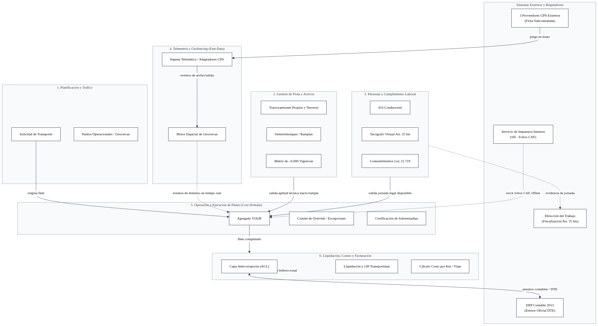
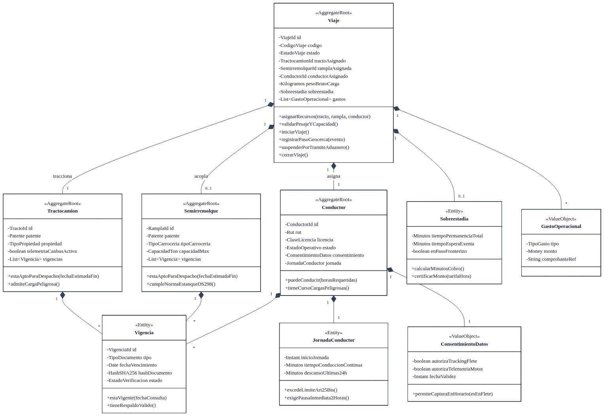
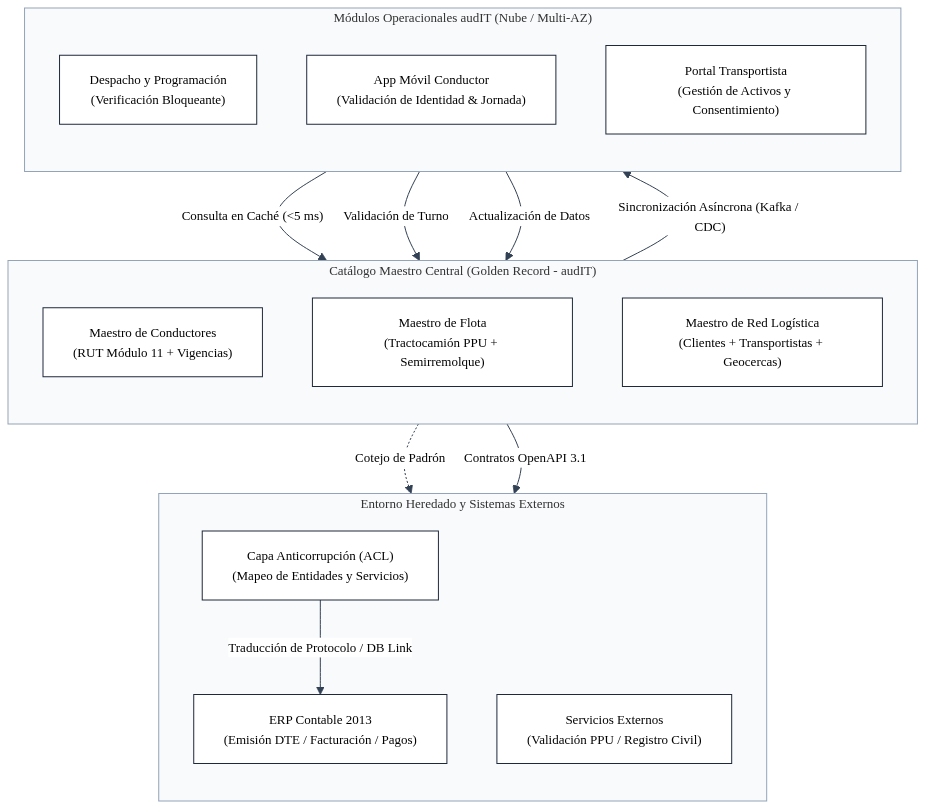
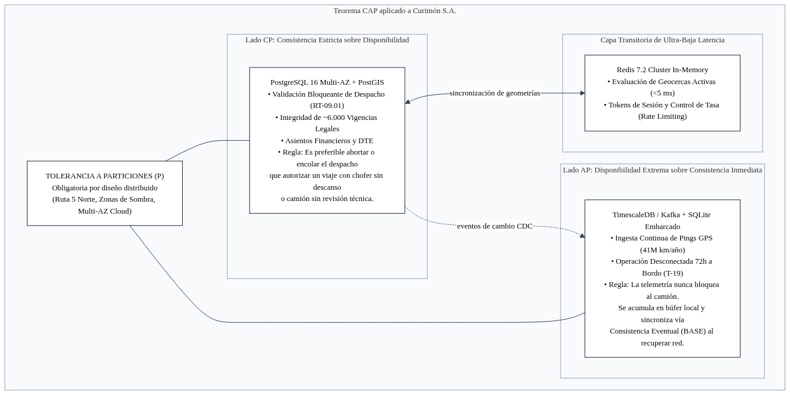
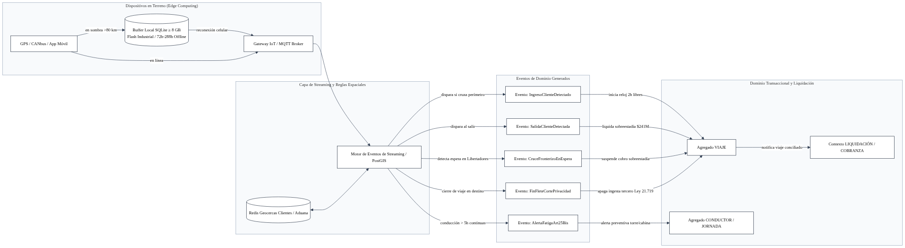
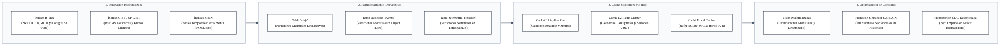
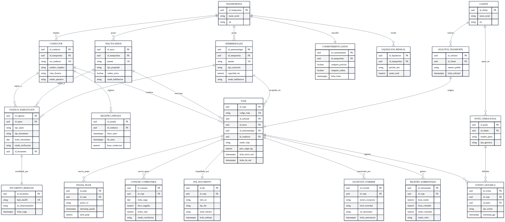
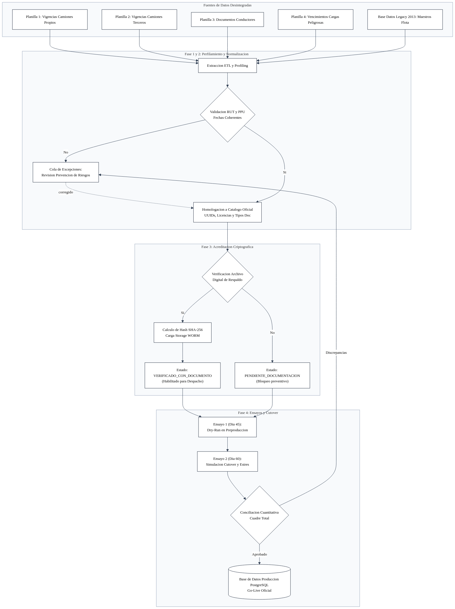
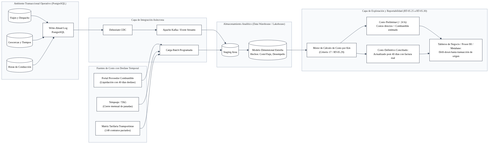

# Subdocumento 5: Modelo de Persistencia, Saneamiento y Gestión de Datos — audIT (Versión 2.2 Consolidada)

**Licitación Pública TFEP-01/2026 · Caso 10: Transportes Curimón S.A.**
**Dupla Responsable:** D3 (Marcel Vergara L. y Martín Vergara L.) · **Especialista en Datos y Persistencia:** Marcel Vergara L.
**Estándares y Marcos de Cumplimiento:** Formulario T-7 Subdoc. 5 (FEP01 · p.57); RT-05.01 a RT-05.15 (FEP02 · p.11-12); RT-02.13 (FEP02 · p.6); RT-07.02, RT-07.04, RT-07.13 (FEP02 · p.18); RT-09.01, RT-09.02 (FEP02 · p.20); RT-11.10 (FEP02 · p.22); RT-16.06, RT-16.07, RT-16.09, RT-16.30 (FEP02 · p.29-31); Parámetros del Caso 10 para RT-05.10, RT-05.15, RT-05.29 (FEP03 · Cap. 15 · p.31); Ley N.° 21.719 (Protección de Datos Personales); ISO/IEC 25012 (Calidad de Datos); NIST SP 800-88 Rev. 1 (Eliminación Segura); Consultas Oficiales N.° 13, 18 y 21.

---

## Control de Versiones y Diagnóstico de Evolución Técnica (V1.0 → V2.2)

### A. Diagnóstico del Modelo Inicial y Deficiencias Superadas

En la auditoría técnica de arquitectura se identificaron cuatro vulnerabilidades estructurales en las aproximaciones iniciales frente a las exigencias de las Bases:

1. **Modelo Anémico Monolítico:** Las entidades se concebían como simples esquemas de tablas pasivas con claves foráneas, sin encapsulamiento de invariantes de negocio ni validaciones previas a la persistencia (vulnerando el control bloqueante del Código del Trabajo, Art. 25 bis, antes de autorizar despachos en < 30 s).
2. **Antipatrón de Saturación por Telemetría:** Acoplar tablas relacionales estándar al flujo continuo de los **≈ 41.000.000 km/año** y 374 unidades generaba contención de bloqueos e indisponibilidad transaccional en la torre de programación 24x7.
3. **Omisión de la Asimetría Tracto-Rampla:** No se disociaba el tractocamión (148 propios, 226 subcontratados) del semirremolque (210 equipos propios y ramplas de terceros), impidiendo controlar vigencias técnicas y habilitaciones químicas independientes (Decreto Supremo N.° 298 para sustancias peligrosas).
4. **Ausencia de Gobierno de Datos Maestros (MDM) y Omisión en Plazos Legales de Retención:** No existía una estrategia para evitar duplicación de entidades entre la nueva plataforma y el ERP contable legado de 2013 (RT-05.09), y se omitía el plazo legal de habilitaciones (vigencia + 5 años) fijado en el Capítulo 15 del Caso (p.31).

### B. Cuadro Comparativo de Innovaciones Técnicas (V2.2 Consolidada)

| Dimensión Técnica                | Enfoque Anterior (V1.0)                  | Enfoque Definitivo (V2.2 - audIT)                                                                                      | Impacto Directo en Transportes Curimón S.A.                                                             |
| :--------------------------------- | :--------------------------------------- | :--------------------------------------------------------------------------------------------------------------------- | :------------------------------------------------------------------------------------------------------- |
| **Paradigma de Modelado**    | Esquema ERD relacional plano.            | **Domain-Driven Design (DDD):** Contextos delimitados, agregados raíz y objetos de valor inmutables (RT-02.13). | Valida la lógica de negocio en memoria; previene despachos ilegales en ≤ 30 s (RT-09.01).              |
| **Ingesta Telemática**      | Tablas relacionales sobrecargadas.       | **Arquitectura Fast-Data desacoplada:** TimescaleDB / Kafka y búfer offline de 72 h (RT-03.10).                 | Aísla los pings GPS del motor transaccional; garantiza operación continua en zonas de sombra (>80 km). |
| **Gobernanza de Activos**    | Entidad única`CAMION`.                | **Disociación estricta `TRACTOCAMION` y `SEMIRREMOLQUE`.**                                                  | Permite controlar vencimientos cruzados y compatibilidad química (DS 298 / MTT).                        |
| **Datos Maestros (MDM)**     | Entidades dispersas sin sincronización. | **Estrategia MDM de Registro Maestro Único (*Golden Record*)** con Capa Anticorrupción (RT-05.09).           | Evita duplicidad de 454 conductores, 374 camiones y 84 clientes frente al ERP 2013 contable.             |
| **Estrategia de Desempeño** | Índices genéricos sin partición.      | **Particionamiento declarativo mensual, índices GiST y BRIN, y caché L2 Redis Cluster.**                       | Consultas de geocercas en < 5 ms y almacenamiento telemático optimizado en 95 % (RT-09.02).             |
| **Saneamiento de Vigencias** | Carga masiva sin contrastación.         | **Verificación documental individual obligatoria con hash SHA-256** en WORM (RT-05.15).                         | Sanea las 4 planillas dispersas (~6.000 vigencias) y erradica el riesgo de fiscalización de abril.      |
| **Seguridad y Privacidad**   | Cifrado a nivel de disco estándar.      | **Field-Level Encryption (AES-256-GCM)** y anonimización verificable en Dev/QA.                                 | Cumplimiento irrestricto de la Ley N.° 21.719 para los 258 choferes y tarifas de 148 dueños.           |
| **Retención Legal**         | Plazos genéricos sin respaldo de norma. | **Matriz de retención ajustada al Capítulo 15 del Caso** (10a, 6a, 5a, vigencia+5a, 3a, 2a).                   | Certeza probatoria ante fiscalizaciones laborales, tributarias (SII) y reclamos por sobreestadías.      |

---

## EJE 1: MODELO DE DOMINIO, PERSISTENCIA Y SEGURIDAD LEGAL

### 1.1 Modelo de Dominio y Fronteras Transaccionales (DDD)

*(Referencia: FEP02 · RT-02.13 · p.6; FEP03 · Cap. 4 · p.9; FEP03 · Cap. 14.1 · p.29)*

Para gobernar una operación anual de **96.000 viajes, 374 camiones (148 propios, 226 subcontratados), 210 semirremolques propios y 454 conductores**, el sistema se estructura bajo principios de *Domain-Driven Design* (DDD) en seis áreas funcionales interconectadas mediante eventos de dominio asíncronos y una **Capa Anticorrupción (ACL)** que aísla el ERP Contable heredado de 2013 (Restricción 8 y Consulta N.° 13).



#### Agregados Raíz y Encapsulamiento de Invariantes de Negocio:

1. **Agregado `Viaje` (Core Domain):** Orquesta la máquina de estados finita (`PROGRAMADO` → `EN_CARGA` → `EN_RUTA` → `EN_DESCARGA` → `CERRADO` / `CANCELADO`). Ejecuta el método bloqueante `asignarRecursos()` validando en memoria y de forma atómica: (i) aptitud técnica y vigencia del tracto, (ii) compatibilidad y habilitación de la rampla (DS 298), y (iii) jornada disponible del conductor bajo el Art. 25 bis del Código del Trabajo. Dispone del método `suspenderPorTramiteAduanero()` para congelar el reloj de sobreestadías ante cierres y demoras en el Paso Los Libertadores (hasta 12 días por nieve o 14 horas de cola aduanera).
2. **Agregado `Tractocamion`:** Custodia las vigencias técnicas y mecánicas del vehículo motor (revisión técnica, SOAP, permiso de circulación) y administra el estado de telemetría CANbus/FMS (SAE J1939 activo en 61 unidades propias).
3. **Agregado `Semirremolque`:** Modela los 210 equipos de arrastre propios y los de terceros. Implementa la regla `cumpleNormaEstanqueDS298()` para garantizar que ninguna carga ácida o combustible sea despachada en carrocerías sin prueba de estanqueidad vigente.
4. **Agregado `Conductor`:** Gobierna el control estricto de la jornada laboral bajo el Art. 25 bis del Código del Trabajo (máximo 5 horas continuas de conducción, descanso mínimo de 2 horas intermedias y verificación de descanso semanal previo). Custodia la entidad de consentimiento de datos bajo la Ley N.° 21.719.
5. **Agregado `Transportista`:** Modela la relación comercial con los 148 dueños de camiones independientes, sus contratos marco, tarifas pactadas y reglas de liquidación mensual.
6. **Agregado `OrdenTransporte`:** Representa la relación contractual con los 84 clientes generadores de carga, tarifas acordadas, geocercas de origen/destino y especificaciones de carga peligrosa.



---

### 1.2 Estrategia de Gestión de Datos Maestros (MDM — RT-05.09)

*(Referencia: FEP02 · RT-05.09 · p.11; FEP03 · Cap. 5 · p.12)*

Para dar cumplimiento estricto a **RT-05.09**, la solución implementa un marco centralizado de **Master Data Management (MDM)** estructurado bajo el principio de *Registro Maestro Único (Golden Record)*, erradicando la duplicación de datos compartidos entre los nuevos módulos y los sistemas legados:



1. **Definición de Fuentes de Verdad (*Source of Truth*):**
   * *Maestro de Conductores y Habilitaciones*: La nueva plataforma audIT es la fuente exclusiva de verdad. Ningún conductor puede ser dado de alta o modificado directamente en el ERP.
   * *Maestro de Flota (Tractos y Semirremolques)*: Administrado exclusivamente en el módulo de flota de audIT, sincronizando la PPU y estado operativo.
   * *Maestro de Clientes y Proveedores (Transportistas)*: El ERP contable mantiene la tuición de la razón social y datos bancarios/tributarios, mientras que audIT extiende la entidad con los atributos operacionales (geocercas, tarifas de flete, contratos de adhesión).
2. **Reglas de Desduplicación y Limpieza:**
   * *Conductores*: Llave unívoca normalizada por RUT chileno validado algorítmicamente (Módulo 11). Prohibición de registros duplicados por variaciones de nombre o espacios.
   * *Flota*: Llave primaria natural basada en la Placa Patente Única (PPU) en formato estándar del Registro Civil e Identificación.
3. **Propagación y Consistencia Eventual:** Toda actualización en un maestro dispara un evento de integración a través de Azure Service Bus / Kafka, asegurando que todos los microservicios mantengan el mismo estado en < 2 segundos.

---

### 1.3 Calidad de Datos bajo ISO/IEC 25012 y Tablero de Control (RT-05.04)

*(Referencia: FEP02 · RT-05.04 · p.11; RT-05.10 · p.11)*

En cumplimiento de **RT-05.04**, la gestión de la información se rige formalmente por el estándar internacional **ISO/IEC 25012** (*Data Quality Model*), asegurando que los datos operacionales sean inherentemente confiables:

| Dimensión ISO 25012                        | Indicador / Métrica Comprometida                                                                            | Mecanismo de Control en la Solución                                                                               |
| ------------------------------------------- | ------------------------------------------------------------------------------------------------------------ | ------------------------------------------------------------------------------------------------------------------ |
| **Completitud (*Completeness*)**    | **≥ 99,8 %** de campos obligatorios poblados en despachos activos.                                    | Validación bloqueante en formulario web y móvil; no se admite el guardado de viajes con conductor o activo nulo. |
| **Exactitud (*Accuracy*)**          | **100 %** de RUTs válidos con DV y **100 %** de patentes PPU verificadas contra Registro Civil. | Algoritmos de validación sintáctica en el punto de captura y cotejo con el padrón de flota autorizado.          |
| **Consistencia (*Consistency*)**    | **100 %** de correspondencia entre tracto, rampla y tipo de carga declarada.                           | Motor de reglas de negocio que impide asignar ramplas estándar a órdenes con requerimiento DS 298.               |
| **Credibilidad (*Credibility*)**    | **100 %** de marcas temporales de eventos sincronizadas por NTP estrato 1 y reloj GPS satelital.       | Descarte de sellos de tiempo del sistema operativo local del smartphone o terminal manipulable.                    |
| **Accesibilidad (*Accessibility*)** | **Disponibilidad ≥ 99,9 %** de datos operacionales para los 22 operadores de torre 24x7.              | Réplicas de lectura transaccionales distribuidas en zonas Multi-AZ con conmutación transparente.                 |

* **Tablero de Calidad de Datos para el CLIENTE:** Se provee un tablero operacional en tiempo real que reporta el índice de salud de los datos (*Data Quality Index*), alertando anomalías, registros incompletos y vigencias en riesgo antes de que se traduzcan en fallas de servicio.
* **Catálogo de Datos con Linaje Automatizado (RT-05.10 Deseable):** Se incorpora la herramienta de catálogo de metadatos (OpenMetadata / Azure Purview) que traza visualmente el grafo de linaje de extremo a extremo: desde el dato crudo en el sensor CANbus o ticket de peaje hasta el indicador financiero de "Costo por Kilómetro por Ruta" expuesto a la Gerencia de Finanzas.

---

### 1.4 Justificación del Motor de Persistencia frente al Teorema CAP

*(Referencia: FEP01 · Formulario T-7 · p.57; FEP02 · RT-05.02 · p.11; FEP03 · Cap. 14.1 · p.29)*

En estricta conformidad con **RT-05.02**, la solución adopta una **Arquitectura Políglota Híbrida**, justificando la elección de bases de datos mediante el Teorema CAP para cada dominio operacional:



1. **Capa Transaccional Maestra (Sistema CP — PostgreSQL 16 Enterprise + PostGIS):**
   * En la asignación de fletes, control de vigencias, emisión de DTE y liquidaciones a transportistas, **la consistencia estricta es irrenunciable (ACID)**. Ante una partición de red entre sedes o zonas de disponibilidad (*Multi-AZ*), el sistema prioriza la Consistencia (C) sobre la Disponibilidad (A). Es preferible encolar temporalmente un despacho antes que permitir la salida de un conductor con jornada vencida o un semirremolque sin revisión técnica vigente (evitando siniestros como el del km 312).
   * *Nivel de aislamiento*: `READ COMMITTED` para consultas operativas y `SERIALIZABLE` para la verificación bloqueante de jornada y cierre mensual de liquidaciones.
2. **Capa de Telemetría y Streaming (Sistema AP — TimescaleDB / Kafka / Azure Cosmos DB):**
   * Para absorber los eventos continuos generados por la flota en **≈ 41 millones de km anuales**, el sistema prioriza la Disponibilidad (A) y la Tolerancia a Particiones (P) bajo **Consistencia Eventual (BASE)**.
   * Los dispositivos a bordo acumulan las lecturas en su búfer local (*SQLite WAL*) durante las zonas de sombra (> 80 km en Ruta 5 o pasos cordilleranos). Al recuperar conectividad 4G, transmiten en ráfagas asíncronas masivas sin competir por recursos con la base de datos relacional central.
3. **Capa de Búfer a Bordo en Cabina (SQLite 3 Embebido con WAL):**
   * Desplegado en las 374 unidades físicas. Opera como almacén local autónomo con modo WAL (*Write-Ahead Logging*), garantizando persistencia segura y transacciones atómicas ante caídas intempestivas de alimentación eléctrica del camión.
4. **Capa de Caché y Baja Latencia (Redis 7.2 Cluster):**
   * Almacena en memoria RAM las geometrías espaciales de las geocercas de los 1.400 puntos de carga/descarga y terminales, permitiendo evaluar eventos de cruce espacial en < 5 ms sin golpear el disco.



---

### 1.5 Estrategia de Desempeño de Base de Datos

*(Referencia: FEP01 · Formulario T-7 · p.57; FEP02 · RT-09.01 · p.20; RT-09.02 · p.20)*

Para asegurar que las consultas complejas no degraden la operación transaccional y garantizar tiempos de respuesta en la asignación bloqueante de viajes **≤ 30 segundos** (RT-09.01), se implementa una estrategia cuádruple de rendimiento:



1. **Estrategia de Indexación Especializada:**
   * *Índices B-Tree*: Aplicados sobre todas las claves foráneas (`id_tracto`, `id_conductor`, `id_semirremolque`), códigos de viaje y RUTs de conductores.
   * *Índices GiST y SP-GiST (PostGIS)*: Indexación espacial de coordenadas geográficas y polígonos de geocercas, optimizando las consultas del operador `ST_Contains()` y `ST_DWithin()`.
   * *Índices BRIN (*Block Range Indexes*)*: Aplicados sobre marcas temporales en las tablas históricas de telemetría y auditoría. Al aprovechar el orden físico secuencial de los datos, los índices BRIN ocupan un **95 % menos de espacio en disco y memoria RAM** que los índices B-Tree tradicionales, acelerando los escaneos por rango de fecha.
2. **Particionamiento Horizontal Declarativo:**
   * La tabla transaccional central `viaje` se particiona por rango de fechas en segmentos **mensuales**, permitiendo que las consultas operacionales de la torre se concentren exclusivamente en la partición activa.
   * Las tablas de auditoría (`auditoria_evento`) y de telemetría se particionan de forma automática, facilitando el archivado transparente hacia almacenamiento en frío (*Detached Partitions*) una vez cumplida la ventana en caliente.
3. **Caché Multinivel de Baja Latencia:**
   * *Nivel 1 (In-Memory App)*: Caché local en los servicios de negocio para catálogos estáticos (tipos de licencia, tipos de carga peligrosa).
   * *Nivel 2 (Redis 7.2 Cluster)*: Sesiones concurrentes, estados de vigencia precalculados de conductores habilitados y coordenadas de las 1.400 instalaciones de clientes, respondiendo en < 5 ms.
4. **Optimización de Consultas y Vistas Materializadas:**
   * Uso de vistas materializadas concurrentes (`REFRESH MATERIALIZED VIEW CONCURRENTLY`) para el precálculo de saldos de liquidación a transportistas y consumos agregados de combustible, evitando escaneos masivos en tablas transaccionales durante la jornada diurna.

---

### 1.6 Modelo Lógico de Persistencia y Diccionario de Datos con Sensibilidades

*(Referencia: FEP02 · RT-05.01 · p.11; RT-11.10 · p.22; Ley N.° 21.719)*

El esquema relacional en PostgreSQL 16 implementa identificadores unívocos UUIDv4 generados criptográficamente, restricciones de integridad referencial estricta y eliminación en cascada restringida.



#### Criterios de Clasificación de Sensibilidad (Ley N.° 21.719 y RT-11.10):

* **Pública / Operacional Interna:** Identificadores del sistema, códigos de viaje, placas patentes PPU.
* **Personal:** Datos que identifican directamente a una persona natural (RUT, nombre, teléfono de conductores).
* **Sensible / Laboral:** Trazas de geolocalización continua, sellos de tiempo de descanso y jornada, infracciones viales → **Cifrado a nivel de campo (FLE) obligatorio**.
* **Confidencial Comercial:** Tarifas unitarias pactadas con cada uno de los 148 transportistas subcontratados y liquidaciones de flete → **Cifrado a nivel de campo (FLE) obligatorio**.

#### Diccionario de Datos del Dominio Central:

##### Entidad `CONDUCTOR` (196 propios y 258 externos de 148 transportistas)

| Atributo             | Tipo de Dato | Formato / Dominio                 | Req. | Propietario   | Sensibilidad       | Tratamiento Técnico                      |
| -------------------- | ------------ | --------------------------------- | :--: | ------------- | ------------------ | ----------------------------------------- |
| `id_conductor`     | UUIDv4       | Identificador global              | Sí | RR.HH.        | Operacional        | Clave primaria indexada B-Tree            |
| `id_transportista` | UUIDv4       | FK hacia`TRANSPORTISTA`         |  No  | Contratos     | Operacional        | Nulo si es conductor propio de Curimón   |
| `rut_conductor`    | VARCHAR(12)  | Formato nacional con DV           | Sí | RR.HH.        | **Personal** | Cifrado FLE (AES-256-GCM)                 |
| `nombre_completo`  | VARCHAR(120) | Texto alfabético                 | Sí | RR.HH.        | **Personal** | Cifrado FLE (AES-256-GCM)                 |
| `clase_licencia`   | VARCHAR(5)   | `'A5'`, `'A4'`, `'A2'`      | Sí | Operaciones   | Operacional        | Validación de aptitud de conducción     |
| `estado_operativo` | ENUM         | `'HABILITADO'`, `'BLOQUEADO'` | Sí | Torre Control | Operacional        | Control de despacho bloqueante (RT-09.01) |

##### Entidades `TRACTOCAMION` y `SEMIRREMOLQUE` (Flota de 374 tractos y 210 ramplas)

| Atributo             | Tipo de Dato | Formato / Dominio                         | Req. | Propietario | Sensibilidad | Tratamiento Técnico                |
| -------------------- | ------------ | ----------------------------------------- | :--: | ----------- | ------------ | ----------------------------------- |
| `id_tracto`        | UUIDv4       | Identificador global                      | Sí | Flota       | Operacional  | Clave primaria                      |
| `patente`          | VARCHAR(8)   | Formato PPU nacional                      | Sí | Flota       | Operacional  | Índice B-Tree único               |
| `tipo_propiedad`   | ENUM         | `'PROPIO'`, `'TERCERO'`               | Sí | Operaciones | Operacional  | Filtro de auditoría y liquidación |
| `canbus_activo`    | BOOLEAN      | `TRUE`, `FALSE`                       | Sí | Telemática | Operacional  | `TRUE` en 61 unidades iniciales   |
| `id_semirremolque` | UUIDv4       | Identificador global                      | Sí | Flota       | Operacional  | Clave primaria                      |
| `tipo_carroceria`  | ENUM         | `'RAMPLA'`, `'ESTANQUE'`, `'TOLVA'` | Sí | Operaciones | Operacional  | Compatibilidad de carga             |
| `capacidad_ton`    | NUMERIC(5,2) | 1.00 a 45.00 ton                          | Sí | Tráfico    | Operacional  | Restricción física de carga       |

##### Entidad `VIGENCIA_HABILITACION` (El núcleo de las ~6.000 vigencias vivas)

| Atributo                | Tipo de Dato | Formato / Dominio                           | Req. | Propietario | Sensibilidad | Tratamiento Técnico                           |
| ----------------------- | ------------ | ------------------------------------------- | :--: | ----------- | ------------ | ---------------------------------------------- |
| `id_vigencia`         | UUIDv4       | Identificador global                        | Sí | Prevención | Operacional  | Clave primaria                                 |
| `id_sujeto`           | UUIDv4       | FK polimórfica (Tracto/Rampla/Chofer)      | Sí | Prevención | Operacional  | Índice compuesto con tipo de documento        |
| `tipo_sujeto`         | ENUM         | `'TRACTO'`, `'RAMPLA'`, `'CONDUCTOR'` | Sí | Prevención | Operacional  | Discriminador de activo                        |
| `tipo_documento`      | ENUM         | Catálogo oficial de 12 tipos               | Sí | Legal       | Operacional  | Rev. Técnica, SOAP, Licencia, DS 298          |
| `fecha_vencimiento`   | DATE         | Fecha calendario                            | Sí | Legal       | Operacional  | Disparador de alertas preventivas (RT-16.21)   |
| `estado_verificacion` | ENUM         | `'VERIFICADO'`, `'PENDIENTE'`           | Sí | Auditoría  | Operacional  | **Solo `'VERIFICADO'` autoriza flete** |
| `id_documento`        | UUIDv4       | FK hacia`DOCUMENTO_RESPALDO`              | Sí | Custodia    | Operacional  | Evidencia documental obligatoria               |

##### Entidad `DOCUMENTO_RESPALDO` (Custodia Criptográfica)

| Atributo               | Tipo de Dato | Formato / Dominio       | Req. | Propietario     | Sensibilidad | Tratamiento Técnico                          |
| ---------------------- | ------------ | ----------------------- | :--: | --------------- | ------------ | --------------------------------------------- |
| `id_documento`       | UUIDv4       | Identificador global    | Sí | Custodia        | Operacional  | Clave primaria                                |
| `hash_sha256`        | CHAR(64)     | Hash criptográfico hex | Sí | Ciberseguridad  | Operacional  | **Firma de inalterabilidad probatoria** |
| `uri_almacenamiento` | VARCHAR(500) | URI Object Storage WORM | Sí | Infraestructura | Operacional  | Almacenamiento inmutable                      |
| `fecha_carga`        | TIMESTAMPTZ  | Sello UTC de subida     | Sí | Auditoría      | Operacional  | Trazabilidad temporal                         |

##### Entidad `CONSENTIMIENTO_DATOS` (Soberanía y Ley N.° 21.719 — Decisión 23 y Criterio 29)

| Atributo                | Tipo de Dato | Formato / Dominio         | Req. | Propietario   | Sensibilidad | Tratamiento Técnico                 |
| ----------------------- | ------------ | ------------------------- | :--: | ------------- | ------------ | ------------------------------------ |
| `id_consentimiento`   | UUIDv4       | Identificador global      | Sí | Legal         | Operacional  | Clave primaria                       |
| `id_transportista`    | UUIDv4       | FK hacia`TRANSPORTISTA` | Sí | Legal         | Operacional  | Identificador del titular del activo |
| `comparte_posicion`   | BOOLEAN      | `TRUE`, `FALSE`       | Sí | Transportista | Sensible     | Permiso expreso de streaming GPS     |
| `comparte_telemetria` | BOOLEAN      | `TRUE`, `FALSE`       | Sí | Transportista | Sensible     | Permiso de RPM, frenadas y odómetro |
| `autoriza_clientes`   | JSONB        | Lista de IDs de clientes  | Sí | Transportista | Sensible     | Whitelist de clientes autorizados    |
| `fecha_otorgamiento`  | TIMESTAMPTZ  | Sello UTC                 | Sí | Auditoría    | Operacional  | Trazabilidad legal                   |
| `fecha_revocacion`    | TIMESTAMPTZ  | Sello UTC (nullable)      |  No  | Auditoría    | Operacional  | Cese inmediato de visibilidad        |

##### Entidad `VIAJE` (Transacción Central — 96.000 viajes/año)

| Atributo             | Tipo de Dato | Formato / Dominio           | Req. | Propietario | Sensibilidad | Tratamiento Técnico               |
| -------------------- | ------------ | --------------------------- | :--: | ----------- | ------------ | ---------------------------------- |
| `id_viaje`         | UUIDv4       | Identificador global        | Sí | Tráfico    | Operacional  | Clave primaria                     |
| `codigo_viaje`     | VARCHAR(20)  | Formato`VJ-YYYYMM-XXXXXX` | Sí | Tráfico    | Operacional  | Identificador visible único       |
| `id_tracto`        | UUIDv4       | FK hacia`TRACTOCAMION`    | Sí | Control     | Operacional  | Validación técnica de aptitud    |
| `id_semirremolque` | UUIDv4       | FK hacia`SEMIRREMOLQUE`   |  No  | Control     | Operacional  | Requerido en fletes con rampla     |
| `id_conductor`     | UUIDv4       | FK hacia`CONDUCTOR`       | Sí | Control     | Operacional  | Validación de jornada Art. 25 bis |
| `peso_origen_kg`   | NUMERIC(8,2) | Peso báscula / ticket      | Sí | Tráfico    | Operacional  | Mitigación de 142 sobrepesos/año |
| `estado_viaje`     | ENUM         | 6 estados operacionales     | Sí | Control     | Operacional  | Máquina de estados finita         |

---

### 1.7 Auditoría Inalterable de Modificaciones (Append-Only CDC)

*(Referencia: FEP02 · RT-05.03 · p.11; RT-16.06, RT-16.07 · p.29; FEP03 · Criterio 4 · p.41)*

Para satisfacer **RT-05.03** y el **Criterio de Aceptación 4**, la solución implementa una infraestructura de trazabilidad inalterable oponible ante tribunales y compañías de seguros:

1. **Trigger de Auditoría Transaccional:** Toda sentencia `INSERT`, `UPDATE` o `DELETE` sobre entidades maestras, de viaje y de habilitaciones dispara un trigger a nivel de fila (`AFTER STATEMENT`) que inserta un registro en la tabla particionada `auditoria_evento`.
2. **Estructura Forense del Registro de Auditoría:**
   * Identificador del operador (`usuario_id`), IP de origen, dispositivo y sello temporal UTC sincronizado por NTP estrato 1.
   * Tabla intervenida, UUID del registro y tipo de operación (`INSERT`, `UPDATE`, `DELETE`).
   * `valores_antes (JSONB)` y `valores_despues (JSONB)`, registrando fielmente los cambios de estado.
3. **Inalterabilidad y Blindaje frente a Administradores (RT-16.07):**
   * Se revocan terminantemente los permisos de modificación o borrado a nivel de motor de base de datos:
     ```sql
     REVOKE UPDATE, DELETE, TRUNCATE ON TABLE auditoria_evento FROM PUBLIC, dba_admin, audit_app;
     ```
   * Cada registro incorpora un hash encadenado SHA-256 (*Hash Chain*) que vincula criptográficamente el evento actual con el hash del evento inmediatamente anterior.
   * Los segmentos mensuales cerrados se replican en caliente hacia un bucket de almacenamiento de objetos inmutable WORM con política de retención estricta (*Object Lock* en modo *Compliance*).

---

### 1.8 Esquema de Respaldo 3-2-1-1-0 y Continuidad Operacional

*(Referencia: FEP02 · RT-07.02, RT-07.04, RT-07.13 · p.18)*

Para garantizar la continuidad de servicio con un **RTO ≤ 4 horas** y un **RPO ≤ 15 minutos** conforme a los estándares transversales:

* **3 Copias de la Información:** 1 base productiva viva en Azure Chile Central (Multi-AZ), 1 réplica síncrona en zona secundaria, y 1 respaldo binario diario consolidado.
* **2 Medios Diferentes:** Almacenamiento NVMe local de alta velocidad para la base transaccional viva y *Azure Blob Storage* con redundancia geográfica (GZRS) para los respaldos binarios.
* **1 Copia Fuera de Sitio (Off-site):** Replicación asíncrona continua de logs de transacciones (*WAL-G archiving*) hacia una región de nube secundaria situada a más de 100 kilómetros de distancia física (Azure East US 2 o región alternativa).
* **1 Copia Desconectada e Inmutable (Immutable Air-Gapped):** Snapshots semanales con retención bloqueada WORM que impiden cualquier borrado o cifrado no autorizado, incluso ante secuestro total de credenciales de infraestructura.
* **0 Errores en Ensayos de Restauración:** Pipeline automatizado semanal que levanta una instancia efímera de PostgreSQL, restaura el último backup binario, aplica los WALs hasta el punto en el tiempo (*PITR*) y ejecuta pruebas automáticas de consistencia referencial (`pg_amcheck`).
* **Cifrado Integral:** Datos en tránsito protegidos con **TLS 1.3**; datos en reposo cifrados mediante **AES-256 (TDE / LUKS)** con llaves custodiadas en Azure Key Vault gestionado (HSM FIPS 140-2 Nivel 3) con rotación anual.

---

### 1.9 Seguridad, Cifrado a Nivel de Campo (FLE) y Cumplimiento Ley N° 21.719

*(Referencia: FEP01 · Art. 85° · p.43; FEP02 · RT-05.08 · p.11; RT-11.10 · p.22; FEP03 · Cap. 10 · p.23)*

1. **Cifrado a Nivel de Campo (Field-Level Encryption - FLE):**
   Los datos de los 258 conductores subcontratados (RUT, teléfono, marcas horarias de descanso) y las tarifas pactadas con los 148 dueños de camiones se cifran en la capa de aplicación con **AES-256-GCM** antes de transmitirse a la red y a la base de datos, garantizando que un volcado crudo de disco o memoria no exponga datos personales ni comerciales sensibles.
2. **Anonimización Verificable en Ambientes de Desarrollo y QA (RT-04.14):**
   Queda terminantemente prohibido clonar bases de datos productivas hacia entornos de desarrollo o pruebas sin anonimización previa. Se aplica un pipeline de ofuscación:
   * Reemplazo de RUTs por identificadores sintéticos válidos mediante algoritmo Módulo 11 pseudoaleatorio.
   * Enmascaramiento irreversible de nombres mediante diccionarios sintéticos.
   * Multiplicación de tarifas y liquidaciones por un factor de ruido gaussiano (μ = 1.0, σ = 0.05), preservando las distribuciones estadísticas analíticas pero destruyendo los valores nominales reales.

---

## EJE 2: MIGRACIÓN DE DATOS Y SANEAMIENTO HISTÓRICO

### 2.1 Diagnóstico de Partida y Acreditación Criptográfica de las ~6.000 Vigencias

*(Referencia: FEP03 · Cap. 5 · p.12; Cap. 14.1 · p.29; Cap. 15 · p.31; Consulta Oficial N.° 21)*

Transportes Curimón S.A. administra actualmente **≈ 6.000 fechas de vencimiento vivas** dispersas en **cuatro planillas de cálculo independientes** administradas por distintas personas, carentes de integridad referencial y con registros duplicados.

* **Regla de Oro Probatoria:** En conformidad con el parámetro **RT-05.15 del Capítulo 15** (p.31), ningún registro de vigencia migrado se considerará habilitante para el despacho si no cuenta con su respectiva **verificación documental individual**.
* **Custodia Criptográfica:** Cada documento digitalizado de respaldo (licencia de conducir, certificado de revisión técnica, póliza SOAP, curso de carga peligrosa) se almacena en el repositorio documental inmutable y se sella con su huella criptográfica **SHA-256 (64 caracteres hex)** vinculada en base de datos.
* **Régimen de Excepción Inicial Gobernado:** Los registros históricos que no cuenten temporalmente con respaldo digital ingresan con estado `'PENDIENTE_DOCUMENTACION'`. Se otorga una ventana perentoria de regularización de 30 días durante la marcha blanca; cumplido el plazo, el sistema **bloquea de forma automática la asignación del activo o conductor** hasta que se adjunte la evidencia documental verificada.

---

### 2.2 Alcance Cuantitativo y Plan de Migración en 4 Fases

*(Referencia: FEP02 · RT-05.11 a RT-05.15 · p.12; FEP03 · Cap. 15 · p.31; Consulta N.° 21)*

El alcance de migración histórica establecido en el **Capítulo 15 de las Bases Técnicas del Caso 10** comprende dimensiones masivas que se planifican con precisión:

| Dominio Histórico a Migrar                            | Volumen Estimado del Caso 10                          | Criterio de Aceptación y Conciliación                         |
| ------------------------------------------------------ | ----------------------------------------------------- | --------------------------------------------------------------- |
| **Maestros de Flota y Semirremolques**           | **100 % (374 tractos y 210 ramplas)**           | Conciliación 1:1 contra padrón oficial del Registro Civil.    |
| **Maestros de Conductores y Transportistas**     | **100 % (454 choferes y 148 dueños)**          | Conciliación de RUTs y contratos marco vigentes.               |
| **Maestro de Clientes y Geocercas**              | **100 % (84 clientes y 1.400 puntos)**          | Validación de direcciones y polígonos geoespaciales.          |
| **Vigencias de Habilitación Vivas**             | **≈ 6.000 registros de 4 planillas**           | Verificación documental individual con hash SHA-256.           |
| **Histórico de Viajes Operacionales**           | **5 años (≈ 480.000 viajes históricos)**     | Conciliación de totales, códigos de viaje y fechas de cierre. |
| **Histórico de Liquidaciones a Transportistas** | **6 años (≈ 10.656 liquidaciones mensuales)** | Cuadre financiero al peso contra libros contables del ERP 2013. |
| **Histórico de Siniestros y Reclamos**          | **100 % de los antecedentes disponibles**       | Integridad de expedientes legales y peritajes de seguros.       |



#### Fases de Ejecución del Plan de Migración:

1. **Fase 1: Perfilamiento y Extracción (Días 1 a 15):** Ejecución de scripts de perfilamiento de calidad sobre las 4 planillas de vigencias y bases relacionales de 2013, identificando inconsistencias, RUTs erróneos y fechas vencidas.
2. **Fase 2: Homologación y Normalización (Días 16 a 35):** Limpieza algorítmica, resolución asistida de discrepancias junto a las áreas de Prevención de Riesgos y Tráfico de Curimón, y homologación al catálogo unificado de enums.
3. **Fase 3: Acreditación Documental y Hash Criptográfico (Días 36 a 50):** Carga masiva de documentos digitalizados, generación de hashes SHA-256 y segregación de registros incompletos hacia la cola de regularización.
4. **Fase 4: Ensayos de Migración (*Mock Runs*) y Transición Final (*Cutover*):**
   * **Primer Ensayo Completo (Día 45, RT-05.13):** Ensayo en seco (*Dry-Run*) en Preproducción con el 100 % de los datos para medir tiempos de ingestión, latencias de indexación y tasa de excepciones.
   * **Segundo Ensayo Completo (Día 60, RT-05.13):** Simulación integral de corte operacional (*Cutover Rehearsal*) y prueba de estrés de validación bloqueante de despacho sobre el volumen total migrado.
   * **Conciliación Cuantitativa y Firma de Acta (RT-05.14):** Verificación matemática del 100 % de patentes, conductores clasificados y saldos contables de liquidaciones. El paso a Producción requiere la firma formal de un Acta de Conciliación sin discrepancias.

---

## EJE 3: POLÍTICA DE RETENCIÓN, EXPLOTACIÓN Y REVERSIBILIDAD (RT-05.10)

### 3.1 Matriz de Retención por Dominio de Información

*(Referencia: FEP02 · RT-05.07, RT-05.10 · p.11; FEP03 · Cap. 15 · p.31)*

En estricto apego a los plazos legales fijados en el **Capítulo 15 de las Bases Técnicas del Caso 10**, se establece la siguiente matriz de retención y ciclo de vida de la información:

| Categoría de Información                      |        Período de Retención        | Fundamento Legal y Operacional                                                                                   | Política de Archivamiento y Destino Final                                                                                                              |
| :---------------------------------------------- | :----------------------------------: | :--------------------------------------------------------------------------------------------------------------- | :------------------------------------------------------------------------------------------------------------------------------------------------------ |
| **Siniestros y Responsabilidad Civil**    |          **10 años**          | Art. 2332 Código Civil (prescripción de responsabilidad extracontractual) y defensas ante seguros.             | Almacenamiento frío inmutable (*Azure Blob Archive Lock*).                                                                                           |
| **Liquidaciones a Terceros y DTE**        |          **6 años**          | Art. 200 Código Tributario (plazo extraordinario de fiscalización del SII) y respaldo contable.                | Archivado comprimido XML/PDF firmado criptográficamente.                                                                                               |
| **Habilitaciones de Conductores y Flota** | **Su vigencia y 5 años más** | Exigencia expresa del Capítulo 15 (p.31) para trazabilidad histórica de aptitud laboral y vial.                | Mantenido en caliente durante vigencia; archivado frío posterior.                                                                                      |
| **Registros de Jornada y Tacógrafo**     |          **5 años**          | Fiscalización Dirección del Trabajo (Art. 25 bis Código del Trabajo y normativa laboral de transporte).       | Purga criptográfica segura; conservación de resúmenes estadísticos.                                                                                 |
| **Cargas Peligrosas (DS 298)**            |          **5 años**          | Decreto Supremo N.° 298 (MTT) y fiscalizaciones de la Seremi de Salud y Medio Ambiente.                         | Archivado inmutable para auditorías sectoriales.                                                                                                       |
| **Tiempos en Clientes y Geocercas**       |          **3 años**          | Respaldo probatorio fehaciente ante controversias por cobro de sobreestadías ($340M facturados, 71 % objetado). | Agregación mensual de tiempos; purga de trazas GPS crudas.                                                                                             |
| **Series de Posición y Telemetría**     |     **2 años en línea**     | Diagnóstico operacional y reconstrucción telemática de viajes recientes (RT-05.10 del Caso).                  | **Política de Agregación para > 2 años**: Se conservan promedios horarios de velocidad y distancias; se purgan pings individuales de terceros. |

---

### 3.2 Handoff Analítico y Soporte al Costo por Kilómetro en ≤ 24 Horas

*(Referencia: FEP02 · RT-05.05 · p.11; RT-05.25 a RT-05.30 · p.13; FEP03 · Criterio 17 · p.41; Consulta Oficial N.° 18)*

Para cumplir con **RT-05.05** y viabilizar los entregables analíticos y de BI asignados a Martín:

1. **Aislamiento Total de Cargas Transaccionales y Analíticas:**
   Ninguna consulta de inteligencia de negocios impacta la base transaccional de producción. La propagación de datos se efectúa en tiempo casi real (< 60 s) mediante **Debezium Change Data Capture (CDC)** y Apache Kafka / Event Hubs hacia la capa analítica Lakehouse (Delta Lake / PostgreSQL réplica analítica).
2. **Soporte al Modelo de Costeo con Desfase de Combustible (40 días):**
   La base de datos modela la entidad `costo_viaje` con versionamiento semántico auditable:
   * *Versión 1 (≤ 24 h tras cierre de viaje)*: Costo preliminar trazable que consolida costos directos conocidos (tarifa del flete, peajes estimados, combustible inferido por odómetro/CANbus) e identifica explícitamente los componentes pendientes (Consulta Oficial N.° 18).
   * *Versión 2 (Conciliación a 40 días)*: Actualización automática al ingresar el archivo de liquidación mensual de estaciones de servicio (Enex/Copec) y peajes, generando una nueva versión auditada sin sobreescribir la historia previa.



---

### 3.3 Eliminación Segura y Garantía de Reversibilidad Contractual

*(Referencia: FEP02 · RT-05.06 · p.11; NIST SP 800-88 Rev. 1; Ley N.° 21.719)*

1. **Procedimiento Verificable de Eliminación Segura (NIST SP 800-88 Rev. 1):**
   Al cumplirse los plazos de retención o ante la solicitud de revocación de consentimiento de un transportista subcontratado (Ley N.° 21.719), se ejecuta la destrucción criptográfica (*Crypto-shredding*) de las llaves FLE de cifrado asociadas a los identificadores del titular, volviendo la información matemáticamente irrecuperable en todos los medios de almacenamiento y respaldos.
2. **Garantía de Reversibilidad Contractual (Fin del Contrato a 36 o 56 meses — RT-05.06):**
   audIT garantiza formalmente la entrega íntegra del patrimonio de datos propiedad de Transportes Curimón S.A. en **formatos abiertos, documentados y sin costo adicional**, eliminando cualquier riesgo de dependencia de proveedor (*no vendor lock-in*):
   * *Base transaccional completa*: Volcado SQL estándar (`pg_dump` con DDL y DML limpios) compatible con cualquier motor PostgreSQL estándar.
   * *Series temporales de telemetría*: Exportación columnar masiva en archivos abiertos **Apache Parquet**.
   * *Repositorio documental e-Docs*: Paquete consolidado en formato ZIP estructurado, acompañado de un catálogo de metadatos en **JSON Schema** y el inventario de hashes SHA-256 para verificación independiente de integridad.
