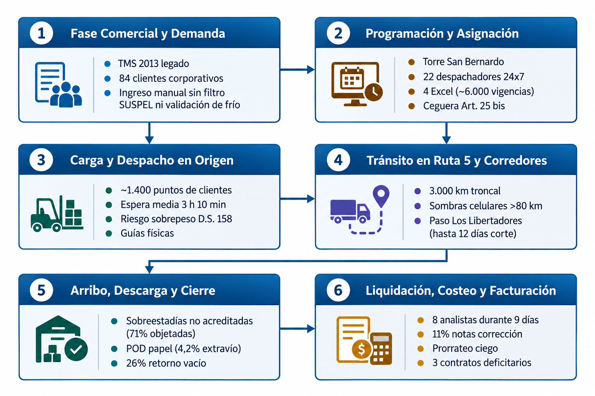
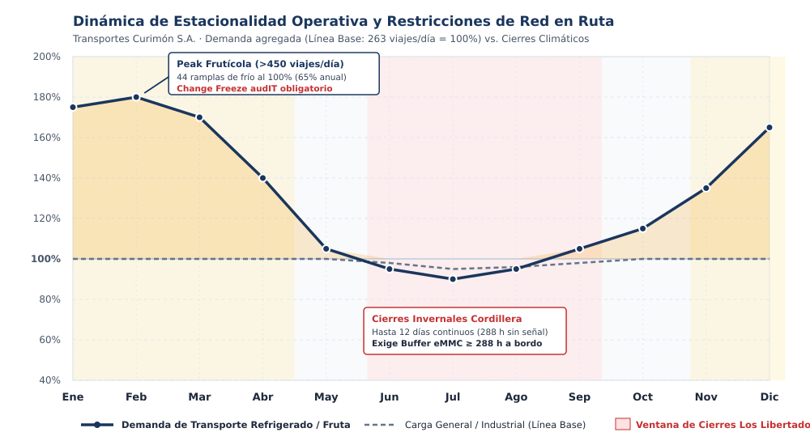
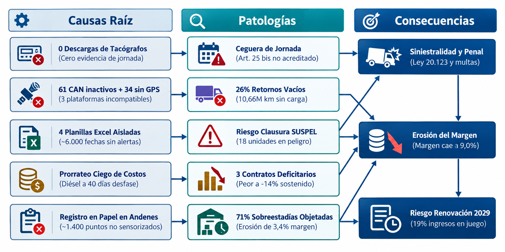
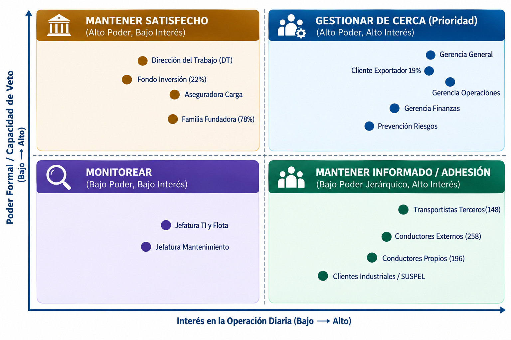

# Subdocumento 2. Resumen ejecutivo, comprensión del problema y de la necesidad

audIT, Empresa N.º 10. Licitación TFEP-01/2026, Caso 10 Transporte de Carga. Oferta Técnica, Sobre N.º 2. Informe Preparatorio 2. Archivo AUDIT-Subdocumento2.pdf.

## 2 Resumen ejecutivo, comprensión del problema y de la necesidad

> **Resumen de apertura.**
>
> audIT expone el diagnóstico pericial, técnico, operacional, normativo y comercial sobre la situación actual de Transportes Curimón S.A. en el marco de la Licitación Pública TFEP-01/2026. A partir del levantamiento en terreno, este subdocumento desglosa la complejidad del desafío de transporte de carga por carretera, delimitando con precisión ingenieril las causas raíz de las ineficiencias observadas, la asimetría estructural de tenencia y control sobre el 60,4% de la flota subcontratada, la modelación de la estacionalidad operativa con peaks de 450 viajes diarios y cierres de hasta 12 días en Los Libertadores, el mapeo de 13 actores estratégicos y las condiciones de contorno requeridas para la continuidad y resiliencia del negocio.
>
> **Qué recibe Transportes Curimón S.A.**
> - Diagnóstico holístico de la cadena de valor en seis fases operacionales y caracterización de las diez patologías sistémicas del Caso 10.
> - Modelación cuantitativa de estacionalidad frutícola (65% de demanda de frío en 5 meses) y restricciones climáticas cordilleranas (288 horas de aislamiento en Los Libertadores).
> - Mapeo estratégico de poder e influencia sobre los 13 actores del ecosistema y criterios de arbitraje para las seis tensiones operacionales.
> - Matriz de supuestos auténticos de ingeniería de proyectos con evaluación de impacto y planes de contingencia técnica.
> - Cuatro anexos técnicos complementarios: catálogo de 25 requerimientos preliminares, inventario de 374 tractocamiones y 454 choferes, matriz de restricciones legales y 13 fichas pormenorizadas de stakeholders.

El presente subdocumento expone el diagnóstico pericial, técnico, operacional, normativo y comercial realizado por audIT Soluciones Tecnológicas SpA sobre la situación actual de Transportes Curimón S.A., en el marco de la Licitación Pública Nacional e Internacional N.° TFEP-01/2026. A partir del levantamiento de antecedentes y la evaluación rigurosa de los procesos logísticos en terreno, este documento desglosa la complejidad del desafío de transporte de carga por carretera, delimitando con precisión ingenieril las causas raíz de las ineficiencias observadas y las restricciones que condicionan la operación.

Este capítulo se articula orgánicamente con la totalidad de los subdocumentos y anexos de la propuesta técnica:
- Provee el fundamento fáctico e ingenieril para el diseño del alcance y la descomposición modular expuestos en el Subdocumento 3 (*Esquema de Solución y Alcance*).
- Determina los requerimientos no funcionales de resiliencia, volumetría y desempeño que gobiernan la Arquitectura Lógica y Física desarrollada en el Subdocumento 4.
- Delimita los dominios de información, volumetría histórica y requerimientos de gobernanza formalizados en el Subdocumento 5 (*Modelo y Gestión de Datos*).
- Define el contexto operacional bajo el cual se estructuran las metodologías de trabajo, los paquetes de la Estructura de Descomposición del Trabajo (EDT) y la matriz de riesgos analizados en los Subdocumentos 6, 7 y 8.
- Establece los umbrales basales de calidad, niveles de servicio y soporte continuado a 36 meses detallados en los Subdocumentos 9, 10 y 11.
- Se vincula de forma directa con la asignación de roles y perfiles del Subdocumento 12, la justificación del catálogo de innovaciones del Subdocumento 13 y la demostración de beneficios cuantificados en el Subdocumento 14.

Asimismo, los inventarios detallados de requerimientos preliminares, el desglose pormenorizado del parque vehicular y conductores, la matriz exhaustiva de restricciones legales y las fichas completas de caracterización de actores se formalizan en los Anexos 2.A a 2.D incorporados al final del presente subdocumento.

## 2.1 Resumen ejecutivo

El diagnóstico estructural de Transportes Curimón S.A. revela un desacople crítico entre la responsabilidad integral asumida por la compañía frente a sus mandantes y el control operacional efectivo que ejerce sobre los recursos con que ejecuta el servicio de transporte interurbano. En el modelo de negocio vigente, Curimón asume el 100% de la responsabilidad patrimonial, civil y laboral por la carga transportada, la puntualidad en los puntos de destino, la seguridad de las operaciones en ruta y el cumplimiento normativo ante organismos fiscalizadores. No obstante, el 60,4% de la capacidad de transporte rodante (226 tractocamiones de un total de 374) y el 56,8% de la fuerza de conducción asignable (258 conductores externos frente a 196 propios) corresponden a recursos subcontratados pertenecientes a 148 pequeños y medianos transportistas independientes, sobre los cuales la empresa no ejerce tuición patronal ni subordinación directa.

Esta asimetría estructural genera vacíos sistemáticos de supervisión que impactan de manera directa la estabilidad operacional de la compañía. En el plano de la escala física, la red logística de Curimón coordina anualmente 96.000 viajes, movilizando 2,4 millones de toneladas de carga a lo largo de 41 millones de kilómetros recorridos por carretera. La operación se despliega en un eje territorial superior a 3.000 kilómetros lineales entre las ciudades de Antofagasta y Puerto Montt, complementado por aproximadamente 1.900 cruces internacionales por el Paso Fronterizo Los Libertadores hacia la provincia de Mendoza. La magnitud territorial descrita se gestiona actualmente mediante una asignación basada predominantemente en telefonía, planillas de cálculo y la memoria de 22 despachadores en la Torre de Programación de San Bernardo, lo que origina una ineficiencia estructural verificable: el 26% de la distancia total anual recorrida se ejecuta en condición de retorno en vacío (10,66 millones de kilómetros sin carga).

La fragilidad descrita se traslada con rigor a la estructura financiera y comercial de la compañía. Curimón registra la facturación anual bruta consolidada del mandante operando con un margen operacional estrecho del 9,0%. Sin embargo, dicho margen global encubre una distorsión profunda: el análisis analítico de rentabilidad por contrato evidencia que tres (3) de los ocho (8) clientes principales de la empresa operan por debajo de la línea de costo técnico. Estos tres contratos deficitarios concentran en conjunto el 31% de los despachos e ingresos corporativos, registrándose en el caso más grave un contrato con un margen negativo sostenido del -14% durante cuatro ejercicios fiscales consecutivos. Esta pérdida ha sido financiada de forma involuntaria por las rutas rentables debido a la aplicación histórica de un esquema contable de prorrateo ciego de costos por ingresos.

A esta fuga de valor se suma la pérdida de ingresos por concepto de sobreestadías en instalaciones de clientes: el 71% de los cobros emitidos por concepto de sobreestadías en recintos de carga y descarga resulta sistemáticamente objetado y retenido por los clientes debido a la inexistencia de registros cronológicos objetivos e inalterables que demuestren fehacientemente los horarios de llegada, espera y despacho, erosionando más de un 3,4% del margen operacional neto anual de la compañía.

En el ámbito de la gobernanza de datos y el cumplimiento legal, la empresa presenta una ceguera probatoria crítica. La trazabilidad documental se apoya en cerca de 6.000 fechas de vencimiento vivas (licencias de conducir, permisos de circulación, revisiones técnicas, certificados de transporte de sustancias peligrosas y seguros obligatorios) administradas manualmente en cuatro planillas de cálculo sin integridad referencial ni alarmas automáticas preventivas. A nivel de hardware instalado, existe una desconexión generalizada: se constata un registro histórico de cero descargas de tacógrafos digitales, 61 tractocamiones propios disponen de telemetría de bus CAN J1939 de fábrica que nunca ha sido consultada ni integrada, 34 camiones de terceros carecen por completo de dispositivos satelitales GPS, y las 340 unidades restantes se encuentran fragmentadas en tres plataformas comerciales heterogéneas que impiden conformar una vista de mando operacional unificada.

Esta situación de vulnerabilidad adquiere carácter de riesgo existencial ante la proximidad del ciclo de renovación contractual fijado para el año 2029 por el cliente exportador principal de la compañía. Dicho mandante concentra el 19% de la actividad comercial y facturación global de la empresa (superando ampliamente el total del margen neto corporativo del 9,0%) y ha formalizado cuatro requerimientos de cumplimiento obligatorio e improrrogable:
- Trazabilidad integral y posicionamiento de carga en tiempo real para el 100% de los despachos asignados.
- Emisión y tramitación de documentación electrónica de transporte sin redigitación manual ni soporte físico en papel (e-Docs para un volumen proyectado de 128.000 documentos anuales).
- Acreditación técnica fehaciente del cumplimiento de los límites de jornada laboral y descansos obligatorios del Artículo 25 bis del Código del Trabajo para la totalidad de los conductores (tanto propios como externos de terceros) en cada viaje asignado.
- Reportabilidad periódica y auditada de emisiones de gases de efecto invernadero (GEI / CO2e) por tonelada-kilómetro transportada, calculada bajo el estándar internacional del marco GLEC (*Global Logistics Emissions Council*) / ISO 14083:2023.

El incumplimiento de estas exigencias hacia el año 2029 supondría la pérdida inmediata del 19% de la facturación de Curimón, lo que destruiría la totalidad del margen operacional corporativo (9,0%) y sumiría a la empresa en insolvencia económica. En consecuencia, el desafío técnico consiste en estructurar un diagnóstico holístico y riguroso que dimensione estas brechas para sustentar la ingeniería de transformación sin confundir el problema con las soluciones que se detallarán en los capítulos posteriores.

## 2.2 Comprensión del problema y de la necesidad

Para comprender la raíz del problema operacional de Transportes Curimón S.A., es indispensable contextualizar la actividad en la cadena de valor del transporte terrestre de carga interurbana en Chile, examinando las restricciones geográficas, comerciales y los marcos legales que gobiernan la circulación por carretera.

En la Figura 2.1 se describe el flujo operacional y la cadena de valor característica del transporte de carga en Curimón, ilustrando la secuencia de procesos desde la recepción de la orden de transporte hasta la liquidación final y cierre de costos.

*Figura 2.1. Flujo operacional y cadena de valor del transporte de carga en Curimón*

Fuente: Elaboración propia.

El análisis de la Figura 2.1 permite constatar que la cadena de valor de Curimón se encuentra fragmentada por discontinuidades analíticas y operacionales en cada una de sus fases:
- **Fase 1: Comercial y Recepción de Demanda:** Captura y formalización de solicitudes de transporte generadas por los 84 clientes corporativos de la cartera. Se realiza mediante registro manual en el sistema legado TMS 2013, correos electrónicos y llamadas telefónicas no estructuradas. Carece de validación automatizada de compatibilidad de carga al ingresar la orden (identificación tardía de requerimientos de frío Pt100, especificaciones D.S. 298 para sustancias peligrosas o restricciones de peso por eje según D.S. 158). Esto genera compromisos comerciales de itinerarios irreales o con tarifas deficitarias (prorrateo ciego), perpetuando contratos con hasta un -14% de margen operacional negativo.
- **Fase 2: Programación y Asignación de Recursos:** Casamiento de órdenes de transporte con unidades de tracción (374 camiones) y tripulaciones (454 conductores). Los 22 despachadores de la Torre de Control de San Bernardo asignan viajes mediante llamadas telefónicas y consulta visual de cuatro planillas Excel desvinculadas entre sí. No existe validación algorítmica previa de jornada laboral (Artículo 25 bis del Código del Trabajo), lo que deriva en el despacho involuntario de choferes sin descanso suficiente, multiplicando el riesgo de siniestros viales por somnolencia.
- **Fase 3: Carga y Despacho en Instalaciones de Origen:** Posicionamiento del equipo en los recintos de clientes ($≈ 1.400$ puntos), faena de estiba y emisión de guías de despacho. Las demoras en andenes de carga promedian 3 horas 10 minutos y superan las 8 horas en la temporada agrícola de exportación. Al no existir integración telemática ni comprobación de peso por eje a la salida, los camiones quedan expuestos a infracciones por sobrepeso en plazas de pesaje del MOP (Caso, RT-04, p. 31).
- **Fase 4: Tránsito en Ruta y Logística Interurbana:** Circulación por el eje troncal de la Ruta 5 (3.000 km entre Antofagasta y Puerto Montt) y cruces internacionales por el Paso Los Libertadores ($≈ 1.900$ viajes anuales). La flota enfrenta sombras celulares de más de 80 kilómetros en zonas desérticas y cortes climáticos de hasta 12 días continuos (288 horas) en alta cordillera. La carencia de sincronización fuera de línea y la inexistencia de lectura de tacógrafos provocan la pérdida total de visibilidad operacional en ruta.
- **Fase 5: Arribo, Descarga y Cierre de Entrega:** Recepción física en destino, descarga de mercancías y firma del comprobante de entrega en papel (*Proof of Delivery* [POD]). La falta de registro electrónico objetivo de entrada y salida genera la objeción del 71% de los cobros de sobreestadías. Asimismo, el 4,2% de las guías en papel se extravían o deterioran, y el 26% de los kilómetros anuales (10,66 millones de km) se ejecutan retornando en vacío por falta de algoritmos de triangulación en tiempo real.
- **Fase 6: Liquidación, Costeo y Facturación:** Consolidación administrativa de fletes, pago a 148 transportistas terceros e imputación contable. Demanda ocho (8) profesionales durante nueve (9) días hábiles al cierre de cada mes, exhibiendo una tasa de error del 11% en liquidaciones. El diésel se costea con un desfase de hasta 40 días, impidiendo detectar a tiempo desvíos de rendimiento de hasta un 19% entre vehículos gemelos.

### 2.2.1 Diagnóstico holístico e integración causal de la cadena operacional

Las fallas detectadas en Transportes Curimón S.A. no representan eventos aislados atribuibles a descuidos puntuales de personal, sino que responden a una cadena causal integrada de patologías organizacionales y técnicas que se retroalimentan mutuamente:
- **Subsidios Cruzados de Tarifas y Prorrateo Ciego:** La práctica contable de distribuir los costos operacionales en función de los ingresos brutos facturados por cada cliente ha encubierto la rentabilidad marginal real de cada servicio. El análisis financiero pormenorizado demuestra que tres contratos comerciales operan bajo costo, absorbiendo en conjunto el 31% de la actividad e ingresos corporativos. El caso más crítico registra cuatro años consecutivos operando con un margen negativo de -14%. Debido a que los costos directos de combustible, peajes de autopista y tarifas a terceros no se asocian de forma unívoca a la orden de transporte que los originó, las rutas altamente rentables financian de manera continua e invisible los déficits de los contratos ruinosos, distorsionando la estrategia comercial y mermando el margen de la compañía (9,0%).
- **Brecha Probatoria de Tacógrafo Digital y Ceguera de Descanso:** La omisión absoluta en la descarga de tacógrafos digitales (cero descargas históricas) y la falta de control sobre las actividades previas de los 258 conductores subcontratados generan un punto ciego operacional con severas ramificaciones legales. El incidente ocurrido en el kilómetro 312 de la Ruta 5 Sur (volcamiento de un tractocamión subcontratado a las 04:40 h por fatiga extrema del operador) expuso judicialmente que dicho chofer venía de cumplir un servicio continuo para otra empresa sin haber gozado del descanso legal mínimo. Bajo el régimen de subcontratación, la empresa carecía de registros para acreditar su debida diligencia patronal, lo que derivó en la suspensión de contratos comerciales durante seis semanas e investigaciones de la autoridad laboral.
- **Dispersión Injustificada de Combustible y Rezago Analítico:** El combustible representa el 14% de la estructura de costos de Curimón, posicionándose como el segundo rubro de mayor gasto de la compañía. La gestión de este recurso presenta dos deficiencias estructurales: por una parte, existe una dispersión de rendimiento de hasta un 19% entre tractocamiones de idéntica marca, modelo y año asignados a una misma ruta geográfica; por otra parte, la conciliación de los consumos depende de la recepción mensual de las facturas consolidadas de las distribuidoras de combustible, lo que introduce un retraso analítico de hasta 40 días. Durante esta ventana temporal, la empresa desconoce anomalías como ralentí excesivo, desvíos de ruta, malos hábitos de aceleración o eventuales pérdidas en carretera, imposibilitando la aplicación oportuna de medidas correctivas.
- **Vulnerabilidad de Infraestructura en Alta Montaña y Desierto:** El paso fronterizo Los Libertadores, por donde transitan aproximadamente 1.900 viajes internacionales al año, permanece cerrado entre junio y septiembre por eventos meteorológicos extremos de nieve y viento blanco durante períodos que alcanzan hasta 12 días continuos (288 horas). En estas circunstancias, decenas de camiones con carga industrial y química quedan varados en alta montaña sin conectividad celular ni soporte local. En paralelo, los corredores mineros de la Región de Antofagasta registran sombras de telecomunicaciones de más de 80 kilómetros. Al no concebirse la desconexión como un estado operacional estándar, el sistema pierde la posición de los vehículos, no puede actualizar itinerarios y queda expuesto a la pérdida de información crítica.

### 2.2.2 Fundamentación de la investigación externa aportada y marco normativo

audIT Soluciones Tecnológicas SpA ha incorporado en el análisis pericial del problema un conjunto de normativas y estándares externos que condicionan de manera directa la operación y fijan los requerimientos de diseño de cualquier arquitectura de procesos logísticos:
- **Ley N.° 20.123 sobre Trabajo en Régimen de Subcontratación:** Esta normativa establece que la empresa principal (Transportes Curimón S.A.) es solidaria o subsidiariamente responsable de las obligaciones laborales, previsionales y de seguridad y salud en el trabajo que afecten a los trabajadores de sus contratistas. Dado que el 56,8% de los conductores que tripulan camiones a nombre de Curimón son dependientes de 148 microempresarios externos, cualquier infracción a los descansos legales, impago previsional o accidente con lesiones en carretera traslada la responsabilidad legal, civil e indemnizatoria directamente a Curimón si la compañía no ejerce de forma efectiva su derecho legal de información y retención. Esto impone la restricción de que Curimón debe validar la idoneidad y legalidad laboral del chofer externo de forma vinculante previo al despacho del viaje.
- **Artículo 25 bis del Código del Trabajo:** Regulado en el DFL N.° 1, fija el régimen especial de jornada laboral para choferes de carga terrestre interurbana. Establece un límite de conducción continua que no puede exceder de cinco (5) horas; un descanso obligatorio no inferior a dos (2) horas al término de cada ciclo de cinco horas; un descanso diario ininterrumpido de al menos ocho (8) horas dentro de cada período de veinticuatro horas; y un tope mensual ordinario de 180 horas distribuidas en no menos de veintiún días. La transgresión de estos parámetros no solo acarrea cuantiosas multas de la Dirección del Trabajo, sino que anula las pólizas de seguros de carga y expone a la plana ejecutiva a querellas penales por cuasidelito de lesiones o muerte en siniestros viales originados por somnolencia.
- **D.S. N.° 298/1994 (MTT) frente a D.S. N.° 43/2015 (MINSAL) para Sustancias Peligrosas (SUSPEL):** Curimón dispone de 18 unidades especializadas en transporte de sustancias químicas. El marco regulatorio impone dos normativas complementarias pero con ámbitos físicos diferenciados:
- El **D.S. N.° 298/1994** del MTT reglamenta el transporte de cargas peligrosas por calles y caminos, exigiendo antigüedad máxima permitida, revisión técnica periódica específica, señalización reglamentaria NCh 2190, extintores adecuados, tacógrafo operativo, Hoja de Datos de Seguridad (HDS) en cabina y conductor capacitado con curso vigente.
- El **D.S. N.° 43/2015** del MINSAL regula el almacenamiento de sustancias peligrosas en instalaciones fijas (Terminal Matriz San Bernardo y patios de acopio). Exige distancias de segregación química, pretiles de retención de derrames, sistemas de extinción certificados y prohíbe taxativamente la permanencia o pernoctación de camiones cargados con sustancias incompatibles en áreas no habilitadas.
- **Ley de Tránsito N.° 18.290 y Ley N.° 21.377 (Ley No Chat):** Tipifica como infracción gravísima la conducción de vehículos manipulando dispositivos de telefonía móvil o cualquier otro artefacto digital que no venga incorporado de fábrica, a menos que su operación se realice mediante manos libres y sin desviar la vista del camino. Esta disposición introduce una restricción física y ergonómica inmutable: prohíbe que el conductor interactúe manualmente con pantallas o aplicaciones durante el movimiento vehicular ($v > 0\text{ km/h}$). Cualquier interacción manual debe limitarse a momentos de detención total comprobada, o bien gestionarse mediante mecanismos auditivos pasivos de síntesis vocal.
- **Marco GLEC (*Global Logistics Emissions Council*) / ISO 14083:2023:** Constituye el estándar internacional de referencia adoptado por las multinacionales exportadoras para el cálculo y auditoría de la huella de carbono en la cadena logística. Exige reportar las emisiones de dióxido de carbono equivalente (CO2e) por tonelada-kilómetro transportada (g CO2e/t-km), desagregando las fases *Well-to-Tank* (WTT) y *Tank-to-Wheel* (TTW). Para Curimón, satisfacer el ultimátum comercial del cliente exportador (19% de ingresos) demanda la imposibilidad de aplicar estimaciones teóricas; se requiere computar el consumo real de diésel medido empíricamente sobre el motor y asociarlo a la carga neta efectiva movilizada en cada tramo.
- **El Tacógrafo Digital como Instrumento Probatorio Inalterable:** La jurisprudencia laboral y de tránsito reconoce al tacógrafo digital como el medio de prueba por excelencia para acreditar la velocidad y el cumplimiento de los tiempos de manejo y descanso del conductor. Sin embargo, su eficacia legal depende de la cadena de custodia: los archivos digitales deben ser extraídos periódicamente en su formato nativo inalterable con firma criptográfica.

### 2.2.3 Modelación cuantitativa de la estacionalidad operativa

La dinámica anual de la operación exhibe una marcada disparidad entre la regularidad basal de la carga general y los picos pronunciados de la temporada agrícola, superpuestos a las ventanas de riesgo climático en la alta cordillera. En la Figura 2.2 se ilustra la curva de estacionalidad operativa y las restricciones de red en ruta a lo largo del año.

*Figura 2.2. Dinámica de estacionalidad operativa y restricciones de red en ruta*

Fuente: Elaboración propia.

El modelamiento gráfico de la Figura 2.2 fundamenta las dos singularidades estacionales que determinan la ingeniería de operaciones y las directrices de despliegue de audIT:
- **Temporada Frutícola y de Agroexportación (Diciembre a Abril):** Durante estos cinco meses, la industria agroexportadora de la zona central concentra la cosecha y exportación de fruta fresca. Los 44 semirremolques refrigerados propios (12% de la capacidad de semirremolques) experimentan una utilización del 100%, absorbiendo en este período el **65% de la demanda anual acumulada** del servicio de frío. La demanda agregada diaria se eleva desde un promedio anual de 263 viajes/día hasta un volumen peak que supera los **450 viajes diarios**. La infraestructura de packings y puertos se satura masivamente: las esperas de andén escalan desde el promedio de 3 horas 10 minutos hasta superar las **8 horas continuas**.
- **Cierres Climáticos del Paso Fronterizo Los Libertadores (Junio a Septiembre):** El corredor bioceánico de la Ruta 60 CH hacia Mendoza registra aproximadamente 1.900 cruces de camiones al año. Durante la temporada invernal, las nevazones en alta cordillera provocan cortes continuos de frontera de **hasta 12 días consecutivos (288 horas continuas)**. Para evitar la pérdida de trazabilidad durante estos eventos de aislamiento sin conectividad celular, se establece el requerimiento físico ineludible de que los dispositivos instalados a bordo cuenten con una capacidad de almacenamiento local persistente no menor a **288 horas de telemetría completa ininterrumpida**.
- **Ventanas de Restricción Vial y Cierres Administrativos:** En festividades patrias y religiosas, el Ministerio de Obras Públicas restringe la circulación de camiones en las rutas 68, 78 y 5 Sur, inmovilizando la flota por lapsos de 12 a 36 horas. Asimismo, durante los últimos nueve días de cada mes calendario, la administración destina ocho analistas exclusivamente a procesar las liquidaciones manuales de los 148 transportistas, congelando auditorías analíticas.

## 2.3 Dimensionamiento del problema

El dimensionamiento cuantitativo del problema operacional de Transportes Curimón S.A. se sustenta en el análisis riguroso de las magnitudes físicas, financieras, territoriales y de seguridad que componen la actividad de la empresa. En la Tabla 2.1 se sintetizan los parámetros volumétricos consolidados que caracterizan la escala de la operación actual y las proyecciones requeridas para la estabilidad del servicio.

**Tabla 2.1.** Volumetría operacional y magnitudes del desafío logístico

| **Métrica Operacional** | **Línea Base** | **Proyección 3 Años** | **Unidad** | **Impacto en la Operación** |
|---|---|---|---|---|
| Viajes Anuales Totales | 96.000 | 118.000 | viajes / año | Promedio de 263 viajes/día (≈ 450 viajes/día en peak estacional). |
| Kilómetros Recorridos | 41.000.000 | 50.000.000 | km / año | Desgaste intensivo de activos y base de odometría para mantenimiento. |
| Kilómetros en Vacío | 10.660.000 | < 7.500.000 | km / año | Corresponde al 26% del kilometraje anual sin generar facturación. |
| Carga Total Transportada | 2.400.000 | 2.900.000 | ton / año | Exposición a 142 detenciones viales anuales por sobrepeso por eje. |
| Documentación D.E.T. | 128.000 | 157.000 | docs / año | Guías y documentos tributarios a emitir y respaldar sin papel. |
| Puntos de Carga y Descarga | 1.400 | 1.700 | recintos | Recintos de clientes donde se producen esperas medias de 3 h 10 min. |
| Vigencias Documentales | 6.000 | 7.000 | fechas | Fechas críticas de conductores y vehículos gestionadas en 4 Excel. |
| Cruces Paso Los Libertadores | 1.900 | 2.400 | cruces / año | Operación binacional sujeta a cierres climáticos de hasta 12 días. |
| Abastecimientos Diésel | 74.000 | 90.000 | eventos / año | Carga en estanque de San Bernardo y estaciones externas en ruta. |
| Pasadas de Peajes (TAG) | 620.000 | 760.000 | transacciones | Conciliación de peajes interurbanos desfasada sin costeo por ruta. |
| Migración Histórica TMS 2013 | 480.000 | N/A | viajes | Base histórica de 5 años a migrar y conciliar según Caso, RT-05.15, p. 31. |

El análisis de la Tabla 2.1 evidencia la magnitud transaccional que debe ser gobernada. La persistencia de un 26% de kilómetros en vacío (10,66 millones de km) representa una merma de recursos que destruye directamente el resultado operacional.

En la Figura 2.3 se expone la cadena causal integrada que articula las diez patologías sistémicas diagnosticadas en Curimón, demostrando cómo los vacíos en la captura de datos primarios se propagan hasta comprometer el margen corporativo y amenazar la continuidad de los contratos comerciales.

*Figura 2.3. Cadena causal integrada de patologías sistémicas y pérdida de valor*

Fuente: Elaboración propia.

### 2.3.1 Análisis de los 7 bloques de datos duros de Curimón

A partir de la cadena causal expuesta, se dimensiona el impacto numérico de los siete bloques de datos duros que estructuran la operación:
- **Parque Vehicular y Asimetría de Tenencia:** La flota totaliza 374 tractocamiones, divididos en 148 unidades propias (39,6%, con antigüedad media de 6,4 años) y 226 unidades subcontratadas (60,4%). A esto se añaden 210 semirremolques propios, de los cuales 44 son furgones refrigerados y 18 unidades están certificadas bajo D.S. N.° 298 para sustancias peligrosas. Los 226 camiones subcontratados pertenecen a 148 transportistas independientes que poseen entre 1 y 4 vehículos. Curimón provee la relación comercial y absorbe la responsabilidad patronal y civil completa, pero carece de potestad sobre el 60,4% de los tractocamiones motrices, impidiendo cualquier política de estandarización por imposición jerárquica.
- **Fuerza Conductora y Brecha de Control de Jornada:** La fuerza laboral asignable suma 454 conductores: 196 dependientes con contrato indefinido en Curimón y 258 choferes dependientes de los 148 transportistas terceros. La ausencia de descargas de tacógrafos digitales y la carencia de control sobre las actividades previas de los choferes externos implican que la empresa despacha viajes sin verificar si el conductor ha descansado las 8 horas mínimas o si superó las 5 horas continuas de conducción (Art. 25 bis). En los últimos tres años se han documentado cuatro (4) siniestros graves con lesiones atribuibles a somnolencia y fatiga, siendo el accidente del kilómetro 312 el hito que gatilló la paralización temporal de servicios por parte de clientes mineros e industriales.
- **Red Vial, Kilometraje y Retornos en Vacío:** La flota recorre 41 millones de kilómetros al año a lo largo de un corredor de 3.000 kilómetros. La descoordinación entre la demanda de transporte y la localización de los equipos da lugar a que el 26% de la distancia total (10,66 millones de km) se recorra en vacío. Esta ineficiencia equivale a movilizar una flota virtual de cerca de 97 tractocamiones consumiendo diésel, peajes y neumáticos sin percibir tarifa alguna.
- **Desgobierno Documental y Recursos Tecnológicos Subutilizados:** La administración manual de aproximadamente 6.000 fechas vivas de vigencia en cuatro planillas de cálculo aisladas sin validación cruzada ha derivado en fallas graves, como la inmovilización de una unidad SUSPEL por 14 horas en abril de 2026 debido a un certificado vencido hace tres semanas. Asimismo, se evidencia una subutilización tecnológica crítica: 61 tractocamiones propios cuentan con módulos telemáticos CAN bus de fábrica que nunca han sido leídos; 34 camiones externos circulan sin GPS; y las 192 unidades de transportistas subcontratados con GPS previo operan fragmentadas sobre tres plataformas comerciales heterogéneas incompatibles entre sí (Wialon, Wisetrack, Webfleet), de las cuales dos no disponen de interfaces API automatizadas hacia la Torre de Control.
- **Fricción Comercial y Pérdida por Sobreestadías:** La detención en los 1.400 recintos de carga y descarga genera tiempos muertos no imputables al transporte, promediando 3 horas 10 minutos y superando las 8 horas en la temporada agrícola. El 71% de los cobros emitidos por concepto de sobreestadías resulta sistemáticamente objetado por los clientes debido a la inexistencia de registros objetivos e inalterables que acrediten la permanencia en andén, lo que erosiona más de un 3,4% del margen operacional neto anual de la compañía. A esto se suma que el 4,2% de los comprobantes de entrega en papel (*Proof of Delivery* [POD]) se extravían, resultan ilegibles o sufren roturas, demorando el ciclo de facturación y cobro.
- **Estructura Financiera y Subsidios Cruzados:** La empresa opera con un margen consolidado estrecho del 9,0%. La estructura de costos se distribuye principalmente en: 38% para pagos a transportistas terceros, 14% en combustible de flota propia y 12% en remuneraciones de choferes propios. La asignación de costos por prorrateo ciego encubre que 3 de los 8 contratos principales (que concentran el 31% de los ingresos corporativos) operan bajo la línea de costo técnico, registrándose un contrato con un margen negativo sostenido de -14% durante cuatro años. En paralelo, el diésel exhibe una dispersión injustificada de rendimiento del 19% entre vehículos idénticos en la misma ruta, cuya causa se desconoce debido al desfase de 40 días en la recepción de facturas.
- **Seguridad Vial, Pesajes y Riesgo Existencial:** Durante el año 2025, la flota registró 142 detenciones formales en plazas de pesaje del Ministerio de Obras Públicas por infringir los límites de peso máximo por eje establecidos en el D.S. N.° 158/1980, sumando 2.556 horas-camión inmovilizadas (promedio de 18 horas de detención por infracción). Este descontrol vial y documental colisiona frontalmente con el ultimátum impuesto por el cliente exportador mayor, el cual concentra el 19% de la actividad comercial y facturación global de la empresa (superando holgadamente el margen total corporativo del 9,0%), quien ha condicionado la renovación contractual de 2029 a la certificación de jornada en el 100% de los viajes, digitalización documental sin papel, posicionamiento continuo y auditoría de emisiones de GEI bajo marco GLEC / ISO 14083.

### 2.3.2 Caracterización territorial y mapeo de nodos críticos

El despliegue territorial de Transportes Curimón S.A. abarca una red física y logística compleja compuesta por seis tipologías de nodos operacionales, cuya infraestructura actual impone severas restricciones técnicas que deben ser consideradas en el diagnóstico. En la Tabla 2.2 se sintetizan las características y niveles de criticidad de los nodos que conforman la red operacional de la empresa.

**Tabla 2.2.** Síntesis de nodos críticos de la red operacional

| **Nodo Operacional** | **Tipología e Instalación** | **Enlaces** | **Restricción Crítica Identificada** | **Criticidad** |
|---|---|---|---|---|
| Terminal San Bernardo | Casa matriz, torre 24x7, taller central, estanque diésel. | Fibra óptica principal + enlace 4G/5G. | Sala servidores 26 m², split doméstico y UPS 20 min (Caso, RT-06, p. 32). | Máxima |
| Terminales Regionales (4) | Valparaíso, Concepción, Antofagasta, Puerto Montt. | Enlaces comerciales locales; 3 de 4 sin respaldo. | Vulnerabilidad de enlace; puntos de relevo macrozonas norte, centro y sur. | Alta |
| Talleres Propios (2) | San Bernardo y Los Ángeles; 46 operarios técnicos. | Conectados a red de base; apoyo en Talca. | Ciclo de paso cada 6 días en propios; terceros pasan cada 30 días o más. | Alta |
| Paso Los Libertadores | Corredor binacional a Mendoza (≈ 1.900 viajes). | Conectividad celular precaria de montaña. | Cierres climáticos por nieve de hasta 12 días (288 h) sin señal. | Crítica |
| Zonas de Sombra Celular | Ruta 5 Norte (Atacama) y tramos cordilleranos. | Cero cobertura en tramos > 80 km. | Pérdida de transmisión telemática en tiempo real y bloqueo e-Docs. | Crítica |
| Puntos de Clientes (≈ 1.400) | Plantas, packings, mineras y recintos portuarios. | Infraestructura ajena; sin equipos fijos. | Esperas no acreditadas (3 h 10 min a > 8 h); 71% sobreestadías objetadas. | Alta |

El análisis de la Tabla 2.2 expone que la sala de servidores ubicada en el Terminal San Bernardo (26 m², climatización por split doméstico, una UPS con 20 minutos de autonomía y carencia de grupo generador industrial redundante) incumple formalmente los requerimientos de infraestructura física estipulados en las Bases Técnicas Transversales (Caso, RT-06.01, p. 32 a Caso, RT-06.09, p. 32). Intentar alojar la plataforma de misión crítica de la compañía en estas dependencias constituiría un punto único de falla inaceptable para una operación continua de 24 horas al día, 365 días al año.

Asimismo, la presencia de tramos con más de 80 kilómetros continuos sin cobertura de telecomunicaciones en la Ruta 5 Norte y los cierres de hasta 288 horas por temporales cordilleranos en el Paso Los Libertadores determinan que la arquitectura tecnológica no puede asumir la conectividad permanente como un supuesto válido. La desconexión es una condición física intrínseca a la geografía chilena, y los sistemas deben operar con autonomía local en cabina y sincronización escalonada determinista al recuperar señal celular.

## 2.4 Actores y grupos de interés

La operación y gobernanza de Transportes Curimón S.A. involucra a un ecosistema diverso de trece (13) actores clave, cuyos intereses, expectativas y capacidades de bloqueo determinan la viabilidad de cualquier transformación en los procesos corporativos. En el diagnóstico previo se omitió a tres actores estratégicos: el **Fondo de Inversión Institucional**, la **Dirección del Trabajo (DT)** y la **Aseguradora de Carga y Flota**.

En la Figura 2.4 se ilustra el mapeo de actores en la Matriz de Poder e Influencia frente al Nivel de Interés, identificando la estrategia de gestión corporativa requerida para cada uno.

*Figura 2.4. Matriz de poder frente a interés y mapa de influencia de los 13 actores*

Fuente: Elaboración propia.

El análisis de la Figura 2.4 permite estructurar la gobernanza de los grupos de interés en cuatro cuadrantes de acción bien diferenciados:
- **Cuadrante 1 — Gestionar de Cerca (Alto Poder / Alto Interés):** Concentra a las gerencias de Curimón (General, Operaciones, Finanzas y Prevención) y al Cliente Exportador del 19%. Estos actores son los garantes de la viabilidad económica y la continuidad del negocio; una fricción no resuelta con cualquiera de ellos paraliza la operación o deriva en la pérdida del contrato principal.
- **Cuadrante 2 — Mantener Satisfecho (Alto Poder / Bajo Interés Diario):** Incluye a las entidades fiscalizadoras y de capital: la Dirección del Trabajo (DT), la Aseguradora de Carga, el Fondo de Inversión Institucional (22%) y la Familia Fundadora (78%). Estos actores no intervienen en el despacho diario, pero poseen facultad de clausura legal, revocación de pólizas de seguro, o veto financiero sobre el Directorio.
- **Cuadrante 3 — Monitorear (Bajo Poder / Bajo Interés Operativo Central):** Agrupa a las jefaturas técnicas intermedias (TI y Mantenimiento), que canalizan la viabilidad instrumental de las plataformas.
- **Cuadrante 4 — Mantener Informado y Asegurar Adhesión (Bajo Poder Jerárquico / Alto Interés de Campo):** Compuesto por los 148 dueños subcontratados, los 258 choferes externos y los 196 choferes propios. Aunque individualmente carecen de poder societario, su poder colectivo de veto de facto es altísimo: si los transportistas rechazan compartir datos o los conductores sabotean el registro de jornada, la operación de Curimón queda desabastecida en un 60,4%.

En la Tabla 2.3 se sintetizan las características, expectativas y riesgos asociados a cada uno de los trece actores del ecosistema.

**Tabla 2.3.** Matriz sintética de actores y grupos de interés

| **Actor** | **Dotación / Poder** | **Dolor Operacional Principal** | **Capacidad Bloqueo** | **Nivel de Riesgo** |
|---|---|---|---|---|
| 1. Fondo Inversión | 22% propiedad. | Pasivos laborales contingentes y caída del margen (9,0%). | Máxima (Directorio) | Financiero / Gobierno |
| 2. Dirección Trabajo | Ente fiscalizador. | Cero descargas de tacógrafos e infracción Art. 25 bis. | Extrema (Clausura) | Legal / Regulatorio |
| 3. Aseguradora Carga | Cobertura pólizas. | Opacidad en siniestros y falta de registro térmico. | Alta (Cobertura) | Financiero / Pólizas |
| 4. Familia Fundadora | 78% propiedad. | Daño reputacional y amenaza existencial ultimátum 2029. | Máxima (Societaria) | Estratégico |
| 5. Gerencia General | E. Valdebenito. | Fractura entre responsabilidad 100% y control terceros. | Máxima (Ejecutiva) | Operacional y penal |
| 6. Gerencia Operaciones | R. Mansilla. | Asignación a ciegas, 26% retornos vacíos y 3 GPS. | Alta (Despacho) | Fricción operacional |
| 7. Gerencia Finanzas | G. Ossandón. | 3 contratos a pérdida (-14%), diésel con 40 d desfase. | Alta (Financiera) | Rentabilidad |
| 8. Mantenimiento | H. Trincado. | Preventivo por adivinanza; 61 CAN de fábrica inactivos. | Media (Logística) | Falla en ruta |
| 9. Prevención Riesgos | D. Aguayo. | Responsabilidad solidaria; 6.000 vigencias en Excel. | Alta (Veto legal) | Siniestralidad / Multas |
| 10. TI y Flota | M. Riquelme / P. Kast. | TMS 2013 rígido, 34 camiones sin GPS y 9 personas TI. | Alta (Técnica) | Obsolescencia / Silos |
| 11. Choferes Propios | 196 choferes. | Fatiga en ruta, bermas inseguras, esperas >8 h andén. | Alta (De facto) | Seguridad / Sindical |
| 12. Terceros Externos | 148 dueños. | Vulneración soberanía activo, liquidación lenta y errores. | Muy Alta (Colectiva) | Desabastecimiento 60% |
| 13. Cliente Exportador | A. Lecaros (19%). | Incumplimiento exigencias 2029 (CO2e GLEC, e-Docs). | Extrema (Comercial) | Quiebre facturación |

### 2.4.1 Principios de arbitraje operacional de las seis tensiones estructurales

La coexistencia de estos trece actores genera seis tensiones operacionales de gobernanza que históricamente se han administrado mediante fricción verbal e ineficiencia administrativa:
- **Privacidad del Conductor y Transportista Externo frente al Deber de Fiscalización Patronal:** La Jefa de Prevención de Riesgos y la Dirección del Trabajo exigen fiscalización continua de jornada y geolocalización. Sin embargo, los transportistas externos advierten que no admitirán el rastreo de sus activos patrimoniales cuando presten servicios a terceros o durante sus descansos privados, amparándose en la Ley N.° 21.719 de Protección de Datos Personales.
- *Criterio de Arbitraje y Principio Rector:* La captura y tratamiento de datos telemáticos debe supeditarse estrictamente a la existencia de una orden de transporte activa y consentida. Fuera de la ventana temporal del viaje asignado por Curimón, la tuición informativa debe cesar para salvaguardar la soberanía del transportista tercero, requiriéndose la disociación de coordenadas conforme al principio de finalidad legal.
- **Flexibilidad de Despacho Manual frente a Asignación Rigurosa y Seguridad Vial:** Operaciones busca preservar la discrecionalidad de los 22 despachadores para autorizar salidas con documentación en trámite y así cumplir itinerarios comerciales, mientras que Prevención de Riesgos exige el bloqueo estricto ante cualquier vencimiento de vigencias o límites de jornada.
- *Criterio de Arbitraje y Principio Rector:* Primacía absoluta de la seguridad y la legalidad sobre la urgencia comercial. El proceso de asignación debe operar bajo una política preventiva donde la ausencia de acreditación documental vigente o la falta de descanso certificado impida por defecto la liberación de la carga, exigiendo que cualquier excepción operacional requiera autorización formal dual y registro auditable de responsabilidad indelegable.
- **Autonomía del Transportista Tercero frente a Estandarización de Datos de Flota:** Curimón requiere visibilidad sobre el 60,4% de la flota subcontratada, pero carece de potestad jurídica para forzar a 148 empresarios independientes a sustituir sus sistemas GPS actuales o a realizar inversiones obligatorias de modernización.
- *Criterio de Arbitraje y Principio Rector:* Integración no traumática basada en homologación progresiva e incentivos. El modelo de gestión debe admitir la heterogeneidad de fuentes preexistentes mediante interfaces estandarizadas de datos, focalizando la provisión de nuevo equipamiento exclusivamente en las unidades desprovistas de seguimiento, y recompensando la entrega fidedigna de información operativa con transparencia en las liquidaciones mensuales de fletes.
- **Presión Comercial de Entrega Inmediata frente a Restricciones Operativas de Descanso:** La fuerza de ventas y los clientes exigen tiempos de tránsito acelerados para cumplir ventanas de descarga portuaria o faenas mineras, induciendo indirectamente a los choferes a exceder las 5 horas continuas de conducción (Art. 25 bis del Código del Trabajo).
- *Criterio de Arbitraje y Principio Rector:* Subordinación inexcusable del compromiso comercial a la viabilidad física del trayecto. La promesa de entrega debe calcularse considerando de forma obligatoria las áreas de detención habilitadas en la ruta y los descansos legales imperativos, prohibiendo la programación de despachos que induzcan velocidades de circulación incompatibles con la Ley de Tránsito y el D.S. N.° 158.
- **Costeo Real por Ruta frente a Prorrateo Ciego de Tarifas:** La inercia administrativa ha mantenido el costeo histórico por prorrateo de ingresos por comodidad contable, encubriendo las pérdidas de los contratos deficitarios (hasta un -14% de margen) y postergando decisiones comerciales estratégicas.
- *Criterio de Arbitraje y Principio Rector:* Transición obligatoria hacia el costeo analítico y marginal por servicio. La empresa requiere imputar los costos directos (diésel, peajes y fletes a terceros) de manera unívoca a la orden de transporte que los devengó, erradicando los subsidios cruzados y proveyendo a la Gerencia de Finanzas la evidencia cuantitativa necesaria para renegociar las tarifas de los contratos bajo costo.
- **Exigencia de Trazabilidad Integral del Cliente Exportador frente a Heterogeneidad Tecnológica:** El cliente principal (19% de la facturación) exige un estándar unificado de datos para la renovación contractual de 2029, mientras que Curimón opera con un parque mixto compuesto por camiones propios y de terceros con dispares niveles de sensorización y plataformas aisladas.
- *Criterio de Arbitraje y Principio Rector:* Desacoplamiento funcional entre la captura de campo y la reportabilidad corporativa. El ecosistema de información de Curimón requiere un modelo canónico unificado que normalice las distintas señales operacionales, permitiendo emitir atestaciones de servicio, documentación digital y métricas de emisiones de GEI bajo marco GLEC / ISO 14083 con total independencia del dispositivo de captura utilizado en ruta.

## 2.5 Requerimientos, supuestos, exclusiones y restricciones

El cierre analítico del diagnóstico operacional consolida las condiciones de contorno que delimitan el alcance del proyecto. Conforme a las directrices de ingeniería, en este acápite se sintetizan las necesidades del mandante y se formula una matriz de supuestos de ingeniería que evalúa el impacto de eventuales contingencias.

### 2.5.1 Síntesis de requerimientos del negocio y operacionales preliminares

Las necesidades levantadas a partir de las Bases Técnicas del Caso 10 y las sesiones de trabajo con las gerencias de Curimón se agrupan en cuatro dominios funcionales clave:
- **Dominio de Asignación y Control Operacional:** Capacidad de verificar en tiempo real ($< 30\text{ s}$) la disponibilidad legal del conductor (Art. 25 bis), idoneidad mecánica del camión, vigencia de 6.000 fechas documentales y compatibilidad de carga antes de liberar una orden de transporte.
- **Dominio de Trazabilidad y Gestión de Esperas:** Detección automática por geocercas poligonales de arribos, esperas y salidas en los 1.400 puntos de clientes, generando registros auditables e irrefutables que permitan respaldar el 100% de los cobros legítimos de sobreestadías hoy objetados.
- **Dominio de Documentación Digital y Continuidad en Sombra:** Emisión descentralizada de Documentos Electrónicos de Transporte (DET para $≈ 128.000$ emisiones anuales) capaces de operar en modo desconectado en zonas sin cobertura celular, asegurando la continuidad del despacho.
- **Dominio de Costeo y Sostenibilidad:** Reconstrucción analítica diaria ($< 24\text{ h}$) del costo directo por viaje (combustible por telemetría CAN bus, peajes y flete a terceros) y cálculo de huella de carbono (g CO2e/t-km) bajo estándar GLEC para el 100% de la flota.

En el plano de los **Requerimientos No Funcionales Canónicos y de Resiliencia** (FEP01, Artículo 78, p. 40 y Caso, RT-07, p. 32), el diagnóstico fija los siguientes umbrales contractuales vinculantes para cualquier solución propuesta:
- **SLA de Disponibilidad Contractual Global:** Disponibilidad mensual $\ge 99,5%$ medida sobre la transacción operativa punta a punta en régimen continuo de 24 horas al día, 365 días al año.
- **Objetivo de Tiempo de Recuperación (RTO):** $\text{RTO} \le 4\text{ horas}$ ante contingencias mayores o eventos de desastre en el centro de datos principal.
- **Objetivo de Punto de Recuperación (RPO):** $\text{RPO} \le 15\text{ minutos}$ de pérdida máxima de datos transaccionales mediante replicación asíncrona permanente.
- **Autonomía Telemática Desconectada:** Capacidad de almacenamiento persistente a bordo de cada vehículo $\ge 288\text{ horas}$ continuas (12 días de operación en memoria eMMC industrial $\ge 8\text{ GB}$), resistiendo sin desbordamiento los cortes de frontera en el Paso Los Libertadores.

### 2.5.2 Matriz de supuestos auténticos de ingeniería de proyectos

En sustitución de la mera reiteración de dilemas no resueltos, audIT formula una matriz de supuestos auténticos de ingeniería de proyectos. Cada supuesto representa una condición del entorno cuya certeza se presume para viabilizar el proyecto, evaluando la probabilidad de ocurrencia, el impacto sobre la operación en caso de falsedad y la estrategia técnica de contingencia predefinida. En la Tabla 2.4 se presenta la matriz de supuestos de ingeniería formulada para el proyecto.

**Tabla 2.4.** Matriz de supuestos de ingeniería del proyecto

| **Supuesto de Ingeniería** | **Prob.** | **Impacto** | **Estrategia de Mitigación y Contingencia Técnica** |
|---|---|---|---|
| SUP-01: Adhesión de Terceros (85% comparte telemetría) | Media | Crítico | Enrolamiento escalonado basado en portal de pre-liquidación transparente y anticipos de combustible. Convivencia con despacho restringido para no adherentes. |
| SUP-02: Disponibilidad de APIs Externas (Wialon, Wisetrack, Webfleet) | Baja | Alto | Implementación de conectores desacoplados en Capa de Integración con reintentos automáticos y opción de homologación de dispositivos para unidades críticas. |
| SUP-03: Continuidad de Servicios Públicos (DT y SII) | Media | Alto | Arquitectura desconectada (*offline-first*): emisión local pre-firmada con tokens criptográficos de contingencia y sincronización asíncrona diferida. |
| SUP-04: Resiliencia Extrema en Cordillera (hasta 12 d) | Baja | Crítico | Dimensionamiento de memoria eMMC industrial $\ge 8\text{ GB}$ en hardware vehicular, garantizando almacenamiento circular de más de 30 días de telemetría. |
| SUP-05: Integridad de Garantías Vehiculares | Muy Baja | Alto | Exigencia obligatoria de acopladores inductivos no intrusivos que capturen el tráfico de datos por inducción electromagnética sin seccionar el cableado original. |
| SUP-06: Cadencia de Ingreso a Terminales | Media | Medio | Programación de instalaciones físicas coordinada por el algoritmo de asignación de la Torre, aprovechando estadías de mantenimiento regular. |

### 2.5.3 Exclusiones y restricciones principales

Para fijar la frontera formal del proyecto y evitar desviaciones de alcance, se declaran las siguientes exclusiones y restricciones contractuales:
- **Exclusiones Contractuales Explícitas:**
- No forman parte del alcance la provisión de combustible físico, repuestos mecánicos ni el mantenimiento preventivo/correctivo de los motores y carrocerías de los vehículos.
- No se incluye el licenciamiento, modificación del código fuente base ni la administración del ERP transaccional contable de Curimón, interactuando con este exclusivamente a través de interfaces API estandarizadas.
- Se excluyen obras civiles mayores de remodelación edilicia en las salas de servidores de terminales, orientándose la arquitectura hacia servicios en la nube pública de alta resiliencia.
- **Restricciones Operacionales y de Entorno:**
- **Restricción de No Interacción en Marcha (Ley No Chat):** Prohibición absoluta de exigir que el conductor manipule pantallas táctiles mientras el camión esté en movimiento ($v > 0\text{ km/h}$).
- **Restricción de Cadena de Frío:** Registro térmico ininterrumpido en el rango de -30 °C a +30 °C con resolución de 0,1 °C para las 44 ramplas refrigeradas.
- **Restricción de Blindaje Económico (FEP01, Artículo 50.2, p. 32):** Prohibición terminante de incorporar tarifas, honorarios de desarrollo o costos de la oferta técnica en el presente documento técnico.

## 2.6 Anexos técnicos del Subdocumento 2

\addcontentsline{toc}{section}{Anexos técnicos del Subdocumento 2}

El presente anexo técnico complementario compendia los inventarios detallados, matrices de requerimientos, caracterización exhaustiva de flota y conductores, matrices normativas y fichas pormenorizadas de stakeholders que respaldan analíticamente el Subdocumento 2 (*Comprensión del Problema y de la Necesidad*) presentado por audIT Soluciones Tecnológicas SpA para la Licitación Pública TFEP-01/2026 de Transportes Curimón S.A.

### 2.6.1 Anexo 2.A: Catálogo exhaustivo de requerimientos preliminares

El catálogo compendia las necesidades preliminares de negocio levantadas desde las Bases Técnicas del Caso 10, las entrevistas en terreno con los actores del ecosistema y las exigencias normativas del transporte terrestre chileno. En la Tabla 2.5 se detallan los 25 requerimientos identificados.

**Tabla 2.5.** Catálogo de requerimientos de negocio y operacionales preliminares

| **ID Req.** | **Dominio** | **Descripción Detallada del Requerimiento Preliminar** | **Fuente en Caso** | **Criticidad** |
|---|---|---|---|---|
| REQ-NEG-01 | Asignación y Despacho | Validar síncronamente en pre-despacho ($\le 30\text{ s}$) que el conductor cuente con horas de jornada disponibles conforme al Art. 25 bis del Código del Trabajo, bloqueando la asignación si supera 5 h de manejo continuo o no acredita descanso previo de 8 h. | Caso 10, Cap. 4.3; Entrevista R. Mansilla | Crítica |
| REQ-NEG-02 | Asignación y Despacho | Cotejar automáticamente el estado de vencimiento de las ≈ 6.000 vigencias vivas (licencias A5, revisiones técnicas, certificados de gases, permisos, seguros), impidiendo despachar vehículos o choferes con documentación caducada. | Caso 10, Cap. 4.4; Entrevista D. Aguayo | Crítica |
| REQ-NEG-03 | Asignación y Despacho | Verificar la aptitud física del equipo asignado respecto al tipo de carga requerida (semirremolque refrigerado para perecibles, tolva para granel, o autorización D.S. N.° 298 para sustancias peligrosas). | Caso 10, Cap. 4.5; Entrevista R. Mansilla | Crítica |
| REQ-NEG-04 | Sustancias Peligrosas | Comprobar de forma obligatoria que el conductor asignado a una de las 18 unidades SUSPEL cuente con el curso específico vigente del D.S. N.° 298 y que el vehículo porte Hoja de Datos de Seguridad y rotulación NCh 2190. | Caso 10, Cap. 4.5; Entrevista D. Aguayo | Crítica |
| REQ-NEG-05 | Trazabilidad y Geocercas | Detectar automáticamente mediante geocercas poligonales la entrada, tiempo de permanencia y salida en los ≈ 1.400 puntos de clientes, sin requerir intervención manual del conductor ni instalación de equipos en predios ajenos. | Caso 10, Cap. 4.7; Entrevista E. Valdebenito | Alta |
| REQ-NEG-06 | Cobro de Sobreestadías | Generar reportes cronológicos certificados e inalterables con estampa de tiempo y coordenadas GPS del tiempo de espera en andén, proveyendo sustento probatorio irrefutable para recuperar el 71% de los cobros por sobreestadías hoy objetados. | Caso 10, Cap. 4.7; Entrevista G. Ossandón | Alta |
| REQ-NEG-07 | Retornos en Vacío | Identificar en tiempo real los tractocamiones que finalizarán su descarga para sugerir triangulaciones con cargas de retorno compatibles, reduciendo el 26% de kilómetros recorridos en vacío (10,66 millones de km anuales). | Caso 10, Cap. 4.2; Entrevista R. Mansilla | Alta |
| REQ-NEG-08 | Cadena de Frío | Monitorear en tiempo real la temperatura interna de las 44 ramplas refrigeradas (-30 °C a +30 °C), emitiendo alertas inmediatas a la Torre 24x7 ante desviaciones térmicas de $\pm 1{,}5\text{ °C}$ o apertura no autorizada de puertas. | Caso 10, Cap. 2.1 y 4.8; Entrevista A. Lecaros | Crítica |
| REQ-NEG-09 | Documentación Digital | Emitir Documentos Electrónicos de Transporte (DET para ≈ 128.000 guías anuales) integrados con el ERP contable y el SII, habilitando la emisión offline pre-firmada en zonas de carga sin cobertura celular. | Caso 10, Cap. 4.6; Entrevista M. Riquelme | Alta |
| REQ-NEG-10 | Confirmación de Entrega | Digitalizar el comprobante de entrega (*Proof of Delivery* [POD]) mediante captura fotográfica y firma digital en pantalla en destino, abatiendo el 4,2% de pérdidas o roturas de guías físicas en papel. | Caso 10, Cap. 4.7; Entrevista G. Ossandón | Media |
| REQ-NEG-11 | Costeo por Ruta y Viaje | Reconstruir el costo marginal directo real de cada viaje ($< 24\text{ h}$ post-cierre), integrando consumo de diésel por CAN bus, pasadas de peajes TAG y flete liquidado a terceros, erradicando el prorrateo ciego por ingreso. | Caso 10, Cap. 4.1 y 7.3; Entrevista G. Ossandón | Crítica |
| REQ-NEG-12 | Renegociación Contratos | Proveer a la Gerencia de Finanzas la matriz de rentabilidad histórica desagregada por cliente y ruta para renegociar los 3 contratos deficitarios (31% del ingreso, peor a -14%) previo a sus vencimientos en 2027. | Caso 10, Cap. 2.3; Entrevista G. Ossandón | Crítica |
| REQ-NEG-13 | Telemetría CAN bus | Capturar y procesar de forma pasiva y no intrusiva los parámetros de operación del motor (RPM, odómetro, temperatura de refrigerante, códigos DTC y consumo) en los 61 tractos con CAN bus de fábrica. | Caso 10, Cap. 4.10; Entrevista H. Trincado | Alta |
| REQ-NEG-14 | Mantenimiento Preventivo | Generar órdenes automáticas de mantenimiento en base al kilometraje y horas de motor efectivamente acumulados por telemetría, sustituyendo la planificación visual manual cada 6 días en taller San Bernardo. | Caso 10, Cap. 4.10; Entrevista H. Trincado | Alta |
| REQ-NEG-15 | Integración Talleres Ruta | Habilitar un canal web simplificado para que los talleres externos en ruta registren intervenciones de emergencia y repuestos instalados, actualizando la hoja de vida vehicular de forma inmediata. | Caso 10, Cap. 4.10; Entrevista H. Trincado | Media |
| REQ-NEG-16 | Liquidación a Terceros | Automatizar el cálculo de pre-liquidaciones mensuales a los 148 transportistas terceros a partir de los viajes validados en sistema, reduciendo el ciclo de 9 días hábiles y la tasa de error del 11%. | Caso 10, Cap. 4.11; Entrevista G. Ossandón | Alta |
| REQ-NEG-17 | Privacidad de Terceros | Desconectar automáticamente la geolocalización y telemetría de los camiones subcontratados una vez finalizado el viaje asignado (Geofencing temporal), resguardando su privacidad conforme a la Ley N.° 21.719. | Bases Admin. Art. 4.3; Entrevista N. Sandoval | Crítica |
| REQ-NEG-18 | Homologación Plataformas | Ingerir y unificar en una vista de mapa única las posiciones GPS provenientes de las tres plataformas dispares existentes (Wialon, Wisetrack, Webfleet) para los 192 camiones terceros que cuentan con rastreo previo. | Caso 10, Cap. 5; Entrevista P. Kast | Alta |
| REQ-NEG-19 | Sensorización 34 Camiones | Proveer e instalar equipamiento telemático estándar en los 34 camiones de terceros que carecen de GPS, incorporándolos a la vista operacional sin costo de inversión inicial para los pequeños transportistas. | Caso 10, Cap. 2.1 y 5; Entrevista E. Valdebenito | Alta |
| REQ-NEG-20 | Resiliencia Desconexión | Garantizar la persistencia y almacenamiento local en memoria industrial a bordo de al menos 288 horas continuas (12 días) de telemetría completa durante cierres climáticos del Paso Los Libertadores. | Caso 10, RT-03.10; Entrevista M. Riquelme | Crítica |
| REQ-NEG-21 | Seguridad en Cabina | Restringir cualquier interacción táctil del chofer con dispositivos en cabina cuando el camión se encuentre en movimiento ($v > 0\text{ km/h}$), canalizando alertas exclusivamente por síntesis vocal pasiva (Ley No Chat). | Ley N.° 21.377; Entrevista Y. Colipán | Crítica |
| REQ-NEG-22 | Alerta Anticipada Fatiga | Calcular la alerta de descanso del Art. 25 bis considerando la distancia y tiempo estimado hacia el próximo punto seguro de detención (berma o servicentro), evitando que la alarma venza en zonas desérticas sin servicios. | Caso 10, Cap. 4.3; Entrevista Y. Colipán | Alta |
| REQ-NEG-23 | Tacógrafo Digital | Habilitar la descarga y custodia criptográfica periódica de los archivos binarios de los tacógrafos digitales, preservando la cadena de custodia probatoria ante requerimientos de la Dirección del Trabajo. | Código Trabajo Art. 25 bis; D. Aguayo | Crítica |
| REQ-NEG-24 | Huella de Carbono GLEC | Computar y reportar de manera mensual las emisiones de gases de efecto invernadero (g CO2e/t-km) auditables bajo norma GLEC / ISO 14083 para responder a las exigencias 2029 del cliente exportador (19%). | Caso 10, Cap. 4.6; Entrevista A. Lecaros | Crítica |
| REQ-NEG-25 | Trazabilidad Cliente 19% | Proveer un portal web seguro para clientes que exponga en tiempo real la posición georreferenciada de la carga, temperatura del furgón y estado del despacho durante el tránsito del flete contratado. | Caso 10, Cap. 4.6; Entrevista A. Lecaros | Alta |

### 2.6.2 Anexo 2.B: Inventario detallado de flota y caracterización de conductores

Este anexo desglosa la infraestructura vehicular móvil y la fuerza laboral que compone la operación de Transportes Curimón S.A., diferenciando el régimen de propiedad, el nivel de equipamiento telemático basal y la estrategia de integración tecnológica requerida para cada segmento. En las Tablas 2.6, 2.7 y 2.8 se formalizan los inventarios de flota tractiva, semirremolques y tripulaciones.

**Tabla 2.6.** Desglose del parque vehicular por tenencia y régimen de dominio

| **Categoría de Vehículo** | **Flota Propia** | **Flota Subcontratada** | **Total Unidades** | **Características Operacionales Clave** |
|---|---|---|---|---|
| Tractocamiones Convencionales | 148 | 226 | 374 | Antigüedad media 6,4 años en propios; terceros distribuidos en 148 dueños. |
| Semirremolques Generales | 148 | 0 (aporta Curimón) | 148 | Plataformas planas y furgones cerrados para carga seca general. |
| Semirremolques Refrigerados | 44 | 0 (aporta Curimón) | 44 | Termógrafos autónomos (-30 °C a +30 °C); 65% demanda en temporada frutícola. |
| Semirremolques SUSPEL (D.S. 298) | 18 | 0 (aporta Curimón) | 18 | Estanques y furgones químicos con rotulación NCh 2190 y pretiles de contención. |
| **Total Parque Vehicular** | **358** | **226** | **584** | Curimón provee el 100% de las ramplas especializadas (frío y SUSPEL). |

**Tabla 2.7.** Segmentación telemática basal de la flota de tracción (374 tractocamiones)

| **Segmento Telemático** | **Unidades** | **Plataforma Actual** | **Estrategia de Integración Tecnológica** |
|---|---|---|---|
| Propios con CAN bus de fábrica | 61 | Sin activación | Homologación y acople no invasivo *CANclick* inductivo en taller. |
| Propios sin telemetría previa | 87 | Sin equipamiento | Suministro e instalación de pasarelas embarcadas audIT EdgeHub. |
| Terceros con GPS (Wialon) | 82 | Wialon Platform | Ingesta síncrona mediante conectores API REST hacia bus de eventos central. |
| Terceros con GPS (Wisetrack) | 64 | Wisetrack API | Ingesta síncrona mediante conectores API REST hacia bus de eventos central. |
| Terceros con GPS (Webfleet) | 46 | Webfleet Connect | Integración mediante API estándar Webfleet hacia módulo de normalización. |
| Terceros sin GPS previo | 34 | Sin equipamiento | Suministro e instalación de pasarelas audIT EdgeHub sin costo para el dueño. |
| **Total Tractocamiones** | **374** | **Heterogéneo** | Cobertura unificada del 100% de la flota de tracción en un mapa central. |

**Tabla 2.8.** Caracterización de la fuerza conductora (454 conductores)

| **Estamento Laboral** | **Dotación** | **Vínculo Contractual** | **Brecha Operativa y Desafío de Gestión** |
|---|---|---|---|
| Conductores Propios Curimón | 196 | Contrato Indefinido | Fatiga en ruta, bermas no habilitadas y esperas medias de andén $> 3\text{ h}$. |
| Conductores Externos Terceros | 258 | Dependientes de 148 dueños | Ceguera total de descanso previo; riesgo solidario Ley 20.123 y Art. 25 bis. |
| **Total Tripulaciones** | **454** | **Mixto** | Validación pre-despacho unificada en $< 30\text{ s}$ sin discriminación de origen. |

### 2.6.3 Anexo 2.C: Matriz exhaustiva de restricciones operacionales, legales y exclusiones
{}

En las Tablas 2.9 y 2.10 se formalizan las restricciones legales, técnicas y físicas inmutables y la delimitación estricta de exclusiones de alcance contractual.

**Tabla 2.9.** Matriz de restricciones legales, técnicas y físicas inmutables

| **Ámbito de Restricción** | **Cuerpo Normativo** | **Exigencia Vinculante y Restricción para el Sistema** | **Severidad** |
|---|---|---|---|
| Laboral y Jornada | Código del Trabajo Art. 25 bis | Máximo 5 h de manejo continuo; descanso mínimo de 2 h post-ciclo; descanso diario $\ge 8\text{ h}$. Bloqueo preventivo de asignación ante incumplimiento. | Ineludible |
| Subcontratación | Ley N.° 20.123 | Responsabilidad solidaria patronal sobre choferes de terceros. Exige validación vinculante de cumplimiento previsional y legal pre-despacho. | Ineludible |
| Protección de Datos | Ley N.° 21.719 | Prohibición de rastrear vehículos de terceros fuera de órdenes de transporte activas. Desconexión temporal y anonimización de coordenadas. | Ineludible |
| Seguridad Vial | Ley N.° 21.377 (Ley No Chat) | Prohibición de interacción táctil con pantallas en cabina con $v > 0\text{ km/h}$. Alertas canalizadas exclusivamente por síntesis vocal pasiva. | Ineludible |
| Sustancias Peligrosas | D.S. N.° 298/1994 (MTT) | Exigencia de revisión técnica específica, HDS en cabina, rotulación NCh 2190 y chofer capacitado para las 18 unidades químicas en ruta. | Ineludible |
| Almacenamiento Fijo | D.S. N.° 43/2015 (MINSAL) | Prohibición de estacionar o pernoctar camiones con sustancias incompatibles en patios no certificados del Terminal San Bernardo. | Ineludible |
| Pesaje y Vías | D.S. N.° 158/1980 (MOP) | Cumplimiento estricto de pesos máximos por eje y peso bruto vehicular en las 142 plazas de pesaje MOP a lo largo del país. | Ineludible |
| Reportabilidad GEI | Marco GLEC / ISO 14083 | Cálculo auditado de emisiones de CO2e/t-km en base a diésel real de motor para responder al ultimátum 2029 del cliente exportador (19%). | Ineludible |
| Infraestructura Física | Bases Transversales RT-06 | Sala de servidores San Bernardo no apta para misión crítica. Exige alojar la plataforma en nube pública de alta resiliencia. | Ineludible |
| Continuidad en Sombra | Bases Transversales RT-03.10 | Autonomía de búfer local $\ge 288\text{ horas}$ para resistir cortes climáticos en Paso Los Libertadores y sombras celulares $> 80\text{ km}$. | Ineludible |

**Tabla 2.10.** Matriz formal de exclusiones de alcance del proyecto

| **Rubro Excluido** | **Justificación Técnica y Delimitación de Frontera** | **Mecanismo de Interfaz / Solución** |
|---|---|---|
| Combustible Físico y Suministro | La provisión material de diésel y negociación comercial con distribuidoras es resorte exclusivo de la administración de Curimón. | audIT provee la sensorización CAN bus y conciliación analítica de litros. |
| Mantenimiento Mecánico de Flota | El mantenimiento físico, compra de repuestos y reparación de motores compete al personal de taller y contratos con concesionarios. | audIT provee el módulo de alertas preventivas por odometría e historial telemático. |
| Licenciamiento ERP Contable | El sistema financiero-contable transaccional de Curimón no forma parte de la provisión de software de la licitación. | audIT implementa interfaces API bidireccionales estandarizadas con el ERP. |
| Obras Civiles Mayores | No se contemplan remodelaciones arquitectónicas o adecuaciones mayores sobre la sala de servidores de San Bernardo. | La solución se despliega sobre infraestructura cloud certificada ISO 27001. |
| Cifras Económicas de Oferta | En cumplimiento del Art. 50.2 de las Bases, se excluye cualquier tarifa, costo o valor de la oferta en el expediente técnico. | Los valores económicos se canalizan exclusivamente en el Sobre Económico N.° 3. |

### 2.6.4 Anexo 2.D: Fichas pormenorizadas de caracterización de los trece (13) actores

A continuación se presentan las fichas analíticas de caracterización de los trece actores del ecosistema operacional de Transportes Curimón S.A., detallando su rol, representatividad, intereses, capacidad de veto y estrategia de gestión corporativa:
- **Fondo de Inversión Institucional (22% propiedad accionaria):**
- *Rol y Representatividad:* Accionista minoritario institucional con dos asientos en el Directorio corporativo.
- *Interés y Dolor Principal:* Maximización del retorno patrimonial, reducción de contingencias laborales solidarias (Ley 20.123) y reversión del estrecho margen neto (9,0%).
- *Capacidad de Bloqueo:* Máxima en Directorio; facultad de veto financiero sobre el presupuesto de inversiones.
- *Estrategia de Gestión:* Demostración cuantitativa de reducción de costos por retornos vacíos, mitigación de riesgos legales y retorno sobre la inversión (ROI).
- **Dirección del Trabajo (DT):**
- *Rol y Representatividad:* Organismo público fiscalizador de la legislación laboral y de seguridad y salud ocupacional.
- *Interés y Dolor Principal:* Cumplimiento irrestricto de las jornadas de trabajo y descansos del Artículo 25 bis del Código del Trabajo, tenencia de tacógrafos digitales operativos y fin de la ceguera patronal sobre choferes subcontratados.
- *Capacidad de Bloqueo:* Extrema; potestad de cursar multas gravísimas, clausurar terminales o suspender servicios en carretera.
- *Estrategia de Gestión:* Custodia criptográfica inalterable de registros de jornada, descargas automáticas de tacógrafos y reportabilidad fidedigna ante inspecciones.
- **Aseguradora de Carga y Flota:**
- *Rol y Representatividad:* Compañía de seguros que emite las pólizas de responsabilidad civil, cobertura vehicular y daño a mercancías en tránsito.
- *Interés y Dolor Principal:* Reducción de la siniestralidad vial, acreditación de cadena de custodia ante pérdidas de frío y disponibilidad de telemetría inalterable para peritajes post-accidente.
- *Capacidad de Bloqueo:* Alta; aumento desmedido de primas, imposición de deducibles asfixiantes o rechazo de liquidación de siniestros por falta de pruebas.
- *Estrategia de Gestión:* Trazabilidad térmica continua con alertas tempranas y caja negra telemática con reconstrucción cinemática segundo a segundo ante colisiones.
- **Directorio y Familia Fundadora (78% propiedad accionaria):**
- *Rol y Representatividad:* Accionistas controladores tradicionales, custodios del patrimonio histórico y reputación corporativa de Curimón.
- *Interés y Dolor Principal:* Preservación de la continuidad del negocio familiar frente al ultimátum 2029 del cliente principal y modernización armónica de la empresa.
- *Capacidad de Bloqueo:* Máxima societaria; aprobación final de la adjudicación y suscripción del contrato de servicios.
- *Estrategia de Gestión:* Alineamiento estratégico con la visión de largo plazo de la compañía y gobernanza transparente con comités ejecutivos regulares.
- **Gerencia General (Enrique Valdebenito):**
- *Rol y Representatividad:* Máximo ejecutivo operativo de la empresa, con 21 años de liderazgo ininterrumpido en la compañía.
- *Interés y Dolor Principal:* Superar la fractura estructural entre la responsabilidad legal asumida ante los clientes (100%) y la falta de control efectivo sobre el 60,4% de la flota subcontratada.
- *Capacidad de Bloqueo:* Máxima ejecutiva; lidera la contraparte institucional del contrato y valida los hitos de pago.
- *Estrategia de Gestión:* Entrega de un cuadro de mando integral con visibilidad 360° en tiempo real sobre la totalidad de tractos, viajes y estados de liquidación.
- **Gerencia de Operaciones (Ricardo Mansilla):**
- *Rol y Representatividad:* Responsable de la asignación diaria de flota y conducción de los 22 despachadores de la Torre San Bernardo.
- *Interés y Dolor Principal:* Erradicar la asignación manual basada en llamadas telefónicas y planillas Excel, reducir el 26% de retornos en vacío y unificar las 3 plataformas GPS.
- *Capacidad de Bloqueo:* Alta; resistencia operativa al cambio si la plataforma entorpece la agilidad del despacho.
- *Estrategia de Gestión:* Algoritmo de asignación asistida en $<30\text{ s}$, mapa operacional consolidado y alertas automatizadas de compatibilidad operativa.
- **Gerencia de Finanzas y Administración (Gabriela Ossandón):**
- *Rol y Representatividad:* Lidera el control presupuestario, facturación, compras y liquidaciones a transportistas terceros.
- *Interés y Dolor Principal:* Eliminar el prorrateo ciego de costos, revertir los 3 contratos deficitarios (peor a -14%), automatizar liquidaciones y recuperar sobreestadías objetadas.
- *Capacidad de Bloqueo:* Alta; control del flujo de fondos y validación de las métricas de rentabilidad.
- *Estrategia de Gestión:* Costeo marginal automático por viaje a $<24\text{ h}$ post-cierre, reportes certificados de permanencia en andén y pre-liquidación transparente.
- **Jefatura de Mantenimiento y Talleres (Hugo Trincado):**
- *Rol y Representatividad:* Administra los 46 técnicos de los talleres de San Bernardo y Los Ángeles y la disponibilidad mecánica de flota propia.
- *Interés y Dolor Principal:* Sustituir la planificación visual de mantenimiento cada 6 días por preventivo telemático real basado en odometría y horas motor.
- *Capacidad de Bloqueo:* Media; coordinación indispensable para las faenas de acople de hardware telemático en cabinas.
- *Estrategia de Gestión:* Módulo de mantenimiento preventivo automático con lectura de odómetro real y alertas tempranas de fallas de motor por protocolo J1939.
- **Jefatura de Prevención de Riesgos (Denisse Aguayo):**
- *Rol y Representatividad:* Responsable de la seguridad operacional, cumplimiento de descansos legales y acreditación de vigencias normativas.
- *Interés y Dolor Principal:* Prevenir la reiteración de siniestros viales por fatiga, desterrar las 4 planillas Excel de vigencias y blindar a la empresa ante fiscalizaciones de la DT.
- *Capacidad de Bloqueo:* Alta; potestad reglamentaria de vetar y paralizar el despacho de vehículos o choferes sin documentación al día.
- *Estrategia de Gestión:* Motor de validación preventiva que bloquea automáticamente la liberación de viajes ante licencias caducadas o falta de descanso certificado.
- **Jefatura de TI y Flota (Marcelo Riquelme / Patricio Kast):**
- *Rol y Representatividad:* Administran los sistemas transaccionales heredados (TMS 2013), infraestructura local de servidores y contratos de telecomunicaciones.
- *Interés y Dolor Principal:* Mitigar la obsolescencia técnica sin interrumpir la operación continua, integrar las plataformas satelitales dispares y migrar a la nube.
- *Capacidad de Bloqueo:* Alta técnica; validan la compatibilidad arquitectónica y los esquemas de ciberseguridad.
- *Estrategia de Gestión:* Arquitectura híbrida orientada a microservicios con capa anticorrupción (ACL), garantizando interoperabilidad limpia con el TMS 2013 legado.
- **Conductores Propios de Curimón (196 choferes, representados por Yasna Colipán):**
- *Rol y Representatividad:* Tripulación laboral directa bajo régimen de contrato indefinido, agremiados y organizados sindicalmente.
- *Interés y Dolor Principal:* Erradicar la fatiga por sobreexplotación horaria, disponer de bermas de descanso seguras, reconocimiento de esperas en andenes y respeto a Ley No Chat.
- *Capacidad de Bloqueo:* Alta colectiva; potencialidad de paralizaciones laborales ante percibir invasión indebida en cabina.
- *Estrategia de Gestión:* Asistente de cabina por síntesis vocal pasiva fuera de línea, alertas predictivas de descanso en servicentro seguro y cálculo transparente de viáticos.
- **Transportistas Terceros Subcontratados (148 microempresarios, representados por Nolberto Sandoval):**
- *Rol y Representatividad:* Dueños de los 226 tractocamiones externos que aportan el 60,4% de la capacidad de tracción de Curimón.
- *Interés y Dolor Principal:* Resguardo de la soberanía de sus activos (Ley 21.719), liquidaciones de flete oportunas y sin errores, y rechazo a costosos reemplazos forzados de GPS.
- *Capacidad de Bloqueo:* Muy Alta colectiva; la desconexión o desafección de este gremio desabastece inmediatamente el 60% de los despachos corporativos.
- *Estrategia de Gestión:* Desconexión telemática automática fuera de viaje asignado, homologación de sus plataformas GPS actuales y portal de pre-liquidación con anticipo de diésel.
- **Cliente Exportador Mayor (19% facturación, representada por Andrea Lecaros):**
- *Rol y Representatividad:* Principal cliente comercial de la compañía, demandante de servicios de carga pesada y exportación frutícola.
- *Interés y Dolor Principal:* Cumplimiento irrestricto del ultimátum 2029: 100% trazabilidad en tiempo real, e-Docs sin papel, descansos acreditados y reporte de huella GLEC.
- *Capacidad de Bloqueo:* Extrema comercial; la no renovación de su contrato en 2029 destruye la totalidad del margen de Curimón y precipita su insolvencia.
- *Estrategia de Gestión:* Portal de visibilidad en tiempo real para clientes, generación automática de e-Docs sin papel y módulo de auditoría de emisiones bajo ISO 14083.

## Referencias

Congreso Nacional de Chile. (2021). *Ley N.º 21.377 que modifica la Ley de Tránsito para sancionar la conducción manipulando dispositivos de telefonía móvil u otro artefacto electrónico*. Biblioteca del Congreso Nacional de Chile. https://www.bcn.cl/leychile/navegar?idNorma=1166014

ISO. (2023). *ISO 14083. Greenhouse gases. Quantification and reporting of greenhouse gas emissions arising from transport chain operations*.

Ministerio de Hacienda. (2024). *Ley N.º 21.719 sobre protección y tratamiento de datos personales*.

Ministerio de Obras Públicas. (1980). *Decreto Supremo N.º 158. Fija peso máximo de los vehículos que pueden circular por caminos públicos*.

Ministerio de Salud. (2015). *Decreto Supremo N.º 43. Reglamento de almacenamiento de sustancias peligrosas*.

Ministerio de Transportes. (1995). *Decreto Supremo N.º 298. Reglamento de transporte de cargas peligrosas por calles y caminos*.

Ministerio del Trabajo. (2003). *Decreto con Fuerza de Ley N.º 1. Texto refundido, coordinado y sistematizado del Código del Trabajo. Artículo 25 bis sobre jornada de choferes de vehículos de carga terrestre interurbana*. Biblioteca del Congreso Nacional de Chile. https://www.bcn.cl/leychile/navegar?idNorma=207436

Ministerio del Trabajo. (2006). *Ley N.º 20.123 que regula el trabajo en régimen de subcontratación*.

Smart Freight Centre. (2023). *GLEC Framework for logistics emissions accounting and reporting, version 3.0*.

Transportes Curimón S.A. (2026). *Bases administrativas para la preparación de la propuesta: Licitación Pública Internacional N.º TFEP-01/2026* (Documento FEP01).

Transportes Curimón S.A. (2026). *Bases técnicas del Caso 10, Transporte de Carga: Licitación Pública Internacional N.º TFEP-01/2026* (Documento FEP03).

Transportes Curimón S.A. (2026). *Bases técnicas transversales para la preparación de la propuesta: Licitación Pública Internacional N.º TFEP-01/2026* (Documento FEP02).

Transportes Curimón S.A. (2026). *Comunicado 10: Estructura obligatoria de las propuestas preparatorias y técnica final* (Comunicado de la licitación TFEP-01/2026).

## Declaración de uso de IA

Conforme al Comunicado 10, sección 7.2, cada sección de este subdocumento y cada formulario asociado declara la herramienta de inteligencia artificial generativa usada, su finalidad, el nivel de uso en texto y en diagramas según la escala oficial de esa sección, y quién revisó y qué verificó. Esta declaración se consolida en el Formulario A-6.

| Sección | Herramienta | Finalidad del uso | Nivel en texto | Nivel en diagramas | Revisión humana (quién y qué verificó) |
|---|---|---|---|---|---|
| Párrafo Apertura S2 | Asistente LLM | Ajuste estilístico de redacción introductoria | Bajo | Ninguno | Gerencia General / Dirección de Proyectos: Verificación de articulación global con los restantes subdocumentos. |
| 2.1 Resumen Ejecutivo | Asistente LLM | Síntesis ejecutiva de la problemática | Bajo | Ninguno | Dirección Técnica / PMO: Verificación de volumetría operacional, márgenes y blindaje económico Art. 50.2. |
| 2.2 Comprensión del Problema | Asistente LLM | Redacción de diagnóstico holístico y marco legal | Bajo | Medio | Área Legal y Prevención de Riesgos: Comprobación de Ley 20.123, Art. 25 bis, D.S. 298 vs 43 y marco GLEC. |
| 2.3 Dimensionamiento | Asistente LLM | Estructuración tabular y análisis causal | Bajo | Medio | Jefatura de IoT y Terreno: Verificación de volumetría (96k viajes, 41M km, 26% vacío) y buffer eMMC 288 h. |
| 2.4 Actores y Grupos de Interés | Asistente LLM | Mapeo de 13 actores y arbitraje de 6 tensiones | Bajo | Medio | Gerencia de Operaciones y TI: Validación de matriz de poder/interés y principios de arbitraje operacional. |
| 2.5 Requerimientos y Supuestos | Asistente LLM | Estandarización de matriz de supuestos de proyecto | Bajo | Ninguno | Dirección de Arquitectura y Datos: Verificación de supuestos de ingeniería, probabilidad, impacto y mitigación. |
| Anexos 2.A a 2.D | Asistente LLM | Estructuración tabular de inventarios y fichas | Bajo | Ninguno | Jefaturas de Terreno, Software y Legal: Verificación de inventario de 374 tractos, 454 choferes y 13 fichas completas. |
