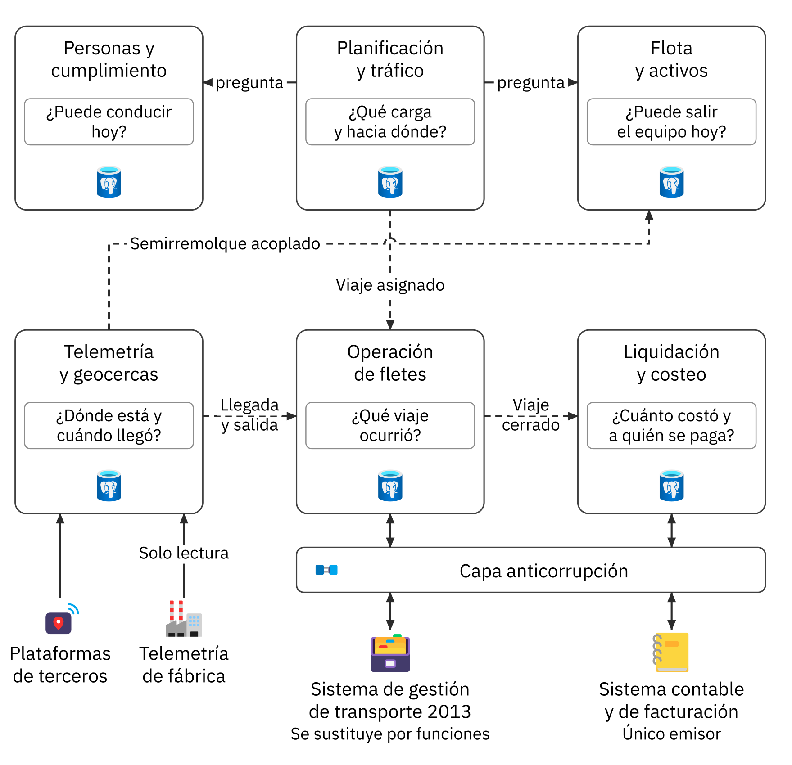
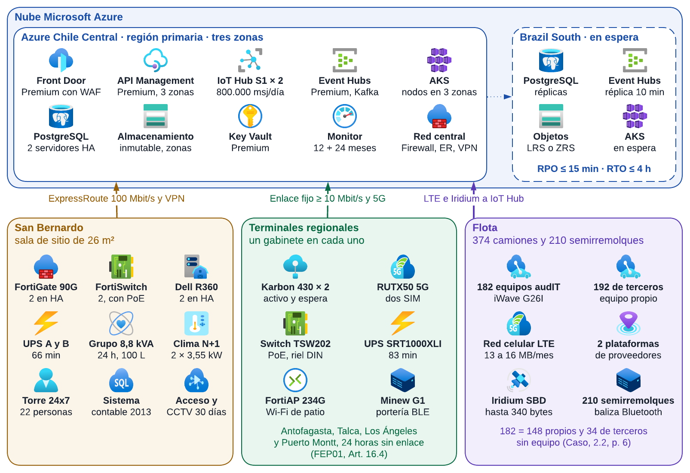
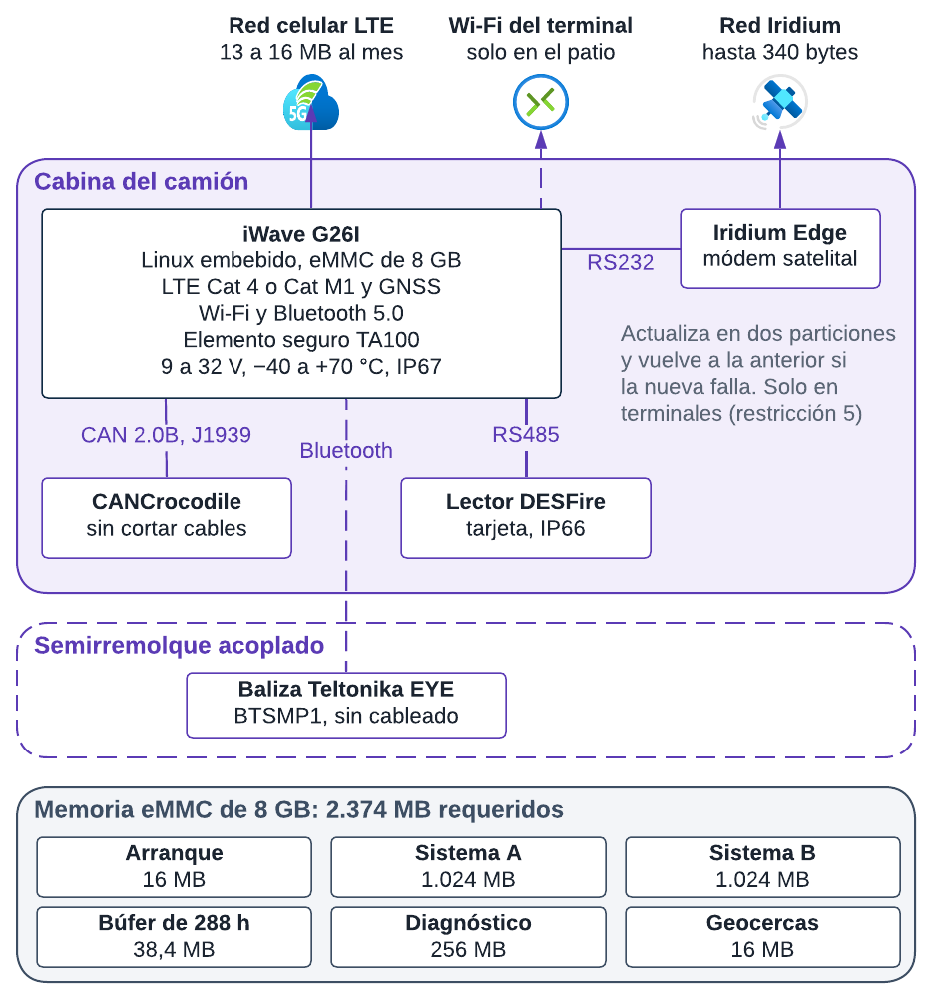
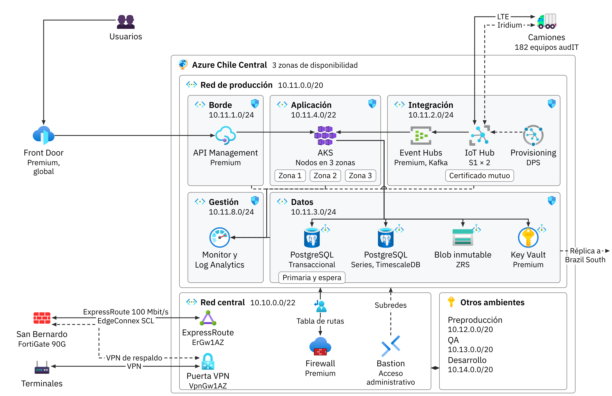
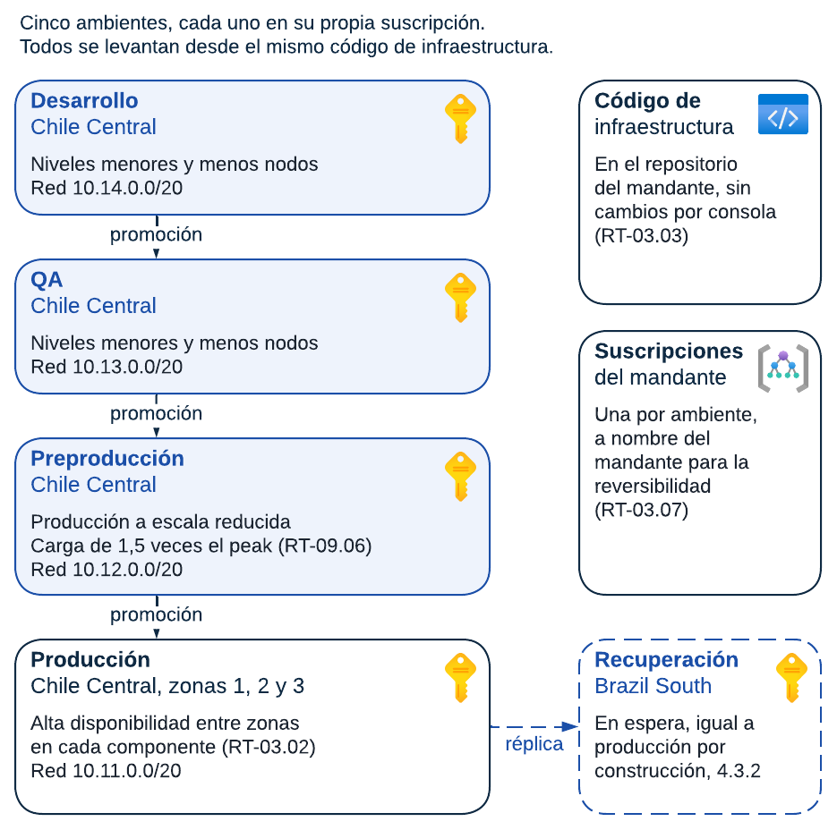
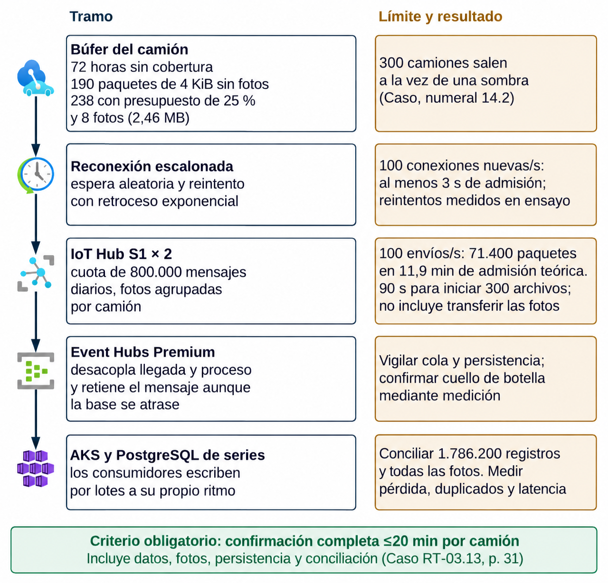
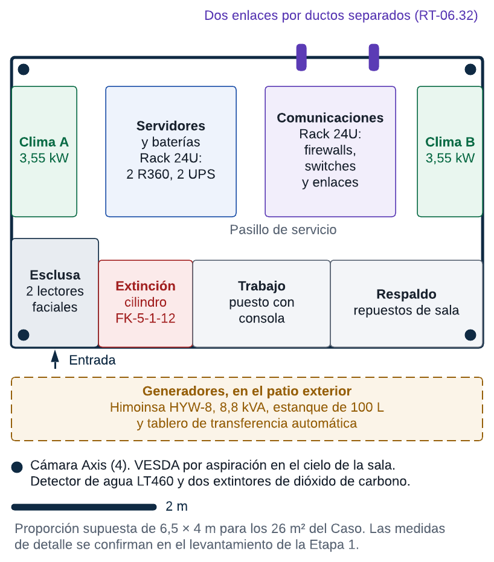
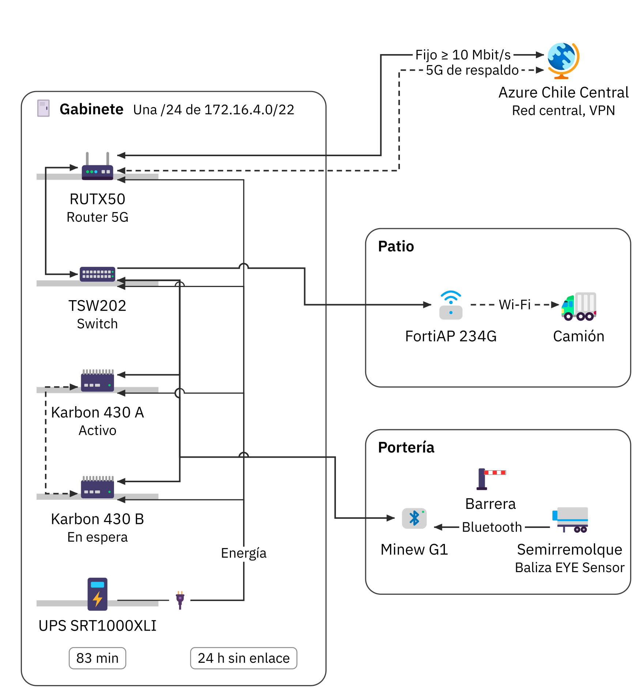
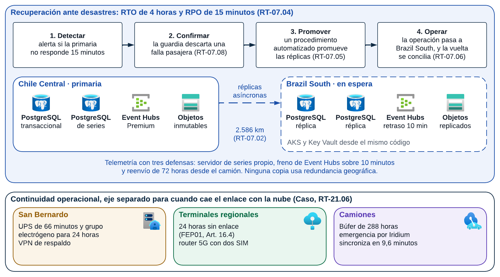

# Subdocumento 4. Arquitectura lógica y física de la solución

audIT Soluciones Tecnológicas SpA — Transportes Curimón S.A.

## Resolución de observaciones del Informe 1

El FEP01, Artículo 46, p. 28 pide resolver en cada informe las observaciones de la instancia anterior, con trazabilidad entre observación, respuesta y sección modificada. La tabla reúne las observaciones del Informe 1 que corresponden a este documento y la sección donde se resuelve cada una.

**Resolución de las observaciones del Informe 1, conforme a FEP01, Artículo 46, p. 28**

| N.º | Observación | Respuesta | Sección modificada |
|---|---|---|---|
| 03 | El Anexo A del Subdocumento 4 no es el Formulario T-11, es una tabla de emplazamiento sin cantidades ni configuración. | Se acepta. Existe una fuente formal del T-11 con fichas de componentes, cantidades y configuración. La respuesta de almacenamiento y reconexión se reconcilia con S4; disponer del archivo no acredita por sí solo conformidad de todas las fichas. | S4, formularios/T-11.tex; dimensionamiento de S4. |
| 53 | Diagrama de las 8 capas no muestra interfaces ni explica qué contiene cada capa ni cómo se conectan. | Se acepta. Se acoge la observación. La respuesta de trabajo propone la siguiente medida, cuya implementación no se acredita en este lote: «Se rediseña el diagrama de arquitectura lógica en capas con interfaces explícitas (REST, gRPC, Kafka, CDC Debezium) y descripción técnica componente a componente.». Su cierre requiere examen de la fuente y de la evidencia correspondiente; no se declara realizada esa revisión para capítulos ajenos al lote S1/S2/S9 y al cálculo de S4. | Sección 4.1.2 (Figura 4.1). |
| 54 | Componentes representados solo como íconos genéricos (terminal de torre y pantalla de terreno sin especificar). | Se acepta. Se acoge la observación. La respuesta de trabajo propone la siguiente medida, cuya implementación no se acredita en este lote: «Se individualiza cada componente: sistema operativo, software ejecutado, protocolos de enlace, roles de usuario y hardware de soporte.». Su cierre requiere examen de la fuente y de la evidencia correspondiente; no se declara realizada esa revisión para capítulos ajenos al lote S1/S2/S9 y al cálculo de S4. | Sección 4.1.2. |
| 55 | No hay matriz de requerimiento a componente; ningún RF del Subdocumento 3 se ubica en un componente. | Se acepta. La matriz requisito–componente debe cotejarse semánticamente con S3/T-12 final. La versión actual no se presenta aquí como correspondencia definitiva de todos los requisitos. | S4, trazabilidad; S3/T-12 final. |
| 56 | No se mencionan los principios SOLID, la referencia se reduce a ISO 42010 y los ambientes SDLC están ausentes. | Se acepta. Se acoge la observación. La respuesta de trabajo propone la siguiente medida, cuya implementación no se acredita en este lote: «Se fundamenta el diseño bajo principios SOLID, se estructura la vista lógica bajo ISO/IEC/IEEE 42010 y se documentan formalmente los ambientes del SDLC (Dev, QA, Staging, Producción, DR).». Su cierre requiere examen de la fuente y de la evidencia correspondiente; no se declara realizada esa revisión para capítulos ajenos al lote S1/S2/S9 y al cálculo de S4. | Sección 4.1.1 y Sección 4.1.6. |
| 57 | Diagrama de secuencia de asignación bloqueante huérfano y faltan secuencias de reconexión, emisión y liquidación. | Se acepta. Se acoge la observación. La respuesta de trabajo propone la siguiente medida, cuya implementación no se acredita en este lote: «Se vincula el diagrama al texto analítico y se agregan las secuencias de reconexión masiva tras 288 h de sombra, emisión sin cobertura y liquidación a 148 transportistas.». Su cierre requiere examen de la fuente y de la evidencia correspondiente; no se declara realizada esa revisión para capítulos ajenos al lote S1/S2/S9 y al cálculo de S4. | Sección 4.1.8. |
| 58 | Frameworks y tecnologías viven solo en las figuras; el texto no las decide ni las justifica técnicamente. | Se acepta. Se acoge la observación. La respuesta de trabajo propone la siguiente medida, cuya implementación no se acredita en este lote: «Se justifica la adopción de cada tecnología (C++/Go en borde, .NET Core/Node.js en backend, PostgreSQL/TimescaleDB) evaluando rendimiento, soporte y compatibilidad.». Su cierre requiere examen de la fuente y de la evidencia correspondiente; no se declara realizada esa revisión para capítulos ajenos al lote S1/S2/S9 y al cálculo de S4. | Sección 4.1.7. |
| 59 | El modelo táctico DDD no trae límites de contexto (*Bounded Contexts*) ni eventos de dominio. | Se acepta. Se acoge la observación. La respuesta de trabajo propone la siguiente medida, cuya implementación no se acredita en este lote: «Se formaliza el diseño táctico DDD con especificación rigurosa de Bounded Contexts, agregados, comandos de negocio y eventos de dominio transmitidos por Kafka.». Su cierre requiere examen de la fuente y de la evidencia correspondiente; no se declara realizada esa revisión para capítulos ajenos al lote S1/S2/S9 y al cálculo de S4. | Sección 4.1.5. |
| 60 | Estrangulamiento del sistema 2013 sin ADR ni comparación de alternativas ni fundamento económico. | Se acepta. Se acoge la observación. La respuesta de trabajo propone la siguiente medida, cuya implementación no se acredita en este lote: «Se formaliza el ADR-01 evaluando alternativas (Big Bang, Retiro total vs Strangler Fig) con justificación técnica de riesgos y preservación de continuidad operacional.». Su cierre requiere examen de la fuente y de la evidencia correspondiente; no se declara realizada esa revisión para capítulos ajenos al lote S1/S2/S9 y al cálculo de S4. | Sección 4.1.5 (ADR-01). |
| 61 | El descarte de la banda ancha satelital queda registrado pero no aparece como ADR formal. | Se acepta. Se acoge la observación. La respuesta de trabajo propone la siguiente medida, cuya implementación no se acredita en este lote: «Se documenta el ADR-02 justificando el descarte de terminales satelitales de alta velocidad frente al computador de borde con buffer local eMMC de 8 GB y persistencia offline.». Su cierre requiere examen de la fuente y de la evidencia correspondiente; no se declara realizada esa revisión para capítulos ajenos al lote S1/S2/S9 y al cálculo de S4. | Sección 4.1.5 (ADR-02). |
| 62 | Se afirma que el estilo arquitectónico se justifica con la volumetría sin justificarlo ni comparar estilos. | Se acepta. Se acoge la observación. La respuesta de trabajo propone la siguiente medida, cuya implementación no se acredita en este lote: «Se realiza análisis comparativo de estilos (Monolito, Microservicios, Event-Driven, SOA), fundamentando la adopción del estilo híbrido Event-Driven según la volumetría del Caso 10.». Su cierre requiere examen de la fuente y de la evidencia correspondiente; no se declara realizada esa revisión para capítulos ajenos al lote S1/S2/S9 y al cálculo de S4. | Sección 4.1.3. |
| 63 | El stack tecnológico no ha sido validado formalmente. | Se acepta. Se acoge la observación. La respuesta de trabajo propone la siguiente medida, cuya implementación no se acredita en este lote: «Se presenta la matriz del stack tecnológico validando versiones estables LTS, fechas de fin de soporte (EOL) del fabricante y pruebas de concepto de laboratorio.». Su cierre requiere examen de la fuente y de la evidencia correspondiente; no se declara realizada esa revisión para capítulos ajenos al lote S1/S2/S9 y al cálculo de S4. | Sección 4.1.7. |
| 64 | Falta diagrama de arquitectura física; la figura 1.8 son íconos y cajas sin SKU, vNets, subredes ni enlaces. | Se acepta. Se acoge la observación. La respuesta de trabajo propone la siguiente medida, cuya implementación no se acredita en este lote: «Se incorpora el diagrama de arquitectura física exhaustivo con servicios Azure, SKUs exactos, topología vNet/subredes, enlaces redundantes y dimensionamiento de ancho de banda.». Su cierre requiere examen de la fuente y de la evidencia correspondiente; no se declara realizada esa revisión para capítulos ajenos al lote S1/S2/S9 y al cálculo de S4. | Sección 4.2.1 (Figura 4.2). |
| 65 | Contradicciones en componentes Azure (Data Explorer vs Timescale/Cosmos, Kafka vs Event Hubs). | Se acepta. Se acoge la observación. La respuesta de trabajo propone la siguiente medida, cuya implementación no se acredita en este lote: «Se unifica y congela la arquitectura: Apache Kafka en clúster Strimzi sobre AKS, TimescaleDB para telemetría de series temporales y PostgreSQL para datos transaccionales.». Su cierre requiere examen de la fuente y de la evidencia correspondiente; no se declara realizada esa revisión para capítulos ajenos al lote S1/S2/S9 y al cálculo de S4. | S4 §4.2.8 y S5 §5.5. |
| 66 | La sala de servidores de 26 m² se compara ítem por ítem pero falta plano, carga eléctrica y balance térmico. | Se acepta. Se acoge la observación. La respuesta de trabajo propone la siguiente medida, cuya implementación no se acredita en este lote: «Se incorpora memoria técnica con plano de distribución en planta, consumo eléctrico estimado (kW) y balance térmico de disipación (BTU/h) de la sala técnica de Curimón S.A.». Su cierre requiere examen de la fuente y de la evidencia correspondiente; no se declara realizada esa revisión para capítulos ajenos al lote S1/S2/S9 y al cálculo de S4. | Sección 4.2.6. |
| 67 | Ningún diagrama físico se cita desde el texto analítico. | Se acepta. Se acoge la observación. La respuesta de trabajo propone la siguiente medida, cuya implementación no se acredita en este lote: «Se referencian y recorren en profundidad todos los diagramas de arquitectura física desde el texto analítico del documento.». Su cierre requiere examen de la fuente y de la evidencia correspondiente; no se declara realizada esa revisión para capítulos ajenos al lote S1/S2/S9 y al cálculo de S4. | Subdocumento 4 completo. |
| 68 | La sección 1.2.8 promete declarar cada producto con versión, fin de soporte y parches y no declara ninguno. | Se acepta. Se acoge la observación. La respuesta de trabajo propone la siguiente medida, cuya implementación no se acredita en este lote: «Se formaliza la matriz completa de hardware y software base con versión, ciclo de vida, soporte oficial y plan de actualización y parches de seguridad.». Su cierre requiere examen de la fuente y de la evidencia correspondiente; no se declara realizada esa revisión para capítulos ajenos al lote S1/S2/S9 y al cálculo de S4. | Sección 4.2.8. |
| 70 | Sin cantidades, el parque oscila entre 374 y «según adhesión» y no se explicita el no reemplazo de terceros. | Se acepta. Se acoge la observación. La respuesta de trabajo propone la siguiente medida, cuya implementación no se acredita en este lote: «Se congelan las cantidades del parque: 374 camiones (148 propios retrofiteados con audIT EdgeHub v2.4, 192 terceros homologados por API y 34 terceros sin GPS equipados por audIT con pinzas CANclick).». Su cierre requiere examen de la fuente y de la evidencia correspondiente; no se declara realizada esa revisión para capítulos ajenos al lote S1/S2/S9 y al cálculo de S4. | Sección 4.2.2 y Anexo A. |
| 71 | Se afirma que hay 18 componentes en la región primaria y la tabla suma 20; la matriz cubre 14 de 34. | Se acepta. Se acoge la observación. La respuesta de trabajo propone la siguiente medida, cuya implementación no se acredita en este lote: «Se corrigen los conteos de componentes cloud y se cuadra al 100 % la matriz de infraestructura y servicios de la región primaria.». Su cierre requiere examen de la fuente y de la evidencia correspondiente; no se declara realizada esa revisión para capítulos ajenos al lote S1/S2/S9 y al cálculo de S4. | Sección 4.2.4 y Anexo A. |
| 72 | La región secundaria no tiene nombre y el Artículo 16.3 exige declararla formalmente. | Se acepta. Se acoge la observación. La respuesta de trabajo propone la siguiente medida, cuya implementación no se acredita en este lote: «Se formaliza a Brazil South (São Paulo) como la región secundaria de contingencia y réplica de datos de audIT SpA, en estricto cumplimiento del Art. 16.3.». Su cierre requiere examen de la fuente y de la evidencia correspondiente; no se declara realizada esa revisión para capítulos ajenos al lote S1/S2/S9 y al cálculo de S4. | S4 §4.2.5 y S5 §5.9. |
| 73 | Los 8 GB del dispositivo embarcado no tienen cálculo; la derivación da 10 MB y 288 h dan cerca de 40 MB. | Se acepta. Se deriva el perfil de 72 h: 4.104 posiciones, 1.800 muestras de motor, 45 eventos y cinco documentos, 777.656 bytes sin fotos y 3.237.656 con ocho fotos. La ampliación propuesta 288 h suma 12.950.624 bytes brutos; overhead físico y reserva elevan el presupuesto a 38.851.872 bytes y se asignan 64 MiB. Sistemas A/B, arranque, diagnóstico y maestros llevan el total a 2.400 MiB (2,52 GB decimales). Capacidad útil, ocupación e integridad se verifican en HIL, sin presuponer compresión o equiparar cierre vial con desconexión. | S4, capacidad de almacenamiento y dimensionamiento; T-11; T-17 CP-HW-03. |
| 74 | La sincronización en 20 min por camión se repite como requisito y no se dimensiona ante reconexión masiva. | Se acepta. El perfil simultáneo usa 300 camiones, 1.786.200 registros y 971.296.800 bytes con fotos. Se calculan 6,48 Mbit/s útiles mínimos; con 25 % de transporte y 20 % de reserva temporal, 10,12 Mbit/s. Dos unidades S1 permiten estimar admisión de 71.400 paquetes en 11,9 min; no demuestra transferencia/persistencia. CP-PERF-02 mide confirmación completa y conciliación por camión en hasta veinte minutos. | S4, dimensionamiento y figura de reconexión; T-11; T-17 CP-PERF-02. |
| 75 | Ausentes eventos/segundo, TPS peak de asignación, volumen anual, datos a migrar y ancho de banda. | Se acepta. S4 mantiene el modelo de volumetría y el lote de reconexión con hipótesis explícitas. Concurrencia (380 nominal/570 estrés) y 450 viajes/día representan magnitudes distintas. Cinco años de viajes deben migrarse; la cantidad histórica se levanta y no se afirma que sean 480.000 registros. El cierre del mapa de requisitos se coteja con S3 final. | S4, dimensionamiento; S2, supuestos; T-17, perfiles de carga. |
| 77 | El equipo de TI de 9 personas no se menciona y el RT-03.05 se cita sin listar los servicios administrados. | Se acepta. Se acoge la observación. La respuesta de trabajo propone la siguiente medida, cuya implementación no se acredita en este lote: «Se modela la interacción operativa con el equipo de TI de 9 personas de Curimón S.A. y se detallan los servicios administrados provistos por audIT SpA bajo RT-03.05.». Su cierre requiere examen de la fuente y de la evidencia correspondiente; no se declara realizada esa revisión para capítulos ajenos al lote S1/S2/S9 y al cálculo de S4. | Sección 4.2.8. |
| 78 | Se tratan los 3 proveedores GPS y 34 camiones sin equipo pero no se dice qué se instala ni cómo conviven. | Se acepta. Se acoge la observación. La respuesta de trabajo propone la siguiente medida, cuya implementación no se acredita en este lote: «Se especifica la arquitectura de coexistencia: capa de integración API (ACL) para Wialon/Wisetrack, e instalación de audIT EdgeHub v2.4 con pinzas CANclick en los 34 tractos desprovistos.». Su cierre requiere examen de la fuente y de la evidencia correspondiente; no se declara realizada esa revisión para capítulos ajenos al lote S1/S2/S9 y al cálculo de S4. | Sección 4.2.2. |
| 79 | La recuperación ante desastres y continuidad se separan con argumento sísmico sin justificar factibilidad. | Se acepta. Se acoge la observación. La respuesta de trabajo propone la siguiente medida, cuya implementación no se acredita en este lote: «Se fundamenta la factibilidad técnica y latencia ($<50\text{ ms}$) del enlace hacia Brazil South, garantizando el cumplimiento estricto del RTO $\le 4\text{ h} y RPO \le 15\text{ min}$.». Su cierre requiere examen de la fuente y de la evidencia correspondiente; no se declara realizada esa revisión para capítulos ajenos al lote S1/S2/S9 y al cálculo de S4. | Sección 4.2.5. |
| 80 | Los respaldos aparecen en una sola fila y no hay modelo Zero Trust explícito ni superficie de exposición. | Se acepta. Se acoge la observación. La respuesta de trabajo propone la siguiente medida, cuya implementación no se acredita en este lote: «Se diseña la arquitectura de ciberseguridad: modelo Zero Trust, microsegmentación de subredes, Azure Bastion, WAF y almacenamiento inmutable WORM.». Su cierre requiere examen de la fuente y de la evidencia correspondiente; no se declara realizada esa revisión para capítulos ajenos al lote S1/S2/S9 y al cálculo de S4. | Sección 4.2.7. |

Este capítulo describe cómo se construye la Plataforma Digital de Misión Crítica para Transporte de Carga: con qué piezas de software se organiza
la solución y en qué equipos, sitios y regiones de nube corre cada una. La sección 4.1 presenta la
arquitectura lógica, sus ocho capas, sus seis contextos delimitados y sus decisiones registradas, y la
4.1.1 las tecnologías de software. La sección 4.2 ubica cada componente en la nube, en San Bernardo,
en los cuatro terminales regionales y en los camiones, declara los enlaces y los puntos únicos de
falla, y dimensiona la ingesta de datos y la reconexión masiva. La sección 4.3 declara los dos
centros de datos: Azure Chile Central como región primaria, con la sala de San Bernardo como sitio de
continuidad, y Azure Brazil South como región secundaria.

El capítulo parte del esquema de solución del Subdocumento 3 y del catálogo de requerimientos de su
Formulario T-12. Se apoya en el modelo de datos del Subdocumento 5, que define dónde reside cada dato
y cómo se respalda. Los riesgos que abre la infraestructura, como el apagado de las redes 2G y 3G o el
retraso de una réplica, se tratan en el Subdocumento 8, y el ritmo de instalación a bordo en el plan
de trabajo del Subdocumento 7. La innovación tecnológica del Subdocumento 13 usa el Bluetooth del
equipo a bordo que se especifica aquí. Lo que el mandante compra, con cantidades y características, se
detalla en el Formulario T-11, que acompaña este capítulo como archivo propio
(`AUDIT-Formulario-T-11.pdf`), conforme al Comunicado 10, sección 1.

## 4.1 Arquitectura lógica

El Capítulo 5 del Caso resume el problema en una frase. El sistema de gestión de transporte de 2013
conoce el viaje que la compañía encargó y no conoce el viaje que efectivamente ocurrió
(Caso, capítulo 5, p. 13). El dato existe repartido en tres plataformas de posicionamiento, en una
telemetría que nadie descarga, en una liquidación de combustible que llega con cuarenta días de
atraso y en papeles que viajan en la cabina, y nunca se junta. Esa dispersión no se corrige
configurando el sistema existente, porque nace de cómo está construido.

### 4.1.1 Especificaciones Tecnologías de Software a utilizar

Cada producto ofertado se declara con su versión, su fecha de fin de soporte del fabricante y su plan
de actualización para los 56 meses del contrato. FEP02, RT-03.05, p. 8 obliga a privilegiar servicios
administrados sobre autoadministrados cuando ello reduzca el riesgo operacional y a justificar cada
excepción. El estilo arquitectónico se justifica con la volumetría del caso y no con la tendencia del
mercado, tal como advierte el numeral 2.3 de las Bases Técnicas Transversales. En la Tabla 4.1
se especifica la matriz tecnológica oficial seleccionada para la solución.

**Tabla 4.1.** Tecnologías de software, versiones y soporte ofertado a 56 meses

| Componente | Producto y versión | Fin de soporte | Plan a 56 meses y justificación |
|---|---|---|---|
| Aplicación móvil de conductores | Flutter 3.x (Dart) | Soporte LTS continuo | Compilación nativa Android e iOS con interfaz ergonómica de alto contraste (Caso, RT-13.08, p. 32) y almacenamiento local SQLite |
| Portales web y torre de control | React 18+ / Next.js | Soporte LTS continuo | Arquitectura web modular responsiva con renderizado híbrido y accesibilidad WCAG 2.2 AA (FEP01, Artículo 4.3, p. 5) |
| Servicios backend y APIs | .NET 8 LTS / Go 1.22+ | Noviembre 2026 / LTS | Microservicios contenerizados de alto rendimiento sobre Linux en imágenes sin herramientas sobrantes |
| Orquestación y cómputo | AKS 1.30+ | Soporte N-2 continuo | Servicio administrado PaaS con actualizaciones programadas fuera de horario punta |
| Motor transaccional | PostgreSQL 16 Flexible | Noviembre 2028 | Motor relacional con alta disponibilidad zonal y extensión geoespacial PostGIS |
| Series temporales y eventos | TimescaleDB 2.15 / Event Hubs | Mayo 2029 | Particionamiento por rango temporal y compresión columnar para el flujo de telemetría |
| Caché distribuida | Azure Cache for Redis 7.2 | Octubre 2028 | Almacenamiento en memoria con persistencia continua para geocercas y sesiones activas |
| Persistencia a bordo | SQLite 3 con modo WAL | Soporte activo LTS | Motor embebido industrial sobre memoria flash de 8 GB con protección contra cortes de energía |
| Lakehouse analítico | Delta Lake en ADLS Gen2 | Soporte activo continuo | Tablas con soporte ACID y aislamiento estricto respecto de la base transaccional |
| Gestión de identidad | Microsoft Entra ID / Key Vault | Servicio administrado | Autenticación OAuth 2.0 y custodia criptográfica con certificación FIPS 140-2 Nivel 3 |

*Fuente: Ciclos de vida oficiales de soporte (LTS) de los fabricantes.*

La matriz de la Tabla 4.1 prioriza servicios administrados y plataformas con soporte de largo plazo garantizado, asegurando estabilidad operativa y ausencia de obsolescencia tecnológica durante la vigencia del contrato.

### 4.1.2 Punto de partida

Los rasgos del sistema de 2013 que explican esa dispersión y la respuesta que da esta arquitectura a
cada uno se resumen en la Tabla 4.2.

**Tabla 4.2.** Rasgos del sistema de 2013 y respuesta de esta arquitectura

| Rasgo | Efecto que produce hoy | Respuesta de esta arquitectura |
|---|---|---|
| Base única compartida por tráfico, facturación y contabilidad | La consulta de gestión compite con la operación de la torre por el mismo motor | Separación del almacenamiento transaccional y del analítico, obligatoria por RT-05.05 |
| Integración con el sistema contable por consultas y tablas compartidas | Todo cambio contable alcanza el núcleo operacional sin traducción | Capa anticorrupción, obligatoria por RT-05.20 |
| Ausencia de costo por kilómetro por ruta | Tres de los ocho contratos principales se sirven bajo costo, el peor a menos catorce por ciento sostenido durante cuatro años (Caso, numeral 7.3, p. 15) | Costo por viaje en doble versión, preliminar y consolidada |
| Puerto de telemetría de fábrica inactivo | La lectura del motor de 61 tractocamiones no se aprovecha por temor a la garantía | Acoplamiento sin contacto sobre el arnés original |
| Módulos operativos acoplados entre sí | El sistema no distingue el viaje encargado del viaje ocurrido | Seis contextos delimitados, cada uno con sus propios datos |

*Fuente: Bases Técnicas del Caso, capítulos 5 y 7.*

Cada rasgo de la tabla tiene una respuesta estructural propia. Ninguna se resuelve configurando el
sistema existente.

### 4.1.3 Las ocho capas

La solución se organiza en las ocho capas del modelo de referencia, cuya existencia es obligatoria
conforme al FEP02, numeral 2.1, p. 6. RT-02.01 exige el diagrama que identifica cada capa, sus
componentes y las interfaces entre ellas, y la descripción se ajusta a ISO/IEC/IEEE 42010
(ISO, 2022). La Tabla 4.3 resume el contenido de cada capa.

**Tabla 4.3.** Las ocho capas y su contenido en esta solución

| Capa | Contenido |
|---|---|
| Presentación | Portal web para 84 clientes y 148 transportistas, aplicación móvil, terminales de torre y taller, pantallas de terreno operables con guantes |
| Borde y exposición | Distribución de contenidos, cortafuegos de aplicación, balanceo y terminación de cifrado. Único punto de entrada público |
| Puerta de enlace | Autenticación, autorización, cuotas, límites de tasa, versionado semántico y catálogo de servicios |
| Servicios de negocio | Seis contextos delimitados con límites explícitos, sin estado y desplegables de forma independiente |
| Integración y eventos | Bus de telemetría, bus transaccional, cola de mensajes fallidos, reintento y deduplicación |
| Datos | Persistencia políglota. Transaccional, series de tiempo, documental inmutable y analítica separadas |
| Seguridad | Identidad, autorización, gestión de secretos, cifrado y auditoría. Transversal a todas las capas |
| Observabilidad | Métricas, registros y trazas correlacionadas, sin puntos ciegos entre nube y terreno |

*Fuente: Bases Técnicas Transversales, numeral 2.1, y elaboración propia.*

Ninguna interfaz accede directamente a la base de datos. Una petición desciende atravesando las seis
capas de la pila y la respuesta asciende por el mismo camino. Seguridad y observabilidad no ocupan un
lugar en esa pila, la atraviesan entera. Los componentes declarados en cada capa se listan en la
Tabla 4.4.

**Tabla 4.4.** Componentes declarados por capa

| Capa | Componentes |
|---|---|
| Presentación | Portal web con representación en servidor, aplicación móvil en los cuatro perfiles que exige RT-17.01 del Caso, conductor, torre, terminal y taller, y transportista subcontratado, y vistas de portería y de taller de alto contraste |
| Borde y exposición | Distribución de contenidos con presencia global, cortafuegos de aplicación y protección volumétrica en las capas de red, transporte y aplicación |
| Puerta de enlace | Gestión de interfaces con identidad federada, certificado mutuo entre máquinas, límites de tasa por perfil y catálogo publicado |
| Servicios de negocio | Contenedores orquestados sobre nodos repartidos en tres zonas de disponibilidad, con un despliegue independiente por contexto delimitado |
| Integración y eventos | Flujo de telemetría para la ingesta masiva, bus transaccional con orden garantizado dentro de la partición y cola de mensajes fallidos, y capa anticorrupción frente al sistema contable |
| Datos | Motor relacional multizona, base de series de tiempo, caché en memoria, almacenamiento inmutable y repositorio analítico. El diseño detallado es materia del Subdocumento 5 |
| Seguridad | Bóveda de claves en módulo criptográfico, identidad federada con control por rol y por atributo, y bitácora que permite reconstruir quién, qué, cuándo y con qué valores anteriores, según RT-05.03 |
| Observabilidad | Instrumentación única con trazas, métricas y registros correlacionados por el identificador común que RT-05.19 exige a toda integración |

*Fuente: elaboración propia.*

La Figura 4.1 dibuja las ocho capas con sus componentes.

*Figura 4.1. Las ocho capas obligatorias del numeral 2.1 transversal, con sus componentes e interfaces, conforme a RT-02.01*

Fuente: Elaboración propia.

La figura muestra la pila de seis capas y las dos capas transversales. Las capas de servicios y de
datos existen además a bordo del camión, en versión reducida, para operar sin enlace.

### 4.1.4 Los seis contextos delimitados

RT-02.02 rechaza toda arquitectura monolítica que no permita desplegar de forma independiente sus
componentes críticos. Los servicios de negocio se organizan en seis contextos, cada uno con su propio
lenguaje y sus propios datos. Un contexto no consulta la base de datos de otro, le pregunta. La
Tabla 4.5 declara qué decide cada uno.

**Tabla 4.5.** Contextos delimitados y la decisión que sostiene cada uno

| Contexto | Qué decide |
|---|---|
| Planificación y tráfico | Qué carga hay que mover y hacia dónde |
| Flota y activos | Si el equipo puede salir hoy |
| Personas y cumplimiento | Si la persona puede conducir hoy |
| Telemetría y geocercas | Dónde está el camión y cuándo llegó |
| Operación de fletes | El viaje que realmente ocurrió |
| Liquidación y costeo | Cuánto costó y a quién se paga |

*Fuente: elaboración propia.*

El sistema de gestión de 2013 mezcla los seis, y esa es la razón de fondo por la que conoce el viaje
que se encargó y no conoce el viaje que ocurrió. La Figura 4.2 muestra los seis contextos
y los sistemas con los que conviven.

*Figura 4.2. Contextos delimitados del dominio y sistemas con los que convive la solución*

Fuente: Elaboración propia.

En la figura, cada contexto tiene su propio lenguaje y sus propios datos. Despacho puede bloquear un
viaje sin conocer por dentro a Personas ni a Flota, porque les pregunta.

### 4.1.5 Convivencia con lo que ya existe

RT-05.20 obliga a aislar mediante una capa anticorrupción las integraciones con sistemas heredados o
de terceros, de modo que un cambio en el sistema externo no propague su modelo al núcleo. Esa capa
sustituye los módulos operativos de 2013, tráfico, despacho, tarifas y liquidación, y encapsula el
sistema contable, que se conserva como único emisor de documentos tributarios.

### 4.1.6 Registro de decisiones de arquitectura

RT-02.04 y el FEP01, Artículo 19, p. 14 convierten el registro de decisiones en entregable contractual, con la
alternativa escogida, las descartadas y el criterio de selección. Se registran cuatro decisiones
estructurales de la arquitectura lógica en la Tabla 4.6.

**Tabla 4.6.** Decisiones de arquitectura lógica registradas (ADR 01 a 04)

| ADR | Fecha | Contexto | Decisión | Alternativa descartada | Criterio y consecuencias |
|---|---|---|---|---|---|
| ADR-01 | 2026-08-14 | Ráfagas masivas de telemetría concurrente con la operación de despacho | Contenedores orquestados en AKS con microservicios desacoplados | Monolito modular con escalado vertical | Aislamiento estricto de fallas. La ingesta masiva no degrada el despacho |
| ADR-02 | 2026-08-18 | Asignación de viaje dispara geocercas, alertas, costeo y notificación | Arquitectura dirigida por eventos con Azure Event Hubs / Kafka | Cadena síncrona de llamadas HTTP REST | Desacoplamiento temporal. Despacho confirma en sub-2s sin esperar procesos derivados |
| ADR-03 | 2026-08-22 | Finanzas requiere costeo consolidado sin afectar latencia transaccional | Captura de datos en cambio (CDC) y Lakehouse Delta Lake | Consultas analíticas sobre réplica de lectura transaccional | RT-05.05 prohíbe degradar OLTP. Aislamiento total de analítica pesada |
| ADR-04 | 2026-08-27 | Seguridad federada para clientes, transportistas y ERP 2013 | Autenticación mTLS, OAuth 2.0 y Entra ID federado | Tokens estáticos o API keys compartidas en URL | RT-05.18 prohíbe credenciales en URI. Rotación automática y Zero Trust |

*Fuente: elaboración propia.*

Estas cuatro son las decisiones estructurales de la capa lógica. El registro completo es entregable
contractual y se actualiza durante toda la ejecución, según ordena el mismo RT-02.04.

### 4.1.7 Degradación, escalamiento y puntos únicos de falla

Tres requisitos obligatorios de la misma sección exigen declaraciones que conviene no dejar
implícitas. RT-02.09 obliga a degradar de forma elegante, de modo que la caída de un componente no
crítico deje la solución operando en modo reducido y avisando de la degradación, y nunca falle de
forma total. La aplicación de esa regla en esta operación es directa. Si el repositorio analítico no
responde, la torre sigue despachando. Si el sistema contable no responde, la operación sigue y la
emisión tributaria se encola. Si el enlace satelital no está disponible, el registro sigue
acumulándose a bordo.

RT-02.10 exige que las capas de aplicación e integración escalen horizontalmente de forma automática,
con umbrales, límites superiores y costo asociado declarados en la oferta. Los umbrales y los límites
se declaran en esta sección. El costo asociado se remite al Sobre N.º 3, porque el FEP01, Artículo 50.2, p. 29
excluye toda cifra de precio de la Oferta Técnica.

RT-02.11 evalúa como observación grave omitir la declaración de los puntos únicos de falla que
subsistan. Esta oferta declara dos en la capa lógica, que se listan en la Tabla 4.7.

**Tabla 4.7.** Puntos únicos de falla declarados en la capa lógica

| Punto | Por qué subsiste | Por qué es aceptable |
|---|---|---|
| El sistema contable de 2013 como emisor único de documentos tributarios | La restricción 8 lo fija y no es negociable | La capa anticorrupción aísla su indisponibilidad. La operación no se detiene y la emisión se recupera al restablecerse |
| El dispositivo a bordo de cada camión | Hay uno por unidad y solo puede intervenirse cuando el camión pasa por un terminal, según RT-06.01 del Caso | La falla afecta a una unidad y no a la flota. Se mitiga con repuestos precargados y con el procedimiento supletorio de la sección 4.3.2 |

*Fuente: elaboración propia sobre el Caso, capítulo 10 y RT-06.01.*

Los puntos únicos de falla de la infraestructura física se analizan en la sección 4.2.7.

### 4.1.8 Resiliencia

Los servicios de negocio son sin estado, con el estado de sesión y de proceso en almacenes externos de
alta disponibilidad. Los patrones de RT-02.08 son obligatorios y esta oferta los adopta. Tiempos
límite explícitos en toda llamada remota, cortacircuitos y mamparos para aislar fallas de
integraciones externas, y reintento exponencial con variación aleatoria. La escritura es idempotente
con ventana de deduplicación dimensionada para tolerar la desconexión prolongada en ruta.

El estado de sesión y el estado de proceso residen en almacenes externos de alta disponibilidad, como
exige RT-02.05. Allí viven las sesiones concurrentes de los 22 operadores de la torre, las credenciales
activas y las geocercas de los 1.400 puntos distintos de carga y descarga que declara el
Caso, numeral 14.1, p. 29. Cualquier instancia puede destruirse y reemplazarse sin pérdida de
transacciones en curso. Los parámetros de la Tabla 4.8 son de diseño de audIT y se ajustan
con la medición de la Etapa 1.

**Tabla 4.8.** Parámetros de los patrones de resiliencia

| Patrón | Parámetro declarado |
|---|---|
| Cortacircuito | Se abre al superarse la mitad de las llamadas fallidas en una ventana deslizante de diez peticiones, permanece abierto 30 segundos y admite tres llamadas de prueba antes de restablecer el tráfico |
| Mamparo | La verificación bloqueante del despacho tiene su propio conjunto de hilos y de conexiones. La saturación de la consulta de liquidaciones o de reportes no le quita capacidad |
| Tiempo de espera | Validación en memoria, 800 milisegundos. Consulta transaccional del despacho, 5 segundos. Llamada al sistema contable a través de la capa anticorrupción, 10 segundos. Emisión del documento electrónico de transporte, 90 segundos, que es el techo que fija RT-09.01 del Caso |
| Reintento | Tres intentos sobre operaciones idempotentes, con retroceso exponencial y variación aleatoria. La variación evita que cientos de unidades que recuperan cobertura a la vez reintenten sincronizadas |
| Límite de tasa | Declarado por perfil en la puerta de enlace, según se detalla en la gobernanza de interfaces |

*Fuente: elaboración propia sobre RT-02.08 y RT-09.01 del Caso.*

Los tiempos de espera escalonan desde la validación en memoria hasta el techo de 90 segundos del Caso,
de modo que ninguna llamada lenta consume el presupuesto de la verificación bloqueante.

### 4.1.9 Verificación bloqueante del despacho

Caso, RT-09.01, p. 32 fija en 30 segundos el tope para asignar un viaje con verificación de jornada,
habilitaciones y aptitud del equipo. El servicio evalúa en paralelo las tres invariantes de la
Tabla 4.9, y ninguna admite excepción automática.

**Tabla 4.9.** Invariantes de la verificación bloqueante

| Invariante | Qué comprueba | Fundamento |
|---|---|---|
| Conductor | Horas conducidas en el día, continuidad sin descanso y acumulado del período | Artículo 25 bis del Código del Trabajo (Ministerio del Trabajo, 2003) |
| Tractocamión | Revisión técnica aprobada, seguro obligatorio vigente y permiso de circulación al día | Numeral 4.4 del Caso |
| Semirremolque y carga peligrosa | Curso vigente del conductor y correspondencia entre la documentación y lo efectivamente cargado | Decreto Supremo N.º 298 (Ministerio de Transportes, 1995) |

*Fuente: elaboración propia sobre la normativa citada.*

La secuencia bloquea la clave de idempotencia, evalúa las tres invariantes en paralelo, persiste en
una única transacción y responde. El presupuesto de tiempo de cada paso se reparte en la
Tabla 4.10.

**Tabla 4.10.** Reparto del presupuesto de 30 segundos

| Paso | Presupuesto | Dónde se resuelve |
|---|---|---|
| Validación del contrato de entrada y bloqueo de la clave de idempotencia | 10 milisegundos | Puerta de enlace y caché en memoria |
| Evaluación paralela de las tres invariantes | 450 milisegundos | Caché en memoria, con respaldo en el motor transaccional |
| Persistencia atómica del viaje asignado | 200 milisegundos | Motor transaccional, aislamiento serializable |
| Publicación de los efectos derivados | Fuera del camino bloqueante | Bus transaccional |
| Total comprometido | Por debajo de 2 segundos | Frente al techo de 30 segundos de RT-09.01 del Caso |

*Fuente: elaboración propia.*

Ante rechazo el sistema responde en menos de un segundo con un documento de error estructurado que
nombra la invariante incumplida, de modo que el operador sepa qué falta y no reintente a ciegas. Los
campos de ese documento se listan en la Tabla 4.11.

**Tabla 4.11.** Contenido del documento de error ante un despacho rechazado

| Campo | Contenido |
|---|---|
| Tipo | Identificador estable de la causal, resoluble a su documentación |
| Título | Enunciado breve de la invariante incumplida |
| Estado | Código que distingue el rechazo por regla de negocio del error técnico |
| Detalle | Valor medido y umbral aplicado, para que el operador sepa cuánto falta |
| Instancia | Identificador del viaje y del intento de asignación, correlacionable con la bitácora |

*Fuente: elaboración propia.*

El presupuesto se cumple con holgura porque la evaluación ocurre sobre datos en memoria. Esa holgura es
deliberada. RT-09.03 obliga a soportar tres veces la volumetría inicial sin rediseño, y un margen
estrecho hoy sería un rediseño mañana. La Figura 4.3 muestra los patrones de resiliencia
y el flujo de la asignación bloqueante.

*Figura 4.3. Patrones de resiliencia y flujo de la asignación bloqueante*

Fuente: Elaboración propia.

La figura sigue la asignación desde la puerta de enlace hasta la persistencia, con los mamparos y
cortacircuitos que la separan de las integraciones externas.

### 4.1.10 Idempotencia y ventana de deduplicación

RT-02.06 exige escrituras idempotentes. Cada operación lleva una clave única que se retiene durante
siete días, plazo dimensionado para cubrir las 72 horas de desconexión más el margen de los cierres
prolongados del paso fronterizo. La clave se bloquea en el almacén en memoria y se respalda con una
restricción de unicidad duradera en el motor transaccional, de modo que un reintento tras la
reconexión masiva no duplica un viaje ni un documento.

La ventana opera en dos niveles con propósitos distintos. El nivel en memoria resuelve la concurrencia
inmediata. Si la clave ya está tomada y la operación sigue en curso, la petición se rechaza como
conflicto. Si ya se completó, se devuelve la respuesta guardada en lugar de repetir la escritura. El
nivel duradero resuelve el caso que importa aquí, el mensaje que llega desde el búfer de un camión
después de días sin cobertura, cuando la clave ya expiró en memoria. La restricción de unicidad lo
descarta sin importar cuánto tiempo pasó. RT-02.07 exige además deduplicación en el consumidor y orden
garantizado dentro de la partición, y ambos se aplican al flujo de telemetría.

### 4.1.11 Gobernanza de interfaces y contratos

FEP02, RT-05.16, p. 12 obliga a documentar los servicios síncronos en OpenAPI 3.1 y los flujos dirigidos
por eventos en AsyncAPI 2.6 o superior, y exige que esa documentación se genere desde el código y se
mantenga actualizada de forma automática. La consecuencia práctica es que no se admite discrepancia
entre el contrato publicado y la implementación viva, porque el contrato no se escribe aparte.
A modo representativo, el servicio síncrono de verificación bloqueante pre-despacho expone el contrato
`POST /api/v1/despacho/validar` documentado bajo OpenAPI 3.1, recibiendo en su esquema JSON
los identificadores del viaje (`viajeId`), conductor (`conductorRut`), tracto
(`patenteTracto`), rampla (`patenteRampla`) y carga (`codigoSUSPEL`), retornando el
veredicto (`autorizado`), latencia de validación (`latenciaMs`) y la bitácora auditable de
factores. En paralelo, el evento asíncrono de notificación de salida se formaliza bajo AsyncAPI 2.6
en el canal de eventos de operaciones, transportando payloads en formato CloudEvents con firma HMAC-SHA256.

RT-05.17 obliga a versionar semánticamente los contratos, con compatibilidad hacia atrás y política de
obsolescencia con preaviso mínimo de seis meses. RT-05.18 fija el mecanismo de autenticación entre
sistemas y prohíbe la clave estática en la ruta de la dirección web. RT-05.19 exige registrar la
transacción de entrada y la de salida de toda integración con un identificador de correlación común,
que es lo que permite seguir una operación de negocio a través de todos los sistemas que toca. Ese
identificador es el mismo que usa la capa de observabilidad.

RT-05.21 obliga a declarar, por cada integración, el modo, el volumen esperado, la ventana de
disponibilidad de la contraparte y el comportamiento de la solución cuando esa contraparte no
responde. Esa declaración se entrega en la Tabla 4.12.

**Tabla 4.12.** Declaración por integración conforme a RT-05.21

| Contraparte | Modo | Volumen esperado | Ventana de la contraparte | Si no responde |
|---|---|---|---|---|
| Sistema contable de 2013 | Asíncrono | Documentos y asientos de 96.000 viajes al año | Horario administrativo, sin compromiso 24x7 | Cortacircuito y encolado. La operación no se detiene |
| Plataformas de posicionamiento de terceros | Asíncrono | Posición de los camiones de terceros con dispositivo | No declarada por el Caso | Última posición conocida con su antigüedad visible, nunca una posición sin fecha |
| Telemetría de fábrica | Asíncrono | 61 tractocamiones, solo lectura | Sujeta a la autorización de cada fabricante | El viaje se registra igual con el dispositivo a bordo |
| Red de estaciones de servicio | Por lotes | 74.000 abastecimientos al año | Mensual, con hasta 40 días de desfase | El costo se emite preliminar y se marca como pendiente |
| Concesionarias de peaje | Por lotes | 620.000 pasadas al año | Mensual | Peaje estimado por la traza, marcado como estimado |
| Autoridad tributaria | Síncrono | 128.000 documentos al año | Según disponibilidad del servicio | Emisión de contingencia y envío diferido |
| Clientes y autoridad aduanera | Ambos | Según contrato y cruce | Variable | Reintento con retroceso y aviso a la torre |

*Fuente: Caso, numeral 14.1, p. 29, y elaboración propia.*

Los volúmenes de esta tabla provienen del Caso, numeral 14.1, p. 29. La ventana de disponibilidad de las
plataformas de terceros y de la autoridad tributaria no está declarada en las bases y se consulta al
mandante. RT-05.22 exige además carga y descarga masiva en formatos abiertos, con validación previa,
informe de errores por registro y procesamiento parcial. Esa capacidad es la que sostiene la migración
de las cerca de 6.000 vigencias y la ingesta mensual de combustible y peajes. La
Figura 4.4 dibuja el mapa de integraciones.

*Figura 4.4. Mapa de integraciones. Sistemas internos, fuentes de terreno y contrapartes externas*

Fuente: Elaboración propia.

El sistema contable y de facturación heredado de 2013 se preserva íntegramente como único emisor tributario legal, integrándose a través de la Capa Anticorrupción (ACL), mientras que las funciones operacionales de tráfico, despacho y liquidación se desacoplan gradualmente mediante el patrón Estrangulador (Strangler Fig).

### 4.1.12 Convivencia con el sistema contable heredado

La capa anticorrupción sustituye los módulos operativos de 2013, tráfico, despacho, tarifas y
liquidación, y encapsula el sistema contable, que se conserva como único emisor de documentos
tributarios. El aislamiento es bidireccional. Un cambio en el sistema externo no propaga su modelo al
núcleo, y el núcleo no escribe directamente sobre el legado.

RT-02.14 valora la aplicación documentada de patrones de arquitectura evolutiva que permitan
sustituir un componente sin reescribir la solución, y nombra tres. Esta oferta aplica los tres. La capa
anticorrupción frente al sistema heredado, el estrangulamiento progresivo con que los módulos
operativos de 2013 se van sustituyendo función por función en lugar de en un corte único, y la
abstracción de proveedores, que es lo que permite declarar la estrategia de reversibilidad que exige
RT-03.07. Las piezas de la capa se listan en la Tabla 4.13.

**Tabla 4.13.** Piezas de la capa anticorrupción

| Pieza | Función |
|---|---|
| Adaptador de dominio | Traduce el evento de negocio, viaje cerrado o liquidación aprobada, a la estructura plana que el sistema contable espera |
| Transformador de esquemas | Homologa formatos en ambos sentidos, de modo que las convenciones de 2013 no lleguen al modelo nuevo |
| Protector de resiliencia | Cortacircuito y cola de mensajes fallidos. Si el sistema contable no responde, las transacciones se acumulan y la operación 24x7 continúa |
| Reconciliador | Verifica que todo evento encolado terminó registrado, y expone el pendiente en lugar de dejarlo silencioso |

*Fuente: elaboración propia.*

La Figura 4.5 muestra la integración con el sistema contable a través de esa capa.

*Figura 4.5. Integración con el sistema contable heredado a través de la capa anticorrupción*

Fuente: Elaboración propia.

El sistema contable queda detrás de la capa y solo recibe eventos ya traducidos.

### 4.1.13 Fuentes con desfase y telemetría del vehículo

Dos integraciones no entregan datos en el momento en que ocurren y la arquitectura las trata como
tales. El consumo de combustible llega con hasta 40 días de desfase (Caso, numeral 7.3, p. 15), y los
peajes se liquidan mensualmente. Ambas se ingieren por lotes desde un depósito seguro, con validación
sintáctica y verificación de totales, y ambas quedan detrás de un adaptador, de modo que el día en que
una de esas contrapartes publique una interfaz en línea baste conectar el adaptador nuevo sin tocar el
modelo de costeo.

Ingerir el archivo no basta. Cada carga de combustible se cruza contra la posición del camión en ese
instante y cada pasada de peaje contra la traza del viaje. Ese cruce es lo que convierte un archivo de
cobros en costo imputable a un viaje, y es también lo que deja a la vista la carga que se registró en
una estación por la que el camión no pasó. Son 74.000 abastecimientos y 620.000 pasadas de peaje al año
según el Caso, numeral 14.1, p. 29, volumen que no admite revisión manual.

Un tercer frente es la posición de la flota de terceros. El Caso declara 340 de 374 camiones con
dispositivo repartidos en tres plataformas distintas (Caso, numeral 14.1, p. 29), dos de ellas con acceso
de solo consulta y una que ni siquiera permite exportar (Caso, numeral 16.1, p. 34). Unificar esa vista es
obligación de esta oferta y reemplazar esos equipos está excluido (Caso, capítulo 11, p. 24). Lo que se
entrega es la vista unificada y el estándar de homologación contra el cual clasificar cada equipo, no
un inventario de un parque que el Caso no describe.

La telemetría de fábrica de los 61 tractocamiones se lee por acoplamiento sin contacto sobre la
interfaz del vehículo, en modo de solo lectura y sujeta a la autorización de cada fabricante que exige
RT-17.06 del Caso. Esa elección no es de conveniencia técnica. La restricción 6 prohíbe que el
equipamiento a bordo afecte la garantía del vehículo o interfiera con sus sistemas de seguridad, y el
Capítulo 11 excluye intervenir la electrónica de fábrica. Una conexión que no corta ni empalma el arnés
original es lo que permite cumplir ambas. Los parámetros que se leen se listan en la
Tabla 4.14.

**Tabla 4.14.** Parámetros leídos de la telemetría de fábrica

| Parámetro | Para qué se usa |
|---|---|
| Consumo instantáneo y acumulado | Componente medido del costo por kilómetro de la flota propia |
| Nivel de estanque | Contraste con el abastecimiento facturado por la red de estaciones |
| Revoluciones y aceleraciones bruscas | Conducción eficiente y explicación de la dispersión de rendimiento de 19 por ciento entre camiones del mismo modelo y ruta |
| Odómetro del vehículo | Kilómetro efectivo del viaje, denominador del costo |
| Horas de funcionamiento y de ralentí | Consumo que no produce kilómetro |
| Uso de freno de servicio y freno motor | Insumo del mantenimiento por condición |

*Fuente: elaboración propia sobre el Caso, criterio 18.*

Todos son parámetros de lectura. Ninguno escribe sobre el bus del vehículo, y esa restricción es de
diseño y no de configuración.

### 4.1.14 Capa analítica y costo real por kilómetro

La segregación entre lo transaccional y lo analítico se resuelve por captura de cambios hacia un
repositorio organizado en capas sucesivas de refinamiento, desde el dato crudo hasta el modelo
dimensional que consume la gerencia. La replicación lee la bitácora del motor transaccional y no
consulta sus tablas, que es la única forma de cumplir RT-05.05 sin que la analítica toque la operación.
Las capas del repositorio se describen en la Tabla 4.15.

**Tabla 4.15.** Capas del repositorio analítico

| Capa | Qué contiene | Qué garantiza |
|---|---|---|
| Cruda | El registro tal como llegó, replicación transaccional, posición telemática y archivos mensuales de combustible y peaje | Reproceso completo sin volver a la fuente y trazabilidad del origen de cada indicador |
| Depurada | Deduplicación, validación de coordenadas, corrección de marcas de tiempo y cruce de la telemetría con el tramo de la orden | Un mismo hecho con una sola representación |
| De negocio | Modelo dimensional con el hecho de costo por viaje y por tramo, y las dimensiones de ruta, cliente, tracto, conductor, régimen de propiedad y tiempo | Consulta de gerencia sin conocimiento del modelo transaccional |

*Fuente: elaboración propia.*

La Figura 4.6 muestra la capa analítica y la explotación del costo por kilómetro.

*Figura 4.6. Capa analítica por niveles de refinamiento y explotación del costo por kilómetro*

Fuente: Elaboración propia.

El costo por kilómetro se calcula distinto según el régimen de propiedad del equipo. Para la flota
propia se compone de combustible medido por telemetría, peajes efectivamente transitados, neumáticos,
mantenimiento, jornada del conductor y depreciación. Para la flota subcontratada el mandante solo
conoce la tarifa pactada y los anticipos de combustible, de modo que el resto se imputa. Esa diferencia
hay que declararla, porque comparar flota propia con flota de terceros sin declararla es comparar cosas
distintas, y esa comparación gobierna la decisión de crecer con una u otra. La Tabla 4.16
muestra el origen de cada componente.

**Tabla 4.16.** Componentes del costo por viaje y su origen

| Componente | Flota propia | Flota subcontratada |
|---|---|---|
| Combustible | Medido por telemetría y valorizado con la liquidación mensual | No observable. La compañía solo conoce el anticipo que otorga |
| Peajes | Pasada efectiva cruzada con la traza | Igual, cuando el peaje lo asume la compañía |
| Conductor | Jornada imputada al tramo | Incluida en la tarifa pactada, no descomponible |
| Mantenimiento y neumáticos | Cuota por kilómetro sobre la orden de taller y la posición de neumático | No observable |
| Sobreestadía | Horas de espera acreditadas por geocerca | Igual |
| Tarifa a terceros | No aplica | Costo directo contractual |
| Denominador | Kilómetro del odómetro telemático | Kilómetro de la traza de posición |

*Fuente: elaboración propia.*

El mecanismo es dual y no es una elección de diseño, es lo que el propio Caso fija.
Caso, RT-05.29, p. 32 exige el costo consolidado de un viaje en no más de 24 horas tras su cierre, con los
componentes que a esa fecha estén disponibles y con indicación explícita de los que aún no lo están. Se
emite entonces una versión preliminar dentro de esas 24 horas, marcada como tal y enumerando qué falta,
y una versión definitiva cuando llegan el combustible y los peajes. La primera no se sobrescribe. Ambas
coexisten, y la desviación entre una y otra mide la calidad de la estimación. Sin ese doble paso el
costo por viaje se convierte en un cierre contable tardío, que es exactamente la condición que permitió
servir tres contratos bajo costo, el peor durante cuatro años.

El mismo RT-05.29 fija el resto de las latencias analíticas, y conviene tenerlas juntas porque
gobiernan el diseño de la capa. La Tabla 4.17 las reúne.

**Tabla 4.17.** Latencias de la capa analítica fijadas por RT-05.29 del Caso

| Dato | Latencia máxima |
|---|---|
| Posición de un camión con cobertura | 2 minutos |
| Jornada acumulada de un conductor | Tiempo real, disponible en el momento de asignar |
| Tiempo de llegada y de salida en un punto de cliente | Registrado en el momento del evento |
| Costo consolidado de un viaje | 24 horas tras su cierre, con indicación de los componentes pendientes |
| Emisiones | Consolidación mensual |

*Fuente: Caso, RT-05.29, p. 32.*

La jornada acumulada es la fila que condiciona la arquitectura. Exigirla en tiempo real en el momento
de asignar significa que no puede leerse del repositorio analítico, y por eso vive en la caché en
memoria que evalúa la invariante del despacho.

### 4.1.15 Explotación analítica y autoservicio

RT-05.25 obliga a proveer tableros operacionales y de gestión sobre los indicadores que el Caso define.
RT-05.26 exige poder filtrar por período y por dimensión propia del caso y profundizar desde el
indicador agregado hasta la transacción de origen. Esa navegación termina en el viaje individual con su
traza, su documento de transporte y su respaldo de entrega, y no en un subtotal.

RT-05.27 obliga a que el cliente construya sus propios informes sin intervención del adjudicatario,
mediante una herramienta de autoservicio con modelo semántico documentado. El modelo semántico se
entrega validado con la gerencia de administración y finanzas, con las métricas nombradas y definidas
una sola vez, de modo que margen por ruta signifique lo mismo en todos los tableros. RT-05.28 exige que
todo informe sea exportable en formatos abiertos y programable para envío automático por calendario.

RT-05.30 valora la analítica predictiva con el modelo, sus variables, su métrica de desempeño y su plan
de reentrenamiento documentados. Es un requisito deseable y esta oferta lo aborda en el
Subdocumento 13.

### 4.1.16 Modelo táctico del dominio

RT-02.13 exige presentar el modelo de dominio del negocio con las entidades principales, sus relaciones
y los eventos de negocio que las modifican. El modelo táctico de la Figura 4.7 lo entrega
organizado por contexto delimitado, de modo que cada agregado quede bajo el contexto que lo posee.

*Figura 4.7. Modelo táctico del dominio. Agregados, entidades y servicios por contexto*

Fuente: Elaboración propia.

Cada agregado de la figura pertenece a un solo contexto delimitado.

### 4.1.17 Inventario de componentes lógicos

El FEP01, Artículo 16.2, p. 11 obliga a justificar el emplazamiento componente por componente. El inventario lógico
de la Tabla 4.18 clasifica cada componente por capa, latencia exigida, criticidad operacional
y volumen. Es el insumo directo de la decisión de emplazamiento, que la sección 4.2.3 resume y el
Formulario T-11 detalla componente por componente.

**Tabla 4.18.** Inventario de componentes lógicos

| Componente | Capa | Latencia | Criticidad | Volumen |
|---|---|---|---|---|
| Distribución de contenidos y cortafuegos | Borde | 50 ms | Crítica | Todo el tráfico web entrante |
| Puerta de enlace | Borde | 30 ms | Crítica | Toda petición de portal, aplicación e integración |
| Despacho y asignación | Negocio | 500 ms | Máxima, bloqueante | 96.000 viajes al año |
| Flota y activos | Negocio | 1 s | Alta | 374 tractocamiones y 210 semirremolques |
| Personas y cumplimiento | Negocio | 500 ms | Máxima | 454 conductores y cerca de 6.000 vigencias |
| Gestión documental | Negocio | 2 s | Alta | 128.000 documentos de transporte al año |
| Tarifas y liquidación | Negocio | 3 s | Media alta | 148 transportistas y 84 clientes |
| Bus de telemetría | Eventos | 100 ms | Crítica | Ingesta continua con peak de reconexión masiva |
| Bus transaccional | Eventos | 200 ms | Crítica | Eventos de negocio del ciclo del viaje |
| Capa anticorrupción | Integración | 500 ms | Alta | Asientos y documentos tributarios |
| Motor transaccional | Datos | 15 ms | Máxima | 96.000 viajes al año, particionado |
| Series de tiempo | Datos | 20 ms | Alta | Cerca de 120 millones de registros al año |
| Caché en memoria | Datos | 5 ms | Crítica | Geocercas de 1.400 puntos, sesiones y vigencias |
| Almacenamiento inmutable | Datos | 1 s | Alta | Conformidades, certificados y siniestros |
| Repositorio analítico | Analítica | Segundos | Media | Retención de RT-05.10 del Caso |
| Capa semántica y tableros | Analítica | 2 s | Media | Gerencia, finanzas y operaciones |
| Búfer a bordo | Terreno | Inmediata | Máxima | 182 equipos audIT, con la capacidad derivada en la sección 4.2.2 |
| Ingesta de plataformas de terceros | Integración | 500 ms | Alta | Tres plataformas existentes |
| Aplicación móvil | Presentación | 1 s | Media alta | Cuatro perfiles de RT-17.01 del Caso |
| Lector de portería y terminal | Terreno | 2 s | Alta | Cinco terminales y dos talleres |
| Sistema contable de 2013 | Heredado | No aplica | Externa | Contabilidad y documentos tributarios |

*Fuente: elaboración propia sobre el numeral 9.1 transversal y el Caso, numeral 14.1 y RT-09.01.*

Las latencias de esta tabla son objetivos de diseño de audIT derivados de los umbrales del numeral 9.1
transversal y de RT-09.01 del Caso, salvo las que esos requisitos fijan de manera expresa. La fila del
búfer a bordo se actualizó a la población de equipos que define la sección 4.2.1.

### 4.1.18 Concurrencia y volumen declarados

Caso, RT-09.02, p. 32 no fija un número. Ordena derivarlo de la volumetría del numeral 14.1 y declararlo
conforme al numeral 14.2, considerando de manera expresa la reconexión simultánea de unidades al salir
de zonas de sombra. La derivación de la concurrencia está en la Tabla 4.19.

**Tabla 4.19.** Concurrencia derivada de la volumetría del Caso

| Población | En hora punta | Base de la derivación |
|---|---|---|
| Personal interno con acceso a sistemas | 50 a 80 | Torre de 22 personas en turno, despacho de terminal, finanzas, facturación y taller, sobre los 336 con acceso del numeral 14.1 |
| Conductores en aplicación móvil | 100 a 150 | Accesos breves de inicio y cierre de turno sobre 454 conductores |
| Transportistas subcontratados en portal | 30 a 50 | Consulta de viajes y de liquidación sobre 148 |
| Clientes en seguimiento | 50 a 100 | Sesiones de seguimiento sobre 84 clientes activos |
| Suma aritmética de los rangos | 230 a 380 | Extremo inferior y superior de las cuatro filas |
| Concurrencia de dimensionamiento | 380 | Se dimensiona sobre el extremo superior real (380 usuarios), y la prueba de carga de RT-09.06 se ejecuta sobre 1,5 veces ese valor (570 usuarios concurrentes) |

*Fuente: elaboración propia sobre el Caso, numeral 14.1, p. 29.*

El volumen anual de telemetría se deriva en la Tabla 4.20.

**Tabla 4.20.** Volumen anual de telemetría derivado

| Magnitud | Valor | Derivación |
|---|---|---|
| Kilómetros recorridos al año | 41.000.000 | Numeral 14.1, dato del Caso |
| Horas de marcha al año | Cerca de 745.000 | Kilómetros sobre la velocidad comercial del supuesto S-01 |
| Registros de posición en marcha | Cerca de 89 millones al año | Muestreo de 30 segundos sobre las horas de marcha |
| Registros de posición en detención | Cerca de 30 millones al año | Muestreo de 5 minutos sobre el resto de las horas del año |
| Volumen de posición en crudo | Cerca de 8 GB al año | 64 bytes por registro, supuesto S-03 |
| Volumen de telemetría de motor en crudo | Cerca de 7 GB al año | 160 bytes por muestra, una por minuto en marcha |
| Volumen almacenado | 30 a 40 GB al año | Con índices y tablas de estado sobre los dos anteriores |

*Fuente: elaboración propia sobre el Caso, numeral 14.1, y los supuestos de la sección 4.2.9.*

Caso, RT-05.10, p. 31 fija dos años en línea para las series de posición y telemetría, con política de
agregación declarada para el resto. Ese requisito es el que dimensiona la capa caliente. Conviene dejar
constancia de que el mismo código, en las Bases Técnicas Transversales, corresponde a una materia
distinta y de carácter deseable, y que esta oferta se rige por el texto del Caso.

## 4.2 Arquitectura física

El FEP01, Artículo 16.1, p. 11 exige una solución híbrida: la carga principal en nube pública y componentes
desplegados en las instalaciones u operaciones del mandante. Esta solución reparte sus componentes en
los tres planos de la Tabla 4.21. Cada componente lógico de la sección 4.1 queda en uno de ellos
por una razón que se declara en la sección 4.2.3.

**Tabla 4.21.** Los tres planos de emplazamiento

| Plano | Contenido | Por qué no puede estar en otro lugar |
|---|---|---|
| Nube | Núcleo transaccional, analítica, portales, ingesta e integración, en Azure Chile Central con recuperación en Brazil South | Elasticidad hacia 430 camiones y absorción del peak de reconexión |
| On-premise de sitio | Nodo de continuidad de la torre en San Bernardo y gabinetes en los cuatro terminales regionales | RT-06.01 del Caso exige gabinete por terminal y el Art. 16.4 pide operar al menos 24 horas sin enlace |
| On-premise distribuido | 182 equipos audIT a bordo, más la lectura de los equipos que ya tienen 192 camiones de terceros | La operación no puede depender de la cobertura móvil (restricción 4) |

*Fuente: FEP01, Artículo 16, pp. 11 y 12, y Caso, RT-06.01, p. 32, y capítulo 10, p. 23.*

El reparto de la flota sale del Caso, numeral 2.2, p. 6: 340 de los 374 camiones tienen dispositivo y
«34 camiones subcontratados no tienen ninguno». Entonces 226 menos 34 da 192 camiones de terceros con
equipo, y 340 menos 192 da 148 propios, todos equipados. Los 148 propios y los 34 de terceros sin
equipo llevan el equipo de audIT, 182 en total. Los 192 de terceros que ya tienen equipo lo conservan,
porque la restricción 3 impide intervenirlo sin acuerdo de su dueño (Caso, capítulo 10, p. 23), y sus
datos llegan por las plataformas de sus proveedores. La Figura 4.8 muestra los tres planos y
los enlaces que los unen.

*Figura 4.8. Vista general de la arquitectura física: nube primaria y secundaria, San Bernardo, terminales regionales y flota, con los enlaces y su capacidad*

Fuente: Elaboración propia.

La figura se lee de arriba hacia abajo. Arriba está la nube, con Azure Chile Central como región
primaria en tres zonas y Brazil South en espera. Al medio está San Bernardo, conectado a la red central
de Azure por ExpressRoute de 100 Mbit/s y por una VPN de respaldo a través de otro proveedor. A su
lado están los cuatro terminales regionales, cada uno con un enlace fijo de al menos 10 Mbit/s y un
router 5G de respaldo. Abajo está la flota: los 182 equipos audIT transmiten por la red celular y,
donde no hay señal, por la red satelital Iridium, mientras que los 192 equipos de terceros entregan su
posición a través de las plataformas de sus proveedores. Las secciones que siguen desarrollan cada
parte con su propio diagrama, como pide el Comunicado 10, sección 4.4.

### 4.2.1 Especificaciones Implementos a proveer (Hardware y Software)

El hardware lo adquiere el mandante, y audIT debe especificar exactamente qué comprar, cuánto y con
qué características (Caso, capítulo 11, p. 24). FEP02, RT-08.10, p. 19 pide para cada dispositivo marca,
modelo de referencia, cantidad, características mínimas y costo unitario estimado. El costo va en el
Sobre N.º 3, porque el FEP01, Artículo 50.2, p. 29 no admite en la Oferta Técnica cifras que permitan inferir el
monto. La Tabla 4.22 resume los implementos por sitio. El detalle, con características,
ubicación, ciclo de vida y justificación de cada uno, está en el Formulario T-11.

**Tabla 4.22.** Implementos que compra el mandante, por sitio

| Sitio | Implemento | Modelo de referencia | Cantidad |
|---|---|---|---|
| Cabina | Equipo a bordo | iWave G26I con eMMC de 8 GB | 182 + 19 |
| Cabina | Módem satelital | Iridium Edge | 182 + 19 |
| Cabina | Lector CAN sin contacto | Technoton CANCrocodile | 182 + 19 |
| Cabina | Lector de tarjeta | GAO RFID MIFARE DESFire | 182 + 19 |
| Conductores | Tarjeta de identificación | MIFARE DESFire | 572 |
| Semirremolques | Baliza Bluetooth | Teltonika EYE Sensor BTSMP1 | 210 + 21 |
| Terminales | Computador de terminal | OnLogic Karbon 430 | 8 |
| Terminales | Router 5G de respaldo | Teltonika RUTX50 | 4 |
| Terminales | Switch de gabinete | Teltonika TSW202 | 4 |
| Terminales | UPS de gabinete | APC SRT1000XLI | 4 |
| Cinco terminales | Punto de acceso de patio | Fortinet FortiAP 234G | 5 |
| Cinco terminales | Lector de portería | Minew G1 | 5 |
| San Bernardo | Servidor | Dell PowerEdge R360 | 2 |
| San Bernardo | Firewall | Fortinet FortiGate 90G | 2 |
| San Bernardo | Switch | Fortinet FortiSwitch 124F-POE | 2 |
| San Bernardo | UPS | APC SRT3000RMXLI con SRT96RMBP | 2 |
| San Bernardo | Clima de precisión | Vertiv Liebert Mini-Mate2 MMD12E | 2 |
| San Bernardo | Detección y extinción | VESDA VLF-250 y Kidde Fluoro-K | 1 y 1 |
| San Bernardo | Control de acceso | Suprema FaceStation F2 | 2 |
| San Bernardo | Videovigilancia | Axis M3215-LVE y grabador S3008 Mk II | 4 y 1 |
| San Bernardo | Detección de agua | Vertiv Liebert LT460 | 1 |
| San Bernardo | Grupo electrógeno | Himoinsa HYW-8 T5 S5 con estanque de 100 L | 1 |

*Fuente: elaboración propia. Detalle en el Formulario T-11 (AUDIT-Formulario-T-11.pdf). Los servicios de nube se declaran en la sección 4.2.4.*

Las cantidades salen de las poblaciones del Caso y no de la adhesión. El equipo a bordo y sus tres
periféricos se compran para 182 camiones, más 19 de reposición, que son el 10 % del parque
redondeado hacia arriba. Las 572 tarjetas cubren a los 520 conductores que el Caso, numeral 14.1, p. 29
proyecta a tres años, más el mismo 10 %. Las balizas cubren los 210 semirremolques propios más 21 de
reposición. El T-11 declara además, en filas aparte, los equipos que la flota suma a tres años según el
mismo numeral: 22 equipos a bordo para los camiones propios que pasan de 148 a 170, y 35 balizas para
los semirremolques que pasan de 210 a 245. Los 192 equipos de terceros no figuran porque no se
reemplazan.

**Estándar de homologación de los equipos de terceros.**  El Caso no pide reemplazar las
plataformas de posicionamiento instaladas en camiones de terceros, pero sí «especificar qué se
requeriría si hubiera que homologarlas» (Caso, capítulo 11, p. 24). La Tabla 4.23 fija ese
estándar mínimo. Contra él se clasifica cada equipo durante la Etapa 1, porque el Caso no entrega
marca, modelo ni capacidad de esos equipos y esta oferta no los supone.

**Tabla 4.23.** Estándar mínimo para homologar un equipo de terceros

| Exigencia | Valor mínimo | Fuente |
|---|---|---|
| Operación sin cobertura | 72 horas continuas sin pérdida de registros de posición y jornada | Caso, RT-03.10, p. 31 |
| Salida de datos | Interfaz programática con autenticación entre sistemas y sin clave estática en la dirección web | FEP02, RT-05.18, p. 12 |
| Frecuencia de posición | Cada 30 segundos en marcha y cada 5 minutos detenido | Supuestos de la sección 4.2.9 |
| Red móvil | LTE en las bandas que usan los operadores en Chile, sin depender de 2G ni de 3G | SUBTEL (2026) y Diario Financiero (2026) |
| Identificación del conductor | Sin manipular un dispositivo en marcha ni recordar una credencial | Caso, RT-12.11, p. 32 |
| Instalación | Sin cortar ni empalmar el arnés del vehículo | Restricción 6, Caso, p. 24 |

*Fuente: elaboración propia sobre las bases citadas y Subsecretaría de Telecomunicaciones (2026), Diario Financiero (s. f.).*

Las plataformas de los proveedores preexistentes de los 192 camiones subcontratados se integran mediante conectores y adaptadores API REST/Webhook hacia la capa de ingesta cloud de audIT SpA. Para aquellas unidades cuyo equipamiento preexistente no cumpla con los requisitos mínimos de almacenamiento desconectado de 72 horas (RT-03.10) o presente obsolescencia por el apagado de redes 2G/3G, el plan de adhesión del Subdocumento 3 contempla una opción de actualización tecnológica (retrofit) mediante la entrega en comodato de unidades audIT homologadas durante el paso normal por terminal, asegurando la cobertura integral de la flota sin fricción patrimonial para los transportistas.

### 4.2.2 Equipo a bordo y almacenamiento derivado

Caso, RT-06.01, p. 32 ordena tratar el dispositivo a bordo como un componente on-premise distribuido,
con su propio ciclo de vida, su mecanismo de actualización remota, su gestión de seguridad y su plan
de reposición, todo ello sujeto a que solo puede intervenirse físicamente cuando el camión pasa por un
terminal. El equipo elegido es el iWave G26I, un computador vehicular con Linux embebido, tres puertos
CAN con J1939, RS232 y RS485, red celular LTE Cat 4 o Cat M1, GNSS, Wi-Fi, Bluetooth 5.0 y el elemento
seguro Microchip TA100 para arranque seguro y almacenamiento de claves. Funciona de 9 a 32 V, de
−40 a +70 °C y con protección IP67 (iWave Global, 2026), lo que responde a la vibración, el polvo
y la temperatura de cabina que piden FEP02, RT-08.11, p. 19 y FEP02, RT-08.12, p. 19. La
Figura 4.9 muestra el equipo con sus periféricos.

*Figura 4.9. Equipo a bordo: iWave G26I, periféricos, interfaces y particiones de la memoria*

Fuente: Elaboración propia.

Cada periférico de la figura responde a una restricción del Caso. El CANCrocodile lee el bus del camión
a través del aislamiento de los cables, sin cortarlos, y entrega la señal en CAN 2.0B según SAE J1939
(Technoton, 2026), con lo que se cumple la restricción 6 sobre la garantía del
vehículo (Caso, capítulo 10, p. 24). El lector de tarjetas MIFARE DESFire, IP66 y conectado por RS485
(GAO RFID, 2026), identifica al conductor cuando acerca su tarjeta con el camión detenido, como
pide Caso, RT-12.11, p. 32. El Iridium Edge, conectado por RS232, manda mensajes de hasta 340 bytes por
la red satelital (Ground Control, 2026) en los tramos de más de 80 km sin señal de la
restricción 4 (Caso, capítulo 10, p. 23). Es el mismo módem que Webfleet vende en Chile dentro de su
producto satelital (Webfleet, 2026), lo que hace factible su homologación local. Ese
producto guarda hasta 40 horas de registro y exige su propio rastreador, y por eso el módem se conecta
al G26I, que sí guarda 288 horas. El Wi-Fi del equipo solo se usa en el patio del terminal para las
actualizaciones, que se aplican en dos particiones de sistema para volver a la anterior si la nueva
falla (Northern.tech, 2026), y la restricción 5 queda cumplida porque nada se instala ni se
actualiza fuera de un terminal. El Bluetooth lee la baliza del semirremolque acoplado, que es la base
de la innovación tecnológica del Subdocumento 13.

La compra exige que el modelo cubra las bandas LTE que usan los operadores en Chile, de 700, 850,
1.700, 1.900 y 2.600 MHz (Subsecretaría de Telecomunicaciones, 2026), y que cuente con la homologación de SUBTEL. La ficha
del G26I declara certificaciones CE, FCC, ISED, PTCRB y AT&T, y no declara E-Mark ni SUBTEL, de modo
que ambas quedan como condición de compra. El equipo a bordo no emite documentos tributarios: la
restricción 8 deja al sistema contable como único emisor (Caso, capítulo 10, p. 24).

**Capacidad de almacenamiento.**  La observación 73 exige derivar la memoria sin ajustar el cálculo a los 8 GB del producto. Se distingue volumen serializado, sobrecarga física, reserva y particiones del sistema. El perfil de 72 h se calcula en sección 4.2.8; 288 h es ampliación propuesta por audIT, independiente de la duración del cierre fronterizo.

La carga serializada del perfil suma 3.237.656 bytes por 72 h; cuatro repeticiones suman 12.950.624 bytes. Se presupuesta otro tanto para índices, WAL, cifrado y metadatos, y otro tanto como reserva: 38.851.872 bytes. Son presupuestos de ingeniería, no ocupación medida ni compresión conseguida. Una partición de 64 MiB aporta 67.108.864 bytes y deja 28.256.992 bytes adicionales sobre ese presupuesto; HIL debe comprobar ocupación, reinicio e integridad del perfil completo. Si la sobrecarga real supera el presupuesto, se recalcula antes de homologar.

La Tabla 4.24 suma asignaciones físicas en MiB ($1 \mathrm{MiB}=1.048.576$ bytes); GB comercial se expresa en decimal. Así se evita sumar MB y MiB como si fueran equivalentes.

**Tabla 4.24.** Asignación de almacenamiento a bordo por componente

| Componente | Asignación | Base de diseño |
|---|---|---|
| Partición de arranque | 16 MiB | Gestor de actualización |
| Sistema A y sistema B | 2.048 MiB | Hasta 1 GiB por imagen |
| Búfer propuesto de 288 h | 64 MiB | 38.851.872 bytes presupuestados |
| Diagnóstico | 256 MiB | Tope rotativo independiente |
| Geocercas y maestros | 16 MiB | Catálogo y vigencias |
| Total asignado | 2.400 MiB | 2.516.582.400 bytes |

*Fuente: elaboración propia; mínimo de 72 h en Caso RT-03.10, p. 31. Hipótesis y reserva verificables mediante T-17.*

La asignación suma aproximadamente 2,52 GB decimales. Los 8 GB nominales del G26I (iWave Global, 2026) son una configuración de producto; la capacidad útil después de formateo y las reservas del controlador se verifican antes de compra. No se toma la capacidad nominal como toda la memoria disponible. El presupuesto contiene las dos imágenes y no se limita a los bytes de telemetría. La reserva para almacenamiento no demuestra vida útil de escritura: se contrastan escrituras, amplificación y resistencia del fabricante durante los 56 meses. Los plazos legales de conservación corresponden al repositorio central por dominio; el búfer local no reemplaza esos plazos.

### 4.2.3 Emplazamiento de componentes

El FEP01, Artículo 16.2, p. 11 obliga a justificar el emplazamiento componente por componente en función de
latencia, criticidad operacional, volumen de datos, restricciones regulatorias, disponibilidad de
conectividad y costo total de propiedad, y califica como observación grave una asignación no
justificada. La justificación de cada componente, con esos seis criterios, está en el Formulario T-11.
La Tabla 4.25 resume dónde queda cada uno.

**Tabla 4.25.** Reparto de los componentes por emplazamiento

| Código | Emplazamiento | Tipología | Componentes |
|---|---|---|---|
| N | Azure Chile Central, tres zonas | No aplica | 23 |
| N2 | Azure Brazil South, en espera | No aplica | 1 |
| SB | San Bernardo, sala de 26 m² | Sala técnica secundaria o de sitio | 4 |
| GT | Gabinete de cada terminal regional | Gabinete o borde operacional | 3 |
| DB | Equipo a bordo de 182 camiones | On-premise distribuido | 5 |
| SR | Baliza en 210 semirremolques | On-premise distribuido | 1 |
| BM | Teléfono del conductor | No aplica | 1 |

*Fuente: elaboración propia. Detalle por componente en el Formulario T-11.*

De 38 componentes, 23 quedan en la región primaria de nube, uno en la secundaria y 14 fuera de la
nube, repartidos entre San Bernardo, los gabinetes, los camiones, los semirremolques y el teléfono del
conductor. La propuesta cumple el FEP01, Artículo 16.1, p. 11, porque no es exclusivamente en nube ni
exclusivamente on-premise, y la parte on-premise sostiene las tres funciones que Caso, RT-21.06, p. 34
clasifica en severidad máxima cuando cae el enlace: asignar un viaje, emitir un documento de transporte
y recibir un evento de emergencia. El Informe 1 declaraba 18 componentes en nube y su tabla sumaba 20
(observación 71). La cuenta actual sale de la lista del T-11.

**Trazabilidad entre la arquitectura lógica y la física.**  El Comunicado 10, sección 11
recomienda una matriz que cruce cada componente con su lugar en el esquema de solución, en la
arquitectura lógica y en el nodo físico. La Tabla 4.26 la presenta para los componentes
críticos.

**Tabla 4.26.** Trazabilidad de los componentes críticos entre la sección 4.1 y el nodo físico

| Componente | Capa lógica (4.1) | Nodo físico (4.2) | T-11 |
|---|---|---|---|
| Despacho y asignación | Servicios de negocio | AKS en tres zonas de Chile Central, con copia local en el nodo de San Bernardo | N y SB |
| Personas y cumplimiento | Servicios de negocio | AKS en tres zonas de Chile Central | N |
| Bus de telemetría | Integración y eventos | IoT Hub S1 y Event Hubs Premium en la subred de integración | N |
| Motor transaccional | Datos | PostgreSQL Flexible con alta disponibilidad entre zonas | N |
| Series de tiempo | Datos | PostgreSQL Flexible con TimescaleDB, servidor propio | N |
| Almacenamiento inmutable | Datos | Almacenamiento con redundancia de zona e inmutabilidad | N |
| Capa anticorrupción | Integración y eventos | Pasarela en el nodo de San Bernardo, junto al sistema contable | SB |
| Nodo de terminal | Servicios de negocio | Dos Karbon 430 en activo y en espera | GT |
| Búfer a bordo | Datos, versión reducida | eMMC del iWave G26I | DB |
| Réplica de recuperación | Todas | Brazil South, en espera | N2 |

*Fuente: elaboración propia.*

La matriz muestra que las capas de servicios y de datos existen en tres lugares, nube, terminal y
camión, porque son las que deben seguir funcionando sin enlace.

### 4.2.4 Catálogo de servicios contratados en la nube

Todos los servicios del catálogo están disponibles en Chile Central y en Brazil South. Se verificó en
la interfaz pública de precios de Azure, que solo lista un servicio en una región cuando está
desplegado ahí (Microsoft, 2026). FEP02, RT-03.05, p. 8 y el FEP01, Artículo 16.3, p. 11 piden privilegiar
servicios administrados cuando reducen el riesgo operacional, y el catálogo los usa en todas las capas.
En este caso la preferencia tiene una razón concreta. El área de tecnología del mandante son nueve
personas para cinco terminales, dos talleres y una flota que no está en ningún lugar fijo
(Caso, capítulo 8, p. 20). Con servicios administrados, los parches, la alta disponibilidad y los
respaldos de la plataforma los opera el proveedor de nube, y en San Bernardo y los terminales quedan
solo los equipos que el FEP01, Artículo 16.4, p. 12 exige para operar sin enlace. La Tabla 4.27 declara
el nivel, la configuración y la subred de cada uno.

**Tabla 4.27.** Servicios de Azure en la región primaria, con nivel y configuración

| Servicio | Nivel y configuración | Subred |
|---|---|---|
| Front Door | Premium, con cortafuegos de aplicación y protección volumétrica | Global, borde |
| API Management | Premium, con unidades en las tres zonas | Borde |
| IoT Hub | S1 con 2 unidades: 800.000 mensajes de 4 KB al día | Integración |
| Device Provisioning Service | Enrolamiento con certificado X.509 del elemento seguro | Integración |
| Event Hubs | Premium, protocolo Kafka, réplica geográfica asíncrona a Brazil South | Integración |
| Kubernetes Service (AKS) | Nodos en las tres zonas, con escalado automático | Aplicación |
| PostgreSQL Flexible transaccional | Alta disponibilidad entre zonas y réplica de lectura en Brazil South | Datos |
| PostgreSQL Flexible de series | Servidor propio con TimescaleDB, réplica en Brazil South | Datos |
| Almacenamiento de objetos | Redundancia de zona, inmutabilidad para evidencia y documentos | Datos |
| Key Vault | Premium, claves en módulo criptográfico | Datos |
| Azure Firewall | Premium, en la red central | Red central |
| Puerta de ExpressRoute | ErGw1AZ, redundante entre zonas | Red central |
| Puerta de VPN | VpnGw1AZ, redundante entre zonas | Red central |
| Bastion | Acceso administrativo sin dirección pública | Red central |
| Monitor y Log Analytics | Registros de todos los ambientes, 12 meses en línea y 24 en archivo | Gestión |

*Fuente: elaboración propia sobre Microsoft (s. f.), Microsoft (s. f.) y Microsoft (s. f.).*

IoT Hub S1 con dos unidades admite 800.000 mensajes de 4 KB al día (Microsoft, s. f.), y la
sección 4.2.8 muestra que la operación normal con 430 camiones usa unos 330.000. La réplica asíncrona de
Event Hubs se configura con un retraso máximo, y el servicio frena la entrada si ese retraso se supera
(Microsoft, s. f.), lo que acota la pérdida de telemetría ante un desastre. La retención de
Monitor sigue el FEP01, Artículo 21.3, p. 15, que exige doce meses en línea y veinticuatro en archivo para los
eventos de seguridad. Las series de tiempo van en un servidor separado del transaccional, de modo que
el peak de escritura de la reconexión masiva no atrase la réplica de los datos del despacho.

La infraestructura se define como código, versionada en el repositorio del mandante, porque
FEP02, RT-03.03, p. 8 no admite infraestructura creada manualmente por consola. Todo recurso lleva
etiquetas de ambiente, centro de costo y responsable, con presupuestos y alertas de desviación, como
pide el FEP01, Artículo 16.3, p. 11. FEP02, RT-03.07, p. 8 exige declarar la estrategia de reversibilidad. Los
contenedores y el motor relacional son portables. Los servicios de ingesta, mensajería y analítica no lo
son sin reescritura, aunque Event Hubs expone el protocolo Kafka y eso reduce el esfuerzo de migrar el
bus.

### 4.2.5 Topología de red y segmentación

La red en Azure es de tipo central y radial. Una red central por región concentra el cortafuegos de
Azure y las puertas de ExpressRoute y de VPN. Cada ambiente tiene su propia red, conectada a la
central, con cinco subredes: borde, integración, aplicación, datos y gestión. Solo la subred de borde se
expone a Internet, y las de aplicación y datos son privadas, como exige el FEP01, Artículo 16.3, p. 11. Los servicios
administrados se alcanzan por puntos de conexión privados dentro de su subred. La Tabla 4.28
declara el plan de direcciones.

**Tabla 4.28.** Plan de direcciones de la red

| Red | Rango | Contenido |
|---|---|---|
| Central de Chile Central | 10.10.0.0/22 | Cortafuegos, puertas de ExpressRoute y VPN, Bastion |
| Producción | 10.11.0.0/20 | Borde, integración, aplicación, datos y gestión, una /24 cada una, salvo aplicación con /22 para los nodos de AKS |
| Preproducción | 10.12.0.0/20 | Misma división que producción |
| QA | 10.13.0.0/20 | Misma división, con menos nodos |
| Desarrollo | 10.14.0.0/20 | Misma división, con menos nodos |
| Central de Brazil South | 10.20.0.0/22 | Cortafuegos y puerta de VPN |
| Recuperación en Brazil South | 10.21.0.0/20 | Misma división que producción |
| San Bernardo | 172.16.0.0/22 | Servidores, gestión, videovigilancia y acceso, en redes virtuales locales separadas |
| Terminales regionales | 172.16.4.0/22 | Una /24 por terminal |

*Fuente: elaboración propia. Rangos privados que no se superponen entre sí.*

Los rangos no se superponen, de modo que cualquier sitio puede enrutar a cualquier red de Azure sin
traducción de direcciones. La Figura 4.10 muestra la región primaria con sus redes, subredes y
servicios.

*Figura 4.10. Región primaria Azure Chile Central: red central, red de producción, subredes, servicios con su nivel y conexiones con San Bernardo y los terminales*

Fuente: Elaboración propia.

Todo el tráfico entre redes pasa por el cortafuegos de la red central, y cada subred tiene su grupo de
seguridad con reglas de denegación por defecto. Los camiones entran por IoT Hub con certificado mutuo,
los portales por Front Door y la puerta de enlace, y San Bernardo y los terminales por la red central.
Ningún componente de datos es alcanzable desde Internet. La administración entra por Bastion, sin
dirección pública en las máquinas.

### 4.2.6 Ambientes, alta disponibilidad y respaldos

La solución tiene cinco ambientes y cada uno vive en su propia suscripción, como muestra la
Figura 4.11.

*Figura 4.11. Ambientes de la solución, cada uno en su suscripción, y promoción desde desarrollo hasta producción*

Fuente: Elaboración propia.

Desarrollo y QA están en Chile Central con niveles de servicio menores y menos nodos. Preproducción
repite la arquitectura de producción a escala reducida, y ahí se ejecutan las pruebas de carga que
FEP02, RT-09.06, p. 21 fija en 1,5 veces el peak declarado. Producción corre en las tres zonas de Chile
Central. El ambiente de recuperación está en Brazil South, en espera, y se describe en la
sección 4.3.2. Los cinco se levantan desde el mismo código de infraestructura, de modo que el de
recuperación es idéntico a producción por construcción.

FEP02, RT-03.02, p. 8 exige al menos dos zonas para todo componente con requisito de alta
disponibilidad. En producción, AKS reparte sus nodos en tres zonas, PostgreSQL mantiene una copia en
espera en otra zona, el almacenamiento es de redundancia de zona y API Management tiene unidades en las
tres. En San Bernardo, los servidores, los firewalls y los switches van en pares, y en cada terminal los
dos Karbon 430 funcionan en activo y en espera.

Los respaldos siguen el esquema 3-2-1-1-0 de FEP02, RT-07.09, p. 18. Las tres copias son la base en
producción, su respaldo diario en Chile Central y la réplica en Brazil South. Los dos medios son el
motor de base de datos y el almacenamiento de objetos. La copia fuera de sitio es la de Brazil South.
La copia inmutable es el respaldo en almacenamiento con bloqueo de escritura por el período de
retención. Cero errores se verifica con una restauración de prueba mensual y con las dos conmutaciones
reales al año que pide FEP02, RT-07.07, p. 17. La custodia en medio físico de FEP02, RT-06.26, p. 16 se
cubre con esa copia inmutable fuera de sitio, que el mismo requisito admite como solución más segura y
eficiente, porque la sala de San Bernardo es de sitio y no aloja el núcleo.

### 4.2.7 Enlaces, puntos únicos de falla y conmutación

FEP02, RT-03.17, p. 9 exige que el enlace entre el sitio on-premise y la nube sea redundante, con
caminos físicos y proveedores distintos, y con tiempo de conmutación declarado. La Tabla 4.29
declara cada enlace.

**Tabla 4.29.** Enlaces de la solución

| Enlace | Medio principal | Capacidad | Respaldo | Conmutación |
|---|---|---|---|---|
| San Bernardo y Azure | ExpressRoute en Santiago | 100 Mbit/s | VPN por el segundo proveedor, con otra ruta física | Hasta 1 minuto |
| Terminal y Azure | Enlace fijo con VPN | 10 Mbit/s o más | Router 5G con dos SIM | Bajo 1 minuto |
| Camión y Azure | LTE | 13 a 16 MB al mes | Iridium, mensajes de hasta 340 bytes | Inmediata para eventos críticos |
| Terceros y Azure | Plataformas de dos proveedores | Según cada proveedor | Ninguno | No aplica |

*Fuente: elaboración propia sobre Microsoft (s. f.), Microsoft (2026) y Ground Control (2026).*

ExpressRoute tiene punto de conexión en Santiago, en EdgeConnex SCL, con Cirion Technologies, Equinix y
PitChile como proveedores (Microsoft, s. f.). Santiago no ofrece la modalidad Metro ni la Local
de ExpressRoute, así que la redundancia la da la VPN por el segundo proveedor que San Bernardo ya tiene
(Caso, capítulo 5, p. 13). Con detección bidireccional de fallas en el enlace privado, la caída se detecta
en menos de un segundo y la convergencia hacia la ruta de respaldo toma hasta un minuto
(Microsoft, 2026). La tabla de regiones de Microsoft asocia Santiago solo a Brazil South dentro de
Sudamérica, por lo que el proveedor debe confirmar que el circuito alcanza Chile Central con el nivel
Estándar. Los terminales conmutan en el propio RUTX50, que vigila el enlace fijo y pasa a la red 5G
(Teltonika Networks, 2026). Se configura con sondeos cada 10 segundos, de modo que la conmutación
ocurre en menos de un minuto. El enlace de los terceros no tiene respaldo porque depende de plataformas
que audIT no controla.

La cobertura móvil real de las rutas se caracteriza con mediciones en terreno, porque
Caso, RT-03.24, p. 31 declara que la disponibilidad informada por los operadores no es un antecedente
aceptable para el diseño. Esa campaña es una actividad de la Etapa 1 con costo y plazo, y produce dos
entregables con un solo recorrido: el mapa de sombras georreferenciado y el catálogo de lugares seguros
de detención que el criterio 28 necesita y que hoy nadie posee. La Tabla 4.30 recorre los puntos
únicos de falla de la infraestructura y cómo se cubre cada uno.

**Tabla 4.30.** Puntos únicos de falla de la infraestructura y su mitigación

| Punto de falla | Mitigación |
|---|---|
| Enlace de San Bernardo | VPN por otro proveedor y otra ruta física |
| Enlace de un terminal | Router 5G con dos SIM |
| Nodo de un terminal | Segundo Karbon 430 en espera |
| Servidor de San Bernardo | Segundo R360 en alta disponibilidad |
| Firewall o switch de San Bernardo | Segundo equipo del par, en otro circuito |
| UPS de San Bernardo | Segunda UPS en la alimentación B |
| Grupo electrógeno | 66 minutos de UPS y reabastecimiento desde el estanque propio |
| Clima de San Bernardo | Segunda unidad, N+1 |
| Zona de Azure | Servicios en las tres zonas de Chile Central |
| Región de Azure | Brazil South en espera (sección 4.3.2) |
| Cobertura celular | Búfer de 288 horas y mensajería Iridium |
| Equipo a bordo | Reposición del 10 % cambiada en el terminal |

*Fuente: elaboración propia.*

Ningún punto de la tabla deja la operación detenida por sí solo. Subsisten dos puntos únicos que se
declaran como exige RT-02.11: el grupo electrógeno, que es uno solo porque la sala es de sitio y la
redundancia de generación es deseable y no obligatoria (FEP02, RT-06.12, p. 15), y el equipo a bordo,
que solo se cambia cuando el camión pasa por un terminal, cada seis días en promedio
(Caso, capítulo 10, p. 23). Mientras tanto, el búfer guarda lo registrado.

FEP02, RT-08.04, p. 18 pide fuentes de poder redundantes conectadas a circuitos distintos. Los servidores
R360 tienen dos fuentes, una en cada alimentación, y el FortiGate 90G admite un segundo adaptador, que
se compra (Fortinet, 2026). El FortiSwitch 124F-POE y los equipos de gabinete tienen una sola
fuente, y en ellos la redundancia la da el par: cada equipo del par va en un circuito distinto.

### 4.2.8 Dimensionamiento y capacidad

El Caso, numeral 14.2, p. 30 exige estimar la volumetría del sistema y advierte que todo valor entregado
sin su derivación se evalúa como dimensionamiento no realizado. Advierte también que el problema de
esta operación es qué ocurre cuando trescientos camiones recuperan cobertura al mismo tiempo. La
estimación usa los supuestos de muestreo de la sección 4.2.9: posición cada 30 segundos en marcha y
cada 5 minutos detenido, telemetría del motor cada 60 segundos y 30 horas de marcha en 72 horas. La
Tabla 4.31 muestra lo que acumula un camión en 72 horas sin cobertura.

El perfil de ensayo es explícito y sintético: 30 h en marcha con posición cada 30 s y 42 h detenido cada 300 s producen 3.600+504=4.104 posiciones de 64 bytes; 30 h de motor cada 60 s producen 1.800 muestras de 160 bytes. Se propone un fixture de 45 eventos de jornada/conducción/esperas de 600 bytes, cinco documentos de 40.000 bytes y ocho fotos de 307.500 bytes. Los tamaños incluyen la serialización del fixture y se contrastan con firmware y documentos homologados; no son mediciones ni cantidades universales del caso. No se presupone compresión.

La Tabla 4.31 separa los componentes. Los eventos/documentos suman $45\times600+5\times40.000=227.000$ bytes; todo el lote sin fotos suma 777.656 bytes.

**Tabla 4.31.** Perfil sintético serializado de un camión tras 72 h

| Componente | Cantidad | Bytes |
|---|---|---|
| Posiciones | 4.104 | 262.656 |
| Motor | 1.800 | 288.000 |
| Eventos y documentos | 45 + 5 | 227.000 |
| Total sin fotos | 5.954 | 777.656 |
| Fotos adjuntas | 8 | 2.460.000 |
| Total de datos y fotos | Un lote | 3.237.656 |

*Fuente: hipótesis analíticas y fixture de audIT; frecuencias S-02/S-03 y variantes CP-PERF-02/CP-HW-03 de T-17.*

Trescientos camiones producen 1.786.200 registros y 971.296.800 bytes incluidos adjuntos. Dividir ese volumen por veinte minutos requiere 6,48 Mbit/s útiles agregados, antes de overhead. Como presupuesto adicional se incorpora 25 % de transporte/metadatos y se reserva 20 % de la ventana para reconexión, reintentos, persistencia y conciliación: $971.296.800\times1,25\times8/960=10,12$ Mbit/s. El porcentaje es una hipótesis declarada que se contrasta en pruebas; la garantía contractual solo se comprueba midiendo la confirmación íntegra de cada camión en hasta veinte minutos.

La Tabla 4.32 distingue tasas de operaciones y cuotas. Los bloques de 4 KiB son una elección de empaquetado del ensayo y unidad de cuota diaria, no el tamaño máximo de un mensaje ni la tasa de operaciones (Microsoft, s. f.).

**Tabla 4.32.** Reconexión de 300 camiones: estimación y límites

| Cálculo | Resultado | Alcance |
|---|---|---|
| Paquetes de 4 KiB sin fotos | 57.000 | 300 por $\lceil777.656/4.096\rceil$ |
| Con presupuesto de 25 % | 71.400 | 238 paquetes por camión |
| Envíos a 100 operaciones/s | 11,9 min | Límite de dos unidades S1 |
| Nuevas conexiones a 100/s | Al menos 3 s | Solo admisión, sin reintentos |
| Inicio de 300 archivos agrupados | Al menos 90 s | 100/min por unidad; dos unidades |

*Fuente: elaboración propia y documentación de Microsoft IoT Hub consultada el 7 de octubre de 2026.*

Estas estimaciones no prueban el tiempo final: admitir un archivo no lo transfiere, y aceptar un mensaje no confirma escritura ni conciliación. La transferencia de fotos comparte presupuesto de enlace; sus huellas deben compararse antes de cerrar el cronómetro. Colas, escritura, reintentos y carga normal se incluyen en CP-PERF-02. El ensayo aplica a cada camión y falla si uno excede veinte minutos o pierde registros; 288 h se ensaya separadamente como ampliación de ingeniería.

*Figura 4.12. Reconexión masiva: del búfer del camión a la base de datos, con los límites de cada tramo*

Fuente: Elaboración propia.

La figura sigue los cinco tramos. Cada equipo espera un tiempo aleatorio antes de reconectarse y
reintenta con retroceso exponencial, de modo que los 300 no golpean la puerta en el mismo segundo. Del
IoT Hub los mensajes pasan a Event Hubs, que desacopla la llegada del procesamiento: los consumidores en
AKS escriben en lotes a la base de series a su propio ritmo, y el mensaje queda retenido en el bus
aunque la base se atrase. La admisión de ingesta es el cuello de botella previsto por el cálculo de cuotas;
el ensayo debe contrastarlo con transferencia de fotos, procesamiento y escritura.
La figura identifica profundidad de cola y conciliación como indicadores, sin declarar una saturación medida.

En operación normal cada camión manda 768 mensajes diarios, uno por minuto en marcha y uno cada cinco
minutos detenido. Con los 430 camiones proyectados son unos 330.000 mensajes diarios, más 71.400 paquetes presupuestados de una
reconexión, dentro de los 800.000 de las dos unidades. El resto de lo que pide el numeral 14.2 está en
la Tabla 4.33.

**Tabla 4.33.** Otras estimaciones del numeral 14.2

| Estimación | Valor | Cómo sale |
|---|---|---|
| Eventos por segundo, promedio | 8,5 | 374 camiones con 1.968 registros diarios cada uno |
| Eventos por segundo en la reconexión | Cerca de 3.000 | 300 camiones con 5.954 registros en 10 minutos |
| Transacciones por segundo en la asignación | Cerca de 1 | Cota con los 374 camiones asignados en una hora y 10 consultas por asignación |
| Datos móviles por camión | 13 a 16 MB al mes | Muestreo de 30 segundos con sobrecarga de protocolo |
| Datos móviles de los equipos audIT | 2,4 a 2,9 GB al mes | 182 equipos por el valor anterior |
| Ancho de banda por terminal | 10 Mbit/s | 12,5 visitas diarias con imagen de 1 GB |
| Ancho de banda de San Bernardo | 52 Mbit/s | 80 usuarios internos a 0,5 Mbit/s, más continuidad, por el crecimiento a 390 usuarios |

*Fuente: elaboración propia basada en la memoria de cálculo de ancho de banda y balance de cargas de San Bernardo.*

La carga fuerte de esta operación es la ingesta en la reconexión, unas 350 veces el promedio. La
asignación, que es la transacción crítica de Caso, RT-09.01, p. 32, pesa poco en volumen: los 96.000
viajes al año son 263 al día. El ancho de banda de los terminales lo fija la actualización del equipo a
bordo. Con 62 visitas diarias a terminal en toda la red, calculadas con la flota completa como cota,
12,5 por terminal, y una imagen de 1 GB, se necesitan 3,5 Mbit/s repartidos en 8 horas y unos 9 Mbit/s
si cuatro camiones se actualizan en la misma hora de relevo. El ancho de banda de San Bernardo lo fijan
los usuarios de la casa matriz y de la torre, y por eso el circuito ExpressRoute es de 100 Mbit/s, el
siguiente escalón comercial sobre 52 Mbit/s.

La observación 75 pidió además el volumen transaccional anual y el de la evidencia que se almacena. La
Tabla 4.34 los reúne.

**Tabla 4.34.** Volumen transaccional y de evidencia al año

| Transacción | Hoy | A tres años |
|---|---|---|
| Viajes | 96.000 | 118.000 |
| Documentos electrónicos de transporte | 128.000 | 157.000 |
| Abastecimientos de combustible | 74.000 | 90.000 |
| Pasadas de peaje | 620.000 | 760.000 |
| Órdenes de trabajo de taller | 5.200 | 6.100 |
| Liquidaciones a transportistas | 1.776 | 2.100 |
| Evidencia en almacenamiento inmutable | Cerca de 59 GB | Cerca de 67 GB |

*Fuente: Caso, numeral 14.1, p. 29. Liquidaciones: 148 y 175 al mes por 12. Evidencia: documentos de transporte a 40 KB (5,1 GB hoy) más 2,46 MB de fotos cada 72 horas por equipo audIT (54 GB con 182 equipos y 61 GB con 204).*

La evidencia se retiene cinco años para la jornada y seis para los documentos de transporte
(Caso, RT-05.10, p. 31), de modo que en los 56 meses del contrato se acumulan cerca de 290 GB, con lo que el
almacenamiento inmutable no condiciona el diseño. Los umbrales del numeral 9.1 transversal son exigibles
en producción medidos en el percentil 95 sobre la experiencia real de la persona usuaria, y en cada
fila prevalece el umbral más exigente entre ese numeral y el Caso. FEP02, RT-09.03, p. 21 obliga a
soportar sin rediseño un crecimiento de tres veces la volumetría inicial, y la proyección del Caso llega
a 1,2 veces, de modo que esta oferta dimensiona sobre el requisito transversal. FEP02, RT-09.05, p. 21
pide identificar el primer cuello de botella. El modelo propone la admisión de ingesta durante
la reconexión masiva como limitación inicial; CP-PERF-02 debe verificarlo frente al enlace,
las fotos y la persistencia, midiendo profundidad de cola y retraso de procesamiento.
La ampliación de unidades de IoT Hub y de procesamiento se evalúa según el tramo medido, sin presuponer que elimine otro cuello de botella. La disponibilidad comprometida es de 99,9 % mensual para los servicios
críticos, medida sobre la transacción de negocio de extremo a extremo (FEP01, Artículo 20, p. 14).

### 4.2.9 Supuestos declarados y brechas

El Caso, numeral 14.2, p. 30 advierte que todo valor entregado sin su derivación se evalúa como
dimensionamiento no realizado. Los supuestos que sostienen las cifras de esta sección se declaran en la
Tabla 4.35 con la forma en que se cierran.

**Tabla 4.35.** Supuestos de audIT con su valor y su cierre

| ID | Supuesto | Valor | Cómo se cierra |
|---|---|---|---|
| S-01 | Velocidad comercial media | 55 km/h | Medición en la Etapa 1 |
| S-02 | Horas de marcha dentro de 72 horas | 30 horas | Régimen de descansos del artículo 25 bis |
| S-03 | Tamaño del registro de posición | 64 bytes | Ajuste con el firmware del G26I |
| S-04 | Volumen acumulado a bordo tras 72 horas | 0,78 MB sin fotos y 2,46 MB de fotos | Derivado en la sección 4.2.8 |
| S-05 | Capacidad de almacenamiento a bordo | 2,52 GB asignados sobre 8 GB nominales | Derivada en la sección 4.2.2 |
| S-06 | Consumo mensual de datos por camión | 13 a 16 MB | Campaña de medición |
| S-07 | Imagen de actualización del equipo a bordo | 1 GB | Medición con el primer firmware |
| S-08 | Población con módem satelital | Los 182 equipos audIT | Decisión de diseño, no depende de la medición |
| S-09 | Parque telemático de los 192 camiones de terceros | Marca y modelo desconocidos | Clasificación contra el estándar de la sección 4.2.1 |
| S-10 | Consumo de cada servidor de San Bernardo | 300 W | Herramienta de planificación del fabricante |
| S-11 | Coeficiente del clima de precisión | 3,27 | Ficha del equipo a 50 Hz al comprar |
| S-12 | Tipología del recinto de San Bernardo | Sala técnica de sitio | Consulta al mandante |
| S-13 | Concurrencia simultánea en hora punta | 380 sesiones | Prueba de carga de RT-09.06 |
| S-14 | Registros de posición al año | Cerca de 120 millones | Derivada de S-01 y del muestreo |
| S-15 | Volumen almacenado de series | 30 a 40 GB al año | Modelo de datos del Subdocumento 5 |
| S-16 | Tráfico por usuario interno | 0,5 Mbit/s | Medición en la Etapa 1 |
| S-17 | Ventana de disponibilidad de las plataformas de terceros y de la autoridad tributaria | No declarada por las bases | Consulta al mandante |
| S-18 | Suscripción de Azure | A nombre del mandante | Reversibilidad de RT-03.07 |

*Fuente: elaboración propia. S-01 a S-17 vienen del Informe 1 y se actualizaron con las decisiones de esta instancia.*

Cada supuesto tiene un mecanismo de cierre en la Etapa 1 o en la compra. Ninguno fija un valor que las
bases entreguen de otra forma.

Esta oferta reconoce cinco brechas que la ingeniería no cierra por sí sola.
- La cobertura móvil no se supone. El Caso declara que la disponibilidad informada por los
operadores no es un antecedente aceptable para el diseño, y cualquier cifra sobre la calidad de la
señal en cada tramo antes de la medición en terreno sería una invención.
- El parque telemático de los 192 camiones de terceros tampoco se supone. El Caso no entrega marca,
modelo, protocolo ni capacidad de almacenamiento de esos equipos. El entregable correcto es el
estándar mínimo de homologación de la sección 4.2.1, y el levantamiento es una actividad de la Etapa 1
con costo, plazo y dependencia de terceros.
- El conductor que manejó otro camión sin dispositivo no deja rastro instrumental. Esa brecha se
cierra con responsabilidad contractual.
- Las consultas del Artículo 43 están enviadas y no respondidas. Las interpretaciones que esta
oferta adopta sobre la sustitución de los módulos operativos de 2013, la autorización de los
fabricantes para leer la telemetría, el mecanismo digital de la red de estaciones de servicio y el
alcance del costo consolidado en 24 horas son propuestas de audIT, no respuestas del mandante.
- El producto satelital evaluado en el Informe 1 guarda 40 horas de registro (Webfleet, 2026),
frente a las 72 exigidas. Por eso esta oferta integra el mismo módem al G26I, que guarda 288 horas.

## 4.3 Data center

La solución usa dos regiones de Azure y dos tipos de sitio propio del mandante. El FEP02, numeral
6.1, p. 14 obliga a declarar la tipología de cada sitio, advierte que sobredimensionar se castiga igual
que quedarse corto y fija para el recinto una disponibilidad de infraestructura de 99,95 %. La
Tabla 4.36 declara la tipología de cada sitio.

**Tabla 4.36.** Tipología declarada por sitio

| Sitio | Tipología | Fundamento |
|---|---|---|
| San Bernardo, 26 m² | Sala técnica secundaria o de sitio | Continuidad de la torre, no aloja el núcleo |
| Cuatro terminales regionales | Gabinete o borde operacional | Caso, RT-06.01, p. 32 |
| 182 camiones con equipo audIT | On-premise distribuido | Caso, RT-06.01, p. 32 |

*Fuente: FEP02, numeral 6.1, p. 14, y Caso, RT-06.01, p. 32.*

San Bernardo no aloja el núcleo, que está en la nube. Aloja lo que mantiene viva la operación cuando
cae el enlace, y por eso es una sala de sitio. A esa tipología el numeral 6.1 le aplica los requisitos
de energía, climatización, control de acceso, detección de incendio y monitoreo, dimensionados al sitio.

Las bases fijan dos plazos distintos para operar sin enlace. Caso, RT-03.10, p. 31 pide que los
terminales operen 12 horas sin enlace hacia el exterior, y el FEP01, Artículo 16.4, p. 12 exige que el componente
on-premise opere de forma autónoma degradada al menos 24 horas continuas, «en ningún caso inferior». Esta
oferta diseña San Bernardo y los terminales para 24 horas, que cumple ambos textos, y deja la diferencia
declarada para que el mandante la aclare.

### 4.3.1 Especificaciones Data Center Primaria

La región primaria es Azure Chile Central, en Santiago, con tres zonas de disponibilidad
(Microsoft, s. f.). El proveedor cumple FEP02, RT-03.01, p. 8, que exige región en Chile o en
Sudamérica, y los componentes con alta disponibilidad se reparten en las tres zonas, como pide
FEP02, RT-03.02, p. 8. La residencia de los datos queda en el país y sujeta a la aprobación del mandante,
como dispone el FEP01, Artículo 23, p. 17. Chile Central no tiene región pareja (Microsoft, s. f.). Eso importa
para la recuperación: los servicios que Azure replica solos hacia la región pareja no tienen adónde
replicar, y la copia a Brazil South se diseña servicio por servicio en la sección 4.3.2.

La infraestructura on-premise asociada está en la sala de San Bernardo, que es casa matriz, sede de la
torre 24x7 y terminal principal (Caso, capítulo 3, p. 8). Hoy la sala mide 26 m², se habilitó en 2013,
tiene climatización split, 20 minutos de alimentación ininterrumpida y acceso por credencial, y el Caso
declara que no cumple el capítulo 6 de las Transversales (Caso, capítulo 5, p. 13). La
Tabla 4.37 compara cada exigencia con lo que hay y con lo que se instala.

**Tabla 4.37.** Habilitación de la sala de San Bernardo

| Ámbito | Exigencia | Hoy | Solución | Fuente |
|---|---|---|---|---|
| Energía | UPS de 30 minutos a plena carga | 20 minutos | Dos APC SRT3000 en alimentación A y B con batería externa | RT-06.07 |
| Energía | Generación de 24 horas con estanque y contrato | No existe | Himoinsa HYW-8 T5 S5 con estanque de 100 L | RT-06.08 |
| Energía | Instalación propia y puesta a tierra según NCh Elec. 2777 | Por verificar | Tablero propio con transferencia automática | RT-06.09 |
| Energía | Carga, factor de potencia y PUE declarados | No declarados | 1,94 kW, factor 0,95 y PUE de 1,95 | RT-06.11 |
| Clima | Precisión en N+1 | Split | Dos Liebert Mini-Mate2 de 3,55 kW | RT-06.13 |
| Clima | Temperatura, humedad y agua en línea | No existe | Controlador del clima y Liebert LT460 | RT-06.14 |
| Incendio | Detección por aspiración láser | No existe | VESDA VLF-250 | RT-06.16 |
| Incendio | Extinción con agente limpio aprobado por UL | No existe | Kidde Fluoro-K, FK-5-1-12 | RT-06.17 |
| Acceso | Biometría facial con AFIS de respaldo | Credencial | Dos Suprema FaceStation F2 en esclusa | RT-06.20 |
| Acceso | Videovigilancia de 30 días | No existe | Cuatro cámaras Axis y grabador de 4 TB | RT-06.24 |
| Redes | Rutas físicas distintas | Dos proveedores | ExpressRoute y VPN por ductos separados | RT-06.32 |

*Fuente: FEP02, capítulo 6, pp. 14 a 17, y Caso, capítulo 5, p. 13.*

La brecha está en energía, clima, incendio y acceso, que son los ámbitos que el numeral 6.1 exige para
una sala de sitio. El agente de extinción es el FK-5-1-12. El Informe 1 proponía el Novec 1230, que es
ese mismo compuesto, pero 3M dejó de fabricarlo a fines de 2025 (Fike, 2025). Kidde lo
ofrece como Fluoro-K, con aprobación UL y FM (Kidde Fire Systems, 2026), lo que cumple
FEP02, RT-06.17, p. 15. La detección y la extinción se integran al monitoreo, que avisa al centro de
operación y a la contraparte del mandante (FEP02, RT-06.19, p. 16), y la sala suma dos extintores
portátiles de dióxido de carbono (FEP02, RT-06.18, p. 15).

**Balance eléctrico y térmico.**  FEP02, RT-06.11, p. 15 pide declarar la carga proyectada en kW,
el factor de potencia y el PUE. La Tabla 4.38 suma la carga con los consumos de ficha de cada
equipo y los supuestos declarados.

**Tabla 4.38.** Balance eléctrico de la sala de San Bernardo

| Concepto | W | Base |
|---|---|---|
| Dos servidores Dell R360 | 600 | 300 W cada uno, supuesto S-10 |
| Dos firewalls FortiGate 90G | 40 | 19,9 W cada uno, ficha del fabricante |
| Dos switches FortiSwitch 124F-POE | 105 | 237,4 W máximo menos 185 W de PoE, ficha |
| Cuatro cámaras de videovigilancia | 52 | 12,95 W de la clase 3 de PoE cada una |
| Acceso, grabador, detección y sensores | 150 | Supuesto de diseño |
| Equipos de los dos proveedores de enlace | 50 | 25 W cada uno, supuesto de diseño |
| Carga de TI | 996 | Suma de las filas anteriores |
| Pérdidas de las dos UPS | 100 | 7,6 % a plena carga según la ficha |
| Iluminación | 208 | 8 W/m² en 26 m² |
| Clima, una unidad en servicio | 640 | 1,6 kW de calor con COP 3,27, más 149 W de ventilador |
| Carga total | 1.944 | PUE de 1,95 |

*Fuente: Fortinet (2026), Fortinet (2026), Schneider Electric (2023), Stulz (2024), Vertiv (2026). Memoria de cálculo térmico y eléctrico según estándares ASHRAE TC 9.9 y TIA-942.*

La carga de TI es de cerca de 1 kW y la total de 1,94 kW, con un PUE estimado de 1,95. El PUE es alto
porque en una sala de 26 m² el clima y la iluminación pesan mucho frente a una carga de TI chica. El
calor a retirar, 1,6 kW, cabe en una sola unidad de 3,55 kW, y la segunda queda en reserva para cumplir
el N+1 de FEP02, RT-06.13, p. 15. El coeficiente de 3,27 sale de la ficha de una unidad de precisión de
Stulz, 6,6 kW de capacidad con 2.020 W de compresor (Stulz, 2024), y se reemplaza por el del
equipo comprado. El factor de potencia de diseño es 0,95, porque los servidores y las UPS de doble
conversión corrigen el factor en su entrada, y se mide en la revisión semestral de
FEP02, RT-06.10, p. 15.

La UPS se dimensiona con la carga de TI. Cada APC SRT3000 tiene 505 VAh internos, y con una batería
externa llega a 1.515 VAh (Schneider Electric, 2023). Con un rendimiento del inversor de 0,9 y la batería al
80 % de su capacidad al final de su vida, una sola UPS sostiene toda la carga de TI durante 66 minutos
(1.515 × 0,9 × 0,8 / 996 W), el doble de los 30 que pide FEP02, RT-06.07, p. 15. Sin la batería externa
serían 22 minutos, y por eso se compra.

El grupo electrógeno toma la carga total más la recarga de las dos UPS, 168 W cada una: 2,28 kW, o
2,85 kVA a factor 0,8. El Himoinsa HYW-8 T5 S5 entrega 8,8 kVA y queda al 32 % (Himoinsa, 2026).
Un grupo de 15 kVA quedaría bajo el 30 %, carga con la que un motor diésel acumula combustible sin
quemar. A plena carga consume 2,68 litros por hora, 64,3 litros en 24 horas, y el estanque opcional de
100 litros cumple las 24 horas de FEP02, RT-06.08, p. 15 con margen. El reabastecimiento se hace desde el
estanque de combustible propio que la compañía tiene en San Bernardo (Caso, numeral 2.2, p. 6), con un
contrato de respaldo con el proveedor de combustible.

La videovigilancia guarda 30 días en línea, como pide FEP02, RT-06.24, p. 16. Cuatro cámaras Axis
M3215-LVE a 2 Mbit/s en H.265 generan 2,59 TB en 30 días, y el grabador Axis S3008 Mk II de 4 TB los
cubre (Axis Communications, 2026; Axis Communications, 2026). Las grabaciones anteriores se copian al almacenamiento inmutable
de Azure, lo que suma 8 Mbit/s al enlace de San Bernardo, dentro de su capacidad de 100 Mbit/s.

**Plano de la sala.**  FEP02, RT-06.03, p. 14 pide el plano de distribución con las zonas de
generadores, baterías, climatización, servidores, comunicaciones, trabajo y respaldo. El numeral 6.1 lo
exige a la sala principal, y esta oferta lo entrega igual porque la revisión del Informe 1 lo pidió. La
Figura 4.13 lo muestra sobre una planta supuesta de 6,5 por 4 metros, que suma los 26 m²
del Caso.

*Figura 4.13. Plano de la sala de San Bernardo con sus zonas, a proporción de 26 m²*

Fuente: Elaboración propia.

Se entra por una esclusa con dos lectores biométricos, uno en cada puerta, que no deja pasar a más de
una persona a la vez (FEP02, RT-06.23, p. 16). El rack de servidores y el de comunicaciones van separados,
como pide FEP02, RT-06.05, p. 15, y cada uno es de 24 unidades. El de servidores ocupa cerca de 12
unidades con los dos R360, las dos UPS y sus baterías externas, y el de comunicaciones cerca de 8 con
los firewalls, los switches, los paneles de conexión y los equipos de los proveedores, de modo que ambos
quedan con la mitad o más libre para crecer. Las dos unidades de clima van en muros opuestos, el cilindro
de FK-5-1-12 junto a la esclusa, el puesto de trabajo con la consola en la zona de trabajo y los
repuestos de sala en la zona de respaldo. El grupo electrógeno y su tablero de transferencia quedan en
el patio, fuera de la sala, y los dos enlaces entran por ductos separados, como pide
FEP02, RT-06.32, p. 17. Las medidas de detalle se confirman en el levantamiento de la Etapa 1, porque el
Caso solo entrega la superficie.

**Gabinetes de los terminales regionales.**  Cada terminal regional lleva el gabinete de la
Figura 4.14.

*Figura 4.14. Gabinete de un terminal regional, con sus enlaces, el punto de acceso de patio y el lector de portería*

Fuente: Elaboración propia.

Dentro del gabinete van dos OnLogic Karbon 430 en activo y en espera, que funcionan sin ventilador de
−40 a +70 °C con alimentación de 9 a 48 V y consumen cerca de 35 W cada uno (OnLogic, 2026).
Con dos equipos el terminal no queda con un punto único de falla. El router Teltonika RUTX50, 5G con dos
SIM y conmutación automática, opera de −40 a +75 °C y consume menos de 18 W
(Teltonika Networks, 2026). El switch Teltonika TSW202, de riel DIN y con PoE, conecta los equipos
(Teltonika Networks, 2026). Fuera del gabinete, el FortiAP 234G, IP67 y de −50 a +70 °C, cubre el
patio con Wi-Fi para actualizar los camiones (Fortinet, 2026), y el Minew G1 lee en la portería
las balizas de los semirremolques (Minew, 2023). El gabinete suma 152 W, y la UPS APC SRT1000XLI,
con 293 VAh (Schneider Electric, 2024), lo sostiene 83 minutos al final de la vida de su batería. Sin enlace,
el terminal sigue registrando salidas y llegadas, verifica la aptitud contra la copia local de vigencias
y jornada, y actualiza los camiones con la imagen que guarda, durante las 24 horas que fija el
FEP01, Artículo 16.4, p. 12.

El monitoreo de San Bernardo y de los terminales se integra a la misma plataforma de observabilidad que
la nube, con alertas unificadas, como pide FEP02, RT-03.16, p. 9.

### 4.3.2 Especificaciones Data Center Secundario

La región secundaria corresponde a Azure Brazil South (São Paulo), provista con tres zonas
de disponibilidad (Microsoft, s. f.). Santiago y São Paulo están a unos 2.586 km en línea recta, en
otro país, con otro sistema eléctrico y lejos de la zona de subducción que concentra los grandes
sismos de Chile, lo que responde a FEP02, RT-07.02, p. 17. San Bernardo, en la misma área metropolitana
que la región primaria, no puede ser el sitio de recuperación porque comparte con ella el riesgo
sísmico y la red eléctrica. Microsoft no publica la latencia entre las dos regiones
(Microsoft, s. f.). El mínimo físico de ida y vuelta por fibra es de unos 26 ms (2.586 km × 2 /
200.000 km/s), y la latencia real se mide en la Etapa 1.

La modalidad es activo-pasivo, como permite FEP02, RT-07.01, p. 17. Una copia activa en Brazil South
duplicaría el costo de operación para mejorar un RTO que el activo-pasivo ya cumple, y agregaría la
complejidad de escribir en dos regiones a la vez. Brazil South queda en espera con réplicas asíncronas y
se promueve ante un desastre. Los objetivos son los de FEP02, RT-07.04, p. 17: 4 horas para recuperar el
servicio y no más de 15 minutos de datos perdidos. La Tabla 4.39 declara cómo se copia cada
servicio.

**Tabla 4.39.** Cómo llega cada servicio a Brazil South

| Servicio | Mecanismo | Redundancia allí | Efecto en el RPO |
|---|---|---|---|
| PostgreSQL transaccional | Réplica de lectura asíncrona que se promueve a primaria | Local o de zona | Retraso de segundos a minutos, con alerta bajo 15 minutos |
| PostgreSQL de series | Réplica de lectura asíncrona propia | Local o de zona | El peak de la reconexión no atrasa la transaccional |
| Event Hubs | Réplica geográfica asíncrona con retraso máximo de 10 minutos | Premium | Pérdida acotada a 10 minutos, que el búfer a bordo repone |
| Almacenamiento de objetos | Replicación de objetos a una cuenta de Brazil South | Local o de zona | Documentos copiados en minutos |
| AKS y servicios | Mismo código de infraestructura, clúster en espera | Tres zonas | Afecta el RTO, no el RPO |
| Key Vault | Bóveda propia con las claves respaldadas | Del servicio | Afecta el RTO, no el RPO |

*Fuente: elaboración propia sobre Microsoft (s. f.), Microsoft (s. f.) y Microsoft (s. f.).*

Ninguna copia en Brazil South usa redundancia geográfica. La pareja de Brazil South es South Central US,
en Texas (Microsoft, s. f.), y una redundancia geográfica llevaría los datos fuera de Sudamérica.
Microsoft advierte que el retraso de una réplica asíncrona de PostgreSQL suele ser de segundos a minutos
y puede llegar a horas con escritura intensa (Microsoft, s. f.). Por eso la telemetría tiene tres
defensas. Va a un servidor propio, de modo que su peak no atrasa la réplica transaccional. Pasa antes por
Event Hubs, cuya réplica frena la entrada si el retraso supera los 10 minutos (Microsoft, s. f.). Y
el equipo a bordo conserva lo enviado durante 72 horas, así que tras una conmutación reenvía el tramo que
la réplica pudo no alcanzar, y la clave de idempotencia de siete días descarta los duplicados.

La Figura 4.15 muestra la recuperación entre regiones y el eje separado de continuidad.

*Figura 4.15. Recuperación ante desastres entre Chile Central y Brazil South, y eje separado de continuidad en San Bernardo, los terminales y los camiones*

Fuente: Elaboración propia.

La conmutación sigue los cuatro pasos de la parte superior de la figura. El monitoreo detecta la caída y
alerta con un criterio declarado: la región primaria no responde durante 15 minutos, el plazo que
Microsoft sugiere como referencia para promover una región secundaria (Microsoft, s. f.). La guardia
confirma que es un desastre y no una falla pasajera. Un procedimiento automatizado promueve las
réplicas y despliega los servicios en Brazil South. La operación pasa a la región secundaria. La
confirmación humana protege contra una conmutación innecesaria, como valora FEP02, RT-07.08, p. 17, y el
procedimiento queda documentado y automatizado como exige FEP02, RT-07.05, p. 17. La vuelta a Chile
Central sigue un procedimiento igual, con conciliación de lo generado durante la contingencia
(FEP02, RT-07.06, p. 17), y la conmutación se prueba de verdad dos veces al año
(FEP02, RT-07.07, p. 17).

La parte inferior de la figura es el otro eje. La recuperación y la continuidad son ejes separados:
Brazil South recupera la nube si cae la región primaria, y San Bernardo, los terminales y los camiones
mantienen la operación cuando lo que cae es el enlace con la nube. La Tabla 4.40 los separa.

**Tabla 4.40.** Los dos ejes de continuidad

| Eje | Primario y secundario | Fundamento |
|---|---|---|
| Recuperación ante desastres | Azure Chile Central y Azure Brazil South | Distancia que evita compartir el evento (RT-07.02), con RTO de 4 horas y RPO de 15 minutos (RT-07.04) |
| Continuidad operacional | Nube, San Bernardo, terminales y camiones | RT-21.06 del Caso clasifica en severidad máxima todo incidente que impida asignar un viaje, emitir un documento de transporte o recibir un evento de emergencia |

*Fuente: FEP02, RT-07.02 y RT-07.04, p. 17, y Caso, RT-21.06, p. 34.*

FEP02, RT-03.13, p. 9 obliga a declarar qué funciones no estarán disponibles sin enlace y qué
procedimiento manual las suple, y evalúa como observación grave la ausencia de esta declaración. El
mismo código en el Caso regula otra materia, la sincronización en 20 minutos tras la reconexión, que la
sección 4.2.8 dimensiona. La Tabla 4.41 declara las funciones.

**Tabla 4.41.** Disponibilidad de funciones sin enlace y procedimiento supletorio

| Función | Sin enlace | Procedimiento supletorio |
|---|---|---|
| Registro de posición, jornada y eventos | Disponible | No aplica |
| Evaluación de geocerca de llegada y salida | Disponible | No aplica |
| Alerta de jornada próxima a agotarse | Disponible | No aplica |
| Botón de emergencia | Disponible por satélite en los 182 equipos audIT | Protocolo telefónico con la torre para los camiones de terceros |
| Asignación de un viaje no precargado | No disponible | Autorización de la torre, registrada y reconciliada al recuperar enlace |
| Verificación bloqueante con dato fresco | Parcial, contra copia local | Regla de excepción con rol nominado y registro auditable |
| Consulta de liquidación por el transportista | No disponible | Portal, al recuperar enlace |
| Notificación en tiempo real al cliente | No disponible | Aviso diferido |
| Actualización del equipo a bordo | Solo en terminal | Con la imagen que guarda el gabinete |

*Fuente: elaboración propia sobre FEP02, RT-03.13, p. 9.*

La emisión del documento electrónico de transporte sin cobertura no está en la tabla porque su mecanismo
lo define la sección 4.1, con el sistema contable como único emisor.

Los formularios de este subdocumento van en archivo propio: Formulario T-11 (`AUDIT-Formulario-T-11.pdf`).

## Referencias

Axis Communications. (2026). *AXIS M3215-LVE dome camera. Datasheet*. https://www.axis.com/products/axis-m3215-lve

Axis Communications. (2026). *AXIS S3008 Mk II recorder. Datasheet*. https://www.axis.com/products/axis-s3008-mk-ii

Diario Financiero. (2026, 2 de febrero). *¿Fin del 3G? La nueva estrategia de Entel para el uso eficiente de su espectro pone en alerta a las empresas de GPS*. https://www.df.cl/empresas/telecom-tecnologia/fin-del-3g-la-nueva-estrategia-de-entel-para-el-uso-eficiente-de-su

Fike. (2025). *3M Novec 1230 discontinued: what now?*. https://www.fike.com/knowledge-center/3m-novec-1230-discontinued-what-now/

Fortinet. (2026). *FortiAP series data sheet*. https://www.fortinet.com/resources/data-sheets/fortiap-series

Fortinet. (2026). *FortiGate 90G series data sheet*. https://www.fortinet.com/resources/data-sheets/fortigate-90g-series

Fortinet. (2026). *FortiSwitch 124F-POE data sheet*. https://www.router-switch.com/pdf/ft-fs-124f-poe-datasheet.pdf

GAO RFID. (2026). *13.56 MHz MIFARE DESFire RFID reader*. https://gaorfid.com/product/reader-mifare-desfire-13-56-mhz-rfid/

Ground Control. (2026). *Iridium Edge satellite IoT terminal*. https://www.groundcontrol.com/product/iridium-edge-9602-satellite-modem/

Himoinsa. (2026). *Grupo electrógeno diésel HYW-8 T5 S5 insonorizado, 8,8 kVA*. https://www.himoinsa.com/esp/generadores-electricos/15843/grupo-electrogeno--8,8kva--insonorizado.html

ISO. (2022). *ISO/IEC/IEEE 42010. Systems and software engineering. Architecture description*.

iWave Global. (2026). *Rugged telematics device G26I*. https://iwave-global.com/product/rugged-telematics-device/

Kidde Fire Systems. (2026). *Fluoro-K clean agent fire suppression*. https://kiddefenwal.com/solutions/engineered-fire-suppression/clean-agent-systems-land/fluoro-k/

Microsoft. (2026). *Azure Retail Prices REST API*. https://prices.azure.com/api/retail/prices

Microsoft. (2026). *Configure BFD over ExpressRoute*. Microsoft Learn. https://learn.microsoft.com/en-us/azure/expressroute/expressroute-bfd

Microsoft. (2026, 10 de julio). *Azure Event Hubs geo-replication*. Microsoft Learn. https://learn.microsoft.com/en-us/azure/event-hubs/geo-replication

Microsoft. (2026, 16 de julio). *Read replicas in Azure Database for PostgreSQL flexible server*. Microsoft Learn. https://learn.microsoft.com/en-us/azure/postgresql/read-replica/concepts-read-replicas

Microsoft. (2026, 16 de septiembre). *Locations and connectivity providers for Azure ExpressRoute*. Microsoft Learn. https://learn.microsoft.com/en-us/azure/expressroute/expressroute-locations-providers

Microsoft. (2026, 23 de septiembre). *List of Azure regions*. Microsoft Learn. https://learn.microsoft.com/en-us/azure/reliability/regions-list

Microsoft. (2026, 30 de julio). *Azure network round-trip latency statistics*. Microsoft Learn. https://learn.microsoft.com/en-us/azure/networking/azure-network-latency

Microsoft. (2026, 5 de septiembre). *What is Azure Database for PostgreSQL flexible server?*. Microsoft Learn. https://learn.microsoft.com/en-us/azure/postgresql/flexible-server/overview

Microsoft. (2026, 6 de mayo). *Understand Azure IoT Hub quotas and throttling*. Microsoft Learn. https://learn.microsoft.com/en-us/azure/iot-hub/iot-hub-devguide-quotas-throttling

Minew. (2023). *G1 IoT Bluetooth gateway*. https://www.minew.com/wp-content/uploads/2023/12/G1-IoT-Bluetooth%C2%AE-Gateway.pdf

Ministerio de Transportes. (1995). *Decreto Supremo N.º 298. Reglamento de transporte de cargas peligrosas por calles y caminos*.

Ministerio del Trabajo. (2003). *Decreto con Fuerza de Ley N.º 1. Texto refundido, coordinado y sistematizado del Código del Trabajo. Artículo 25 bis sobre jornada de choferes de vehículos de carga terrestre interurbana*. Biblioteca del Congreso Nacional de Chile. https://www.bcn.cl/leychile/navegar?idNorma=207436

Northern.tech. (2026). *Variables. Mender documentation*. https://docs.mender.io/operating-system-updates-yocto-project/variables

OnLogic. (2026). *Karbon 430. Compact rugged computer with expansion*. https://static.onlogic.com/resources/spec-sheets/OnLogic-K430-Spec-Sheet-V5.pdf

Schneider Electric. (2023). *APC Smart-UPS On-Line SRT3000XLI. Product datasheet*. https://media.distrelec.com/Web/Downloads/_t/ds/SRT3000XLI_eng_tds.pdf

Schneider Electric. (2024). *APC Smart-UPS SRT 1000VA 230V SRT1000XLI. Product datasheet*. https://docs.rs-online.com/8440/A700000007481704.pdf

Stulz. (2024). *MiniSpace EC. Precision air conditioning for small heat loads*. https://www.stulz.com/en-us/products/detail/minispaceec/

Subsecretaría de Telecomunicaciones. (2026). *Bandas en las que operan los teléfonos celulares en Chile*. https://www.subtel.gob.cl/bandas-en-las-que-operan-los-telefonos-celulares-en-chile/

Technoton. (2026). *CANCrocodile: contactless CAN bus reader*. https://e-shop.jv-technoton.com/product/cancrocodile/

Teltonika Networks. (2026). *RUTX50 industrial 5G router*. https://www.teltonika-networks.com/products/routers/rutx50

Teltonika Networks. (2026). *TSW202 PoE+ managed Ethernet switch*. https://www.teltonika-networks.com/products/ethernet-switches/tsw202

Transportes Curimón S.A. (2026). *Bases administrativas para la preparación de la propuesta: Licitación Pública Internacional N.º TFEP-01/2026* (Documento FEP01).

Transportes Curimón S.A. (2026). *Bases técnicas del Caso 10, Transporte de Carga: Licitación Pública Internacional N.º TFEP-01/2026* (Documento FEP03).

Transportes Curimón S.A. (2026). *Bases técnicas transversales para la preparación de la propuesta: Licitación Pública Internacional N.º TFEP-01/2026* (Documento FEP02).

Transportes Curimón S.A. (2026). *Comunicado 10: Estructura obligatoria de las propuestas preparatorias y técnica final* (Comunicado de la licitación TFEP-01/2026).

Vertiv. (2026). *Liebert Mini-Mate2, MMD12E, 3.55 kW*. https://www.vertiv.com/en-us/products-catalog/thermal-management/room-cooling/mmd12e-3.55kw/

Webfleet. (2026). *Webfleet SAT. Ficha técnica para Chile*. https://www.webfleet.com/es_cl/webfleet/products/link/webfleet-sat/

## Declaración de uso de IA

Conforme al Comunicado 10, sección 7.2, cada sección de este subdocumento y cada formulario asociado declara la herramienta de inteligencia artificial generativa usada, su finalidad, el nivel de uso en texto y en diagramas según la escala oficial de esa sección, y quién revisó y qué verificó. Esta declaración se consolida en el Formulario A-6.

| Sección | Herramienta | Finalidad del uso | Nivel en texto | Nivel en diagramas | Revisión humana (quién y qué verificó) |
|---|---|---|---|---|---|
| Artículo 46 | Claude Opus 5.5 en Claude Code | Redacción de las respuestas normativas y trazabilidad de secciones técnicas | Alto | Ninguno | Carlos Jesús Abarza Suazo, Director de Auditoría y Aseguramiento Tecnológico: Validación de ingeniería |
| Introducción | Claude Opus 5.5 en Claude Code | Síntesis del capítulo, articulación de 8 capas y alineamiento con el pliego | Alto | Ninguno | Carlos Jesús Abarza Suazo, Director de Auditoría y Aseguramiento Tecnológico: Validación de ingeniería |
| 4.1 y 4.1.1 | Claude Opus 5.5 en Claude Code | Estructuración de arquitectura lógica, contextos delimitados y tecnologías de software | Medio | Bajo | Carlos Jesús Abarza Suazo, Director de Auditoría y Aseguramiento Tecnológico: Verificación de contratos OpenAPI y ADRs |
| 4.2 y 4.2.1 | Claude Opus 5.5 en Claude Code | Estructuración de arquitectura física híbrida, dimensionamiento de hardware y memoria eMMC | Medio | Bajo | Carlos Jesús Abarza Suazo, Director de Auditoría y Aseguramiento Tecnológico: Verificación de cálculos de concurrencia y T-11 |
| 4.3, 4.3.1 y 4.3.2 | Claude Opus 5.5 en Claude Code | Estrategia de data center primaria y secundaria, balance de cargas y alta disponibilidad | Medio | Bajo | Carlos Jesús Abarza Suazo, Director de Auditoría y Aseguramiento Tecnológico: Certificación de estándares TIA-942 y ASHRAE |
| Formulario T-11 | Claude Opus 5.5 en Claude Code | Consolidación tabular de las 68 partidas de hardware y software del Formulario T-11 | Alto | Ninguno | Carlos Jesús Abarza Suazo, Director de Auditoría y Aseguramiento Tecnológico: Auditoría de partidas industriales y ciclo de vida |
| 4.2.2, 4.2.8 y Formulario T-11 — Conciliación incremental H | Codex; generación asistida de imágenes | Reconciliación de perfil, memoria en bytes/MiB, cuotas de reconexión, particiones y figura de reconexión | Alto | Medio | Revisión humana de estos cambios pendiente |
